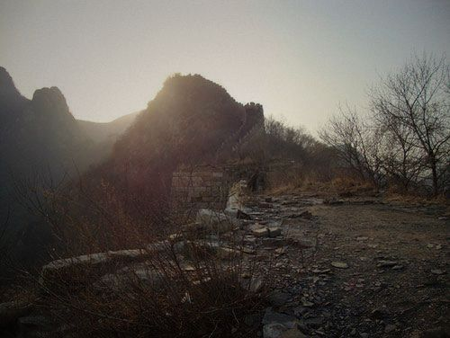
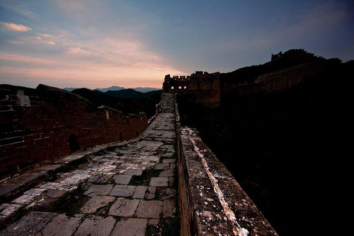

# 圣山

**我看见山道上的树叶被风吹过连成一片，便欣喜得像儿时那样一蹦一跳。温暖的春天消失时，耳畔响起了沸腾的声音，一如七月漫山的蝉鸣，炽烈的盛夏又把眼前摇曵的影子拉个老长。脚下的石阶软了，成了初秋被雨浇湿的田。我见那田开在山坡上，周身又裏紧了坚硬的严寒。我还能隐约记起那年冬天的节景：哥哥跑远了，我想追上他，便跌跌撞撞走进大雪深处，走不了几步，冬天也就结束了。**  

# 圣山

## 文/倪舸（University of Delaware）

 

我努力试图爬上沙发，对面电视机上的雪花屏闪烁不停，让人心烦。我抬头望望，椅背成了一堵墙橫在面前，被忽明忽暗的电视闪光一照，耀武扬威，俨然一副不可逾越的样子，让我不禁反思自己是如何从上面跌下来的。

偶然间我回忆起父亲。那是一次攀登荒野长城的旅行。站在最高一处烽火台上，我眺望着脚下重叠的山峦与星罗棋布的城垣。父亲拣起一块砖，奋力掷向烽火台的顶端，松动的土石哗啦作响，坍塌了不小的一片。父亲抖抖袖口，轻蔑地朝杂草丛生的废墟扫过一眼。他说那些如今已叫不出姓名的皇帝总妄想站在神坛的高处，享受香火，俯视太多的大地与山川，又用最为怯懦的战栗与荒唐的自信建起了这恢宏而丑陋的墙，自认庙堂无忧，国祚万年。

谁知这墙如今化了一摊可笑的垃圾，又有那样多可忴的人们去仰视它，保护它。北方民族也引以为荣，如同他们的先祖越过这墙的情景。墙被烙进教科书里，只因这垃圾建了千年，又存了千年。

父亲虽嘴上这么说，却也是爱这堵石墙的。他可以背着画夹对这荒山中的蠢物消磨掉一整个下午，再饶有兴致地举起画板自我陶醉一番。在他的笔下，山还是山，墙还是墙，只是那些难看的色彩堆在一起，扭曲杂糅，比绵延在山中的丑陋多了几分随性的轻佻，却着实令看官们心生压抑，像是抓来一把泥土塞进嘴里咀嚼，土腥味中还能咂出些隐隐的甜。正是这股不祥的甜味令人难以捉摸，分不清那究竟是土石中蕴含的铁，亦或草木生灵那仅有的一点血。

我还在地板上挣扎，尽可能不弄出声响。这需要很大的耐心，我不希望吵醒邻屋熟睡的哥哥和嫂子。挣扎中的耐心，像是小时候在母亲的逼迫下吃干凈自己盘中的胡萝卜，然后她紧皱的眉头会舒展开来，从口袋里掏出一把水果糖奖励给我。这真是令人恐惧的事情：胡萝卜让人厌恶的怪味尚未在舌尖消散，糖果的甜蜜口感又粘在牙槽上挥之不去。我惊异于自己为何不会马上呕吐出来，反而在阴森的回味中屡屡快速吃光那碟萝卜，等候下一刻即将被蹂躏的清爽滋味，乐此不疲。

母亲紧锁的眉头停留在了我六岁的那年。有一天父亲带回一个陌生的女人，母亲便悄无声息地离开了。没有法庭上的对峙，也没有愤怒与儿女情长下的泪水。她走得很干净，此后也没了音讯，仿佛根本不存在一般。不久，衣柜里同样陌生的香水味弥漫在整个房子里，母亲留下的猫便不再进食，几天后我发现它腐烂的尸体挤在冰箱下，尸臭混合着昂贵的香味不经意中沉淀在食物上，每天我都见到女人把汤匙送到父亲口中，父亲咕咚一声咽下，津津有味。

女人带来一个孩子，年长我五岁，我称他为哥哥。哥哥的出现令我全然沦为父亲倾泻牢骚的靶子。父亲从不发火，只是喋喋不休中用轻蔑的目光瞟过一眼，我便成了那漫山散落的城砖。我依然坚信父亲虽嘴上这么说，却也是爱我的。他可以因为我在考试中的失误对我抱怨一整个晚上，甚至放弃了与那女人共度的美好时光。女人比母亲长些年岁，她不会强迫我吃下任何厌恶的东西，父亲喜欢她笑时露出的牙齿，还有眼角拧得乱七八槽的鱼尾纹。她来后家中不乏笑声，我从门缝中窥探到一点完全属于他们的生活：她与父亲蜷缩在大床的一边，女人笑着对父亲拿来的画指指点点，父亲笑着吻了女人，未了，他俩一道，大笑着把画揉了。

我曾一度羡慕那个被我称为哥哥的人。他几乎是我的反义，高大健硕，孔武又不乏阳光。他常在午后坐在窗边远眺北方的群山，那也是父亲曾带我攀登长城的地方。这样发呆的样子在我看来可谓庄严，像一尊石像一动不动，日复一日，准时准点。我曾鼓起气询问他为何如此，他的回答很简单：不知道。没有父亲抖落出的一套大道理，当然，我明白那谈不上什么道理，不过几句主观臆断，再撇一把惺惺作态的喜悦或悲观。＂不知道＂囊括了太多东西：喜欢与憧憬，或者无分喜好，仅仅是消磨时间的习惯。

哥哥终究被我吵醒了。

我的脸有些发烫，自己仰面躺在沙发与茶几之间，动弾不得。电视上还是一片雪花，哥哥的脸在跳跃的白光下棱角分明。他弯下腰，轻轻把我扶上沙发，又小心翼翼托起我萎缩的双腿，放在垫子上，缓缓为我盖上毛毯。嫂子也醒了，站在走廊上发怔，直到哥哥唤她过来。

嫂子的确不算是漂亮的女人，她身材略胖，鼻翼两侧还有少许黑斑。哥哥中学毕业的那一年，父亲与那女人双双死于画室的大火。父亲带女人参观自己的收藏品，聊到兴起，一把将烟头按在溢出的清漆上。他们焦黑的残肢似乎熔在了一起，有些像窗外的老树杈。我看着医院大门上扎眼的红字发愣，哥哥哭着跑开了。雪下得很急，下午四五点钟，阴云完全淹没了天空。哥哥跑远了，我想追上他，可眼前全然白茫茫一片，从眼底蔓延开，直到大街小巷变得模糊起来。我很困，不记得自己在什么地方，便跌跌撞撞走进大雪深处，走不了几步，脚下也就没有了路。我记得嫂子是我清醒后见到的第一个人，她是不远便利店的员工，说远远就看到我在积雪中打转，走近才发现我倒在雪中。从那一年起，我再没有站起来过，哥哥却得到一个妻子。

我与哥哥交谈不多，但我知道他没有就此消沉。他变卖了一处父亲的旧房子，便与认识不久的嫂子一起开始为了生计奔波。或许是心中有愧，哥哥为我提供了无微不至的照顾，我知道他不必如此，嫂子也明白，只是她的怨恨只挂在脸上，时而阴沉，却不吐露只言片语。家中又成了两个不同的世界，我想像儿时那样把门打开一道缝，却再没有这样的胆量，当然，更别提拖着两条残疾的腿。我要做的只有坐在厅里，把电视节目从晨报看到雪花，享受哥哥与嫂子一日四次的精心照料与无言的尴尬。

嫂子弯下腰，替我系好鞋带。我试着晃动自己的鞋子，那东西像两只面团，神气地扣在畸形的脚面上，就像一对滑稽的蒲扇。

＂我们要出去吗？＂我瞧了瞧天边微微泛红的云。

＂是啊，自父亲去世后，我俩再没有去过那山吧。＂哥哥的眼睛眯成一条缝，嫂子在一旁搓着手指，长长的头发盖住了眼睛。

＂我？这个样子？＂

＂我们可以从小路把你推上去，今天的日出会很美。＂哥哥转身去拿外套，嫂子拍拍我的肩，示意我放松些。她从不这样。

轮椅在石子上的颠簸，就像儿时的蹦蹦跳跳。我喜欢看大风吹过山林的样子，一层层密实的树叶被连成一片，浪潮一样上下起伏，甚至可以听到海的声响。天色还是黯淡的，细碎的红沫透过云层，像刚刚燃起的林火，把星星点点的热随风播散。我能感到血液在向腿涌去，如同与父亲一同来登山后的酸麻。

＂你知道吗？＂哥哥指着盘在山间的古城墙。那是父亲曾带我来过的地方，半坍颓的塔楼斜斜插进土里，暸望窗被沙石掩埋了一半，那是活脫脱一只瞎了眼的老狗，卧在高高的山上，对着它从未拥有过的世界呲牙，以显示自己是一只猛兽。尽管它在强健时也不过打赢几场与其它野狗的厮咬，尝过一两口粘着肉的骨头。

＂我一向讨厌那堵墙。＂哥哥的眼睛直勾勾瞪着逐渐升起的太阳，红色漫过了山尖。＂在几年前你问我为何看这山，那时我只回答不知道，还记得吗？＂哥哥的眼神像极了父亲，冰冷而残酷，把自己的一切情感完全由眼睛迸发出来。我冷静地接受了哥哥这一反常态的举动，似乎是早已预料好的样子，当然，起因与结局我都看不到，我希望走开，可不知哪来的力量告诉我要等下去，也许是因为今天的日出真的会很美，或者，是因为我只是个没用的残废。

＂兄弟，这个世界总有些坎是无法逾越的，就像爸爸妈妈的罹难。可还有些阻碍是必须铲平的，也许为了生存，也许，为了更好的生存。＂嫂子代替哥哥推着我，哥哥两步跳上一个土丘，把一块石头使劲举过头顶，又猛地扔下，直滚到我的脚边。＂你还是站不起来吗？＂他的音调突然降了下来，变得温暖而柔软，一轮红日在他身后喷薄而出，把这个缈小的人连同他脚下坟包似的土丘映个熠熠生辉，如神一般。

＂兄弟，其实人生......＂

我失去了最后一点听他说下去的兴趣，只见他的嘴角猛烈抽动着，想要喊出些什么。我发觉身边的景物在迅速移动，回头看看，嫂子正在把我推向一处陡崖。我知道自己会看到这一刻，就像小学每天回家时都有一列火车在家门前的岔道上呼啸而过，就像母亲每周三都要逼我吃掉那碟萝卜，就像我知道哥哥每天都要望着这座荒凉的石山，就像我知道父亲葬身火海，而画室的安全门根本没有烧坏.......

肥胖的嫂子像一砣铅，带着空荡荡的轮椅，一路冲进了深谷。哥哥扑来抓起被自己丢弃的石头。我感到右额像被车轮碾过，踉踉跄跄走了几步。我还是愿意相信哥哥是喜爱这山的，他终究绊倒在那个坟墓一样的土丘上，一旁歪歪扭扭倚着棵枯死的树。那似乎是父亲乌黑的手，手指散开，试图扼死山巅那只瞎眼的狗。

我放下手中被砸成两半的石头，把哥哥的尸体慢慢推下山沟。现在他与嫂子到一处去了，或许还能见到父亲，他搂着那个女人，笑着接吻，笑着把画揉成一团。不知怎么我竟有些想哭，就像不知怎么我在轮椅即将跌下山谷时站了起来。无奈，我刚一张嘴，却不知不觉笑了出来。

我从未像现在这样走过，迈着步子，仿佛跟随着进行曲的节奏。太阳完全升起来了，我看见遥远的地方有零星的游人沿山麓攀上。我看见乱石堆里有了分明的四季：温暖的春天消失时，耳畔响起了沸腾的声音，一如七月漫山的蝉鸣，炽烈的盛夏又把眼前摇曵的影子拉个老长。我的视线开始模糊，脚下的石阶软了，成了初秋被雨浇湿的田。我见那田开在山坡上，周身又裏紧了坚硬的严寒。我感觉一道冰冷的溪流沿着额角蜿蜒，天空愈来愈暗，是记忆里的大雪。我跌跌撞撞走进大雪深处，走不了几步，冬天也就结束了......

 

（采编：楼杭丹；责编：应鹏华）

 
