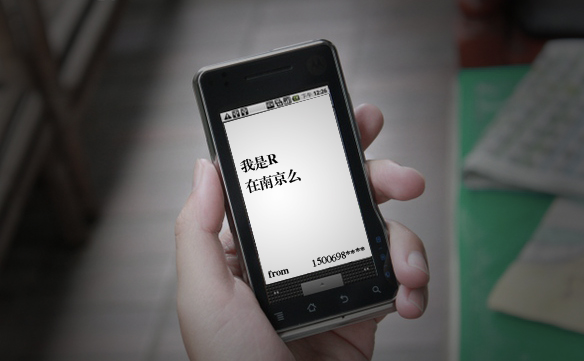
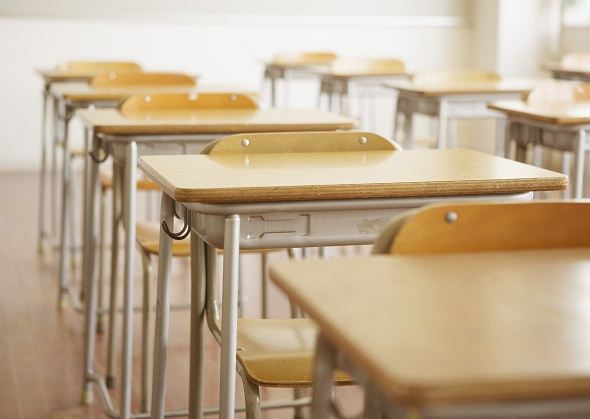
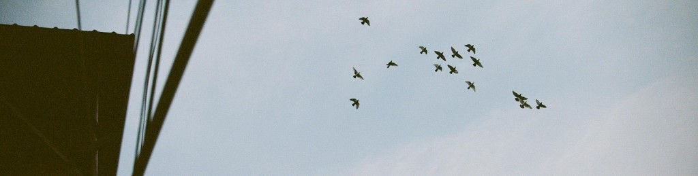

# 在教室做的最后一次

一

快下班的时候，接到一个陌生电话。

我一开始以为又是大K介绍给我的那个非主流少女，就忙不迭地把手机切换到“会议”模式。自从上个月在大K组织凑人的牌局上，他装模作样地把我引荐给这个小女生后，几周之内每天晚上轮番遭受短信电话的不间断轰炸。后来发现我不怎么搭理她，她还会换着号码偷袭我。不知道她是真的办了这么多卡，还是用了什么更换号码的手机软件。

写字楼窗外暮色低沉，黑云滚滚，晚霞和乌云混织成一股看上去非常邪恶的颜色。估计又是一场暴雨。南京已经有一个多星期没见着太阳。今天早上淅沥小雨，又忘了带伞，看来下班得抓紧了。

收拾停当了拎起书包就往楼外冲，希望在冲进地铁之前雨不要下到过分的程度。掏手机看看时间，发现有一条短信，是刚才打电话的那个号码发来的：“我是R。在南京吗？”

****

#### 二

毕业进设计院一年了，似乎每天都在加班、画图、陪甲方喝酒中度过。像这样和一个女生一块的记忆，早已不知消散到何方去了。

R曾经是我女友，也是我的高中同班同学。她在大二去加拿大之后，我再也没有见过她。后来的暑假她也年年回来，不过总是不巧，我们每每不能同一时间都在这座城市，所以每次同学聚会都没有碰上。

我没想到她这次会来主动联系我，所以刚开始还有些慌乱。我拿不准我自己想不想见她，所以一开始还打算装没看见，等到夜里一两点再回个“刚看到不好意思明天出差真不巧下次再聚”的短信。后来想想晚上左右无事，何必腌臜。就回拨了过去。她说她刚回国，晚上有空出来吃个饭。

我以为一大拨人，结果只我俩对坐。我讶异问其缘故，她嗔笑一声，啪一巴掌打在我胳膊上：怎么，想见你个老情人，不可以么？

烤肉的嗞嗞呀呀中，我抬眼相看，她没什么变化，不施粉黛，少着颜色，清丽一如记忆中人。我说：我发现你像一个人。她一挑眉毛。像我今天刚下的视频女主角，我坏笑一声。“切”，她啐我一口，上齿轻咬下唇，齿若编贝，晶莹发亮，唇如激丹，娇艳欲滴，当真好看得紧。

#### 三

我不是故意调情。我今天的确下了一个视频，两个高中生在教室里做爱。刚开始在论坛上看到截图时我就觉得那个女生很像R，急急开动搜索找视频。后来随着迅雷叮呤一响，点开细细一瞧，的确很像。鼻尖小巧，皮肤白腻，胳膊肘那里惯于洇出红潮，头发油光水滑，黑里泛着少许棕黄。

我当时一边快进一边笑想，这个傻小子怕是像我当年一样，觉得平生至乐，莫过于此，看着好端端如此颜色的女生躺在自己身下，真是临表涕零不知所云，心头发紧，想要一辈子对她好。

“你不信啊，就在我笔记本里，一会你自己看像不像。”我故作正经地说。

“我信我信，你什么样的片子下不到。”她白了我一眼。我恍然间明白了，哈哈一笑。当年在一起时我找到一个日本网站，你上传一张女生正面面部照片，网站能自动匹配出最像照片的女优并按照相似程度列表。大一一年我照着list，东搜西找，下完了所有表单所列的最像她的十个女优的全集。有的女优太偏，总是在夜里才有一二十K的流量，我天天大半夜从宿舍厕所偷电挂机下载。然后放假回来她到我家来，我们锁上门拉上窗帘一起看，然后评价到底长得像不像她。

想起那时她枕在我怀里的姣好颜色，我拿着直尺量她眉间距的傻逼模样，心头不禁又是一片涟漪。

#### 四

吃了饭出来，雨还没下下来。她说要去高中转转。我说今天周六，屁人没有，去了干啥。她执意要去，只好相陪。

一路上我就开始瞎想，不会我们俩一会儿要模仿一下视频里两个高中生吧？老实说这种高难度动作，高中时我俩都没胆子干，今天难道？

这几年虽然没什么联系，但我们的朋友圈交集在那儿，所以她的消息总能传过来。她进了UT，读数学，和她爸的一个生意伙伴谈恋爱。在校内上，偶尔看见她传的游玩照片，我总是在喝醉酒的夜半点进她页面细细搜寻她的每一张照片，找到过那个貌似她男朋友的“生意伙伴”，细皮嫩肉眉清目秀的，看上去三十多岁，倒也和她般配。

我虽没说过这辈子非她不要之类的屁话，但自从她走后，我的确也没再找过。

今天的确是四年来第一次见她。

#### 五

传达室看门的保安不让进，说是要有老师的电话知会才放行。我只好照着保安值班室的号码表打电话给班主任，装作有一大群同学想进校看看的样子。老太太和保安电话里打了招呼，校门口的自动门才缓缓对我们打开。

“你刚才和老太虚报了那么多名字，干吗单单不提我呀？”走在树下，她转过脸来，娇嗔地问我。

刚才在烧烤店喝了不少清酒，她脸上的红潮渐渐泛了上来，在校园里昏黄的路灯掩映下，真是百般动人，分外娇羞。我心口登时暗潮涌动，想把她一把拥入怀中。但我还是咽一口唾沫，不动声色地笑笑：你要回学校干嘛呀，是不是要到教室里和我干坏事呀？你男朋友能力不行，要我仗义相助？

她杏眼圆睁，咬着牙冲着我的脸，朝我胸口重重地捶了一拳：一点长进都没。

她吹气缕缕皆尽喷到了我的面前，我实在是想一口亲下去。但还是轻轻拨开她的手，慢慢朝前走去。

#### 六

我们爬到当年高三我们的班级，门牌班级早就换了，门窗也锁得结结实实。俩人瞪着黑黢黢的教室，说了半天闲话。这时我酒劲有些上来了，看着她趴在窗户上，一头黑亮的长发，不觉情难自已。我一把拉过她，想找一个没锁的教室进去。可惜每个教室大门都纹丝不动。

“我靠，现在的90后小朋友做值日也太负责任了吧。这让我们这些寻觅犯罪场所的学长学姐情何以堪呀！”我轻声骂道。她咯咯一笑，扭开我的手掌。

想起高中时，有时晚自习下课，如果是我俩一人做值日，另一个也磨磨蹭蹭不走。等到大家都走光了，我们关了灯锁了门，倚在门后面摸摸索索。那时我把脸埋在她的头发里面，闻着那种好闻的洗发水味道，双手轻轻地捏着她的胸，每次都想沉沉地睡去。每次等到巡查的大爷晃着一大串钥匙的声音传过来，我们才匆匆稍整衣衫，夺门而出。

校园里暮色氤氲，空气里浮动着雨前特有的气味。我们从楼上一路推门到楼下，整栋楼都没有一个空门。最后推到临着校园后门口的一个平日上补习班的教室，吱呀一声门开了。

#### 七

“你要干嘛？”她轻轻把手从我的手中抽出来，微微娇喘地问。

我静默了一会，翻身褪下书包掏出笔记本：“没什么，我想给你看那个视频，的确和你挺像。”

她卟哧一声笑了，双脚一跳，坐在一张桌子上。

“根本看不清脸呀。”她端着屏幕，睁大眼睛仔细瞧着。

“我不是说脸像，其他地方也像。”我有点喘了。她没再吱声，静静地看着，嘴唇一张一合，就着屏幕盈盈光亮，我依稀辨别出她唇形说的是“流氓”。

“我是说她的衣服，你看，我记得你也有一件这样的。”我把头凑上去，甜腻的发香，和记忆中的一样。

高中时每次到我家做爱，我最喜欢她穿那件白色的线衣，因为那件衣服穿在她身上显得特别的清纯可人。然后我就把衣服掀起来罩住她的脑袋，露出她光溜溜怯生生的胸脯。这样的造型总是特别刺激我的视神经，每每使我奋起神威，提枪掉马，鏖战不休。

“他们说的是哪里话？”她盯着屏幕问。

我更不答话，从她手中夺过笔记本，一把把她摁在课桌上。

#### 八

套子是我从书包夹层当中摸出来的，那还是当年大一的时候我们一起去超市买的。也不管过没过期，撕开再说。

她平躺在课桌上，和视频里的那个女生一样。耸动中我抬起头来，看着被我拉上的窗帘幽暗地映着少许夜色的荧光。

我记得高一刚注意到她的时候，她就坐在这抹蓝色的窗帘旁边。我上课老是偷眼相看，她托腮看着黑板，鼻尖和马尾，一前一后，一大一小，划出两条好看的弧形。蓝色的窗帘就在她脑袋后面舒缓地浮动着。每次我都恨不得支起画板，调好颜料，旁若无人地对着写生。

我忽地抱起她来，提溜着裤子皮带把她抱到当年她座位的那张桌子上去。她低头明白了我的用意，娇呼一声，死死地抱着我的脖子。我精神大振，浑身肌肉绷得紧紧的。

她的浅吟低唱中，忽然好像夹带着什么字句。我停下问道：你说什么？她以臂遮面，久久不语。我用鼻子拱开她的胳膊，一边咬着她的鼻子一边继续。

“我说，我今年毕业，年内要结婚了。”她咬着牙关，不再哼出声来。

我愣了一下，叹一口气，轻描淡写地说：“这个剧情很恶俗。”然后用力地掐着她的胸口继续着。

#### 九

我们赌气似地，谁也不发出声音，只有动作无言地泄露着我内心的情绪。

我想起我第一次给她写情书，第一次牵她的手，第一次给她手工画礼物，第一次亲吻，第一次上床。我想起毕业那年夏天我们疯狂地耕耘，她大二飞走之后我夜夜酗酒，我想起每每夜深人静时，我在屏幕后面翻看她照片时的故作镇定，以及百爪挠心。

是不是每个人都有一个前女友，都会在你门前冷落车马稀的时候，老大嫁作商人妇？

昏暗的夜色从窗帘后面渗进来，我低头看着她的躯体，还是和我熟悉的那一般光洁。胸口白皙的皮肤上被我掐出了几道红印。小巧的乳头，依稀临去时的模样。我苦涩地笑笑，伸过头去尝了尝。拨开她的胳膊，看见她眼角泪痕划过。

恍惚间想到，她那位细皮嫩肉的三十多岁大叔，是不时也曾经在这样的角度，用这样的眼光俯视着她？而未来漫长的岁月，他是不是仍然要一次又一次在这样的角度，用这样的眼光俯视着她？这样的时候，他们会说着怎样的调笑？他们会用着怎样的姿势？那位大叔会有面对着她趣味索然兴致阑珊的一天吗？就像假如有个她和我在一起的平行宇宙，我也终究不可避免地堕入的轨迹？

心里突然充满了不耐烦，我忍受不了自己的生活不可避免地堕入庸俗肥皂剧。只能把这股无明业火，转化成动能挥洒一尽。

#### 十

“你们不会在国外办吧？”快到地铁站了，我禁不住问道。

“正式的会在他家那边办，不过南京肯定要请大家吃饭的。”她以若无其事的口吻说道。顿了一会，“你来吗？”

我不免走神，想起如加那一篇《燕燕于飞》的结尾：“再不然，卿若嫁，莫发喜帖与我，可好？”

我摇头笑笑：“你怎么回家？”

“哦，我开我爸车来的。你还住你爸妈家么？我送你？”

“不用了，我坐地铁直接到了。”

送她开了车走，我转身踱向地铁站。头顶突然一个炸雷，顷时间风雨飘摇，暴雨倾盆。我虚弱地捏了捏拳头，全然无力阻挡这俗不可耐的终结。

 

（采编：麦静；责编：黄理罡）

 
