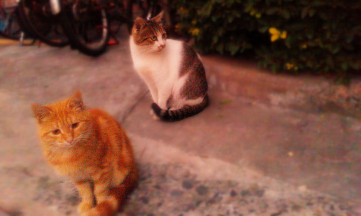
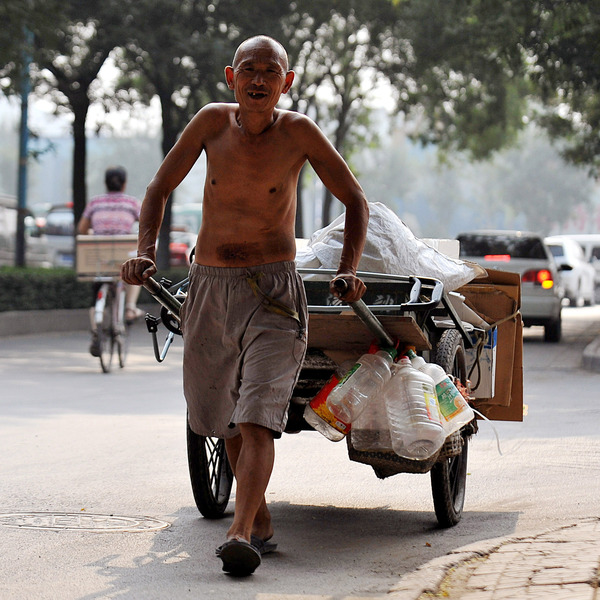
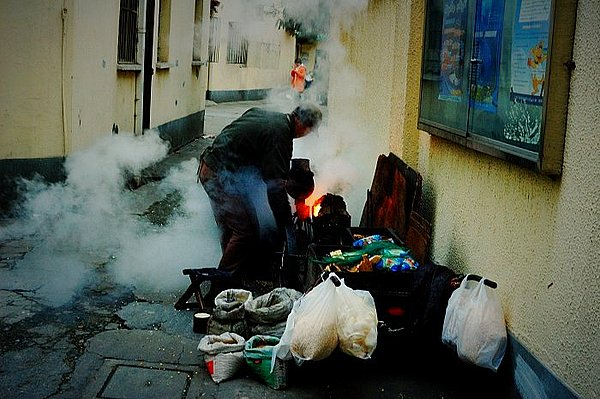
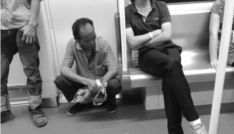

# 城市动物

** **

城市本是人的聚落，可也住着很多动物。

比如说校园里的野猫。上海的高校校园里，总是有很多野猫。那么为什么会有这么多野猫呢？从猫的本身来说，据说喵星人天性不羁，容易变野，不像汪星人忠诚于人类，更甘愿当宠物。而学校校园，也有一些特定的条件适合野猫栖息。我们来列个一二三：一个是校园里绿地较多，灌木丛啦小树林啦，适合猫找到隐蔽的容身之所；再者学生对猫友善，我有次在校园里看到一只猫爬到树枝上下不来，很多学生在下面着急上火要搭人梯把猫救下来，后来搞了半天才发现，人家猫不是下不来，而是看到这么多学生在下面，吓得不敢往下跳，但是同学们爱猫之心是好的；还有就是校园的管理者也对猫持一个宽容态度。我们在城市的其它社区里也可以看到很多猫，比如公园、小区，但是这些猫面临各种风险，重者被抓去做成路边摊的羊肉串，轻者被从睡梦中抓出来拉到宠物医院去阉了。当然喵星人认为自己占领了校园，才在校园里入乡随俗，随遇而安，最后入土为安。野猫真的在校园里肆意妄为的，你去逗它，如果手里没拿食物，根本对你不屑一顾，而且高贵冷艳地喵喵之。当然校园里的野猫，也要叫春、交配、繁殖，一代又一代。所以我们在校园里来来去去的时候，和猫的生活并行，这里也是他们的社会世界。当然猫的世界不是独立的，因为校园没有条件形成一个拥有完整自然食物链的生态，猫活着主要靠人的施舍。这种施舍一种是刻意的，比如有很多喂猫的，还有一种就是不刻意的，就是垃圾。但其实这些猫本身就是城市的垃圾，是人的垃圾。

可是城市中，同样有很多人，他们的境况和这些野猫相似。

你有没有觉得，每次你路过一些垃圾桶时，都有拾荒者在那里埋头翻拣。原来有朋友跟我说中国没有垃圾分类，垃圾处理效率太低，那得浪费多少资源。我说中国城市垃圾处理方面的确落后，但是中国的垃圾即使不分类在被环卫处理前也会经历一道再循环筛选，那就是拾荒者。拾荒者可以说是疯狂地寻找垃圾里面可以卖钱的东西，而且基本找遍了城市的每一个垃圾箱。我还经常在地铁上看到拾荒者背着大袋子挨个站找瓶子。在学校操场上踢球经常饮料还没喝完就有大叔大妈上来向你讨瓶子。真的是拾荒者太多，垃圾不够用了。

我经常去细细打量这些拾荒者，这些拾荒者里面，只有一小部分是衣衫褴褛的流浪汉，这些可能是靠拾荒谋生的，而很多则是衣着虽然简朴但干净的城市贫民或者外来打工者阶层。很多拾荒者都骑着自行车，戴着口罩和手套拾荒，他们就不像是只靠拾荒谋生的，可能社会还给予他们一项待遇微薄的营生。但是可想这营生很是艰难，因为生活窘迫到什么程度，才会让一个人去翻拣垃圾箱呢。

我原来住的寝室楼，一楼有个看门的宿管阿姨，上海人。宿管阿姨的生活是很无聊的，无聊到这楼里每个学生的样子她都能记住。宿舍楼前就并排着几个垃圾箱。每次我路过，都会有人在那翻拣垃圾。也就经常看到这个阿姨站在门口边晒太阳边装作若无其事又边偷偷看着拾荒者翻拣。这个阿姨是不会去拣垃圾箱，但是我们每次拿着寝室的垃圾袋准备扔到垃圾箱时，阿姨都会问：“有没有瓶子，有的话就给阿姨。”后来我们就习惯扔垃圾之前把饮料瓶拿出来扔到阿姨准备的一个纸篓里。宿管阿姨也成了一个拾荒者，只是她的岗位和职责给了她一点便利，让她不用去明目张胆地翻拣垃圾箱，让她保留了一点自尊。这个阿姨对学生一直很好，我们在楼前草坪上晒被子，都是这个阿姨主动给翻面，天黑了就主动给收进来。

很奇怪的是，总有一些人的生活是被“隐蔽”的状态，你总也不知道这些拾荒者都是干什么的？也不知道晚上校门口冒出那些黑暗料理界的商贩，白天又都在哪里？就像你总也不知道那些校园里的野猫不趴在宿舍或者教室门口晒太阳的其余时候，它们都到哪里去了？我们也不会关心它们到哪里去的，在学生的聊天里会谈到校园什么地方哪只猫好玩，但绝对不会谈到哪只猫在哪里躲雨。这些问题，跟我们日常的语境没有任何关系。仿佛他们就没有被设计到我们的日常语境中。仿佛这些拾荒者、摆地摊的、下岗工人、送快递的小哥，他们的生活就没有被设计到主流的话语体系中。这样我们就很难与他们“对话”。CCTV试了一下，问道：你幸福吗？被问到这个问题的大学生，都还可以略带调侃地回应一下，但被问到这个问题的所有底层人物，都无法正常回答。因为无法“对话”。不是一个话语体系里的。他们也会看新闻，也会接受这些主流的话语和符号，但是，这些都不属于他们。新闻联播里的幸福生活不属于他们。大街上的广告也不属于他们。

在地铁里，遇到农民工，拿着大包小包，水桶扁担之类的，是很常见的。这个时候，正常人的做法，都是离得远点，不是说他们有任何厌恶之类的情绪，反射性地就想离得远点。什么叫正常人？在地铁上，一动不动盯着手里的电容屏，耳朵上带着耳机，旁若无人的，就是我们正常人。我觉得，其实像我们这种正常人，天天坐地铁通勤的，才是这个城市的底层。而那些不属于地铁的那些农民工，他们甚至连底层都不是。我经常看见，夜间还算空荡的地铁上，上来一个看似干了一天活的农民工小伙子，他衣着邋遢，被油漆抹得像一幅当代艺术馆里的抽象画，一进车门就到车厢连接处坐着而不是坐到座位上。他盯着对面的几幅广告，一个是曼秀雷敦的唇膏，一个是淘宝商城，一个是雀巢咖啡，当然上面坐着个装逼的韩寒，一个是levi’s的几个翘臀洋模特，但是这些广告都跟他无关。这几个都是城市里最最普通的商业广告，我们非常熟悉他们的符号意义和表达方式，虽然我们不一定消费这些东西，但是我们可以与之“对话”。但如果你觉得这几个广告跟你无关，那真的只有两种可能，第一就是你太有钱，天天开兰博基尼出入不知道地铁怎么买票进闸机，当然也没进过屈臣氏也没喝过速溶咖啡，跟levi’s唯一的关系就是上过他们的模特。但是这种奢侈生活我们在主流话语中是看得到的。还有一个可能就是，你太窘迫，进入不了这个社会的流行象征体系，你无法跟这个社会“对话”。而这个社会已经不要你了。食堂里的饭再便宜再烂，野猫也没有校园卡。

这个时候，他们到底幸不幸福？所有底层受访者被问到这个问题，都反应不过来。这是因为他们不幸福吗？不是，因为幸福，就对他们来说，不是问题化了的。谋生是问题化了的。活着，谁关心幸福啊。

这个庞大的群体，虽然是人，但是也进入到我说的城市动物的范畴。已有的给他们的比较好听的称呼的“边缘群体”，但是实际上，“冗余群体”这个称呼更能准确揭示他们的真正处境。齐格蒙特鲍曼把他们叫“废弃的生命。”

何为冗余？为何冗余？现代化的所有体系，都是向高效简洁的方向发展。实际上，越整合，越会有冗余。 就像你看不出自己房间有多脏，但是当你收拾了一下，就会不知不觉整理出两大袋垃圾。人的冗余，就是由于人口无法被全部整合到现代化的产业体系中造成的。比如举个简单例子，我们宿舍门口的阿姨，她们是怎么来的。好好的干嘛要当宿舍阿姨呢，钱少得要死。她们很多都是下岗工人。我很爱讲这个故事，从前，上海有国棉一厂到国棉三十几厂，这些企业里的职工，都在“单位制”的庇护下，过着无忧无虑的生活。但是后来随着产业结构调整，这些老国有企业都被淘汰了。职工下岗了，后来她们就成了便利店阿姨，宿管阿姨，钟点工阿姨，居委会阿姨，保安大叔，协管大叔等等。这些工作的特点就是，钱少，事少，没有技术含量，也不是体力活。很大情况下，他们的这些工作，是施舍给他们的。这个事情上，其实我们还看不太出来，因为他们职业都是有用的。那么我来找一个更明显的例子：地铁安检。上海地铁，好像北京也是，都要安检。可是坐过的都知道，这个安检有一点用吗？根本就没有。没有任何人理那些安检员，安检员也是在敷衍了事。所以渐渐地他们就成了很尴尬和可笑的存在。那么地铁根本不需要安检，为什么还要搞这些安检员呢？就是为了给他们工作。而且这些安检员里不仅有大叔阿姨，还有很多年轻人。这些年轻人是哪里来的，好好的干嘛不去“应届生”上面找工作，那是因为他们没上过大学，当不成白领，不会考公务员，也没地方打工，因为他们就是上面那些下岗了的阿姨和大叔的孩子。

而且说到外来打工者，他们也看起来不像冗余，天天累死累活地在工地搬砖或者在生产线上做一枚螺丝钉，一点也不冗余。其实，他们已经经历过一次被淘汰了，我们在分析农民工问题的时候，首先会提到农村劳动力过剩。就是他们都是农村过剩劳动力，才会到城市里打工。那么这种过剩，就是被现代化农业所淘汰。在城市里他们虽然找到了打工的机会，也许他们的工作对这个城市来说是很必要的，但是他们的“冗余性”最高。也就是说，如果继续整合，他们肯定会被最早淘汰。如果哪一天，机器人普及了，机器人能搬砖盖楼，那整个同济都是冗余了，机器人甚至都能打官司了，那整个华政都是冗余了。

我上面提到的这些群体，他们虽然还可以工作，但是他们仍然是被甩出社会的一群人。我们的社会，虽然艰难地把他们整合进来，这种情况更像施舍。过剩的人就像垃圾，但又不像垃圾一样是可以处理的。社会的伦理道德还不能接受完全抛弃他们，就像我们对待校园里的野猫。但是他们又跟有钱但又懒得工作的失业者不一样，他们虽然工作，但是他们无法进入主流象征体系，我们的核心象征是为最有效的整合群体服务的。所以这些人渐渐地就隔离开来了。

前面从工作上说，是一种老套的路径。这些冗余的人，被隔离开，是因为他们不能消费。虽然他们也会消费，但是不善于消费，是“残缺的消费者”。而实际上，“消费社会”理论诞生以来，我们才知道，我们是根据自己的消费来找到自己的位置的。所以我们看到一个广告，如果是适合自己的消费品，而且我们也很想买的话，我们应该庆幸，我们找到了自己的位置。消费根据“品位”划分等级，也就是我们这个社会的等级。如果完全不能消费的人，就找不到自己的等级，也就不能进入这个社会。

城市里生活着很多动物，校园里的野猫，从我们对动物的认知来说，他们过得还不坏。而且渐渐我们把他们当成了城市生活的点缀，不觉得它们是讨厌的。可是作为把秩序和进步作为追求的现代社会呢，我们该如何对待正是因为秩序和进步而产生的 “冗余人”呢？他们自己又该怎么办？我只知道我们对待垃圾的态度是非常明确的，如果不能再利用，就必然除之而后快。这个“除”就是不想看到他们，扔到哪怎么处理事不关己。而事实上，我们也已经快看不见他们了。

 

（采编：周拙恒；责编：周拙恒）

 
