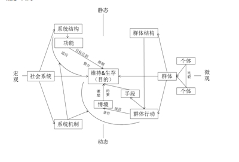

# 城市社会边缘群体的生存机制 ——以对北京站的实地调查为例

###问题的提出和意义 

北京站是全国铁路枢纽之一，同时也是北京的重要窗口，素有“首都迎宾门”之称。然而正是在这个“迎宾门”之中，有着这样一群特殊的人：他们虽与过往乘客处于同一空间中，其活动场所、交往范围却俨然与之构成两个不同的世界，没有多少人愿意去关注他们；处在繁华的现代都市，行走在文明的窗口，可他们却仍旧过着最原始的生活，行乞，或是拾取站内外一切可利用资源换取微薄的收入，甚至是直接拾物充饥，其所做的一切都只是在为生存而奔波，他们就是北京站的社会边缘群体。这样的生存方式决定了这一群体的脆弱性，其成员备受生存困境与社会排斥的双重煎熬，他们唯一可以依靠的就是彼此间的互助、同属底层的清洁工的扶持和寥若晨星的善行。

孙志刚事件后收容遣送制度得以终结，2003年6月20日，《城市生活无着的流浪乞讨人员救助管理办法》（以下简称《救助管理办法》）颁布，标志着我国社会救助政策由社会控制型向社会治理型转变，体现了国家和政府对弱势群体的人文关怀（李迎生等，2007a）；随后，2008年8月，《中华人民共和国社会救助法(征求意见稿)》的颁布更表明了国家对边缘群体现象的关注。但从总体来看，我国当前的社会救助制度还尚不完善，执行异化现象依旧存在，同时其实施过程中，在对象瞄定、救助资金筹集等方面存在许多问题，因此在边缘群体生存问题的解决上效用有限，所以，如何让这一群体有尊严地生存下去，就成为一个十分现实且必须解决的问题，如此方能履行这个国家在它成立之初对人民许下的承诺。欲解决这一问题，必须明确边缘群体的生存机制，即在分析其所处社会系统的结构与运行模式的基础上，深入探究这一群体为生存而采取的行动策略，及其所面临的困境，最后根据分析结果提出解决其生存问题的合理思路。

###北京站的社会边缘群体

**社会边缘群体指的是某一社会系统内，因成员异质性存在以维持结构均衡的需要，由处于绝对规模且资源占优的主体人群采取社会排斥等策略强化群体界限，而在实际社会生活和心理上与之形成社会隔离，规模较小、资源相对缺乏并居于弱势地位的人群，这一群体的存在反映的是社会资源占有程度和获取条件的两极分化，且资源占优的一方处于绝对规模。**

北京站作为社区的特殊性，使得本研究的对象较之于社会边缘群体的界定更为复杂：

首先，车站作为一个交通枢纽，一方面为这一群体提供了便利的运输条件，使人与社区的结合成为可能；另一方面，由于经济条件不足，社会网络的同质性较强，因而一定程度上，群体成员较长时间停留于此成为必然，再加上车站运力的局限，使得其在来源地上势必呈现集中性。

其次，车站作为一个公共场所，具有一定程度的开放性，同时站内外人潮涌动的客观因素为边缘群体提供了容身之便，使其能以较少的资源消耗，如通过购买站台票等措施解决住宿问题，这一点对于生活困窘的边缘群体来说是十分重要的。

另外，北京站经济系统发达，各式便利店、饭店遍布站内外及其周边胡同内，自不乏快餐等便利食品的销售点，此外，密集的人流为群体成员行乞和贩卖地图提供了条件，以上均利于该群体获取经济资源进而解决饮食问题，这是其他社区的边缘群体所无法企及的。

结合上述分析，**可得出本研究的研究对象指的是这样一群人：他们因个体或外部因素被迫落入边缘化，栖居北京站及其周围，靠贩卖小玩具、地图，行乞或是捡拾物品和食物等方式维持生存，其社会交往基本上仅限于同群之间，无论是空间或是心理上，他们都被排斥在这一社区的主体之外，处在弱势的地位，其生活困顿，尊严得不到捍卫。**

###调查方法与分析理论

我们引入结构功能论的代表人物、美国社会学家帕森斯所提出的作为社会系统普遍功能要求的**AGIL模式**，来进行对系统维持的模式分析，同时引入默顿的中层功能分析方法，注重经验研究与理论分析的结合，以实现宏观与微观视角的有机融通。而微观层次对于边缘群体行动的分析，同样引入帕氏所提出的行动四要素，即**目的、手段、条件与规范**进行。分析框架如下所示： 

**在具体的资料收集技术上，研究采用非参与观察法和无结构访谈法相结合的方式，以弥补上述两方法在深入性与客观性方面各自的不足。具体来说，对于生活极端困苦、自我隔离较为严重的对象主要采用观察法，其余对象主要采用访谈法；对象瞄定方面，前者自非主动缘化人群，而后者则借由在访谈中设置相关话题加以确认。**

研究自2012年夏起开展，共分两次进行实地调查，首次由笔者所在团队一行十一人共同完成，为其四天，主要以访谈为主，收集边缘群体内成员的过往经历、生存现状和将来的打算等方面的资料，在站内及站外广场共访谈九名对象；次回主要采用观察法，笔者在瞄定对象后对其进行了跟踪观察，意在深入了解其生存方式，有效个案共四名。在观察过程中，笔者曾由北京站内跟踪一名个案至站外的毛家湾胡同内，除了解到其日常生活外，还成功发现一些群体成员的栖居点，其间对于边缘群体内成员之间的关系、生存方式的差异和共性及其面临的困境，有了一定程度的掌握。

 
###边缘群体的生存意义与生存机制

对边缘群体生存机制的分析，目的在于深刻把握其生存的方式及所面临的困境，以最终提供有效解决其生存问题的思路，因此，本研究的核心是边缘群体的生存问题: 

**首先，边缘群体现象作为一种社会事实有其存在的普遍性与客观性。**当资源占优的一方处于绝对规模，并与资源相对缺乏的一方在占有程度和获取条件上出现维持生存意义上的分化后，就会出现社会系统内边缘与主体人群的分立，这样的分立在主体利益维护的客观需要下，因其采取社会排斥的诸种策略而长久难以打破，群体间的界限被不断强化，边缘群体现象由此形成。

**其次，边缘群体现象是社会整合程度的风向标。**在社会运行的常态时期，其整合程度较高，社会流动渠道畅通，分化程度低。这样的社会系统中边缘群体的规模较小，其生活状态也相对优越一些。而在社会转型时期，社会整合程度低，成系统离心力较大，阶层分化严重，则边缘群体现象势必加剧。因此，边缘群体现象在一定程度上可以反映社会系统的整合程度，对这一现象的分析能够为提升系统向心力、推动社会协调运行提供参考。

**此外，在个体意义上讲，边缘群体的存在，**反映了其成员自身所处的社会矛盾对其产生影响的最终结果，无论是财产纠纷或是家庭问题，边缘化结果的产生，即表明矛盾并未升级为剧烈冲突而是转而以一种相对温和的方式化解，这对于社会秩序的维持有积极意义。 

**最后，边缘群体以独特的生存状态和谋生手段为维持城市微观经济系统的运行做出其贡献。**无论是对废弃资源进行收集配置，或是直接贩卖小商品以推动系统运行，甚至是直接通过行乞的方式促进货币流通，他们的存在都不乏其意义。

在明确边缘群体生存意义的基础上，可进一步分析这一群体以何生存，即生存机制的问题：

	
###具体分析从动力和阻力两个方向开展，由经济因素、规范准则、社会关系和物质环境四维度探讨情境因素对于群体行动的影响及群体成员所采取的应对手段。具体如下：

1.经济因素。群体成员多充分利用北京站乘降旅客密集、经济系统发达的特点采取行动：贩卖小商品，行乞和拾物换取收入，值得注意的是，**成员所采取的谋生手段并非单一的，社会网络的结成使得其彼此间可以共享信息资源，从而多渠道获取收入以求得生存；不利因素方面，谋生手段的非持久性和不确定性使得群体成员的生活面临诸种变数，同时又由于高龄化和技能性人力资本的缺乏致使其谋生水平有限，使得其中一些人面临生存困境。**而对于物质生活相对宽裕的个体，他们选择采取自我认同的策略，如访谈中一些个案表示“现在生活得很好”、“社会上没有穷人”，这实际是其心理认同内卷化的反映（孟利艳，2009），即既不认为自己的生活像主体人群一样优越，也不承认目前的生存状况，这是心理层面上边缘群体生存问题难以解决的重要原因。

2.**规范准则。群体组织化程度较低，通常为个体行动，仅一些成员之间有非正式的结伴关系，而正式组织化行动的个案较少**，因此，成员行动较少受到群体规则的限制，这有利于个体能动性的发挥；而阻力方面，车站管理制度和社会救助制度的执行异化，使得群体成员的利益、甚至于人身安全受到损害，由于管理机构与边缘群体在资源占有和获取条件上的极度失衡和社会性歧视的存在，救助措施在执行过程中被赋予稳定社会治安和对这一群体进行管理教育以维护社会秩序的潜功能。

3.**社会关系。由于群体成员散点化的行动状态，其彼此间的社会交往仅限于有限的随机互动和信息交流，只有极少数成员之间能够交换影响力资源，且这种交换具有临时性，通常为与生存相关的衣食等物。**此外，还有部分成员基本上采取个体行动策略，很少与人交往，因此群体中的物质交换并不普遍，群体结构维持最主要的方式仍是情感交流和信息传递，所以，这样的信息资源也有向影响力资源转化的可能。然而，尽管缺乏长期结伴关系，但强烈的群体认同感的存在，使其在各自以散点化的方式行动的同时，能在彼此间短暂、随意的接触过程中实现生存信息的传递和精神动力的互济，正是在这样看似松散实则紧密的群体结构的支撑下，群体的行动目标得以实现。**阻力方面，来自于主体人群的社会排斥使得这一群体生存状况的改善面临现实意义上的困境。**社会排斥的存在有其深刻的社会根源，马克思曾说：“劳动是人的存在方式”，尤其在现代社会中，劳动的内涵延伸为社会财富的创造，其成果被人们量化，成为衡量社会人价值大小的标准，因此对于被认为是不劳而获、仅致力于谋求自身生存而社会贡献极少的边缘群体，即受到来自社会主体的歧视。同时，对于被动边缘化群体来说，其生存现状与外部力量的影响密切相关，这些力量既包括转型期的社会分化等客观因素，也包括人为的户籍等制度的排斥和社会性歧视等。现实中，社会主体通过“特殊个案普遍化”和“具体事实想象化”等策略为这一群体贴上标签，从而激起更大范围的歧视，使得群体界限被不断强化（王建民，2012）。

4.物质环境。**作为公共场所的车站为群体成员提供了住宿机会，使得其能以较少的资源消耗解决一项生存的核心问题**，对于物质资源极端缺乏的个体，也可以借由降低住宿条件，如在天桥下或建筑的某个角落过夜而解决这一问题，同时，站内外复杂的经济系统也为废弃资源的利用提供了条件，这些都有利于其生存目的的实现。**但上述条件仅限于维持生存的水平，接受这样的生存方式势必面临巨大的精神负担，为了生存，成员不得不采取向生物本能还原的策略，避免与人交往，减褪社会性**，这一点在物质资源及其获取手段极度缺乏的个案身上最为明显 

###北京站的社会边缘群体的未来何在？

**社会边缘群体的存在有其客观性和普遍性，这一现象反映的是社会系统内群体之间资源占有程度和获取条件在维持生存意义上的分化，同时资源占优的一方处于绝对规模。**这一现象是社会整合程度的风向标，客观上对于社会秩序的维持有积极意义，具体来说，群体内成员又以其独特的方式推动社会系统的运行，是城市社会发展所不可或缺的部分。

**边缘群体生存于以北京站及其周边设施为物质载体的社会系统之中，**这一系统通过该群体的谋生行动和站内外的经济设施的结合实现资源收集与配置，并以自组织的方式促使其目标的达成，同时，车站管理制度和社会排斥的存在构成系统内成员行动的强制规范，系统目标与成员行动目的的内在一致性和社会网络和客观物质条件的存在，使得其运行模式得以维持；**微观层面，成员以散点化的生存状态，通过拾物、行乞和贩卖小商品等多种方式获取收入以求得生存，同时彼此间利用随机交往，进行信息传递和精神动力的互济，并以较少的资源消耗解决住宿等生存的关键问题。**上述环节共同构成了城市社会边缘群体的生存机制，使得这一群体得以长久生存。**然而须指出,外部因素对于群体行动目的的达成不仅有促进作用，而且也会对其构成阻碍**，心理层面，生存需求的基本满足和社会排斥等客观因素导致的更高层次需求满足条件的缺乏，使得这一群体面临剧烈的内心矛盾与痛苦，此外，应对标签化的自我隔离策略以及应对恶劣生存环境的心理还原策略，致使这一群体向主体人群的回归之路面临极大困境；客观因素方面，边缘群体自身高龄化和技能性人力资本的特征，以及户籍制度的限制和社会性歧视等集体性排斥方式的存在，使其生存问题的解决更加具有现实意义上的困难。

**由于边缘效应的作用，对于社会资源极度缺乏的这一群体来说，主体人群不引以为意的些许物质上的资助或是强制驱逐等举措，实际上都会对其生存产生巨大影响，正因如此，尽管水平有限，社会救助政策的实施仍有其必要性，同时，管理层不应以治安整顿为名对其理所当然地采取强制措施。**有理论研究表明，越轨行为的动机约束软化，同时条件约束不具刚性时，后者的实施效果不仅有限，甚至还可能对主体本身产生额外的不利影响。事实上，绝对刚性的条件约束措施并不存在，并且条件刚性越强越会导致社会矛盾的激化，因此，越轨行为须以动机和条件相结合的方式加以约束，同时在情境允许的条件下以动机约束为先，这对于将边缘群体标签化的主体人群来说应有启示意义，欲防止前者产生越轨行为，当先从其生存需求入手，只要他们能够有尊严地活下去，越轨行为产生的可能性自会消除，因此，不考虑这一群体的实际生存状况而妄谈“禁讨区”、“禁乞令”设置的做法是不可取的。

**考虑到边缘群体内部的异质性和社会救助制度执行弱化甚至异化的历史和现实，以及这一群体产生的社会根源，对群体成员的救助应以恢复其在社会权利体系中所处的位置为入手点，因此对其进行开发式救济应是合理思路**，这样既能使他们融入社会公认的公共服务体系，以劳动义务为基础对应产生社会权利，同时又能有效解决其生存问题，并使之进一步实现长期发展，为其提供回归主体人群的条件，具体来说，对其救济岗位的提供，应结合这一群体自我隔离、高龄化的特点及其生存技能，如小商品贩卖、废弃资源分类整理等综合考虑。

须认识到，即使在理论上成功为边缘群体的生存作出辩护，但现实中其生存状况的改善以及向主体人群的回归仍有极大的难度。社会性歧视的存在，使得主体人群中不乏有人对其怀有“自然消亡”的心态，的确，现在所看到的这一群体是旧时代、旧制度的产物，其所剩的岁月也已然不多。然而我们却不应理所当然地抱有这样的逻辑，因为他们走到今天，并非完全是由于自身的因素所致，其境遇中包含了来自社会整体的强制力量的影响，其中就不乏由我们产生的精神压力。客观地讲，由于生存机制的存在，他们能够以其独特的方式生存下去，尽管很艰难，但只要不受到管理机构的过分压制，同时又有来自他群力所能及的扶助，这一群体的未来就不会消失！

（编辑：顾骁、刘一舟；责编：谭翔云）
