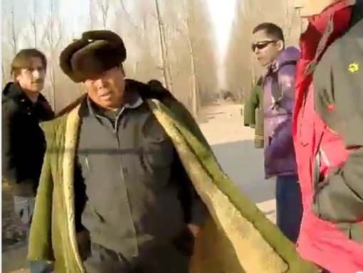
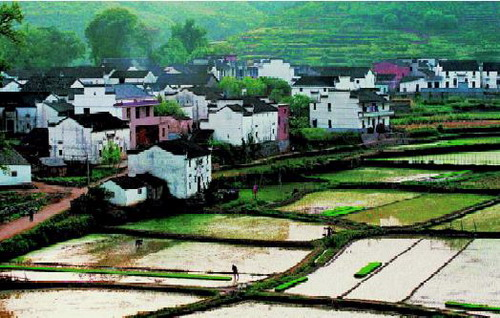

# 基层事件中的乡土视角

** **

近日又发生了不少既让人兴奋又让人哀叹的事件，涉及到了被围困的一个人和一个村庄。但是，不得不说，对这些事件的讲述方式，还是比较单一的。这些讲述，除了博取一些同情和愤慨，对于事件过程的发现，价值不大。

首先是“蝙蝠侠”探访被阻，山东临沂的这个小村依然固若金汤。这个事件的讲述方式，一开始就变成了探险故事。探险过程非常刺激，而这些正吸引着有胆有识有义的战士前去挑战。而出人意料的是，“蝙蝠侠”真的出场了，让这个故事真变成了一个美式英雄主义套路。但是仅有民主国家来的天然正义优越感而不是实际身手的英雄在凶神恶煞的守卫面前不堪一击，让这个高潮不了了之。这个小村庄继续等待其他英雄的到来。

而对于在广东的村庄发生的事件，则激发了我们对二十二年前的回忆。基层民主被屡次提到。村民的行动似乎是自觉的，自愿的，价值理性的，有理想和策略的。在被围困下的井然秩序和村民的顽强互助精神得到称赞。而像调动军队这样的谣传也增添了这种色彩。村民似乎成了中国21世纪的第一批民主斗士。当围观者为“民主精神”的胜利呼喊时，其实行动起来的村民想的是“小闹小补偿，大闹大补偿”。当然有细心的观众指出，村民打出的旗号还是支持党中央，不值得对他们期望过大。而又有观众解释说，农民反青天是不可能的，能敢于抗争并且坚持就已经很令人鼓舞了。

这其实是又一次的维权抗争，而且属于于建嵘提出的“以法抗争”的类型，也就是具有一定组织性，也有一定的宗旨。当前有组织的抗争行为已不少见，但很容易被大规模的泄愤事件转移注意力。比如在我开始写这篇文章的时候，又有广东某镇发生了上万人规模的群体性事件。这种事件一般来得快去得也快，往往是围观群众还没有兴奋够，那边已经散了。

我的问题就在于，无论是起义说还是维权说这些动机取向的解释都不是很令人满意。起义说，是围观者根据自己的期望为其定性。维权说虽然准确，但解释力无法延伸。因为基本上，中国基层的民众，或多或少都在遭遇权利受损。那么，为什么这个村庄的抗争得以形成和维持。

在遥远的寒冷北方的一个村庄里，还有一个光辉四射的人物被围困着。他维护的都是他的乡亲的权利，可为什么他的乡亲没有因为他的感召和对自己权利的觉醒而群起抗争，反而成了迫害他的势力的合谋呢？如果这样问，那么村民成为民主斗士说自然毫无意义。当然，你可能会说，这两个村子的情况相差太远，所以才有了截然不同的结果。这个我也很同意。中国的成千上万个村庄，情况更是千差万别。可是他们仍然有着同一种特点。这同一种特点也许会让我们发现，结果迥异的两个村子过程却遵循着同一种逻辑。这就是我想提出的基层事件中的乡土视角。

中国社会学人类学还能拿得出手的一点成绩，大概也就是宗师费孝通首先提出“乡土中国”，并且接连抛出了一系列解释中国社会结构和人际关系的重要概念：差序格局、礼俗社会、长老统治、教化权力、血缘社会、无为政治等等。继而很多学者延续这一路径，进行着从异域回归本土，从抄袭回归原创的努力。费孝通最早用散文化的语言说到：“差序格局的社会结构好像把一块石头丢在水面所发生的一圈圈推出去的波纹，每个人都是他社会影响所推出的圈子的中心。”这给后人留下了解读和重构的空间。现在学术界一般认为仅仅把差序格局理解为人际关系的范畴是很浅显的，差序格局更重要的指向是深层的社会结构和行为机制。仅仅从差序格局引申出去，就可以指涉社会秩序、社会网络、公共和私人秩序、国家和社会等等一系列议题。而在我们的观念里，与此相对的西化的概念已经占据了主要的空间，法理社会、民主政治、司法权力，等等；而在叙事时，市民社会理论、社会运动理论就成了我们主要的框架。然而不了解这一乡土的中国，从外围观望进行的讲述就无法容纳村庄里的真正事实。把分析的对象从静态的结构转向对事件的动态过程的分析，也是当下学界对“事件—过程”分析的呼唤。

那么在此我试着提出对两个村庄不同结果的一个猜测吧。最新的对差序格局的理解是这样的：由“差序”所构成的社会组织在中国社会中占据主导与支配地位。这也就是说，以某个个体为中心而扩张形成的社群在社会生活中起到了决定性的作用。中国所谓的公共领域实际是由私人领域扩张与转化而来的，或者受到私人领域的支配，从而使得中国社会的公共性供给在相当程度上依赖于处于“差序格局”中心的某个个体或某一批个体的道德性（张江华，2010）。在临沂的被控制的主角，他虽然是一个英雄式的人物。但他在自己所居住的社区里，并不是处在差序格局的中心位置。这很容易猜到，因为差序格局的中心人物，往往是大家族的首领或者地方能人。假如他对于村民来说是处于很边缘的位置，那么他的状况就不值得关心了。村民不会因为他是有着极高公共道德价值的人而支持他，况且村民对公共性的认识与我们不同。而在广东，在村民集体利益受损的情况下，有精英站出来运用精英的逻辑超越了普通村民性格中肯定会有的涣散、自利、胆怯又知足的一面，提出了一个公共的诉求。而因为这些精英牵动了整个差序关系的启动。当然，村民是如何动员的肯定没有这么简单，涉及到情感、资源很多方面。具体的事件过程，有待于事件的亲历者的讲述或者事后研究者的深入发掘。

可是中国村民仍然跳不出一个认知的框架就是：“中央是恩人，省里是亲人，市里有好人，县里多坏人，乡里尽敌人。”他们反对被认为是起义，也希望伟大光荣正确的党中央来恩照于他们。知识分子能认识到一个国家核心意识形态的虚伪性，但村民只是感于眼前的具体贪官，对他们来说，抽象的青天一直在远方。那么这是因为什么呢？基层，是官方的称呼，它对应的就是可以自组织的最低的那一层社区，比如一个村庄，或者一个城市的社区。而中国传统的自组织形式，就是差序格局关系的实体化形式。如果从内向外推，就是小家族、宗族、宗族的联结也就是地方村落，最多会推广到县乡一级。而这正好是政权控制起作用的地方。也就是在此，草根里的卡里斯马，自组织的中心人物，和地方官员的冲突就发生了。村民们自然就把自己受到的一切损害归因于了这些最底层的官员。但我们都知道，底层官员的腐败和分得的利益，仅仅是很小一部分。所以要想达到基础民主的真正实现，必须要政府真正放开，允许地方卡里斯马为地方利益代言。而这也大概是这个村庄可以团结坚持抗争的原因。

草率地提出这些猜测，只是为了举例体现我的问题意识。基层本来在中国是被政府严格控制的，但如今事件频发，而且估计这个趋势还会持续下去。那么我们是否可以据此说，民主就像洪水，你开门会进来，不开门也会进来。如果真的是这样的话，那我们就安心等着就好了，我们可能不仅等来民主，还会等来共产主义。人们总是太急于去讲述一个巨型的历史，就像共产党执政是人民的选择和民主会来的，也根据自己的讲述去安放基层的事件。事情当然没有这么简单。

随着大张旗鼓的现代化，农村在中国处于了一个很边缘的位置。衰败可能是其不可避免的结果。但我这里说的乡土不是乡村。而是历史熔铸于中国人的内在的行为机制。人们爱在传统与现代、城市和乡村、中国和西方的对比中表达它，但这是很偏颇的。人们一直期待一个现代化的转型，为此过度强调现代化和西方的话语。但真的反观自身，很大程度上还是一个乡土内核。跑步进入现代化，也是一个遥不可及的梦。追问乡土中国如何延续和重塑，反而应该是看待很多问题的起点。

 

（采编：楼杭丹；责编：麦静）

 
