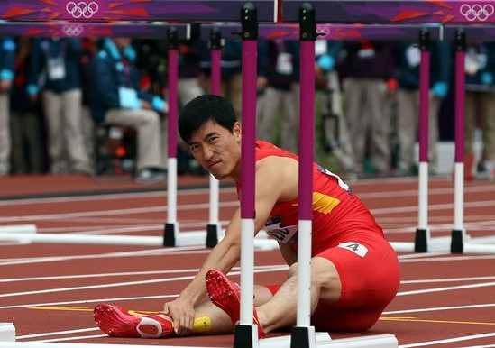

# 大国的跟腱

**陈寅恪先生说“自由之思想，独立之人格”是读书人的愿请，也是公民的诉求，可大多数时候，人们宁可站队，宁可相信偶像的光芒，宁可追求“崛起的大国”带来的庇护，这种庇护像一个盒子，而升斗小民们便是漂浮在其中的气体分子，分子之间的斥力大于引力，脆弱的盒子正承受着同时来自内外的压力，这种不安全感掺杂着人们对于自身和社会的未来抱有的深深的焦虑，能把人逼疯，逼出“62%伟大复兴”的癔症，逼出五毛和五美分之类的症候群。**

# 大国的跟腱

## 文/朱小福（Imperial College London）

 

因着普陀山的南海观音香会，某家总要在每年的八月初正面接受一番台风的洗礼。今年的11号强台风，唤作“海葵”的，来路不善，某家身处海岛，为着去留之计愁苦不已。岛上的人家泰然自若，相熟的海鲜菜馆老板满脸油汗，赤膊，安坐自家门前，大有笑看风浪起的烟波钓叟之态。伊叼烟卷，深情挽留某家，说晚上有刘翔的比赛好看。

傍晚风起，刘翔在赛道上亮相，菜馆中剥花生的，炒蛤蜊的，倒啤酒的，仿佛瞬间都中了定身法一般，静静盯着角落里小小的电视机，空气中弥漫着海风的腥气，菜馆的卷帘门吱吱作响。

比赛的结果，对于某家这个冒着生命危险看完直播的观众来说，更多了悲怆的意味。

是夜横风狂啸，已到了飞花折叶皆可伤人的地步，某家被“海葵”撵着，在高速公路上狂奔，无暇顾及网路上由于这比赛引发的站队狂潮。某家长了二十年，站队二十年，此种情形如同台风，每年总要有这么几次。

刘翔拖着一条断了的右腿跟腱，用一种出人意料的方式仓促谢幕，那些见证刘翔在2004年雅典奥运会夺冠的观众，唏嘘感慨的不仅是这次没完成的比赛，大约还有倏忽在脑海中回放的八年时光，“花有重开日，人无再少年”，人生中经历过的所有事，只要与“曾经”有那么一点点的相似之处，都能让人在深夜里泪流满面。以己度人，想来商业化的媒体当真残忍的很，新的文案迅速出现，赞助商们连夜撤换下半年的广告订单，“梦想”“拼搏”，种种辞藻构建出一个叫人感动的热血故事，但很快就会变成千篇一律的“只见新人笑，不见旧人哭”，每一年都有广告新人王横空出世，每一届奥运会都有新的传奇。

许多事情到了天朝大国，总要变得复杂一些，何况是奥林匹克这么一个庞杂混乱的系统。无数的联想集团造就了无数的阴谋论，删不完的网络段子催生了死不完的楼主全家，英雄的塑像被高高竖起，又被看得见的和看不见的手摔得粉碎，碎片落在地上，戳中泪点无数。

大国的事，什么事情都与体制有关，什么事情都不完全与体制有关，但体制永远是要被问责的。一根断了的跟腱，牵扯出被商业和政治绑架了许多年的体育制度，继而是关于媒体道德、人权、民族主义之类被翻来覆去研究却又研究不出结果的宏大命题。

公民们对于奥林匹克的种种狂热而复杂的情绪，说穿了其实简单，长久以来，人们总是处于一种的“被代表”的状态中，被各种各样的委员代表，被中央电视台的大脸主持人代表，被奥运金牌榜代表，被“三个代表”代表，这种状态其实很微妙，它让人反感，却又潜移默化的影响着一个社会的价值观，渐渐的人们习惯了“被代表”，为国争光的运动员们就是公民的脸面与荣耀，就是“大国崛起”的希望。一个来自大国的运动员，跑得飞快，拿过很多世界冠军，这本是个单纯快乐的故事，可他一生中的闪光时刻似乎都代表着别的东西。

陈寅恪先生说“自由之思想，独立之人格”是读书人的愿请，也是公民的诉求，可大多数时候，人们宁可站队，宁可相信偶像的光芒，宁可追求“崛起的大国”带来的庇护，这种庇护像一个盒子，而升斗小民们便是漂浮在其中的气体分子，分子之间的斥力大于引力，脆弱的盒子正承受着同时来自内外的压力，这种不安全感掺杂着人们对于自身和社会的未来抱有的深深的焦虑，能把人逼疯，逼出“62%伟大复兴”的癔症，逼出五毛和五美分之类的症候群。

某家一个处于所谓“国家形象”前沿阵地的留学生，时常在深夜自省，作为一个大国公民究竟感觉如何，按照教科书上的说法，某家应该无比自豪，应该像吉鸿昌先生似的寻一块木牌子，写上“我是中国人”然后挂在胸前，可事实又并非如此，冷眼旁观，身在异乡，国籍似乎不是什么大不了的事，如同血型性别，只是身份证明上的一条信息，可大国的国籍总在某些时刻让人心中泛起一丝莫名的尴尬和惆怅，这种爱恨交加的情绪，罄南山之竹难书万一。当日新得的金牌让人头脑发热，随即又会有不大光彩的新闻如同一瓢冷水浇下，忽冷忽热如同打摆子，叫每一个抱有最后一线修身治国平天下热情的存心振作之人拔剑四顾心茫然。

孔夫子说“唯上智与下愚不移也”，这话本来说的是性情，后来被附会上了许多其它的意思，听起来叫人脊骨发凉，无数“下愚不移”的愿望说出来总让人心酸，汪曾祺的黄油烙饼就是最好的一例，“三级干部会就是三级干部吃饭”，“他们为什么吃黄油烙饼”，“他们开会”。私心想着，其实大国崛不崛起也就是那么一回事儿，无非是三级干部开会能别总白吃食堂的黄油烙饼，矿场能少透点儿水，妇女能享受合法生育的权利，而生下来的孩子能吃无毒害的平价奶粉，出海的渔船能返航。也许这些都不大容易实现，至此，某家还是得站队，还是得狂热，还是只能在金牌榜上搜寻着关于“大国崛起”的线索。

刘翔那根因为承受了许多过于宏大的命题的跟腱还是断了，而某家那根支撑着清醒头脑，独立人格，安全感与自尊心的大国公民的跟腱也越来越不堪重负，它在这个失衡的世界上，与血腥的11号台风中心，苦苦相抗。

 

（采编：何凌昊；责编：佛冉）

 
