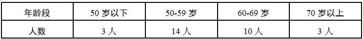
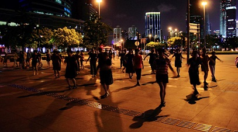
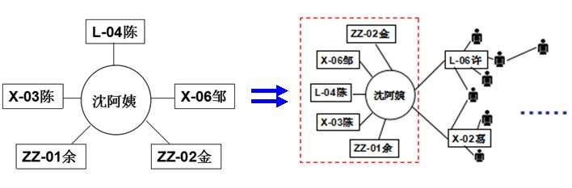
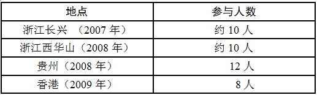
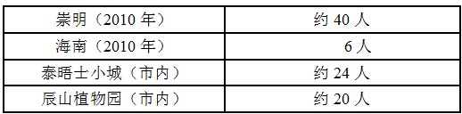
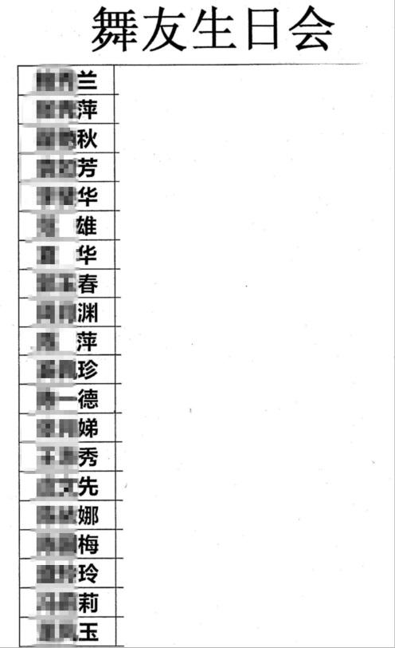
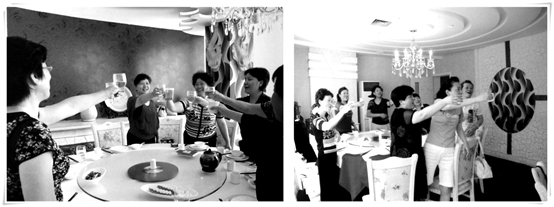

# 大妈为何要跳广场舞——“自我满足型”草根组织的社会功能

社会制度环境的变化催生了新需求的产生，中老年人群的健康、社会交往等方面的诉求无法通过原有的国家体制得到满足。草根舞蹈团体正是一种基于社会成员特定的需求而产生的“自我满足型”草根组织。个体参与组织的过程就是他们追求自我满足的过程。因此，组织发挥怎样的社会功能与这些需求密切相关。

这些需求与成员的属性特征密不可分，其中性别、年龄、经历的社会背景等群体的共性特征是最主要的影响因素。参与这些组织的成员以中老年女性居多，大多出生于20世纪40到60年代；她们深受单位制影响，习惯了由单位提供一切保障的生活；他们中有不少人在经济体制转型的社会大潮中经历了下岗失业的人生起落……如本文的研究对象，该团队成员以中老年女性为主，虽然团队中也出现过一些青年女性或男性成员，但一般是陪同母亲或妻子来跳舞的，大都是跳了一段时间后便无法坚持下去的“临时户”。在所有受访（访谈或问卷）的30位成员中50-59岁占14人、60-69岁占10人，比例超过了80%（如表4-1），平均年龄为58岁。在所有接受了笔者采访或者问卷的30位成员中，已经退休的占26人，在职只有4人。

 
表 4-1 组织成员的年龄结构

成员们的性别、年龄、成长背景、社会地位等特征都具有同质性，他们经历过相同的社会历史阶段，拥有许多共同的时代记忆，因此这群人有着许多共同的需求。在7年的发展历程中，组织自发形成了一种发挥着健康保障、社会交往、自我重塑功能的运作模式，组织社会功能的发挥满足了成员们的需求，甚至影响和改变着他们原来的生活状态。

###一、健康保障功能

略

###二、维系社会关系网络的功能

除了跳舞和交流之外，组织成员之间也会产生一些互助性的互动，而这些互动往往是成员扩大关系网络的关键性事件。例如，成员间经常会相互帮忙代购一些小物件，成员戚阿姨（X-04）请许阿姨（L-06）代购拖鞋，当许阿姨将拖鞋交给戚阿姨时，引来了许多其他成员的关注，也纷纷请求代购。

——“侬拖鞋带来啦？”

——“诶”（从塑料袋中拿出拖鞋）

——“这拖鞋倒真的蛮好的”（十来个阿姨一起围过去看）

——“个帮我买两双好伐啦？”、“我也要两双”……

**在购物途径如此多样化的今天，像拖鞋这种日常生活用品触手可得，根本无需托人代购这种方式来得到。然而，对于那个年代的大部分人来说，他们习惯于也更倾向于利用自己的社会关系网络**[ 社会学领域一般将“社会关系网络”理解为：彼此间有着各种联系的行动者之间所组成的社会结构，而这种网络往往可以成为一种资源，在必要的时候发挥作用（也可以说是社会资本的一种）。笔者认为，该组织中的成员并不是一个个独立的个体，而是相识、相互熟悉，甚至彼此联系紧密的群体。因此，组织的个体成员与其他成员的互动过程，就是构筑自己的社会关系网络的过程。]**内的资源来达成目的。**

一次偶然的谈话或者一个小的契机都会成为扩大个体成员社会关系网络的途径。沈阿姨（X-01）社会关系网络的扩大便是由一张名片开始的。沈阿姨的儿子于2011年开始进入律所成为见习律师，由于职初律师生存艰难，当时沈阿姨抱着一试的心态，借助所有可用的途径帮助儿子做宣传，自然不会错过组织中的这些“熟人”，“刚刚开始的时候老难诶，反正名片（如图4-2）是印了交关，我么有认识的熟人咯啥就发发，这里人也蛮多的，就Pi是勿是（不如顺带）发发看……来寻我的人也蛮多的，但是主要是问点不懂的事情，我么简单的就回去问阿拉儿子，第二天再回来告诉他们；复杂一点么就直接给他们电话，让他们自己问阿拉儿子”。

事实上，并没有团队成员找沈阿姨儿子正式处理过案件，主要就是咨询一些与遗产继承、子女房产相关的事宜，其中绝大部分问题没有复杂的情况，都能够借助网络搜索引擎得到答案，然而这些阿姨们更善于借助“关系”来解决问题，通过这个网络来辅助实际生活中所遇到的问题。

对沈阿姨来说，仅仅提供资讯是不可能向他们收钱的，换句话说她发名片的本质目的并没有完全实现，却不代表她所做的这些事情没有价值。除了会获赠一些小礼物之外，这次宣传使沈阿姨结识了不少团队成员，她在组织中的社会关系网络向外延伸（如图4-3）。原本与她关系密切的成员大致有5位（L-04陈、X-03陈、X-06邹、ZZ-01余、ZZ-02金），而该事件发生后，沈阿姨的关系网络明显扩大了（如图4-3），而她积累的社会关系网络也帮助给她带来了一些便利。例如，沈阿姨的好友金阿姨（ZZ-02，某高中老师）的单位排练跳舞需要借扇子，这就是在沈阿姨的帮助下完成。

 
图 4-3 沈阿姨的社会关系网络的变化

###三、社会交往功能

紧密的邻里人际关系是特属于个案团体成员那辈人的时代记忆。然而，社会大环境的改变使他们改变了原有的生活方式，却压抑不了他们社会交往的本能。因此，组织的另一个功能就是为这些在生活中无法得到满足的社会交往需求提供一个实现的平台。

###1、一般程度的交往

一般程度的交往大约有两种主要形式，其中最普遍的一种形式是每日都会发生的寒暄和交谈。组织中绝大部分成员见面都会相互打招呼，闲聊几句家常也是常有的事：

“×阿姨，侬来啦”——“今朝还是噶热喔”——“诶，是的呀”；

“晚饭吃好啦？”——“吃好来，最近小菜贵来”——“是的呀，天热呀”；

“侬今朝这件衣服老好看的嘛，老早没看你穿过嘛”——“老早就买来”……

然而在整场活动中，他们之间却可能因为站队距离的原因不再有任何交流。但是，这种看似漫不经心的浅层次交往却是组织运作过程中必不可缺的，会带给成员们十分积极的暗示：“都是客客气气的”、“都蛮和睦的”、“对啊，我们都很和谐的”。这些浅层次的交往为组织营造了一个融洽的环境，这种融洽对于组织来说是稳定运行的基础。

另一种形式，则是组织中的一个传统——分发喜糖、喜蛋。当成员的家中遇到喜事时（结婚、第三代出生等），会向所有成员分享喜讯。“有段时间，我们这个团队很闹忙的，三日两头就是发蛋、发糖，他们都发的，反正经常拿来一大包，大家一起发的，大家一道开心开心嘛”（HX-01，陈老师）。其实发糖者可能并不一定熟悉每位成员，甚至与有些被分发到的成员很少交流，但是不管是熟悉的还是不熟悉都能得到一份礼物，而收到礼物的人也大都会道贺，说些“恭喜”之类的客套话，顺便询问结婚的时间或者初生婴儿的性别等。当自己家里也有喜事的时候，也会效仿这种方式。就在这分享喜讯的过程中，成员之间相互了解，良好的关系也得以维持。

总之，这个阶段的交往程度还停留在相对浅层次的阶段，尚不需要成员付出过多的情感，因此这种程度的交往很容易被接受，也是和绝大部分其他组织成员之间最普遍的交往形式。但是浅层次的交往，增进了对其他成员的了解，保持了成员间的热络感，为组织的发展营造了可持续的环境。

###2、深入的交往——朋友圈子的形成
　　
“老实说，来跳的目的就是锻炼身体，其他都没啥多想。”（L-01，姚阿姨），这句话表达了组织中多数成员来跳舞的初衷，然而在跳舞过程中不免会与其他成员交流，有时“因为都是差不多年纪的，你不交流他们也会找你交流”，渐渐这种交流会演变成一种固定的社会交往关系，当“一圈人”的交往逐渐深入，便形成了一个朋友圈子。

逐渐热络的“线下”[ “线下”，即指跳舞活动以外的时间。]活动是朋友圈子形成的重要标志。由于团队活动的时间有限、间歇时间也很短，不具备深入交往的时间和空间条件，因此成员们深入的交往通常是在“线下”完成的。活动时间外的团队活动主要是有两种形式：一类是外出旅游（市内和外省市）。大约是在团体形成一年之后逐步开始的（即2007年），到了2010年之后更为频繁、参与规模也比较大（如表4-2，如图4-4）。

 
表4-2 团队成立至今的主要“线下”活动

 
表4-2 团队成立至今的主要“线下”活动

 
图 4-4 “线下”集体活动留影

另一类是成员庆生会。为舞友庆生是增进成员间友谊的重要方式，并且这类活动不是偶尔为之的，而是成体系的——即朋友圈中的舞友轮流相互庆生。其中，以组织中的两位核心成员（董老师、陈老师）为中心所形成的朋友圈最为典型。2009年陈老师加入团队之后，这个“圈子”慢慢扩大逐渐形成了一个20人左右的稳定朋友圈（如图4-5 “舞友生日会”表格），随着成员间关系的深入，逐渐形成了一种轮流为同伴庆生的文化，每隔一两个月这样的活动便会如期举行，全体成员为这段时期过生日的同伴集体聚餐庆祝，而费用则由当月不过生日的成员平摊。

 
图4-5 舞友生日日期汇总表

成员们对集体庆生活动乐此不疲，首要原因是聚餐给大家带来了一种参与集体生活的满足感。以往“这种小生日老早肯定不做（过）了，（现在）也不是为了过生日，就是大家寻个借口聚聚”，“开心”是大家对于集体庆生活动最主要的感受（如图4-6）。陈老师调侃道“勿要太闹忙哦，（生日聚餐）一年吃到头，有时候连着几个月都要吃饭”（HX-01，陈老师）。

此外，轮流庆生、均摊费用的方式也是一个重要的因素。一方面，相比于过生日的成员宴请伙伴庆生而言，这样的方式在减轻了“人情”方面的压力，也降低了每人一次性开销的成本；另一方面，轮流过生日更容易作为一项常规活动项目长期维持，这样整个朋友圈的结构更稳定，成员间的关系也更易亲近。

 
图 4-6 集体庆生留影

团体成员之间的交往关系是较为稳定和长久的。长久性体现在成员间不仅仅是“舞友”的关系，而是朋友的关系，这种关系无论是“线上”或“线下”都相对稳定地存在，不会因为时间和空间的不同而轻易改变。下文案例可以充分说明这点：团队一位老成员陈阿姨要搬迁至外区，在她临走时，由陈老师牵头，成员们齐聚滨江大道用舞蹈为她欢送，并且录制了视频留作纪念。然而，陈阿姨和团队的联系并未就此结束，她会不定期地回来看大家，还会跟着一起跳。只要她回来，她原本站的位子总会留出。此外，与陈阿姨交好的其他成员在她搬迁之后仍会让她参与到小圈子的“线下”活动中。

###四、重塑自我功能

上世纪90年代开始，经济体制的改革导致了大量国有企业职工下岗，下岗不仅意味着失去了体制内的身份，同时也意味着原本由单位包办的福利、保障都不复存在。团体中不少成员也曾经在社会转型过程中经历了下岗带来的各种酸甜苦辣。在他们重拾信心、重塑自我的过程中，组织起了很大作用。

###1、解压与释放

社会转型在给一部分人带来致富机遇的同时，也给另一些人带去了巨大的压力和挑战。组织中的大部分成员正是这“压力最大的一代”中的一员，许多人经历了艰难的下岗再就业，却又在人到中年即将退休之际不得不为照顾父母、儿女成家的事情继续奔波，不少人的生活境况并不理想，他们很需要一种缓解和释放压力的渠道。此时，一个由同质性个体的构成组织能够承担起这样的功能。那么，为何组织可以发挥出这样的功能呢？从以下发生在活动间歇的一次再普通不过的对话中，可以影射出其中的原因：

“你看这个‘姐姐’年轻伐？我们都叫她‘长不大’”；（X-06，邹阿姨）

“啥‘长不大’啊，我都已经做婆婆的人来，还长不大啊？”（ZZ-01，余阿姨）；

“哈哈哈！”。

一方面，成员彼此之间的称呼是很随性的。成员间的称呼分为三种：第一种是“老师”。一般仅指两任负责人（董、陈），有时一些资格老的（一般指站在队伍前排且在2010年前入队的成员）或者协助过舞蹈教学的成员，然而这些成员一般会婉拒这种称呼。一位07便入队的老成员说：“也有人叫过我老师的，可能看我站在前头大概是跳了时间蛮长了，我就讲：‘千万别不要叫我老师，就叫我林阿姨好来’”（L-02，林阿姨）；第二种是“某阿姨”或“小某”，这是使用最为普遍的称呼，几乎适用于团队的每位成员。“一般姓啥，就叫啥阿姨，年纪差不多的么，就叫小啥”（X-02，葛阿姨）；第三种，相互间不使用特定称谓或者使用昵称（如“长不大”、“老法师”之类），这种情况一般发生在熟悉度高、关系密切的成员间，这样的称呼方式使得相互间的交流更为随性，而谈话的内容也往往带有调侃和幽默的意味。

另一方面，成员之间的关系融洽，“说说笑笑”成为了跳舞间歇最大的乐趣。“整天都做家务也不好的，出来么多接触接触人，心情也开朗了……有时候碰到不开心的事情，出来和大家说说，大家一起说说笑笑就好了”（L-04，陈阿姨）。看似成员间漫不经心的“说说笑笑”，其实是他们缓解压力的重要途径，许多阿姨在与舞友们的谈笑间释放着来自现实生活中的压力。性格直爽的邹阿姨（X-06）是其中一个典型：

邹阿姨现年61岁，与许多其他同龄人相似，也拥有丰富而坎坷的人生经历。邹阿姨是1969年的插队知青，回沪后一直在郊区的供销合作社工作。90代她从单位下岗，后又从事了钟点工、餐饮等许多不同工作。邹阿姨面对着自身生存的压力，同时也承担着儿子需要找工作、婚配等来自家庭内部的压力。双重压力使她急需调整自己压抑已久的心态，当她散步到世纪大道并发现团队正在跳舞后，便抱着试一试的心态加入了团队，“已经退休了，外面也不做了，看到（这里）了，来活动活动，锻炼锻炼身体，把心态搞得好一点嘛”。

邹阿姨入团的时间恰好是成员增加最迅猛的2010年。起初，团队融洽的氛围还是打消了她先前不少顾虑，“这里都是女士，相互之间也很尊重的”。由于和她同一时间入队的新人很多，因此她结实了不少新的朋友，与其他成员的交流和互动也变得更频繁和自如。“我们这里人都挺好挺好的，你不会我教你，我不会的别人也会教我……我们几个（关系）好一点的（指着附近几位阿姨），一休息就说说笑笑，很开心的”。久而久之，邹阿姨变得十分热衷于每晚的跳舞活动，这里也成了她排解和释放压力的重要渠道，“跳得也不可能好到哪里去，也不可能差到哪里去……你家里有什么不开心，就到这里来嘛……来了这里，其他的一些不开心的事情就想不起来了”。此时对邹阿姨来说，舞蹈动作是否标准、舞姿是否优美已经无关紧要，重要的是自己的心态的确放松了很多，周围的人都觉得她直爽开朗而且喜欢开玩笑了（上文“长不大”的昵称便是出自她口）。从她对自己的调侃中，也不难看出她心态上的变化，“要说起来苦难一大堆，我马上撞车好来……所以最主要还是自己开心，出来跳跳舞啊，自己要调节好”。

###2、重塑自我

组织是成员释放生活压力的平台，但它所发挥的功能远不止于此。对于经历生活磨砺的中年妇女来说，组织的意义在于，她们通过组织重新累积自信，重塑自我。

###组织提供了一个走出来与人交流的平台，帮助他们重塑自信。

沈阿姨（X-01）入团前后所呈现出的截然不同的状态便是极好的例证。沈阿姨留着一头短发，衣着打扮朴实，为人和善，与其他队员关系都比较熟络，和团队成员总是有说有笑，给人一种大方开朗的印象。然而，几年前的她却还是萎靡不振、意志消沉的状态，那时“整天在家要么看看电视，要么看看电脑，眼睛看得睁都睁不开，人整天后弯着像虾一样的，从早做到晚在沙发上”。2009年，沈阿姨原来的单位改制重组，她被迫“买断工龄”[ “买断工龄”是改革开放初期我国一些国有企业在改革过程中安置富余人员的一种办法，即参照员工在企业的工作年限、工资水平、工作岗位等条件，结合企业的实际情况，经企业与员工双方协商，报有关部门批准，由企业一次性支付给员工一定数额的货币，从而解除企业和富余员工之间的劳动关系，把员工推向社会的一种形式。]失业回家，经常需要面临一个人独处，这使得原本性格内向的她变得更加闭塞。

2010年一次偶然的机会彻底改变了这一切，沈阿姨的一个旧同事想寻伴跳舞，便想和她一同前往，起先沈阿姨还有些犹豫，自己从来没有跳过舞，会行吗？经过一番劝导，沈阿姨还是同意了。说起刚进队时的状态，沈阿姨颇为感慨：“我以前真的胆子蛮小的，不太和人说话的，包括刚开始跳舞的时候，不懂问人家也不太敢问的”，但是一些舞友总会不厌其烦地指导她，令她逐渐体会到了一种团队的感觉，“因为跳不来的人是总是绊着的，有时候教十遍也不一定会的，有人就肯横一遍，竖一遍教你，今天教你，明天你不会还会教你”。就在求教中，沈阿姨开始和团队其他成员有了最初的接触和交流。逐渐，沈阿姨认识的人多了，和大家越来越熟悉，交流的话题也更多了。

###组织也为他们提供了一个展示自我的舞台。

这代人经历过闭塞的年轻时代，业余生活贫乏而单调；80年代，他们普遍在不宽裕的条件下结婚生子。于此同时，来自经济体制改革的巨大挑战又迫使他们不得不在生计和家庭之间奔波忙碌，他们几乎过着“工作单位”和“家”两点一线的生活，几乎所有人对“舞台”都是十分陌生的，甚至是稍感畏惧的。

在人行道或公园这样的公共空间跳舞，在这些阿姨们看来是天方夜谭之事，“心会很慌的，脚骨还要发软的”（X-04，戚阿姨）。但在加入组织之后，他们的胆怯发生了质地改变。组织中有与自己同质的舞友，组织也为他们提供了基本的场所、设备，搭建了一个活动的平台，逐渐他们不再惧怕在众人面前展示自己，从跳舞中他们得到了对其年轻的赞美、身姿的认同、舞技的敬佩，这里不再只是个舞蹈摊子，而是他们展示自己的“舞台”。

组织中的不少成员面容年轻、体型匀称、舞姿协调，目测年龄要小于他们的实际年龄，“年轻”对于这些阿姨来说是最容易获得赞美的特质，而赞美所得到的满足能让他们收获自信——一种保持年轻状态的自信。“你看我现在五十几岁，看得出伐啦？这里的人都讲我只有三十多岁（脸上露出一丝得意的微笑），我女儿都比你大来，要冒三十岁来……人家说我年纪轻，我也很开心的”（L-05，何阿姨）；“有时候去买衣服，人家营业员一看就问，看侬身材保持了噶好，你是跳舞的是伐？我也觉得很有光的”（L-06，许阿姨）。

因年轻所收获的自信固然重要，然而这种自信更侧重于成员个体特征。在组织中，舞技所能带给他们的自信更为关键。每位成员都会经历一个从“新人”到“老人”的过程，舞技也会逐渐娴熟，当有“新人”加入时，“老人”便会被附近的新舞友请教。

“以前觉得自己什么都不好，人家都很来赛的，后来也有新的人来问问侬动作哪能跳，教法教法诶觉得自己也来赛的嘛……有时候一个动作教会人家自己也蛮开心的”（X-01，沈阿姨）

可见原本胆小内向的沈阿姨在从“菜鸟”到教人跳舞的过程中收获了极大的满足感，也积累了自信，也越来越热衷于来和舞友们一起跳舞。

舞技所带来的自信不止于在组织内发挥作用，不少成员更是将这种自信延伸到了组织外部，许多阿姨都还作为骨干成员参与社区的舞蹈活动。“居委会的人晓得我在这里跳舞的，就拉我一道去排练舞蹈……现在社区里的老师也说我一学比别人学的快……现在和老的跳得没啥两样了。现在早上排舞蹈，总把我排在前面”（X-01）。沈阿姨说“现在说难听点就是皮厚了很多”，她说以前总因为不自信，害怕别人觉得自己不行，总是和不怎么会跳的人一起跳，而现在她已经在小区里有过多次表演经历。舞技的提高使她有了更多展示自我的机会，就在一次次“登台”的磨炼之后，她也收获了前所未有的自信。

(编辑：刘一舟；责编：谭翔云)

（诚挚感谢中央财经大学社会发展学院的汪永生同学提供的稿件，如需作者联系方式或咨询相关情况，可联系栏目组xiangyun.tan@ibeidou.net）