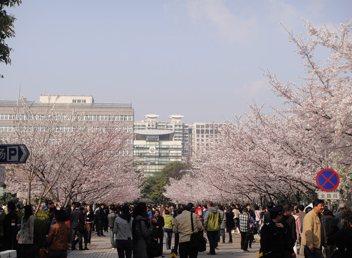
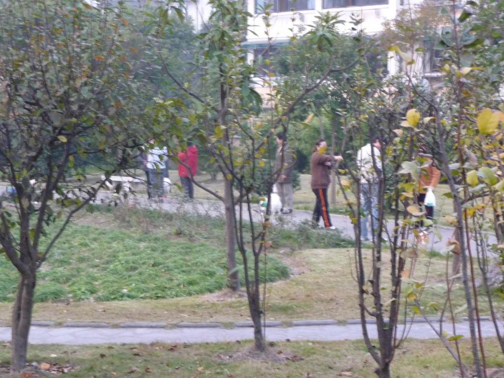
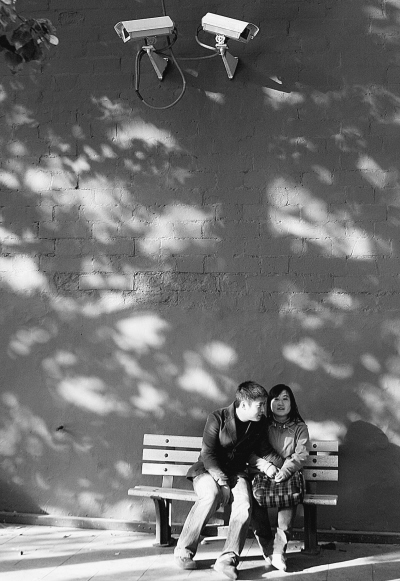

# 大学“公园”与城市公共空间的衰落

### 

清明时节，同济的樱花又开了，还是那么好看，路两旁粉妆玉砌的，“望去却也象绯红的轻云”。这一路的樱花，给校园增色不少，学生们爱不释手，想必也会是很多人走出学校后心里的温馨回忆吧。樱花一开，樱花路（这个路其实叫爱校路，学生昵称为樱木花道）上就密密麻麻的挤满了赏樱拍照的人群。但不光是学生，还有很多的市民，我想大概是附近社区的居民吧。在公交车上，看到新闻里说：又到了赏樱的季节，本市赏樱地有鲁迅公园，同济大学等等。看到这里，刚从樱花路走出校园的我笑而不语。不会真有远处的市民也到同济去看樱花吧。 同济的樱花，仅就校园景观而论，自然很出色，但要是称为城市景观则确实言重了。同济的樱花有多少棵我不知道，不是数不过来，而是不屑于去数。就一百米的路两侧点缀了樱花而已。确实是都市里难得的景致，但学生们树下徜徉几步也就罢了，要是组团来围观确实不值。说不定有人会花一个小时的时间到同济来看樱花，但我保证你不用五分钟就看完，还是在每棵树都围了四五圈的人把窄窄的樱道挤得水泄不通的情况下。校园里短短一段樱花路，却成了举市闻名的胜地，反映的是这个城市在绿地景观资源上的捉襟见肘。 在赏樱的时节，爱找噱头的媒体已经把同济校园和公园摆在了同一个位置上。同济像一个公园不仅仅体现在赏樱的时候。平时，同济校园里也会经常有三三两两休闲的市民。在工作日会经常有家长带着小孩在校园里嬉戏。而到了阳光明媚的周末，会有很多社区的居民全家来散步打球。而且这些人群都是固定来的。同济校园环境还算不错，这里开放、安全，有草坪、雕塑、鸽子(景观)，有操场(活动场所)，有超市(服务设施)，可以作为一个合格的社区公园了。居民到校园里休闲，一个是因为校园环境好，而更重要的是附近的居民再找不到一个如此的去处。同济附近有很多居民社区，本应该有一个像样的社区公园。同济就替代了这么一个社区公园的角色。可是没有大学校园的地方，那里的社区会有一个社区公园吗？同济校园并非是为了替代社区公园而建造的。这是一个城市和社区面临着的大问题。 

### 

### 

### 

公园，就是一个城市中的公共空间。这个公共空间是指一个公众都可以不受限制进入的场所。(这里只是一个城市地理学概念，请熟悉哈贝马斯公共领域概念的大方之家不要对号入座)城市中不收费的公园、广场、绿地都是公共空间。而同济校园毕竟属于高校这么一个机构，它不是公共空间。因为校园的开放性，所以它暂时扮演了一个公共空间的角色。 我想通过数据来证明我的想法，就查阅了上海统计年鉴。年鉴里可以看到上海人均绿地面积是在逐年增加的，而且还列举了新增的大块的绿地。其中在2002年统计年鉴中列举了杨浦区新增的唯一一块大绿地就是新江湾城时代花苑。这个正中我的下怀。因为我2009年在时代花园(同时代花苑)居委会做过一个月的社工。那里的情况我很清楚。时代花园就是2001年建造的一个平价房小区，小区规模很大，但绿地真的很少。在此就不给出数据了，因为本文不是严格的学术论文。 上海各个区的绿地面积是在增加，但公共空间的面积不一定在增加。首先我很纳闷上海中心城区的人均绿地面积怎么会增加。难道把政府大楼和高档楼盘都推倒了盖了公园么。上海比较大的公园，如中山公园，鲁迅公园，长风公园，都是公共空间。但是真正能使社区居民平时就能享受到的，能把绿地化整为零社区公园其实不太多。而且也许绿地面积是在增加的，但公共空间则不会增加，反而在减少。因为中国的城市也早已开始公共空间衰落的趋势了。 本文的问题意识就是，公共空间的衰落，就是社会极化的空间响应。这个情况早已在西方出现，现在我们中国也开始感受到了。 社会极化，很好理解，就是有钱的更有钱，没钱的更没钱。马尔库塞说本来城市人口是呈鸡蛋形分布的，现在中间部分变窄，两头扩展，看起来是一个沙漏形状。然后社会极化在城市中会有空间响应。也就是社会分层会带来居住隔离。富人住在富人区，穷人住在贫民窟。不同阶层的社区会不位于城市中的不同区位。当然这在有些地方反映的不那么明显，那是因为我们还继承了过去的城市区位分布。过去城市区位分布只有功能性差异，没有差等。而且社会极化的空间响应不仅仅是隔离那么简单，富人区一般在好地方，贫民窟在不好的地方。这就是"空间剥夺"。权力阶层对于城市空间资源的不公平分配会导致"城市空间被剥夺"现象。人文区位学派有"被操纵的城市"假说。这个在中国体现的再明显不过了。强拆，就是权力最对弱势群体空间最粗暴的剥夺。强拆也是为了把弱势者从城市中心赶到边缘地带。高收入群体就会对城市的水滨，公共绿地等公共空间进行后花园式圈地。在上海黄浦江、苏州河、世纪公园边上不都是均价好几万的高档楼盘么。这些公共空间，你去看看是可以的，但是可以长期享用吗？不可能。我们也许对此已经习以为常了，觉得人家钱多买得起自然要享受好的。但是公共绿地、景观、地铁站，不都是用纳税人的钱共同投资的么。这些设施对周边房价的溢出效应就被政府和房产商共同享有了。有西方学者将公共空间衰落的表现概括为三个方面：公共空间私有化，上面提到过了；公共场所商品化，比如不是消费者就难以进入某些公共场所；公共空间"军事化"，到处都有摄像头。但这是一个资本主义的难题，谁也无法彻底解决。 我们能讨论解决的是，政府不仅仅坐视了空间剥夺，反而为虎作伥。"这事不能说太细。"大家只要想下一个公园如果换成楼盘会赚多少钱就可以了。 

### 

### 

### 

那么公共空间的缺乏，只是居民没了休闲的去处这么简单吗？也许你已经习惯了回家就宅在家里，觉得在小区或者公园里玩是老头老太和小朋友的专属。公共空间，对于社区来讲，也不仅仅就是个物理性的场所。郑也夫说：城市社区一个社会有机体，在这个有机体内部存在着各种形式的社会关联，也存在着人际交往的结构方式，当这些社会关联和结构方式具有某种公共性，并以特定空间形式相对固定的时候，它就构成了一个社会学意义上的公共空间。没有公共空间，何谈社区参与？没有社区参与，何谈社区力量？我们已经习惯了社区的原子化，也就是社区的居民之间没有交往。这样我们又失去了一个能让社区或者社会团结的方式。每个家庭的公寓，就是密不透风的隔间。这就是社区的死亡。 对于公共空间对社区参与的意义我讲一个我做社工时观察到的事情：时代花园公共空间里居民的活动并不多，也不会有人把居民在小花园里遛狗看作是一种公共空间的活动。但遛狗的居民因为天天在那里遛狗，互相之间都很熟悉，在趣缘上的共识加强了地缘上的认同，这些居民会互相交流和分享养宠物的乐趣，这个群体就逐渐固定下来。居委会在管理社区宠物，比如要求居民给狗打疫苗的时候会发现这个群体已经形成了这种公共意识。 2005年9月，上海中环高架路途径复旦大学路段正式通车。本该从复旦校门口上方穿过的高架在这里钻入了地下，原因就是复旦认为高架会破坏景观和风水。这被当作一个机构和政府谈判的例子而被人津津乐道。复旦社会学系的于海教授根据自己在西班牙巴塞罗那的体验悟到怎样将一个汽车的尺度转化为人的尺度的问题，从而追问高架路到底分割了什么。那么我在此，提出怎样将一个权力尺度转变为权利尺度的城市理念，追问大学校园到底代替了什么？这个问题也许我们已经清楚了。但是社区的居民，能否像牛气的复旦维护自己的风水一样维护自己的空间呢？ 

### 

### 

（采编：陈轩 责编 陈轩）
