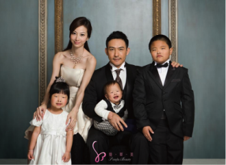
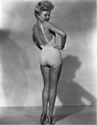
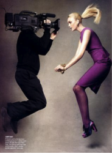

# 大家如何看待你的形象：「胖瘦議題」與「正妹傳說」

在東區頂好商圈附近逛逛，可以看到有一處集合了好幾家整形診所，外頭張貼的是代言人姣好的身材，暗示著「現在的妳很美，但妳可以更美！」；或是在繁華的街頭上，巨型螢幕對著來往的人群向大家表示「美麗不怕痛也不會痛」，並認為自己整形後「比以前更有自信了」。記得有次經過捷運站地下道某處轉角的整型廣告看板，瞥見幾位日本觀光客認真地對著廣告上四位女主角各自的術前和術後照片指指點點，看起來像是在討論什麼，突然間，我因為這景象而愣住了，然後停下腳步開始思考為什麼這個社會要唾棄肥胖或五官未達到一定「標準」的人？

我們好像比較少嘲笑矮子長得太矮，因為這並非「他能夠決定的事情」，但我們很可能會鄙視胖子，胖子看似可以選擇努力維持苗條身材卻放縱讓自己大吃大喝，我們因而認為胖子就是懶惰、做事慢吞吞的，甚至身上還有異味！

不過，是什麼影響我們對胖子產生的既定印象或看法呢？

首先，我們可以試著思考我們是如何看待「健康」和「苗條」，哪一個對我們來說較具吸引力？一款新上市的飲料廣告是會主打「健康、營養」還是「好喝不怕胖」呢？從電視廣告所呈現給我們的印象，像是代言人在大吃大喝 （或表現出想吃油炸、高熱量點心）之後會感到極度的罪惡感，於是，具有「解油膩、喝了會瘦」這樣強大特色的飲料立即成了廣告中女主角的救星，甚至強調持續喝幾周內就能看出瘦身效果，真是讓人很難不心動。即便這款飲料是用「健康食品」作為包裝，但真正引起我們興趣的其實還是「苗條」居多，我們急切地希望自己能夠因此遠離肥胖！

但為什麼我們會這麼在乎自己胖不胖？更確切地來說，為什麼我們會這麼在乎自己「在別人眼裡」胖不胖？

這就要從我們開始從家庭生活走向學校團體生活，進而走向社會生活以來，與形形色色的人群接觸之中，我們一而再地接受到一個訊息──「胖子比起瘦子較不受歡迎」。打從第一次接觸的印象開始，我們對胖子的印象就和瘦子有所區隔，也因此，我們加倍努力地想達成我們在別人心目中所呈現的印象。

在與人互動、接觸各種訊息的過程中，美國社會心理學家米德（George Herbert Mead）解釋這些我們「習以為常的知識」──包括我們如何去做選擇或擬定計畫，何時該讓步，何時該壓抑自己的慾望……等等，是「群體標準的內化過程」（internalization of group standards）。米德所提出相當著名的「主我」（I）和客我（me）的概念便解釋了群體是如何影響了我們對胖子或對自己的看法。「主我」（I）是自我的內在核心，負責審查、評估和記錄，進而表現出反映外在社會要求或期待的作為，比如我應該要努力維持好身材才不會被人瞧不起。客我（me）則是自我的外在部分，藉由「人家」會怎麼看待我，一般大眾對我的評價形成我對自我的理解。我們被讚許恰當的行為或懲罰偏離常態的錯誤行為形成了我們對「規則」的理解。藉此反省自己有待加強的部分，我們了解什麼是被期待的，什麼是不被期待或允許的。

這種經驗尤其在夜店裡表現得更明顯，走進夜店裡很容易接收到一堆打量的眼光，那種眼神彷彿像是在「物色」某種類型的對象，而彼此之間的眼神交流似乎暗示著某種類型是受歡迎還是被冷落的。我們自然而然地會認知到性感可愛的女孩在夜店就佔了很大的優勢，包括站在夜店門口的保安也扮演了區隔、定義界限的角色，決定讓誰可以進來、誰不適合進來（如我在上一篇提到的社區警衛）。諸如此類的認知過程中，其中有些人對我們而言尤其重要，他們對我們評價或建議比起其他人來得更有效，這群人是我們的「重要他人」（significant others），像是家人、知已或情人，我們特別在乎這群人對我們的看法，我們害怕自己會因為是個胖子而在這些重要他人的心目中的地位降低了，我們擔心自己不夠好看、身材或臉蛋沒有達到所謂好看的標準（像是小臉和雙眼皮）而被重要他人遺棄了。

翻開流行雜誌，其報導的內容所呈現的時尚指標或模特兒的穿搭示範便提供給我們一些最佳參考實例，如何穿才能「顯瘦」、「遮掉肥肉」的聰明穿搭或是前陣子大流行的嬰兒妝，擁有如洋洋娃般精緻臉蛋的模特兒也成為讓女孩們想努力追求的目標。除了流行雜誌，像是演藝圈的藝人穿搭也是媒體競相報導與大眾追逐的參考對象，我們藉由這類「參考團體」（reference group）所教導給我們的知識來衡量自己的行為和表現是否符合大眾標準。因此，在「主我」與「客我」形塑自我的過程中，形成了我們自己的選擇，我們能夠藉由「參考團體」來想像其他人對我們的期待，而「重要他人」在眾多影響我們的人當中干預了我們的選擇。於是，我們經由上述提及的「社會化」（socialization）過程，加上媒體和教育無形中對我們的深刻影響，逐漸地塑造出我們對肥胖的認知與評價。

有趣的是，男生和女生看待「肥胖」這件事其實不太一樣，女生比起來會更在乎胖瘦與否，或者說同樣是胖的女生和男生相較起來，女生會比較容易遭到排擠或批評。

這可以從我們的時裝業是如何運作的來談，或許服飾業者是最大的「幫兇」之一，熱門實境電視節目「決戰時裝伸展台」（Project Runway）裡的靈魂人物──提姆．岡恩（Tim Gunn）曾在他所著的《風格一身》（Tim Gunn: A Guide to Quality, Taste & Style）提及對女性穿著的看法。許多女生對於自身穿著非常沒有自信，源自於服裝的尺碼（size）限制出一定的範圍，超過此範圍的就像是被宣告「沒有好看的衣服可以穿」、「因為我太胖了所以沒得挑」，除此之外被附加上去的大小標示（XS、S、M、L、XL）也讓不少女生感到相當挫折，這種分類方式讓能夠穿上XS或S的女生成了一種瘦子的標準，似乎只能挑L或XL的就是不夠瘦或是較胖的女生？於是，由此分類也進一步劃定了時尚「品味」（taste）的範圍──只有瘦子才玩得起！（胖子根本就沒衣服好買，也缺乏所謂的「穿搭典範」可遵從），放眼望去，時尚雜誌所拍攝性感美麗的模特兒皆是塑造出瘦子才稱得上時尚的印象。提姆．岡恩（Tim Gunn）在書裡把服裝業者形容是「罪惡的一群」，並且不禁質疑如果把尺碼全部都換成別的代號，比如用圖案表示各個類別而非大小標示，整個以瘦子為中心的文化價值是否就會因而改變？

除了服裝業擁護瘦子的現象，我們還可以從日常生活的種種關於「正妹」的傳說來觀察。 傳說中，正妹身邊總是圍繞著一群「相當可靠的」朋友，出去玩都有人接送，吃飯看電影有人請客，只要在facebook發一句「電腦壞了」就有一堆人在底下留言說可以幫忙修，反觀外表不那麼出色或是被社會遺棄的胖子就沒有這樣的特別待遇。在這個耳口相傳的傳說中，更令人嫉妒的是，在應徵工作的時候，正妹面試總是比較容易過，工作也比較得老闆寵愛，真是讓人不得不大嘆「人正真好！」。由此放大來看，我們觀察到社會資源不平均分佈的現象，當資源總是往「正妹」那裏靠攏時，正妹宛如成了一種霸權或特權的象徵，總是掌握著較多、較完善的資源和權力。

(photo via here) 

不過「正妹現象」從另一個角度來看也不盡然讓正妹如此佔上風。試著從攝影師、畫家擁護的正妹來看正妹「被看的方式」，約翰．伯格（John Berger）在其《觀看的方式》一書中就對此提出了看法── 男人行動，女人表現。男人注視女人，女人看自己被男人注視。回憶起過去在畫展看過畫家筆下的女人，普遍是帶有溫柔、性感的特質，不論是躺在床上的裸體還是以一種嫵媚的眼神姿態對正在看畫的人無疑是在透露出「畫家想表現出的女性」，對比畫中的男人通常表現出英勇挺拔的神情，女人常顯得嬌弱無比。畫家筆下的女人不只被畫家觀察，也被男人注視著、被正在看畫的人凝視著，好似畫裡的女人無疑成為一種「被操控、能夠被掌握的物品」，此時，掌權的一方是畫家和看畫的人。聯想到當今的模特兒行業，攝影師拍攝的性感女人照片，用修圖軟體photoshop刻意去將照片裏的女人「加強改善」成大眾希望看到的「標準正妹」，攝影師和畫家何嘗不是如此。另一方面來說，我們也會藉著修圖過的身材來要求自己，被PS（Photoshop）過的身材彷彿成為了我們心目中的衡量胖瘦的標準。

從我們心目中的胖與瘦談到正妹現象，現在我們應該試著跳脫出來重新思考這個「問題」究竟出在哪裡？只是個人問題嗎？

米爾斯（C. Wright Mills）在《社會學的想像》（The Sociological Imagination）一書中討論到所謂的社會學想像，是一種把情境中的個人煩惱（the personal troubles）和社會結構上的公共議題（the public issues of social structure）所關係到互相牽制的有限社會生活連結起來的能力。當我們認為胖子可能只是他個人問題，他自己不努力瘦下來，卻忽略了我們的社會早已將胖子歸類成「應該要被排擠的一群」，沒有我可以穿的size變成好像是我的問題；我們以為胖瘦之間的界線一直以來都如此固定，但翻開女性在過去歷史中所被期待的價值與文化，各個時空下所被要求或期待的不盡相同，比如在唐代的女性是以豐腴體態占上優勢；而服裝業在歐美國家又和在台灣的有所不同，尺碼的範圍比起在台灣的更寬，許多身材較胖或較高的人會選擇歐美國家的品牌。因此，我們可以解釋這條界線其實是浮動的。

Giddens在批判的社會學導論一書提及社會學的想像應具備三種感受力

分別是：

1.人類學的感受力

人類學家會告訴我們，我們所想像的生活方式也是眾多可能的選項之一。比如台北人習慣用悠遊卡坐捷運，但只限於台北，高雄人卻不會這麼想。

2.歷史的感受力

像前面所提到例子，在當今時代所被認定的胖子如果被放置到不同時空下，判斷的標準也不太一樣，同樣是美女，翻開歷史來看，各個時期審美的眼光都有所不同。

3.批判的感受力

於是，當我們運用了人類學與歷史的感受力，我們會發現我們可能不會像現在思考或決定要去做的行為。我們試圖去逾越那條所謂必然的界限，於是我們得到了一個重新再選擇的選項，這就是批判的感受力。

我們以為胖子這個議題只會發生在是胖子的人身上，卻忽略了我們每一個人其實也是參與在這項議題其中，議題所關係到的是整體的歷史社會──由許多的個人情境所構成──的制度，以及在各種不同情境相互交錯而形成為結構的方式。有的人雖然不是我們口中所謂的胖子，卻患有厭食症，或是因為害怕變胖而失去自信或產生焦慮感。藉由社會學想像這種不一樣的思考方式看待煩惱（trouble）便不再只是個人問題，同時，我們也藉著社會學的三大感受力更加明白如何看待自我。

(採編:Vanessa 責編:余澤霖)
