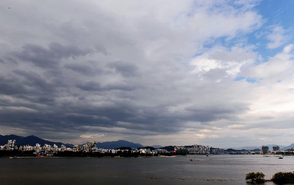
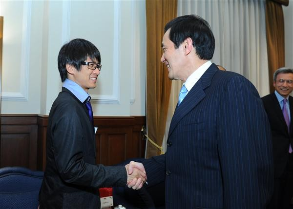
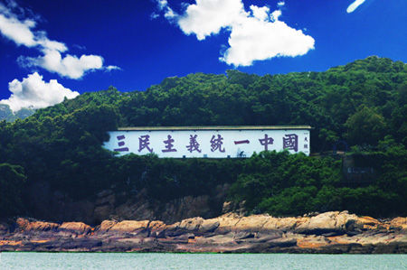

# 太平洋没有风

** **

#### 太平洋的疯

韩寒在台北让马英九“久仰”的时候，恰好我也在台北。说实在的，那天我还挺兴奋的，因为这可能是我跟我的偶像第一次身处一个城市。我是个韩寒的粉丝，不管是朋友聊天的时候，还是接受访问的时候，我都一直这么说。当然，现在公开地称自己是某些人的粉丝很容易被贴上“脑残”的标签，然而我想我还会依旧这么做，因为不能害怕由于别人说你什么，你就胆怯地放弃了自己想做的。当然，这也是我从韩寒那学来的。

韩寒在台湾转了一圈，回去之后写了一篇《太平洋的风》发在自己的博客上，然后太平洋的风就变成了太平洋的疯。那天我恰好在台中玩，宾馆里的电视节目几乎全都在探讨韩寒的这篇文章。记得有一个笑话，说一个老外搬到中国之后，晚上敲邻居家的门，说我家的电视坏了，所有台都一样。这个邻居说了一句：没事儿，七点半之后就好了。其实这个笑话也部分适合那一天的台湾，所有的新闻台，几乎都在报道这篇文章。两岸人民在这个问题上殊途同归，新闻上两岸人民都没有选择权，只不过原因不太一样，一个是因为《1984》，一个是因为《娱乐至死》。所以，有的时候探讨谁输谁赢是没有意义的，奥威尔跟赫胥黎都是对的，海峡的两岸，一边《动物农场》，一边是《美丽新世界》。

#### 关于对岸的想象

毋庸讳言的是，目前两岸的交流远非足够充分，自马英九上台大规模开启两岸交流至今，4年的时间远不够颠覆六十年来人们对方想象之中的偏见。这种偏见的产生大概出于两种原因，一种是因为历史种种原因而产生的教育的灌输，二是出于对自身问题的不满而产生的对对方的投射。

抛开第一种不谈，第二种的“投射”失败感我曾经深深地体会过。2011年，大陆的知识界，尤其是“公知”界掀起了一股民国疯，人们对民国的怀念和想象全都被寄托在了台湾这个小岛和马英九这个政客的身上。这一年民国范儿成为了恭维人的单词，公知们的聚会很多被打上了“民国”的标签，微博上马英九被捏造的“豪言壮语”也随处可见。来台湾之前我本身就对这里充满想象，在加上网络和朋友们的影响，于是也很容易将台湾想象成中华文化加民主制度的完美结合体。我想韩寒大概也是这么想的吧，于是当你遇到的人经历的事和你的想象吻合的时候，你会更加加深这样的意识。而当你遇到的人经历的事和你的想象不一致的时候，你可能猛然从自己的想象中惊醒从而开始检视自己之前的想象。而这种检视，往往会带有很强烈的全盘推翻的倾向。

大陆的一些人，对台湾的向往就是中华文化加民主制度的结合，尤其是在大陆一些反民主人士铺天盖地的“中国文化和国情不适宜民主制度”的舆论下，以及大量针对中国社会道德沦丧现象的民族劣根性批判的情况之下，台湾的全民选举加公民社会的现实不由得让人产生很多期盼，不能说这种期盼和想象是不健康的。当然，正如另一位在淡江读书的陆生所言，我们都生活在人间，台湾不是天堂，大陆也有拾金不昧的的哥，台湾也有人偷别人面包的同学。将国人对台湾的完美想象祛魅，显然是很值得去做的工作。然而我更想指出的是，韩寒的这篇文章其实是写给大陆人看的，如果我们看完这篇文章的第一想法是我们还有很多向台湾学习的地方，那么还证明我们还有进步的空间，而如果我们的第一想法是台湾哪有这么好，从而对韩寒进行批判，那么显然，我们就太骄傲了。

同理，我喜欢那些看完这篇文章之后对台湾是否真的这么好进行反思的台湾人，他们是真正爱台湾的人。而至于那些看完文章之后优越感极强，以至于把这件事写进自己就职报告的人，我只能说，哎，心眼儿太小了。

#### 文化是个筐

至于说廖信忠先生关于台湾社会温良恭俭让与中华传统文化无关，韩寒的相关说法是“中国人沉浸于自己的幻想”的说法，我实在是不能苟同。首先文化被用来解释社会现象的时候一直是一个残余的变量，或者是一种暧昧的存在。由于和制度等实实在在的东西相比，文化的定义显然更飘渺和不易掌握，于是人们在解释事物的时候往往喜欢先从制度方面进行比较，至于制度解释不了的东西，再一股脑的扔给文化去解释。其次，由于文化的范畴实在太大，每个人对文化的理解又不太相同，文化之间的差异又很难泾渭分明地进行归类，所以又有不少人不太相信用文化对社会现象的解释力，所以人们对于文化的态度往往比较模糊。然而廖先生断言台湾社会和中华传统无关，肯定是武断的。大陆社会现在经历的状况，台湾同样经历过，在台湾社会转型的过程中，经济实力的增长，民主制度的完善以及公民参与的增加，这些的的确确都是很强烈的影响因素。但是中华传统文化也不是一点作用都没有起到，台湾基础教育中的国学因素，社会中传统宗教的影响和推动，家族在社会中的重大影响力，即使是用最严苛的标准来说，这些都应该是文化的范畴。所以，关于廖先生的说法，我更相信是因为廖先生看到韩寒笔下“中华文化”四个字从而勾起的关于大陆一直不愿意放弃使用武力的想象得来的。

说了这么多，并无意冒犯谁，只是想说说自己的思考。韩寒说过自己就是一个照妖镜，可悲的是，大家都认为对方是妖怪。我绝对相信争吵和思辨的意义，但是更希望所有人在遇到问题的时候都能更加的内省。尤其是两岸问题，不管是大陆还是台湾，不管是什么样的人，我们都中了太多意识形态和扭曲教育的毒，我们都是别人眼中的妖怪，自己也都是一定意义上的妖怪。太平洋其实没有风，风在每个人的心中。

 

（采编：何凌昊；责编：黄理罡）

 
