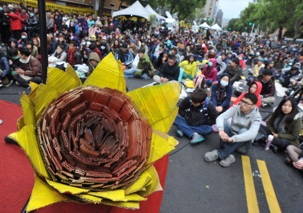
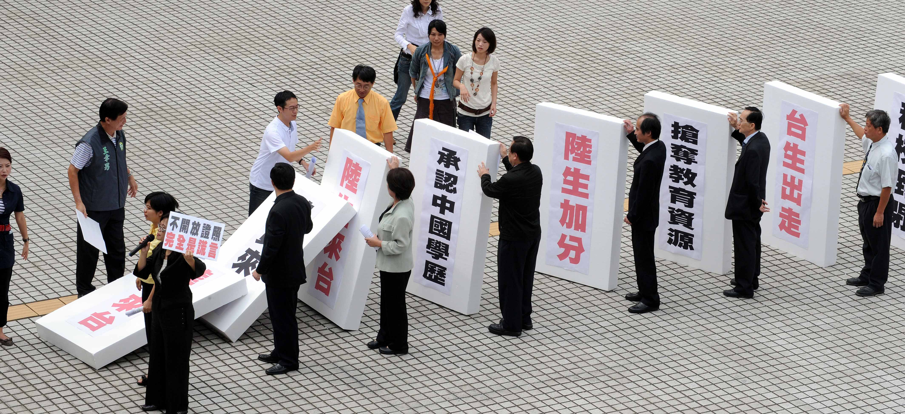

# 太陽花盛開時，我在台灣       —— 一位陸生對葉俊廷同學《太陽花盛開時，我在北京》的回應

一位台灣學生在太陽花盛開之際於北京生活八日寫下《太陽花盛開時，我在北京》，本文作者以陸生身份對上述文章中論點提出異見。我們隔著海峽，隔著歷史、經濟、政治的川流，必然產生觀念的差異，這並不代表觀念的優劣，正如作者所說：“用歸零心態去看待兩岸”。

讀罷陽明大學葉俊廷同學的《太陽花盛開時，我在北京》，夜不能寐。所以，我想以一位普通陸生的身份跟葉同學談談心。

**活在充滿矛盾的世界，誰不是矛盾的？**

作者說「最嚴重衝擊我的就是這個城市、這個國家的矛盾」：這裡號稱社會主義，但跟資本主義沒差；人們嚮往自由經濟，卻也希望政府有所管制。是的，的確很矛盾！可人是矛盾的、社會是矛盾的、世界也是矛盾的。姓資姓社的問題暫且不表，自由經濟本來也需要政府有所管制，只是程度上的區別罷了。雖然我不是一個馬克思主義者，但是我卻贊同唯物辯證法的一個觀點：矛盾是事物發展的內在動力。作者自己又想參加學運，又不想放棄赴北京交流的機會不也很矛盾嗎？從「龐大的罪惡感和對夥伴的不捨」來看心裡矛盾還不小。

其實，矛盾的豈止是北京，豈止是中國大陸，又豈止是作者本人呢？台灣不正是一個矛盾而多元的社會嗎？最不希望被歧視，卻又總是歧視別人 ；以自己所擁有的民主體制為榮，同時又對現有的民主體制極度鄙視。有人質疑「讓資金流出是掏空台灣， 讓資金流進是買下台灣；讓人才走出叫人才外流，讓人才走入叫木馬屠城；賺台灣人的錢是欺人太甚，讓台灣人賺錢是收買人心。」這不是矛盾是什麼？

作者擔憂「中國這一代的青年接下來勢必要面對這樣的矛盾，政府控制和市場自由開放之間的衝突、經濟快速發展這華美糖衣下所犧牲的人權、 社會正義等等的內在矛盾，都在我與中國同學的談話中不斷衝擊著他們的想像。」我是否可以說，台灣這一代的青年接下來同樣勢必要面對這樣的矛盾：政黨相爭和經濟滯脹之間的衝突、開放自由經濟抑或閉關自守、擁抱大陸抑或抵制「中國因素」、抵制核能同時狂開冷氣浪費能源、民主自由這同樣華美糖衣下所犧牲的效率等等的內在矛盾？希望我接下來的回應沒有不斷衝擊著你的想像。

作者認為「人民的啟蒙是不可逆的，如此的矛盾不斷擴大，如沒有謹慎處理很有可能會釀成衝突。」不知道這裡的矛盾不斷擴大，是否會比台灣因為太陽花學運而產生的社會撕裂與對立來的厲害。前有中正一分局警民對立，後有世新廣電繫主任被學生嗆「後悔找你寫推薦信」，這樣的例子我不用多舉。如果整個社會鐵板一塊，發出一致的聲音，似乎就看不到那些矛盾了，可這不恰恰正是台灣人所鄙視的嗎？

**關於社會制度、自由經濟與兩岸價值觀，到底是誰的意識形態更嚴重**

作者認為大陸「同世代青年對於資本主義、自由市場近乎迷戀的嚮往」甚至「其中有個中國同學說到他認為器官應該放到自由市場買賣」，而經濟方面「有些人非常信任國家，相信在國家的計畫與帶領之下一定能達成如此的目標⋯⋯這樣的社會到底是不是資本主義呢？」

北大同學也回答你了，當前中國大陸的發展模式，或者說所謂的「中國模式」，名義上叫「有中國特色的社會主義」。但實際上叫什麼其實並沒有那麼重要，越來越多的中國人開始跳脫意識形態的框架去思考問題、觀察世界。你可以說這很現實，但是2014年了還在用「姓資姓社」的思考框架去看問題，顯然已經過時了。我們能理解執政者所謂的「有中國特色的社會主義」與「資本主義」差別不大，也很少有大陸年輕人會意識到或者在意自己所生活的地方是不是「社會主義國家」。政府說一套做一套的老梗，你在台灣見的少嗎？大陸早在30年前就確定了「發展是硬道理」「不管白猫黑猫，能抓到老鼠就是好猫」這些基本社會共識。姓資姓社的問題早就不是我們在實務中會考量的問題，他只存在于政治課本與公務員考試等範疇。

作者批判大陸青年「如此對自由市場的嚮往」。說到自由經濟與器官買賣，台灣不是以自由為榮嗎？台灣也因自由經濟而起飛。大陸現在的問題不是經濟太自由，而是不夠自由。中國大陸已經明確提出「使市場在資源配置中起決定性作用」，這要求依據資源配置效率來決定資本的配置。作者自己也說「其中有個中國同學說到他認為器官應該放到自由市場買賣」，只是「其中有個同學」，而不是所有大陸醫學生都這麼認為。用最極端的例子來證明一個地方不好，需要我舉台灣的例子嗎？不久前台灣媒體報道苗栗《狼父性侵4幼女 母助紂為虐》。我能因此在兩年後回到大陸時說台灣父母不講禮義廉恥，喜歡猥褻孩子嗎？不可以。因為我知道這是極端特例。

飽漢不知餓漢饑，一個經歷過經濟騰飛、錢淹腳目的社會指責另外一個窮了這麼久的社會在經濟最好的時候追求財富、嚮往富裕，是不是有點自私？北大學子對自己國家過去的貧窮封閉感到不安、甚至羞恥我覺得無可厚非；而政府提供了改革開放這條路，有很好的前景，有「有能力就能出頭天」的美好想像也無可厚非。大陸普遍接受的一個價值觀是「落後就要挨打」，我們一直被教育一百年前的屈辱，包括將台灣割讓給你推崇的日本，是因為當時的中國很落後。雖然有「落後就要挨打」已經過時的觀點，但是國際政治的現實就是靠實力說話。克里米亞併入俄羅斯西方再怎麼反對，美國拿普京一點辦法都沒有，國際政治的現實就是如此。而實力來自于經濟，既然躲不過，中國的方法就是「韜光養晦」：按照世界現有的遊戲規則一起玩，在全球化體系內發展壯大。之所以選擇走「有中國特色的社會主義」這條路，或者說類「資本主義」，也是因為中國窮怕了，不想繼續落後挨打。

都說台灣的年輕一代沒吃過苦，不知道什麼是「真正的貧窮」，認為一切都是理所當然。你們可以方便地周遊世界，一百多個國家免簽證想飛就飛，可還是經常聽台灣人抱怨臺北壓力大。但你去看看東京、香港、北京、上海、新加坡，哪個地方的壓力會比臺北小？

作者批判大陸官員腐敗「權貴資本主義興盛發展」且「光2012年就有182,000個政府官員因貪污受到懲處」看到看到 182,000這個數字，我和我的大陸同學第一反應是驚喜，原來一年抓了這麼多。大陸確實存在貪腐問題以及各種官商勾結，敢問台灣屬於哪種類型的資本主義？是否存在同樣的問題？權貴資本主義又叫裙帶資本主義，《政府失靈後的台灣經濟》一文認為「當今政府欲以公權力引導經濟發展的舊思維，是近年來台灣經濟成長放緩的主因之一⋯⋯國家主導的模式已漸淪為裙帶資本主義。」

你跟我都看到了《台灣學運暴露兩岸深層危機》， 文章詳細分析了中國模式與台灣社會至少存在與台灣人文傳統、社會正義以及自由價值三大衝突，「中國模式所代表的價值觀，即絕對的發展主義，徹底的物質主義、拜金主義、金權主義⋯⋯一方面在價值觀上，在文化上，台灣人極度自信乃至自負。但另一方面，兩岸經濟體量落差太大，這又導致台灣人經濟上的極度不自信乃至自卑。而經濟上愈是不自信乃至自卑，對大陸當局在價值觀上和文化上可能的滲透就愈是恐懼。」

經濟基礎決定上層建築；而需求層次理論也認為先要解決生理需求，最後才是自我實現。中國大陸正處於追求物質、擺脫貧困的黃金時代，你要求一個尚未完全擺脫貧困的人在無法保證下一頓飯的情況下關注人文傳統、社會正義與公平自由，可能他聽過，但估計沒有時間和興趣細想。但幸運的是，仍然有一些人已經在想這些問題了。
 
不得不承認兩岸在價值觀方面存在諸多不同，但價值觀是動態的，而非一成不變。子曰「君子和而不同，小人同而不和」，台灣經濟騰飛時不也經歷過「絕對的發展主義，徹底的物質主義、拜金主義、金權主義」嗎？

談到某些西方社會對「中國模式」或者說中國價值觀的指責，中國大陸「一不輸出革命，二不輸出飢餓和貧困，三不去折騰你們。」中國沒有那麼好，也沒有那麼不堪，只不過跟其他處於快速發展和轉型的發展中社會一樣，充滿了矛盾、機會、問題、財富、投機、希望⋯⋯台灣社會與所謂的「中國模式」兩者之間只是選擇的道路不同罷了，都是為了抵達目的地。如果說前者是已經開上賓士的中產階級，那麼後者則是每天搭乘賴捷運的普通大眾；賓士有舒適的內飾和良好的操作感，來去自由，想去哪裡就去哪裡，並且可以和車內的人一起協商路線；而捷運沒有豪華的裝潢，但是實用的功能不會少，並且規定了路線，不是所有的地方都能通達，仍存在諸多不便，還不可以在車廂內飲食；但是捷運路線在一步步地完善擴展，未來也能去到很多現在到不了的地方，更何況在尖峰時刻，搭捷運的不一定會比開賓士的更晚抵達目的地。
 
作者批判大陸民眾「對政府的信任」。我認為，對現階段的中國而言「有些人非常信任國家」並非壞事。如果人民都像台灣這樣非常不信任「國家」，動輒佔領立法機關，學生罷課，甚至工人罷工，經濟停擺，不僅對中國是災難，對台灣，對全世界而言更是災難。確實有些人非常信任國家、信任政府，而台灣之所以會發生太陽花學運，也正是因為年輕人太不信任這個「國家」和「政府」。
 
可以說，對岸的那個全球第一大黨俱有極強的自我折騰以及自我修正能力，所以他是會變的。我們可以看到，中國政府確實是在一步步地進行改革，船小好調頭，而大陸有十四億人口，經濟總量全球第二，要給船大的中國一些時間與耐心來掉頭。有人說過，任何問題除以十四億會變得很小很小，而任何問題乘以十四億會變得很大很大。如果十四億人不能凝聚，大陸則很有可能再次陷入諸侯爭霸甚至軍閥割據的狀況，四分五裂的中國屆時會讓李登輝「中國七塊論」成為事實，讓所謂的《大日本帝國興國聖戰計劃》成為現實：「中國不同於日本⋯⋯新疆、西藏 、青海、寧夏、滿州等都應成為獨立自主的國家，分裂這些地區的根據就是他們獨有的民族性⋯⋯在中國，只有東部的漢人具有阻礙我們的能力，因此，如果中國被 分裂成七個或幾個國家，漢人的力量就會被大大削弱，其戰略迴旋的餘地也會大大的縮小」。
 
但是即使有這樣的那樣的社會問題，絕大多數中國人對中國的未來是有信心的，也就是所謂的「有能力就能出頭天」的美好想像。溫家寶說「信心比金子还重要」，我們就是有這份「美好想像」，而大陸人也正是憑藉著這樣的美好想象把中國從一個積貧積弱的東亞病夫，發展成為世界第二大經濟體。而台灣現在最缺的恰恰不就是對未來的信心以及美好想像麼？也正是如此，才會有高達95%的台灣上班族有意赴大陸發展，比一年半前調查的77%高出很多。

**關於國族、媒體、自由、民主、庶民文化與醫療，到底是誰在用文化高位思考？**

意識形態的偏見會導致文化高位的思考。作者說「中國同學也提出了中國南方和北方的差距，他們是以一個集合中的異質看待這樣的文化差異， 甚至連新疆和西藏亦然。我問他新疆和西藏文化、語言上都跟中國不一樣，為什麼還不讓他們獨立？⋯⋯我對這樣文化高位的思考感到不太舒服。」如果說中國同學在用「文化高位」思考國族問題，那麼葉俊廷同學自己更是用「文化高位」思考兩岸的自由、民主、庶民文化、醫療與媒體。
 
為什麼說作者自身才是「文化高位」思考者？郑鸿生在《台湾的大陆想象》中寫道「反共意識在九○年代已經失去其實質意義後，又很弔詭地被轉化成反中國意識⋯⋯新中國不論那個版本，中國也不論新舊，都一概被拒斥了⋯⋯冷戰結束，美式資本主義成為唯一稱霸的意識形態，而其『民主自由』遂成了這一意識形態的武器⋯⋯大陸的『缺乏民主自由』相對於台灣在李登輝掌權後的『民主自由』，也就 成了一種『落後』，『進步的社會主義中國』遂又淪為『落後的中國』。」
 
根據葉俊廷同學的論述，我可否說他也提出了台灣南部和北部的差距，他也是以一個集合中的異質看待這樣的文化差異，甚至連蘭嶼和金門亦然。蘭嶼是達悟族世代生長的土地，文化、語言都跟台灣本島不一樣，但卻要收留台灣的核廢料，為什麼還不讓蘭嶼獨立？所以真正有文化高位思考的是作者自己。作者想必應該不是台灣原住民，那麼請問你的祖先四百年前或者六十年前踏上福爾摩沙這片原住民世居的島嶼時，有沒有考慮過他們的感受？《中華民國憲法》規定「中華民國領土為江蘇⋯⋯新疆、蒙古、西藏等固有之疆域。」如果想讓西藏新疆獨立，請先行修改《中華民國憲法》。
 
如果文化語言不一樣就允許獨立，為什麼中華民國在1946年承認已於1945年外蒙古公民投票後獨立的蒙古人民共和國，但在1953年重新將蒙古地方視為中華民國領土？反過來說，如果文化語言都一樣，是否就應該統一？
 
媒體方面，葉俊廷同學片面認為「單就資訊的取得管道，許多國際知名的媒體，如CNN、BBC、紐約時報等等在中國境內都看不到，要取得國際資訊幾乎只能透過央視或是官方媒體，在這樣單一扁平的資訊中要培養出健全的國際觀，我覺得是十分困難。」

這不是「文化高位的思考」，那什麼才是？CNN、BBC、紐約時報這些老牌帝國主義國家的媒體，其實想看的人總是能想辦法看到的。我身邊的無錫籍陸生也表示，自己家電視就收得到CNN。同時，要取得國際資訊顯然不只是透過央視或是官方媒體，我們還有很多管道。雖然大陸沒有台灣這麼自由的言論環境，但是還是有很多人在努力獲取多樣的資訊。建議作者下次前往大陸時順道看看自由派的那些報刊雜誌。大陸並非鐵板一塊，這裡同樣存在對政治的評論與批判，只是有些紅線目前還碰不到罷了。而人民富有了，自然會開始關注更多以前沒有關注的領域：身體健康、出國旅行、言論自由⋯⋯其他的事情會慢慢開始變得重要，因為霧霾危機開始關注環境污染，因為出國旅行開始回望中國。
 
作者自己也說，雖然台灣「擁有自由的言論環境，可以獲取多樣的資訊，能從中養成良好的國際視野」，但不加以善用「耽溺於小確幸」又有何用？《我們造了神，才發現他們只是神棍》提到「現在台灣言論很自由了，這麼自由的環境下，我們得到什麼呢？台灣本土電視台有好幾打，好自由，但最終還是被無腦的蠢節目壟斷⋯⋯抗議、批評了這麼多年，政府變得很好了嗎？」
 
如果單方面臆想「央視的權威是受中國人敬重」，建議作者看看這篇有關央視曝光東莞色情產業的文章。從麥當勞到星巴克到蘋果公司，再到中國百姓對央視東莞掃黃報道的強烈反彈，就是你所謂的「央視的權威」？而新聞監督方面，央視「焦點訪談」通過新聞報道揭露官員失職不正是媒體的職責所在嗎？是央視的意識形態重還是作者的意識形態更重？
 
葉俊廷同學認為「新聞聯播」「海峽兩岸」這樣的節目選擇性報道有失偏頗，而「這樣的資訊其實在台灣也不陌生，但是在台灣，很快就會有不 同的訊息讓大家獨立判斷。在中國單一言論輸出的情況下，中國同學很容易信以為真。長期以來，在中國媒體的塑造下，他們對民進黨的印象就是『陰謀上位、台獨、很有煽動性、與大陸關係差』」。

你為何那麼篤定「中國同學很容易信以為真」呢？為何那麼篤定大陸不會很快「有不同的訊息讓大家獨立判斷」呢？另外，民進黨的四個印象「陰謀上位、台獨、很有煽動性、與大陸關係差」除了第一個有待考據，否認其他三個，民進黨自己都不答應吧？
 
我對葉俊廷同學引用的「控制人民最有用的方式是控制思想，而控制思想最好的武器就是媒體」這句話深以為然。不僅是作者「在中國待幾天下來深深感受到這句話的威力」，我在台灣的八個月也深深感受到這句話的威力。「電視台有三分之一的頻道是央視」不知道是作者科學統計還是主觀臆測。況且不是所有的電視台都會在七點到七點半播放新聞聯播。即使播了，你可以選擇不看，看了可以選擇不相信。相反，《台商在大陸發財有秘訣 第一條堅持看新聞聯播》，以觀察這個國家的政策走向和經濟趨勢。在大陸不是所有人都會在七點鐘齊齊坐在電視機前，喜迎「新聞聯播」。雖然大陸很多電視節目同台灣一樣，會報道社會問題或陰暗面，但社會仍需要有管道來了解信息，凝聚共識，知道國家未來發展的新政策，而「新聞聯播」恰恰起到了這樣的作用。大陸的新聞並非是報喜不報憂； 相反，台灣對大陸的新聞「報憂不報喜」才真是有失偏頗。
 
葉俊廷同學提到「因此即使翻牆很方便，許多學生不太會再去接觸更多不同的資訊」並以茂名事件舉例。說到「茂名事件」，作者「文化高位的思考」再次出現。「一週後各個論壇上才有人零星開始討論和流出消息」請問作者各個論壇指的是哪幾個論壇？大陸網民平時上哪些網站是否有做足功課？微信朋友圈和微博你開了嗎？茂名事件一開始，微博上出現了很多假消息，而大部分也在微博被拆穿。但就這件事而言，台灣人更願意記住的是這些假消息，對於它後續被拆穿基本不關心。而關於翻牆的問題，建議看看《大中国与小台湾》。事物都有兩面性，台灣叫一體兩面。不要一邊批判香港台灣被陸客佔領，侵害了在地人權益，一邊又批判大陸護照不能免簽隨意出境出國。如果大陸人可以免簽周遊各地，請問開放的你做好接待洶湧人潮的準備了嗎？同理，假如網路開放了，請問牆外的你做好了面對中國網民的準備了嗎？

關於民主與自由，作者提到茉莉花革命與烏克蘭的衝突。 《中國人的民主“飢渴症”與“拒食症”》提出「我們不得不悲觀地看到一些並不成功的民主國家在以自己為例，動搖了一些人們選擇民主之路的信心。有關埃及、泰國、烏克蘭等等以比較直觀的帶有沖擊力的 方式影響人們對於民主的信心與信念⋯⋯至於台灣此次太陽花學運⋯⋯更容易刺激人群對於不穩定狀態的放大想象，轉而更加強烈地懷疑民主制度並拒絕選擇民主路線。」而事實上「民主當然不是萬能的⋯⋯它僅僅可能是更不壞的選項而已。」
 
反觀台灣社會自身，「台灣民眾對於民主的信念，竟然逐年在下降」。實際上對於民主是什麼，台灣內部尚未達成共識：「台灣的民主危機，或許不僅在於民主 信念滑落，而更來自不同人群對於「民主」有相當殊異的理解與想像，且其中有相當一部份的理解，大異於政治學理論中對民主的定義。」
 
關於民主，推薦看看這篇經濟學人的《民主出了什麼問題？》，「每當民主取得一點勝利——如開羅和基輔不得人心的政權被推翻時，人們總會對民主信心倍增，很快卻又會失望。在西方社會之外，民主之路的盡頭往往是又一次的崩盤。即便在西方社會，伴隨著民主制度也常常出現政府負債，內政處理效率低下、過度干涉他國內政等問題。誠然，民主從來都不能免於批判，但隨著西方老牌民主 國家暴露出越來越多的缺陷，民主在世界其他地區日益式微，人們開始重新審視曾對民主制度抱有的懷疑。那麼，民主為何失去了前進的動力？ 金融危機使得「華盛頓共識」遭到了整個新興世界的詬病。與此同時，中國共產黨打破了以往只有民主制國家才能取得經濟進步的局面。美國經濟最快速增長之時，其國民生活水準約每三十年提高一倍。而中國在過去的三十年裡，生活水準幾乎每十年就提高一倍。中國的精英階層認為他們的模式——由共產黨進行嚴格控制，廣納賢才進入上層社會——比民主制更高效且更不易受政治僵局所影響。政治領導權約每十年交接一次，共產黨通過不斷提拔有能力的人才作為骨幹力量來實現其政治目標⋯⋯與此同時，中國的領導人已解決了民主制需要幾十年才能解決的國家建設方面的重大問題。舉例來說，中國僅用兩年時間就使養老金覆蓋了超過2.4億的農村居民，遠遠超過美國公共養老金體系中的總人數。」文章也再次呼應了日媒的觀點「如果現有的體制可以繼續支撐經濟增長，那麼很多中國人願意忍受下去。」

其實評論中也提到「民主只解決了人的權利問題，其實本質是選擇利益集團的權利，卻無力解決經濟發展的問題，而這恰恰是那些急於通過實行民主制度提高經濟能力的人群的希望，因為經濟問題不是體制能解決的。因此，失望出現了，急躁的人們迫切地要求更換領導集團，希望換一個領導集團能馬上提高生活水準，反正他們現在有了權利，幹嘛不用？這些權利是民主的長處，用得好，國家安定進步，用得不好，國家動亂。民主和經濟發展的關係是一種弱相關的的關係。」
 
而對於顏色革命，《金融時報》某篇文章稱美國對華手握兩張王牌「一是利用中國處於社會大轉變時期矛盾多發的現實推行顏色革命；二是利​​用美國在全球貿易規則上的控制權，阻擾中國經濟的轉型升級。」而日本《外交學者》4月14日文章反問《美國對中國有“王牌”嗎？》認為：「確實，中國社會的矛盾以驚人的速度增加⋯⋯問題是：這些零星的社會不穩定事件，會直接和明確地導致中國發生顏色革命嗎？“阿拉伯之春”產生的動亂和衝擊，並未在華引發類似的社會和政治變化⋯⋯民眾往往想保護自身經濟利益，針對的是腐敗幹部，而非挑戰整個政治體制。」日媒能夠理解務實的中國人民在經濟高增長的總體趨勢下，並未挑戰整個政治體制，更不希望發動一場革命。
 
埃及的革命建議作者看看《我的陳文茜：謊言拆穿了》：「埃及軍方及背後默許它的美國，至今皆未對這場政變提出必要且合理的解釋。2011年那場「阿拉伯之春」是在多方力量集結下浪漫的民主幻想，包括年輕人、自由派、伊斯蘭派⋯⋯美國及軍方不願看到世界上最有影響力的回教國家由伊斯蘭主義者掌控⋯⋯也不願透過民主合法程序三年後讓莫西下台⋯⋯埃及二次革命的歷史過程⋯⋯對那些曾經抱著希望、渴盼革命的天真生命，這是多麼殘酷的出賣與玩弄！而對那些世界上原本相信歐巴馬為民主自由價值領導者的人，又是多大的謊言拆穿遊戲。」

說到庶民文化層次與素質，葉俊廷認為「就物質的層次上北京和我所去過所有資本主義國家並無差別，在庶民文化層次上卻遠遠落後，仍然有人大聲嚷嚷、隨口吐痰、恣意插隊推擠。」《台湾人爱比素质，大陆人爱比高楼。》提到網友「細膩觀察高雄機車族遇到紅燈時的反應，歸納出35％的騎士會無視地騎過去，5％會假裝右轉、然後回正再騎過去，30％會越線停在斑馬線及待轉區，只有30％會停在線後，文章引起不少網友直呼「中肯」⋯⋯其實台灣人也不完全素質好，還是要看人。」引用這篇台灣網友的文章不是為了反駁葉俊廷同學對於大 陸庶民文化層次和素質的批判，而是想說：哪裏都有素質高的人，哪裡也都有素質低的人。話說三十年前的台灣是什麼樣子你試圖了解過嗎？台灣不是有史以來都這 麼「仁義禮智信」的。
 
關於醫療，不得不承認比起台灣的健保，大陸的醫療系統確實存在諸多問題，還有很長的路要走。但是台灣健保也不是一日建成的，也存在諸多改良之處。《台灣是面破碎的鏡子》提到健保「保障十分全面，但虧空也很嚴重，政府屢次希望提高民眾繳納的健康保險額度，但因抗議不得不擱淺，民眾的想法是『又要馬兒跑，又不讓馬兒吃草』。2012年大選時，讓我最難受的是，在立委選舉中，一個號稱要讓健保免費的組織都能過得幾十萬票。」政客選舉時都在談怎麼花錢，甚少提出提振經濟的切實方案，可處處都花錢，你們鄙視的錢從哪裡來？
 
如果說大陸的醫療保險系統不分公私都在逐利，違背了醫療的人道公益性質，那麼先進的台灣健保制度則是因為政黨杯葛和民粹主義，公開地踐踏公平、正義與基本人權。因為作為陸生，我們目前只能在網路上想像台灣健保的美好，並不能實際感受到。不談雙倍學雜費學分費、禁止擔任研究助理、禁止打工，只說香港、澳門、馬來西亞等地的僑生以及外國留學生都是明確納入健保的，唯獨陸生除外，這算不算台灣這個追求公平正義的社會最「偽善」的地方？

**關於歷史脈絡與台灣的日本情節，到底是誰在忽略「獨特的歷史脈絡」？**

正是因為作者採用「文化高位的思考」，才會忽略兩岸「獨特的歷史脈絡」。作者說大陸人「很自然的覺得台灣就是中國的一部分」，「這個論述之中其實台灣獨特的歷史脈絡被有意無意的忽略了，台灣不只是大陸文化的延伸⋯⋯日本的統治也對台灣的民族性有了根本的影響，經過這樣文化、歷史的薰陶後，我覺得兩岸已經是不一樣的民族，但對他們來說，中國文化是兼容並蓄的。」
 
說到日本的統治「對台灣的民族性有了根本的影響」，我一直好奇，為什麼同樣被日本殖民統治過，韓國與台灣的對日態度卻截然不同？尤其是台灣的年輕人。我試圖去理解其背後的歷史脈絡。《日本殖民統治的後遺症 台灣VS.朝鮮》 一書談到「在韓國如有人讚揚日本殖民統治，對韓國的現代化有貢獻則此人會被追殺。在韓國，被認定為「親日派」的人士，普遍遭受社會大眾的唾棄⋯⋯經過挫折 與努力，韓國似乎清除了日本殖民統治的後遺症。」而「台灣的歷史教科書，除了在政治面提到台灣人對日本的鎮壓有抵抗之外，不論經濟、社會、教育、文化各方面，幾乎全面肯定地記述日本殖民地統治的「發展」面，而不去看基本上的「侵略」「掠奪」面 。」
 
親日的樸正熙總統即便死後還是會被韓國清算，而親日的「民主先生」李總統會自豪地說「22歲以前是日本人」「日本是台灣經濟發展的啟蒙 者」。一個社會的總統都如此，更何況在李登輝、陳水扁對教科書不遺餘力的改造下，葉俊廷這一代年輕人了。中國文化確實是兼容並蓄的。作者自己也承認中國是「共產社會主義國家」這樣的概念是「自小的教育」。不確定「共產社會主義國家」這樣的說法是哪裡來的，不過我只聽過「共產主義國家」或「社會主義國家」。
 
如果說台灣的歷史脈絡之所以獨特，不僅僅是因為日本，還曾經受過荷蘭、西班牙、日本的統治，那大陸幾乎任何一個省的歷史複雜程度都不會比台灣來得低。滿清末年中國各大都市、港口租界林立，而日本侵華戰爭期間，東北更是淪為準日本殖民地。現在也沒有見過東北人會對日本感恩戴德。回歸原點，正是「中國」這一稱呼，涵蓋了多少複雜的地域、複雜的人群、複雜的文化、複雜的歷史⋯⋯台灣如何以「歷史脈絡」來跟中國這個無數錯綜複雜歷史脈絡的綜合體比拼脈絡之獨特性？
 
作者質疑大陸青年所接受的黨國教育，那作者自己接受到的又是什麼樣的教育呢？《台灣的共識民主與國族認同》一文提到：「參加這場運動的學生幾乎都是在陳水扁執政後接受的中學教育。對於他們來說，國家第一高峰不再是珠穆朗瑪，而是玉山；國家最美的河流也不再是長江黃河，而是淡水河和濁水溪⋯⋯在上些年紀的人看來，台灣海峽的對岸叫做大陸。而對於太陽花世代來看，台灣海峽的對岸就是中國。」
       
正是這樣的教育導致作者不僅忽略了台灣「獨特的歷史脈絡」，更忽略了中國大陸「獨特的歷史脈絡」。這也就是為什麼作者會「抱持著理解社會主義要如何實踐的好奇踏上中國」，而非像我一位在政大認識，曾前往大陸交換半年的台灣同學那樣，在交換之前，做如下的心理調適：「對於缺點誤失，在沒有真正深入了解來龍去脈以前，應該以寬容大度的方式看待，不宜驟下定論⋯⋯做到以誠待人，透過求同存異的開放角度，自然能讓雙方跳出先入為主的既定模式，開展出嶄新而深入的溝通交流」。
 
基於對兩岸「獨特的歷史脈絡」的了解，他在交換心得中寫道：「因文明優越論、西方勢力有意操弄、媒體誇大報導、政黨對立攻訐以及過去醜化宣傳遺留等因素影響，視野本應更加開放寬闊的台灣社會，卻形成一種狹隘偏執的「逢中必反」心態，習慣以自我中心出發作價值判斷，對中國大陸改革開放以來快速的政治經濟發展未能與時俱進，大多議題仍戴著負面觀感的眼鏡做理解⋯⋯受到此種意識形態從小到大的思維養成，已經型塑成我們習以為常的價值標準，若是 以此心態前往進行交換，容易一遇到差異即做出負面批評的錯誤判斷，不經意流露出一種文化沙文主義的心態。」

正因為我們都知道存在這「獨特的歷史脈絡」，所以他建議台灣年輕人前往大陸前需要「釐清政治宣傳造成的誤解，跳脫自幼及長形成的價值經驗，運用兼聽則明不偏不倚的方式，虛壹而靜重新檢視新事物。」也就是用歸零心態去看待對岸，嘗試著去理解其「獨特的歷史脈絡」，而不是抱持著「大陸尋 奇」，對葉俊廷而言可能叫「中國尋奇」的心態去檢視，得出「政府在有計畫的改革開放下，不斷狂飆的經濟發展，但其他層次的發展卻被遠遠的拋在後頭」這樣片面的結論。

**「莫名的親切與感情」總好過「無端的仇恨與鄙夷」**

作者聊統獨問題讓我們再次看到了其自身的矛盾之處：一面批評大陸「對統獨議題論述的同質性也相當高，他們是以大中華文化圈的角度去思考 ⋯⋯在共產黨的宣傳下，他們對台灣有莫名的親切與感情⋯⋯在思想和感情上他們很自然的覺得台灣就是中國的一部分」，一面卻又抱怨說「年輕一輩的中國人並不避諱和台灣人談統獨議題，但他們並沒有太大的興趣⋯⋯兩岸只要關係只要沒有太大的變動，他們基本上不太關注，甚至覺得統獨對他們而言並沒有太大的影響，對我們來說卻牽扯到國家的未來。」
 
不知道作者到底希望大陸的年輕人關注統獨議題還是不關注。也許他的潛台詞就是：你們都要關注統獨議題，因為這牽扯到我們台灣的未來。但我們「已經是不一樣的民族」，應該是「不同的國家」，所以不要跟我談統一這件事。
 
其實，不論大中華文化圈的思考角度正確與否，也不論台灣是不是中國的一部分，我始終相信「莫名的親切與感情」至少好過「無端的仇恨與鄙夷」。哪天地球上五分之一的人口對台灣懷有的不是「莫名的親切與感情」而是深深的憎惡，我想作者會更矛盾。 
 
提到統獨問題，待了這麼久，筆者自身逐漸能夠理解台灣人的立場於感情，但大多數的大陸民眾沒有這樣的機會去理解。實際上，不論大陸是否是威權體制，是否是共產黨執政，普通民眾都不可能從情感和理智上接受「台灣獨立」這樣的事實；即使大陸像台灣希望的那樣走上多黨執政的民主道路，也不可能有一個執政黨敢讓台灣在自己執政的時期獨立出去，因為這樣便會失去其執政的合法性，並會被永久地記載於史書。換作是蔡英文、陳水扁做國家主席，一樣做不到。如果說千島湖事件和所謂的「飛彈」把很多不統不獨的台灣人逼上了「台獨」的道路，那麼「台獨」運動自身便讓很多對統獨議題「並沒有太大的興趣」的大陸人更加堅定了統一的想法。而實際上，台灣不僅SNG車密度全球第一，防空飛彈的部署密度也是全球數一數二的，這些飛彈應該不是對著日本吧？
 
筆者去年夏天因為「莫名的親切與感情」，辭去北京的工作來台灣念研究所。我在北京工作了三年，即便如此還不敢說對北京非常了解，更怕因妄下論斷而流於膚淺。而你在北京只待了八天，便成就了這篇文章。不是不能寫，而是即使人在北京，心卻帶著有色眼鏡，以「文化高位的思考」，忽略大陸「獨特的歷史脈絡」，那麼得出的結論便會有失偏頗。

來台灣八個月一直不敢動筆，因為「過客式」的遊記感想我認為恰恰是對台灣這座寶島的不尊重。八個月不算長，但兩岸青年交流的活動倒是參加了不少，可我還不敢說對台灣足夠了解。我只是努力嘗試著去觀察、體驗、理解、反思、對照，而不輕易下結論。
 
不知是幸運還是不幸，太陽花盛開時，我在台灣。但我卻第一次感受到了在大陸都未曾感受過的那種「想說卻無法說」的痛苦，相信痛苦的也不只是我一個人，也不只有陸生。
 
最後順道請教一個問題：陸生納入健保已經躺在立法院半年多了，我是否可以以立法院與立委不作為，故意杯葛，破壞人權為由，號召200位陸生外加幾萬名大陸交換生佔領立法院，敦促立法院迅速通過相關法案？我知道，不可以。
 
不知你那些在北京朝夕相處了八天的北大同學看了你的文章會作何感想。惟愿自強不息，天佑台灣，兩岸和平！

附：《太陽花盛開時，我在北京》  http://blog.udn.com/alain7075/12613553

（採編：余澤霖；責編：葉璐蓓）