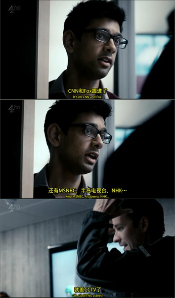

# 如何控制人类？——《黑镜》横纵分析

**工具与人类某些方面的失衡已经存在，而工具对人类的全面控制也并非虚妄，《黑镜》用三集的时间构筑的三个“超现实”场景，也许正隐含了人类文明可能的未来。和机器的竞赛已经开始，而直到目前我们的优势，仅仅在于——意识。**  

# 如何控制人类？——《黑镜》横纵分析

## 文/魏皮囊（暨南大学）

 

中国文化崇尚“驭人”。中国的统治阶级对驭人之术和对房中之术怀有一样旺盛的需求。中国的知识分子花费毕生心血把蹲坑的时间拉屎的气力都用到了驭人之术的研究上，而统治者也不遗余力的在驭人上面实施了一次又一次伟大的试验，他们尝试了焚书坑儒或者罢黜百家把人民大脑掏空的思想控制法，又尝试了一保一甲把人一大圈一小圈当猪一样豢养的权力控制法，更尝试了标语口号大字报强迫人民信腊肉得永生的信仰控制法。但他们的尝试始终都没有达到预期的目标，不安分的人民一再冲垮了他们苦心编织的专制网罗。失败或许有技术上的原因，但更主要的应该归咎于上述的方法都没有摆脱人的特性，控制局限于“人对人”的控制，而少数人对多数人的控制有无可避免的不稳定性，失败是历史的事实更是逻辑上的必然。 

有关外物控制人类的方案，第一个系统阐述者应该是马克思。马克思用剩余价值学说构建了资本主义经济的剥削模型，进而引出在政治与意识形态上的阶级矛盾，按国产电视剧想像力匮乏的正邪分化把全人类分成对立的两大阵营——资产阶级与无产阶级。阶级剥削的实现有赖于一个重要媒介——机器，机器在剥削中扮演了资本家的走狗角色，大范围的机器劳动压榨工人的血汗，限制工人的自由，更让劳动物化让劳动者异化。马克思揭露了机器劳动的现实危害，但他更注意到了机器劳动的潜在威胁。技术的更新与劳动的扩大让机器仿佛安卓系统天天都在升级，而机器的高效与周密则有如毒品让人类愈发的依赖。终有一天机器将超越工具的局限，在吞噬劳动者的同时反噬其主，对人类不分有产无产平等的进行异化改造。人类在机器规律而压抑的节奏中丧失自我，机器则在肉体与心智上全面控制了人类。 

然而，不论是人类控制人类的变态谋划，抑或机器控制人类的可怕预言，在历史上都不曾得到真正的实现。但，控制人类的念头并没有完全拔除，人类受控的可能更不曾彻底根绝。而在机器控制论之后，一种同样属于外物控制论的新型控制方案正在渐渐崛起。三集《黑镜》，正是对新方案一次隐晦而见血的简介。 

 **一、市场经济：一千五百万的价值** 

《价值》一集构筑了一个庞大和周详的幻想式世界，以求放大现实世界正面临的一种新的趋向——虚拟化。虚拟化正在蔓延并泛滥于我们周围，替代自然的经验，控制现实的行动，支配我们的感官。我们在虚拟中生存，在虚拟中满足，在虚拟中死亡，死前还不忘换一身QQ秀把遗嘱写在签名上。虚拟化正在改变人类的存在方式。《价值》表达了对虚拟化现状与前景的忧思，提醒人们注意和防范虚拟化的侵噬。无疑虚拟是本集直接的控诉对象。 

但，虚拟只是一种形式而已，一种表达与感知的形式，仿佛包裹暴发户身上的阿玛尼与爱马仕，并不能改变人体本身更掩盖鲜血与煤渣的味道。虚拟不是独立的，更不具备主体性与能动性，虚拟的内容是人类赋予的，传递的也只是人类的意志。 

在本集的高潮部分，有一个耐人寻味的细节：主角的演说既没有激怒列席的评委，也没有警醒沉醉的观众，反而博得了完全非主角本意的喝彩，最终在评委的诱导与观众的一致要求下，主角仿佛阶级敌人得到党的感化一般，义无反顾的投到了人民的怀抱中，成为了虚拟化又一个服务者与执行人。除了强调虚拟化的广泛性与接纳性以外，上面的细节至少包含了两方面的含义。 

其一，主角转变的根源在于观众亦即市场的需求，虚拟化的存在与发展也取决于市场的需求。主角的转变迎合了市场的需求，包括之前女主角选择成为艳星，再之前无数追梦者在舞台上的表现，实际上都在迎合市场的需求。或许有人斥责主角的懦弱与愚蠢，但把目光放到当时的条件下，主角的妥协其实是最理智与最正确的。主角的演说，目的本在于唤醒观众，因而观众成为了他计划争取市场对象，观众决定了他的批评的意义与效果。正如现实世界，无论主流抑或反对派，根本的目的并不在对方，而在观众。执政与在野是为了市场，国民党与共产党是为了市场，广东与重庆模式都是为了市场，市场实际上决定了社会正反两面的运作与相互关系，不管主观意愿如何，主流和反对派都容纳在市场的庞大价值体系内部，他们的真实身份都是生产者。当主角意识到反对派已经失去市场时，转变自然无可避免。 

但，市场对自身的需求并非是完全自主的。《价值》里，在观众形成主流意见之前，评委首先作了必要而有效的引导。精英发言，大众表决，构成了虚拟世界的决策模式，也是上述细节所反映的第二点。精英与大众共同组成了作为决策人的市场，躲藏在屏幕与电光的背后，实际上左右了整个虚拟世界的一举一动乃至每一祯每一像素颗粒的内容。 

不过，看似完善的模式里，其实隐藏了一个巨大的悖论。在决策中，精英的发言，实际上是揣度与遵循大众意愿的产物，而大众表决又建立在精英发言的基础上，严重依赖于精英的引导性意见。大众与精英相互的影响中形成了无法确定主次的鸡与蛋不知道谁生了谁的相悖关系，这种关系将大众与精英一并带入了丧失主体性的深渊当中，大众与精英都不再具有自己的独立的意见。而这种关系的核心，即是交互往返在精英与大众之间的媒介——信息。 

 **二、记忆之罪：你的全部历史** 

《历史》用集中暴发的矛盾来展现一种物极必反的情形：科技消灭了遗忘，记忆成为了负累。尤其在记忆丧失私密性的情况下。《历史》揭露的困境并非没有破解的可能，毕竟记忆仍旧控制在个人手中，无论上级的审查或者友伴的窥探，都构成了某种意义上的隐私侵犯。也许只要我们加强对个人隐私的保护，记忆之罪就完全可以避免？ 

然而，隐私保护作为一种外在的制度性的保护，根本解决不了最实际最迫切的问题。首先，隐私具有极其明显的主观性，个人对隐私拥有不受制于公共的绝对的支配权，隐私泄露与否完全取决于个人意愿。而在竞争状况下，个人意欲争取更大的有利条件，情愿出卖个人隐私作为筹码，正如本集开头，上集要求主角提供个人记录，原则上主角有选择权，但出于竞争的考虑，主角在主客观上都不可能拒绝。个人的需要促成了隐私的主动泄露，而且隐私具有强烈的个人属性，不同于集体的国家的机密，个人泄露自己的隐私并不用担负任何现实或心理上的责任，纵然有一丝丝的羞愧之心也可以在保密政策下得到补偿，此即隐私的第二个特点。隐私的个人化与主观性的屏障让外在的干涉变得无力，法律禁止得了强奸但阻止不了个人享受强奸。隐私与记忆成为禁果式的罪。 

如果把隐私的保护上升到传统与道德的层面呢？把隐私作为禁忌封存在利益与欲望的触须之外，也许真的可以一定限度内抵挡来自外部的侵犯。但对于《历史》中的局面，道德与传统依旧无能为力，因为记忆在现代科技的存储与护卫下，已经极大的膨胀了，膨胀的记忆如精子充满了精囊，记忆的溢出也符合“精满则溢”的天道自然。加上记忆的私密性与个人色彩，记忆的泄露简直和性交撸管一样，无可禁亦无法禁。何况，道德与传统的形成不在一朝一夕，也并非完全遵照人愿，而且你也不可能用道德对抗一切，正如你不可能在性交时谈孔孟谈理学。 

隐私失去控制，记忆带来罪责，根源就在于隐私的膨胀、记忆的膨胀，亦即更宽泛的，信息的膨胀。表面上，记忆之罪来自于科技之罪与社会之罪，但当社会纵容了历史，而历史又侵吞了未来时，一切矛头都指向了最原初的罪孽——信息之罪。 

 **三、信息博弈：国歌** 

《国歌》是第一集，但又是最具有总结性最触及问题实质的一集。 

在“首相操猪”这一策划里，首相自始而终都有选择的自由，没有真正的肉体上的强迫出现。关于事件的消息与不同人群的意见汇集在首相的办公桌上，供首相权衡利害，再依据他的个人观念作出最终判断与选择。不同阶段的消息与意见给予首相不同的压力，虽然首相的最终选择已经确定，但其实首相并非完全没有脱离困局的可能。 

最初的阶段，压力主要两面，政治责任与个人前途；公众形象与个人尊严。此时总体上的形势对首相有利，虽然无法全身而退，但至少可以把损失降到最低。然而，有利的形势也许给了首相某种不切实际的安逸，他延长了考虑的时间，幻想找到更完美的对策。犹豫不仅让首相失去了决策的最佳时机，更误导了内阁，间接导致了一个看似两全其实幼稚的欺骗性方案，不仅没有达到预期效果，反而改变了舆论的倾向，将首相推向了更糟糕的局面。 

第二阶段里，舆论的压力加强了，政治的危机也加重了。首相面临一个两难的抉择，要么放弃仕途，要么操猪。前者保护了个人的尊严与感情，后者则保全了个人及整个政治集团的利益。孰优孰劣取决于个人的价值判断，首相在选择面前陷入了矛盾，他既不想结束政治生涯，也不想放弃个人尊严，至于道德等等其他早在第一阶段就降到次要位置了。 

第三阶段，舆论的呼声达到顶点，口头的暴力威胁也出现了。首相的选择更加绝对化也更加艰难。一边是政治前途与人身安全。一边是家庭感情与人格底线。按照剧中的表现，首相的心态始终是迟疑的，而他也在迟疑中丧失了决断力，无意识的接受了舆论与集团内部的鼓动，一步一步踏向计划内的终点，迎向饥渴难耐的屏幕，把屌插向母猪的屄，结束这场科技风味的精神盛宴。 

首相的犹豫，应该说是必然的。毕竟三个阶段里种种的历害权衡，归根结底都是外在与外在的较量，政治前途与人身安全取决于公众的意志，家庭感情与人格底线也受制于公众的评价，自我在较量之中完全没有立足的余地。首相的犹豫只是两种外部力量的矛盾表达罢了，而最终的结局也只是其中一种力量的偶然胜出，代表不了力量本身的强弱。外部的力量左右了剧情发展，首相的选择其实是没有选择。 

然而，所谓的外部力量也并非自主的。大众不同乃至相反的群体性反应，都取决于一种外在的不同——信息的不同。没有人可以操纵信息，政府不能，个人不能，媒体也不能，他们只能发布信息或者助长信息的传播。或许每一个具体信息的表达都揉合了个人的意志，但这种意志并不能体现在信息的大杂烩中。人类生产了信息，但信息并不受人类控制。 

技术的革新与交往的扩大加速了信息的传播，导致了信息的膨胀。原本信息就充当了人类表达与感知的枢纽，而在日益泛滥的信息传播与日益严重的信息依赖中，信息逐渐形成对人类的反制，附属性变身主体性，中间性变身独立性。后工业时代，我们不再惧怕机器，因为关于恐惧的信息早已刷新。 

“黑镜”显然是对屏幕的譬喻。屏幕象征了科学，象征了技术，象征了现代文明，无处不在屏幕正如一面面的黑色镜子包围了我们的日常。但屏幕本身没有内容，它显示的只是文字的信息、图形的信息、动作的信息……精虫一样数以亿计的信息。屏幕是信息的载体，离开信息屏幕什么都不是。 

贯穿全部剧情的屏幕仿佛监控网络记录着人类的一举一动，又向人类提供着源源不断的市场信息、记忆信息、民意信息等等，三种信息分别决定了其中一集剧情的发展。同时信息又掩藏于屏幕的背后，掩藏于观众的需求，掩藏于暴露的隐私，掩藏于沸腾的民意，我们将敌意与恐惧朝向了没有生命的科技和浑然不觉的人类，几乎忽略了潜匿其间操弄局面的信息的存在。 

与机器控制论类似，信息控制论同样建立在人类物化、异化、外化的趋向上。封闭的城市缩小了生存的空间，先进的设备代替了肢体的运转，复杂的媒介阻塞了直接的交流，规律的日程杜绝了偶然的经验，而最重要的，高效而致密的人生越来越渴望浓缩与精简。而信息，尤其短消息、微博、QQ聊天等，恰恰是简化了的一切。 

某种意义上讲，机器控制论并没有消亡，信息控制正是机器控制的延伸与变体。人类创造了工具，又利用科技赋予了工具远远超越人类本身的生产力，因而造就了人类与工具之间力量的不平衡状态，人类掌控着工具就仿佛奴隶主掌控着数倍于己的奴隶。而且奴隶的数量不断增加，奴隶的意识正在觉醒。机器代表了具象的工具，而信息则象征着流动在工具内部的抽象的指令。机器与信息的更替，实质上工具在新时期质变性的演进。 

工具与人类某些方面的失衡已经存在，而工具对人类的全面控制也并非虚妄，《黑镜》用三集的时间构筑的三个“超现实”场景，也许正隐含了人类文明可能的未来。和机器的竞赛已经开始，而直到目前我们的优势，仅仅在于——意识。  

（采编：许鹤立；责编：徐海星）

 
