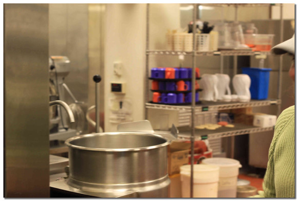
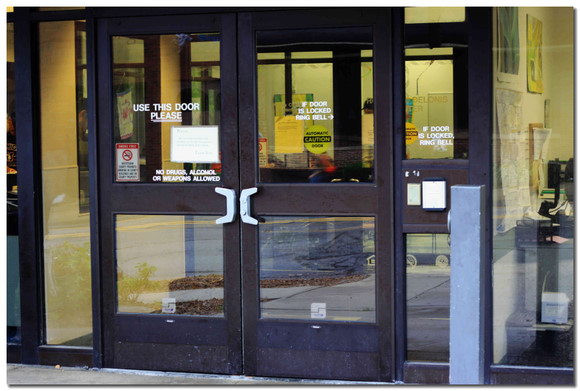
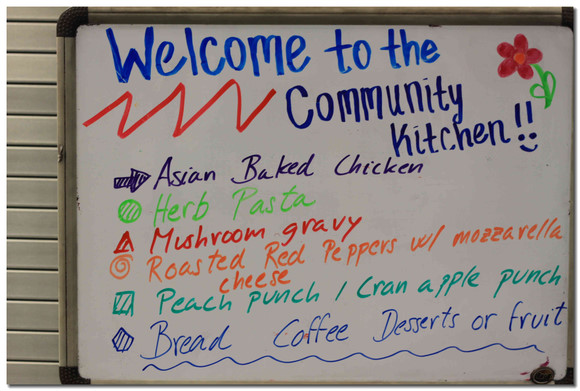

# 如果有一天我无饭可吃

** **

今天我去了在美国的第一个志愿者活动，其实没什么大不了，两个小时里有一个小时我在切Pepper，另外一个小时在切Cheese。总之就是在厨房里面当打杂的，由于常常做饭的缘故，切东西对我来说没有任何问题，两个小时也很快过去了。我有个朋友在一个Residential Hall找了个早上6点半到8点的工作，也是在厨房里面给学生准备早餐，薪水大概9刀左右，我心想我也在厨房里面帮忙，不过一分钱也没有，毕竟是志愿者嘛。

用最简单的语言概括我今天做了什么，就是去了一个管饭的地方，帮没饭吃或者无家可归的人准备晚餐。Robert J. Delonis Center貌似已经运营了很多年；在厨房里面干完活后，这个中心管事儿的大妈给我们四个人——一个西班牙交流生，一个中国PHD, 一个中国访问学者，还有我这个初来乍到的人——做了一个简单的说明，告诉我们我们做的事情有什么意义，我们来的这个机构具体是什么情况等等。美国有很多非盈利性的慈善组织，这家也许只是其中很小的一家。相信我们对于免费分发食物这种事情都不会觉得陌生，在中国有些教堂也会这么做。但是这位女士很自豪地告诉我，他们这个机构存在了二十多年，一直以来都致力于食物的采集和分发。经过多年的积累，在这个地区他们找到了300多种渠道或者地方来得到食物（当然也包括购买），150多个地方分发食物。我参与工作的这个厨房就是这150多个让需要的人得到食物的地方之一，在得到食物之后他们会负责把这些食物做好，等着有需要的人来享用。她同时也说，美国最近经济不是很景气，密歇根也不例外；有许多无家可归的人，或者是无力承担食物费用的人，或者是没有结婚的男男女女，或者是老人和残疾人，都会到他们这里吃饭。在这栋建筑的稍高层，有房间提供给没有地方住的单身男女，他们每个人可以在这个地方住满三个月。每天的早餐都是做好了送到楼上去，但是早餐不对外开放。她说，国家和安娜堡当地都会拨款来保证这个机构的运营，但是更多的还是靠各种捐赠；美国其他地方这种专门负责分发食物的地方不是很多，虽然在我的印象里美国应该有很多热心的教会或者机构愿意去做这样的事情。一年之中只有感恩节那一天他们会关门。“但是就在我们旁边5个街区有一个教堂，他们每天早上都会提供早餐，十几年了一直没有间断过，一天也没有。”她这么说道。我很佩服那家教堂的毅力。

然而最令我惊讶的是，当我问到什么样的人才有资格来这里吃饭的时候，她说：“哦，我从不拒绝任何人。”

“那你怎么知道有些人不是为了占便宜而来的呢？”

“这种情况的确会有，但是我从来不会问他们，我从来不会问类似‘你买得起食物吗’这样的问题。我觉得应该有基本的信任；也许有些人买得起食物，但是如果他们来这里吃饭，也许就有更多的钱去付电费和房租了。这么多年来，我们从来都有充足的供应，所以为什么要拒绝呢？说实话，美国是一个非常浪费的国家；就像你今天切的红椒和奶酪，他们本来差点就要被丢掉了，可是他们还好好的，于是我们把它们截（她用的是rescue这个词，我觉得很有趣）下来，做成食物，再给有需要的人，难道不是很好吗？”

所以他们也相信虽然白吃白喝这种情况会有发生，但是人们大多数时候还是愿意自食其力。不是说去这种救济中心的人就没有尊严可谈，实际上他们得到很好的接待，只是他们现在实在没有办法自食其力；人都是有起码的自尊的，在能够凭借自己力量养活自己的情况下当然不希望去依靠别人，这也是一种自觉吧。

说到浪费，我也很有同感。电之类的事情就不说了，食物总是过度包装。才逛了几次超市，我发现美国人真的是很懒，做饭得用各种各样的酱、调料、粉，种类之繁多比中国菜不知道多多少倍；蔬菜水果很多也都是包装好了的，但是水果和蔬菜经过它们那样一包装很容易坏，每次都能看到一堆根本不会有人买的东西，这些东西最后也只能被丢掉。

所以，今天得出的结论就是，我要是有一天没有饭吃了，我可以随时去这个地方吃饭。在走的时候我观察了一下来吃饭的人，大多数年纪很大，有的坐着轮椅，有的神情呆滞，当然也有年轻人。来者不拒，这对于我来说有些难以理解。在武汉，我从属的教会成立了一家食物银行，据说是国内首家专门收集食物然后分发给有需要的人的组织，但是食物银行也需要和政府合作，获得“有需要人员”的名单。在这个社会，也许接受必要的帮助的前提就是要被贴上某种标签。国内这类机构在活动的时候，也会拍照片，场景和我们经常看的“党的恩情比天高”的颇为类似；教会的一位弟兄告诉我，有一次活动的时候，一位贫困的老人也搞不清楚来送食物的到底是什么人，于是只顾着说“感谢党”，颇为有趣。

今天我带了单反去，本想在经许可的情况下拍一些照片，不过后来还是打消了念头，只拍了一些场景和菜单。这个食物救济中心诚然是拍人像的好地方，可是我没有资格在没有融入这个群体——或者说这不是一个群体，因为每个来的人都很不一样——之前擅自用镜头对准别人；每天都有人来这个救济中心吃饭，厨房一年364天，每天都要给几十人到上百人准备吃的，他们每个人都有自己的故事，我想我无法记录，也记录不完。当这种社会服务成为一种常态，持续十几年甚至更久，也许根本没有记录的必要了。

花絮：

厨房很干净，卫生要求很高。

所以说这扇门永远为需要的人敞开，只要你愿意推。

所以今天的菜单是，亚洲风味烤鸡，pasta，烤蘑菇什么的，还有水果椒，苹果派甜点，面包、咖啡、水果。

我切了一小时的mozzarella还没明白这是一种怎么样的奶酪，不过我尝了一下觉得味道一般，都是奶做的，伤不起啊。美国人做饭就是做完了之后放一大堆奶酪上去，这么吃下去怎么可能不胖呢？

其实今天的志愿者有两批，我属于前一批干厨房活儿的，后一批才是为来吃饭的人服务的。我下次一定要去下一批……为人民服务！

 

（采编：宋晓慧；责编：黄理罡）

 
