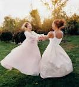

# 姑娘的物欲

**俗话说女孩要富养，免得以后太容易被诱惑，这话不是完全没有道理。作为一个正常的女孩子，纱裙子、运动服和白睡衣这三件芝麻小事能够在我脑海里印下难以磨灭的印记，更加让我知道姑娘喜欢上一个东西不需要太多理由。我也不知道这会不会是女孩子的本性，或者说爱美之心人皆有之。只是不巧女孩子的衣服和配饰比男人多太多了，所以也许女孩子会向往更多的东西吧，起码在外在方面。到了我现在的年纪，正是青春焕发，又自恋又臭美的时候，内心的欲望简直是一发不可收拾。**  

# 姑娘的物欲

## 文/廖汉斯（University of Michigan Ann Arbor）

 

我妈总爱对我说：“就是上外校把你上的开始讲究吃穿用了，你看你小学中学的时候多好，天天穿校服，从来不乱花钱。”

我记得小时候家里条件非常一般，最开始的时候甚至可以说非常不好，所以自小就没有穿过什么新衣服。我刚好有个大我几岁的表姐，我俩体型也差不多，所以小时候就是她穿剩下的衣服我捡来继续穿，从来没觉得有什么不好。毕竟人小，啥也不懂。上中学之后，每天穿着武汉市第六中学那招牌式的青蛙绿色的校服，也几乎没有机会穿自己的衣服。其实有统一校服并没什么不好，省下买衣服的钱不说，尤其可以杜绝青春期小孩子的攀比。只是对于武汉市第六中学的校服印象颇深，深到一种无法忘怀的地步。

我们这代人大抵都知道，大多数中国校服的特色便是颜色鲜艳、款式俗气、图案乏味。许多学校的校服都是带条形图案的宽松的运动服，上面的外套像蝙蝠衫，下面的裤子像说唱歌手的最爱。也许是为了照顾所有人的身材，让学生随时觉得舒适，中学的校服大都设计成这种款式。看日本动画和电视剧的人也许会很垂涎日式水手服风格的校服，但是要知道只有身材姣好的人才能穿出韵味，如果强制要求所有人穿，也许会有一小部分人觉得不情愿。

再回到六中的校服上来，我们那一届的校服是绿色的，幸好是颜色较深的墨绿，而非俗气的鲜绿。秋天的款式是长袖长裤运动服，到了夏天就是大红色的短袖衬衫加白色的短裙或短裤了。然而在我记忆里沉淀最深的，还是上面大红衬衫、底下墨绿裤子的搭配。穿白色的人并不是很多，也许是由于夏天教室空调太冷的缘故。有的人也会在大红色衬衫外再加上绿色的外套。这在现在看来简直是不可思议的颜色搭配，然而当时人人都穿，也就习以为常了。每到放学的时候，远远就看见一大坨绿色和红色从校门涌出来，渐渐稀释在人群里——就像撒了一地的彩色玻璃珠子一样。由于校服的款式就那么一种，人人都得穿，中学的孩子们只能自己动手在校服上摆弄出些名堂，比如用黑色马克笔在白色的后背上涂鸦，松开松紧带款式的裤脚使其变成略带嘻哈风格的大腿裤等等。前者成为除了厕所门板涂鸦和课桌涂鸦之外的第三校园涂鸦艺术，后者则成就了一大堆伪混混。我也曾羡慕过穿“晃悠悠”风格校服的同学们，在我的记忆里，我好像也把裤脚放松了，只是无奈中学的时候还是略胖，穿不出那“晃悠悠”的风格，只得作罢。

再后来上了武汉外国语学校，进去之前听说这个学校是不要求穿校服的，顿时觉得很高兴，终于能自己想穿什么就穿什么了。妈妈也曾担心过武汉外国语学校的攀比风气的问题，我现在回想一下，其实这不是个问题，近朱者赤近墨者黑乃人之常情，有限度就行了，人自己知道自己想要什么最重要。话说武汉外国语学校也是有校服的，从款式和风格上简直胜过一般学校一大截——西服风格的外套，衬衫和短裙。我还记得当时是先召集学生统一量尺寸，再去定制相应的校服，想来觉得很高级。价钱也不便宜，具体价格倒是记不真切了，大几百总是有的。后来去领校服的时候，发现比想象中的要大了几码，穿在身上有些飘荡。我记得发校服的阿姨说：“你们冬天里面要套毛衣，肯定要大一些的！” 这个我倒是记得非常真切。没有了腰身的西服式校服穿在身上总有些滑稽，就像今年中国参加伦敦奥运会的团队制服一样，区别在于奥运团队制服看起来更像宾馆服务员。后来的事实证明，武汉外国语学校并没有要求她的学生穿过几次校服，我的那套校服至今还孤独的躺在家里的衣柜最底层。

我想，作为一个姑娘的物欲往往是从衣服开始的，光是小时候看妈妈的衣柜就能培养出对衣服的兴趣。我妈妈到现在还耿耿于怀我和我表姐小时候钻进衣柜乱试她的纯白色重磅真丝长睡裙，结果留下了难以清除的污渍。至于偷偷擦妈妈的口红，拿眼线笔乱涂乱画，穿她的高跟鞋这些事情自不必说了。我记得我表姐过十岁生日的时候，她的父母给她在大酒店办了一个生日宴会，宴会上她穿了一条上面镶着亮闪闪蓝色亮片、底下是芭蕾舞裙样式的纱裙子；作为一个正常的小女孩，羡慕之情总是有的。后来有一次我去表姐家玩，貌似是她把一条类似的纱裙子借给我穿，俩人穿得漂漂亮亮准备出门玩儿；她家当时住在解放公园旁边的市委大院，出门就是一大片树林，结果出门还没几分钟，一大坨鸟屎就不偏不倚落在了我的肩膀上——落在了那条漂亮的纱裙子的肩带上，散发出一股鱼腥味。表姐只能把我拖回她家，俩人一起在厕所洗了个澡。这是关于裙子最早的记忆。

小学到初中的记忆都非常空白，也许是太小的关系。那时候内心也没有什么太多的欲望，家里的生活也一直非常简朴。后来到高中初期的时候，我总跟妈妈说觉得该买一套轻便的运动服，例如阿迪达斯牌或者耐克牌。那时候觉得这些牌子都还挺贵，也觉得是很好的牌子。可是当时为什么觉得要买一套那种化纤材质的运动服，理由我现在还真想不出来了。一个不喜欢运动的女孩子希望买那种衣服，也许是受了中学校服的荼毒不浅了。我记得这个愿望持续了很久，然而在后来某一天，它突然像一个气泡一样破裂然后再也没出现过。直到现在我也没买过耐克的东西；出国之后也发现原来那只是一个很普通的牌子，在国内却标着那么高的价格。高中阶段的衣服大多数似乎是和妈妈一起买的，也都是些便宜的休闲品牌。说实话，武汉外国语学校的女生们穿衣服的整体水平还是很高的，上次回学校的时候看见站在门口的女孩子穿着整整齐齐的英伦风格的衣服，觉得赏心悦目极了，那价格想必也是赏心悦目的。我虽然很少追求名牌，高中的时候却一直定了《Vogue》看，有人跟我说年轻的女孩子应该多看例如《昕薇》之类的杂志，我觉得那些时尚杂志上的东西无论如何都是买不起的，还不如看个高级点的杂志，在潜意识层面影响自己的审美。高三时候的同桌是个时尚爱好者，对欧美的模特颇有研究，她穿衣服也非常讲究，我们常常轮换着买Vogue, 还会热衷于把极其精彩的时装大片小心翼翼剪下来插进大塑料夹子里当封面。封面的下面是各种数学和文科试卷，两者搭配在一起很有些诡异。

姑娘长大了，自然零花钱也就多了起来；环境复杂了，眼界自然也就大了一些。还记得高中有一阵很流行日本的夏普手机，我就记得在操场边上的垃圾桶里随意一瞥就能看见夏普的包装盒。我的手机从初三一直用到高三被偷，想来觉得还是很对得起父母的。所以女孩子喜欢的东西，从衣服开始渐渐拓展为包包，发饰，雨伞，化妆品，电子产品，首饰……说到电子产品，曾经有一段时间我极其迷恋富士的拍立得，觉得白白的很可爱，看上去也很酷，600左右的价钱也不是那么不能接受，只是相纸确实非常贵罢了。在网上商城看了又看，看了又看，最后反复拷问自己：“我真的需要它吗？” 后来发现这一招非常管用，拷问自己过后过一段时间就冷淡下来了，自然就不会那么热衷于买了。但是如果总是这样，人生似乎就少了点乐趣。干爹难道不是总会对干女儿说：“喜欢就买嘛！” 到了再后来别人送了我一台单反，我就很少再幻想拍立得了。然而有时候这招也不是非常管用；上武汉大学的时候没事喜欢去“群光”溜达，有一次无意在转角看见一排卖睡衣的，纯白的长裙子还镶着漂亮的花边，在商场灯光的渲染下真是好看极了。一翻标签，200多块钱还一点折扣也没有，其实还是有些贵了，于是犹豫了一下最后还是没买。回到寝室之后，那条白色的裙子好像就印在了我的脑子里，软软的，荡来荡去，搅得我心神不宁。我拷问自己，我真的需要这样一条长长的白白的穿起来像女鬼一样的裙子吗？拷问完了之后发现其实不那么需要，但是结论是我真的很喜欢。为了让自己有充分的理由去买它，我又跑去询问我亲爱的室友。室友的回答是：“喜欢就买嘛！” 于是第二天还是专门跑去群光把它买了回来，洗得干干净净挂在寝室里，啧啧，真好看。后来我发现纯棉的衣服坠感不好，一睡就皱的很吓人，在枫园寝室昏暗的灯光下也显得很一般了。最后还是把它带到了美国，在异国他乡的楼道里装女鬼，只可惜美国的楼道不熄灯，没有那个效果了。所以说有时候想买一个什么东西，跑去征求别人的意见，需要的根本不是意见，其实心里早就决定要买了，只是装模作样一番来证明自己其实是“理智”的。

俗话说女孩要富养，免得以后太容易被诱惑，这话不是完全没有道理。作为一个正常的女孩子，纱裙子、运动服和白睡衣这三件芝麻小事能够在我脑海里印下难以磨灭的印记，更加让我知道姑娘喜欢上一个东西不需要太多理由。我也不知道这会不会是女孩子的本性，或者说爱美之心人皆有之。只是不巧女孩子的衣服和配饰比男人多太多了，所以也许女孩子会向往更多的东西吧，起码在外在方面。到了我现在的年纪，正是青春焕发，又自恋又臭美的时候，内心的欲望简直是一发不可收拾。高中的时候妈妈说，小孩子不要买太好的衣服，长大了再买好而精的衣服和首饰。到现在她也觉得我长大了，也竟然开始说：“喜欢就买吧！买了以后慢慢穿（戴）。”尤其是我到了美国，体会到了中国的衣服价格有多不合理之后，常常和她闲话家常，汇报我闲来没事考察美国物价的成果，她听了只能垂头丧气，简直希望下一秒就飞来美国和我一起逛街。最近临近回国，逛街也成了家常便饭，总想着应该带点什么东西回去才是，尤其是给妈妈。而她总说我还是穷学生，别给她带东西了。其实暑假因为要来纽约，又不好意思再找父亲多要钱，便找她要了一些钱，转眼也就花得快没了，而她却还说不要在她身上花钱，让我非常羞愧。

身处花花世界，难免看到喜欢的东西就情不自禁；昨天买了一条漂亮的红裙子，今天就要开始想：要配什么样的项链才好？是不是要换双别的颜色的鞋？要挎个什么样的手提包？头上要不要戴个什么？一想这些问题，事情就会变得很复杂，就像那个买了新花瓶的妻子，摆在茶几上觉得不配，觉得要换新茶几，换了新茶几又觉得沙发不配，到最后欲望越来越多，觉得整个房子都要换了。今天去博物馆，路过一家卖衬衣的店，看到在打折，又想想自己一件像样的衬衣也没有，便又花钱买衬衣去了。原来学新概念的时候记得有一课是讲一个男人陪妻子买帽子等得很不耐烦，便说：“我们不应该买我们不需要的东西。” 当妻子提醒他自己前一天才买了一条糟糕的领带的时候，男人回答：“男人有多少领带都不会嫌多。” 妻子的回答是：“And a woman can’t have too many hats.”（一个女人有多少帽子都不嫌多） 这句话不仅语法上是重点，在内容上其实也是重点，并且可以无限扩大为 “一个女人有多少裙子/鞋子/丝巾/珠宝都不嫌多。” 想来也是十分有趣的。

我想，有欲望不是一件坏事，世界上精美的东西太多了，也许都是受了欲望的启发而产生的吧。也许我还应该说，因为有了欲望，而激励自己用争取的方式去争取自己喜欢且想要的东西，这也是很好的。而我为什么记忆如泉涌开始吐槽，其实只是因为————尼玛买了衣服之后发现把要交房租的最后一点钱刷掉了！！！

 

（采编：周拙恒；责编：何凌昊）

 
