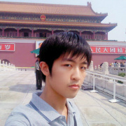
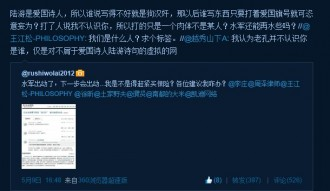

# 孔庆东案——对话关凯元

采访者：@蝉之言【后用蝉省略】 受访者：@rushiwolai2012 关凯元【后用关省略】  

第一问：案件的进展

蝉：首先咱们就先从案件开始吧！我看许多媒体只是报道了你胜诉，但是后续如何却一下子悄无声息了，所以我想了解一下现在的情况是怎么样的。

关：好。实际上案件到了现在，是一个先和后分的状况。一审胜诉也引起了很多人的关注，但是正像我一直在微博上强调的那样，我并不希望有人利用我胜诉的事情去打击所谓的“左派”。所以网上有人传我有和孔老师和解，确有其事，但不是我主动求和。在好心人的帮助下，我发过私信给孔老师，也写了亲笔信给他。一开始，孔老师似乎表达了某些和解的意愿。我觉得这也符合民法精神，而许多中国人似乎都是不诉则已一诉到底。其实只要能双方协商一致，结果公平，就可和解。

蝉：也就是说，你们一开始的接触还算顺利？

关：是的，我已经把微博上转过略带对孔先生讽刺的微博删除了，主动表达了我的诚意。如果孔老师能谅解我，我愿意出具书面承诺并且放弃上诉及一审利益，具体以何种方式和解由他来决定。

蝉：那为什么又有了先和后分？

关：我感觉他就像是所谓的大哥，下面小弟起哄，他自己也不好下台。谈了几次之后，他的态度就变的强硬了，也许是我愿意和解，所以他觉得我这边态度不坚决了？我自己的感觉是，他把一个单纯的法律事件上升到政治高度，想用这种方法逃避道德的谴责和法律的制裁。自始至终，他本人都没有露面，直到一审判决前都没有和我沟通，和解之事也未做明确回应便不了了之。

另外，我还是希望道歉方式能够以微博的方式进行，他既然是在微博上几百万粉丝面前骂了我，那么我也希望他能够在同样的地方对我道歉。这样才是合理恢复被侵犯民事权利原状。

第二问：幕后黑手

蝉：上升到政治高度？他转发微博时说的什么大幕拉开，后面还有黑手，是不是类似这样的表述？

关：是的，他好像总是臆想专门有一个有计划有预谋的组织迫害他一样。

蝉：我看微博上有人在孔老师言论下跟风，说什么李庄律师，还有老薛和李开复先生都是你的幕后人，你以前认识他们吗？还有人爆出你和李庄律师私信，说你求他转发。

关：这个其实说起来很好笑。我要是背后有人还立案那么麻烦？还一个人跑那么远的路来回折腾？立案到现在这么久了，怎么直到胜诉才有人说话？要真是我有背景，早出动水军分分钟搞定问题了，还用的着一个人挨个下面回复评论吗？我要是被雇来的，早就回家数钱了，更不可能和孔老师和解。至于私信李庄，我一个学生寻求名人的转发，难道不行？谁想给李律师私信，自己也能啊！我要是和李律师有关系，早打电话了，还用的着私信么？

第三问：狗汉奸

蝉：对于案件中，孔老师骂你为狗汉奸，你对此有何看法？我发现在你微博下，许多人也喜欢用狗汉奸这个词来称呼你。

关：真是不愧为孔和尚啊，口头禅都很特别，整天三个字：狗汉奸。一般来说汉奸，都是出卖本民族、国家利益的人，按照现在的刑法，这样的是犯了危害国家安全罪，是要承担刑事责任的。他这么骂我，我觉得都快算的上诽谤罪了。我一个学生，竟然被他骂成狗汉奸。有些人啊，其实大家都知道他错了，甚至他自己都知道错了，但是他就是不认错，自欺欺人。

我家原来有不少亲戚在海外，文革时期就有人问我亲戚，你是不是有海外背景，甚至被骂汉奸。没想到现在还有人这么骂。我要真是汉奸，我还在这和你扯半天？我早移民美国了。倒是某些所谓的“左派”领袖，儿子老婆都移民国外了，自己却在国内喊铲除汉奸（笑）。

 

第四问：政治定位

蝉：除了狗汉奸，我看许多人还骂你是右派的走狗。但是你自己的微博标签是马克思主义。所以你对自己的政治定位有什么看法？你和孔先生这样的所谓左派有什么区别？

关：这个应该好好说说。我在我自己的文章《与马克思的长谈》的结尾说，我是共产主义的同路人，但我不加入任何政治组织。假如我加入某政治组织，我说他好，会被指责维护其利益；说他不好，会被指责是叛徒。所以我觉得真正的爱是不计较得失的爱，而加入其组织未必就是真爱。

马克思主义者必然是左派，而左派不必然是马克思主义者。我和马克思主义的道路相同，但是位置不尽相同。这些都是很明白的道理，只要去看看法国大革命，再看看相关的文献就可以理解。其实现在中国，真正的自由主义者少，而真正的左派更少！许多国内所谓的“左派”，不觉得他们很像是宋江吗？本想为朝廷所用，却爬不上去；于是聚集各种闲杂人等，打着杏黄旗上书替天行道，实际上干的还是草寇的事儿。

第五问：对网络的影响

蝉：你觉得自己这个案子的产生，对类似于新浪微博这样的社交平台有什么影响，对于大家网络生活的交流和评论有什么作用吗？因为我看有很多人说你这样做，只会让许多人不敢说话，也使得以孔老师为代表的很多人受到不公正的待遇。

关：我认为网络上的净化是应该进行的。任何人的预设立场，难道都能够与法律相违背吗？能够侵犯他人的合法权利吗？我看到少数律师（如吴法天先生）说，我这个案子判决出来后会导致微博侵权案件大量的涌现，会增加司法成本。

难道因为维护正当利益成本高，于是就不再维护正当利益了么！难道因为小偷难抓，就不抓小偷了么？！按照正常的司法进程，案件的涌现当然会在某个时期内出现高峰，但是之后就会出现下降并且趋于平稳。波澜不惊的是死水，只有波澜起伏的才是活水。

大家在网络生活中，规范自己的言行是必要的。就像之前司马南说如果任志强辱骂他是否可以起诉，这么简单的道理还用问吗？法律与你自己的政治定位无关，只要你被侵权，就可以起诉。我这个案例，并不仅仅针对孔老师个人。法律面前人人平等，不分左右违法必究。

至于所谓的“因言获罪”，无从谈起，规则对所有人都是公平的。最近何兵老师被暂时禁言，慕容雪村账号阵亡，他们的待遇和孔先生相比呢？孔先生无非是今后不能再骂人狗汉奸。

第六问：以后

蝉：聊了这么多案子，最后一个问题说说你本人吧。你接下来有什么打算。起诉诺基亚的案件还进行吗？

关：我是之前看到诺基亚摔手机的广告，但是我刚买了诺基亚就摔坏了。按照这样理解，那就涉及违反商品属性虚假宣传，就和油漆广告类似，宣传油漆无毒就和牛奶一样能够喝，结果买回来喝一口，死掉了。但是还在考虑中，我之前也提到了法律的精神并不像人们想的那么狭隘，我更愿意沟通和理解。毕竟诺基亚也不容易，而且陪伴了我们度过那么多年（笑）。

蝉：想做律师吗？

关：现在还没这个打算，但是以后会。对于做律师，也更倾向于实务加研究，不是我学了法律才有了维权意识，而是因为我本身有维权意识才选择了法律。我希望能够通过自己所学践行自己思想。法律是一门实用的哲学，像资本一样，是一种强大的工具，但不应是人最终的目的。我小时候就发现，和家长相比，和学校其他的同学相比，靠体力胜过他们是不现实的，所以我选择用智慧。这也是人超越万物之处。

蝉：一审上诉期就在本周的周四，如果孔老师坚持上诉或者拒不履行呢？

关：如果他要继续，那我就只能奉陪到底！

后记：

本次采访为全文发送，通过听取采访录音写录。我们不像各大报纸电视有巨大影响力，所以我们只能尽量的保持真实，让关凯元说出自己想说的话。采访后，我问他，你觉得自己站出来维权，是不是代表着中国未来会有更多青年像你一样出现呢？你是不是代表着一种全新的青年人形象出现在公众的眼前？他说他不能代表任何人，只是他能够确定在今后的道路上能够找到更多和他一样有着理想的同道人。

在中国劳动关系学院的一间阶梯教室里，坐着满满的学生，他们在听司法考试的课程。低着头记着笔记或者抬起头思考着，关凯元应该也在其中。我无法辨认出他，也不需要辨认出来。因为我知道，他们其实都一样，努力着。这个世界上有千千万万的年轻人像他们这样努力着，是谁说年轻人暮气沉沉？“沉默的大多数”将不再沉默。

如关凯元所言：“希望不在明天，也不在别人身上，就在我们现在的行动中！”

感谢以下机构联合制作：北斗网、新知新觉、独立影像、高校联盟

  
