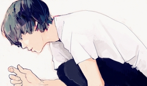
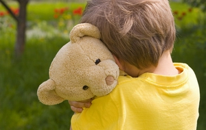

# 孩童世界

此刻我忽然意识到:我的一切转变，似乎都是从我搬到自己的房间之后才发生的。在我的记忆中，此前的自己形象单纯、残破，忘记带作业到学校会害怕得落泪，住在外婆家，青灰色、煤尘味。当我住进这个小屋子，开始真正意义上拥有独自居住（存在）的时光（此前我一直和外婆或是弟弟的保姆共用一张双层床），一切才真正变得活灵活现，狡黠、骄傲又卑微。

我搬到这里是在十二岁，刚上初中。那时的房间和现在差别不大，除了窗帘是鹅黄色的，墙角没有像现在那样长着潮湿的霉斑。鹅黄色的窗帘，还有亮黄色的成套家具——书柜、书桌、衣柜、床，那时我还用着一盏黄色的台灯。或许正因如此，那个我第一个爱上的姑娘在我的记忆中长时间和黄色联系在一起，时而是鹅黄的，时而是亮黄的。

此刻我躺在我的床上，那盏台灯如今成了我的床头灯。我的头顶是一副艺术照，尺寸颇大，上面是十二岁的自己。相馆的师傅在一旁填上批注：“帅小子——快乐生活2005”。我的母亲很喜欢那幅照片，我却隐隐有些厌恶。在她看来，自我照了这张相之后，我就一天天变得“肥头大耳”，最终不幸长残。我的正前方是一个极不实用的书柜，或者说根本不是个书柜而只是个下等的组合柜，一切放置于柜子里的东西都无法与外界空气隔绝，导致我的书放在这里会积上一层灰尘。这柜子的最上层放着一张更年幼的自己的照片，六七岁或是五六岁，婴儿肥，奶气，两手交叉在胸前，如我现在一样的爱装腔作势，竟然也穿着一件黄色的毛衣。

我打下这一段文字的时候已经是大年初三了，我快要二十一岁了，收到的压岁钱一年比一年少，在假期里起得一天比一天晚。每每在深夜上网、读书、发呆，把自己折磨得精疲力尽，才安心在十二岁的我的注视下安然睡去，翻来覆去十余小时，奋力一挣，坐起就看到五六岁或是六七岁的我。我虽在这房间里做尽一切青春期男孩做过的事，汗液、极度的嫉恨、自我净化的情欲，但我从不觉得自己是肮脏的，然而我想当我的母亲每次走进我的房间，看见二十岁的我在两个年幼的我之间睡得像一头猪，还胆敢膨胀得如此巨大，定然时常哀叹我那“黄金时代”的逝去。我时常被青春痘所纠缠，就像现在这样，脸上涂抹着各种来源不明的液体，看着墙上和书柜上那肌肤“吹弹可破”、“白里透红”的自己，却一点也不嫉恨，我拖着我并不强健的身躯依然自得的存在着，不让年幼的我发表一句看法。

我是如何长大的？如何膨胀到如今这不可控制的局面的？我的母亲近来常常感叹我体型的巨大，以她的话来说便是“好大一坨”。其实我身高不高，体重也胖不到哪去（此话有自我安慰之嫌），但想来从母亲体内诞生的我在短短的光景之内就发展到这样的程度，这一定一定是让我的母亲极为吃惊的。这二十年她的体积并未发生多大的变化，而我这不可抑制的膨化物在短短七八年内就从“黄金时代”那让我母亲安心的最佳体积膨化到现在这般不可控制，我的野心和狡猾一定让母亲大为吃惊。

不，我比她想象中还要坏。看我那张十二岁的照片吧，母亲早已忘记那时的我鼻头忽然往前松弛，期待中的鼻梁却迟迟不隆起，眉毛中已然开始宣告我漫长的青春痘之旅的起航，那一天的我躺在床上百无聊赖，心中只是有各种无声的不满。我的母亲今日已经忘记了这一切，但那日的她也许已经预料到我那“黄金时代”的将逝，急忙说服我和她一起去照下这一套照片。这么说来，那时的她是否会预料到今日的她可以指着墙上的大幅照片，不怀好意地对着我人畜无害的身躯坏笑？哎呀，如果她那日竟然预料到了一切，她就比我还要邪恶百倍。

是的！看看我的房间内的这扇木门吧！它竟然无论如何也无法关上！它从装上之日起就无法上锁，几个冬夏之后尺寸来回伸缩，它终于变得只能半卡在门框中了！这扇无法上锁的门给我的青春造成许多慌乱、遗憾，教给我许多故作镇定和信口胡诌。有了这扇门，我的逃亡注定不彻底，我的对抗终究无法完胜，这一切，或许真的是她的安排。她，我的母亲，翻开我的一切字迹，笔记本里的、手机短信中的、莫名纸条里的、同学录中的，我在她的压迫之下从未试图反抗，只能将将维持稍为得体的局面，这一切，必然和这扇上不了锁的门脱不了干系！

逃亡，对抗。我又忽然从我那漫长的史前时代中凶狠地抓出了几只记忆的野兔，意识到我的逃亡其实早已开始。当我和外婆睡在一张双层床上，我的枕头边放着手电，我每晚憋住呼吸一头扎进被窝中，看基督山伯爵，看欲言又止的莫泊桑，看两块钱一包的盗版游戏王卡，不时伸出头来，把手电灯光死死压在床面，听着外婆规律的鼾声，贪婪地吸上一大口气，又游回自己的泳池。

长久以来我为我没有零用钱而愤愤不平，我在夏天里癔症般总感到自己口干舌燥，却没有一分钱来买一瓶水或是一根冰棍，我几乎不忍回忆起那时的我对着他人机械地重复着：“请我喝杯水吧。”不，情况并非如此不堪，许多和我一样没有零用钱的孩子最终几乎都掌握了一种本领，我们不仅能够喝到水，还能吃到街边的小吃，我们心怀鬼胎地跟随、陪伴，换来我们期待中似乎应得的酬劳。我并不抱怨，我自得于找到一种独特的“生存方式”，在回到家前我擦擦自己的嘴，又有了额外的秘密。

我着迷于我那些不值一提的秘密，着迷于装模作样、装腔作势，着迷于自己的不为人知。几年之后，我同样钻进我的被窝里——和姑娘打电话，并且像个情绪失控的精神病患者，满脑是自怜自艾，时常逼自己哭出声来。我擦干自己的眼泪关上床头灯，才结束一天的工作。我开始抽烟，终于我的父母在我的裤袋里发现一截来历不明的烟头，故作镇定，我说：“我们寝室的同学抽完烟，让我帮他把烟头扔掉，我忘记了。”煞有其事，言之凿凿。

然而现在的我何尝不是这样？我的母亲问我这几天有没有抽烟。我盯着电视机装作若无其事地回答：“没有。”“没有？这么乖啊！”她的声音变得有些揶揄。“嗯。”“别再抽了！讲不听！”这就是她，她偷看了她能够偷看的一切，最终我只能无可奈何。

在我和我母亲、和我的家人的较量之中，我从来就没有真正赢过，我家族中的每个人都暗自嘲笑我的心口不一、玩味着我的那些“小秘密”。我真正甘心承认这一点，是在我来到武汉的时候，母亲放下我在学校回到家乡，我一个人被巨大的自由所包裹，激动地时时震颤。我看着兴奋得有些可笑的自己，忽然意识到，我还是输了。

我的母亲总嫌我在生人面前阴郁寡言，言行局促，用她的话说，我“不太阳光”“情商太低”。但她又知道我暗地里粗鲁放肆，出口成脏，甚至她很有可能曾经认为我是一个色情狂。早在初中时就有人告诉她我带着A片去学校看，高考完还有人告诉她我初中开始就满脑情色念头，满口污言秽语。我来不及辩驳，来不及辩驳也许是因为有的事居然是真的，更多是因为我压根不在场，那位同学和大人侃得正嗨。她回家告诉我时，我一脸正气地在她面前愤怒地斥责别人胡编乱造、信口开河，她也带着几分怨气说：“那个小孩怎么可以这么乱说”，然后颇有深意地看着我，偶尔也说：“你估计也不是什么好东西……”

我因此而厌恶在饭桌上和大人们聊得热络起劲的那些人，我只是冷冷地看着他们，第一是因为我做不到而我的母亲很大程度上希望我做到；第二是因为我总想着我那色情狂的形象，担心他们忽然口不择言又给我的生动形象添上几笔油墨。我知道，也许有的人已经不用“大人”这个字眼了，但我依然亲近那些在大人饭桌上和我一样沉默不语的人，我有时试图用默契的眼神给他们以感激，有的人似乎懂得，对我微笑回应。

世界有两个，一个是孩童的世界，一个是大人的世界。上面这句话当然不是认真的，它只是一个很美的童话。我在饭桌上随口说出我弟弟私下里告诉我的话，博众人一笑，我弟弟在桌下用力地踢我，吃完饭后愤愤地对我说：“我不张（理）你了。”我忽然意识到，我居然成为了打破他孩童世界幻想的那个人。其实我绝非故意，我一直把自己看成和他同一个世界，呆在孩童的世界里，审视着大人。而一次次疏忽提醒着我，也提醒着他，我们，才是时时处于大人的审视之下。彼此共存，却时刻准备向大人世界献媚，我很遗憾。一个快二十一岁的人，要守住孩童的世界，的确是有些勉为其难。

我时时在家人面前为我的弟弟开脱，似乎在为我不时的背叛赎罪，但连我都并不真正了解他的“小秘密”。他天赋极高，饭吃饱后就发呆，一副老实巴交的样子，我看在眼里为之深深叹服。我对他说：“你真是会装老实。”他像是被我挠了痒，哈哈笑起来。他得意着、骄傲着，他的确比我强很多，他在她母亲的学校上学，每日由她母亲接送，空间极小，余地不大。但这时候的他一定认为自己处理的游刃有余、不留痕迹。

很可惜，他注定赢不了的。以上这句话也可能发乎于我的嫉妒之心。

实际上，儿童世界的我们能够拥有多少秘密呢？大人们在寒暄的餐桌上才拥有着最多的秘密。我们都太自以为是，但我们看不到，我们深深着迷于自己构建的地道，不能自拔。现在的我深觉这样的沉溺是不可避免的，但是越早体验越好，那种卑微的自由震颤，就像《蝇王》的那群孩子最初所表现的那样。

我很早开始混迹于大人的餐桌，且对它深感痛恨。过去我也许是去过太多大人的饭桌，他们总爱跑得很远去吃东西，吃饭前打上四五个小时麻将，吃完再打上四五个小时麻将。我觉得太过无聊，习惯带上一本书，坐在一边翻翻，于是乎在打完麻将的大人饭桌上，我就成了“酷爱读书的小神童”。“唉呀，你才这么小，就看这样的书了？”，“你要多运动啊，别成了书呆子啊……”，“你家儿子，以后肯定有出息”，那时的我脸上没有青春痘，想必是苍白得可以。但我却隐隐憎恨被人如此随意涂抹。

现在想来，我为什么像现在这样对一切正儿八经的事儿本能地反感，憋着劲要去戏谑、嘲讽，也许就是因为儿时的自己也觉得自己实在是“太乖了”，乖得像一张吸墨水的白纸，总在大人饭桌上被随意涂抹。我似乎是渴望自己变得污秽些，混乱些，就像有的孩子，在饭桌上大人们对他讳而不言。他们的一切也许在大人的饭桌上不值一提，而在我心里曾经神秘得近乎神圣。

而今我觉得那时的我错了。他们真正在乎你什么呢？无非只是随意发问罢了。见你读书，懒洋洋地作些联想，接上话头就算了事。过年的时候，那些被我们吐槽过多少次的亲戚，“哪个大学”“谈恋爱了吗”“考研吗”，他们当真在乎答案吗？不，他们根本不在乎。孩童的心思都是敏感的，但敏感得有些过了，不适应大多情形下粗糙的心灵。他们对于“接话头”的重要性了解的并不深刻，对谈话的一切都深以为然，极端认真。

转念一想，自问：你还妄想在这孩童的世界里呆多久！是啊，自命不凡的儿童世界，无时无刻不在狭小逼仄的空间内建造着“小秘密”，忽然房间变得无比开阔了，你的那些“小秘密”板着脸孔站立着，连结着你那孩童的自尊。

我还要在我的房间中住多久呢？四天。四天后我又要启程离开。我舍不得我房间中依然保留着足迹的那些“小秘密”，那些空空的烟盒，那些莫名其妙的纸条，几本我从书店里偷出来的书，我舍不得扔掉的游戏王盗版卡。

站在两个世界的转折，一座窄窄的桥上。我推开我那扇永远关不上的门，客厅里空空荡荡。父亲感冒一直没好，在房间里睡觉，母亲出去应酬了。此刻已是九点半，我推开窗户点燃今天的第一支烟，听着客厅里随时可能发出的脚步声，肌肉紧张。一天、两天、三天、四天。数着日头，每个假期被流放到我的房间中，将我锁进我的儿童世界，这很温馨，又恨可怕。

十年前的我和今日的我是一样的，我尴尬的发现我又被困在这间小屋里了，极度迷人，让我不能自拔的孩童世界。一天、两天、三天......我还沉溺多久？只有孩童如此刻这般，如此迷恋于谈论自己，煞有其事，言之凿凿。

（采编：黄梅林，责编：佛冉）
