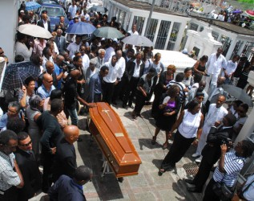

# 安息吧黑豹

利用一條床單做成的繩子和鐵床的立柱，法國馬提尼克（Martinique）海外省杜克斯監獄（centre pénitentiaire de Ducos）中的一名囚犯於2011年8月7日凌晨結束了自己的生命。看似單純的社會新聞為何躍上頭條？因為這名犯人身分特殊，他是法國目前服刑最久的囚犯。

皮耶-賈斯特．馬尼（Pierre-Just Marny），得年68歲，自1969年陪審法庭判決無期徒刑定讞後，其後的48年人生都在鐵窗後渡過。對一般人來說，馬尼是一名十惡不赦的壞蛋，與電影《刺激1995》內那位因無法適應出獄後的生活而上吊自殺的老囚犯沒什麼兩樣。但對於馬提尼克人，甚至是所有法國海外省的居民而言，他背著殖民地的十字架，是殖民政府司法迫害下的犧牲者；種族主義鬥爭的受害者，簡單來說，他是悲劇英雄。

（馬尼）

或許是當時的時空背景使然，又或許是命運的作弄，一名角頭變成反殖民主義的精神象徵，這樣的變化恐怕馬尼本人也始料未及。他如何走上這條不歸路？一切要從「細漢偷挽瓠」說起。

馬尼，1943年出生於馬提尼克島的貧窮家庭。當地年輕人受窮貧所困，加入幫派是很自然的事，馬尼對此頗有天份，不到22歲就成為當地角頭。一次偷竊失風被逮，馬尼自願扛下所有罪名，條件是出獄後能分得更多贓物，不過就在他服刑兩年假釋後，竟發現同夥翻臉不認人，將贓款獨吞。氣不過之下，馬尼帶槍朝同夥尋仇，結果造成包括一名嬰兒與在內的三人死亡。馬尼逃亡六天後遭逮，但一個月後竟然越獄成功。這一次，警方花了九天搜尋，才在找到了他。但錯誤就這麼發生了，一名警察或許是出於緊張，或許是出於對黑人嫌犯的不屑，在馬尼雙手高舉投降時，竟然仍朝他的大腿開槍。

能當上地方角頭，證明馬尼並不是個無惡不做，姦淫擄掠的壞蛋。事實上，在當地媒體大肆報導他槍殺黑吃黑同夥的新聞後，部分居民甚至認為他不過是在維繫幫規罷了。而且他三番兩次逃脫警察圍捕，公然挑戰殖民政府的權威，在當地居民眼中，一個黑人同胞把白人警察耍得團團轉，根本就是馬提尼克的羅賓漢。記者稱他為「黑豹」（la panthère noire），用來形容他的矯捷身手。

槍擊發生在1965年9月，當時全世界正被反殖民主義風潮席捲。大西洋這邊，卡斯楚1959年在古巴發起共產革命成功，帶動拉丁美洲反對美國帝國主義的風潮。在非洲，阿爾及利亞在歷時8年的戰爭後，終於1962年獨立，也迫使戴高樂修改憲法，允許法國在非洲的殖民地脫離法國。馬提尼克陸地面積僅1千餘平方公里，人口僅40萬，但獨立運動依然風起雲湧。因此，白人警察在眾目睽睽下當眾射傷已經投降的嫌犯，事情迅速傳遍馬提尼克，在獨立運動的背景下，這次事件好比馬提尼克版的228事件，造成當地群眾暴動，40多人傷亡。

（當地報紙對於馬尼的報導）

用現今司法正義的角度審視，馬尼的審判與服刑過程充滿了不公平甚至迫害：為了平息高漲的反殖民浪潮，當局在逮捕馬尼後即秘密將他送到巴黎受審，此後40年間，他再也沒回過故鄉，直到2008年，他才得已回故鄉發監。其次，馬尼在獄裡曾被關了將近8年的禁閉，造成他雙眼近乎失明；且獄方判定他有精神疾病，使他長期住在加強戒護病房。馬尼直到2010年6月才得以首次踏出監獄，在警察的戒護下，他以6小時短暫造訪了親友。

闊別近半世紀，當年的街道建築早已改頭換面，但當地群眾並沒有忘記這名當年挨了殖民者子彈的「英雄」。不過，鄉親們的訴求少了獨立，更多的是馬尼的自由，甚至連Facebook上都有呼籲釋放馬尼的社團。而馬尼本人也在律師幫助之下近年來不斷請求總統特赦，但或許是為了避免激起海外省蠢動的民族主義，或許是依法行政，重獲自由的這一天永遠沒有到來，在遺書上他寫到：「我已經為所做之事還得夠多了，在這裡以死指控殖民地的司法制度」。

馬尼最後會選擇以自殺明志，或許並不意外。在回到馬提尼克後，他曾經接受當地報紙訪問，他表示：「為年少輕狂所做的事情懺悔，但因為自己是政府的列管對象，才無法獲得假釋」。他甚至表示：「他們就是希望我死在牢裡」。在自殺前幾天，他向他的獄友表示，自己再也受不了了。僅管該名獄友曾向獄方反映，但如同馬尼無數次的請願一般，獄方置之不理，終究釀成悲劇。

馬尼悲劇性的一生隨著自殺而畫下句點，那麼當年曾經盛極一時的獨立運動呢？

（馬尼的葬禮）

事實上，在法國當局胡蘿蔔與棒子的交互運用下，獨立運動已逐漸式微，轉型為爭取自治。二次世界大戰後，法國開始實施「同化」(Assimilation)政策，希望以語言、文化為訴求，同化殖民地人民，使其認同法國。1946年，「省級化法」 (Loi de départementalisation)開啟了瓜德洛普、留尼旺、馬提尼克、圭亞那等四個海外省的去殖民地過程，期間經歷不少抗爭與鎮壓，直到50年後，馬提尼克人才享有與本土一致的福利與補助，正式成為法國公民。

1997年，「馬提尼克獨立陣線」領導人馬利簡恩(Alfred Marie-Jeanne)當選議員，獨立呼聲自此開始於體制內傳遞，但或許是民眾已經滿於現狀，當地政府曾於2003年及2010年舉辦擴大自治權公投，但2次皆未過半，使得馬提尼克雖然語法國隔著一道大西洋，是法國最遠的省級行政區之一，但卻未享有更多的自治權。

我們可以說，馬尼是大時代下的悲劇。他的一生猶如當地的民族主義，從一開始的燎原之火，最後在政府的鎮壓下逐漸熄滅。但無論如何，至今許多老一倍的馬提尼克人仍然把馬尼當成英雄，是一個受殖民政府迫害的象徵，他的死或許已不足以喚醒年輕一代對獨立的狂熱，但這件事倒也讓大家重溫那段遭受殖民待遇的衝突歲月。法國政府成功地以「依法行政」為由將這位「民族英雄」打入深淵，迄今仍不認為政府在此事上有任何錯誤，但馬尼卻化為一股精神永存當地人民心中，至今兩年過去，馬提尼克仍不時舉辦紀念馬尼的追悼會與讀書會，以期勿忘政府加諸的不公平待遇。法屬安地列斯新聞台的標語：「馬尼是一名沒有死在戰場的士兵」，或許是他一生最好的註解。
