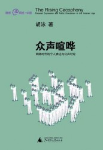
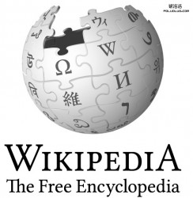
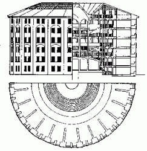

# 宙斯指尖燃烧出钴蓝幻象：电控空间内的喧哗与寂静

** 《众声喧哗：网络时代的个人表达与公共讨论》读书报告**

枝繁叶茂的互联网如同彼此盘根错节的碧绿藤蔓一样，毫无顾忌地编织成悬浮在现实世界之上的崭新空间，人们热衷于找寻合适的接口，继而争先恐后地携手涌入这个光怪陆离的比特之城，竞相见证一幕幕流溢着隽永幻象的电子狂欢。诚然如是，互联网时代为人类生存给予了最高限度的宽容和最接近梦想的天梯。

在加拿大科幻小说家威廉·吉布森笔下的浩渺银河中，他将计算机和互联网相互嵌套而最终生成的空间命名为“电控空间”，此空间可以看成是“成千上万接入网络的人产生的交感幻象。”在这个绵延无尽的交感幻象之中，任何一个接入网络的用户都随身携带着鲜活的个人隐私，这些五味杂陈的隐私信息彼此交错晕染成私域空间，而每个个体的声音熔融再生之后，在公共讨论的无垠荒原上爆发出娇艳花朵的镜像。网络传播的时代里，个人表达与公众讨论这两个过程已然投身于一场电光石火的博弈，而《众声喧哗》就以电控空间和共有媒体为基石，将比特之城的私语和众声、喧哗与寂静、破裂与重建等等姿态雕琢熔铸成不灭的铭文。

** 一．雷火熊熊的电控空间：阅读者眼中的叙述结构**

在古希腊神话中，天神宙斯掌管雷电以惩戒世人，而闪烁着金属蓝色的熊熊电火既属于强权和威严的象征，也堪称虚幻的标识。网络时代的电控空间具有类似的特质，电控空间为个体之间交流沟通的讨论领域创造了更多可能，而这个完全虚拟的领域也将永久改变人类的心性。传统意义上的交流场所具有十分明确和不容置疑的实质特征，场所往往组建成人类生存和生活的内核。“人类与其场所之间存在着深厚的情感和心理纽带”，这种心理纽带的清新芬芳随着岁月的流逝和居住地的变更而愈发馥郁，最终酿成人类社会独具的怀旧和乡愁。然而网络时代是一个非地域化的时代，电控空间轻而易举地粉碎限制时空的层层冰封，在此之后重建一席流动而明亮的斑斓幻象。

在《众声喧哗》一书中，作者胡泳导入电控空间概念，为从社会思想史梳理章节到互联网时代特质分析章节的过渡搭建了浑然天成的牵引之桥。作者从古代社会起源的公私之辨着笔，将阿伦特、黑格尔、葛兰西和哈贝马斯等思想巨头所秉持的公私概念进行纵向对照，从公私思想概念史的微观角度切入主题，为历史上风行一时的公私理论作出细致而清晰的梳理。然后，作者倾注丰盛的色彩以描摹出共有媒体的存在背景、媒体特性、发展种类，以及共有媒体同大众媒体之间相辅相成的关系。与此连缀的两个章节相互映衬，分别侧重网络空间内的个人表达和共有媒体中的公共领域。对于个人表达，作者强调认识网上自我的多重性；对于公共领域，作者以温柔和悲悯的眼光注视互联网环境中隐私的生存现状。紧随其后，视角切换至共有媒体对公私边界的重构问题，探索公私混杂的网络环境的运行规律。全书的最后，笔墨回转到中国语境下的网络公共领域，作者着重介绍中国互联网诞生历程和发展阶段中表现出的本土特征。作为研究网络时代个人表达与公共讨论的著作，中国的互联网环境不容忽视。纵观《众声喧哗》一书，中国学者典型的线性思维特质十分明显，除首章需要足够的社会思想史知识作为阅读背景之外，其余部分清晰晓畅并且结构严整。

** 二．繁花若锦的共有媒体：集体智能润泽互联网环境**

在电控空间的晶亮幻象里，共有媒体的出现和繁荣之势已成必然。《众声喧哗》的作者胡泳将共有媒体定义为“各种基于数字技术、集制作者/销售者/消费者于一体、消解了传统的信息中介的媒体系统”，在共有媒体的浩瀚森林之中摇曳着姿态各异的树影：电子邮件列表、讨论组、聊天、博客、播客、维基系统、社会性软件与虚拟社区、视频分享和大型多人在线角色扮演游戏等媒体类型彼此呼应，投下一面信息交流的繁荫。在此仅着重展开讨论维基系统，这种集体智能的表达形式为互联网环境带来福音，其核心是电控空间控制的、个人领域与公共领域的接壤和隐喻。尼尔·波兹曼在《娱乐至死》里也表明“我们的媒介即隐喻，我们的隐喻创造了我们的文化的内容。”

在绝大多数中国网络用户的视野中，维基系统听起来或许会相对陌生，然而提到百度搜索引擎则是几乎无人不知，而作为百度系统的核心应用之一，百度百科的出现未尝不可看成是维基百科的变体。维基百科拥有接近1000位活跃而负责的编辑，这保证了网络百科自身的准确程度和新鲜程度。《自然》杂志在2005年12月14日发表报道，声称根据科学评估，维基百科已经与大英百科全书质量相当，这充分肯定了网络环境积聚集体智能的惊人力量。“Wiki依靠的不是个人的单打独斗，而是社群的力量”，这种社群的力量建立在个体表达的充分自由之上，同样也是这种力量为所有用户提供一道双重身份证明，在知识自由交易的空间里，用户既是活跃的生产者，也是充满渴望的消费者。作为维基百科的受益者，用户在浏览他人智慧的过程中丰富了自己的知识体系，“每天都发生浩如烟海的数据信息，他们从中捕捉有用的信息来逐步完善浏览艺术。”个人分析维基百科的共有媒体特质有三个层次：首先，维基百科面向数量最为庞大的网络用户，任何感兴趣并且负责任的用户都可以成为百科全书的编辑者，个体的智慧和声音得到充分尊重。其次，维基平台允许并鼓励公众讨论，营造了相对宽松和自由的讨论空间；此外，维基百科针对编辑内容建立了相对完善的监督机制，在个人表达和公众讨论之间保持了微妙的平衡。根据统计，截至2006年12月，超过3800万美国用户已经接触并能够自如使用英文维基百科来获取信息。维基百科的巨大成功也映射着平民编辑知识内容这种传播途径的兴起，低门槛甚至是零门槛的表达和交流彻底拆卸掉知识外围氤氲的神秘光环，宣讲和传授的权力从曾经神坛上的专家学者手中转移到普通网民的怀里。作为电控空间之内共有媒体的典范，维基系统象征着互联网时代信息表达和信息交流的明亮面，共有媒体衍生而成的公共智慧注定改变时代思考的方式，“我们将拥有两个脑部，一个在头颅里，一个在云端。”比特和电子重构的“电脑”也为人脑的功能实现了绵延无尽的扩展，为整个网络环境的智能化生成助力。

**三．桃花依旧的个人表达：全视监狱维系着表达气质**

其实热衷于穿梭在电控空间里的发言者共享着一张相似的脸孔。中国互联网络信息中心的数据为网络上热心肠的发言者描绘了一幅精确的统计学肖像。他们是较为年轻的并且接受过高等教育的未婚男性。与此相对，网络空间里也存在着一个不喜欢表达自己的人群，号称“潜水者”，他们的统计学肖像倾向于年龄偏大的已婚男性，并且拥有未成年子女，教育程度相对稍低。发言者和潜水者尽管作为个人表达的两大阵营，但男性主导的文化依然盛行。互联网环境是一个男性声音更为响亮的战场，男性用户将网络视为以言语来冲锋陷阵的江湖，稍有不和就拉开“火焰战”，而女性用户则秉持着温顺性情，更加尊重他人的观点。其实从2006年至今，互联网环境已然呈现出更加柔和与宽容的姿态，巾帼的善解人意中和了须眉的怒发冲冠，于是电控空间之内的共有媒体变得更加有人情味，更加具有幸福感。

互联网个人表达的男性气质就像古希腊时代的奥林匹克运动会精神一样，互联网被默认为一种男性口诛笔伐的运动，胜利的桂冠和嫩绿的橄榄枝总是献给更有勇气和挑战底线的人，而女性气质则流露于特定的时尚、生活类论坛以及文艺博客，这两种气质共存在全视监狱式的网络环境之中，皆为个人表达不可或缺的培养环境。在18世纪末19世纪初，英国社会改革家杰罗米·边沁设计了一种“敞视监狱”以改造触犯法律的人，在敞视监狱的中心坐落着高耸入云的瞭望塔，而单人牢房则如散落星辰一般环绕塔身。这种敞视监狱使得中心瞭望塔内的监视者得以监督各个方向的罪犯，而犯人彼此之间的横向联系被彻底切断，只能感受到监视者存在的可能性，因此形成了一种持续不断、无孔不入的监视效果。在此之后，社会学家托马斯·麦谢森提出多数观看少数的“单视监狱”概念，而杰弗里·罗森提出多数观看多数的“全视监狱”概念，后者构成了网络时代的核心权力技术，全视监狱一般的生存模式深刻改变着人与机器的交流习性，“人与机器的交往已经不仅仅是一种互动，而是一种沉浸。”人沉浸于机器本身营造的神秘感和残余的安全感之中，在沉浸的过程中，隐私成为个人与公众相互博弈的焦点。个人表达的双重气质背后，表达的实质是为了博得关注，而最能引爆关注的莫过于曝光个人隐私，从个人表达到公共讨论，隐私如影随形。 

**四．沸反盈天的公共讨论：隐私是否欲说还休**

隐私的丧失和侵蚀似乎成为网络时代如影随形的附属品，仿佛提及互联网就会想到隐私权岌岌可危的生存现状，然而隐私的失落并非不可规避，作者胡泳提出一个意味深长的观点，即我们并不缺乏重新建构我们已然失去的私密空间的能力，但是我们未必真的会坚持这样的意愿和态度。生存在暗影中的人们怀抱着各自的隐私，“这样的文化对外表和仿真物有一种青少年似的迷恋，牺牲了更为终极的东西，削平了我们生存的深度和意义。”当隐私的暴露和凋零程度达到足以使感官麻木、足以顺从于电控空间的万般幻象时，我们也许真的会动摇那份重建隐私边境的决心。

2006年的中国互联网领域内形成了网络暴民这个新群体，网络暴民步步追击，在揭露他人不堪隐私的过程中追逐着不可名状的快感。浙江卫视主办的《中国好声音》燃烧出的绚烂虹霓将2012年夏季的传媒领域映出一片姹紫嫣红的瑰丽奇景，好声音的超高关注之中也存在着对个人隐私和公众讨论的运作和制衡。隐私向来都是综艺节目热衷和追捧的调味料，纵使是《中国好声音》这样境外引进、维护版权的正规节目，也不能完全拒绝隐私浮现时带来的巨大关注度和网络人气。在导师盲选第一场结束后，刘欢队学员李代沫的个人隐私被别有居心的人利用，令人惋惜。这个来自东北的二十四岁小伙子的声音中自有一种温柔的幽默感。留着光头、蓄着胡须的李代沫甫一开口，就受到媒体的强烈关注。然而随后一位男性网友突然在新浪微博上公开自己和李代沫的亲密合照等隐私信息，将性别倒错的舆论剑锋直指选手本人。如《众声喧哗》作者所言，“人人都深受其害，人人都侵害别人。”在隐私从本体之中离析而出的瞬间，互联网环境里盘旋着一种雷暴之前的沉寂。中国网民栖身于一个正在成熟中的互联网环境，对于信息价值的过滤能力还需要提高，而对于他人隐私的尊重程度更需要时刻自省。德国哲学家恩斯特·卡西尔在《人论》中提到，“人被置于一个广大无边的空间之中，在这种空间中他的存在似乎处在一种孤独的尽头。他被一个不出声的宇宙所包围。”如果个人隐私在公共讨论中无限制地流失，那么人就只能囚禁在永恒的孤独和苍白之中。

在对于共有媒体环境里公私边境重构问题探讨的章节中。作者提到在现代社会中同时存在两个平行过程，即公共空间的私人化和私人空间的公共化。“一个理想的公共领域，从来不可能像雅典娜从宙斯前额里跳出来一样在互联网上迅即成形。”作者希望在共有媒体之中建立一个理想的公共领域，建造这片个人表达和公共讨论的乐土时，首先需要给予参与者社区归属感，满足人们对于友情和安全的需要；其次应当合理运用匿名手段，发挥匿名政策对言论表达自由的激活作用，同时回避匿名不利于承诺和不利于责任的缺陷；然后保证网络发言的平等性、鼓励自我表达的慎议过程，最后培育良好理性的公共话语。理想的公共领域源于人类内心深处对于群体的需要，“我们深深地需要一种附属感，要有一种属于我们的文化和我们的社会的感觉，感到在我们的周围环境和生活方式中有一定程度的稳定和亲近。”维系互联网环境和电控空间的亲切感和安全感，也是在守护者人类心灵的归属地。

俄国作家索尔仁尼琴在《癌症楼》中描述到，一个人在一生之中会沉淀海量的信息，而每个人身上都附带着千千万万条隐形的信息线索，如果有一天这些线索从黑暗深处挣脱而出，那么人们将戴上无形的枷锁。电控空间的钴蓝色火焰灼烧出明亮的幻象，而胡泳在《众声喧哗》中认为，随着时光流逝，人类灵魂的各个层面都会在一个坦白的社会里敞开，而这样一种网络时代的共有媒体文化忽视了个人情感和反思、创造性和尊严以及诸多沉睡在生活深处的事物，“这些东西离开了超然、静谧和隐匿将不复存在。”网络在往昔生活的叶片之中剥离出那些沉静和安然的脉络，在一池信息爆炸的沸水里烹煮，最后端出一杯杯五味俱全的浓汤。互联网将人类社会生活的清淡部分涂上重彩，在电控空间和共有媒体的场域之中，维系个人表达与公共讨论的平衡状态，也就是维系着人性和社会性的安稳与怡然。

 **参考文献：**  1. 胡泳：《众声喧哗：网络时代的个人表达与公共讨论》，桂林：广西师范大学出版社，2008年 2. 【美】尼尔·波兹曼 著，章艳 等译：《娱乐至死·童年的消逝》，桂林：广西师范大学出版社，2009年 3. 【美】约翰·帕尔弗里、【瑞士】厄尔斯·加瑟 著，高光杰、李露 译：《网络原住民》，长沙：湖南科学技术出版社，2011年 4. 【德】弗兰克·施尔马赫 著，邱袁炜 译：《网络至死：如何在喧嚣的互联网时代重获我们的创造力和思维力》，北京：龙门书局，2011年 5. 【德】恩斯特·卡西尔 著，甘阳 译：《人论》，上海：上海译文出版社，2003年 威尔伯·施拉姆、威廉·波特 著，陈亮等译：《传播学概论》，新华出版社，1984年 

（采编：韩忠楠；责编：彭程）
