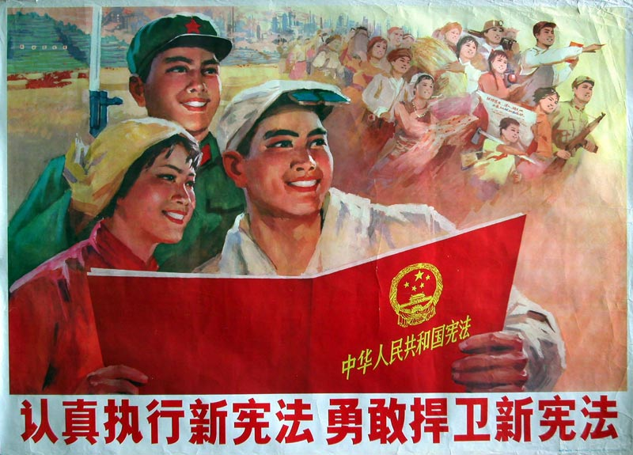
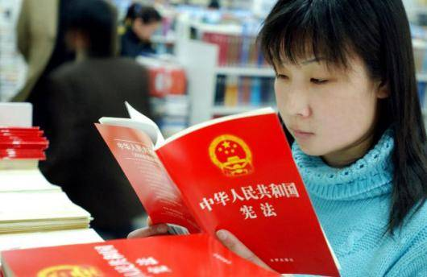

# 宪法是政治体制改革的共识

经过三十多年的改革，政治改革滞后于经济改革的弊端日益显露，社会不安定因素逐渐积累，推进政治体制改革是当务之急。但政治体制改革如何进行，众说纷纭，迄今没有共识。古语云：谋定而后动。没有共识，何以定谋？所以，我们当今的政治改革“稳妥”有余，“积极”不足。

其实，政治体制改革的共识已经存在。这个共识就是中华人民共和国宪法。虽然现行宪法并非十全十美，但只要把它落到实处，我国政治体制改革就会前进一大步。

《宪法》第57条规定，“全国人民代表大会是最高国家权力机关”；第62条规定了全国人民代表大会有15项职权；第63条有罢免国家主席、国务院总理等国家领导人的权力。《宪法》还规定了国家行政机关、审计机关、检察机关都由人大产生，对它负责，受它监督；国家的武装力量属于人民，国家中央军事委员会领导全国武装力量。我们必须坦率地承认，全国人民代表大会并没有成为最高国家权力机关，《宪法》的这些规定没有落实。

《宪法》第13条规定，“国家依照法律规定保护公民的私有财产和继承权”。如果这一条落实了，就不会有层出不穷的侵犯私有财产的恶性事件。

《宪法》第33条规定，“国家尊重和保护人权”。如果这一条落实了，“暴力执法”、“暴力截访”等恶劣行径不会如此猖獗。

《宪法》第35条规定，中华人民共和国公民有言论、出版等多项自由。如果这一条落实了，对传媒的种种非法限制就不会存在，更不会“以言治罪”。有了言论、出版自由，对权力腐败也就有了必要的舆论遏制。

《宪法》第37条规定，公民的人身自由不受侵犯。这一条如果真正落实，就不会有重庆式的“黑打”和北京安元鼎式的迫害访民的黑监狱。

《宪法》第126条规定，法院依照法律规定独立行使审判权，不受行政机关、社会团体和个人的干涉。如果这一条落实了，就不会有那么多不受理、不立案，就不会有那么多冤假错案。

政治体制改革就是要建立一套对权力制衡的制度体系，就是要切实保证公民权利。《宪法》中有很丰富的保障人权、限制国家权力的内容。将《宪法》和现实对照，就会发现现行的制度、政策、法令和很多政府行为，和宪法的差距十分遥远。我们的宪法基本上被虚置。

任何一个法治国家，在政治体制的设计上都必须以宪法为依据。将宪法虚置，不仅是对中国人民的失信，也是对国际社会的失信。国无信不立，宪法失信的状况必须改变。十二大以来的党章都有规定：“党必须在宪法和法律的范围内活动”。这就是“党在法下”。“党在法下”是重要的宪法原则和政治原则。做到了“党在法下”，就能避免宪法层面的名义制度和运行层面的实际制度相悖而产生的种种弊端。

宪法是国家根本大法，宪法的权威至高无上，依照宪法推进政治体制改革，不会、也不应当有争议。

既然宪法是政治体制改革的共识，我们就应当行动起来，将虚置的宪法变成现实的制度体系、法律体系，就应当将现行一切违反宪法的制度、法令、政策改变过来，使其与宪法一致。在这个意义上，政治体制改革实质是一场“维宪行动”。

徒法不足以自行。落实宪法，必须有相应的制度保证，例如建立宪法审查制度：或者建立宪法法院，或者在人大设立专门的委员会，或者将宪法司法化。建立落实宪法的制度，本身就是政治体制改革的重要内容。

尽管现行宪法并不一定完美，但是，只要我们将这部宪法落实了，政治体制就会前进一步。在政治进步的基础上，将来修订宪法，再将新的宪法修订条款落实到政治制度中。如此这般，就是渐进式改革。这种渐进式改革，就是通过宪法途径不断改善政治制度。

多年将宪法虚置不仅给少数人带来了巨大的利益，还形成了盘根错节的利益集团。“维宪行动”必将遇到重重阻力。习近平总书记最近在广东视察时表示：我们要“敢于啃硬骨头，敢于涉险滩，既勇于冲破思想观念的障碍，又勇于突破利益固化的藩篱”。只要有这种精神和魄力，全民努力，上下互动，“维宪行动”一定会成功。

新的一年，新的领导集体，新领导人一些新的作风令人高兴。在新的一年，千头万绪中我们最为期盼的是，在落实宪法上有切实的行动。

（采编：徐海星；责编：徐海星）
