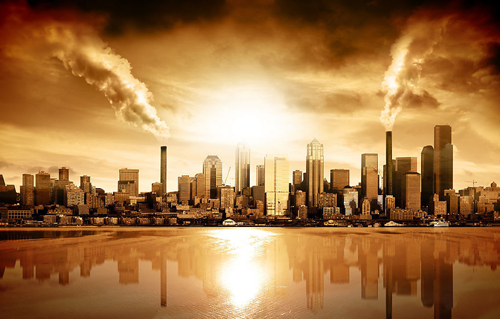
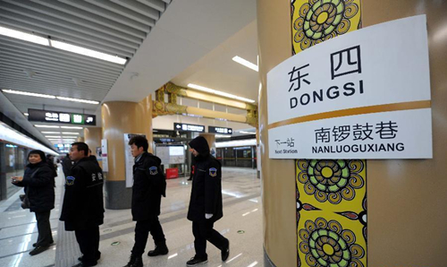

# 寂寞在六号线

今天的北京活像19世纪末的伦敦，工业废渣带来的死气弥漫着据说是国际大都市的城市。空气的浑浊如同死神一样公平，不如中南海吃特供而我等只能吃三聚氰胺一样。他们依然呼吸着PM值高达800多的因而被提醒要做足防毒措施的空气，而不比他们的孩子可以在帝国主义的敌后做着艰苦的策反工作。

我恍惚觉得城市的某个角落会出现开膛手杰克，而或者某个门牌号写着贝克街221B号。浓雾中分不清楚城市的远端，所有人的世界都变成了那个方圆二百米夹杂着汽车不间断的鸣笛声的世界。我甚至希望新闻会出现诸如“在北京呆上十年会折寿二十年”的一类数据，幻想着人们会不会开始逃离，这里逐渐变得安静。由于房价狂跌，处处都挂着地产开发商跳楼自杀的尸体。地铁也变得空空荡荡，就像非典时候一样，人们街边只能口罩相见，眼神传递着恐慌与绝望。西直门桥也会变成一眼无际的空旷，仅剩的几家孩子在上面滑旱冰，桥的裂缝中开始野草丛生。人们开始遗弃这里，这里渐渐变为死城。时间一长，一些异地的勇敢者会重新闯入这里，到那个曾经叫做国贸的地方去偷盗废钢材；一种奇怪的生物在三里屯的废墟上生长，他们会传播致死的病毒，而为了更多人的安全，这座叫做北京的城市开始用围墙围住，那些不愿离开的人就成为了这里最后的守护者。他们可以自由选择愿意住的地方，无论是曾经每平十三万的玉渊潭，还是直接金融街地铁站旁，也许可以直接进去皇家园林，住老佛爷的那些发出朽木霉味的老居所。当然，政府还是有人性的，他们在一个叫做杜家坎的地方设置了围墙的小口，每天有食物扔进去，活在里面的人还能拿到唯以生存的底线。

人们终于不至于调侃为什么北京不放开异地高考了，于是那时候有个北京人在杜家坎的缺口挂上了牌子：“欢迎来高考”。你可以在人大附中考，你可以在北京四中考，当然你更可以去北京大学考。城市的毁灭让一切公平与非公平变得不存在，人们也在明白，其实中国没有了一个城市照样运转正常，人们离开了北京一样存在。

胡思乱想的时间我上了地铁六号线，这是一条新开通的地铁，最大的特点是从头坐到尾手机都毫无信号。如果一个在北京的人突然消失，只有两种可能，一种是死了，一种是在六号线上。在没有任何外界联系的地下，我看到的每个人显得都很寂寞。我知道他们拿着手机，看得很仔细，其实我知道，其实一条短信或者一条微博都发不出去。他们一定在看着老情人的短信，听着苍老的情歌，想着寂寞人生的黯淡时光。

我想到如果六号线突然撞在了哪里，一片漆黑，大家是连最后的话都说不出去的。两年多以前我坐过地底一千米的矿车，在通往那个无尽的黑暗的路上，我知道其实有许多人，就是进去以后再没出来。我常幻想着那种无法逃避的死亡前的最后清醒，它一遍遍的在世界的各个角落发生，到我们知道时往往只有短短的两个词——事故和死亡人数。但我在地底一千米的地方，仍然看到一个老头亮着煤油灯，睡在坑道的一个侧面凹处，且一看就是经年累月没有去过地上了，做纯粹的守坑人。人类当然有很多种寂寞，但我仍然觉得，看他脸上的每条皱纹，我都觉得是那样苍凉。

我看到一个年轻的女人坐在座位上暗暗抽泣，地铁时而的颠簸和明亮的灯光让她的动作尤为瞩目。她缩在那样的一个角落里，不知为了什么。为自己，为亲人，还是为了爱情。我想起几年前的某个时刻，我跟一个女生告白失败，独自坐在地铁回家的路上。似乎每个地铁报站名的响起都让我酸楚，而后再走那条路线时，心中还是恍惚。朋友说，告白是一段感情的高潮，而非开始。的确，一段故事当然会有开始高潮和结局，这适用于无论喜剧还是悲剧。我不知道结局悲剧的高潮是否值得铭记了，那女生后来会跟我有联系，也会对我很好，但我已实在无法再去与她说更多的话。每逢听到的她的声音，我都会想起地铁上闪烁的灯光与难以言喻的心境。

生命便是由这些组成的吧，你可以记住的欢乐，你可以记住的悲伤。演绎故事的主角，渐渐淡出了我们的视线，却因为这种感觉，而变成一个符号。每当我们提起她时，也许是为了怀念少年时代的心思，也许是为了记得那些艰辛的岁月，也许，就是为了证明自己的人生曾经这样度过。

我在这座城市已经会戴口罩了。人们在学会真的明白生命比什么都重要之前，最先想到的一定是忍，而我显然也不例外。我偶想这条街上的每个活得辛苦的人，一定是等着那个第一个死于毒气的人，或者等着一代人做成的死亡概率标本出台之后。那一年，他们都会走的，这里终会安静。

那一年，我一定再坐那一趟地铁，看旧年的车站一个个过去，想着那一年骤然而逝的希望与冲动，只剩下酸楚。雾中不知朝阳落日，却可有雨雪黄昏；那些喜剧与悲剧的交错，我唯一能庆幸的也许只是我在最高潮的时候对你的印象戛然而止。于是我对你的心思，永如少年般，恒久不变。

（采编：黄梅林，责编：佛冉）
