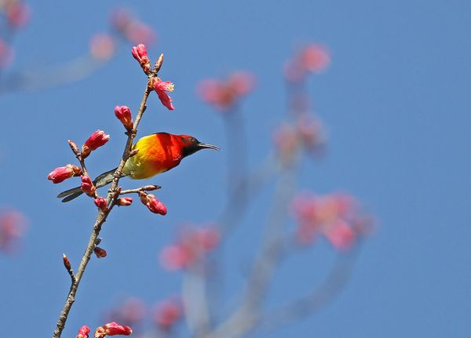

# 密云不雨

** **

“我一沾酒精就会晕。”我与M在校门口分道扬镳。

这位丽质后生的日本小姑娘一到周末就忍不住想喝酒，她问我愿不愿意同去，于是我不得不撒了个小谎。其实酒精我连沾都没敢沾过。M和我同级，却老是念叨说：“我恨不得现在就二十一。”这样就好光明正大地走进酒吧，不需要再用假身份证去骗睁一只眼闭一只眼的老板娘。用她的话来说，喝酒本身并没有什么不对的，逃避清醒何必要等到二十一岁呢？

逃避清醒？真等到二十一岁糊涂会不请自来吗？我猜，像睡莲一样，时辰过了，想清醒也难。直到最近，我承认自己从未对年龄感到如此惶恐，最明显的症状是怀旧。从前只是念叨童年的好，有可以大把虚掷的时光。但爸爸教我记花鸟虫鱼的名字呀，下雨天到处踩水塘之类的景象都忘记了，现在却连看似淡而无味的细节都精确地显现出来——笃志楼前的大槭树，一到深秋就如火如荼地红了叶子，浅琥珀色的槭糖顺着树皮的褶皱一寸一寸往下淌，每一滴都折射着透明的阳光；还有机场安检口擦肩而过的陌生父子，父亲穿着再普通不过的夹克衫，替看上去像是高中生的儿子提着行李，嘴里好像在说：“你妈妈会想你的，我估计……”总之都是无关紧要的记忆残片，在昨天，在城市的街头，在疾步穿过初秋零星小雨的时候竟然莫名地浮上来，像在提醒我自己活过，我至少拥有记忆。

而我除了记忆一无所有。

我学说一门语言，却发现已无话可说。我试着学会谦虚，却发现自己根本没有资格。我到了据说是前途无量的年纪，却发现它只能证明我不是天才。我手握大把的时间，吝惜每一秒钟，却又不得不无奈地把它们浪费掉，只看得太阳升起又落下。来不及了，我想，什么都来不及，不是因为剩下的人生不够长，而是因为过去的已太多。往者不可谏，来者不可追。我战战兢兢栖脚在十字路口，活像一只掉队的倦鸟。唱歌吗？前辈都已唱过了；回巢吗？我无能为力；高飞吧！我还没那底气。于是只能在沉默中怪罪自己的晚熟，在晚熟中沉默地等待季风与绽放。

有一阵子我觉得自己无可救药的幼稚。

也许应该听听长我两三岁的过来人的话，比如“要学会大智若愚，不必什么都说”，可是没有大智者如我，是真愚，不用若的。而当我忍着笑把怕得罪人的真心话咽下去时，不但没有装成傻，反而像在演一部喜剧默片，看的人纷纷笑了；也许该认清现实，按着过来人教我的那样，“最好学会保护自己，放掉关于信仰的痴念，不然你会遍体鳞伤。实现信仰，靠你一个人怎么可能呢？”可是真正信仰坚定的人其实从来不觉得自己吃亏，他们和没有信仰的人站在同一条河的两岸自得其乐，互相同情，倒是在河水里扑腾的我被现实与理想的河岸弹来撞去，一边劝自己不可能，一边又放不下。有什么东西在心底阴燃，不烫，却很灼人。我问自己是不是用不可能作胆怯最正式的借口，还是用信仰作盲目最华丽的面具？游移之间，这第两堂课我也没能学会。难道说我应该学习烟熏妆化得浓到呛人的女孩子和学跳街舞的老婆婆，把年龄冻结在和自己不相匹配的那个瞬间，好永久地逃避独属于某个年龄的笑与泪？可是如果那样，时间的皱纹就被抹平，四十岁的看起来和十四岁的一样，人仿佛不会衰老，生命貌似不会流逝，年轻和时间因为太充裕而丧失了一半意义。

肥千有言，人只因不能天长地久，而可以顶天立地。

总之，我试着变成熟却没能成功，唯一学到的就是，世界上恐怕没有比装成熟更幼稚的事了。

因此我往往让大孩子们嘲笑。尽管如此，我仍然惊叹他们可以不借助神的语言而无比平静地诉说恐惧和死亡，孤独和迷茫。我说我想到现在看到的一粒星光可能是一颗已经在六百年前消陨的恒星的影子，而等我们消失之后连一点光线也不会留下，觉得恍惚。他们只轻描淡写地说，你难道指望自己永生不死吗，还是早点学会享受当下吧。我诉说台灯下独自发呆时产生的奇怪想法，他们却只说恐惧的冰块早晚要自己吞下，你害怕只是因为不曾经历，你失望只是因为你还没有放弃期待，知道吗，生命对于大多数人从来不是什么传奇，我的不是，你的也不是。

这些话没有多少是错的，也许多半还是好心的过来人为了避免我走弯路而归纳出的真理，然而正如Lord Henry告诉Dorian Gray的带有韵脚的美丽又冰冷的警世名言，全是事实，却还是把一个欣欣向荣的少年毁掉了。有些话我不愿意听，因为惧怕承认生活会是被鸡毛蒜皮淹没的会行走的僵尸，惧怕看到它平庸的终点，或者仅仅是因为我结构简单的大脑只适合蒙昧和无知，尚且接受不了这样直来直去的开导。

有意思的是，长我两三岁的人教我的事，长我两三辈的人反而不再教。

他们或是坐在躺椅里闭着眼睛听我说完一出口就后悔的错话和俏皮话，猛地抬起手像要打下来，却只是嗔怪地轻轻落在我头上，扶了扶微卷的刘海；或是在听完一番恭敬的问候请安之后，忽然调皮的说要给我讲自己念书时候的故事，于是絮絮叨叨地讲一整个下午，像铺陈化石那样枚举年轻时候的大悲大喜，不再避讳，不再嫉恨，只有遥望，没有挂记。一切都过去了，讲故事的人突然咧嘴一笑，明媚得像个孩子，独留听者在余音里震撼得说不出话。

当然并非所有长者都这样和蔼，有些时候，我看到乖戾或暴躁的他们——战火，流离，饥荒，革命，大半个世纪的风雨造成的创伤在一个逐渐失去抵抗和隐忍的躯体上发酵。小时候被剥夺的，他们用一辈子去索取；年轻时候放弃的，直到老还让人止不住哭泣；一个别人不经意提起的字眼足以引发一场肝火——“日本人应该一个一个拉出去枪毙”之类的话毫不客气的从依然倔强的嘴唇里迸出来，伴以全家子女的附和或劝慰。还有那些从觥筹交错的名利场中隐退的长者，眼看着自己一手搭建的王国归为他人，而自身的气力正以令人绝望的速度消损，连一直引以为傲的记忆力都在坍塌，随之而去的还有棱角分明的脸庞和风华正茂的往事，而此刻生活的安逸却只让他感到震怒，于是只能用火气或任性支撑他对世界的最后一点掌控。

停止了批评，停止了嘲笑，不再有期待和表扬，也不再讲道理。

然而即使是这样，长我两三辈的人仍比长我两三岁的人教会我更多。我看到，生命在天堂的湖畔显出它最天真的模样，比血气方刚的青年更倔强，比婴儿的啼哭还要顽强。在平静的湖面，纳塞西斯收敛起他自恋的妆容，淡定地等待皱纹吞噬额角，蔓延到眼眶，瞳仁里不再有失望和挑剔，只有生命对生命最宽容的端详。

有资格谦虚的人也有资格骄傲，却甘愿放弃骄傲；目睹现实真相的人却最终拾起信仰，虔诚地上香；不再无话可说的人却甘愿有话不说，向每一场年轻人烦恼的倾诉报之以一个诡秘的微笑。

三年前，一位长辈读完我桌上强说愁苦的新诗，半开玩笑地说：“叔本华有句话，Life is short and truth works far and lives long. Let us speak the truth.你懂吗？”

那个深春的下午，竹帘窗外的石榴花火红欲燃，夹伴着黄莺清亮的啼鸣，花园里蝉声初起，却几乎可以听到莲花撑破池塘上那方空气的簌簌喘息，操场上依稀传来少年的嬉笑，我约同窗周末去炮台湾放风筝。彩色的声音尝起来是甜的。这是生命狂欢的季节，哪里有心情去想它是短还是长。我默默觉得连这个念头都像是对空气的亵渎。

我点头，又摇头。

但愿我能懂。

我想我会懂。

 

（采编：黄梅林；责编：姚昕毅）

 
