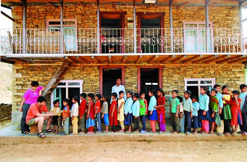

# 对公益机构认识的两个误区

** **

很多人理解的公益就是尽力帮助他人，使这个社会变得更加美好。然而人们对以公益为主要业务的慈善机构或公益组织却只有一个相对模糊的概念：一个做好事的地方？那么，你的理解是否正确呢？我们来看看，你是不是走进了以下几个误区？ 

**误区1：公益机构的工作人员：是公务员？是志愿者？是公司员工？**

对于公益机构的工作人员，显然大家对其的理解各不相同，公务员？志愿者？公司员工？其实都不正确。首先，这些工作人员属于非政府组织，和公务员显然很不一样。而与无偿奉献的志愿者相比，这些拿着薪水的工作人员也是不尽相同。虽然在管理上公益组织和普通公司相差不大，但不以营利为目的的特性，让公益组织的工作人员与公司员工也有着本质的区别。确切点说，这些从事公益行业的人，是一群特殊的工作者。

在中国，做公共服务的部门有很多：政府机关、事业单位、非政府组织以及部分国有企业的下属单位等等。这些部门虽然作用各异，但互为补充，一个都不能少。在公益组织工作的人，经常会提到NGO（Non-Governmental Organization，非政府组织），而我们常说的公益组织主要就是指的这些非政府组织。当然除此之外还有还有NPO（Non-Profit Organization，非营利组织），以及社会团体。在中国，这三者的内涵互相交叉，没有太多本质区别的，一般人更喜欢通俗地称之为公益组织或慈善组织。（目前关于分类的说法有很多，之后还会再详细写一篇。）

在中国的特殊环境下，有一类 “官办NGO（GNGO）”。“非政府”和“官办”居然能连在一起，是不是很奇怪？有些事情是政府不方便去做的，所以会通过一些其他渠道渗透到民间，以此提升形象、巩固权力，这些大家也都懂的。“官办NGO”的代表就是中国红十字会了，还有青联、妇联、残联等有政府背景的半官方社会组织。既然有了政府背景，“官办NGO”就不是纯粹的非政府组织，应算事业单位，其中的工作人员有公务员，也有合同工。然而，虽然“民间NGO”和“官办NGO”的东家不同，但都有着共同的美好目的，这是毋庸置疑的。

相比于“官办NGO”，“民间NGO”显然走得更加艰辛。一些国际NGO待遇稍好，这些国际NGO的中国分部，因为和国际接轨，资金来源比较充足，虽然辛苦点儿，但大多维持着比较正常的薪水。而按照《基金会管理条例》规定：基金会工作人员工资福利和行政办公支出不得超过当年总支出的10%，所以基金会工作人员的薪水也只是维持正常生活。还有更多的是所谓“草根NGO”的小型社会团体，很多草根NGO的工作人员本身就少得可怜，甚至只有两三个人，他们辛苦地撑起整个机构，努力争取到一些国内或者国际基金会那些并不丰厚的接济过活。

而NGO的人员构成是怎样的呢？以某NGO为例：项目工作人员和核心志愿者是组织工作的主要执行者；理事会相当于代表出资方的董事会对于企业的角色，发挥了筹款、监督、重大事件决策等功能；顾问组增强了整个组织的智慧力量；志愿者群体帮助扩展活动空间并增强行动力度。项目工作人员、理事会、顾问组、志愿者都是不可缺少的。

很多同学都当过各种形式的志愿者，也就是我们常说的“义工”，其中有不少是帮NGO干活儿。但志愿者没有很丰富的专业技能和经验，时间上也没法保证，所以NGO一定是需要全职的专业员工的。很多岗位要求有社会学，心理学，医学，经济学，教育学的背景，做一些专业性很强的工作。这些员工也和其他普通人一样有自己的家庭和梦想，但梦想不能拿来当饭吃，拿工资，无可厚非。

**误区2：善款应该直接捐到受助者手中，而不是通过公益机构这个第三方。**

如果有一个人真的非常需要十块钱来保证他的基本生存需求，而我，不好意思，在保证生存需求的前提下只富裕一毛钱，虽然这显得有点杯水车薪，但是能提供一毛钱的人越多，彰显的能力也就越大：当有十个人有着和我相同的想法的时候，这个需要帮助的人就有了十分之一的希望；当有一百个人的时候，这个需要帮助的人的生存意愿就得到了满足；而有一千个人的时候，就可以有十个需要帮助的人得到帮助！慈善捐款的魅力就是如此，将世界改变，不是一个人做了很多很多，而恰恰是每个人都做了一点点。公益慈善，需要我们每一个人。

然而，红十字会郭美美事件发生后，很多人都说“坚决不捐钱给红十字会，要捐就直接交到受助者手中，大不了自己跑一趟”。且慢，是否选择红会是您自己的决定，但不要把所有公益机构都一棒子打死呀。不少NGO和一些民间救助项目的财务透明都做得很好。如果每个人都为了捐钱而跑一趟，这个过程中浪费的资源还能救助更多的人呢。

很多人又担心自己的善款没有百分百交到受助者手中。国外的通常做法是将捐款分为两大类：限制性和非限制性的。限制性的是捐款人在捐款的时候就对捐款的用处有一定的指向。即便这类捐款，公益机构也是有权利按一定比例提取“管理费”的。非限制性的捐款就是捐款人没有特别的指向，公益机构可以根据自己的需求自由使用。但每年都要对公众公布所有捐款的使用情况。

在中国，善款分得没那么清晰，但基本也是按照规范来的。严格来说，募款是遵循募捐声明和捐赠合同的，上面把花钱的目标表明得很清楚。捐款之前，一般都能知道自己捐的钱是全部送交受助者，还是提取百分之几的管理费。实际上一个公益组织可能对不同的捐赠人作出程度不等的承诺，但捐款者都是有知情权的，不管是捐了多少钱的捐赠人，如果索要财务报告，则必须提供。公益组织要保障捐赠人的利益。

以网络救助平台施乐会为例，他们的网站上写得明明白白：施乐会工作人员的工资是由一家爱心企业全面提供。网友所捐赠的每一分善款都会全额送到受助人手中，不会从中扣除任何费用。且“施乐会”操作透明，所有善款的银行汇款截图公开。施乐会的这种模式，能让热心的捐款者更加安心。但即使是会从善款里抽取部分管理费用，也是可以理解的。

网络时代，不少人都通过微博等新媒体方式来扩散求助信息，成功获得众人的同情和捐助。但你有没有想过：

第一，网络上有些信息没有公益机构作为第三方来核实，并不一定可靠，现在已经出现过一些人用虚假信息骗取网民的同情心。

第二，作为个人，没法获得太大的信息量，而机构就能很好地核实目前进度并及时发布状态。举个例子：网上流传着好几个捐衣服的地址，转载无数，很多好心网友都寄去了衣服，导致那几个小学的衣服已经堆积如山，远远的超过需要的量，这是一种资源浪费。后来那里的老师发贴求大家不要再寄去，但这两种信息已然失衡了，还是不断有网友寄去衣服。

第三，这个世界上，还有很多你无法了解到的角落，因为没有条件扩散信息，得不到足够的帮助，但民间慈善机构能有机会走下去，主动去了解他们，然后均衡地分配善款。

第四，对于身患疾病的受助者，有时候，还没用完捐款，就已经死亡，这时，如果没有第三方，这笔钱会很难处理。当有第三方管理善款，则能有两种处理方式，要么就将钱退还给捐款人，要么根据捐款人的意愿将钱转交给其他同样需要帮助的人。

第五，对于那些非伤病非急需用钱的受助者，公益机构不只是直接“发钱”，他们更多的是拿这些钱做一些项目来改善他们的生活状况，让他们学会赚钱。比如说教授农牧业知识，修路以改变交通状况，发展教育事业等。公益机构比大多数普通人更具有救助的专业性，也许你的一块钱能发挥出十块钱的作用。

大家应该都知道陈光标，他的特色不仅在于高调捐款，而且还喜欢把钱直接交到受助者手中。陈光标的行为引发了大讨论，不管怎样，不能否认他对于慈善起到了带头宣传作用。却没有那么多人知道曹德旺，有兴趣的同学可以搜索一下“曹德旺2亿元项目”，这个通过中国扶贫基金会来施行的，号称“史上最苛刻捐款”的2亿善款捐赠。你们觉得哪一种更好呢？ 

（采编：薄然；责编：陈锴） 

