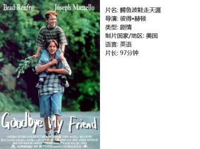
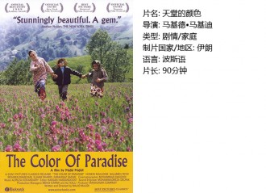
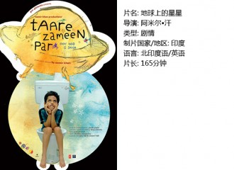

# 对孩子的态度就是对生命的态度（独立影像第五十一期）

叶德娴有一首歌，是罗大佑写的，叫《赤子》。原以为是描写了一个高洁纯真的人格，却原来讲的是人间聚散冷暖，并凄凉地以“童稚已每年渐远离”作为结句。

其实生不带来死不带去，每个人在世间收获到的东西，最终会以回馈后辈的方式，返回给这个世界。

如果没有爱，我们就不会出生。如果没有爱，生命也不会延续。

我向来以为世界没有终极真理，也即没有应该怎样，而只有相信怎样、认为怎样和喜爱怎样。

所以，假如我的孩子不至于忤逆地丝毫不理睬我，那我必然会交给他我所相信的、所认为的，和所喜爱的。

对待孩子的态度，就是对待生命的态度。

在理想与现实之间，愿得一条赤子之路。

一、鳄鱼波鞋走天涯

相比注入性艾滋病患者DEX，无疑我们幸运很多，拥有健康已是莫大福分。匆匆一世，短暂的生命在世间究竟收获了什么呢？《鳄鱼波鞋走天涯》从Erik的视角，带观众分享了男孩Dex的世界。

Dex有一个端庄智慧、十分爱他的母亲，心里一紧张就会用手指绕头发，还执意肉麻地称呼Dex为“sweetie”，让他感到羞赧。

这位爱他的母亲，显然对Dex进行了正直的教育，所以Dex会对向他道歉的“坏小子”说“Thanks”，也会在Erik偷钱时说“这样不对”，当Erik作了坏事，作为朋友的Dex也会感到伤心和气馁。

不难获得结论，在有着势利的母亲，并学会了人性中“贪婪”“报复”这些丑恶部分的Erik的对比下，Dex虽然生理上是残疾的，心理上却更为完满。他年仅十岁，十年来却收获了母亲真挚的爱，以及积极的价值观。他一身的正能量，轻易地将Erik捕获，收获了一份甜美的友谊。

Dex也和人们一样有着脆弱和不安全感，他的病情使这种不安全感对他人而言，格外地清晰锋利，Erik给他鞋子对他说“你握着鞋子的时候，Erik就在你身边”——此刻Dex又收获了存在的寄托。

从亲情、价值观、友谊，再到整个生命存在的寄托，我以为Dex的生命是完整的。当片尾Erik与小Dex交换鞋子时，我甚至开始嫉妒这个从另一个角度而言“人生尚未展开”的儿童。更让人宽慰的是，Erik在沉思之后，也对生命有了更深的了悟，让鞋子顺水而去。

该得到的，Dex已然拥有，因此并无遗憾。

二、天堂的颜色

同样是儿童主题电影，《天堂的颜色》在描写盲童穆罕默德的纯洁无邪之后，更是意在映衬成年人的无奈与真实世界的苦难。

当穆罕默德问“你听，鸟儿在说什么？”时，我体内的两种人格不禁打起了架，一个说“呵呵，图辛破！”另一个说“呜呜，我老了！”

当穆罕默德对盲木匠哭诉道：“没有人爱我，连奶奶也一样。他们都因为我是瞎子而离开了我。若我能看得见的话，我就可以跟别人一样上学，但现在，我必须上盲人学校，就像在世界的另一端一样。老师说主比较疼爱瞎子，因为他们看不见。但是，我说若是真的如此，上帝不会让我们瞎掉，所以我们见不到上帝。老师回答说，‘主是不可见的。无所不在，你能感觉到。你用指尖了解。’现在，我不停地伸出手，直到有一天我感受到上帝的存在为止。我要告诉他每件事，甚至是我内心的秘密”——盲木匠沉默了好一会说：“你的老师是对的”，然后缓缓走开，留下一个何尝不是同样寂寞无奈的背影。

当穆罕默德的父亲在雨里对奶奶大吼“我又穷又困，丢了老婆，要我的余生来照顾一个盲童吗？”时，我泪如雨下。虎毒不食子，怎样苦难的现实才会使一个父亲忍心远远送走自己的儿子不愿相见？

奶奶病倒后的一天晚上突然将护身符交给了父亲，并说“我不是担心穆罕默德，而是担心你。”祖孙三代，每一代人对后代的情感都是同样，“可怜天下父母心”，每个如今的父母，都是曾经的孩子，只是愈是成年，愈是沉溺挣扎于现实，无暇品尝生命的甜美。

一直视儿子为负累的父亲，在穆罕默德落水之后，幡然醒悟。他在沙滩上搂着穆罕默德的身躯哭号，人性在此刻获得了天堂的救赎。

也许他也发现了，并不是无知的孩子在需要和依赖成年人的牺牲和照顾，而是成年人需要和依赖自己的孩子，以此唤醒那些美丽的记忆，以此获得生命的完整和寄托……

如果没有孩子，还有谁来疼爱这个世界。

三、地球上的星星

阿米尔汗是我个人很偏爱的一位导演，向来对电视剧的忍耐力只有20分钟、对电影的忍耐力只有90分钟的我，空前耐心地花了165分钟来看他讲述对教育孩子的态度。

从时长便能判断，阿米尔汗在这部《地球上的星星》中倾注了大量的情感，以至于不舍得剪去更多材料。为了准确地传达出伊夏的生存状态，导演花了长达1个多小时来作细致的描摹。直到1小时12分，才以“未见其人先闻其声”的方式让第二男主角登场：作为伊夏心灵伙伴的老师——尼克。

尼克，或者其实代表着阿米尔汗本人，显然是个对功利和强权深恶痛绝的自由意志者，在《地球上的星星》和另一部佳作《三傻大闹宝莱坞》中，他都把自己的理想主义观念渲染到了极致。

尼克，或者说阿米尔汗本人，并非一个热衷于喊口号的激进者，《地球上的星星》中有大量对儿童想象力之丰富的讴歌段落，也有大量冷静的思考。尼克是“有教无类”的践行者。

他懂得所有现实的真相，却又摒弃了权力意志的价值观。

在实际的教育中，尼克花了很长时间去理解和倾听伊夏，使对方打开心扉接纳自己。

除伊夏以外，背负着来自同事和教学任务压力的尼克，对每个孩子都同样认真。他并不像《烛光里的妈妈》那样无微不至催人泪下，而是带有更多审慎的表情和思考。

他对女朋友说，“那个孩子眼里射出求救的尖叫……看到他，就像看到当年的自己。”

他和伊夏的父亲争论着“我知道，外面是个无情的竞争的世界，只要比别人差就是无法容忍的……但每个孩子都有自己的天分、才能和梦想……”

这里涉及到类似以下的终极问题：“世界是遵从权力意志还是自由意志？每个人真的生而平等么？每个孩子都有自己的天分么？作为成年人，我们到底该给孩子什么？应该让他阅读《君主论》还是观看《多啦A梦》？”

尼克的选择，是毋庸置疑的。

作为一个敏感又苛刻的评论人，很多时候可以为一部电影贴上“励志片”“治愈系”的标签，或是随意地说出“老套”两字，然而就是有那么一些段落与表达再“老套”也让人不忍指摘，因为自己每一次温习这些“老套”时，都会被无悬念地戳中内心，“老套”地掩面落泪。

所以，在重温《地球上的星星》并脸上泪迹未干时，我趁着心还有些柔软疼痛之时，下一个结论：若你是自由意志者，内心里认为人生而平等，那就给孩子看《多啦A梦》吧。

【如何下载】

请加入独立影像流动分享群，在群邮件中下载本期所推荐的独立电影！

1．请加群187213480，入群请注意以下几点哦：

2.流动群专供北斗读者下载本栏目所推荐的资源，验证身份时请注明“北斗读者”。

3.当期资源自发布后14天内可以下载，到期后工作人员将手动删除以上传后续资源，请注意时间。

采编：陈方青；配图：陈方青；责编：黄楚涵
