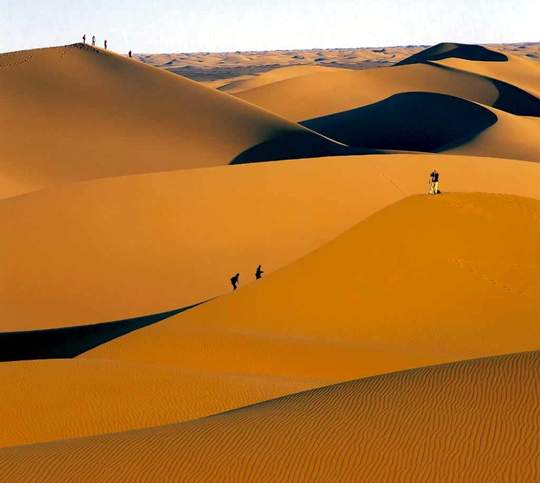
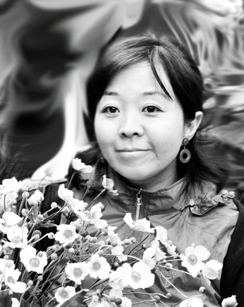
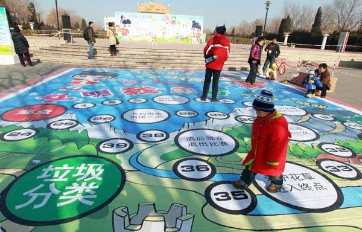

# 对生命的规划

** **

2004年春天，北京的一群企业家来到阿拉善沙漠。踏上沙漠的瞬间，面对自然界无以伦比的庞大力量，他们集体被震撼失语。

眼前是一片无垠的沙漠，此起彼伏的沙丘望不到边。天空蔚蓝，沙石烁金，颜色固然壮丽，但方圆数百里，生命寥寥无几。人类在沙漠面前，显得极端渺小。

阿拉善盟位于内蒙古自治区最西端，沙漠总面积居世界第四位，是中国最大的沙尘暴发源地。2000年中国华北地区9次沙尘天气，有8次缘自阿拉善。阿拉善总人口20余万人，生态的恶化也加剧了农牧民的贫困，大量当地居民由此成为生态难民，被迫背井离乡。

回京的路上，每一位企业家都在思考：如何改善阿拉善地区的生态环境，遏制沙漠化进程，如何保护我们生存于其中的环境，为人类的行为进行反思和弥补。

2004年6月，阿拉善SEE生态协会在北京成立。这是中国近百位企业家发起的，荒漠化防治民间组织。

2008年12月，阿拉善SEE生态协会发起、成立了从事环境保护的非公募基金会——阿拉善SEE基金会，致力于支持中国民间环保组织及其行业发展，可持续地促进解决本土环境问题。

马艳艳于2009年开始进入阿拉善SEE基金会。如今，她是阿拉善SEE基金会的项目官员。

马艳艳生于甘肃兰州，上大学之前，基本没离开过那个城市。

上世纪九十年代中期，马艳艳考上了中央工艺美术学院，学习艺术平面设计。两年后，中央工艺美院并入清华美院，毕业时，马艳艳拿到了一张令人羡慕的清华大学毕业证。

但她并不觉得这有什么值得炫耀的。“事实上我更喜欢中央工艺美院的毕业证。”她言语中带着些许遗憾。

2000年毕业之后，她进入一家台湾的公司，从事广告设计，持续了两年。

“当时台湾的老板觉得大陆人力成本低，所以在大陆招一批设计师，我是直接给老板做一些设计的东西。但因为老板在台湾，在管理上有一些断档，我们老板就老以为我挺闲的。”

事实上那两年确实挺闲。马艳艳天资聪慧，工作效率极高，老板每次发过来一个设计的任务，她总是三两下干完。剩下大把的坐班时间无处打发，只能坐着上网——但其实上网也很无聊。

生性好动坐不住的马艳艳厌恶这样的生活。她感到自己正在浪费生命。

此时公司的行政部和市场部的总监发现马艳艳太闲了，便拉壮丁似的将她拉去，协助一些市场方面的工作，用着用着，觉得：咦，这小姑娘还挺好用的。遂向台湾总部提出申请，要求将马艳艳调任过去。

之后的两年，马艳艳开始了雷厉风行的事业女性生涯。

开始时总免不了囧事连连。

马艳艳一直学的是平面设计，向来使用设计制图软件，从未用过word，excel这些办公软件，所有东西都只会做成图像。

“最好笑的是刚进去时，上面要我做一张表格，我根本不知道应该怎么做，只好动手在纸上画了一张图。结果他们看见全都崩溃了。”马艳艳忆及当年的糗事，乐得不行。

学习艺术出身的马艳艳，对于行政体系，管理和营销思路也都非常陌生。

“当时华硕刚刚进入大陆，处于市场拓展的起步阶段。其实是我们那一拨人打下来的。那拨人都很能干，一个人兼很多工作，但那时因为刚开始学习，就觉得挺有干劲的。而且周围的战友都很拼命。对我来说是一个快速成长的过程。”

马艳艳渐渐懂得了什么叫营销，品牌管理，PR传播。整个思路都明晰起来。加班是不值一提的家常便饭。那一群人，完全是靠死磕硬干，横冲直撞，没有人教，也没有人带。一个任务下来，不管用什么办法，一定要搞定它。

拼了两年，马艳艳他们这一拨人都升职了，坐到主管的位置，开始带新人。马艳艳也在这两年的打拼里获益匪浅，不但熟知了整个市场营销的流程，也在北京买了房，安定下来。

面对熟悉的工作和一成不变的生活，她充沛的干劲再次消失了。

“就像驴子套上磨，一直绕着圈走。已经没有激情和创造性了。你坐在那儿，就能想到未来一两年你的工作状态，你要做什么，怎么做。挺没劲的。而且，这可能跟价值观有关。那时也不是刚毕业的学生了。我开始思考一些和生命有关的事情：到底自己最想干的是什么，人生追求的到底是什么。”

她毅然辞去了工作，开始自由人的生活。

这一段生活持续了很长时间。

那两三年里，她靠接一些设计的工作为生。因为有市场营销方面的工作经验，也会帮朋友做一些活动的策划案。总之吃用不愁。但是在家呆久了觉得难受，又找了份工作，几个月之后再度辞职——因为她发现，自己连工作的热情都丧失了。

她是一个热爱自由和未知世界的人，厌倦朝九晚五流水线式的生活。

之后她与朋友周游东南亚诸国，爱上了那种闲散的生活方式，便开了个网店，出售东南亚的手工艺品。之后又与朋友合伙做生意，或者合作项目。不停地尝试各种工作，其实是一个探路的过程。

她一直在思考，自己活着要一直做下去的事业，到底是什么。

>“因为人往往会陷入到职业规划里，想着我在这个公司，拿到多少薪水，坐到什么职位，然后换到一个什么公司，拿更高的薪水，坐更高的职位。但我觉得，最重要的不是对职业的规划，而是对生命的规划。”

一个极其偶然的机会，马艳艳接触到了阿拉善SEE基金会。

2009年初，马艳艳的一个朋友，看见她整天游手好闲，便怂恿她到自己工作的阿拉善SEE基金会试试。

“他说，我知道一个机构的工作，特别适合你，说不定是最适合你的。我就觉得挺奇怪的：哪有一个工作就最适合我了？没有这样的事。我觉得是不可能的。他就说，我知道你肯定不适合在商业机构工作，你也不适合那种特别没意思的事情，而且你又这么有热情有爱心，这个工作肯定最适合你。我就想，好吧好吧，那就去看看吧。”

马艳艳跟基金会的人见面之后，发现，哎哟，还真挺有意思的。就这样，马艳艳被朋友半蒙半哄地带上了船。

但她当时对这个行业一无所知。此前她只觉得环保公益就是种一棵树，骑自行车这种特别简单时髦的事。

恰逢基金会要举办一个生态保护杰出成就奖，便将这个项目交由马艳艳负责，待她完成之后，再考虑是否真正进入机构工作。

马艳艳抱着尝试的心态接下来，顺便企图从中了解这个行业的状况。她需要负责整个项目的前期策划、筹备、收集候选人、评奖、实施、现场控制以及后期媒体传播的流程。

奇怪的是，马艳艳发现，这个机构，和之前她工作的那些公司文化氛围完全不一样。每天到了工作的地方，会感觉周围的人不是同事关系，而更像是朋友。而且这一群人使用的语言逻辑体系，也与她之前接触到的截然不同。

“以前在公司，一个项目就哗哗哗地分下去，是特别清晰明确的事儿。而在这儿，就算是很小的事，大家也会进行热烈的讨论，引人很多公平、民主之类的普世价值观。这跟当时的秘书长有关，因为他是一名公民社会的倡导者，在他影响之下，整个机构形成了这样的氛围。比如当时在做网站，关于网站要做成绿色，红色还是蓝色的，所有人都互相表态，互相批驳，然后投票。你就会觉得：诶？还有这种事儿？还能这样干？感觉很奇妙。没有人来独断地决定一件事情。这让我感到很刺激，很兴奋。”

生态奖的项目做完之后，马艳艳决定留在基金会，继续做下去。

“环保公益事业并不是你想的那么简单和时髦。它其实是一项艰辛和沉重的事业。因为必须有人一直盯着，不然一条河流就被污染了，或者一个物种就消失了。”马艳艳一脸正色地说。

也是在负责生态奖的项目时，她目睹的各种环保人士所为，使她坚定做下去的决心。

“当时有一个奖项发给了内蒙的一位老人。他所在的牧场附近开了一家造纸厂，造纸厂排出的污水，在草原上形成一个个黑色的水洼。那一片草原全都被污染了，草都是有毒的，羊群不敢过去，因为吃了就会中毒。老人七十多岁了，不会汉语，他自学《草原法》，找人翻译成蒙语，向牧场上的其他牧民宣传，还跑到寺院里，向僧人反复陈述，僧人们很震动，便向前来朝拜的牧民宣传。最后，造纸厂在牧民施加的压力之下，被政府勒令迁走。我们去了那一片草原，老人用手把那些水洼里的黑泥挖出来给我们看，全都是有毒的，臭不可闻。”

当时马艳艳才知道：原来环境是如此脆弱。再好的环境，一瞬间就可以将它摧毁。像这片草原的土地，它已经永远不可能再复原。一片土地被摧毁之后，就永远变成了零。

而污染并未停止。造纸厂在搬迁到另外一个地方之后，又会继续污染到一片新的草地。在这种经济和环境对立的现状之下，生态只会遭受到越来越多的破坏。

而她在正式进入基金会之后，接触到了更多足以撼动她整个生命的人和事。

有一次，她去重庆调查一个环保NGO的情况。这个NGO，只有一名工作人员，而他单枪匹马做了许多事情，而且面临着风险和压力——他会经常投诉一些污染严重的工厂，发起抵制，向媒体曝光，而政府与企业是捆绑在一起的，为了GDP。他们不乐意看到有这样的NGO组织跳出来。那名工作人员带着马艳艳到一个社区，拜访一名污染受害者。

“因为工厂排放污染，他养的鱼都死了。那些污水，小孩把脚泡在里面，皮肉很快就腐烂。他整个身家性命都赔上去了，还是没有解决问题。看到一个普通老百姓的挣扎和不容易，你就会发现这些NGO的价值到底在哪里。”

马艳艳的神色凝重，声音渐渐低了下来。

同行们的快乐和简单，最初令她觉得不可思议。但渐渐地，她越来越接近于他们。

“进入这个行业之后，你才发现，哇塞，还有这样一群人，这么辛苦，什么条件都没有，而且跟自己一点儿关系都没有，还能做成这样。而且你不知道他们为什么能这么快乐。你就觉得，他们太牛了。你就想和他们在一起。”马艳艳无法掩盖内心对同行们的敬佩。

她在基金会，工作条件相对要好很多。而地方上的那些NGO组织，无一不是在苦苦求生存。大多数NGO的工作人员，工资低得令人无法想象，而即使是这样的薪资，组织也常常发不出钱来。

“很多做环保NGO的男孩女孩，都找不到女朋友男朋友。因为工资实在是太低了，很多人月薪不足一千元，根本买不起房子，谁会想跟你在一起？而且很多人都不理解，这工作工资这么低，你怎么还这么心急上火？包括他们的父母，都不理解，觉得自己的孩子是在做坏事，因为常常跟政府唱反调。这群人，做了那么多事情，收入那么低，还被主流社会边缘化，我真的很难过。”

她做过一个培养大学生环保意识的项目，是基金会拨款，让大学生设计与推行一些环保项目。许多大学生设计的项目不成熟，有的甚至半途而废，一些完成的项目，效果也不尽人意。但在这个过程中，马艳艳遇到了最令自己有成就感的一件事。

“一个东北的男生，当时做项目的时候，每天给我打电话请教，一打就是两三个小时。我当时想，不是挺简单的么，哪来那么多问题啊。费了很大劲。后来项目完成了，男生给我发来一封邮件，说老师我快毕业了。这个项目对我影响很大。他是学工科的，父母给他找了一个工程师的工作，但是他不想去，他想尝试做环保公益类的工作。我说，做NGO待遇很低的。他说我知道，但我还是想选择做自己想做的事。那一瞬间我领悟到，原来那些项目成熟与否并不重要，重要的是，你影响了他们的人生。”

这些年，她一直没有存下钱，物欲也降到最低。但她已经是幸运的，因为很多人甚至要倒贴钱。说到自己做的第一个项目，生态奖，她说，这个奖对于做环保公益的人来说意义重大。因为除了精神支持，更重要的是有奖金。几万元对于普通人来说，并不算什么，也许一次出国旅行就没了，但是对于那些NGO而言，几万块钱，也许就能让他们多坚持一年。

而她在三年的工作之后，也形成了职业病，比如过年回家，一定要和当地的NGO组织见面，或者去旅行，看见一条河，就开始寻找它的污染源，谴责开大排量车的朋友……在她眼里，即使是最微小的事情，也能延缓对环境的伤害。

“我会一直在这个行业里做下去。其实想让环境变好，几乎是不可能的了。我们就只是在补枪眼。这儿有了个枪眼，赶紧补上，那儿有了个枪眼，又赶紧扑过去。我们只能尽量让环境不要恶化得太快。”

说出这句话的时候，马艳艳的脸上充满了无奈。

 

（采编：应宁康；责编：陈锴）

 
