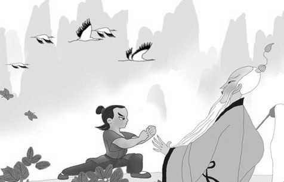

# 寻仙

古时候的人，认为昆仑山是最高的山。一是因为远离中原，没有什么人亲眼去见过。二是因为山脉长而险要，修不了山道，没人登过顶。久而久之，昆仑山就成了一座神山，天宫之下殿。走丝绸之路的商人，常说自己卖的玉石便是昆仑山上采下的，沾了龙脉。或是西域带回的珠宝，巧遇了昆仑山的仙人，给开了光。

至于昆仑山上究竟有什么神仙，有人说是西王母，有人说是太乙真人。也有说姜子牙、女娲、精卫等等，总之厉害的神话人物，要是不去昆仑山住一住，就显得修行不够。实际上，要是这么多神仙住在一起是十分吓人的，西王母的桃子要一万年才一熟，太乙真人每天和鬼打交道，女娲是个半蛇人。但是大家并没有觉得这样不好，老太太在吓唬不听话的孙子的时候，会说让夜叉把他抓进地府里去，或者龙宫里去，绝不会抓去昆仑山顶或是天庭里。孙悟空进了天庭以后，被勾刀穿了琵琶骨（拿钩子从锁骨上边打穿），十八般兵器剁脑袋，火刑电刑，最后被扔在高压锅里要炼成丹药，残忍程度远超黑白无常虾兵蟹将，即使这样，老太太和小孩子还是觉得天上住的都是好人，好神仙，可见在古时候，凡是天上的东西，就带着天生的政治正确。

我要说的故事，就是一个好人，进一座神山，寻找一个仙人的故事。听上去这样的故事真是无趣，我也知道。如果是一个贼人，进一座荒山，猎取一个女人，那就有意思的多，叫人心花怒放，我也更乐意写。但反正是故事，读或者写，总比刷人人网要有趣的多。

一

离沉香独自离开家里已经一年了，也就是说，离他被夜叉送到刘巡抚的府上，已经过去十七年了。夜叉长什么样，沉香不太记得，但总之是面恶心善。据刘巡抚，也就是沉香的生父说，夜叉为了不吓着他，半夜里送来小沉香时还试着化作了猎户的样子。手持钢叉是没错，但是这世上并没有长角的猎户，所以刘巡抚一下就猜出它怀里抱的那孩子是谁了。进京赶考，庙里乱搞，和二郎神之妹三圣姑整出来的。

千谢万谢，姓刘的考取了功名做了官，突然有了一个没娘的孩子，比一般人家要好办的多。假如仍旧是当初华山庙里的书生，刘向和沉香的日子就会很不好过，街口卖烤苞米的黄老太太瞎嚼舌头，说刘家出野种，也就不能像现在一样抓进府里，打她板子。顶多只能以后再也不吃烤苞米，改去东街市吃刀削面。

沉香的爹待他非常好，但是讲话总要用敬语。因为他觉得自己是凡人，孩子的娘是仙，那沉香就是个半仙。人和半仙住在一起，最好还是客气一点，即使是对自己儿子。也可能是因为沉香五岁的时候就能把石凳举起来玩。可当初他和三圣姑调情的时候也没有用敬语呀，可见古人对男仙女仙的态度是大不相同。

二

花了一年时间，赶到了昆仑山脚。从山脚到半山，每隔十步就有一个道观，每个道观门口都有十个摆摊算命的道士，可以看手相、面相、八字、卜签、占星、紫薇命盘。做一项二十文，做全套五两，也可以一个看手一个看脸双飞。

过了半山，就没有路了，本来有一些采药人走出来的小道，但是沉香去的时候刚过了夏天，草木都疯长至齐腰高，原先的道几乎看不清了。山势又陡峭，经常得手脚并用，走着走着，就发现自己在密林里辨不清方向了。只能披荆斩棘往地势高的地方爬。时至傍晚，出了密林，到了一个平坡，望见远处有一古亭，缺了半边顶，待遇不比刘巡抚当年，不过好歹能凑合躺一躺。

行至近前，发现亭里已经有一少年，正坐着生火。沉香走上前去，口里唱个诺，作个揖，道：上仙万寿，晚生刘氏，远道至此，愿听赐教。

那人专心拨弄火堆，也不抬头，说：你瞎逼逼啥呢，过来坐吧。　

三

火苗跳动了几下，升起来了。少年看看沉香，说：我姓李叫哪吒，你哪儿来的啊？

古往今来，哪吒在书里的形象都是玉面少年。西游记里是怎么说的呢，龙种自然非俗相，妙龄端不类尘凡。也就是说，长的和一般人不一样，一般人长不成那样。

沉香说，小弟打扬州来的。敢问这位兄弟，打哪儿来，去何处？

哪吒摆摆手，就在这山上，学了几年本领，今天出师了，正好下山去。说着把手伸进怀里掏出一个烟袋来递过去，来，这个烟你尝尝。

沉香就着火抽了一口，一下觉得精神一振。赶忙站起来，躬身道：此烟果不是凡物！定元神，通七窍，应是百炼的丹药，谢过上仙！

哪吒哈哈大笑，说：你这人，咋咋呼呼的，坐下说成么。坐下坐下，这是西方天竺国走丝绸路的商人带来的大麻烟，我打师父那儿偷的。那些贩货的，有时候也上来，问我师父求几味丹药治治内病外伤。

沉香问，那敢问兄弟的师长，姓甚名谁？

哪吒答，没姓，就叫太乙真人。

四

沉香大惊，说，晚生知道知道，太乙真人是元始天尊门下的天官，法力无边，想必是住在这昆仑山上云雾中的极高处，兄弟却说今天刚从师门下来，莫不是诳我？

哪吒摇摇头抽了一口麻烟说，以前是在那山顶上，但是商人上不来，换不了柴火布匹大麻，就在下面又盖了个新的玉虚观，你明天一早沿这里往上走，走两个时辰就到了。

沉香似信非信的点点头，又问：那请问哪吒兄弟修炼了些什么仙术，下山又有什么打算？

哪吒听到这个兴致大涨，高声说：这次下山便是要杀了我爹！

沉香大惊失色：兄弟莫不是又诳我？这又是为何？弑亲是要下十八层地狱的！

哪吒说，正是这个理，我刚打娘胎里出来的时候，是个肉球，我爹举剑就劈我。龙王三太子敖丙危害乡间，欺男霸女，我把他捆了，抽了他原形的筋。龙宫里怪罪下来，我爹又说我忤逆。

沉香说，即便如此，身体发肤，受之父母。天恩地德，不应以怨相报啊。

哪吒冷笑，可不是嘛，父精母血。所以龙王要向乡里发兵的时候，我削骨还父，割肉还母，然后自刎偿命。不想我那父亲，认定我是祸害，用他那舍利宝塔镇住我的魂魄，使我不能安宁。于是我借莲花化身，借莲藕还形，修炼本领，报仇雪恨。

沉香一时哑然，不知该说什么。

哪吒扒拉了一下逐渐变暗的火堆，开口打破沉默：那兄弟，听说话像个读书人家里出来的。你又是为啥要拜师学艺？

沉香说，跟父亲读过一点书。杨二郎的妹妹，三圣姑是我的生母，因为私通凡人，被压在桃山之下。家父是读书人出身，性讷怕事。小弟从小有些过人的力气，想要学些本事，劈开那山，救出我娘，一家团圆。

哪吒挠挠头，说，哦，这回事，那你明天径直去找我师父吧，没问题。

沉香将身子探前，问：奇怪，听说这仙人收徒，不是要看造化缘分慧根，十分困难吗，兄弟怎么知道一定收我？

哪吒十分不耐烦，答，是你命数，没啥好多问。

沉香更困惑了，命数这一说，又是怎么回事？

哪吒说，天宫里的事，有很多门道，反正你也别多操心了，你娘也是仙人，不会真把她关在大山下的。就算关了，也是走个形式，好吃好喝伺候着呢。

沉香有些不高兴，说，兄弟，你可是站着说话不腰疼，我娘好歹已经受苦十七年，你怎么就凭空诳我？

哪吒又哈哈一笑，说，你这小兄弟忒实诚，天上一日地下一年听过吗，你娘要关也就才十多天，行政拘留的水平。哪吒又盘起腿来道：我就告诉你吧，你这故事我一听就明白了。你是半仙之躯，不是在凡间呆着的命，但你又是和凡人私通的种，你娘家要封你为仙，面子上过不去。搬一座山让你来一出劈山救母，成就一番美名，也好顺着这个给你封个仙，这才皆大欢喜。好了，时辰不早，歇着吧。

六

翌日沉香醒来，哪吒已经下山去了。沿着他指的方向行了两个半时辰，果然在山林里出现了一个挂着“玉虚观”木匾的建筑。从墙内升起阵阵青烟，有一股草药的清香。沉香上去拍了拍大门，然后退后三步恭立着。

不多会儿，门开了一半，一个微胖穿马褂的老头探出半个身子，一边摇蒲扇一边用小眼睛打量沉香。沉香犹豫了一下，问，请问太乙天官在观内吗？

老头说，你找他什么事儿？

沉香把自己的身世，拜师的缘由，以及遇见哪吒的事情简单说了一遍。

老头眉开眼笑，说，哦，我知道你，太白老头跟我说过。对了贫道就是太乙，进来吧。

沉香大惊，赶忙跪下说，晚生目力不济，大仙收我为徒吧！然后连连磕头。

老头一边把门打开一边说，你们中原人真是一套一套的，难怪李哪吒不爱跟你多聊，你就进来吧。

沉香进了观里，闻见空气中的香气，问，这股异香，不知是什么仙草？

太乙真人一边走一边说，楼兰国商人带来的香料，叫孜然。早上去菜园捉了几只田鼠，正好中午了，烤来一块吃吧。

七

沉香在观里呆了几日，每天只是耕地打水捉田鼠，并不见师父有要传他本领的意思。终于忍不住找到太乙真人，问他：师父，什么时候才能传我道法啊？

老头一拍脑袋，哦，给忘了。你想学什么？要不先教个三十六变化？

沉香说，我想学能劈山破石的本领，好救出我娘。

老头说，这世上没有直接劈山的法术，就像哪吒一开始也问我学杀他爹的法术。年轻人总是心急，要劈山法要杀爹法，法术没有那么方便，要知道这世界上连捉老鼠的法术也没有，不然修道术的还要手脚干什么，念念咒就行了。

沉香觉得很失望，问，那哪吒师兄后来学了什么？

老头挠挠肚子，说：打架的本领没少学。很早以前我还在云游的时候，就在朝歌城碰见过他，在街上晃悠，偷点心吃，哪个野孩子都打不过他。我看出他不是凡胎，就指点他修炼筋骨。后来惹事生非，我就将他的魂魄引来复了生，教他使金缨枪，耍浑天绫，踩风火轮，舞金刚圈，那会儿道观里每天整的和杂技团一样。前段时间他觉得自己学明白了，就下山了。

沉香说，那他究竟能打的过李天王吗？

老头不知从哪儿摸出一个道士帽子戴上，说，都是命数，我先教你练一个举千斤重物的法术吧。

尾声

沉香在玉虚观待了两年零七月，觉得功夫已成，便向太乙真人道别。临行前，他问太乙真人：师父，我与哪吒师兄，一个想要救母，一个想要弑父，应该水火不容，为什么师父对我们一视同仁，教一样的本领？

老头还是往日懒散的模样，说，哪吒杀性重，但是心中有正道，将来定杀尽天下不义之人。你性子慢，认死理，但心中也是正道，将来这份孝心定传遍街巷，感化世人。我们修道的人，总是度鬼，若是能度人，岂不更好？

沉香点点头，又问，那哪吒师兄说我去救我娘都是天庭安排好的命数，也是真的吗？

老头说，命数归命数，但是行义尽孝都是你们自己走出来的路，你去就是了。

说着拿出了一把旧斧子，对了，这柄萱花开山神斧送给你了。

沉香大笑，师父又诳我，这是我平时劈柴的斧头。

太乙真人叹气道，到底还是傻，我的三昧真火天天躺在丹炉里烧着，取之不竭，你都没想过叫你天天劈柴点火是为了把这斧子顺顺手。

说罢关上了门。再看那昆仑山，有道是：变化奇巧，立云霄。看山峰重重叠绕，又只见梅花鹿半山逍遥，见白鹤展翅飞高，猛低头又只见海水滔滔。蒙师尊点化脱凡得道，俺今日救母行孝，此一去地动山摇。

(采编：朱燚；责编：刘铮)