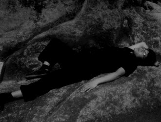
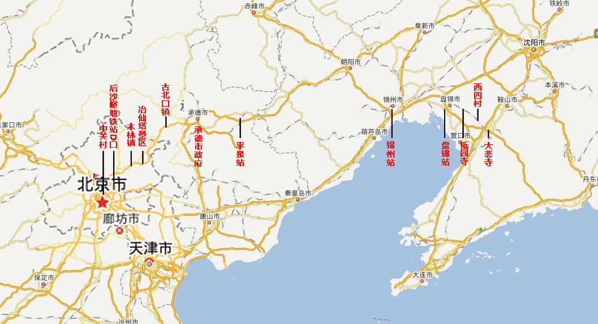

# 小东游记

八月底决意由北京徒步至辽宁海城大悲寺，预计实际全程1500-2000华里。

9.2

拜别太极老师，行李由三包精简至两包，粗合比丘“三衣一钵”之装备。银行卡、手机置朋友处，仅带身份证与回程票钱（一路未动），获赠甩棍一根。

9.3

晨食油条四根，豆腐脑一碗，蒙馈油条五根，别于中关村。

不择通逵仄径，观日影东北折行。路遇一电动三轮扎带，助推数公里至修车处。

正午逢麦当劳，入内小憩。音乐单曲循环，心猿难摄；复前行，默念《授秘歌》，渐清明。

黄昏腹馁，乞食于道旁小店，不许；又试，不许；三试，得无羊肉之羊肉烩面一碗。再拜谢而去。

河畔趺坐休息，三少年欲劫财。慑之，径去。

投宿寿衣店，不许；足疗店，不许；保安室，不许；问路觅得肯德基，零点为逐出。时足痛已剧，挣扎逡巡，见银行自助取款机，盘腿坐墙角，裹以一毯。

是日行冤枉路甚多，仅至地铁后沙峪站。

9.4

晨有提款者，无不骇异。乃归肯德基，食油条两根，补觉一小时。

路见一中年汉子舞粗铁链长约二丈，梢系尼龙绳，作金龙鞭使。声如炸雷，远近得闻。驻观良久。

午乞得无牛肉之牛肉拉面一碗。

足痛逾厉，折枝为杖。后为作歌曰“欲拄青山裂，揭竿鼎我足。俯仰笑为何，不答只说‘笃’。”（云杖身前后俯仰，如捧腹自乐者）

晚乞三家而得米饭一碗，咸菜一碟。

投宿中石化加油站，不许；中石油加油站，不许；废品站，不许；公厕，关门；至木林镇卫生院，似夜间亦关门，乃蹑足潜入，趺坐厕所洗手台，夤夜方出，眠于长凳。

9.5

晨乞食早餐摊，皆不许。终得馒首两枚。馒首压扁入库，食前日之油条。

午乞食，前二家不许。见一“胖哥拉面”点，意店主必豪爽大汉也，乃入。中年妇也，为煮面一海碗，有肉丁。食毕于店内打杂一小时，唏嘘店主家事，略为解愁颜。

临别谓更北皆山路难行，当南下数里，取道通县。拜谢，北行不顾。

入密云县城。

麦当劳挑破脚泡。

出密云县城。

路旁有冶仙塔旅游区，遥见菩萨像，思量夜宿庙宇，乃上山，喜无门票。

见僧寮，于楼道下拖曳废弃垫子铺地，趺坐洋洋，正欲取旁废弃蚊帐支起，四五僧人谈空说有而至，见余哗然，胁以报警。

将去，有肥瘠二僧不忍，告余寺庙乃公司所管，渠亦做主不得。瘠僧问余是居士否。自忖居士者，信佛而未出家人也；余毕竟少读佛典，颇守清规，遽然说是。

“汝有居士证否？”

“……”

“有居士证者交大洋二十，可安排住宿。”

“……”

肥僧昂昂然自谓出家前亦曾参军，亦曾为一大僚——未尝见胆大如我者也。令瘠僧将手中半角饼子递将来吃，复颤巍巍回屋取鲜核桃、苹果一大袋相馈。却之不恭也——盖核桃高热量高蛋白，日后可救命。更欲赠手中龙头拐杖以易我树枝，辞之。

二僧合计半晌，谓东行无宿处，令余回密云县城觅一公厕。应之，下山。

旁有新楼十余栋，未住人也。趁夜色入。

于二楼电梯处关门闭窗围得一小居，铺毯于地，三层衣物一并穿着。掌劈核桃而食，味极甘美。

闻楼下有异响，揪心检视，门上塑料纸未撕净，风吹作声，阴怖不堪。摸黑清理数记，莞尔自笑沦为何物耶。岸然掉臂归卧。戏吟曰“菩萨逐我出，小鬼揖我入。咄咄聊食梨与栗。”

9.6

夜中冻醒数回。天明食馒首苹果上路。

午乞食，店主递余烟，自入厨，俄顷出炒饭一盆，鸡肉一碗。席间论水浒，咨嗟不已。暗告自苦隐疾，乃授其摄生法门。

入山。路牌警示有塌方、有“小动物出没”。寻思只无大动物出没便好，遇一镰刀老妪而询之。云有狼也——近年未闻；有蛇也——无毒；好缠人也——前日方缠死一人。

镰刀妪见余性志诚且似有宿慧者，侧首睨余“子亦颇闻灭退保乎？”

“唯唯，余长逾其里以观圣化，文治武功，殊胜云尔。”

妪乃大觉知音，挥镰极论世事，临别赠余方便面二包、馒首四枚。

沿途有售“红酥香梨”者，遍山皆是，裹以牛皮纸挂于梢头。垂涎良久，终以足疾未愈恨罢。

天渐暮，十余里始一村落，数分钟始一车辆，乃忧夜宿何处。

一车候于路旁，司机出外。问路。司机发车徐徐跟上，问余宁可共载不。

告余特意停车相待也，少年时亦曾徒步。相谈甚欢。倏尔至古北口镇停车，谓此古长城遗址也，大有可观玩处。赠余五台山降龙木佛珠一串以驱邪，矿泉水一瓶。

折入镇，隔门谒杨令公庙、关帝庙、财神庙、药王庙（均要票也）。镇依山而建，松鼠不避人，肥硕如球，满地乱蹦。

归镇口，觅得银行取款机，是夜有着落处，安然趺坐于路旁长凳待日落。

一金毛犬上前亲近，女主人见云“看上汝馒首矣。”乃与谈，邀宿家中。

男主人归，烹肉款待。问余饮酒否。乃陪叔饮啤酒，陪阿姨饮白酒。剧谈竟夕。

9.7

晨为炒饼，煮鸡子五枚，赠余防潮垫一副、介绍古北口文史资料一部，叔曾参与撰稿也。辞去。

郁郁苍苍，吟曰“燕山立弗化，历代修翻新。谁肯信此物，防不住胡尘。”

过河北界，逢骑行驴友一，自言适环渤海徒步结束。

午食鸡子、馒首。

一老丈慨然借余脚踏三轮助力，遂载渠骑行。

老丈悠然问，“吾三轮快否？”

“快也，世尊。”

“较汝脚力快否？”

“快也，世尊。”

“咄。汝自苦何为也？若夫日出而作，日入而息，帝力于我何有哉？”

“是也，世尊。”

“汝何往？”

“辽宁也，世尊。”

“辽宁——有麦子也。”

“……”

“吾今岁七十五了也。”

“……”

“山外打仗，汝记得否？”

“否也，世尊。”

“彼时吾八岁也。”

“……”

下午有出租、摩托各来问讯，捎带一程。司机同伴揶揄此行徒劳无益，何不坐车前往。司机代答曰：“齐天大圣一个筋斗云即可取经归来，三藏更何苦行脚十余年？”

问路时为人所辱。

路旁见极小红果不知名，貌似无毒，采撷一二食下，甚酸甜。

是日依旧山路，黄昏入山村问宿人家，不许。出门遇一青年跨摩托问清缘由，引至家门，出馒首花卷共四枚，大葱两根。云前行数里有毛坯房数间无人，可将就一夜也。拜谢而去。

房二层，共十间，皆无窗，地有红砖沙子木方铁钉若干。山风呼啸，暮色哀凄。警斥鬼物无得相戏，猛啖一番，曳一薄门板铺防潮垫卧下。

9.8

启予手，启予足，诧乎未死。

过午不见饭庄，问农舍乞得饼子一张。食毕见安徽牛肉板面店，未饱，复入乞。面一碗。

邻座一汉子见余蓬垢踽行，留联系方式，云在承德若有难可求助。复有一司机要鸡脖两根卤蛋一枚塞入余碗中。

又一骑行驴友追及，云一路闻听司机议论有徒步者，赶来拜会。赠巧克力两块。

是日欲入承德市区，行逾百里，然暮色已降，问宿加油站，得无门仓库一隅。后言谈熟络，晋至配电间。

老者外出晚餐，为带回馒首四枚，后院拔葱两棵，蘸大酱食。

9.9

入承德，沿武烈河北上——又一番冤枉路也，101国道向承德虚晃一枪，毕竟东流去。翌日上午才行回此地。

避暑山庄及周边寺庙均要门票，未去。拟于承德休整一日。

中午逢一汉子自称研学周易，恭聆渠扯淡半晌，蹭烟抽也。

乞食，第二家出米饭一碗、豆腐一方、大乱炖一盆。罄尽。谈良久。

书店觅地图校对路线，趺坐读书若干本。诗词栏有承德“乡贤”作品集数种，中有一农民女诗人傅桂香者，于冷嘲热讽中坚持创作终生，虽功夫有限，然时见血性语，铅字微细，足动情怀也。记之。

夜宿肯德基，灌水时抬首偶视镜中，已黝黑不自识矣。

9.10

晨乞馒首两枚，折回101。

午乞得炒饼一盘。

黄昏将入平泉县城，遇搭乘者。后作《侠客行》拟赠之，又自删掉。聊录半首，“布施如有畏，应物失中年。相逢聊助力，视镜自谈玄。生死闻可了，吁嗟某界天。缠缚云无情，较然证侠禅。”

兄谓不日天寒，径为余订平泉至锦州转盘锦火车票。初力拒，兄云“汝未见我时，便走将去；见得我时，便不须走将去。”奇其言，乃从之。

招待晚饭，夜为余订旅馆。

9.11

招待早饭，赠饼一大包，送至火车站。

9.12

凌晨至盘锦。大雨，为火车站逐出。瞬已湿透。

蜷檐下角落，运内功护体。

皮条婆娘殷勤招揽生意，笑应曰无钱也。

雨停，东行，宿医院。

晨起东行，又雨。檐下。雨停，东行。

午乞得米饭一碗炒鸡子一盘。

黄昏至祇园寺，投宿。方丈正屋内看电视，昏聩而出，拒。寺内塑菩萨之民工出白日所窃之供果赠余。

一路问宿，皆不许。道旁水田，多有捕蟹者。路见死蛇蛙猫狗鸟无数。

日落。312省道无路灯，握甩棍于掌中，夜行。

仍问宿，仍不许，仍夜行。

常连数分钟无来往之车灯，如前数日山路常连数分钟无来往之车声。目中唯星光数点矣。路有积雨，直觉避之而行。

初尚畏惧，后亦渐开释。

过三岔河大桥，夤夜至西四村，求宿派出所不许，露宿门外。

9.13

冻起，前行。

一路野花烂漫，侧聆过往孩童口操东北腔，煞是可爱。心亦澄澄如赤子矣。

素有拳癖，见树叶往往信手击打。道旁垂柳参差，欲出手竟如为某大力所掣肘，举动不得。安详如是。

午，镰刀妪所赠方便面两包尚在，食罄。下午抵大悲寺。

诗云：

真经无一字，小劫应三秋。衣钵容持负，扶桑失壮游。头陀唯正法，业力谏狂流。已有禅和子，清欢证《十牛》。

又：壬辰東游歌

三衣一缽陋如是，自敕游於是乎始。聞關東有海城大悲寺，日中一食循佛制，興於丑時息於癸，威儀三千具足備，獨不設功德箱以收人事。我不求金世我鄙，摩腹斯曹正我類。吃飯艱難今誰述，朝蒙宴别夕則乞。油條炸黃金，安足惠嘉客。饅首猶不豫，聊施既問及。麵固無肉幸大碗，時貽院畦莖蔥助咽力。況燕趙古稱多義士，檢身何有即相饋。烹羊宰牛絕非虞，主客軒眉俱不醉。甚或鄰桌偶側目，輒呼店家快撈腥葷沸。與彼少年無次堆，老子賬上直須記。更有民工操南音，來敷菩薩面上金。新拜佛前偷供果，自不捨食傾交我。愧茲敢呻痛且酷，道旁揭竿鼎我足。兒童遙見故奇奇，耆老無齒寧妨嗤。野芳色異漫獨賞，秘不容私即復忘。燕山假我道，遺我燕山夢。不聞胡騎鳴，但見碧自重。汝重我塵塵，破臆一時慟。三咷復三笑，燕山未纖動。沈默高歌親蒼黃，文明倏忽換城鄉。生無外事安居好，世有其人繩武長。心識日以弱，精神日以強。精神無末法，青山日夕陽。過人檐下逾尺廣，貪程不宿悔已罔。潑血迴光返稻田，大槐颯颯道兩邊。路燈斷絕車燈稀，促織星光議合圍。法我叵暫執，執之遽已失。神廟人家棲不得，鬼屋堪入團團揖。窗未封成張巨口，肯綮蛛網結星斗。避風無計須避雨，兼避山靈麾下無明之走獸。跏趺坐鎮鬼屋角，外應飛廉鼓橐鑰。夜半噓僵強立起，何以暖身思橫槊。晨醒啓手及有足，詫哉未死必後福。日出東方滄涼涼，拄拐做聲仍篤篤。小城將息誤看鏡，失笑此物活無憑。緇衣未如面頰黑，精悍色成皮骨剩。因念數載渴茲役，今實知樂魚水適。達者多言山有虎，何意掌下格斃立。兩踝雖隆尚可曳，九地其夐會當遂。中流不須更擊楫，踔厲人生如此水。是逍遙遊，君其行矣。稽首悲風，蕭然佛子。逍遙莫辨，君其行止。向未始游，於是乎始。

（采编：杨松子；责编：刘铮）
