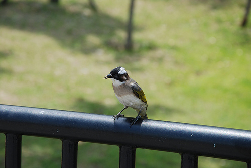
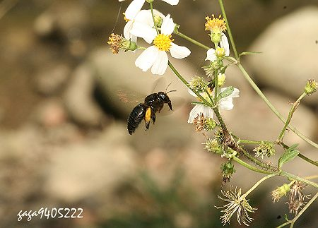
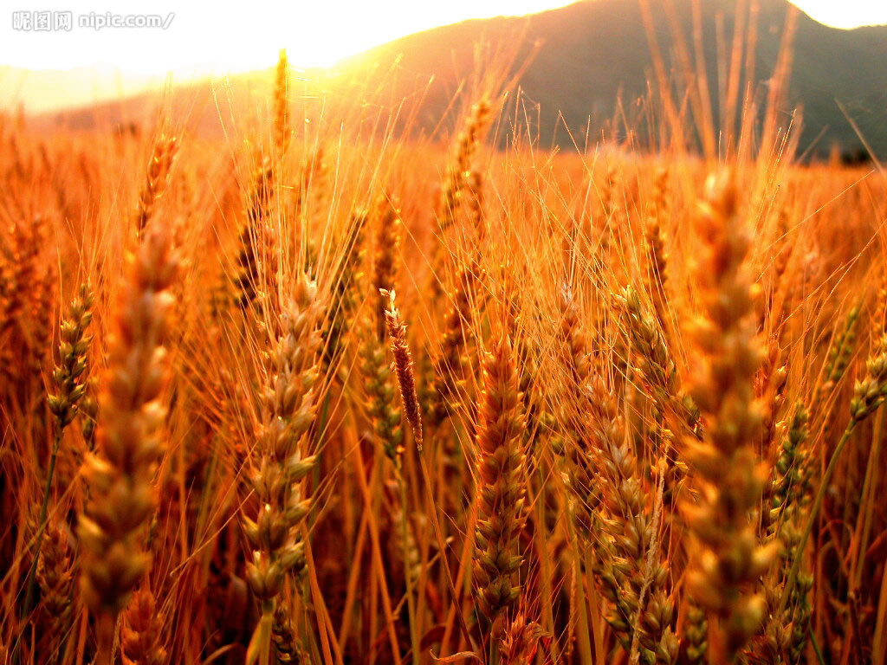
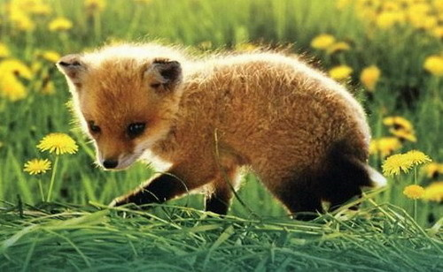

# 小兽星球

** **

**一。** 有一天傍晚在河边，停了车子坐在草地上看落日。 离我不远的栏杆上站着一只莫名的鸟儿，唧唧啾啾鸣叫得十分开心。 不知道是因为太安静，还是因为这只鸟儿叫得太欢喜，除了从水面徐徐刮来的金色的风，好像天地之间就剩下这鸟儿叫得没完没了。先是些简单的短促的小尖叫，接着是婉转而悠长的一连串，到后来，我不得不新奇地转过脸来，默默地看这自顾自歌唱不已的小艺术家。 

它是不理我的。当然，艺术家嘛，一点清高还是要的。我忽然就觉得不能说它在“叫”，怎么能说是叫呢，你什么时候去听演唱会的时候说周杰伦叫得真好听了呢，当然是在唱。 但是它时而短促时而婉转的各种变幻，又很让我叹服，何止是在唱，介根本就是rap啊，那是说与唱的结合体啊，是高级而时髦的艺术门类了。 就在我简直要为它起立鼓掌的时候，它停歇下来，默默地不做声了。接着，在离草地不远的树林里，响起另一只鸟儿的歌声。一句短一句长，一句短促一句悠扬，听不清晰个中婉转，却总是加上一个优美而响亮的结尾。听声音，那鸟儿显然和我面前的小艺术家是同类了。 于是两个相隔两地的小艺术家，说不好是传情呢还是比赛呢，总之，你一句我一句，片刻不闲的扛上了。我静静的听着它们，想象它们或许也在说些茶余饭后的闲聊，或者乃是阳春白雪的论道。 我觉得，这可能也算诗歌。因为每一字每一句，我不能懂，却觉得那么美丽。  **二。**

春天快结束的时候，有只蜜蜂在我家的窗户上打了一个洞。 一开始我并不知情。只是某一天很莫名地看到窗户下的桌子上多了许多莫明的小粉末。正好是汉堡飞花飘柳的季节，我只当是一堆花粉搁浅在我家了，抹都懒得抹。 然后某一天，就很舒服地躺在窗户下的小沙发，哗啦哗啦地翻着报。然后就听到“嗡嗡——嘭！嗡嗡——嘭！”的声音不停地在耳边响起。好吧，一听就知道又是某只白长那么大眼睛从来不认真看路的蜜蜂或者苍蝇在制造自杀式恐怖袭击了。于是就懒洋洋地站起身来打算放它条生路。  结果，就正好看见那个在窗户上早撞得鼻青脸肿的黄条蜜蜂颤巍巍地钻进窗棂上的一个小洞里去了！我立时就呆掉了，还带这种不声不响搬来和我同居 的？！再定睛一瞧，那窗棂上的小洞正对着我桌子上一堆小粉末，原来这是一堆被它们挖掘出来的土壤啊。还在我兀自盯着小洞发愣的过程中，两只小蜜蜂手拉手， 从小洞里又出来了，坚决无视我满是惊叹号的一张老脸，华丽地一扭身，就出门逛街去了。 剩下我满脸黑线地盯着这个洞洞。 网络是个好东西啊，往google里噼里啪啦地一找，果然就锁定了这个叫做木蜂（好似又叫泥蜂）的家伙。网页上说，它们有着非同寻常的打洞技术，喜好门槛窗棂等地栖居，但很少群居，恪守一夫一妻制，打洞是为筑巢产卵，它们的生命在产卵后也即将终止，享年大约三到四个星期。 三到四个星期。我默默地想，人的一生在各种虚度中所耗费的，也远远不止这个数吧。难怪它们可以用一夜即打造自己的家园，因为它们只有一个月过完自己的一生。 于是我决定免房租，让它们来同居了。每天睡眼惺忪地起床，头件事还得给它们开窗，免得它俩又疯狂地对着玻璃进行自杀性袭击。除此之外倒是别无它烦，偶尔在窗下读报上网，听见它们在窗边各种嗡嗡各种砰砰，也会觉得忽然就有点同居密友的小乐趣。 春天是哪天结束的？夏天又是从哪天正式到来的？ 我不知道。只是忽然有一天，我的窗户安静了，它们一声不吭地走了，好像它们一声不吭地来。 在我抬头低头的几个小瞬间里，两只小蜜蜂，过完了它们的一生。我偶尔也会很无厘头地想，如果它们的世界也有墓碑，它们的墓碑上，会否刻着一行浅浅的蜜蜂文：终其一生，与一和平而懒惰的雌性人类同居。 那只雌性人类有点想念它们。但她更想知道，哪一天会和蜜蜂宝宝们见面，对它们说：嗨，我是你爸妈的邻居。  **三。** 我在船上看完了一个影片，《狐狸和孩子》。 我喜欢那个长着浅浅雀斑的小女孩。我喜欢那片狭长而神秘的森林。当然我最喜欢的，那个有着水灵灵一对大眼睛的小狐狸。 “你看，看到那边的麦田了吗？我不吃面包，麦子对我来说一点意义也没有。麦田无法让我产生联想，这实在很可悲。 “但是，你有一头金黄色的头发，如果你驯养我，那该会有多么美好啊！金黄色麦子会让我想起你，我也会喜欢听风在麦穗间吹拂的声音。” 看《小王子》的时候，很多很多次的被那只小狐狸的话打动。它没有说爱我，没有说拥有我，它说驯养我。耗年月在我身边，费心思在我生命，然后，让这世界，因为你的存在，而对我不同。影片里的小女孩，像践行小王子的现实版一样，用尽了耐心与爱心，直到赢得小狐狸完全的信赖。 如果影片可以终结在她和小狐狸彼此依偎着默默守望大森林的一幕该多好呢。 可是即使是小孩，也都拥有人类的天性。那种想要将美丽拥为己有的徒劳努力最终伤害了小狐狸。当它的伤口愈合，它眼神中的戒备和冷淡，宣告对她的信任消失。 有太多的美丽是因为不可被拥有而存在的，好像狐狸眼中明媚而野性的光。 如果真正欣赏的是那片麦田的颜色，又何苦想要颗颗粒粒的将麦田斩伐一空呢？ 

很爱你，更爱有你存在的世界。  **四。** 几年前，在北京，我去看望一位亲戚叔叔。 叔叔家的小弟弟刚六岁。看见我，激动得好像看见个同龄小朋友一样，拿出了所有的玩具，DVD，小人书，拉着婶婶的手让她放《狮子王》给我们看。 他眼神里各种激动的小闪光让我读出他的孤独。 在北京最美好的地段，他的爸妈用尽所有努力换取这套住房。他们几乎没有时间陪他，邻里都是见面不打招呼的陌生人，又不敢让他一个人出去玩，幼儿园的小朋友家住在城市的各个角落，到了假日，他就和他所有的小玩具小人书《狮子王》在家里一天一天的度过。小区里是一模一样森森严严的高楼，每个高楼被精打细算分成了无数的小格子，每个小格子里，或许都锁着一个眼神清澈而孤单的小孩子。 孤单到拉着大他一大圈的我，都好像是找到了新朋友。 

我跟他讲我的老家。我跟他讲蝴蝶花，讲玉米穗，讲长着毛毛一身刺的小菜瓜。他不可思议的睁大眼睛，听的屏气凝神。 窗外是灯火辉煌的钢铁森林。 我亲爱的小弟弟，今年你都该十岁了吧。我真想拉着你再讲讲这里唱rap的鸟儿，讲讲住在我窗户上的蜜蜂，讲讲有小狐狸出没的森林。我真想带着你 去看有鱼儿跳跃的湖面，有小鹿闯进的花园，有小刺猬散步的路边。我想让你爬高高的樱桃树，盘坐在那里和小虫子一起吃樱桃，我还想让你光着脚在草地上踢球， 吓跑一堆小兔子。 我想告诉你世界不是钢筋的骨骼，不是水泥的颜色，不是冰冷的触觉，不是汽油的气息。我想告诉你世界比人大很多，比人美很多，比人有趣很多。只要你，永远都有六岁时看着我，那双屏气凝神的眼睛。 可是，我亲爱的小弟弟，你会不会只是撇撇嘴，淡淡地告诉我电脑游戏才好玩呢。 

（采编：黄理罡；责编：黄理罡）

