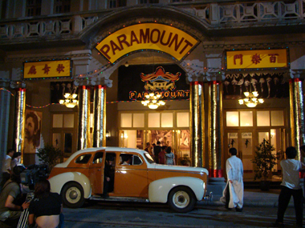
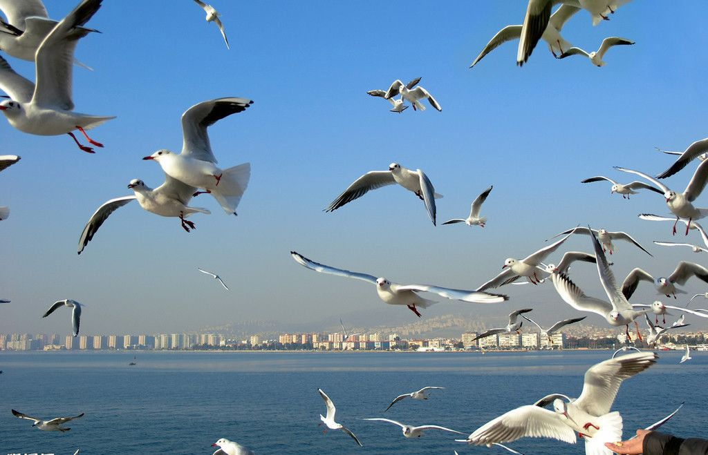
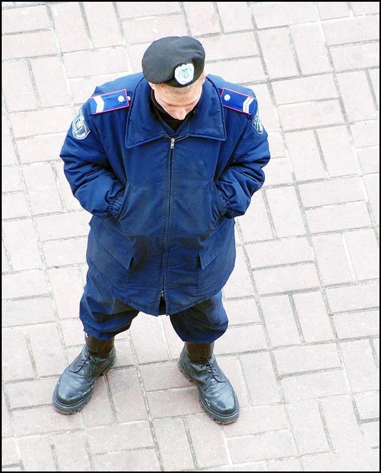

# 小国

** **

老头儿踱进一家餐馆，服务生递上菜单时，顾客们停下手中的刀叉，抬头，微笑。是啊，作为家喻户晓的长者，这样的礼遇是大半生劳苦的回报。亦或——在这个善良、祥和的小国，人与人的关系正是如此简单，简单而美妙：没有太多纷争，哪怕是条狗，见了红灯也得规规距距趴在路边，任等候的行人拍拍它的脑袋。

老头儿安静地搅拌着他的碗，奶油和清汤连成一片时，桌对面坐下了他的老朋友，几十年的交情，人们都知道。

“嘿，伙计，”老头儿放下了勺子，眼角眯成条缝，“今天给你过生日。嗬！一晃五十年了！”桌对面的老者点点头，咧咧嘴，摆弄一下松动的假牙。

“哎呀，老伙计，你这副牙口也不灵光喽！”老头儿伸手拍拍对方的肩，“想当年，这灵牙利齿可真是让人羡慕啊！”

「那年轻人踩着个破木桶，颤颤巍巍的简易台子倒也高出人群一大截，众目只能瞅瞅他赤裸的脚面上青筋纵横，以及高亢到略显震耳的嗓音，完全不似出自一副连日来只啃过馊面包的躯体。“听着！”他大喊，“我们一无所有：没有粮食，没有亲人，没有出路，没有命……”他的声音猛地垂下，又忽地骤起：“我们便是鬼，生存下去，找到敌人，杀死他、撕碎他、夺回属于我们的一切，那时我们才会活着，才配活着……”」

老头儿咂咂嘴，不时点点头：“这档子事，你记得还真清楚。”朋友也笑了，他掏出一块方巾，拭拭额头。“年轻的时候总觉得自己有用不完的精力，苦点累点不过小菜一碟，咱们也着实那样做了。”老头儿瞟着葡萄酒瓶上的年份，若有所思。“还记得后来的犯人上岛时的样子吗？简直不成人形。”老头儿把酒倒上，拈起杯子，与朋友的酒杯轻轻一碰。“老伙计，可惜，你能力出众，却只被他们选为我的副手。可别怨我呀。”老头儿拉长了声调，满脸堆笑，把杯中酒呷了一半。“不过，话说回来，这群人不喜欢秩序化，我想，咱们同是流放者，本应是一路人……”

「人们憎恶压抑，憎恶一切制度的边框。他们是那片大陆文化、艺术、思想的结合体，不在乎辩论，更崇尚和平。他们怯懦，准确来说是高傲，高傲到自负，自负到放下枪，不想打仗。他们在那场声势浩大的卫国战争中失去了土地，并非缘于侵略者的皮靴与枪炮，反而是领袖，那个万岁声中矮子的履带。但此时此刻，他们却需要一位引路人，慷慨激昂的演讲固然可喜，可当第三船、第五船的孤寒鬼连滚带爬地攀上海岛时，智者们永远信服于冷静和投票……」

“说哪里话，谈什么怨不怨的。”朋友推推面前的碟子，又擦了擦额头。“对，对。老伙计，这也要谢谢你。若不是你长期协助，几万流民，仅凭我一己之力，骸骨早填了海湾了，”老头儿双手捧起酒，凑到朋友眼前，“正像你所说的，来到这里就成了鬼，但生存下来，没有夺回故乡的能力，却把这小岛变成了家乡；撕不碎那些该死的刽子手，可依然有了命。老伙计，有时规划也真是一件麻烦事，正如你制订的这个法那个章，束缚人的东西总也脱不掉。”老头儿把头扭向窗外，下午两三点的海滨，整洁的街道几欲映出海日的光晕。

「他发动人们修筑了连绵的拦波堤，荒芜的石滩上从此生出嫩苗。他则呼吁人们复兴文艺，图书馆与画廊勾勒了城镇初始的容貌。一切井井有条时，他的章法被印上了告示，变成铅字走进学校、会堂甚至每一户家庭的桌上。他则告诫人们自由和谦逊之道……」

“你听说过这岛上有种鸟吗？羽毛有黑白两色；黑的占多数，逐渐成了众数。此刻，白鸟就认为自己成了众矢之的，东躲西藏，最终消失殆尽。”老头儿仍然瞧着窗外，儿童排成行，在空旷的沙滩上整齐地向海边行进。下午三点二十分，例行娱乐。“这天气真热，不是吗？”朋友低声说着，把被汗浸透的方巾翻了个面。“老伙计，看起来你需要杯冰水，”老头儿招呼着侍者，“还记得你制订的法律吗？船舶吃水线以下壳体必须、一定、强制加固以满足破冰需要。伙计，我们的岛要接近赤道了！”老头儿笑出声来，朋友呛了一口水，剧烈地咳嗽。“别这么急呀老伙计，前些日子你订下的限制橡胶出口改以磷矿外销的政策没有人执行，你也不必气恼。我们这里海鸟多，鸟粪多自然磷也丰富，可毕竟橡胶价格是你那堆见鬼的白磷数倍，人们知道自己应该做什么，倒是伙计你……”老头儿又把脸转向窗外，两个路人靠在人行道左侧，握手，上下摆动三次，微笑，举右手致意，告别。“别忘了，他们有权利决定自己的义务与行为规范，广场上的投票处不是虚设的，四万国民，就有四万张选票。你的法律，就像两年前他们表决处死那个开车时未向路旁行人鸣笛示意危险的傻瓜一样，或者被溺死的十几个自大狂，民众不喜欢他们，所以，哪怕仅过一票，也是他们应得的下场！”老头儿得意起来，善良的人民眼中决不掺假，简单的道德远比法律来得切合实际。而法典最后「公正、廉明、纯洁万岁」那行镏金大字早已成了笑柄：“万岁”是遥远故土上愚蠢人们为其领袖祝福的胡话，一个不着边际的白日梦罢了。

“我说得对吗，老伙计？或者叫你——上校？”老头儿挑了挑眉毛。朋友瞪大了眼睛，汗珠直滑进眼角。“你，本不就是暴君派来监视我们的走狗？这么多年以来你制定种种建设规划与法律条文，也多亏了你，我们这个建立在孤岛上的国家得以迅速发展……”老头儿收起了笑容，下巴上的横肉来回抽动着。“可你一直试图削弱人民会议的权力，以国土面积不足为由严控生育，限制经济发展，再以环境为幌子取缔了轻重工业生产。这些你如何解释？”“我只是……”“别这么吞吞吐吐，这是你写给联合国的信。”老头把几页文件纸摔在桌上。“……一再重申我们不打算争取合法政权的位置；还有这一封。”又是几页，纸张扇起的风把它们吹散一地。“给你的宗主国，表示你已轻易掌握了这个国家的核心，请求下一步指示。嗯？”老头儿一只手撑着桌子，站了起来，“所幸，你无法规避电信手段的风险，而这些纸又没有一张可以寄出去。在这片土地上，人们知道这宝贵的自由来之不易。你这个卑劣的秘密警察永远不会明白，这种祛除了压迫苦难后的自由，可以决定自己命运的自由而非被暴君左右。为了捍卫这样的生活，儿子有权检举父亲，母亲也绝不会庇护有违伦理的孩子。当然，这不是你这个数十年的老奴隶能理解的。”

服务生撤去尚盈的碗碟，顾客们又一次停下手中的刀叉，抬头，笑。的确，两位家喻户晓的长者，这样的遭遇是大半生劳苦的回报。亦或——在这个善良、祥和的小国，人与人的关系正是如此简单，简单而美妙：没有太多纷争，哪怕是条狗，见了红灯也得规规距距趴在路边，任等候的行人拍拍它的脑袋，不过，以道德标准来看，只能顺毛轻抚狗头三下，才不至于危及这条畜生的健康。

“ 

老伙计，生日快乐。”

「那位兢兢业业的间谍、声名显赫的元勋只比他参与修下的种种规则多活了一天，这天是他的生日。那位“引路人”告慰所有自由的人们，以礼貌的方式惩处被他们利用多年的领导者。尽管——他将自己视为这岛上的领袖；尽管——万岁的口号在这里是至恶的象征，一如他们鞭笞敢于随地丢弃垃圾的人；监禁无休止谩骂、讽刺的文人；绞死判批同性恋的理学家，他们太不懂尊重人权；驱逐虐待动物的暴徒，他们太不懂敬畏生灵。尽管——领袖视引路人为无物，归根结底他们不是一路人。尽管——他完全没有留意自己一切计划的流产，不会发觉自己成为了被玩弄的工具，归根结底他们不是一路人。」

人们微笑着把这位老朋友请上广场中央，没有军队——那是独裁者的统治机器，没有存在的必要；没有警察——这个世外桃源的素养远比任何人想像得更高。公民在掌声中唱票，无一反对，这必然是引路人的功劳，作为筹码，足以支持这白发苍苍的老者进行他的又一次连任报告。火刑柱立了起来，无时无刻不想着复辟专政、剥夺他人利益的敌人得到了应有的下场。画家望着熊熊腾起的火苗作画，要不了多久它们会摆进画廊，尽享荣光；诗人们围着烈焰颂起一篇篇赞歌，会有人把它们整理成册，塞进图书馆每一处角落；人们憎恶压抑，憎恶一切制度的边框。他们是原大陆文化、艺术、思想的结合体，不在乎辩论，更崇尚和平。他们怯懦，准确来说是高傲，高傲到自负，自负到放下枪，于是，他们只拥有火烛：篝火旁，母亲牵着孩子的手，俯下身亲吻他的额头，再把手指指向火堆中丑陋的人形，告诉孩子，那便是坏人的下场，要勇敢，要和那种人斗争到底！

老头儿向人群挥挥手，大伙扛着铁锹，将灰黑的骨灰扬向天际。这显然不符合道德逻辑，污染了空气。不过，在这个盛大的庆典中，谁在乎。

“老师，这是谁的作品？”学生放下手中的杂志，舒了一口气。

“一个匿名作者，”教授翻阅着时报，随口答道，“显然，他上了斯塔西的黑名单，没准已经在一年前被迫自杀了。”

学生摇摇头，“真可怕。不过，那面墙上周被拆了呢，母亲打电话告诉我，东区的士兵在凿墙前就跑了。”

“一点小惩罚能改变国家，但……”教授叹了口气，“莫斯科方面这次恐怕彻底输了，”教授打开抽屉，取出一沓文案装进手提箱，“你的实习期结束了，回去吧，趁你的国家机关职位尚未被西部全盘否决之前。”

“这个时候回去？”学生不解。

“新政府，新领导。去吧，别忘了我告诉你的那些话，还有，那个部门面试虽然重要，但考官是老熟人了。我想，你提起我，他会想起那位「俄国叔叔」。”

“好的，老师。”学生把杂志放进书柜中。

“或者——是！同志！”

 

（采编：佛冉 责编：黄理罡）

 
