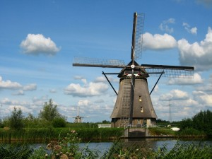
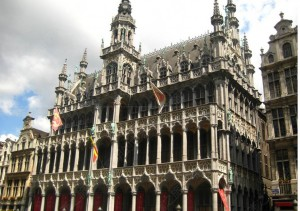
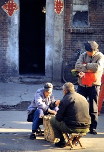

# 小游记

** **

**一。** 旅行其实是件很累人的事。灰头土脸地窝在列车上的时候总是小声地咬牙默念，不出来玩了，再不出来玩了。 好在党国没有考虑让我当间谍，美景美食美人面前，我委实是个立场极不坚定的人。更不要说那几个“美”还总是同时上阵。 

荷兰，就是bunt，就是colourful，就是有够鲜艳。这个国家的人把现代和前卫都钉到骨子里去了。在荷兰的列车上见到一个晒成粉红色的大叔，这个粉红还真不是拿衣服配饰啥的捯饬出来的，活生生就是肤色，我正看着他那么前卫的肤色乐呵，回头看见他的行李箱简直就惊为天人了，亮粉红啊，带荧光的粉红啊，真是，一大颗粉红的行李箱啊！这颜色在德国，别说有人穿有人戴，我连见都没见过，但是满车的荷兰人民对此好似熟视无睹，完全作无视状。我当即就被荷兰人民的前卫精神给震了。下了车，不小心回头，冷汗一身，难怪熟视无睹了，列车公车小汽车，荧光绿荧光蓝荧光黄…… 因为蹭师妹的地铺，前往她所在的小城莱顿。像在照片描述中说过的那样，真是个诗一样的小城。无数的桥无数的小船无数的小河。最喜欢在傍晚的暮霭中看到各种金发碧眼骑着我爹小时候载我的二八大车穿行桥头桥尾，那种怀旧的色彩和鲜艳的当下剧烈碰撞迸发的欢喜，很令人迷幻。会想象在这样的小城成长起来的童年会是怎样呢？在这样的小城成长起来的乡愁会是怎样呢？这里的人们若千里万里之远地奔徙去中国，看那个自行车的国度里车水马龙，他们是否也会觉得惊艳又迷幻呢？ 所以有些美丽和信任，是因为熟悉，而有些，是因为陌生吧。 出了阿姆斯特丹的车站往左边儿走走，空气中有种渐渐浓起来的味。说不好是烟味还是草味，若让我说，呵呵，你别笑，还真有点像老家小村里时不时游走的牛粪味。不过呢，介个就是传说中的大麻了。来荷兰之前和德国朋友说到旅行计划，德国老弟立马一副心知肚明的样子：哦~~要去阿姆斯特丹啊，大麻嘛，红灯区嘛~看看，城怕出名猪怕壮啊，一旦被人贴了标签，该多难拿下来呢。 因为有大麻和红灯区的存在，人们对阿姆斯特丹的注意力就很难放在别处。以至于在皇家博物馆看到各种大师之作的时候我都心不在焉很有点走马观花，快到出门才渐渐发现自己真乃暴殄天物。博物馆里有一个展厅，和欧洲的许多博物馆一样，专门留给中国。那是我多么熟悉又多么陌生的中国。是白瓷上游龙戏凤的青花，是红木上大肚纳川的弥勒，还是蒹葭苍苍白露为霜的诗作。那个中国在几百年前惊艳了欧洲贵族的眼睛，甚至连赝品都在博物馆里被工整收藏。也是那个中国在几百年里流离失所，如今却在他乡找寻到她的骨骼。 隔着博物馆的一扇窗，我像个游客，陌生而惊艳的注视着我的乡愁。 **二。** 据说比利时到现在还没选出国家政府来。 这在很多人眼中是很难想象的事情。但是往鲁汶往布鲁日的广场上一坐，就又觉得这是个很无关紧要的事情。 鲁汶是康哥的根据地。他在那个全世界据称是最古老的，据我看也确实是最古老的大学掉渣楼里，读法律。 我们坐在鲁汶的广场，与各色人等一起，看另一群各色人等在太阳下歌唱，绘画，喝啤酒。时间在这里好像都是缓慢而粘稠的，是流动着流动着就好似要静止的，是一杯微苦微甜的1900，只不过没有了海上钢琴师1900的哀伤流离，而是琥珀色啤酒1900的清凉迷人。 

懒得抽筋的比利时人，工作时间全世界最短。在这个开着汽车一不小心就出了国的国家，似乎人们比法国人更懂得C’est la vie的境界。布鲁塞尔的国王广场曾让我很惊艳，但是看到了鲁汶和布鲁日的，于是明白比利时的广场都还真是一个型呢，即使如此还是一遍又一遍地重复给惊艳。人们坐在广场的随便一角，都能将几百年的瑰丽收之眼底，更有甚者，在布鲁日的圣血教堂外，人们坐在米开朗基罗的杰作边，聊天，咖啡，嬉笑。那种在我的概念里简直要供上神堂的情调，在这里，叫做生活。 

于是不能不想起北京的老胡同，不能不想起在北京还是北平的年代，孩童在嬉笑追逐的小巷，女人们拉话家常背靠着的墙壁，老人们的钓竿垂去的湖底。每一样，每一种，如今被供上了神堂，甚而因拆迁连神堂都不再的情调，彼时，也是叫做生活吧。 每当变幻时，便知时光去。 布鲁日真美。你该去看看它。我到的时候已黄昏，凭借着对《杀手无假期》里淡漠的记忆，径直朝远处高耸的教堂走去。许多几百年的旧宅还都完好无损，在黄昏的沉静里许多的街道居然都空无一人。绕过一个街，再转过一条街，那些恢弘的建筑像捉迷藏一样忽然冷不丁地就出现在眼前，而且一来就是三四座。还没在这恢弘里回过神来，教堂背后的婉约小河就又柔软了人的心。钟爱不尽的倒影极尽妩媚，碎波微荡，垂柳轻抚，晚钟齐鸣，灯起。 精致到完美的小城。 政府缺席，然而生活常驻。 **三。** 莱顿。我盘腿坐在师妹的床上，捯饬着半天都没搞明白的相机夜拍模式。安安静静的师妹安安静静地坐在她的电脑前，有一搭没一搭地和我聊着天。 师妹进法大的那年，我离开法大。师妹的宿舍很传奇，一个宿舍能出民商几个前十名的人，师妹这人也很传奇，可以两天不眠不休地过她的正常日子，该看电影看电影，该写论文写论文。师妹说她是个静态的人。在风光旖旎的莱顿将近一年了，走的地方没我一天走的多。我说我是个动态的人，我很难想象像她这样好似一颗盆栽植物一样静静地把自己养殖在手掌大的空间。师妹说她是典型的悲观主义者，她的口头禅是顿不顿横空出世有点莫名其妙的一声叹息，长悠悠的一个：哎。师妹说我是乐观主义者，人生好像吸取了很多正面的能量。 她说她佩服我，我说我佩服她。 静态的师妹问动态的我，你说，人活着是为了什么呢？ 好大一个命题，一句话问的我语塞。 如果说成长这个东西给自己带来一些有利的圆滑之处，便是伴随着年岁增长不再那么冷不丁地拿这种问题来吓自己吓别人了。我已经很久没有问过没有想过也没有听到过这问题了，但是坐在师妹的床上，我忽然很想冒昧的试图去组织语言，回答这个令无数哲学家以此安身立命的问题。 我说，我们是空无一物地来的，将后也会空无一物地去。我所能希求与得到的，除了经历，别无其他。 我行走，观看，记录，传承，像无数人曾经做过的，像无数人还会再做的。然而或许文字都会有类似的，照片都会有雷同的，连货币都可全换成一样的，我的经历，却是我的。并不是所有的东西都愿意都可以分享的。也正是那些无人能够替代的悲欢喜怒，填充着我在这个星球的每一天，填充着从空无一物的此端，到空无一物的彼端之间或长或短的空白。 远行也好，颠簸也好，读博也好，恋爱也好。每一项行动，可以给出百八十个理由告诉人为什么我要这么做，每一个选择，可以摆出百八十个天平告诉人为什么我要这么选，但是你要听实话么，其实我很少想清楚为什么，这远行，颠簸，读博，恋爱本身，就是我为的。 不为彼岸只为海？是有这么一句很文艺的话吧。呵呵。 

（采编：黄理罡；责编：黄理罡）

