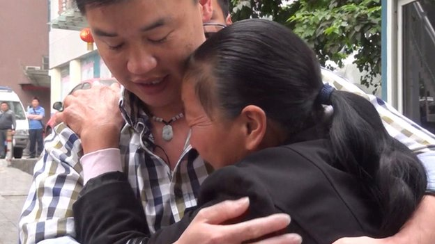
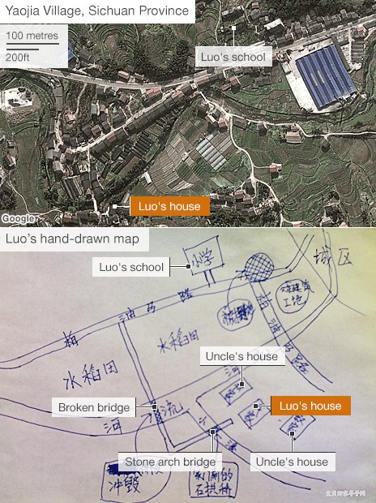
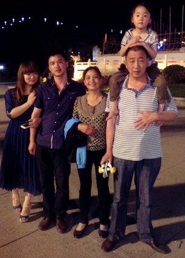

# 川闽路，廿三年，亲爱的小孩归家

 
1990年，五岁的罗刚被拐卖到了中国的另一头，忘记了父母的名字和曾经的故乡，他回家的希望似乎很渺茫。然而二十三年后，他回来了。

这碗面，罗刚等了很久。

“好不好吃？”他的母亲问，“我没有放辣椒，加不加蒜？”

“不加，太咸了。”他回答。

上次吃母亲煮的面时，罗刚还是个小男孩。今天的这碗面象征着团聚，曾看似遥不可及的团聚。

“别想了，吃吧。”母亲一边说一边轻轻拭去儿子眼角泪水。父亲忙着和来贺喜的乡亲说话。

“在我们福建，到家第一天吃点面代表家里平平安安的意思。”罗刚说：“我希望每个人都平平安安的。”

这温情的一幕让一个长达23年的辛酸故事有了带笑的结局。那时罗刚还是个叫黄军的小男孩，住在四川省姚家村。他的父亲是个建筑工人，母亲经营一家商店。有一个弟弟，过着平凡又快乐的童年时光。

他还清楚记得一切改变的那天，“我在上幼儿园路上遇到了一男一女。”罗刚说：“我以为他们是我爸爸的朋友，就跟他们走了。”

“转了很多次车，然后他们告诉我现在已经到了福建的山区。”

这个还有些晕头转向的小男孩被拐到了离家1500公里的福建三明市，一段截然不同的生活等待着他：另一个家庭、新名字还有后来又领养的一个妹妹。

他成了全中国每年被拐卖的数千儿童之一，其中只有极少数能回家。这个国家的独生子女政策和宽松的收养制度催生了贩卖儿童的地下市场。今年早些时候，福建的一位警察局长确认仅2012年就有一万名儿童被拐卖到这个省。

“我当时很怕，但已经被拐了，我也没得选择。”罗刚说。他刚开始以为这只是暂时的，但当他发现再也不能和父母团聚后，他决定死死记住脑海中正在消逝的记忆，以便某一天凭借它们找到回家的路。

于是，每天晚上睡觉时，罗刚都会重温一遍他能记起的以前生活的回忆：家是座瓦房……他和弟弟常在对面的老石桥玩耍……一次他桥上摔下，伤了后背……两条小溪流过……他们穿过稻田去上学……

“我像台电脑一样。”罗刚说：“我尽力留住家和周边环境的记忆，虽然我都不记得自己的原名。”

 
(罗刚在“宝贝回家”网站上的童年照片和后来的照片)。

	
罗刚的新父母从未解释他为什么被带来，两年后他们去世，抚养他的爷爷奶奶仍然对此闭口不谈。

“我很生气，可他们对我很好。”罗刚谈起爷爷奶奶，已然透着亲近。他估计养父母当初至少付给人贩子5000元，但现在罗刚竭力避免归咎于他们。

而当时，罗刚在四川的亲生家庭愈渐慌乱。他的父母（黄清庸、代建芳）在周边城镇散发寻人传单、在报纸上刊登寻人启事，都石沉大海。当地警方亦一筹莫展。

随着时间和积蓄的流逝，哀痛的夫妇最终力竭，后来收养了个女儿。

中专毕业后，罗刚参军入伍，退役后在消防队工作。虽然新生活已安定，但他寻亲的愿望却愈加强烈。

“落叶归根。”他引用一句中国俗语。他尝试过政府设立的帮助被拐卖儿童与生父母团聚的网站，结果却不尽人意：“走过很多死胡同，但我没有放弃。”

2012年十月，罗刚27岁，他发现了“宝贝回家”网站。网站由志愿者运营，父母和被拐儿童在上面发布分享各自情况的信息细节。罗刚贴出了他记得的所有信息，那是他二十三年来每夜反复细数的宝贝。

“那时我110厘米高。”他写道：“我有双大眼睛，左手虎口有疤，是在河里挪石头弄的。”

他不知道家乡村子的名字，但他觉得应该是在四川某地，因为他少年时的邻居说他当时有一些四川口音。

罗刚上传了他养父母在他被拐来不久时照的照片，附上对走失时穿的毛衣的描述：红色，有天鹅图案，他觉得那是他母亲织的。

“在家我吃过扣肉，上面有点高粱或者小麦。”

“我家是瓦房，没什么特别的。门口的路是新建的柏油路，许多卡车经过，像是条大路。” "

“附近有座小山，一条河流向小镇，家附近没有铁路，只有条公路。”

一座桥曾被洪水冲跨过，他回忆道。

 
（罗刚上传了一张照片，上面看得到被拐前手上就有的一块疤。）

网站志愿者马上开始思考这些线索。

“九十年代，四川盆地东部的人不种小麦和高粱。”一位志愿者提到。

“如果当时有一条柏油路，可想而知那里不穷。”另一位志愿者补充：“一定是在郊区。”

后来，罗刚凭记忆画了一张村庄的地图并传到网上：那座桥，走路去学校途径的那片稻田……他觉得那条新修的柏油路可能是一条高速公路。

接下来的几个月，论坛上讨论着罗刚的情况，志愿者们罗列了一些乡镇的名字给他回想。即使他对自己来自四川的判断是正确的，仍有五百万平方公里左右的土地——英国的两倍——和超过八千万的人口需要考虑。

但是搜索范围在慢慢逼近。有的志愿者检查了八十年代后期受暴雨和洪涝影响地区的记录，还有的志愿者查阅了宣布新道路建设的剪报。

三月份，出现第一个突破，志愿者找到了1990年的高速公路地图。这位志愿者推测，如果罗刚真的生活在一条高速公路旁边，那么搜索范围将会大大缩小-——地图显示这个地区当时只有两条高速公路。

罗刚放大卫星图像，顺着那条高速公路开始沿途寻找。

“注意流进城镇拐直角弯的河流。”志愿者建议：“还有种水稻和红薯的地方。”

4月26号，罗刚的虚拟跋涉之途来到了邻水县姚家村。他看到那儿有两座角度独特横跨河水的桥，也发现可能曾经是他学校的地方。反而是他记忆中的一块建筑工地，现在是一座巨大的陶瓷厂。一切都说得通。

“我当时的手抖得厉害，打字打错很多。“罗岗说：“我能看到那条河，还有离我家一百米外的主干道。”

 
（罗刚凭记忆画的地图被证明是准确的。）

网站上的一位志愿者去检查这块区域，“是的”，他回复：“那个建筑现在还是一所学校！”，两座桥中的一座在1989年被洪水毁了——恰如罗刚的记忆。

同时传来另一条极其关键的消息，一位志愿者检查了这片地区的儿童被拐情况，发现正是在罗刚走失的时候一对夫妇丢了孩子，孩子的小名叫“小东”——罗刚说他记得自己被叫过“振东”。

“我告诉我妹妹，她说我最好去看看，别告诉爷爷奶奶。”罗刚说。他很确定自己找到了家，他要去见父母，一刻也不能等。

“我飞到了重庆。五月九号早上九点二十我见到了父母，我当时很镇定，但是妈妈特别激动，她在哭。“

整个村庄的人都到场，迎接他们失去的孩子，鞭炮轰响宣告他的归来，丰盛的宴席沿街道铺开。

“宝贝回家”的一位志愿者拍摄下了这一过程。

“这是灶台，现在还在！”罗刚一踏进老屋就说。弟弟黄超问他还记不记得一个水缸——“那时候有一个碗柜在上面”，他提示。

“我还经常拿那个凳子爬上去够东西吃”，罗刚答。

“你还记得吗，小东？”，外婆问：“这是你以前的家。”

一家电视台播出了这令人震撼的画面，罗刚养育家庭的爷爷奶奶对此并无察觉，直到在电视上看到这次团聚。

“他们给我打电话，蛮难过的。”罗刚说：“他们说你找到了自己的老家，很好的。好好呆几天，但是早点回家。我在这里呆了八天回福建了。”

“我爸叫我留下来，但我一开始不想，因为我在等DNA测试结果。我很确定他们就是我的爸妈，但是最好用科学测试来确定”

 
（团聚后的罗刚家人）

罗刚如今已回来和生父母一起生活，谈及自己的被拐不禁语塞。

“一开始我觉得它拆散了一个家庭，现在我觉得它拆散了两个家庭”，他说：“我养父母家养了我23年，但是我的生父母家也是家人。我不觉得矛盾，我觉得它们都是我的家，两边我都会花时间陪。”

团聚实现了罗刚对自己的许诺——找到了生父母才和女朋友结婚。婚礼安排在明年，两个家庭都被邀请。

文章来自BBC Magazine

原文作者：Richard Hooper

原文标题：Luo Gang: Abducted, then reunited

原文地址：http://www.bbc.com/news/magazine-24526210

(翻译：张山骁，刘铮；责编：刘铮)