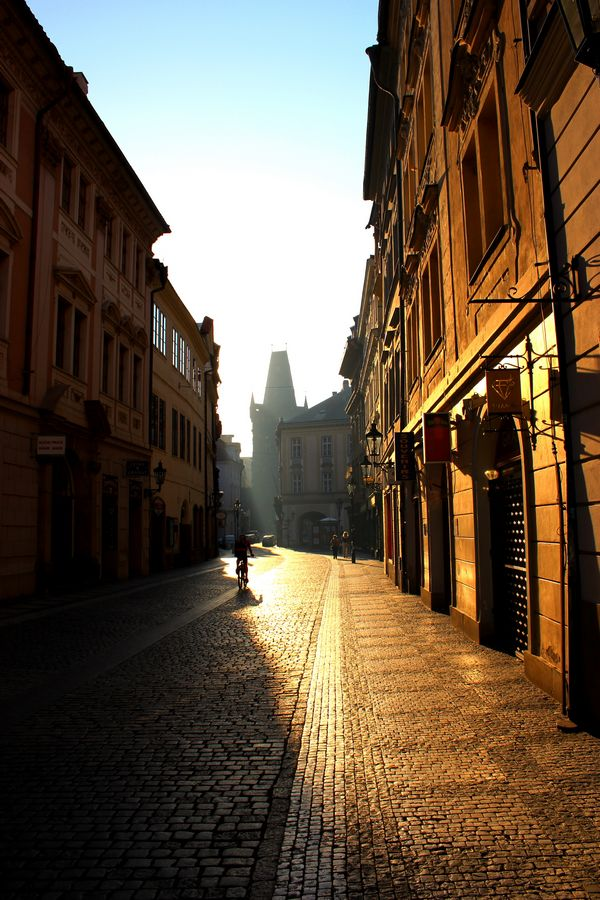
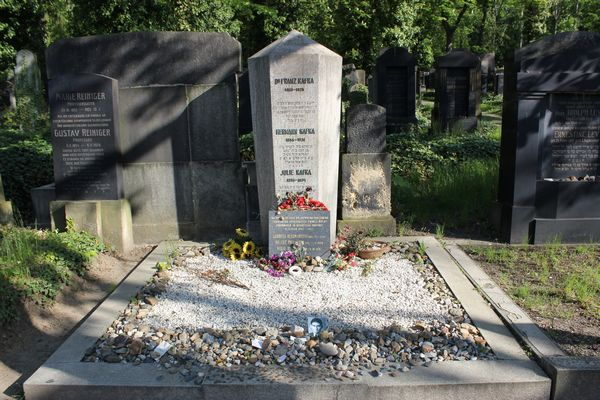
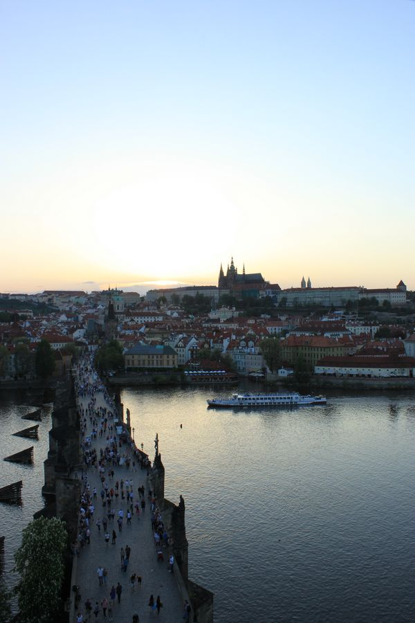
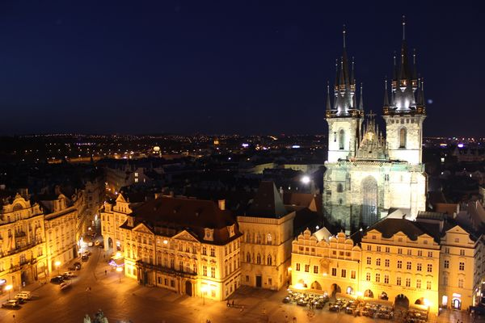

# 布拉格千面之旅

** **

一座城市有千张面孔，就在你捕捉到她的一个瞬间，你已错过更多的分分秒钟。但是只有你记住的那个模样，可以证明她勾人的魅力。

---- 布拉格侧影记，2012年

#### 文艺布拉格：里尔克与卡夫卡

你的诗歌，他的城堡，我想起在大二时一堂写作课上，我忽然忘情的背诵起里尔克的这首《秋日》，仿佛我读它的时候也被缪斯劫持。我在那一刻仿佛没有听觉，只听见灵魂的洗礼；仿佛没有视觉，只看见圣洁的阳光。

对于和我一样学习文学的人来说，布拉格首先意味着卡夫卡。卡夫卡的一生都在布拉格度过，他的职业生活与创作历程，都与布拉格紧密相连。或者说布拉格在很大程度上就指向了卡夫卡，因为卡夫卡的出现，他在语言上所表现出来的天纵之才，让他成为二十世纪现代文学的奠基者之一。他的文学创作和思考，从布拉格的大街小巷甚至土坑地下道，一直冲上了城堡、圣维特教堂之巅，他的文学魅力与布拉格这座城市融为一体，这便是我对这座城市心生向往的原因。

同样是出生在布拉格，里尔克在故乡的名气显然不如卡夫卡。这位诗人，从离开故乡那一刻开始就在不停的寻求真正的故乡。对于诗人来说，也许只有不停地找寻，才是他心中唯一的归宿。

“谁此刻没有房子，就不必建造

谁此刻孤独，就永远孤独

就醒来，读书，写长长的信

在林荫路上停定地徘徊，落叶纷飞”

我想起在的大二的时候一堂写作课上，我忽然忘情地背诵起里尔克的这首《秋日》，仿佛我读它的时候也被缪斯劫持，我在那一刻仿佛没有听觉，只听见灵魂的洗礼；仿佛没有视觉，只看见圣洁的阳光。我一直困惑于是怎样的童年经历根深蒂固的让他如此执拗地在路上，又如此骄傲，仿佛不容于任何一处地方。当我在布拉格老城广场火药塔南边的干道上，邂逅了里尔克的雕像，我大概知道了答案。

我询问过在青年旅舍工作的捷克小伙，关于里尔克在布拉格的踪迹。后来我按着他给我在地图上渺小的粗略的标识，一步步走向那两个街口之间。前一秒钟我还在内心安慰自己，即使找不到，也没有什么，毕竟这儿就是他的故乡，这儿的每一片树叶和每一块石头，都可能在他儿时留给他印象。当我抬头看看逐渐明亮起来的晨光时，就在我眼前，我见着了里尔克。他是如此的削瘦，眼眶深陷，轮廓很细，是一个羸弱的诗人模样。布拉格他的故乡，因为他童年时光的不如意，谨慎的将他成年时期的雕像放置在这儿。他的故乡，也许有他不知道的恋想；因为在他还没有认出方向的时候，他离开了家。

我本来想捡一片树叶当作纪念，可是我环顾四周，正是欧洲的初春，所有的绿叶在树上正发芽生长。是啊，诗人瘦弱而春天丰满，春天之所以迷人，正是因为诗人不遗余力对她的歌颂，我想这是诗人留给人们的遗产，我们能够回报的，就是用深呼吸去感受这茁壮的季节和生命。

读过里尔克动人的诗歌，邂逅了他削瘦的面容；我不得不更快地被卡夫卡的意义所笼罩。让人啼笑皆非的是，我坐地铁到了布拉格东郊，在一处车站左右问了好多当地人，他们都不知道Franz Kafka的墓地所在。只有其中一个中年男子说好像在城堡区。我摇摇头但是表达了谢意。我知道卡夫卡就在附近，而就当我快要失望的时候，猛然瞥见，对面马路的建筑围栏缝隙中，好像是一块块墓碑树立。我走了过去，门里面有一块牌子立着：Dr. Franz Kafka.箭头指向右边的五百米。就是这儿了。

这座犹太人墓园，是布拉格城中最不知名的一处。别处都躺着布拉格有史以来最伟大和最出名的政界、宗教界人士。而我心中只有卡夫卡，所以直奔这儿来了。也许是天气太好的原因，实在是不怎么能够调动阅读卡夫卡时那种严肃低沉的情绪。于是拜谒卡夫卡之墓也就变得轻松了许多。几百座墓碑，整整齐齐的排列着，我一路走进去，只有卡夫卡的墓地前有最多的鲜花，也有好多他的文学爱好者留下的字条。我想这是所有文学语言爱好者之间最好的交流方式。已经不需要翻译，卡夫卡知道我们都是那寻找城堡入口的K，和快乐生活在现实世界的人，如同他当年一样。

在布拉格的很多地方，都是卡夫卡曾经常常驻足、来往的地点。包括城堡区内，几十米长的黄金小巷。他曾经居住过的22号房子，如今是一间小小的书店，墙壁刷成淡蓝色，温暖恬静。店内有很多卡夫卡的照片，我也发现了里尔克和莎乐美的肖像。的确只有书店是纪念一个作家诗人最好的存在方式。

在上去城堡的路上，我经过一家卖杂货的小店。这家店在转角处，面积很小只容得下两三个人，更多的东西都放在了外面的走廊上。当时带该是上午九点半左右，店主是一个中年男子，他腼腆而又低沉，默默地在摆弄和安置自己店里的东西。那一瞬间我相信，就是在卡夫卡的时代，这个中年男人的父亲或者祖父，每天清晨打开店门，也许恰巧弗兰兹·卡夫卡从山上下来，路过这里，打个招呼，卡夫卡博士露出少有的微笑，舒展他的眉头，那一定是一个轻松的周末。

#### 颜色布拉格：油彩用尽也无法胜任的临摹

来到布拉格，视觉上最大的震撼，便是这儿富于变化又跃动的色彩。画家就算用尽所有的油彩，也无法完成这旷世的临摹。

在下火车之前的三个小时里，我已经与一个捷克姑娘成为了朋友。我们在车厢里热情的谈话，我们找到了许多共同话题。三个小时里我们谈过了文学，还有绘画；她的母亲是一位专栏作家，她的父亲经营着一间画廊。而她，正在布拉格的大学学习艺术管理。

我想再也没有另外一个家庭代表了我对布拉格的整体想象。事实上布拉格在视觉上的冲击，丝毫不亚于文学的浸染。在布拉格的视觉感官体验，甚至刷新了我对于文学之城的印象。

我到达布拉格的时候是一天中光影最丰富的时间。黄昏，风吹过伏尔塔瓦河，无数个斜阳倒影折射着岸上的万象。这夕阳的光沿着查理大桥横亘而来，仿佛是黄金的雕刻刀，把这颜色定格在布拉格每一座中世纪以来的建筑上。地面的每一块石头因而有了灵气，偶或飞过的鸽子羽毛也染成了橘色，教堂的尖顶试图搜集这万千光束，而交错的电车天线又像五线谱一样努力地挽留这富于旋律感的照耀。

在塔楼上的瞭望，更是把这座“千塔之城”的姿色揽尽。城市建筑的顶层，几乎都是橘红色，但是因为形状、位置的不同，夕阳时刻变化的角度和光照，眼前的鸟瞰之景，让我没有办法停下来记忆这一刻布拉格的样子；却只好在回忆的时候脑海里呈现一场流光溢彩的画面。

当沉浸在这般流动的光线中，时间就开始吝啬起来。但是这样的情感等来的是布拉格夜晚的更大魅力的释放。

布拉格这座城，用固态的建筑和流动的光影，抵抗时间的流逝。登上钟楼，老城广场的完美精致尽收眼底。这黄金一样的颜色，却丝毫不显得轻浮，反而空灵起来，如同一颗水晶装饰在城市的胸间。

独步在夜晚的布拉格，让我心生疑惑的是，如此热闹的城市，旅游的人群占据了大半的喧嚣，但是这座城市给我的感觉仍然是静谧的，一点也不漂浮于这些来来往往的过客的身影之上。她仍然很坚定，过着自己河流一样的生活，过着自己秘密一样的生活。

这是需要怎样的沉淀才可以到达的姿态？在经历了千山万水的跋涉，在走了一万一千里路以后，要留存自己本来的面目，这是要实现多少次蜕变才可以完成的真义呢。旅行的意义可能就藏于其中，去过河流一样的生活，秘密一样的生活，有清流急湍，千层浪，也有静水流深，心照不宣的静谧。守住自己的内心，内心无论如何光耀万丈，多少侧目驻足，只要做好自己，保存本真的姿态，这是布拉格的所在，是多少油彩用尽，也无法完成的旷世临摹。

#### 表情布拉格：士兵的冷静与新娘的幸福笑容

布拉格的表情，大概就是在士兵冷静的表情之下，却异常幸福温暖的笑脸吧。

在参观城堡区的过程中，会时常碰到在城堡中四处走动巡逻的卫兵。因为捷克总统就在城堡内办公，又是游客聚集的地方，保卫这里的安全，同时他们本身，也成了城堡中的一大亮点。他们穿着深蓝色的制服，因为阳光的原因有的戴着太阳眼镜，显得酷劲十足。在门口的警卫岗笔直站立的两个士兵，并不阻止游客排着长长的队与他们合影。任游客趣味横生的摆各种Pose，士兵也都保持丝毫不动，表情也不变化。他们肯定是早就习惯了这种被当作一道景观的生活。

但是他们同时也不会忘记自己的职责。要怎样的眼观六路耳听八方，又穿过这热情的人群，还要保持自己的姿态严肃冷静，又不能够有半点无视游客的表情。我不禁觉得这群士兵真是十足的可爱了。

每天中午十二点，有军乐队在城堡列队演奏军乐，而一队士兵会在广场上进行各个位置的换防仪式。每当此时会吸引众多游客驻足观看。

这是一个国家的最高领导人办公的地方，却也是最开放让游客游览的地方，还能一睹警卫的风采，不能不说是一件亦庄亦谐的事情。他们用枪杆有力地敲打着地面，发出的声响配合整齐划一的动作，带给人一种精神抖数的体验。

圣维特教堂是城堡区最高的建筑，和城堡的地标。哥特式的风格总是赫然的朝向天空指去，凛冽于风雨中，代表教皇权力的威严。我在城堡中漫步的时候，碰见了一对拍摄婚纱照的新人。新娘浪漫的婚裙和幸福的微笑，新郎眼中的温情，是布拉格城堡这一天一道亮丽的风景。

许多游客也都趁着他们拍照的姿态，记录下这幸福幸运的时刻。布拉格是许多恋人向往的蜜月之地。这里澄澈的天空，浪漫古老的城堡，温馨的小巷，都是为恋人们制造的圣地。恐怕难以找出第二个地方，可以培育出这么温情的时刻。

布拉格的表情，大概就是在士兵冷静的表情之下，却异常幸福温暖的笑脸吧。

品尝着布拉格这座老城喧嚣与孤独的双重性格,而其中滋味，只有当双脚踏上这里的石头路面，听见波西米亚风的高唱浅吟，遇见角落里沉思的一个写作者，或者触碰到这座城市日夜跳动的心，你便会了解。一座城市有千张面孔，就在你捕捉到她的一个瞬间，你已错过更多的分分秒钟。但是只有你记住的那个模样，可以证明她勾人的魅力。

 

（采编自投稿邮箱；责编：周拙恒）

 
