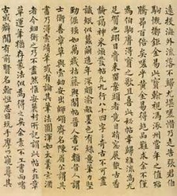
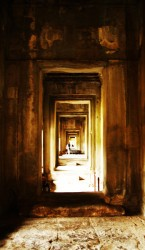

# 平旦歌

独在异乡，又逢癸巳新年时，不免有淡淡的畸零寥落的心思，读陆机的诗，大起知己之感，便写了这篇长长文章。

到今算来，陆机死了1710年了。我这个籍籍无名的小辈，在这里给他烧一屉纸，这是人间新年的热乎劲儿。

百岁千岁时光如流，一切早已是沧海桑田，可仔细思量，世间的事似乎从未改变。“华庭鹤”，“东门犬”，“出世与入世”，这都是知识分子们思考了好几千年的无解命题，这命题实在大的不得了，可关乎生死之道，又不能不去想。自汉儒之学繁盛以来，入世用世便成了读书人热切的渴盼，知识阶层是权利场上位置尴尬的一群人，他们坚持君子的操守和品格，却又要趋于权贵以体现积极用世的自我价值，治经儒生为容身固位，曲学阿世，志节日微，这场上演于庙堂与江湖之间的荒诞剧，至西晋一朝，愈发不堪。

作家梅毅将东西晋两朝称为“华丽血时代”，实在贴切，想当时风起云涌，飞鸿荡天，帝王霸业之后，无数风流文采都为一腔鲜血，成为权力机器中的一丝润滑油。西晋士子经历了早期国家统一的战争，持续十余年的“八王之乱”，还有大大小小无数政权更替的风暴，大多数死于非命，能得善终者不过十之一二。每当读到那些故事，我仿佛能看见他们的身影，青袍宽袖，大睁着双眼，小心翼翼的周旋来往于侯门大族之间，推销着才学，推销着诗书礼乐，同时惶恐地四处张望，生怕灾祸旋踵而至。最叫人痛心的，是他们自身的品格与价值观的对抗，他们有选择“出世”的权利，杨妃磨墨力士脱靴，天子呼来不上船，读书人应有读书人的骄傲，身在乱世，寄情山水田园，与梅妻鹤子相伴，应该是他们最好的选择，可是他们哪怕预知到惨烈的悲剧，也要一步步向既定的结局走去，种种情形，实在叫人扼腕叹息。

这其中，陆机最叫我怜悯爱惜。他的文章如此风流高贵，充满了对于生命的灵感体验。他身为吴地高门之后，与我本是同乡，如此，我更能体会他从温柔锦绣江南走向洛阳时胸中千回百转的心意。陆机一生坎坷，国破家亡，在新朝苦苦经营半世，所求所得于他个人来说却没什么意义，他只为了父祖和南人的尊严而活，没有任何退路，而更为惨烈的是他如此清醒，清醒到得知自己无力挣脱世间污浊之事，便用平静执着的心情来等待死亡。陆机一生写下了无数首挽歌，有许多是他代亡灵自挽，那哀恋凄伤的心情，实在非我的笔墨所能表述。

他的同乡，也是与他同样在西晋乱世中客居于北的张翰，则比他自在的多。张翰本是山林之人，天不能拘地不能束，对现实从不报有什么期待，莼鲈之思一起，任性来去，随意妄为。张翰归隐之前，有人劝他以百年名声思虑：“卿乃可纵适一时，独不为身后名邪？”张翰答曰：“使我有身后名，不如即时一杯酒。”

所谓身后令名，还不如现在请我喝一杯酒。

这真是我所说的宏大命题中，最欢愉也最悲伤的一个故事了，小时候读起来想笑，现在读起来想哭。

可惜我的陆机，到死也没有喝上这杯酒。

_ “__人往有返岁，我行无归年。昔居四民宅，今托万鬼邻。”_

_ ——__ __陆机《挽歌》_

我睁不开眼睛。

我的眼皮被麻线缝合，大约是用纳鞋底的粗针缝的，针脚扭曲拙劣。我若稍稍用力，那肌肉仿佛要被我生生的从骨上剥离，疼痛是雷霆，震耳欲聋。 

我必定是睡魇着了，谁是在梦境中迷惑我的鬼？

气力陡生，我猛地蹬腿，眼睛终于睁开了。

我猛然看到了自己的身体。

这不经意的一瞥叫我魂飞天外，我怎会如此丑陋。

我赤身裸体，皮肤上布满褶皱，褶皱里暗藏着灰白的脂垢。我的手掌上满是沟壑，手背莫名的浮肿。我的身躯看起来是如此短小，以一个猥琐的姿势蜷缩着，我的肚腹像个肉瘤，脐上生出一根长长的肉质的管子，管子上缠绕着更多细小的管子，里面是红蓝相间的汁液，一直通到那明黄的阴影之后。

我是谁？

我以为我清清楚楚的记得我是谁，可此时的处境使我迷惑。

头痛欲裂。

我在记忆中搜寻能与此时应合的任何一个场景，却一无所获。

唯独能记得的，只是距此时很遥远的一个夜。

那一夜我在哪里？在朝歌，还是在洛阳？

索性放弃了挣扎，我在这明黄色斗室里假寐，心思却很灵动。

那时是太康末年，我带着陆云去投洛阳。

去洛阳的路上我们迷了路，和陆云投宿在偃师的旅舍。店主人是个年轻男子，言语玄微，夜里与我抵足对坐，谈论易经。天将明时我向店主人告辞，行了六里路忽然记起不曾打听店主人的姓名，就询问田埂上闲坐的邻人。老汉说，此处向东别无村落，只有山阳王氏的族冢。

那夜我和陆云想了半宿，才明白是遇上王弼的魂魄。这事情被我夸口了半辈子。

离洛阳愈近，心中惴惴不安之情愈盛。还睇昨路，空野霾云。旅途过半，我想起前路渺茫，亲友靡靡已逝，我自身再无可以依傍安身之所，还要照拂陆云，中兴祖业，此种繁难心情层层叠叠涌上心头，却无人可以诉说，只得深夜披衣望月嗟叹连连。

我写了首《赴洛道中作》。“借问子何之,世网婴我身。”

自投落网，自投落网啊，原来我是去自投罗网。

初入洛阳的那一天我还能记得。我坐在马车上，目不斜视，暗自用力耸着我狭窄的肩。目光却汇聚在身前黄马的背上，那马是好马，铁肌铜骨，臀上的曲线随着步伐一拱一拱的起伏。陆云坐在我身后，强自压抑着兴奋而粗重的呼吸，口鼻间喷出的热气打在我的脖颈间，愈发叫我烦躁难安。

洛阳离吴地尚远，人喧马嚣。官道虽然平整，却尘土满天，被风裹挟着扑向路上的行人。

我恨这里的漫天黄土。

江南此时大约是雨季，有莼，有鱼，山明水秀。

我第一次去拜访太常张华，认识了刘琨。

刘琨初见我，就说我是个很会装蒜的人。我挺忌恨刘琨，他太骄傲，尤其是他吹《胡茄五弄》的时候，仿佛天地万物都化为了尘埃。我知道他心中看轻我，因为我是个破家灭族的外乡客。

但他却说对了，我的确会装蒜。

初到洛阳，有一天黄昏，刘琨步行来寻我，带我去了洛阳城北的一家小酒馆。刘琨叫了两小坛青秫酒，亲手拍碎了泥封，推给我一坛，自己仰头就喝，喝完了拿筷子敲酒坛子，边敲边唱，“我欲竟此曲，此曲悲且长，弃置勿重陈，重陈令心伤。”

那天，十八岁的刘琨喝醉了，头枕在我的大腿上，呜呜的哭。

我也跟着哭，我忌恨刘琨，刘琨虽然是个四处逢迎的浪荡公子，可他比我磊落，比我更像个人。我连人都算不上，我只是一只瞧不透看不开的可怜虫，靠着屁也不值的才情，撑着一戳就破的尊容体面，在紫带朱袍间乞一份残羹。刘琨写，“虹梁照晓日，渌水泛香莲。如何十五少，含笑酒垆前。花将面自许，人共影相怜。回头堪百万，价重为时年。” 这诗又俗又白，轻佻放荡，满眼尽是刘琨甜腻到发苦的自恋，可是看他得意洋洋的把自己比作十五岁的胡姬时，我并不厌恶，甚至觉得羡慕。我羡慕刘琨，他和我一般无二，都是大户趁食的门客，可我知道他必然不是这池中之物，心中还有一番凌云壮志。而我那上进的志气却早已懈了。

刘琨必是不能懂我的，可是我能懂他。

刘琨死后无奇士，独听荒鸡泪满衣。

我又想哭，眼泪却流不出，或许流出了，也立刻混杂在这周围的一片明黄色液体之中，我只感觉到眼眶一热，继而回归冰冷。那明黄是半透明的，漂浮着白色的絮状物，明黄之后是我看不清楚的阴影。水声潺潺。我恐惧极了，不知身在何方。更加烦乱，呼吸窘迫困难，周遭的明黄色绵里藏针，向我施展压力。我手脚乱蹬，大声呼喊，却无人应答。渐渐耗尽了气力，只好摒除杂念，舒缓上天赐予我的神经感官，去探查这明黄色的液体囚笼。轻轻的嗅，嗅到腥臭，那是血液沉积的味道，像用舌头舔铜镍合金的旧硬币。

我记得那年在金谷别庐，石崇拉人出来喝酒，给王诩送行。其实我不爱凑这热闹，可我不能不去，我是个趁食的客，哪儿真能有那份清高的脾气。去了也是好的，糊里糊涂喝个酩酊大醉，还可以借酒装疯去摸绿珠的屁股。最好笑的是我一喝醉就要唱歌，唱不成曲调，平仄颠倒，那词儿也是颓丧荒唐的。偏有人喜欢，还要一字一句的记下来，抄录许多份，有的刻成刊，有的置于我的案头，待我酒醒之后品读。

第二天我睡到日上三杆，一翻身从榻上滚落，猛然惊醒了。醒来一看自己，半边身子上都是席子篾条的压痕，入肉三分。我口渴的厉害，随手把身上的烂麻袍子扯了下来，亵衣也不穿，赤裸裸的在房间里踱步，胯下那玩意儿耸拉着，低眉顺眼。

陆云早已等在廊下，见我一身光练练的排骨，吓了一跳，又耐不得我口中隔夜的酒臭，捂脸掩鼻疾走而去。我看他落荒的身影，哈哈大笑。

地上散落着诗稿，有小潘的，也有石崇的，最后三张是我的。

石崇巨富，家里抄稿子用的是最好的蔡侯纸，那纸薄而晶亮，能透晨昏日光，如手温润。我听小潘说，好纸要用檀木，荛花和着草木灰捣浆，九蒸九晒，每次所得不过数千张。小潘说这话时，粉脸飞红，桃花眼里闪出贪糜妒恨的光。那表情我小时候见过，从前我家的歌姬见了爹的珊瑚树和珍珠衫赏了别人，就是这样子。

叫我看，石崇这是牛嚼牡丹狗嚼月，清清白白的草木被夺了性命碾成齑粉，涂抹上这些醉话，死不瞑目。那檀木还不如给我做一只棺材，我不着一丝的躺进去，用荜拔乳香细细的将我腌了，万古不朽。

说到棺材，我睁开眼看了看，四周的明黄色变的更加透亮，金灿灿的，血腥气更浓。我能看到这囚所的墙壁，像一块猩红的海面发了霉，长满了白嫩的绒毛，柔软可喜。我想游过去伸手触摸，无奈手臂太短，腹上又有那大肉管子的羁绊，只得作罢。

我吮了吮手指，又闭上了眼。

金谷雅集之后，在我背后指指戳戳的人更多。小潘来约我和陆云钓鱼，第二天就有人说我们蝇营狗苟。真是奇了怪了，这些人怎么就不说左思那丑八怪，还有欧阳健，在家后院摆个铁八卦阵，自己坐在阵中间与十二三岁的小丫鬟天地一家春。为什么只说我和小潘。

小潘其实比我还老些，快五十岁的人，看起来仍然是风姿绰约少年光景。小潘三十多岁的时候被挤到河阳去当县令，过不了几年又回来了，越发苟且，见了贾家人一脸谀笑，漂亮脸蛋儿上像抹了蜜。

小潘年轻的时候也是狂的很，想着趋龙附凤，后来几经蹉跌，发现自己不过是趋鼠附蝇，可他还是不死心。小潘从河阳回来之后，转而投了太傅杨骏门下，后来杨骏获罪，小潘又跟着吃挂落，罢官回乡奉养母亲。小潘才名遍天下，我本以为他是古今中外最钟灵毓秀的一号人物，经此挫折，必然堪透世事，寄情山水风月了此全生。到如今我才看透，他潘安仁实在是蠢如猪狗一般。如今他已是熬净了的药渣，开败了的牡丹，容颜残老了的歌妓，不过靠着盛时芳名和旧日恩客的一点恻隐之心求个温饱。他在金谷别庐也写了诗，我看了两句，“灵囿繁石榴，茂林列芳梨”，一哂就撂开了手，小潘无聊，连柿子石榴也拿来写。

我跟他说，我写的是“取笑葵与藿”。

后来，小潘死了，和石崇一起，被拉倒东市砍了头。

当日在金谷园初会，小潘与我说起旧时人事，不胜感慨，他母亲过去常说“皮将不存毛之焉附”，劝他不要趋附不已，他当时不懂得这个道理，如今他才明白，他是毛，杨骏也是毛。可如今不同了，他潘安仁是金谷园的座上宾客，靠着贾氏这棵大树，贾后专权，物情归附，飞黄腾达指日可待。小潘慢慢呷着酒，许久才长长的舒了一口气，向我道，“因前番多次蹉跌事端，本已是心如槁木，如今看来竟是上天爱我，有意琢磨，命中才有此富贵，可见天意茫茫，不可窥测”。我见他风姿绰约洋洋自得的样子，原想讥他是“望尘而拜”之君，最后还是生生把这话咽了回去，只说些君子慎独的客气话。

那夜从金谷园还府，我与陆云对坐用饭，想起白天的那一幕，忽然伸手打了自己一个耳光，见陆云目瞪口呆的看着我，我立刻又打了他一个耳光，随即狂笑不止。

谁是皮？谁是毛？

其实我们都是势若累卵，所依附的也不过是一座座冰山，日光一出，立刻要受灭顶之灾。可笑我自身尚且如此，竟还有闲工夫瞧不起小潘。

我想起小潘写给石崇的诗，“春荣谁不慕，岁寒良独希。投分寄石友，白首同所归。” 一语成谶，这两人果然白首同所归。

贾氏密谋弑杀太子篡权，事败身死，贾謐石崇自然难逃此劫。赵王司马伦挟持惠帝自立，立亲近的孙秀为相，小潘本以为自己不过是个趁食文人，顶多再被挤到穷乡僻壤去。谁知孙秀不忘旧时怨仇，处处罗织小潘的罪过。

直到小潘再次堆起他那一脸漂亮的谀笑，佝偻着腰，亲热的拉起孙秀的手笑问。

“犹忆畴昔周旋？”

“中心藏之，何日忘之！”

如此，小潘再无生理。

听说石崇跪在法场上闭目等死，见了小潘，还问说，“安仁怎么也来了？”

嘿，人家说善恶终有报，只分早与迟。那个年月，我们这样的丧家犬，草芥之躯，危如朝露，只分迟早，哪儿分什么善恶。

得知小潘死讯的那天 ，我从人牙子手上买了个小丫头，夜里把这小丫头折腾的死去活来。事毕我伏在那小丫头的胸口，唤了一声檀奴，就哭了。

说到底我心中竟有一丝自得，这可诛之心却从来没向别人诉说过。我自束发受教，心向圣人“入世”之道，儒家说天意不在高处而在人间，我既是江东高族之后，为着故园名气尊严，必然要“入世”，“出仕”经营周旋一番，谁也不能指说我热衷功名，趋炎附势。

有晋一朝，九品中正制度由来已久，北方大族门阀党羽林立，每日坐谈玄虚。司马氏开国得位不正，又要标榜儒学正宗，又不敢张扬君臣之道，其实早已是礼崩乐坏纲常沦丧的癫狂时代。原以为将相志气，云从龙风从虎，而今龙入浅滩虎落平阳，庙堂之上，硕鼠巨蠹横据其中，士子寒门断无上进之道，又何忍苛责过深。我已是断了做化外烟波钓叟的痴心妄想，只有战战兢兢以全禄命，惟求不愧先祖名声而已。

我虽不堪，起码还比小潘好些，我的脸上还挤不出那样油腻腻的谀笑。我从前保着这一点清高，只不过是给自己的些许安慰。如今竟有大难不死的庆幸，若非如此，此番必然也要同小潘一样，被绑到东市，开刀问斩。

这世道太脏，凭什么要我们为它殉葬。

忽然一阵燥热袭来，将我从回忆的泥沼中揪出，我感觉呼吸通畅了些，明黄色的液体不再那么粘稠。我愉快的松活了一下关节，刚想打个哈欠，忽然想起张开嘴必会呛到这腥臭的液体，赶紧闭上了嘴。

周围响起人声，瓮声瓮气的听不太真切。一个声音说，羊水的颜色怎么是金黄，另一个说了溶血，又说了胆红素。

一片嘈杂。

羊水是什么我不知道，我知道爹敬佩的人叫羊祜。

我小的时候，家人都说羊祜是我们家世仇，可是爹送给羊祜很好的酒，爹生病的时候羊祜派人过江给爹送药。我隐约觉得，羊祜应该算是爹的知己，吴王才是我们家的世仇，可这话灭天戾祖，我不敢乱说，连陆云都不知道。

小潘死后，有一天我背着家人，去洛阳城外给小潘和石崇烧了一屉诗文。我白天像个没事人一样，还做我的成都王平原内史，我觉得有一股邪气如影随形，这种恐惧在大白天也不能消散，我不敢放下马车帘子，不敢走到支街背巷，生怕在哪个无人的街角，这邪气就化出原形把我一口吞下。

夜里我推枕辗转，绕室徘徊，不能入眠。

我瘫睡在榻上，喃喃自语，像个蠢笨的痴人说着梦话，说总有一天我要出人头地，鲜衣怒马回归吴地，封妻荫子代代传胪。我会成为中兴祖业的先人被供在墙上，受花果祭拜，烟熏火燎。我的名字要变成子孙嘴里的不能直呼的讳。

每当我在深夜里叹息的时候，那小丫头就怯怯的从布衾里伸出嫩生生的手来抹我脸上的泪。

小丫头没有名字，我在夜里叫她檀奴。我抱着她，玉碎瓦全。

后来那小丫头死于难产，腹里是我的骨血。我在她的房前站了半晌，便叫下人去置办后事。我是老爷，我是大人，我是即将出征的河北大都督，我不能为了一个小丫头伤心难过。

我生命中的两个檀奴，都这么轻飘飘的离去了。

倏忽，心中冒起个念头，可能我很快就会和他们团聚。

我知道我活不长。我做着汉儒匡扶社稷的梦，想着祖业和功名。父祖手足死于耻辱忧患固然可悲，而我辈中人，连死都死的不明不白，八王之争像是巨大的漩涡，依错了主人，下错了注，说错了话，写错了诗，今日还是玉马金堂朝中客，转眼就要死于非命，像是身在无数巨轮之中，随时被碾为齑粉。

入洛阳这些年，身无寸功，生计坎坷，连安身立命都难，贾氏篡权在前，司马伦之乱在后，席卷而过，乱哄哄你方唱罢我登场，连年征伐倾轧，全无天道。斯然回首，身边的朋友知己皆已凋零，十年之外，索然已尽，就连潘安左思这样与我虽不知心却有同病相怜之感的苦命人也再不得亲近。

我太怕重蹈覆辙，我忧谗畏讥的心太重，这就是病，且已入膏肓，我一定活不长。

我想起左思的那张丑脸，说话前总要挤挤眼。

他说“士衡呐”，挤挤眼，“我辈比之俳优”，又挤挤眼，“尚且不如。”

他还说，“你有狂，我有讷，你我待价而沽。”

从前我卖着我孤高的才名，他则卖着他的拙。他卖给贾謐，贾氏衰亡，贾謐身死，他一击不中，退而不发，司马冏招他，他也不过诺诺称老病而辞。其实他这“藏拙”一招，未尝不是安身立命之计。

可惜我和他不同，我无拙可藏，我是吴中高门之后，我只能四处兜售我的矜傲与轻狂。

剧烈的震动使我全身战栗，一股巨大的推力拉扯着我，将我往那明黄色背后的墙壁上撞去。我呼喊，声嘶力竭却仍然无人应答。我的头颅像一只变形的皮球，几乎被压出脑浆，此前的一幕幕在我眼前飞快的闪过。

我是谁，我从哪里来？

我的檀奴死了。我从朝歌出征，列兵于河桥，之后怎样？之后怎样？

这仿佛是一个事关我生死存亡的问题，我必须想起，我必须找到这答案。

朝歌。

朝歌。

骑在白马上的司马乂。

司马乂在哪里？在哪里？鹿苑。我和司马乂在鹿苑交会。

司马乂身后的大车里是谁？那个黑而胖的流口水的傻子是谁？惠帝。那是惠帝。

我有二十万军马，在鹿苑阵亡过半，暴骨于荒野，无人掩埋。

我呢？我的肩膀被流矢擦过。

出征之前，我已在朝不保夕的战栗惶恐之感中活了好些年，司马颖招我出战时，我竟有解脱的快意，我虽怕这一天，可也一直盼这这一天，这是我中兴祖业唯一时机。那时节，人人看我的眼神都有悲悯歉然之色，大约都知道我此行生还之望渺茫。我甚至能猜到，他们都盼着我有朝一日会悔恨，悔恨自己长久抱持着的执着热衷之心。

可我永不会悔恨，我认真如此，却从不为己，“非世禄之敢怀，伤兹堂之不构”，我为全父祖令名而奔走追逐，虽然这“名”是不盈手的一盏流沙，半揽余晖，虽然对于这“名”而言，我只是“老而为客”，只能“托末契于后生”，可是如果没有这些羁绊与束缚，我将是这天地间飘渺冥寂的幽魂，六道轮回都经过，百世不得超生。

那震动越来越剧烈，我四肢百骸几乎要分离。

那天夜里，在鹿苑，我看到了什么？

我看到孟玖钻进了司马颖的中军帐。他们在说什么，切切喳喳，我不屑去偷听。我昏昏沉沉的睡去，直到盔甲兵戈相击的声音将我惊醒。眼前是我的门牙将，仗着我的剑，剑尖指着我的鼻子。虎狼军士门一拥而上，将我捆成了凫水的鸭子，推到校场上。

孟玖的脸上油光闪烁，在黑夜里明媚生辉，他笑嘻嘻的看我。我刹那间全部都明白了。

我想起那夜的梦，黑幰绕车，手决不开。我已被这噩梦捆绑了一辈子。

临刑前，我跪在校场的沙地上，抬头看夜空。

那夜的星星很暗，月很亮。月在絮絮的莲花云中浮着，月光穿过鹿苑干燥的空气，耐心而细致的抚摸着我的脸庞，就像我那怯怯的小丫头檀奴。

我觉得自己傻，觉得在洛阳的这些年傻，觉得中兴祖业的美梦傻。英雄了一世的爷爷和爹在天上，小潘和石崇在天上，小丫头在天上，他们都在天上看我，都在天上笑我傻。

我当时为什么要来洛阳呢？

也许在我进入洛阳那天，我就已经死了。

千寻铁索沉江，百年繁华坠地，孤子遗臣离散。看不尽万里星河，转瞬间落日残烟。“不意三陆相携暗朝，一旦湮灭，道业沦丧，痛酷之深，荼毒难言。国丧俊望，悲岂一人。”

事到临头，我并不惧死。我，小潘，还有孙惠，还有华潭，还有无数离了江南故土，弃了莼鲈之思，做此戚戚万里之游的痴子傻子，流寓他乡，在新朝大族戏谑鄙夷的哂笑声中苦苦经营着父祖的声望和南人的尊严，其实我们都已经死了。

“川阅水以成川，水滔滔而日度。世阅人而为世，人冉冉而行暮。”

追名逐利，夸文献才，哪儿有什么真心可言。其实说到底，我这辈子大多数的时候，都在为自己做日暮长行的挽歌，生命浑浑茫茫，我立于世间，不过是等死而已。时光若能回头，我还是会来到洛阳，江湖虽远，天下虽大，我只有这一条路好走。东门犬，华亭鹤，这是我的命。

“华亭鹤唳，岂可复闻乎？”

震动由远及近，在大地上撕出了一条巨大的伤痕，我回过头看军营和兵士都已经不见，连站在我身后的刽子手和孟玖也不知飞到了哪里。

裂痕越来越大，我看见土地里被惊醒的虫豸四散奔逃，树根裸露出来惨白如人骨，岩层碎裂簌簌落下。

裂痕渐渐变成了一劈深渊，从地心深处喷涌出炽热的岩浆热流。我开始燃烧，绑缚住双手的绳索烧断，衣衫烧尽，头发眉毛全部烧成烟尘。

我闭上眼睛，大声呼唤着，跳进了这深渊。

一片死寂。

三。

二。

一。

一声清亮的婴儿啼哭，划破寅时平旦宁静的空气，这啼哭来自怎样的身体？

我睁开眼打量这世界，杂树生花，莺飞草长。

天亮了。

真亮啊。

_“__属吴祚倾基，金陵毕气，君移国灭，家丧臣迁。矫翮南辞，翻栖火树；飞鳞北逝，卒委汤池。遂使穴碎双龙，巢倾两凤。激浪之心未骋，遽骨修鳞；陵云之意将腾，先灰劲翮。望其翔跃，焉可得哉？”_

_——__《晋书·列传二十四》_

（采编：孙梦予；责编：孙梦予）
