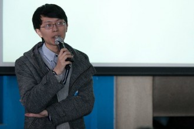
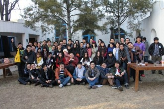

# 年轻的朋友来相会——北斗十一聚纪实

叁号会所所处的地方并不好找，北三环附近的某个小四合院里。这天天气还算不错，先前预计的清理帝都空气的计划似乎落空了。叁号会所的小院子里，错落的放着几把座椅，在那里可以看到明媚的阳光落到院子里枯黄的草上，显得颇有精神。在北斗十一聚的当天，天气晴好，一切进行顺利。

叁号会所的大厅里，灯光不算明亮，一百多位青年人坐在正中摆放的椅子或者两边的沙发上。看着最前面的投影仪，听着那里人的讲演。

北斗理事长刘一舟正在发言（via 毕玉婷的相册）

北斗理事长刘一舟是第一个演讲者，他高高瘦瘦，身着一身灰色的西装，细边眼镜衬托得本人斯斯文文。演讲的主题是《憧憬人文生活——我们走到哪一步了》，他首先简单地追忆北斗建立之初，所谓的“地下”成长经历，那是一段艰难的历程，刘幽默地说：“生活如逆水行舟，不进则被黑。”到现在，随着时间推移，社会也发生不少变化，北斗逐渐从“地下”转移到“地上”，刘一舟表示随着时间推移，社会也在不断地发生变化，将来的北斗会注重人文的启蒙，更多的进入校园，从线下发展。“北斗为青年人文代言”，借用陈欧体，刘一舟说出北斗新的口号。同时，刘一舟强调如今北斗的理念是“网络、人文、新生活”，传递人文生活的理念将是北斗未来的发展目标。因为这些目标，北斗在未来会打造诸如“摘星”等品牌产品。

第二个演讲者是嘉宾纪彭，作为新知沙龙的理事长，他一开始给大家分享了新知沙龙的发展历程。一群喜欢人文知识，向往人文生活的知识青年，聚在一起交流读书和学习的心得，并且发展新成员，不断壮大，直到现在。他说人文生活其实是生活之外的一种生活，在这么多年举办新知沙龙的经历给予自身很大的提升。纪彭表示，做人文沙龙就跟邀约一帮人长期踢球是一样的，它并没有高下之分，只是这么多年坚持下，别人收获的是健康，他们收获的是思想。同样的道理，做人文沙龙并不难，只要愿意，大家都可以来做。收获新知识，认识新朋友，享受人文生活，这些是新知沙龙的全部意义。

之后深度传媒的创始人叶凝上台演讲。他首先提到自己也读过北斗的文章，受到不少启发。他尤其喜欢一篇题目叫_[《离理性太近，离灵魂太远》](http://rrurl.cn/r1Fej4)（请点击阅读）_的文章。在台上的他看起来稍显羞涩。作为一个二十岁出头的少年，站着讲台上的他展现出独特的成熟和睿智，少年老成。深度传媒是大学生办的独立媒体，叶凝表示自己和深度的编辑们每时每刻都受到很大压力，因为他们在“挖掘新闻背后的新闻”。他们希望深入现场，还原事实。同时他还对当今中国社会的状况发表一些自己的看法，并对未来发表一种隐忧。叶凝表示：“我们可能不会改变世界，请不要放弃我们改变世界的想法。”

最后一位出场的嘉宾，老罗式的身材，发型狂放，正是虎嗅网的编辑潘乱。此次北斗聚会邀请潘乱前来，专为踢馆。潘乱的演讲建立在互联网新时代，网络新媒体的发展情况上，他讲到网络媒体的平台和内容的现状以及发展情况等。他对新环境下应该如何吸引更多读者发表了自己的意见。另外，他还对北斗的短板发出尖锐的批评和质疑。他的诘问让刘一舟和纪彭不得不出来做一些正面的回应，场上气氛也不像刚才那样轻松。在现场的一位观众甚至发人人状态夸赞潘乱的质疑“值回了票价”。

讲演结束，青年们走到屋外合影。或许是因为阳光明媚的原因，大家看起来都非常精神。良好的光线与闪动的快门声合奏出一首协调的曲子。照片为这次聚会记录下光阴的痕迹，欢笑则把十一聚推向下一个高潮。女神合照，以及北斗的全家福，总是能感受到青春的气息和理想主义的气质在里面。严肃的演讲之后，那些早已退出江湖的北斗老人出来做一个轻松的对话，主题是“我们这个时代的理想主义”。

__

北斗大合照（via毕玉婷的相册）

像往常一样，一水儿老人话当年，依次坐着刘宇翔、姜戬、吴如加、石修元、耿一博、罗天，刘宇翔是主持人。他们谈自己对理想主义的见解，然后谈到北斗，谈到最初艰难历程，以及之间逐渐建立起来的友谊。情到深处，有老人感叹：“当年吸引我的不是斗内的妹子，而是斗内的男人。”气氛突然有些基情四射，大家心照不宣，Gay斗的历史大概自此而始吧。坐在台下的，或坐在旁边沙发上的，无论新旧，都若有所思，好像在追忆那段年华。

紧接着有开始讨论自己离开北斗之后心态的变化，其中又以姜戬为主要例子。场面不时爆发出掌声和笑声，显然讲八卦，比说人文或者批北斗更加喜闻乐见。

讲到后来，主持人刘宇翔问：“我们还是来讲一点干货吧。”这样他们开始讨论在未来十年，北斗的发展是更自由还是受打压。对于未来的估测可能为时尚早，老人们各抒己见，表达对北斗的祝愿或担忧，欢笑与唏嘘齐飞。最后，石修远做出一个总结：“未来十年北斗的发展，不取决上面，而取决于北斗内部”，以此作为话题的结束。

十一聚最后在轻松的气氛里结束了，借以提醒人们这是一次青年人的聚会，这些人都在人生最美好的年华，青春活力张扬四射，未来尚未可知但理想坚定。

我们出去的时候太阳快落山了，这是愉快的一天。

（编辑：周凌希）
