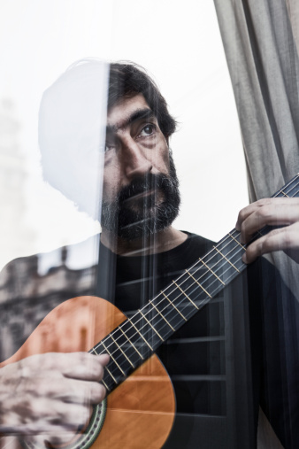

# 底线

** **

大二恶补吉他的时候曾拜音乐学院的一名研究生为师。号称拜师，说到底也不过是学校从账上把钱划走，再包邮研二在读的波多黎各小帅一只，讳Hermelindo。本校音乐学院素以实力雄厚闻名遐迩，人才济济怪物横行。举我家Herme为例：此君某天打来电话，满口抱歉，说不得不把周末课程推迟一天，特此征求同意。做学生的自然答应下来，顺便追问了一句原因；Herme先是忙不迭地致谢，接着满腔诚恳的解释说本周五要随他教授“去卡耐基音乐厅专场演出，可能晚上赶不回来”——其口气安之若素，与寻常学生诉说功课繁重、难以抽身时的态度别无二致。我听在耳里，跪在心里，只记得热泪盈眶地祝Herme演出顺利，便自豪地挂断了电话。

虽年轻有为也才华横溢，小帅教起书来却十年如一日地循循善诱——而且特别谦虚。最后一点尤其深得我心：按理说以他的造诣和潜质，对我这等小脚色即便是视若无睹也属常理，可Herme非但能对学生呕哑嘲哳的弦音泰然处之，更会善解人意地避免过分炫技。每每见我深陷泥潭，不能自拔，Herme总能恰到好处地给予点拨，且从未流露出哪怕是不经意的居高临下之感。这就仿佛武林高手与弟子过招时可以随兴所至，视晚辈火候任意发劲拆解，凭自身压倒性的实力优势而做到脸不变色心不跳、收放自如。

在Herme的言传身教之下，弹琴水平虽然仍旧不济，较之于前却也有了脱胎换骨的改变。教完基本琴理，小帅便令学生自行挑选首要学习的曲目。我也毫不客气，旋即把郑成河指弹版本的“加勒比海盗”提上日程。这首主题曲自我高三买来第一把练习琴起就已开始觊觎，现在终于有望挑战一番，不免斗志昂扬。Herme看着Youtube视频把谱子扒了下来，摆好指法，自己学会之后便开始从头到尾传授予我。既初窥门径，此后每天风雨无阻地抽出三个小时，不问世事，一心练琴。

精诚所至，金石为开，一周之后不觉略有小成，Herme在课上只找出少许瑕疵，便连连褒奖进步神速。两周过去，下手已不假思索，Herme见状默默点头，却罕见地未发一言。三周已毕，不仅隐隐然呈炉火纯青之势，更于弹指之间始自加入Herme不曾教授的元素——拇指频拨D弦，反复小节变调，心之所向且不一而足。堪堪一曲奏罢，我额角带汗，面露喜色，双眼在Herme脸上寻找着肯定与鼓励。

然而出乎意料，两人的目光在空中失之交臂。更令我不安的是，年轻人平日充满活力的双眼正直勾勾地盯在我兀自颤动的手指和余音未绝的弦上，纹丝不动。

突然之间，Herme毫无预兆地从琴匣中拎起他自己价值连城的专用吉他，横跨上膝，随后便一言不发般地演奏起我方才弹毕的那首曲子来。手起指落，捻拨推挑如暴风骤雨、海浪滔天，眼花缭乱的和弦辗转泼洒出雨点一般的节奏，直将十数年的功力在这一刻图穷匕见。恍惚中，我只觉一股发自内心的无力感侵袭上身，手脚发麻，就像攀登高峰的旅者行至深处而自觉小有建树时忽然迷雾散去，耸立云端的山巅以摧枯拉朽之势压倒下来，在一瞥之间让人明白何谓徒劳无功，何谓难望项背。

那边厢，小帅却仿佛自行破除了魔障，蓝灰色的眼睛不再僵硬，招牌式的笑容爬回颜面。他停下手，开始夸奖我认真练习的毅力。言语之间，就像什么都未发生一般。不必说，此前稍微建立的不堪一击的成就感轰然倒塌；废墟之中，我困惑地望着Herme，不理解一个平时心如止水、温文尔雅的音乐家何以下此毒手，好似不经意间被学生触到了什么难言之隐。

这件事过去很久以后，我才开始回想Herme异常行为背后的深意。

有一天走在路上仰望天空，突然忆起高中同桌引以为豪、美其名曰“高山理论”和“低坑理论”的一套原创思想。大致意思就是：某些人在一方面比你高出太多，你站在自己的位置上仰望他们便也看不出来这些人在这方面孰高孰低；同理，大象看着脚下成群结队的蚂蚁，大小难辨，更不会担心哪一只突然奋起而将自己个头比了下去。由此观之，人与人之间在有些领域上的差距如此巨大，以至于下位者从未想象过自己咸鱼翻身，而上位者亦不相信能被人迎头赶上。在此心态作用下，大人跟小孩掰手腕从来不会拼出九牛二虎之力，老美听中国人讲英语也从来都是赞不绝口；换言之，坐拥绝对优势的一方基本都淡定地令人感动。

如果这么看，也许Herme——只是也许——在我苦练三周的“加勒比海盗”里看到了一丝青出于蓝的影子，一抹倾覆这种绝对优势的可能性。于是无论刻意也好不自知也罢，他给出了一个非常简单且行之有效的解决办法：毫不做作地让实力锋芒毕露。如此一来，不但能将抱有“不切实际”幻想之人在一瞬间打回原形，更能以毋庸置疑的地位重新确立教室秩序。

有趣的是，我发现很多时候努力保护这种“秩序”的上位者往往比试图打破“秩序”的下位者更加认真——认真得让人害怕。

记得我六七岁时在少年宫学习国际象棋。班上有一个特别厉害的孩子，据说以前是下象棋的，还在市里拿过名次。有他在，班里其他人就只能去争第二，而我当时的水平虽然常年在第二与第四之间徘徊，却从来没有对他的地位构成一星半点威胁。此君与所有同学下棋都非常友好，见对手不慎走了臭棋甚至会劝人重新来过，然后等对方惭愧地另行部署之后再继续按部就班地积累优势，最后依然毫无悬念地取得胜利。

一日排位赛，我又轮到和这个孩子交手。当时谢军朱宸叶江川等人的影响力导致连少年宫的比赛都专业到令人发指。每次落子，不但要记棋谱还要拍计时器换手，时间告罄便立即判负。此盘开局异常纠结，我执白遇到古印度防御，被顶得如鲠在喉。中局形式稍见开朗，我便尝试性地与他兑后。对方若有所思看着棋盘另外一角，接着提了一步卒。

我的小心脏差点没跳闪一节。

要知道当时他的王后可是没有根的。我的白王后正直勾勾盯着黑色妖姬，而后者却完全独立于卒、马、车、象的势力范围，连自己丈夫都支援不到；也就是说，现在拿掉他的王后就是彻头彻尾的“白吃”。我瞪大眼睛，汗流浃背，仔细检查有没有陷阱；但其实心底早已明白：这是一个如假包换的失误，即使是顶尖高手，行棋百盘也难免遇见一次类似的低级失误。他没有后招，他压根就没注意到我在兑子。

白王后默默吃掉了黑王后，后者脱离棋盘，轻轻飘落至桌侧。我的对手没有露出惶恐的神情，脸色却变得如纸一般白。我在心里暗暗叫了声好：果然抓住一次重大失误。国际象棋里如果领先一个后，那么除非对方能出杀棋，否则基本上已成定局。我心痒难搔地等待对手应对，脑袋里却已经开始臆想胜利之后欣喜若狂的场面了。念及至此，便更加不耐烦地在椅子上坐立不安，而对方的眼睛却死死盯在棋盘上，毫无动子的迹象。

我等啊等。

他还是没有动静。

又过一阵，见对方的眼睛依然仿佛被吸附在棋盘上一样，我不免感到一阵站着说话不腰疼的同情——虎落平阳被我欺，这种悲壮还真是不免令人感怀。也许与其认输或拼至残局方才投子，他更愿意以用完时间的方式来结束比赛吧。我这样想着，看了眼计时器——

我操。

丫那边的表根本就没在走。

我这才想起来：吃完那个大子之后我一时喜出望外，接下去居然就完全忘记了交换棋权，所以刚刚一本正经看着对面假深沉的当口，耳朵里滴滴答答响的全是老子他妈自己的时间！我暗骂一句，怒火中烧地拍砸下去。对方以电光火石的速度回应，几乎未等我收手便已走完下一步，同时再次拍表交换了棋权。如此往复，我一边额角挂汗一边后怕：幸亏发现得不算太晚，每步还有几秒思考的余裕。要是再迟一分钟，时间恐慌之下就算几招之内把全部家当捐给人家也不是什么意外。另外一边，对手在重压之下实力却丝毫未打折扣；然而尽管险招阴招层出不穷，一个王后的差距实在是积重难返。几分钟后，我以二十三秒的残余时间取胜，成为班史上他第一个败给的学生。

然而我完全体会不到胜利的喜悦。

不要误会，我绝非那种见到对手失误便嫌自己胜之不武的高尚人等。之所以无心庆祝，只因刚才差点就葬送了近在眼前的胜利，而且方式如此愚蠢，态度如此天真。诚然，职业象棋比赛中讲究把对手每一个疏忽都变成自己胜利的筹码，但在一个平均年龄不到10岁的班级环境里，以这种近乎冷酷的沉默来试图挽回一个失误——只为了一场意义不大的排位赛。现在想起，弱冠之年的我也不免胆寒。

但话说回来，这种看似异常的行为方式其实完全可以理解——我们生来大都不是三头六臂，一辈子里总有那么几件比较擅长的事情，因为擅长而愈发努力，因为努力而愈发擅长；这些事情往往为我们带来难以言状的安全感，但与此同时也成为一道神圣而不可侵犯的底线。这条底线大致可以描述为微观世界里分子势能为零的那个距离：相隔太远，则几乎不存在关联；略微接近，我们甚至愿意拉对方一把；但等近到一个特定位置，我们就不愿让对方继续靠近了。这并不代表我们急于把对方推走，毕竟拥有共同语言之人来之不易。但如果这个距离继续被缩短，便会有一股迅速膨胀的巨大力量作用在两者之上，直至彼此归位，或再次拉开长足距离。

但倘若这种秩序被打破——哪怕只有一次，哪怕是机缘巧合，哪怕这次意外的革命性胜利对于挑战者而言只不过是天降馅饼，它对于被挑战者而言都往往意味着毁灭性的打击。我犹记年少的国象高手那天走出教室，父亲一记耳光抽在他脸上，他不躲不避，瘦弱的脸颊红肿起来。他暗淡的眼神里没有眼泪，却流动着一些让人捉摸不透的东西。

说到最后，其实这条底线最大的意义倒也不在于圈出旁人关心的事物这一隅。对我而言，既不擅长把别人当作目标，也不擅长靠竞争刺激动力，那这条底线——当我意识到它存在的时候——也许最大的意义只不过是帮助我更好、更真实地了解自我罢了。Herme的底线是吉他，天才棋手的底线是不输给弱者；成绩，工作，学校，文艺，口才，笔力，画技，体育，配偶......每个人都有自己独树一帜的底线，都在特定的事情上不愿做出让步。

于是暑假之前，当我发现自己在学习和求职上被人甩开而依旧无动于衷，而在电脑游戏里被新手赶上却变得焦躁不安时，我大抵也知道自己是怎样的一个人了。而令人喜闻乐见之处恰恰在此：即便清楚了解了自己的底线，我依然在很长的一段时间内充耳不闻、视若无睹，生活习惯上也毫无改观——不得不说，底线真是身体当中最为丑陋的一个器官，我不愿看到它，甚至不愿承认它的存在，因为它似乎把自己的思考方式和价值体系勾勒得太过清晰，泾渭分明地令人反感；撩拨此线，可直通灵魂。

尽管如此，仿佛没有这条底线我就没有了立足之本，仿佛会因为找不到自己的位置而与平庸朝夕相处。实在不幸，我不相信“存在即是合理”，我不相信“我就在那里，不悲不喜”。我只能祈祷，自己的年轻懵懂意味着思想和知识体系的变更还存在着巨大的可能性；我只能祈祷，我的底线是一条可以调整位置的腰带，而不是凶杀现场刑侦人员用粉笔描出的轮廓，而自己只是当中纹丝不动的尸体，让那条苍白的线从一开始就决定了我一生要留下的痕迹。

 

（采编：王怡然；责编：姚昕毅）

 
