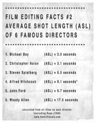

# 影商学导论——消深客法则

### 何谓影商？

影商这个词应该算我的个人发明，或起码是闭门造车的发明：诚然这是一个老词，具体发源已不可考，也许只是热心观众对电影鉴赏能力的随口命名。但其同时也是一个新词，因为现阶段它只存在于非正式用语中，没有衡量的标准，没有正式的定义，也没有人专门对其进行研究。而随着电影产业日益发展，接受美学在电影文化传播中的地位日益升高，影商这个词被谈及的频率越来越高，这个词的定义自然也亟待被完善。本人在下文中将举例说明自己以专业知识总结出的一套衡量影商的方法和要素。既然自己不是第一个说出这词的人，就试着去当第一个拿这词构建一门学问的人好了。

我为影商这个词造了一个英文名称叫做“moviewbility”，将movie、view和-bility结合。诣在说明影商这个词就是指一个人客观地评价、欣赏、批评一部电影的能力。

为什么有的人觉得好莱坞电影出现逻辑漏洞是不可原谅之举，而一定要大加批判？

为什么有的人觉得周星驰是电影大师而未闻安德烈•塔尔可夫斯基之名？

为什么有的人觉得诺兰天下第一，其他导演都是渣渣？

这些特别容易引发不健康讨论，进而演变成骂战的心态，归根结底都可以总结为影商问题。

我国观众在欣赏电影时有一个特别不健康的习惯，即是一定要证明我喜欢的电影比你喜欢的好，我欣赏的导演比你欣赏的厉害。我喜欢DC公司的超级英雄就一定要把你Marvel黑出翔才过瘾。我将这种行为命名为“斗蛐蛐”，仿佛两人不是共同在大银幕前欣赏电影的观众，而是人手执一蛐蛐互斗的对手，这点包括但不限于电影界。在音乐、游戏等方面同样如此。但影商的发明可不是为了成为这居心叵测群体手中之矛，而是为这些乍看无标准，无尺度的“电影审美”提供一个相对客观的量化准则。

### 电影是主观的么？

“一千个读者有一千个哈姆雷特。”两人就一部电影的质量发生争执的时候我们常听到这样的辩护，这句话的本意并无错误，但其被引用时所起的作用我是不敢苟同的。当讨论时搬出这句话，其意无非是说“这个问题每个人看都不一样，但实际上我们是同样正确的，没有对错之分，所以讨论到此为止吧”。是一种非常不负责任的说法，通常用来给正在“斗蛐蛐”的二人劝架。从“斗蛐蛐”的对待问题极端争强好胜直接跳到了对问题的极端中立回避，在处理问题的效率上是与前者同样不可取的。

对电影的评价可能是主观的，但电影的组成部分几乎全都是可以客观衡量的，这点影视专业做过拉片分析的同学应该深有体会，一部片子的镜头，演员调度，机位运动，打光，化妆，服装，布景，音乐，同期录音，后期配音，表演，剪辑，在专业人士眼里全都是可以分三六九等的，就拿广受观众喜爱的美剧英剧来说，其在国内风靡程度之广除了与剧情紧凑，构思新颖以外，和最基本的（同时也是可量化的）视听语言也是息息相关的，引用一下之前我写的状态：

美剧英剧乃至日剧在摄影、录音、剪辑方面经常能看到导演特别用心/用功之处，比如两个人的一场两分钟对话戏，美剧中平均镜头应该在30-40个左右，兼有摄像机的推拉摇移调度，手持摄像和同轴反向变焦这些用来表现角色内心活动的手法也经常可以看到，甚至会偶尔出现长镜头这种通常是在电影中运用的复杂调度。国产剧和韩剧则不会出现，两人对话基本都靠固定机位正反打然后交叉剪辑。并且在后期调色方面做得也没有英美剧用心，档次一下就拉开了。

当然，这说的是硬件，常规观众在真正观影/观剧的时候是不会识别或注意诸如摄影和音效上的讲究的，但是这些因素肯定会在观众不知不觉的情况下影响他对电影的评价。比如一部电影假如全用固定镜头拍摄，平均每个镜头10秒时间，观众就会潜移默化认为这是一部节奏较慢的电影。假如镜头推拉摇移变化迅速，远全中近特景别切换明显，平均一个镜头三秒不到，那么肯定是一部场面火爆的动作片。电影的客观视听语言会投射于观众的主观感受，这是一个既定的事实。

附六位知名导演的影片平均镜头时间：

从以上论证不难看出，一部电影的表现手法确实是可以被客观衡量的，视听语言就是客观评价一部电影的最佳硬指标。但电影除了形式以外，更重要的当然是内核，大多数人所指的“主观”也往往是指向影片核心剧作的。

那么故事难道就真的没有好坏之分，全凭观众一张嘴来判断么？对于研习剧作之人来说当然不可能如此。剧作本身也是有客观衡量标准的，读过罗伯特•麦基《故事》的人都清楚，故事的节奏和其定位是否相符，故事的大情节、小情节和反情节搭配得是否得当、故事的主题和主控思想是否让观众认同都是衡量一部电影剧情的硬性指标。貌似千变万化的故事其实可以通过叙事学解析成非常基本的剧作元素，好故事坏故事即可一目了然。这样说下来，一部电影中根本就没有不能用客观指标衡量的因素，为何仍坚持在电影上蒙一层神秘主义面纱，坚称电影是不可衡量的主观产物呢？

这便又回到了影商问题。

衡量影商在我看来无非是三个因素，也就是我标题提出的“消深客法则”，此法则与肖申克同音，每一个字都代表着在电影批评、欣赏和评价上的标准，即代表一个人的影商。

### 消——消解解构

Because he`s the hero gotham deserves, but not the one it needs right now.

——《暗夜骑士》

解构是后现代艺术家喜欢使用的一个词汇，又是一个被媒体和种种艺术圈外人滥用的词汇。它是复杂而多义的。在文学评论中解构指一种演绎方法，它展示了一场辩论的结构如何能有效地破坏辩论的立场。而在电影中的解构则更倾向于让电影中的某一元素脱离电影的环境来进行分析解读，比如许多观众习惯于揪出一部电影在科学设定上的bug进行强烈吐槽，进而否定整部电影，称其为“逻辑不严谨，编剧导演脑残的产物”，但假如我们把这些bug拿出来进行解构，得到的还会是同样的结论么？

让我们从解构的角度重新分析一下这些bug：

比如《独立日》中用人类的电脑病毒侵入外星人的系统这件事。在观众眼里是非常不可思议且缺乏科学素养的：人类的电脑病毒怎么可能兼容外星人的系统呢？但如果将此元素剥离到电影之外，以一个编剧的眼光来进行分析，就会发现其实这几乎是这段剧情的最优解：首先，该片拍摄于1996年，那时候电脑对一般人来说还是很先进高端的东西。大众对操作系统、黑客、病毒等等还相当陌生。这个背景是编剧可以一定程度上无视bug的基础。 更关键的是，也许编剧可以把“以电脑病毒形式攻击外星人”这个点子编得很完美没有漏洞，但那会增加很多本来不必要的笔墨，让电影变得冗长无趣——我们可以设想，要想非常科学严谨地在《独立日》中让地球人成功，可能需要：增加人类获得外星系统的戏份；外星人系统被地球人研究；经过长期研究和反复测试，并创造了新的电脑程序、病毒制作之后，再想办法在结尾把病毒上传进外星母舰——而经过前面的剧情铺垫，你可能对结尾早已失去了意外的期待，剧情也变得更芜杂散漫。

我们在普通的剧情片中到处都能看到不符合生活常识的“bug”，比如打车不给钱、出门伸手马上就能打到车、回家或出门不锁门、在咖啡馆要一杯咖啡却不给钱就匆匆离开……但极少有观众会因此责备电影不够真实。因为电影有其自己的逻辑，只要基本自洽，就可以让观众接受。

（以上三段节选自电子骑士的日志《俗套有理，bug难除——谈谈科幻电影的结构与逻辑》措辞略有删改）

因此“消深客”法则中的“消”就是指一个人在可观的阅片量之下，对电影的理解认知已不局限于结构本身，而更倾向于

去探究、解构片中元素的意义。总而言之就是“别让结构忽悠你”。不只是去看电影，而更深入地了解电影、认识电影，

看透影片众多元素设置的目的。

观看一部动作片的时候，发现主人公的好友中弹身亡，你的第一反应如果不是

“不！为什么死的是他！我好喜欢他！”

而是在剧情进行至此，好友死亡可以增添主角向反派报仇的动机，并消解好友与主角之前产生的矛盾，虽然比较老套，但符合动作片剧作准则。

那么恭喜你，在解构上你已经毕业了。

### 深——深入研究

You take the blue pill – the story ends, you wake up in your bed and believe whatever you want to believe.

You take the red pill – you stay in Wonderland, and I show you how deep the rabbit-hole goes.

——《黑客帝国》

很多观众看完一部让自己拍案叫绝的好电影后会有一个习惯：去搜搜这部位导演的其他作品来看。看似特别随意而简单的一个举动实际上说明了很多问题，比如“搜导演”这个行为实际上是美学上的“电影作者论”的体现：

法国新浪潮时期，特吕弗等人提出，认为不是所有导演都能成为“作者”。具备电影作者论资格所拍的电影才是“作者电影”。作者政策要求电影像小说、音乐、绘画一样是一个人的作品，电影作家的作品——即导演个人的作品。此理论产生广泛的影响。

其作者资格条件如下：

1、在一批影片中体现出导演个性和个人风格特性，把个人的东西带入题材，导演不是一个执行者。

2、影片应具有某种内在涵义，是后天形成而非先前存在的。

3、电影作者是对电影制作全面控制的人，无导演、编剧之分。

由此看来，看过好片后去搜索导演其他作品的观众，在无意识中就变成了电影作者论的拥护者。因为他们相信，好电影导演之作品，其中必有同一性和相似性，可以带给观众近似的观影体验。他们在一个无意识的举动当中，既丰富了自己对电影导演的认知，又践行了电影作者论对观众的影响。

这也是消深客法则的第二点：深。

简单地说，深就是一个人对电影外围的信息获取和研究能力。不把目光锁定于电影本身，而更广阔地涉猎诸如电影导演、电影周边、电影新闻、电影市场、电影理论、电影工业有关的信息。比如从最开始的追着演员看片，到后来追着导演看片，开始研究导演风格，开始研究导演技术手法，开始研究美学理论，到最后开始研究市场对美学的反馈，是影迷知识水平循序渐进的一个良性呈现，很多电影人（包括我在内）都是按照这个套路逐渐提高自己对产业的了解程度的。

只有这样，当常规观众都在感叹《穆赫兰道》之难懂时，你可以侃侃而谈地给大家讲解一下大卫•林奇的创作风格，以及为什么《内陆帝国》与《橡皮头》才是林奇主义晦涩的巅峰之作。并且附带给大家推荐一下《史崔特先生的故事》。 假如对自己影商提高有期待的话，就永远不要把目光停留在影片本身，而要挖得更深一层。阅片量是广度，深入研究能力是深度，扩展影商的面积永远需要二者结合。电影是舞台上华丽的魔术，但只要你足够爱它，总会忍不住想钻进它的幕后的。

### 客——客观评价

What we’ve got here is failure to communicate.

——《冷手卢克》

两年前看安德烈•塔尔可夫斯基的名作《潜行者》时，得到的并不是一次特别愉悦的观影经历。首先是因为简装碟的字幕问题，里面语句根本不符合中文习惯，画质也并不清楚，而最让我难以忍受的是本片节奏和剧情进展实在是慢得出奇。最后我不得不在影片进行至一半处关闭了播放器，这部电影我至今都没有看完。

但我一直承认它是一部伟大的科幻片，并随时准备重新观看。它的优质与否与我欣赏与否无关。这也就是影商学第三要素，客观评价电影的能力。正如我在前文所说，一部影片在几乎所有方面都是有硬指标可衡量的，但抱着批判眼光阅片的观众则永远会放大其最微小的缺点。 以下的句式在豆瓣影评中非常流行：

“……感觉有点盛名之下，其实难副。台词和剧本结构也没有太大的突破，甚至连出色的调度和音响也只是为了眩技而已，和内容和节奏也都不贴。我看这部片的时候非常折磨，节奏缓慢，铺垫不足。只有演员的表演还算差强人意。”

大家却很少看到这样的评论：

“这部片在国际上揽获无数大奖和观众的好评不是没有原因的，但目前以我本人的审美水平来欣赏还有些许困难，一些情节和节奏上的设计还不能完全理解，可能我并不处于这部片的观众定位之中。总之，本人在今后还会努力提高自己的审美包容力，争取能欣赏更多和这部片一样的电影。”

客观评价的意义就在于，在评价一部电影时能最大限度地排除与电影本身无关的因素，诸如观片时电影院后排有人踢椅子、身边有小孩哭闹、盗版碟的色彩偏差、阅片当天和女朋友吵架等等，并且在评价一部电影时，永远要代入它的大环境定位。

比如对待一部主要诣在展现极致特效、追求票房的电影《环太平洋》，就不能一个劲去批评它剧情无脑。而要代入大环境，考虑它在A级大片中的定位，在这个前有《变形金刚》后有《钢铁侠3》的商业市场中，《环太平洋》的剧情对于一部主流好莱坞A级制作的动作片来说绝

对是稳居平均线之上，人物塑造，对话信息，情节密度都恰如其分。假如批评它“除去华丽的特效之外一无是处”，就好比说“博尔特锯了腿还没我能跑”一般，属于不客观的强词夺理之举。

当然，这里说的“客观”并不是否定观众去喜欢或讨厌一部电影的权力，而是要求观众把“喜欢”和“尊重”作为两件事来对待，“喜欢”是可以受很多因素影响而转变的，但“尊重”是每一位观众都应达到的基本素质。 要达到“客”，只需要做到很简单的一点：既要有承认一部自己很喜欢的片子是烂片的勇气，又要有承认一部自己很讨厌的片子是好片的谦逊。

以上三点是我基于长期观察观众在阅片审美上经常出现的问题，对影商的衡量标准做的一些总结，以及如何科学、健康地去做一个电影爱好者。影商之基础则永远是丰富的阅片量。

毕竟，没有什么比电影更能让我们认识电影了。

(采编：吴燕凌；责编：王卜玄)
