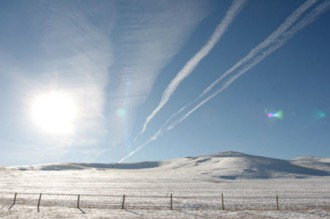
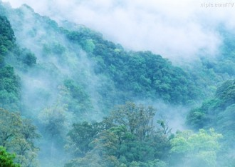

# 影长梦短

阳光被打磨得很薄 蜂鸣在花瓣上碾成了粉末 眸子里有一扇偏见的窗户 通透过来的景色之外 一定存在着些什么

冬天的风是简约的 影子没有着落地摇摆着 旷野重复着旷野 蓝色涂抹着蓝色 那所谓的方向 究竟所谓着些什么

如果这个世界没有如果 你怎么会丢掉那块镜子 我应该在哪里听说 上帝一直都赤裸着身子

喂，你在哪里 梦中，云里，或是海 有些事情 并没有看起来那么重要 那么急迫

（采编自投稿邮箱；责编：周拙恒）
