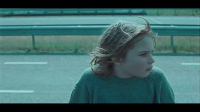
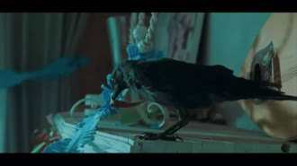
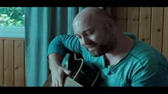

# 很遗憾你离开了我们——《乌鸦男孩》

很遗憾，你离开了我们，回到黑暗中去——《乌鸦男孩》

“起初这儿什么都没有，什么都没有，除了一片黑暗……”

桌上散落的杂物，水槽里尚未清洗的盘子，JOJO开了线的毛衣……在《乌鸦男孩》最初的镜头所捕捉的画面里，这个家里没有女主人的痕迹。

父子俩貌合神离的相处，让这个看似平静的家庭时刻充满着危机。夫妻感情破裂，以离婚告终，大人们得到了解脱，却要年幼的孩子来承受伤害。一开始我只是认为，是父母的离异，导致JOJO 性情乖戾，导演所言无非是揭露这种现象，以唤起人们的警醒。可是，我低估了这部获奖的处女作，它所欲对抗的并不是失去，而是死亡。

生命总是伴随着不断的失去与获得。死亡，是一种无法挽回的失去，纵使你有多爱多恨，死亡就将是一个终结。曾看到过这样一句话，它说当孩子们渐渐意识到死亡的时候，他们的童年就已经结束了。

的确，成长是个不可逆的过程，或许你的童年还能在相簿或日记中回忆，但其实它已不可阻挡地被岁月带到了更远的地方，音容笑貌逐渐的模糊和陌生，它就像是你生命中的一个特殊的过客，注定要在那段时光里死去。对于这个死者，你只能用成长来祭奠。而JOJO所面对的死亡并不是他自己，第一次是他的母亲，第二次是Jack。

然而所有的一切都是相对立而存在的。例如，物质世界的绝对运动和相对静止，又例如死亡和生存。没有死亡，就没有生存的意义，就连同那些曾发生在我们生活中的悲剧，没有它们，我们又怎会去懂得珍惜当下的幸福呢。经历过重大伤痛的人，他们对与幸福的感悟想必也是更为深刻的。

### 关于JOJO 第一次离开

母亲的死，令JOJO无法接受，他开始选择逃避这段记忆。JOJO遇到了寒鸦Jack，两个孤独的灵感相遇，必定会惺惺相惜。JOJO将Jack当作自己的孩子，他们一起分享关于妈妈的记忆。他生活在自己编织的梦里，他用自己的幻想织成丝缠绕在自己周围，成为了一只蛹。他告诉自己的朋友妈妈随旅行团去了美国，会在她生日的那天回来，他坚持着为妈妈做蛋糕，庆祝生日，他每天跟妈妈通电话，每晚伴着妈妈的歌声入眠。在这个他所掌控的小世界里，JOJO很满足，也很幸福。

他小心翼翼地爱着爸爸，渴望能够得到爸爸的关怀，但内心对他却有着极深的怨意。他渴望有个漂亮的朋友，渴望找到一个安定美好的地方生活。JOJO性格很倔强，他坚持收养Jack，坚持去做蛋糕，甚至在没有找到Jack时，就坚决不回家。这种坚持，只是为了可以晚些时候将梦打破，他比谁都清楚，死亡对于他意味着什么。

### 关于Jack 第二次离开

Jack是一只寒鸦，它就像是另一个JOJO化身，从巢穴中跌落，被母亲所遗忘。为了生存而进食，为了不孤单，与JOJO相偎相依。它和JOJO的朋友成为了朋友，它也时刻警惕着爸爸的出现。当它第一次被爸爸放生大自然的时候，它惊慌地呆在原地等待JOJO的解救。当它再次被发现赶出家门的时候，它已经长大并能够独自一人去战胜孤独和恐惧。Jack用它自己的成长教会了JOJO坚强，使他破茧成蝶，学会面对生活。JOJO曾说，寒鸦是在殖民地出生的，它们是很勇敢的领袖，哪里有危险，它第一个直接面对，它是个很好的朋友。但是所有美好就在Jack死亡的一瞬间凝固了。

Jack的死唤醒了JOJO对于死亡的记忆，它激发了JOJO潜意识里所逃避的情感。歇斯底里的JOJO绝望愤怒，失去理智的他最终把这一切指向了自己的爸爸，那根维系在父子俩之间紧绷的弦终于断裂。

### 关于爸爸 对离开说一声“遗憾”

往日的快乐如今都只存在照片里，妻子的死，令他无法释怀。他沉默寡言，易暴易怒，对JOJO的关爱亦是可有可无，时不时还以拳脚相对。他有着自己的坚持和隐忍。他反对JOJO收留Jack，动物和植物属于大自然，呆在家里只会令他们死去。他拒绝JOJO制作蛋糕，庆祝生日的请求，人死不能复生，与其悲伤的怀念不如就此苟活。但他不是不怀念，就在妻子生日的前一天，这个孤独的男人独自拨弄琴弦，诉说衷肠，最终敌不过心中的哀伤，而在夜晚开车狂奔。看着JOJO反复唱着Happy birthday to mama，他的眼睛里流露出愤怒和伤悲。他提醒着JOJO也提醒着自己，她已经死去了。他活得很清醒，清醒到不愿面对过去，也不愿对自己所爱的人赋予情感。因为再多的情感终将会随着死亡而封尘在泥土里。就在JOJO为Jack的死去而极度伤心时，他才幡然醒悟，麻木不仁的日子，不仅没有令自己解脱，也会将身边的人带下深渊，生活就该按照它本有的样子进行，既然往昔不可追，那就好好的珍惜现在。

这两个人，没有谁比谁好过。一个是天真烂漫的欺骗，一个是备尝艰辛的隐忍。他们用自己的方式去怀念逝去的人。只有他们都放下了悲伤，坦然面对死亡和生活时，他们才看清楚自己所拥有的。与过去和死亡作别，仅仅需要的是一句，我真的很遗憾你离开了我们。

### 关于电影中的死亡

这是部很典型的欧洲文艺电影，人物简单清新，影调明亮自然。每个画面都像是洗印好的明信片一般赏心悦目。这部电影的主角是一只寒鸦和一个男孩，都是摄影师们公认最难拍的角色，而世界上最好的非职业演员就是动物和小孩，因为他们的表演力与生俱来，他们的身上有着最纯粹的东西，不加粉饰便会打动观众。片子的配乐也是其匠心独具的地方，剧情中JOJO的妈妈是位歌者，她虽然没有在影片中出现，但她的歌声会时不时地引入剧中，就像是在对JOJO的一种回应，不断地给他鼓励和希望。影片多次使用定格的手法，将不经意的一瞬将给暂停下来，看上去像是一种怀念。那段时间的感情是快乐也好，悲伤也罢，都随着下一秒镜头的运动而成为了过去。那一个个定格的画面，就像一幅幅照片停留在回忆里。

死亡是这部影片所带给我最大的触动。虽然我并未真正体会过，但是我曾经有所失去。同时也让我想到，有些情感我们未曾在现实生活中寻得，但是借用电影、音乐、绘画和诗歌等众多艺术形式，我们才得以体尝生活的各种滋味，省察自己的人生。

尼采说，艺术是生命的最高使命和生命本来的形而上的活动，如果没有艺术的慰藉，人就会厌世和自杀。所以，在这条由生存到存在的路途中，在走向那个既定的结局时，为了打发寂寞，驱赶无聊，人们便创造各种形式来抵挡死亡的恐惧，或者用它来张显生命的力量以勇士般的气概与死亡抗争。就如同周国平老师在文章《基里洛夫自杀》里写的那样，一切悲观哲人之所以能够在这形而下的世界活下去，是因为他们都物色替身演员代替他们在这个形而上的舞台上死过一回。艺术在无限的延伸你生命的宽度，它让你更了解你的生活，更接近你的灵魂。

我很喜欢这部电影的开头和结尾，顺便也借用在这篇文章里。

“起初这什么都没有，什么都没有，只有一片黑暗……然后，有了一束光……”

(采编：王卜玄 ; 责编：王卜玄)
