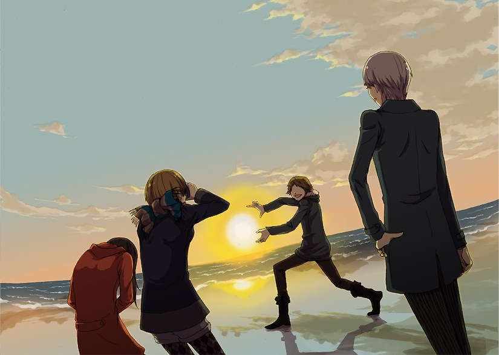

# 忧伤的魂斗罗

老D年轻的时候是红白机高手。魂斗罗只需要三条命便能通关。以前我们是偷钱出去玩。

我偷不到，老D也不偷。老Z家是开小卖部的，有偷不完的钱。

那时候打游戏，一个小时一块钱，那是在我们这些小村子能想到的最坏的学坏的方式。在年轻的时候，一个人不做点坏事做使自己变坏简直是浪费自己的青春。

我们有好几个地方可以选择。邻村有一个，开在家里，有七八台14寸黑白电视。初中旁边文具店的货架后面也有几台黑白电视，在那里我们坐在小板凳上，不是很舒服。还有一个规模最大的，有二三十台电视，还有彩电，彩电一块五一小时。

我的年轻最小，和他们出去的时候，我一般只在旁边看，他们买了零食也会给我一些。有些东西，是我从来没吃过的，比如七毛钱一根的雪糕，巧克力口味的。我至今也不清楚他们为什么总带着我，可能显得有面子吧。

每次打魂斗罗的时候，我都很快死掉。老D每次都在众目睽睽之下通关，打BOSS的时候，那么子弹飞来飞去，他面不改色心不跳，坐在那里一动不动，手指轻轻的按动手柄，像个冷静的狙击手。要知道，在那个年代，水平差的人按动手柄的时候要伴随着激烈的身体扭动。

后来有了一种新的魂斗罗游戏，有四个角色可以选，那里面的人看上去矮一些，有的扛着大炮，有着打着手枪。老D还是能打通关，老Z给他打副手。他们有一个人出去尿尿的时候，我便帮着他们打。如果那一关比较难，他们会把游戏暂停，以免我误事。

这个游戏通关以后会有很多很多的字幕，看这些字幕，似乎是一种享受。

我常常会走神，现在也常常走神。我羡慕他们的好脑子。我如果有这样的脑子，考试那不把班里那些傻逼全超过去啊。他们的身体也很好，顶着风骑着自行车速度可以超过摩托车，后面还坐着一个我，而且他们是在大金鹿自行车的大梁下面骑，身高还不足以够到车座。我要是有这样的身板，运动会那不总跑第一啊。

这种生活过了大约有五年之久。

初中三年级的时候，我意识到我的未来一片黑暗，再这么下去不行了。在我们那，对我这种什么都不行的人来说，只能使劲的学，让自己有一点尊严。

我的成绩勉强可以考个普通高中。于是，在家人的帮助下，我基本和他们两个绝交了。他们来叫我，我不出去，这么几次之后，周末他们也不来找我了。

他们可能不理解我的行为。

我是一个相对中庸和理性的人。我知道自己要是不认真上学，一辈子就在家务农了。务农对我来说是一件很恐怖的事。所有歌颂农业歌颂农民的人都是臭傻逼。十几亩玉米，需要一个一个的掰下来，还要一个一个的扒皮，以前甚至还需要一个一个的脱粒。

接下来，我真的考上了一所普通高中，而且没有交建校费。老D打算用体育来考高中，项目是铅球。但他没有考上，他说别人都走后门了。

很多年后，老D已经有毛新宇一样的身材了，他说，其实别人也没怎么走后门，确实是扔的不远没考上。老Z的爹把他买到了县城的重点中学，在那里，他玩了两三年一个叫传奇的网络游戏。

老D没考上高中，直接去小工厂干活了。我在高中活的很憋屈，二十四个人一个小宿舍，晚上有人打呼噜有人磨牙有人手淫有人偷东西。

我发现，外面的世界真是什么人都有啊，比村子里的人要复杂的多。

我复读的时候和老Z分在了一个班里。我离开了原来的学校，去了县城的高中。老Z还是喜欢玩传奇。他上课都在睡觉，满脸口水。我偶尔也会去通宵上网，但我最多看看电影和黄网，不会玩那种花钱耗时间的游戏。

老D每年都换几个工作，那时候，他有很拉风的摩托车和手机了。过年或者暑假，我和老D和老Z还是会见一两次面。暑假我们会去村外的河里游泳，裸泳。

前面也说过，老D的身材越来越像毛新宇了，模样也有点像。有时候，他的肚皮和大腿围成的三角形甚至能遮住他的鸡巴。所以，从水里出来的时候，老D常常要说一些黄色笑话，使鸡巴适度的勃起。他讲的最黄的，也是最凄凉的笑话是他们厂有将近100个单身的饥渴的年轻的女工，都让厂长给上了。

老Z在快要高考的时候得了肺炎，他的成绩也不是很好，于是退学了。我觉得有些惋惜，毕竟他是那么聪明。他的书在教室没拿回去，没有几天，便被偷光了。

零三年的秋天，我去湖南读书了，终于不用在庄稼地里干活了。我上学那几年，老D和老Z都结了婚，生了孩子。婚后，老D去蓝翔技校学了厨师，就是人们常调侃的那个蓝翔技校。学成后，他在镇上开了一家饭馆。老Z和他的家人搭理新开的超市。

有一年寒假，老D开车拉我和老Z去县城洗脚。

不知怎么，走着走着我的眼睛就湿润了，一下子伤感的不得了。我说，你们两个还记得咱们三个去打游戏机不。老D说，超级玛丽我还没通关呐。老Z说，那些烂游戏能玩一个下午，怎么玩都玩不够。

那家洗浴中心叫“北国之春”。那里的人都认识老D，亲切的叫他D哥。老D对我说，这是我的地盘，你放轻松点。我们在二楼洗了脚。那是我第一次让别人洗脚。因为我的毛裤太厚，裤腿不太容易挽上去。给我洗脚的大姐说，人家现在都不穿毛裤了。我看了一眼老D和老Z的裤腿，果然他们只穿着保暖秋裤。

洗完后，老D说，我们去三楼耍去吧，打炮去。我说，不是很早了，要不回家吧。我心里想的是，被警察抓住怎么办？要是要我自己拿钱怎么办？我还没弄过呢，弄不好怎么办？我有大半个月没洗澡了，这样会不会对人不尊重？那些小姐长得什么样，不会传染性病吧……

我当然还是去了。

我发现，很多时候，一个人需要其他的人带领着他做坏事，第二次，就会理直气壮的自己去做坏事。第一次做坏事的脚步还是很难卖出去。

小姐是东北人。我，老D和老Z选好人后分别去了四楼不同的房间。四楼是旅馆。

老D和姑娘说，这是我的铁哥们。

看着那七八个年轻的姑娘，我伤感到了极点。原来，花80块钱就能和一个女人发生性关系。八十块钱，我在大学里发两天传单就可以赚到。这样，就能操到一个陌生的女人，而且还有选择的余地。

我和我的初恋初了五年的恋了，甚至都不好意思有任何的接触，只是不断的写信和打电话，没话找话，虽然有说不完的话，但是现在都不记得当时说了些什么恶心的甜言蜜语山盟海誓。她把我甩了，我还要死要活的。

我不得不质疑爱情、质疑人生。

老D选了一个很瘦很矮的，前面说过两次了，他有着毛新宇一般的身材，我不理解他为什么要选一个那么瘦小的女人，手腕上一点肉也没有，像根干枯的树枝。老Z选了一个年纪大一点的，眉毛拔掉了，纹了深蓝色的假眉毛。我选了一个胖一点的。因为她站起来的时候，我看到她的紧身牛仔裤在她的屁股和大腿之间勒出了两道半圆形的弧线。她长得倒是一般般，留着刘胡兰式的短发，含情脉脉的看着我。

老D说，看看谁先出来，哈哈。

当然是我先出来了。在正常的文学作品中，讲述者“我”常常是处在尴尬的境地。

小姐飞快的脱去了衣服，她的紧身牛仔裤在她的屁股和大腿之间勒出了两道半圆形的弧线也消失了。她一个劲的催我脱衣服。我看到她略微粗糙的皮肤，有种复杂的感觉。人脱了衣服还真是不好看。刚才看她是在粉红色的灯光下，现在看她是在惨白的日光灯下，效果完全不一样。

我轻轻的摸了一下她的肩膀。她说，啊！耍流氓了，今天怎么遇到这么多变态啊！

我不知道怎么接这句话，只好说，你以前是做什么的。

她说，你快脱吧。

我脱去了塑料电子表，羽绒服，毛衣，衬衣，保暖内衣，T恤，鞋，袜子，牛仔裤，毛裤，秋裤，内裤。

她又说，大哥轻点啊。接着，躺在那里，把头扭向一边，闭着眼，就像等着有人给她打针那样。

点一袋烟的功夫，我就出去了。临走时，我说能再来一次不。她说，就是我同意老板也不同意啊。我说你们赚钱真容易。她说，冬天生意不行，今天算上你才三个。

原来这就是荒淫无度的生活，如此简单又实在无聊，我也没觉得这是犯罪，甚至没觉得这有什么道德上的负担，甚至比卖菜买菜还纯粹。

这么纯粹的行为，几千年来，人们努力的美化它，丑化它，制定了重重的道德和律令。

暂时的忘掉这些吧，当一个陌生的女人在你面前脱得光光的，张开大腿，你会发现，人和人是可以简单的面对的，人和人是可以坦诚的靠近和拥抱的。此刻，不需要尔虞我诈，不需要欺骗，不需要像政客那样为了一个猥琐的目的而编制美好的借口。

想一想，不免有些失落。

不过我也很高兴，这段阅历我能用它写五六篇中短篇小说，就算是来采风，来体验生活。将来我要是写——我一生最引以豪壮的是采过七次风；很多年后我在行刑队队伍里想过曾经采过风……没准就是这段真人真事经历改编的。

我下了楼，在一楼的大厅等。外面的路上偶尔会走过一辆车，走过几个行人。人们上班、下班、挣钱、花钱、老婆、孩子、丈夫、欺骗、恩爱、性交、卖淫、生老病死……无疑这次经历让我会很多事有了更清晰的认识。

老D也没多久下楼了，他说，你怎么不到车上去，哦，你没钥匙。老D又问，好不。我说，不是很好，你把帐结了？老D说，这你不用管。大约过了半个小时，老Z才下楼。老Z说，我操，她肚子上有剖腹产的疤，还一个劲的催我。

老D笑得前俯后仰，我却觉得这个夜晚无比的忧伤。

在2010年左右，老D的生意已经做得很大了。他在镇上租下了一个二层的小楼，开了一个比较豪华的饭店，基本上算是镇上最好的饭店。他开饭店的时候借了很多钱，前两年生意不是很好，后面生意好了起来。他那里主要给结婚的新人摆酒席和招待镇委的领导还有上面来检查的领导。老Z在县城买了房子，去县城的医院门口开小超市去了。

2011年，我突然接到老D的电话。老D说，借给我几万块钱吧，我周转不过来。

我一下不知道说什么了，我也忘了当时说了些什么，总之，就那么敷衍过去了，没借给老D钱。

老D说，没事，没事。

其实，我存着几万块钱，但是不知道为什么，觉得不能借给他，不是怕他不还，应该是怕他出什么问题。

我这辈子好像从来没爽快过。

我不会挣钱，也挣不到钱，更不会花钱，不懂得玩乐，说的直白一些，我就是没本事，也没胆量，我他妈就是一个一无是处的傻逼，我的心从来都没觉得畅快过，这辈子都他妈注定要窝窝囊囊。

2013年秋天，我又接到了老D的电话。看到他的来电，我的心扑腾扑腾的跳。看到他的名字，我头脑中想的全是当初没借给他钱。

人和人之间只要牵扯到钱，关系就会变得奇怪。

他说，咱昌邑开了一家湘菜饭店，生意很好，我领着厨师要去你们长沙看看正宗的湘菜。

我还是对没借给他钱这个事非常愧疚。

过了两天，他们就来了，竟然能在火车站买到座票。那时候我租住在长沙偏僻的天马山地区一个叫科教新村的老小区。

我告诉他们坐车的路线，不一会儿，他们就到了。他和他的厨师说，这就是我在路上和你说的魏导，中国著名的纪录片大导演，拍过一个纪录片叫……大鱼市……很出名。我说，操。

未成年的厨师羞涩的笑了。

我的住处不是很体面，纸浆板地板很多都翘起来了，采光不好，阴暗潮湿，全是七八十年代的旧家具，沙发上全是狗毛和骨头，基本没法坐。

老D和小厨师说，大城市能住这样的房子很厉害了。

把行李放在我的住处，我带他们去一家叫茅屋人家的饭馆吃饭。我不是很会点菜，平时出来吃的少。我点了一个牛肉、一个笋干干锅、一个蒜苗腊肉、一个蛋黄茄子煲。老D吃了几口，说，一般，晚上再去比这个高一个档次的尝尝。晚上，我带他们去了长沙繁华的市中心。那里到处在修地铁，到处都是大工地。老D说，他们都说长沙洗浴中心多，我怎么没看到几个啊，你怎么没买个车啊。

我似乎和长沙没什么关系。我在长沙待了十年了。这座娱乐城市的吃喝嫖赌都和我无关。没钱是一个原因，我要攒钱，以后买房成家养孩子；我在这里也没什么狐朋狗友，大多数朋友是以君子的面貌出现在我的面前，做坏事，肯定要成群结队才有意思。

一个人去偷偷的逛窑子那是件多么猥琐卑鄙丑陋下流的事啊。

老D说，你看，那里可以吃海鲜，要不去看看。

我告诉老D，这里被电视台曝光了。

老D说，怎么还开着。

我说，这很复杂。

后来，我带老D去了马王堆海鲜市场，那里可以自己选海鲜，饭馆加工。老D能够说出这里大多数海鲜在山东的价格。

老D对这里的菜也很失望，吃不惯。他总结出了湘菜的特点，那就是切得碎，多放油，多放辣椒，多放蒜苗，大火快炒。老D问小厨师，你觉得最好的湘菜是什么菜。小厨师说，上菜前端上来的那碗萝卜皮咸菜很好吃。老D感兴趣的是象拔蚌，他说这个东西可能能壮阳。他问老板能不能买一个拿回老家养在鱼缸里，老板说，拿回河南？老D说，操，山东。

吃完饭已经9点多了，我们回到了我住的那里。我和他们一起在7天酒店找到了一个标间。老D问我，这里有小姐吗。我说，好像没有。老D说，明天我自己转转，晚上再找你吃饭吧，你忙你的，晚上喝点。

第二天晚上，我们吃了麻辣香锅。老D说这种做法很好，他想回去研究一下。他让小厨师去饭馆的厨房装作找厕所，顺便看清楚用了什么作料。吃完饭后，小厨师拿起一张卫生纸就冲到厨房里去了。一会儿，他出来了。老D问，看明白了吗。小厨师说，看明白了。老D说，好，回去试试。

吃完饭后，老D和小厨师说，你先回去睡觉吧，我和恁波叔去叙叙旧。

我们去了一家正规的足浴店，一边洗脚，一边追忆似水年华。大多数时间都是老D在说，最后我终于把憋着的话说了出来。我说，我没借给你钱。老D说，我都忘了这事了，你从小老有心事，没那个必要，操。

两个人都沉默了一会。

老D说，你怎么不太愿意说话了。我说，我从小就不愿意说话。老D叹了一口气，缓缓的说，不说话好，祸从口出。洗脚的大姐抬头看了老D一眼。老D也看了大姐一眼，然后把在大姐手里的那个脚的脚趾头弯了几下，洗脚的大姐微笑着低下了头。

洗着洗着，老D便睡着了，打着鼾。我也想睡觉，却怎么也睡不着，装睡都睡不着……

这次过年回家，老D的饭店已经关门。家人告诉我，老D带着一个厨师跑了，躲债去了，秋天走的，至今音信全无。

（采编：朱燚；责编：刘铮）

