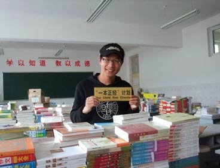
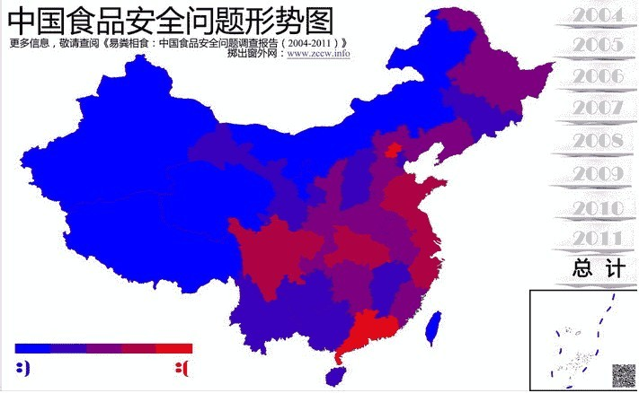

# 恐惧都是自己给自己加上去的——北斗网专访吴恒

** **

#### 北斗网：你是个目的性很强的人么？

**吴恒：**什么叫目的性？是说在做事情之前，先预计要达到什么样子的目的，然后一步一步去实施，这个意思么？那回答就是“是的”。做项目时我会尽量去预想到这个事情会怎么样的发展，然后再规划一下发展的阶段，希望能一步一步在原计划中。所以在做事情之前会有非常严密的规划。 

#### 北斗网：“一本正经”的募捐是纯民间性质的。之前也有网友质疑它的合法性，有人建议说你可以成立一个基金会，也有人表示支持，那末作为发起人的你来讲，你是怎么解决这些问题的？ 对于民间的慈善事业，其他项目给了你怎样的启发？

**吴恒：**根据我跟那些捐钱的人的交流可以看出，其实这是一个很可悲的情况，官方的慈善机构公信力正在下降，大家都不相信捐的钱会用到真正的用途上。与之相对应的是，公共知识分子，他们代言的一些项目，公众会更信任一个在公众领域有发言权，有诸多听众的公共知识分子，不管是专家还是意见领袖，都有着更高的公信力。虽然这种现状很滑稽：个人竟然会比官方机构更有公信力。但我们好像很习以为常了。 有一些不错的公益活动机构，同样也是采用了这样一种模式，比如“杯水车薪救西南”找的是刘瑜。我觉得这倒是一个思路，就是有执行力的机构、一些组织、个人，他想一个方法，然后他去找公共知识分子，然后由后者扩大其影响力，这种合作模式是可以复制的。因为那些知识分子可能没有时间去做具体的事务。但是他们有足够的号召力，另外一方面，一些有能力的个人或者NGO，他有这样子的心，或者这样子的实力去做这个事情，但是没有足够的影响力，如果这两者结合起来的话，再加上互联网平台上的无门槛的宣传，是可以改变很多事情的” 说道回应大家的质疑，我是这么认为的，这是一个灰色地带，于是在整个过程我没有提到募捐，就只是说如果你信任我的话，就把钱给我然后我帮忙买字典这样子。 消除网友疑惑的方式就是透明账目，很简单的，每一笔支出和收入就全部公布在网上，每隔24小时更新一次，这样的话每个参与者的每一笔钱，每一笔支出都能够显示在网络上。我比较自豪的就是整个过程中涉及的金额超过七万块钱，但是这七万块钱全都是网络上的流动，我没有看到现金，这样子也就是把透明度给最大化了。所以既然自己是在踩着线做事情，还是要做到滴水不漏一点吧。 

#### 北斗网：对于 “一本正经”，你是否准备把它变成一个爱心品牌？对于这个项目的现实考量呢？

**吴恒：**这个项目的结束也是在计划之中的，因为当时也没有想到要做长远，毕竟这样子的项目最好是要有人在当地才能继续的。我是参加学校的支教活动过去的，学校的领导可能人更希望你在那边安安分分地教书就好了，不要节外生枝什么的。而且像募捐之类的事情，涉及到钱，比较敏感，所以整个过程中我都是在以个人的身份在做，所以当时也没有想到要做一个长期的。不过以后要是有更多的时间和精力了，再来重启这个项目也是可能的。 

#### 北斗网：看你的食品安全报告的时候，我发现从04年到11年，中国食品安全问题的红色危机区域越来越多了，是这样吗？

**吴恒：**根据数据的统计，情况还真得不是越来越糟。是有一个波动的，这一点让我非常好奇，因为我是以为情况应该会变得严重的，结果我却发现在08年到10年的时间有一个非常明显的一个下滑，因为我的所有数据都是在统计新闻报道的资料，但是在08、09、10年有一个非常明显的下滑，开始不明白是什么原因，然后有媒体的朋友告诉我说，这是因为08年是奥运，10年是世博，在这个期间有两方面的影响，一是此间曝光类的新闻，可能发布出来的难度更大，另外，食品安全问题可能的确也有改善。 我们是大政府，在这样的一个社会现实下，如果他真心想做什么事情，是可以做得来的，所以实际上，如果我们能让主管部门更重视食品安全问题，用对待奥运、世博的态度去对待食品安全，情况还是比较乐观的。 我是一个制度决定论者。相信只要有一个良好的制度、且得到有效的执行，问题是可以解决的。 

#### 北斗网：有媒体采访你时你曾说，发起“掷出窗外”的目的就是为了广而告之，告之之后的事情，考虑过么？

**吴恒：**希望能够有更多的专家来关注这个事情，能站出来说几句靠谱的话，或者是一些NGO或者是政府的一些项目能够出面来做一个全国食品安全的官方通报。我是希望能够有一个更专业的团队，更多的经费来做这样子的事情。因为毕竟，你想想，整个调查报告全部我只花了200多块钱，而且这200多块钱还都是网站的费用。这样的投入，没有办法来要求我每一个城市去实地做一个调研，这个应该是主管部门的任务了，我是想通过这个报告去提醒他们，哎你看食品安全的问题有这么多人关注啊，所以要有更大的动力去做这个事情。 

#### 北斗网：你在发起掷出窗外的活动时，是有一个团队在集体运作的。有没有让你觉得很钦佩，并且需要学习的队友？

**吴恒：**有啊。在这个过程中间我最钦佩的是做我们网站技术的那个同学，代号是小白，我现在还不知道他是在哪个城市，在哪个公司工作，然后，我只知道他工作了，只能用晚上加班的时间来做这个网站。他一个人就做出了整个网站。他淡泊名利到没有透露姓名，没有透露联系方式，就是淡泊到让人感觉像不存在乐一样。有这样的合作者就让我觉得，自己有时候是不是说得太多了（笑）。我就觉得像小白这样的，也是一种侠士吧。就像是风清扬那种，关键时刻“biu”地一声出一刀，效果达到之后就消失掉了，不留一点痕迹。这是比较有代表性的，其他还有很多志愿者都是这样子的。 

#### 北斗网：在这几个项目当中，你遇到的最大的困难是什么？

**吴恒：**我觉得我所面临的最大的困难，还是自己的恐惧。因为我总是会想，“他们”是无所不知无所不能的，我就总是在自我审查，即使最后发布调查报告时，也自我审查过。面临的最大问题就是如何去与自己的恐惧做抗争。不管怎样，要去尝试一下吧。 恐惧，是一定会有的，是一定会存在的，但是我不觉得这是一个懦弱的表现，相反，这说明你对局势有一个清醒的认识。但是，不能让恐惧去引导你的生活。当你知道他们不喜欢听到什么，也知道他们喜欢听到什么时，可能不由自主的去想，我这么说“他们”会不会不高兴。一方面，知道这些很重要，这是生存之道，但另一方面，不能因此就只讲“他们”喜欢听的，不讲不喜欢听的，这不是一个大学生应有的心态。 所以很多时候就好像是走钢丝，既要把自己的思想表达出来，还需要考虑到这些思想能不能顺利的传达到其他人那里去。两种同样重要。 

#### 北斗网：像你一样，开展类似活动的人还有很多，你都了解哪些？比较推崇哪些？你们的共同点？

**吴恒：**“杯水车薪”那个还不错，我很欣赏的。徐伟，不知道是不是他的真名。我比较欣赏他做事情的周密，他甚至请来了一个专门的会计师来为他的整个经济行为来负责，然后他还有一个注册在学校的团体在做这个事情，就做的非常地专业。这是我比较佩服的地方。其他的公益活动我也接触过一些，但是不太多。总体上来说就是，虽然风声一直很紧，但是大家还是可以找到一些途径去做事情的。不能因为恐惧或者之类的理由去拒绝做所有事情。 

#### 北斗网：对于你所开展的项目，你在之前所经受的大学教育起了多大的作用？

**吴恒：**本科的教育对我很重要，相当于我的启蒙阶段是在本科。一方面的话我可以有很多时间自己去看一下感兴趣的人文的一些东西，但同时又不得不接受一些工科的训练。现在我回想起来觉得是非常珍贵的。我觉得如果我一开始就读文科，不可能做成现在这个样子的。因为我自己在读本科的时候，有很长一段时间是学习计算机程序，编写，代码。虽然我写的很差，但是至少经过本科的训练，我知道了一段代码应该怎么写计算机才会知道。而计算机是一个非常讲究逻辑的一个机器。你必须要清晰地告诉它怎么写它才会收得到，才会照这个去执行。这个过程可能就是比普通的文科生多一些理工科的思维。就是逻辑严密，定义清晰。所以也非常庆幸本科读的是这个专业，虽然我学的不好，但是长见识。我就是知道人类对最新的高科技是到达了一个什么样的境地。 

#### 北斗网：或者以后你会专心从事这些公共活动？

**吴恒：**做一个NGO是吧，是有想过，但是，这个是会在我未来的人生规划当中的一部，不是现在的，现在的一个很重要的事情就是去积累自己的社会经验然，然后积累自己的财富什么的因为觉得自己有了力量之后，才能够去帮助更多的人。但在现在来说，还是处在一个积累的过程。 

#### 北斗网：你觉得面对沉默的大多数，他们身上存在的问题是什么？

**吴恒：**其实我觉得大家都是被自己想象的恐惧吓住了（笑）。很多人都是很难去迈出第一步，大家会觉得，两方面的，一是可能要做的事情的确太难，另一个是觉得，即使做了也不一定有意义但是其实很多都是被自己吓到了，如果走出第一步，你就会发现后面并没有这么难。 

#### 北斗网：对现状满意么？

**吴恒：**你说哪方面？我所生活的小环境还是大环境？小环境的话挺满意的。 

#### 北斗网：大的呢？

**吴恒：**我说出来你们能发表么（大笑）。还是用自己的座右铭来说吧：世界并不完美，但是值得奋斗。 

#### 北斗网：这几个项目过去之后，给你的生活带来了怎样的变化？

**吴恒：**这个嘛……就是，自己终于有了低调的可能吧（大笑）。就是以前说低调的话别人会说，你根本就高调不起来嘛，但现在自己终于可以比较像模像样地低调一把了（笑）。之前说什么淡泊之类的都没怎么可淡泊的，那现在终于有一点点淡泊名利的可能了吧（笑）。 

#### 北斗网：我们都知道，当一个公民出名了，伴随而来的就是更多的关注和要求，而现在大家把眼睛放到了你身上，等着看你的动作，你准备怎么办？

**吴恒：**我觉得还是等大家都忘记了我再说下一步什么的吧（大笑）。我是相信能力有多大，责任就有多大的，我自己比较清楚，就在我自己的能力范围之内做一些事情。其实刚才说到的淡泊名利啊或者低调啊什么的，是因为觉得这些事情是我觉得自己应该做的。我也不知道下一次会是什么时候，可能是一个月或者一年怎么样，再遇上这类自己必须去做的事情的时候，然后去想如何去作为的方式。 比如“一本正经”，如果没有老罗，我是无法做出这么大的成绩来的。因为那个时候就是根本不会有太多人认识我，没有太多的朋友，但是这次“掷出窗外”，我很庆幸能有这样一个平台，就是我有2000个好友，这2000个好友对我来说就是，我的话，我的呼吁是有人可以来关注的，到最后是2000个好友里面有30个加入了我，换算过来大概就是有百分之3左右吧，比例很低，但是这些人的参与已经足够让我来做完这个事情了，但是如果放到一年前，我的好友大概只有200人，那按照这个比例来算，中间只可能有2、3个人来做这个事情，那我这个项目还是没有办法完成的。所以情况会变，作为的方式会变，但是不变的就是我必须要有所作为。 

#### 北斗网：为什么这些事会由你来做？

**吴恒：**就像我之前说得，因为我觉得这是我应该做的，恰巧路过这里，不能容忍自己不作为，就这样。 

#### 北斗网：对于媒体随之而来的褒奖，你怎么看待？

**吴恒：**我就是觉得大学生应该是这样子的：在自己的能力范围之内，做一些力所能及的事情，来改善这个世界。 前几天在人人网上看到一个复旦的学生，遭遇了学校官僚的不友善的对待，于是在网上发帖抱怨，然后就有哥们回复，说，哎呀你看你还是大学生的，这点事情都看不习惯，将来到社会上怎么生存。那个哥们也是复旦的，才毕业两三年，就变成这个样子，我就觉得很可悲。大学生就应该理想主义一点，就应该对很多事情都觉得不正常一点，也许你不能改变，但是至少你要有一个觉得他不正常得这样一个态度。你怎么能还在大学生阶段就觉得这种情况社会上很多，然后就要去适应呢？不是这样子的，而是应该有一个基本的价值观，就是很多事情我知道他是不对的，虽然我知道现实如此，但是我不能认同这样的行为，而且我要在我能力范围之内去改变一些东西，也许我最后什么都改变不了这没有办法，但是即使将来有一天我也要去适应他，也不是因为我觉得他是对的是好的我去适应他，而是因为我尝试过了但是改变不了。 所以从这个角度来讲，我所做这个事情，第一是因为确实存在很大的问题，第二我想靠自己有限的能力去改变。我不相信写一个调查报告就能够改变现状，但是至少我起来行动过，我尝试去努力改变过，我觉得挺好的，就这样子。所以至于其他的标签啊，我倒觉得不用这样去表扬吧。我记得有人说过一句话，就是并非我所做的事情有多么高尚，而是这个社会的道德底线在不断地下降，我只是保持不动，所以这样子看上去我就显得很高了。 

#### 北斗网：对你身边的沉默的大多数，想要说些什么？有什么建议？

**吴恒：**大家会有一种很强的无力感，我也有，就是很多事情即使说出来、做出来也不会有太大的改变。所以我的建议是不要抱太高的期望去做这些事情，这样的话你的挫败感就会很大、随之而来的无力感就很难受。我在做这个调查报告的时候就是根本就没想过他会带来多少翻天覆地的变化，只是去想，能多叫醒一个就多叫醒一个。一开始的预期设得很低。这样就会更容易满足一点， 就更有兴趣做下一步的事情。 在做“一本正经”的时候，其实就只帮助了我所在的学校的学生，要知道同一个县区还有十几二十个学校呢，他们都没有用正版的字典，如果从这个角度考虑的话，一个县有几千几万个学生，我只帮助了700多个，那就会很有挫败感，但是换一个思路，那就是能帮一个是一个，帮了一个是一个，哪怕就帮一个也是有效果的。这样的话自己就会觉得，自己还是做了那么一点点事情的。所以一方面要学会低调，另一方面就是要学会自我鼓励。不要一开始把目标定得太高。 

#### 北斗网：对你而言，责任和个人自由哪个更重要？

**吴恒：**我觉得还是要看身份吧。就是如果你被贴上了公众人物或者什么样的标签啊可能责任就会更重一点。如果没有这些的话，我觉得还是个人自由更重要一点。而且我不太喜欢道德绑架，就是你非得逼着别人去表态这样子。怎么样做选择是人家的事情，你自己做的好是你自己的事，你没有权利去要求别人也这么做。所以很多事情，无所作为也是别人的选择嘛，你可以感叹这样一种情况，比如说民族性啊什么的，但是这种感叹不应该针对个人。 

#### 北斗网：你觉得我们当代大学生身上的闪光点都有哪些？缺陷呢？

**吴恒：**闪光点的话，就是比较敢想敢做吧。他们现在所能做的，与我之前的认识的大学生相比，可能更放得开一点，我感觉他们已经走出了权威的阴影，觉得没有谁说的一定就对，就是不盲从权威这样子，这其实是一件蛮好的事情。但是一个后果就是，他们不盲从传统的权威，可能就会去盲从其他的东西了，这就是让我觉得既失望也觉得很欣慰的一点。像我在当初上大学得时候我就觉得电视上讲的都是真的，现在我感觉大家可能不怎么相信电视了，这是一个很可喜的进步，然而们不知道什么是真的了，或者说他们不会再相信有一个人或者有一个群体讲的都是真的。这样子就可能会陷入一种虚无主义里面，但是总体来讲是好事情，因为我觉得一个怀疑论者要比一个盲从者要好得多。 

#### 北斗网：对于北斗呢？

**吴恒：**这是一个非常好的平台。它能够存在其实是让我感到非常惊讶的，因为以我的观点来看，这样子的一个平台的存在是很有风险的，但是他依然存在着，这对我启发的意义就非常大，就是我们不要觉得“他们”是无所不能的，是可以阻止一切的思想的传播的，也正因为如此，才需要一些人去做这样一个平台，去做一些勇敢的尝试。其实我们需要面对的最大问题，还是直面自己内心的恐惧。毕竟很多吓住自己的恐惧，其实是自找的。  **[掷出窗外——面对食品安全危机，你应有的态度 ](http://zccw.info/)**  **[特稿：吴恒——一个过路人的故事](/?p=11096)**  

（采访者：孙微阳；责编：刘一舟）

  
