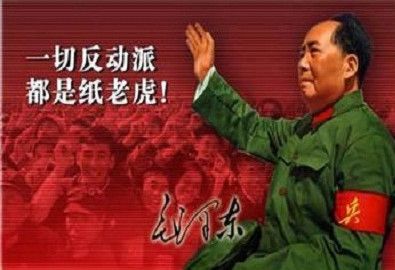

# 情妇

她不止是照片上的人，她有名字，找到她，告诉她，我......

** **

远方的群山依旧是静悄悄的。

初冬的夜晚就是如此，干冷而无风，雪地被夜幕碾成黑色，枯萎的败草间微微闪过一丝亮光。老王紧绷了一整天的神经再次被这微光拧成了疙瘩，他努力通过手里仅剩一个镜筒的望远镜死死盯着那团乱发一样的草丛，突然，草丛抖动了一下，老王的手臂一紧，一颗子弹带着来不及疼痛的麻木轰然钉在身后的石壁上。

1952年的十一月，被这片小小的朝鲜中部山岭点燃了。

不可否认，敌人的战术纯粹而震撼，短短十余秒，那一丝微光在照明弹下迅速散开，每隔五十米拉开一张大网，山洞间嘶嘶吐出几道火舌，继而是嘈杂的弹壳碰撞。老王早已听不清，那是前些日子大口径火炮的打击产物，就像用锤子猛砸着肋骨，麻痹全身，撕裂耳膜。老王依旧凝视着雪地与败草间密集的弹着点，除了骤起的雪与泥，偶然浮起缕缕红雾。“好，干掉十个！十五个！”霎时，原本鬼影重重的荒草间又恢复了平寂，除了渐息的火舌，一切如同梦境，不见敌人，没了脚步。

老王心里一个激灵，铁色的天空被划出一道口子，引擎的轰鸣夹杂着此起彼伏的闷雷与热浪一股脑涌进洞口，两架机枪被揉成一团废铁，狠狠抛在墙上，悬挂的旗帜连同桌上的作战地图一起被烧成一摊灰烬。那是人类历史上最恢宏的死亡杰作：数十架重型轰炸机张开的铁翼把山丘和大地统统视为了焚尸炉。

老王呆呆地望着穹顶上那颗巨大的红星，完全忘记了台前指挥上下起伏的手臂。老王不懂音乐，他习惯性的跟随者旁人的节拍，扯着嗓子喊出那些歌词。“第四买卖价格要公道，政治影响远近都传到。第五......”他回忆起少年时代卖干草的经历，那是深秋的午后，麦子都枯死在田间的时候。“第八对待俘虏影响好，不许随便拿他半分毫......”那是又一次围城战斗结束的时候，饥饿的敌人一把抢过一个士兵手中的净面馒头后便猝死过去。老王的头很昏，眼前的一切愈发模糊，整齐雄壮的歌声里，他显然不知所措，像个羞怯的孩子，一个劲把手死死背在身后。

老王讲给我那些琐碎往事的时候，我听得并不经意。那时的我尚且年幼，低头摆弄着一串亮晶晶的铜片，老王就像个留声机，一遍遍叨叨着，似乎是往昔的峥嵘重现，又似乎是低沉的耳语。直到铜片锋利的边缘割破了我的手指，大哭声中老王停了下来，无奈地摇摇头笑笑，收起了这些危险的东西。老王的笑尴尬而生硬，一如他的性格，肆无忌惮的掩盖与欺诈从未远离，哪怕被轻易识破，或者面对至亲与家庭。我明白老王有两张脸，一面布满战创与温存，颧骨直至耳根的弹片伤让温暖变得扭曲，另一面，是陆姨的脸，对我的严寒，便是对陆姨大女儿的春天。

陆姨是老王让我这么称呼的，我知道这乡妇会把一切命令时刻挂在嘴边，把所有厌恶统统写在那张沟壑丛生的脸上。我想弄明白这跋扈的女人是如何在母亲之后立足，又牢牢把持着一位情妇与后母所应得的骄纵，这点老王不会讲，他给予了陆姨以应有尽有的顺从，苟且换取一两个简短的回应和大女儿不屑的眼神。这实在是有违伦理的事，也令我在大院中形单影只：邻里的孩子私下谈论些什么，继而直接孤立，说我是破鞋种，杂碎，朝我投石子。我知道这是陆姨与她那女儿的诡计，想必又是老王的不堪作风，又养了小，留了野种。我在陆姨大女儿的鞋子里撒过图钉，偷偷藏起过她的袖章，败露后无疑是一顿毒打——老王怜悯地看着我，尔后狠狠抽我耳光。我知道杀人诛心，懵懂的情份就是轻易被这样的可憎面孔抹杀的，尽管他在陆姨不在时轻轻揽过我，嘘寒问暖，俨然天伦。

陆姨从这个家里消失是老王被打倒的前两年，老王的行李被一个军官抬上吉普车，陆姨喋喋不休地抱怨着上京的麻烦，一气之下喃喃诅咒着。一旁的军官快速从兜里掏出小本，刷刷记录些什么。

“好大的胆子！”连日陆姨面前唯唯诺诺的老王一把掀翻了茶几。

“你敢违抗这命令，就是对党的不忠！对伟大领袖和副统帅的不忠！”军官愣了一下，又翻了一页。

“警卫员！把这无法无天的叛徒带走！”陆姨的脸色惨白，被两个警卫强行架进了院子，塞进另一辆车。

“毛主席万寿无疆！林副统帅永远健康！”老王一把搂过大女儿，捏紧拳头挥舞着，右臂在青筋暴露下显出朝鲜战场上被洞穿的疤痕。军官停下笔，正了正胸口的像章，向墙壁上的画像敬礼，向老王敬礼，然后，撕下了先前记录的满满一整页纸。

北上的火车上，大批新晋的代表们、革委会干部们争论着，大笑着，敲击着车窗和桌子的声音掩盖了大女儿的啜泣。许多来自四面八方的人在这狭窄的，烟雾弥漫的车厢相会，面对乘务员临时贴在墙上的旗帜突击入党，为了这次盛大的集会，为了他们伟大、光荣、正确的一生。

“下贱胚子。”大女儿抹了一把眼泪，瞥了瞥我。

“妈妈说的对，活该你那老娘被爸爸枪毙！”她的声音早已褪去了童稚。这也难怪，眼前的这个人不是我所谓的大姐，只是......

“啪！”老王一把将她推到一边，尽管她的声音很低，尽管满车的嘈杂不曾休止，尽管他是老王，而她是光荣的青年大军的一员。

我依稀记得那1969年春末的田野，铁道两旁是连绵的荒冢，远方是静悄悄的群山。

苍老的老王站在派出所外，狠狠抽着我的脸。八三严打伊始，他就以自己的行为验证着这个荒谬的故事。

“你......你对那姑娘......”老王痛苦地闭上眼，又是一记耳光。我以同样的力量抽在他的脸上，尽管他垂垂老矣，尽管他叫我“儿子”。

“哦，你呢？你对她做了什么？”我想起了十几年前“大姐”的话。

“我......”

“你他妈的说啊！”我揪住他的领口，又是一拳。

“带她回家吧，这拘留所来一次也就够了。”老王艰难地爬起来，拍拍身上的土，一阵咳嗽。

“所长......卖我个面子，但下次，嘿，我这老脸也没地搁不是？”

“你......”

“嘿嘿，好小子......大了，大了！”老王眯缝起眼对我笑，又是一阵猛烈的咳嗽。“你会爱她，对吧？”

“这次战役，中国人民志愿军取得的辉煌的胜利，使上甘岭成为一座书写我军不屈意志与卓越战术的丰碑......敌人向我军发动了十分猖狂的进攻，是一年来规模最大的军事攻势，企图使我军让步，但......”淮儿在房里聚精会神地盯着电视上的老电影，看那群戴着骷髅标志头盔的美军如何一次次被志愿军击溃......

“淮儿乖，咱不看这个。”老王慢慢跺到淮儿身旁，关上了电视。五岁的淮儿瞪大了眼睛瞧着他，老王的笑容凝固了。

“淮儿你要明白，千千万万的烈士在那场战争中失去了生命。但......”老王轻轻拍了拍淮儿的肩。“烈士之所以成为烈士，在于他们始终高尚且热忱并敢于放弃一切以至于生命；枭雄之所以成为枭雄，在于他们始终卑鄙且明智并敢于令他人放弃一切以至于生命。那些炮灰们都刻在纪念碑上，写进这电影里，除了利用这所谓伟大、光荣的事迹培养出更多热血与愚蠢的烈士，分文不值。”

淮儿哪里能听懂这些，他打了个哈欠，一转身又摆弄起他的玩具手枪。

“你他妈给我记住，这些人不是你本子上的伤亡数字，他们是儿子，是丈夫和父亲，他们有名字！”老王对着政委大声咆哮着。“我现在要下令撤退，你闪开！”坍塌的洞口外，雨点般的汽油弹一次次吞噬着掩体、据点和梯田。“你这是抗命！”政委抓过电话，摇了几下。“老子现在就向总部报告。”又是一发炸弹，电话连着桌子重重压在了政委身上。老王一个箭步冲过去，用手枪抵住政委的下巴。“你到底撤还是不撤？”“混账！你这可是兵变！”

山外的铁翼永不知疲倦，滚动的闷响淹没了沙哑而断断续续的机枪声。一缕红色汇成蜿蜒的溪流从政委脖子上滚落下来。

“全体撤退！”

“我们在太行山上，我们在太行山上......”老王取下帽子，抖落了上面厚厚的灰烬，缓缓哼哼着这调子。他翻看了几眼政委的本子，甩手扔进了附近的火堆里，转过身，小心捡起了地上旗帜的碎片，揣进怀里。

“我们在太行山上，我们在太行山上......”眼前永远是那片金碧辉煌，恢宏雄壮的歌声里，老王呆呆地望着穹顶上那颗巨大的红星，完全忘记了台前指挥上下起伏的手臂。当一切硝烟终结的时候，老王显然不知所措，像个羞怯的孩子，一个劲把手死死背在身后。这时，他忽地瞅见一抹鲜亮的颜色，那是归国的留苏学生座席深处，那绛色布拉吉裙子的主人，她半弯的眼睛对视了一下张皇的老王，抿嘴一笑，对着同伴耳语些什么。

老王换上了那年十月的礼服，黑色的领带与藏青色的料子历经多少年的珍藏仍然是最崭新的样子。老王胸前赫然是三枚硕大的铜质勋章，如今已然镀上一层灰色，不再锋利的边缘还残留着我儿时玩耍时留下的血迹。他气喘连连地躺在床上，肩头曾经璀璨的星将努力迸发出最后一点亮。

“让你受委屈了......”老王拉住大女儿的手，喃喃地说，“我对不起你母亲，自小跟随我，还......让她饿死了一个儿子......我却没能......没能对她忠诚......她在老家还好吗？”大女儿没说什么，她一手托着老王的头，一手拼命地对他扇着扇子。

“你......”老王的手指指了指我，我凑到床边。“这是......你的.......”他奋力把手插进衣袋，取出一团粉红色烧黑的破布。里面是一张黑白照片，老王下放山区时屋顶的渗水把照片弄得模糊。“她没有死，整风......整风，哈哈哈......我把她......送到......地址，地址！”老王的眼睛突然闪闪发光，他撑直了腰，一下子坐了起来。“她......她不止是照片上的人......她有名字，找到她，告诉她，我......”照片上的人像被大片水渍遮盖了，隐约能看出那是一条深色的连衣裙。照片后面是几行小字，不过怎么也分辨不清了。

“......找到她，告诉她，我......哈哈哈！山高林又密！兵强马又壮！敌人从哪里进攻......”

旅居上海时到墓地祭拜亡友，漫步到一处墓碑，这合葬墓只有妻名，背面唯有一首《蝶恋花》。

遥送忠魂回大地，真理真情，把我心涛寄。碑影悠悠日月里，此生永系长相忆。

碧草沉沉水寂寂，漫漫辛酸，谁解其中意。不改初衷常历历，年年化作同心祭。

我知道这词是姚文元悼念亡妻所作，姚是文革主犯，但当一切浩瀚的苦难与罪恶终结于此，又往往令人感到深沉的怀恋。我记起老王，那个儿时印象里无端残酷，卑鄙寡情的开国将军，我始终没有称过他为父亲，尽管他耗尽心血保护我与他的女儿，尽管我的淮儿叫他爷爷。我记起她，那个被我视为老王妻子的人，她是我用来自欺的正义，是众人口中赋予我野种的情妇，是照片上的裙子与朦胧的面孔，是我的母亲。

“首都今晚发生了严重的反革命暴乱。戒严部队、公安干警和武警部队有权采取一切手段强行处置，一切后果由组织者肇事者负责。”广播里的通告重复播送着，老王抬起右手，袖筒从他干瘪的手臂上滑落，露出了仍然显眼的弹痕。

“山高林又密！兵强马又壮！”老王的歌声渐强，窗外是一阵乒乒乓乓的响。他怒目圆睁，仿佛又回到了烽烟四起的战场......

远方的群山依旧是静悄悄的。

（采编：孙梦予；责编：欧阳银华）
