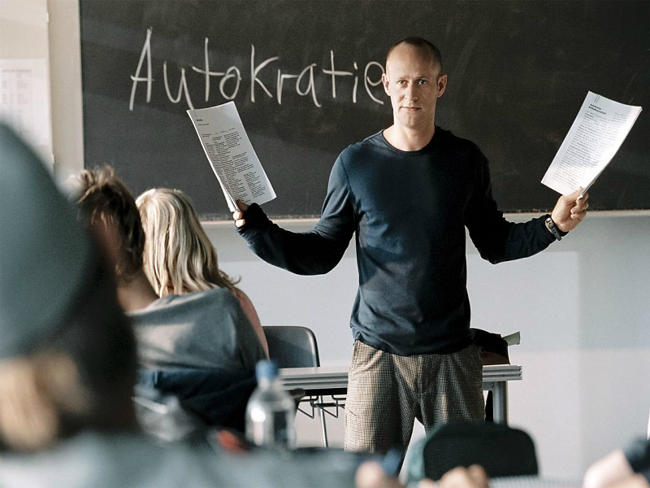

# 惡魔教室：狂飆年代的震撼教育

**紀律就是力量！****** **團結就是力量！****** **行動就是力量！****** ** ---------------****「浪潮」的座右銘**

筆者以前曾經看過一部描述北韓的紀錄片。在片中，一群西方的醫療工作者獲准進入這個神秘的集權國家，為當地民眾治療眼疾。諷刺的是，讓這些飽受病魔所苦的人 在一夜之間重見光明的，正是北韓政府口中的美帝惡魔。眼看人道主義只差一步就將突破冰冷無情的鐵幕，而和解也隨之來到，一切都像是溫馨感人的好萊塢通俗 劇。

然而，極為戲劇性的，這些人康復後的第一句話並非感謝醫生們，而是對著領導人的畫像鞠躬，流著熱淚訴說對於「偉大的將軍」無邊無際的景仰，感激他賜給他們光明及新生，並承諾將會努力的殺光全世界的美國人。

奇怪嗎？在二十一世紀，「集權統治」仍是一種真實的神話。而且不可否認的，這種憑少數人之力，就讓數千萬愚民伏首貼耳的駭人情景，多少也滿足了每個人心中那 小小的獨裁因子。我們都希望自己的想法能凌駕於他人，而所謂的「民主」，也不過是「多數集權」擊倒「少數集權」的過程罷了。

對那些生活在自由世界的人們來說，這個名詞更像一隻被監禁在鐵籠子裡的猛虎。我們被它兇狠的眼神及尖牙利爪所震撼，卻也讚嘆它的野性及力量。只要不放它出來，大家也願意預留一個的空間給它蹲在裡面，放在手心欣賞與把玩，順便想像籠子「不小心」被打開的話會有什麼後果。

人擁抱民主的自由，嚮往集權的力量。在德國導演丹尼斯甘塞爾(Dennis Gansel)的鏡頭下，電影「惡魔教室」(Die Welle)細膩的處理這種人性中的矛盾。他曾在前作「英雄教育」(Napola)裡描繪處於集權意識壓迫下的青澀心靈，這次他精準的拍下當代青少年特有的不安，以及在這個資訊速食化的時代裡表現出來的冷漠。一個平凡無奇的「集權體制」計畫週，讓他們敏感卻徬徨的生命，有了一個信仰的中心，卻也讓他們上了永生難忘的一課。

片中，一名左派的教師陰錯陽差的被分派到了他不熟悉的「集權政治」課程。正式上課之後，他發現德國雖然有著集權的歷史陰影，可是對於歷史的解讀，卻開始出現 了世代的鴻溝。對於生在和平時代的學生來說，這種課程不過是消費歷史，當作政治宣傳工具，不但意興闌珊，甚至相當鄙視。這名教師為了回應「德國不可能再出 現新的集權體制」的質疑，悄悄的進行一項模擬實驗。他讓學生親身體驗對領袖的盲從、思想制約等情境，在不知不覺中讓每個人聽命於他，貫徹對他的崇拜與信 仰，甚至成立了以他為中心的團體「浪潮」。

原本教師打算在一星期之內結束這個實驗，沒想到學生們卻相當的熱衷，甚至演變成校園內的集體暴力跟失控行為。最後，不得不挺身收拾殘局的教師本人，決定立刻終止模擬，防止「浪潮」的旋風繼續擴大，沒想到這個決策，卻帶來了無法想像的悲劇收場。

這個故事不是空穴來風。四十年前，在美國加州，這是一位叫做朗恩‧瓊斯(Ron Jones)的歷史老師曾做過的事情。而「惡魔教室」的劇情走向則比較接近陶德‧史崔瑟(Todd Strasser)根據原始事件改編的小說「浪潮」(The Wave)。 一方面敘述學生們如何面對信念的重組與崩解，另一方面刻畫這位有著街頭運動背景的教師，在化身為自己的「假想敵」時，處境上的荒謬。然而真正搶眼的主角還 是「浪潮」本身。甘塞爾用了不少篇幅，鉅細靡遺的敘述這場實驗如何技巧性的把學生們納入「浪潮」的羽翼之下。入木三分的各個環節，足以讓觀眾驚駭不已。

每個成員們並沒有被強迫接受命令，相反的，他們只需完成最基本的指示，漸漸去習慣服從的感覺，讓自己的聲音一天天消失。學生決定自己的制服、標誌還有名稱。 在教室之外也仍然有絕對的活動自由。然而這些自由決策的終極目標，卻是為了實踐「領袖」的個人意志。這種行為控制術堪稱是披著羊皮的狼，對一個在半世紀以 前用選票塑造出一個獨裁者的國家來說，更是難以掙脫的真實惡夢。

因此，相較於小說裡帶有一絲夢幻味道的美式樂天派結局，「惡魔教室」裡的教師勢必要用更加真實且暴烈的方式，來粉碎這一場鬧劇，在所有人看清現實之前，先將 夢想高高舉起，重重丟下，狠狠的碾碎它。這也促成了結局前那一場極富張力的演說，而我們也更能理解，那一個瘋狂的熱衷於「浪潮」的學生，是如何在「浪潮」 裡找到自己的存在感，又是如何見證一切的幻滅，最後舉槍了結自己的生命。如此慘烈的收尾方式，是小說裡的諄諄教誨難以相比的。

不過，這個異於原著的結局雖然合理，另一方面卻反倒表現了甘塞爾對這個主題「重重舉起，輕輕放下」的處理方式。

表面上，這個殘酷的事件隨著教師被警方逮捕，劃上了一個驚愕的收尾，更有一種因果報的味道，但是它留下來的是「創傷」大於「思考」，沖淡了之前甘塞爾努力想 表達的道德兩難，而將電影的邏輯簡化為了「不可玩火」的道德訓誡。無論是舞台上的師生，或者是舞台下的觀眾，對那一個怵目驚心的彈孔的印象，絕對大於之前 所有「浪潮」實驗的流程。到頭來，「惡魔教室」終究如同中文片名，被還原成了一部心理驚悚片，而無法激盪出更多的思辯了。

http://www.wretch.cc/blog/cerberus71/21724797 

採編：黃馨儀 責編：余澤霖
