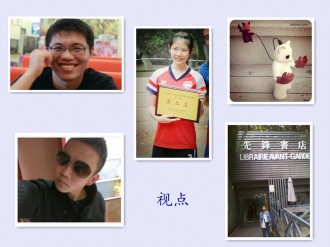

# 我与北斗 ——献礼北斗五周年特稿

铁打的北斗流水的编辑，五年来，志愿者们换了一拨又一拨，然而正是这些辛勤又充满激情的志愿者使五周年成为可能。在北斗五周年之际，现任的视点微语编辑们写下他们与北斗不得不说的话（还不是因为责编在催促！），作为本周特稿奉献给大家。生而不易，愿同摘星，我们愿一同陪伴北斗，度过今后的许多个周年。

【瓢虫君周日·阿赟】 

了解到北斗有一年半，加入北斗半年多点。

2012年8月山城的酷暑让我脑袋一热，发了以前写过的一些文字和简历,另附一些奇奇怪怪的平时不会说的话——大约北斗的魅力就在于它有本事让我有说某些话的冲动。不记得过了几天，突然收到邮件，被北斗收了！不可谓不惊喜O(∩_∩)O既为自己能与斗内众大咖有了一个共同身份而欣喜若狂，又为自己在共同身份之外与众咖差距甚大而惶恐。

斗内学新闻的并不占多数却对时事有很高的关注度和独到见解（如有异议敬请参见北斗网各专题[/](/)）。

斗内众人遍布各省市国家地区，比如开会时常有斗人的声音从资本主义国家传来，比如某天我要打电话提醒四正童鞋哪天该他管理瓢虫君主页，突然发现这货身在宝岛而俺木有开国际长途o(╯□╰)o……

一直觉得大水群里的备注是门大学问，你看我随手复制几个“魔都砖家王小皞”，“PC不要注撸生”，“被玩坏的小和尚”，“出师未捷钱黄配”（一不小心复制的都是七字部……）

北斗内部还真成了几对好姻缘真真是极好的，恭喜也叔啊刘老湿啊以及未来可能勾搭成功的谁谁和谁谁~~

作为一个围观远远多于发言的小斗人，俺只做了一只小小的瓢虫君，与瓢虫君的另外6位分身一起，哪里需要俺们就往哪里飞！

在寄给其他斗人的明信片上还有俺手绘的小瓢虫噢耶~

 【瓢虫君周一·金恺迪】 

张力，张力，是一种活着的表情，惊讶和暴怒、阴冷和狂热、虚与委蛇和推心置腹，离开了观众，生活的张力也就随之而去了。这世上没人是彻底为了别人活的，但也再没人能带着三本书躺在铁道上任铁轮碾过了。我们有时候知道怎么去定义自己，但是为了观众，不得不入戏地做很多年名词解释，解释自己生命的张力。个人的故事永远比符号和标签更重要，给别人展示的数字的背后是一张张真实存在过的脸庞，有血有肉，有酒有朋友。

加入北斗已经超过17个月了，也许这样的时光的意义只在于，之后你在唱起歌或者喝完酒之后，跟朋友们哭哭笑笑的时候，可以有故事可以说。

但是至少在这里，理想主义没有彻底地死，有人愿意读书并把网络变成靠谱的读书会。

至少在这里你得到猎奇的惊叹，不会多过共鸣的震撼。

在主站有过一篇文章露面，瓢虫也许偶尔让我来卖个萌。

但是显然，我们活过，逼格不高，星星却也并不好摘。

5周年，北斗，我们还得活着。

 【瓢虫君周二·曹雨晨】 

对我而言，去年底真是具有挑战性的一段时期——我几乎同时成为了一个手足无措的大一新生和一个手足无措的北斗新人。

加入北斗，完全是因为一个师兄，不知道当时他拉我入斗有多少拉壮丁的意味，反正没过多久他就似乎挺后悔了，我呢，发错状态被骂得狗血淋头，编辑错日志被骂得狗血淋头，不善于融入圈子被骂得狗血淋头。我说师兄啊师兄，在靠谱青年——你——的领导下，我一定会努力成长为一个靠谱青年的。于是在一地鸡毛和一滩狗血间，手足无措的我总算也感受到一些意义，体会到一些成长。

刚入斗时看的新人手册有句话大概是这样说的：“有趣的特质在工作团队中只是加分项工作......只有靠谱的工作，才能赢得尊敬与喜爱。”对这句话我一直印象颇深，作为一个刚入大学的、才情稀薄的、又自诩有些理想主义的孩子来说，在思考人生的时候总是会拷问自己：我是谁？我能做什么？我能做到怎样？而真正要弄清楚这些虚幻的问题，最实质的办法还是把自己投入到具体的工作中，把理想分拆成具体的事务，这才能认清你的想象力如何、你的践行力如何、你面对突如其来的事情到底是怎样的态度、你离靠谱青年到底多远、你的理想主义到底是什么。

有机会加入北斗非常幸运，北斗是一项具体的事业，在不甚良好的环境下，它实实在在干了五年，不管面临什么挑战，它坚韧不拔地坚持了下来。这不是干劈情操空谈理想这么简单的问题。在把理想主义者投入到具体事务的过程中，这些可爱的人们获得了丰富的经验，强大的心里素质，甚至于插科打诨这多大事儿的"笑谈人生"的方式方法。于是当有人说，这些理想主义者最后还不是成为削尖脑袋钻体制的投机分子的时候，我可以说，这些人已经坚持了五年，你没理由说他们不可能再坚持五年（我们还要庆祝五百周年呢）。加入北斗、参与北斗，可以一同在这个操蛋的世界里为理想主义寻找些许经世致用的意义。

于是我终于不用在不想起床的时候躺在床上干巴巴地思考人生。当师兄对我说，真不知道你加入北斗是干嘛的，我也能厚着脸皮嘻嘻嘻了。

【瓢虫君周四·刘力菲】 

想起我第一次与北斗的遇见，是几年前北斗在人人上被广泛封杀的时候。所以禁忌与好奇心是促使人去探究的最好动力。那时我点开了北斗的主站——比起现在的主站要简陋的多。都是一些先锋思想又不扭捏造作的文章。那时的我刚刚脱离高考的阴影，不知道自己该读些什么。只觉得摘星星的孩子们，他们想的做的都比我们这群普通同龄人多。

我的大学，就是在三个专业里徘徊，每门都不能说精通，但时常觉得学不致用，加上别人时常投以怪胎的眼光，十分不爽。在北斗的日子里，我这样一个矛盾体，却可以接手各种各样杂七杂八的工作，一切似乎也挺和谐。写过广告，当过美编，乱入过撰稿人。虽说每次安排工作我都陷入无尽的混乱里，可是人最怕的就是对一切事物的未知，包括自己。非得给小海豹一个定位的话，那么就是北斗的万金油好了。

这样一个万金油，竟是被12年的精选集拐骗来的。那时因为精选集我认识了对我来说很重要的一个人，从此也造就了“精选集可以把妹”的传说。单单的精选集不能用来把妹，还得对的上眼。单单冲着理想我不可能来北斗，当然还得因为这里有一群我喜欢的小朋友。我们每天为了理想被黑并自黑着，你问我理想是什么，我也不大清楚，大部分摘星星的孩子估计也不能给你一个完整的答案。也许理想对于我们来说，度过这样一段迷茫的时间自然拨云见日，而在这过程中有诸位陪伴，总是最好的。你问我理性和灵魂哪一个更远，我会告诉你我们不会在其中取舍，只会两方面都尽量完备。北斗做不到让每个人都喜欢，但是只要每天都有人点进去看看，那便是它作为门户网站存在五年的意义。

更大的收获是北斗在我的家乡和学校两地都给了我很好的同伴。无论是回家还是上学，我总能遇到一起工作的同仁，永远有说不完的话，关于北斗或者是和北斗毫无关系的话。上海的老刘问“怎样调配一杯自由中国的鸡尾酒”，在武汉的读书会上大家就给出了答案并喝到了最终结果，虽然有人喝了之后欢欣鼓舞有人喝了之后说这个国家不会好了。每个人的偏好与这个世界的潮流永远都是不可控的变量，某姐姐那句“且让生活如烈风”，在我这种俗人脑中的理解就是，不管周围环境怎样操蛋的变化，好也罢坏也罢，自己的头皮先硬起来，闯进去呼啸一下再说。不管你见到我的反应是“哇！斗人。”还是“哎？斗人？”或者是“呸~斗人。”，我都会对你微微一笑，转过头去自娱自乐，说想说的话，做想做的事，深藏五年功与名。

【视点编辑·张山骁】 

从QQ空间到人人微博，可能每个人都有被“白岩松和小日本打了个赌杨幂要是整容了集齐三十万个签名就抵制家乐福不承认温爷爷好可爱一定是处女座不顶不是中国人”刷屏的经历。可想而知，当我遇到北斗，知道还有一群人在充满戏谑的网络世界还能保持理性认真的态度时有多么惊喜。更妙的是，这群人在认真之余丝毫不端着什么精英分子矜持的架子，简直没有什么节操可言。

入斗时，刘一舟说进北斗重要的是你在里面参与了融入了，锻炼了自己的能力，和北斗一起成长了。我觉得确实是这样，在国家机器面前，在整个社会氛围的基调下，个人或组织无论做了多少自认为多么了不起的事情，最后往往被证明是无足轻重甚至可以完全忽略的。

北斗力量有限，做不了什么了不起的大事，也受不起或黑或粉扣上的高帽。但只要能和大家一起成长成熟，只要能为读者带来哪怕一点启发，我们所付出的一切都有了意义。

 【视点编辑·郑浩】 

每天没事的时候就看着水群里各种开黑，各种胡侃，各种有趣，我想这大概就是青年人的真实生活，他们消解现实，解构社会，把每一个生活的细节都凝聚在平时的嬉笑怒骂里。那次看到北斗聚会的事情被一些不可抗拒的力量所阻碍，他们还是那么的乐观，对生活充满热情。有时候在想现实残酷和黑暗到底是否和想象的有多大差距，最后其实自己睡着了，就不用再想了。那天晚上实在睡不着觉，从加入北斗，成为一名新编辑，一直以来渴望着或者说是十分的期待能够做点什么，为了这个我们年轻人的平台付出点什么。找不到存在感，或许这是一个慢热的闷骚男必经之路，或许有点操之过急，便翻身写下《大半夜说说心里话》，很快就收到了他们的帮助和建议。做公益，把理想当做现实的一种努力的信念，其实在很多时候我是不愿意相信的，但是自从开始加入这个群体以后，开始理解我其实需要相信一些美好的东西，这是支撑做事的支柱。

那天，新一期的北斗视点稿子终于发了，从头到尾都是我编辑组稿的，第一次在北斗上看到自己的名字，确实相当的兴奋。有老人说第一次都是这样，哈哈，我当然理解这背后的东西。以前把所有的事情都当做是一种生活的体验，一件件的去做，只是为了自己提高。突然进入到一个圈子，接触一群好玩的人率真的人，就开始享受乐趣，这其中的乐趣或许会慢慢的越来越多的。我知道这一群人的热情永远会延续，当然谁也不敢给永远打包票的，我只是相信我看到的。

精选集的事情巧遇五周年被掐死，大家还是一如既往的乐观，生活还在继续，大家都还在为了一些东西付出着。我想这大概是我加入北斗以来的意义和体会，我一直在寻找生活的方向，或者说这些稍显矫情，但就这样。不管是那些热爱北斗的还是黑北斗的，我只是想说，这里只是让大家看到其实平等和自由让我们更美好。

相信自由和守望理想，北斗加油吧！

 【视点编辑·李靖恒】 

我去年11月左右加入北斗，在七星视点当编辑。以前从来没有接触过编辑这种工作，所以写出来的东西往往目不忍视。很难说在我在写作过程中有什么收获，如果有，那最大的收获就是发现自己其实挺肤浅和无知的。

有时我写稿不但哗众取宠，还很矫情。写稿时写着写着忘了自己写的应该是时评，开始抒起情来，结果没有把读者感动，倒把自己感动得半死。所谓“编辑滔滔不绝，读者失去知觉”。所以在此要感谢北斗的各位同事，因为他们本着“重在参与”的精神将我写的惨不忍睹的文章发到网站上去。如果没有北斗这个平台，我写的东西永远都是自娱自乐。

其实我在北斗还学到了一些其他的东西，能够在目前的这样的环境下还能看到这么多人投身于人文这种事业当中，这也算是王小波同志所说的“反熵”现象了。

祝北斗5周年生日快乐，希望北斗以后能够更加的精彩，将这种“反熵”事业坚定地走下去。

我可能要退出北斗了，这篇短文也算是简单的总结一下。

 【视点编辑·王昊伟】 

2011年我加入北斗前，我以为自己很清楚北斗是做什么的。我想象中的北斗就是一群文艺青年在一起，写点小资文章，不明觉厉。所以我的一个基友拉我进来管理瓢虫妹的时候，我觉得自己很难胜任这个工作——我是个标准的宅男嘛。

后来很长时间我在瓢虫妹管理媒体之窗栏目。

后来又进入技术组负责沟通日常工作。

再后来在线下沙龙帮忙打杂。

北斗五周年，我经历的其实也就只有这两年而已，没有经历前三年对我来说是一个遗憾。这两年阅读量的积累基本都和北斗和“贵圈”有关，在这里，可以找到硬邦邦的干活，也可以找到湿嗒嗒的私货。

因为认识这些斗人，我的生活也发生了一些微妙的变化，这是件幸运的事。我很少在QQ上和同学聊天，和斗人却很聊得来，我们没有因为网络的距离而产生陌生感；学生组织我一个也没参加过，但对北斗人组织的活动很感兴趣，虽然我的前两次斗聚都因为各种各样的奇葩原因错过了。有时我甚至不知道自己是认同北斗的理念而做志愿工作，还是认识这些斗人而去做志愿工作。

无论我自己是否完全认同北斗的理想，是否因为理想而被黑，有北斗这个平台供大家使用而我是北斗的一百多个志愿者的其中一个，就已经是一件光荣的事了。北斗五周年，希望我能看到他五十周年的那一天～

 【视点责编·刘迎】 

太好了大家都写这么多我作为总结就可以忍痛少写一点啦。

我在视点写的第一篇文章主题就是“喜迎十八大”，任务布置下来的时候我的心理感受是这样的：卧槽敏感时期在敏感网站上发敏感主题文章还要新人来写这是坑爹嘛？！

但是，作为新人，我自然是只能发表情卖个萌然后说“我会认真完成的！”想起来我也还是蛮认真，为了分析民众政治参与热情下降的原因，下载了好几篇学术论文，趴在社交网络上搜寻各路观点。可那时“十八大”关键词已经不能搜索，只好思索各种近义词查找信息，最终在和李靖恒商量多次后用一周左右写完了这第一篇文章。文中并无出格之处，都是社会已经认同的观点还被我们柔化处理过，因此对它不久后被和谐掉的事实，我感到可以理解又十分无奈。

北斗这五年，想必也经历过太多类似的无奈。因此在精选集和五周年的事情中，看到你们或表愤怒或显淡定，但仍能有序地安排后续事宜，丝毫没有绝望和放弃，我的确有些感动。在这个现实压力巨大的时代，即便是大学生，想要保留一点理想也是很难的，很幸运我遇见了你们；我喜欢听人讲斗内老人的故事，生活于我是有些平淡无奇，但我毕竟认识了一群有意思的人。

这个世界会好吗？我的答案是：会的。因为我们还在努力呢。即使事实上它不会变好，也许是更坏，但毕竟希望仍在。我自知能力有限，但还愿意和你们在一起，尽一点微薄的力量。窗外的的珞珈山青翠得厉害，我一边回想，一边写下这些话。我想我的大学生活并没有什么遗憾了。

[我说的和你想的是一回事吗](/archives/35787)—北斗5周年写给七星百科的话--北斗刚刚迎来5周年，七星百科这个当年的新栏目也走过了一年多的时间，成了名副其实的成熟栏目了。有的人问过，在北斗所有的原创栏目里，七星百科既不像七星说法那样能够完整清晰的呈现案例，又不像七星人物那样能够做出精彩的名人专访，甚至在原创性上，七星百科也受到不小的质疑。那么，为什么要做这样一档栏目呢？
