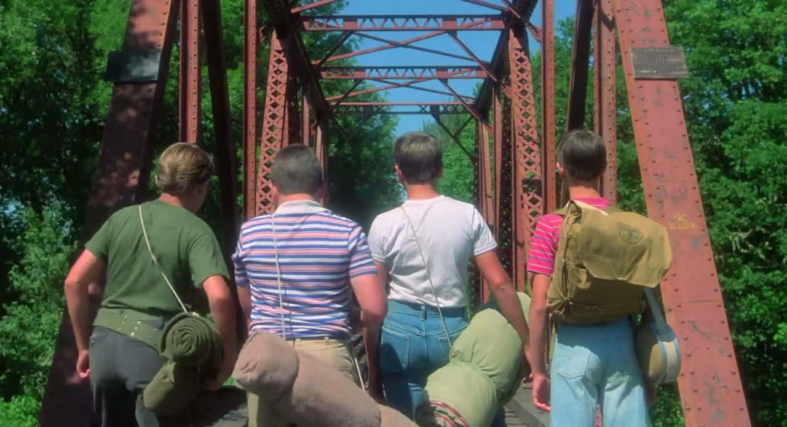

# 我们一起走啊走——《伴我同行》影评

《伴我同行》改编自史蒂芬·金的小说，和他以往的改编作品不同，本片有着天然的田园牧歌式的神气。导演是罗伯·莱纳，名字也许并不像斯皮尔伯格或者卡梅隆一样令我们熟知，但是提到他的电影却很少有人没有看过的。除了《伴我同行》之外，《当哈利遇到莎莉》、《遗愿清单》、《怦然心动》都是罗伯·莱纳的作品。此外，作为一个演员他还在《西雅图夜未眠》里有不错的演技。而作为一个导演，他的电影，叙事娓娓道来，风格轻松惬意，随处可见的都是人生感悟的沉淀，极具个人风采。看他的电影，像是看夏日里最平静的湖面，你永远不知晓平静下是怎样的波涛汹涌，是如何酝酿着最深沉的情绪。

那是一个发生在夏天的故事，美国的夏日一如我们所能理解的，炎热，宁静，以及蠢蠢欲动。四个小镇男孩即将要进行一次远行。他们抽烟，打牌，粗口，他们努力得想让自己看起来像个大人，他们各自有自己的不幸，克里斯家庭不幸经常遭到殴打，泰迪的爸爸是个登陆过诺曼底的英雄，也是一个被关在精神病院里的神经质，维恩则资质平庸甚至显得愚笨，而“我”戈蒂，却是刚刚失去了优秀的哥哥，总被家人忽视。四个人出行的目的除了看死尸之外，还有“铁定上报”的幻想。那是真正的黄金岁月，战争的痕迹像是一抹影子飘忽不定，空气中弥漫着夏日特有的干燥炎热的味道，摇滚乐随处可闻，年轻人释放着无处安放的躁动和不耐。这个小镇很小却是他们以为的全世界，而铁轨则通向不可知的远方，像是哥伦布寻找遥远的印度，四个小小少年开始了他们的旅途。未知和新奇总是可以顺利地激起勇气，他们走在路上。

** **

和妹妹一起看这部电影，本是无意之举，却意外发现时间在不知觉中慢慢发酵作用。代际鸿沟往往从细缝开始，在很多我以为非常正常的地方妹妹却发出提问：为什么他们要抽烟，为什么他们出行却不告诉爸爸妈妈，他们去那么远的地方难道都不害怕的吗？妹妹今年10岁，真正是在网络社会长大的温室小花，住在高高的公寓商品房里，从来不知道邻居长什么样，过年的家庭聚餐在昂贵豪华却不一定好吃的酒店，平时玩的游戏也仅限愤怒的小鸟或者找你妹，同学朋友都住得甚远，即使住的亲近他们也有各种辅导班要上，学英语学绘画学跳舞学唱歌，唯一学不到的便是怎么去玩。我的童年是真正“玩”过来的，和电影中相似，我和我的小伙伴们也曾坏事做尽，也曾经步行“两万五千里长征”，只是因为听说家乡护城河上游有一个发电站，为了一看其面目，也是为了消磨无聊的放假时光，我们顺着护城河走啊走，烈日当空照耀，两岸垂柳依依，柳藤编的帽，狗尾巴草编出来的小狗小兔子，都能让让我们琢磨好长一段时间。最后饿了渴了，口袋里又没钱，同行的大哥哥拿出一张五块钱的假币到小卖部去试运气，结果立刻被揭穿。即使这也能让我们开心好久，那些年岁月正好，你爱唱歌我爱笑。

《伴我同行》本质上依然是一部关于成长的电影，虽然故事发生在年代遥远的美国，却丝毫不妨碍我们欣赏。可见真正的好作品，不论是文字还是影像，共通之处便是普天共享，并无阅历国籍限制的。我们每一个人都能从中找到属于自己的影子，不由回忆到自己遥远的少年时代。我们究竟是如何变成了现在的模样，记忆里的那个羞涩腼腆的少年哪里去了？他消失在一片绿色静谧之中，我们终于在那个夏日找不到他。在电影里我试图去寻找到底是什么改变了这四个小小少年，“闪火车”的游戏让泰迪感到了诺曼底的风采了吗？躲避火车劫后逢生让维恩变得更加勇敢吗？是戈蒂的“吃派大赛”的故事终于让克里斯敢于走出给自己画的死牢了吗？而戈蒂，是死水中的水蛭激起他重新面对自我，终于肯定自己的价值了吗？我不知道。我知道的是，当克里斯对抢夺尸体的艾斯说：“你得先杀了我。”当戈蒂为了克里斯举起手枪指向艾斯：“不，艾斯，我只杀你一个。”我分明知道他们和之前不同了，一样的身躯里住着不一样的灵魂。是什么让他们有这样的改变，这是属于这个夏日的四个少年的小小秘密，我们不得而知。关于成长，很多时候我们都是后知后觉的，我们变成了和预期不一样的人，我们成为了更好的自己。改变发生在不可预料的时光里，而时间是不会留下什么蛛丝马迹的。

这部电影在我15岁的时候我便听说过它的名字，和我知道瑞凡·菲尼克斯一样久，但是我从来没有看过它，算是刻意回避，像是有一本好书，一道极美味的点心，我总想着要沐浴焚香，要讲天气时宜，要静心凝气，才不算辜负了它，说到底是缘分没有到。如今看了，碟片在机器中发出翁翁声响，轻轻发出一声唏嘘，这等待终于值得。瑞凡·菲尼克斯让我目不转睛，本色出演让人着迷他的演技和个人魅力，那个有着女孩般忧郁的眼睛，干净利落的少年派头，已经离我们远去。“我的作品会比我这个人存在久远得多。”瑞凡在《伴我同行》之后说，他敏感地觉察到自己的天赋，这比恭谦有礼更让人心折，天才难道不应该是这样的吗？他因为自己的天才敏感成名，却在《我私人的爱达荷》之后，因为相同的原因离开这个世界。如果他还在，或许我们可以看到一个不同于莱昂纳多的兰波，另外一个《边缘日记》。终究是我们没有福气。上帝太爱他，早早便召唤他回到身边。

（编辑： 卢静；责编：王卜玄）
