# 我们在一起（一）

**⒈**

“为什么只留下我？”唐敏坐在帐篷里靠角落的地方，月光从仅有的两个透气窗口挥洒进来，把她的样子照得模模糊糊。

我先给自己点燃一支烟，然后起身把灯打开，帐篷里顿时亮了许多。唐敏用手捂住鼻子，她讨厌对她来说分外难闻的烟味儿。

“你适合这里。”我吐了口香烟说。

唐敏愣了愣，显然没能理解这句话的意思，她的手还捂着鼻子，我只好把刚抽了两口的烟灭了。

我站起身，对她说：“我先睡觉了，今晚你去吉姐家。”然后不理她还想继续说什么，径直出了闷热的帐篷。

 **2.**

[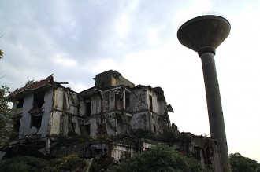](9e7bfc06-995a-4567-9019-b67ddfaa3479.jpg)

汉旺

08年5.12地震，我成了别人口中大难不死必有后福的幸存者，哥们儿几个见我安然无恙，便问我是不是回光返照了？没等我回答，他们就一人捏了把我的脸，惊叹道：“操，还活着！”

我先后在汉旺镇小学、东汽中学和天池煤矿家属区挖了几天尚存气息的伤员，后来便加入了背死人的行列，要换以前，估计早吓得拔腿就跑，不过那几天精神有点麻木，觉得生命比什么都要紧，便也没感到可怕。地震那几天又是下雨又是出太阳，为了防止尸体腐烂发生瘟疫，海军部队在离汉旺镇不远的武都山上挖了几个大坑，我的任务就是和其他的志愿者（当时还没志愿者这么一说，暂且这么叫吧）一起，把一具具尸体从废墟中背出，扔到卡车上，然后他们被运往万人坑，经过消毒后掩埋。

尸体挺沉的，为了省劲儿，我把尸体的两只手环在我脖子上，我的手则托着尸体的屁股，延火车铁轨朝广场搬运。两只被雨水浸泡得惨白的手在我脸上有一搭没一搭的摆动着，我想，要不是自己运气好，没被预制板砸着，说不定现在我就是背上的尸体了。

现在回想起来，当时的场景简直恐怖，跟鬼片儿似的。我不禁佩服起自己的勇敢来，面对困难临危不惧，一种大无畏的革命乐观主义精神从我心底油然而生。

5月13号上午，有军用直升飞机从汉旺镇上空掠过，所有地上的人都拼命地向天空招手，我们知道，解放军来了，这是要投放物资，可挥了半天手，直升机却只在上空盘旋了半分钟不到又向清平山方向飞去。

当日下午4时，大量警察集结在广场边东方汽轮机厂（简称东汽厂或401）大门口，半分钟后，警察把广场上的人群疏散到两侧，腾出通往东汽厂大门的坡道。我刚抬完一个伤员，凑过去瞧，有人说好像北京来大官了，我正想靠近点看，衣角被谁扯了两下，我转过头，是一个齐我腰高的小男孩，他脏兮兮的脸上眼泪纵横，我问他怎么了，他说他不知道妈妈去哪儿了，我问他是哪个小学的，他回答说是汉小（汉旺镇中心小学），我想了想，打算把他先捎带上，男孩突然喊着妈冲向后面一个深棕色女人，女人转过身愣了愣，没理他，我知道男孩一定是认错人了。这时，一批两个营左右的武警集结到此，分成两排，他们站在警察内围，形成两道牢不可破的人墙。人群顿时又骚乱了一阵，小男孩被人流带到了坡道另一侧，我想过去，但奈何也扳不过面前的人墙，只好尽量往前探着脑袋。约莫有半小时，迎宾路那边穿来警笛声，一辆中央军委牌照的轿车开道，后面跟了十多辆红旗轿车，其中夹着一辆米黄色中巴车。车队开进东汽厂，武警和警察立刻将大门封锁，人群中突然传出一个声音大喊着：“温家宝！是温家宝来了！”

人们开始欢呼，但见厂门内无任何动静，呼喊声渐渐小起来，广场上人头攒动，每个人都使劲向中间挤，人墙即将抵挡不住了，这时，车队从厂内缓缓开出，最后，那辆米黄色中巴停靠在坡道中央。

车门打开，七八个西装大汉鱼贯而出，一位身穿白色衬衫的老人随后从车内探出头，温家宝！

[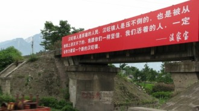](1b089cad-33da-43af-b6c5-fc6d0e3a8a30.jpg)

温家宝在汉旺

人群中顿时炸开了锅，试想在最绝望的时候，中央领导居然在如此短的时间内赶到，好比无尽黑暗中的一缕曙光让人兴奋不已。所有人都围向中巴车，抬起手臂高呼着“温总理！”

我发现有些年龄稍大的人居然满眼泪花，他们不住地挥着沾满血迹的手，一直没有停止。我也抬起手臂，大声呼喊着总理，这时心里除了激动，我觉得自己现在像是上个时代的红卫兵到北京接受毛主席检阅般，所有的阴霾从脸上一扫而光。温家宝在工作人员的保护下走到人群中，握着扩音喇叭，神色凝重地开始发表讲话，我心里想，不会又上政治课吧！温家宝说：“乡亲们，这场特大的地震灾害，让你们吃苦了,,,,,,你们有许多亲朋好友，失去了生命，我们从心里，为他们难过，我们会尽最大的努力，把可以救活的群众都抢救出来,,,,,,大家吃苦了，我向大家表示感谢！”

温家宝其中的一段讲话，最后被制成展板，悬挂在进入汉旺镇的路桥上。

总理坐车离开后，天空还飘着细雨，我在人群中找了很久也没再见到那个小男孩，不知道他去了哪里，是否找到他妈妈了。

[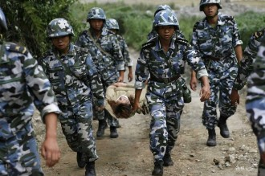](68d37b8b-2fb5-4ff2-b299-e3847acd47fb.jpg)

部队进入汉旺

一个小时后，第一批海军部队开进汉旺镇，随后源源不断有军绿色的身影充斥于这座人均收入超过一个平常县级市的西南工业重镇。乌蒙铁军开进清平山，大量官兵拥入清平乡，解救被困群众，汉旺镇到处都是十六七岁身穿橄榄绿的小伙子或背着小孩或搀扶着老人，他们开始在单身楼后的空地上集结。

我一个朋友从濒临倒塌的服装店里翻出几套衣物，给上半身赤裸的我扔了两套，我的短袖在背伤员时用来裹伤口了。朋友说迎春门那边枪毙了一个人，好像是那人跑银行里挖钱，被武警警告无效后当场射杀，我说你偷衣服怎么没被逮着，朋友说没事儿，毕竟地震后什么都没了，找件衣服穿没啥大不了的，当兵的不管。

5月14号深夜，汉旺发生了6级以上余震，河谷中刮出的风掀翻了刚搭建不过一天的救灾帐篷，甚至不少都被吹飞到广场的树上挂着了，部队立即组织群众撤离到安全地带。那天晚上，只见紫岩山和清平前山山峰突塌，整座山峰拦腰断裂，在两山之间瞬间堆起一座新的山峰，汉旺镇上空轰鸣不断。两天后，在海军陆战队官兵的帮助下，数十万群众被迫撤离广场，我家所属的天池集团公司帐篷区暂时迁到原农机厂前的空地。

5月15号上午，我听我爸的话，去了崇州（成都附近），高速路上，一辆辆挂着红标语的货车呼啸而过，我在轿车后座突然觉得自己应该留下来，但这个念头也只是一闪而过，随即昏睡过去，整整三天没吃什么东西了。我爸是天池煤矿的职工，从80年工作到现在，他知道如果他这一走以后的生活必定没有保障，因为很有可能会被矿部当作失踪人口列入赈灾范围之外，以前的养老保险等都会被取消。我在崇州呆了四天，期间看电视上全播的抗震救灾，没想到这次闹得这么厉害。我刚到崇州时洗了个澡，把满脸的灰尘泥土冲刷干净，搓泥的时候感觉背上有点疼，对着镜子一照才发现，臀部以上划开一道近15厘米的伤口，我小心翼翼地洗去粘在上面的脏物走出浴室。

后来舅妈进去洗澡，没过多久，我突然听见里面传来一阵惊呼，她打开门探出头，对坐在沙发上看电视的我说：“你背了一袋沙子进来嗦？里面到处都是。”我说那是头发上的，可能裤兜里也不少，应该是被埋着的时候筛着的。

晚上吃饭，电视上正在直播抗震救灾。当时是爆破唐家山堰塞湖，部队官兵和一些志愿者在映秀背负伤员，带领群众从水路撤离。

突然，一个熟悉身影从画面上一闪而过。我暂停口中的咀嚼，屏幕上，一个中央电视台记者拉住一位志愿者采访，这个志愿者正是先前那个，他叫钟兵（后来的帐篷小学女志愿者钟宾和他不是同一人），我的小学同学。我愣了愣神，继续吃饭。

第二天，我给几个同学打去电话，得知他们中有些已经去当志愿者，还有一些闲在家里，另外那些特爱学习的正在联系德阳的学校，希望能找到能接收自己的，毕竟高考逼近，事关人生转折耽误不得。我权衡了片刻，又给阿建打去电话，问张苗（我的初恋，但自作多情了）的情况，阿建在电话里告诉我他在浙江，关于张苗他也不清楚，按她的性格，极有可能是当志愿者去了。听到这里，我已容不得想太多，当下便决定，回德阳做志愿者，并极力争取机会和张苗并肩作战！

我告诉舅舅自己打算回德阳找学校读书，接着给我妈通话征得同意后他便答应了。舅舅给我拿了四百多块作为临时生活费，崇州呆的这几天，我认识了一个女孩，叫张霄，长得很漂亮，不过才读高一，以前我始终认为古代形容美女肤如凝脂一定是夸大了，现在一看，原来这种喻体是真实存在的。但张霄再漂亮也抵挡不了我对张苗近乎无可救药的爱恋，我乘上第二天上午通往成都的大巴车，转车至德阳。路上，有个女孩上来，坐在我旁边，很安静的女孩，自然卷曲的睫毛，休闲的打扮，最致命的是她穿着纯白的吊带裙，我竭力扼制住自己跳动的内心，一副大义凛然地姿态端坐着，时刻告诫自己即使守寡也不能心生邪念。

车窗外沉沉的阳光穿过，让人忍不住睡意上涌，没过一会儿，旁边这个女孩便晕乎乎地打转了，眼睛时睁时闭，车行驶的速度不慢，但总让人觉得是蜗牛在爬，没有一丝凉风，女孩的脑袋被车窗磕着了，她猛地睁开眼睛，甩了甩头，一缕发丝扇到了我脸上，不疼，有股洗发水的味道。她转过头看看我，我还是不动声色老样子，她索然无味地望了望窗外的景色，就一会儿，便又开始打瞌睡了。

女孩渐渐睡沉了，她靠着后垫，脑袋歪向窗外，似乎她怕脑袋被撞，中途把头正了正，慢慢向我这边靠过来。我开始紧张，像月经初潮的小姑娘般一动不动。那个卡着白色发卡的脑袋缓缓朝我的肩膀逼近，我激动得快喘不过气了，恨不得立刻告诉她，没事儿，哥我发扬助人为乐的雷锋精神，把肩膀无偿借给你使。

眼看就要挨着了，车身突然猛地一晃，女孩被惊醒了，原来是余震。我顿时失望透顶，女孩看看窗外，她整理了几下头发，眼睛睁得跟麻将里的二筒似的，我想这下没戏了，一股沮丧的情绪从心里喷薄而出，我竟然想抽烟。

可车内禁止抽烟，友情提示的标签就贴在我脑袋上方的车壁上。

女孩在广汉下的车，随后上来一位提着估摸刚放血不久的死鸡的老大爷，我无奈地靠着后垫，压抑了近一个多小时的困倦顿时让我身心疲惫，眼睛一闭，睡着了。

 **⒊** 

我是被大巴车司机推醒的，车上空无一人。坐我旁边的老大爷不知道什么时候已经下车了，我怎么没感觉到？我坐外边，他要出去一定会经过我，而我必须站起身他才挤得出去，可我却什么都不知道，莫非他从窗户跳出去的？想到这里，我真想抽自己一嘴巴，妈的，尊老爱幼的中华民族传统美德就败坏在我手里了。

我给林明超打去电话，他说他和几个同学在东电中学，我问是不是找到学校了？他说就是。我又问张苗在不在那儿，林明超说他也不清楚，但其他几个同学中有张苗的好友，她们肯定知道。我问东电中学在哪个位置，他说在火车站附近。我说我不知道火车站在哪儿，他说你找东方电机厂（简称东电）就行了。

挂断电话，其实我连东方电机厂在那儿都搞不清楚，只好一路走一路问，半个多小时，我终于到了，给林明超打电话，他说你快点来，在火车站站台上，随即就挂了。我想既然这么着急就破费一次吧，于是伸手招来一辆出租车，坐进去。

司机问我去哪儿？我说去火车站，司机愣了愣，想说什么，我打断他说，快点，赶时间呢我！司机也没再多说，油门一踩，车子‘嗖’的行驶起来，走了有一百多米的距离，车突然停下了，我一看，没堵车呀！难道是车子闹毛病了？他娘的怎么这么背，我正要说什么，司机却说，到了。操，这么快，没搞错地儿吧？我问司机，他指了指十多米外的站台说，那就是火车站。

我顺着他手指的方向看过去，果然，‘德阳火车站’四个大字赫然树立在上方，站台边聚集着二十多个学生模样的人，我一眼就辨认出中间那个淫荡猥琐的林明超。

我极不情愿地付了车费，然后朝那边大喊：“大爷我来了！”

 **⒋** 

接下来的几天，我们一群绵竹中学的人顺利被安置在东电中学，根据成绩划分，我在普通班借读。几个成绩好的女生进了重点班。08年年初休学前，我的成绩在班上名列榜首，年级前三十，后来会考结束，我打算回家独立复习，写了申请。我这样做并非认为在学校复习不好，而是自己实在难以控制住情绪，试想你喜欢的女孩就坐在一边，连话都说不了或者不敢说，能安下心来搞学习吗？这就好比拉屎的时候旁边站着个人仔细端详你的下体，尴尬至极。

我在家也没坚持多久便偷懒了，除了吃饭睡觉就去上网，课本再也没摸过，为了上网，我甚至去网吧做了网管，一来随时能上网，二来每月还有钱拿，直到5.12地震。

东电中学负责我们生活学习的是教导处明桂清主任，肥硕的躯体看着都吓人，鼻梁上架着一副黑褐色的带框眼睛，活像只大熊猫。他询问我们学习成绩时，我撒了个谎，说处在中游，本来想说下游的，怕他会因为这个把我赶走，照理说，我的成绩上二类本科是没有问题的，一类本科还有很大希望，但我不喜欢呆重点班里，那种尔虞我诈的氛围我适应不了。最主要的原因是听说普通班漂亮女孩多，我便不假思索地欺骗了这位姓明的人类灵魂工程师。

有次一个干部模样的人到学校找明桂清，他问我小明在哪儿？我没反应过来，小明？难道这位是小红或者小华？我仿佛回到了小学语文课本上，我说，小明去公园玩了，老师让他写一篇200字以内的作文。

起初因为余震频繁，宿舍楼不能使用，我们被安排在食堂打地铺睡觉，去舍管那儿领了棉被和褥子，我从那几个女同学口中探清了张苗的去向。

5.12地震发生时，张苗是反应最慢的一个，她没有选择从楼梯逃跑，反而抓住几个试图跑出教室的同学躲进了墙角。地震暂时结束后她才匆匆跑到足球场。我问她们张苗当时哭没哭，一个女同学说哭了，不过没其他女生厉害，但也有人说没哭。我听得倍感无力，这么简单的问题都会产生分歧，不管哭没哭，反正事情都过去了，但我还是忍不住幻想了一下，如果当时我在现场，我一定冲过去先拉着她再跑，说不定她一感动还真跟我了呢！但命运就是这样，不是你的，你怎么努力也是空手而归。

我从她们口中了解到，张苗现在住在德阳一个亲戚家，没有去当志愿者，本来是准备和他们一起找学校读书的，但听说我也跟屁着来了便又拒绝了。

我读的班级是四班，也是听别人说美女最多的班级。我鼓着眼睛转了好几圈也没见着几个，她们大多化过妆，睫毛拉得又长有卷，涂了唇彩，甚至有画眼影的，我看着就难受，我不太喜欢女孩没事儿就往脸上抹粉，一亲就是一嘴灰，而且我还有过敏性鼻炎，灰尘一进鼻孔就禁不住地喷嚏。

我们吃饭是在学校的另一个小食堂，卖五元钱一份的套餐，和绵竹中学三块钱的套餐质量差不多，我不禁感叹稍大点的城市物价就是他妈贵啊！东电中学无偿给予我们几个每周50元的生活费，为了省钱，我和周微几个通常是去校门外的小店吃，早上吃豆浆稀饭，头一次吃就上瘾了，味儿特正，路边还有买肉饼的，叫千层肉饼，卖饼人实在，肉是好肉，饼里也夹得多。

在东电中学呆了快一周，几个成绩较好女生打算离开这里，我问她们干嘛去，她们告诉我，绵竹中学借用了德阳三中的教学楼，现在已经开课，她们觉得还是在母校里复习比较好，准备回去。我问其中一个人张苗是不是也在那儿，她点点头，又问我用不用一起去，我想了想，说不去。

但我还是忍不住了，我偷偷约了几个4班（我在5班）的哥们儿，坐出租车到德阳三中，我想去看看，并不打算在那边呆下去。车行刚行出路口就停了，车窗外喇叭轰鸣，我操，这次是真堵车了！我打开窗户往外张望，只见街道上所有车停止了行驶，路上的行人也停下脚步，默不作声地低着头。司机说，今天是默哀日。

[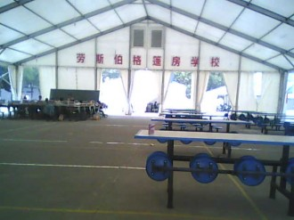](a4467ec7-ed46-4a64-a40a-0e0dd0780260.jpg)

安置在东电中学操场上的临时帐篷教室

两天后，东电中学接到十多顶帐篷捐赠，是白色医疗帐篷，保暖但不隔热。我们从食堂搬了进去，同时搬进去的还有该校原住校生，另外几个是绵竹市南轩中学的高三学生。南轩中学算是绵竹中学的兄弟学校，但两校在教学质量上的差距相当大，我高一混时认识不少南轩中学的痞子，那所中学几乎每周都有好几场群架，规模大小不同，但已经走上了产业化道路，紧扣以经济建设为中心，响应国家计划生育号召，打死一个少一个，对缓解祖国人口压力作出了巨大的贡献。

我甚至听说有人竟然敢在教室后面放清洁工具的房间里做爱，互摸都成了课堂里必不可少的娱乐活动。我不禁哑然，对当时在感情生活上处于社会主义初级阶段的我来说，简直难以置信。

南轩中学的几个有周微，李田和刘衍妙，还有两个我忘记名字了。我和他们分到一个帐篷里，刘衍妙是李田的女友，理所当然被安排到女生帐篷那边。帐篷是由几个志愿者工人搭建在操场侧面的草坪上的，下午又运来几卡车气孔砖，全部住校生被拉去搬砖。

砖是用来放帐篷里垫底的，防止湿气上来对身体造成伤害。我和几个该校的高三学生大汗淋漓地站在卡车上卸砖，忙活了两个多小时才完。我擦了擦脸上流水似的汗，喝了口同学递上来的矿泉水。

这时，我的视线被不远处一个淡粉的身影吸引住了。

她扎着马尾辫，手里提着画有漫画的大袋子，从宿舍楼边经过。刺眼的阳光下，那被粉红色短裤包裹外的皮肤显得洁白似雪。由于距离较远，我没看清她的相貌，反正挺瘦的。女孩穿过礼堂，消失在我的视线之外。在片刻之间，我原本因为没见着张苗而抑郁的心里顿时容光焕发，我第一次对除了张苗之外的女孩产生强烈的好感，而且这一切只发生在短短的几十秒内。

 **⒌** 

通过一番排查和摸索，我终于搞到了那个女孩的名字和手机号码。女孩叫江敏明，读隔壁五班，住校生，竟然和刘衍妙睡在同一个帐篷里，我决定从内部攻破，而当时，张苗早就已经被我忘到九霄云外。

当我准备把想法告诉刘衍妙时，突然觉得这样太唐突。不如先认识了，再步步为营循循善诱。我破天荒地给手机充了值，记下第一条短信：我想追你。

这四个字是我憋了很久才憋出来的，之前那些什么你好呀，我们做个朋友呀，什么的一大堆都被我一个一个否决了，太他妈土了，就四个字多好，点名主题思想，既不唐突又不过分委婉。

“你是哪个？”她回信说。

郁闷，居然忘了她还不知道我这个人，我说，我是杨侑。

之后，我和江敏明理所当然地交上了朋友，但仅限于手机短信上。这时，我充分发挥出自己胡吹乱侃的本领，一路上披荆斩麻，胜利的曙光在我梦里已经快要出现了！我像夜店里的雏妓一样没事儿就偷偷摸摸东张西望，四处搜寻江敏明的踪影，我不知道是不是心理作用，反正一见到她毫不修饰的爽朗的笑我就开心。那几天自己的心情就像是提前迈进了小康社会，别提多带劲儿了。

但周微说的一句话犹如一盆发臭的骚尿溅到我脑袋上，“你觉得她会喜欢你吗？”

“她有男朋友？”我问。

“我只是听说有过不少人追她但都没成，我甚至还听说她在外面有好几个男人。” 

我顿时傻逼了。

那天晚上我抽了很多烟，脑海里回响着周微说的话，是否属实现在还不清楚？我不停地给自己找理由来证明他是错误的，我甚至把周微想成是有预谋的敌对分子，在挖我社会主义的墙角，阻碍我和江敏明历史的进程。我心里乱了套，我不知道下一步该怎么办？

突然，我想起了张苗。

记得以前我一旦有什么心事总是会倾诉给她，而后来从我喜欢上她开始，见面打招呼都成了奢侈，我没有一个可以询问的对象，我只好一支接着一支地抽烟，抽到呛喉咙。

江敏明给我发来一条短信，问我周微这个人怎么样，我犹豫了会儿回她两个字，还行。江敏明说她好朋友喜欢上周微了，我对此不置可否。

[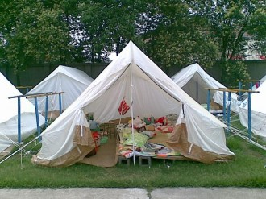](397be2b2-01c5-4eb9-ba66-42233573e8e8.jpg)

江敏明住的帐篷

第二天晚自习上到一半，外面下起了瓢泼大雨，我坐在教室里对着历史课本发呆，前面的唐琪转过身，问我一道题。接过卷子，也是历史题，我暂时把情感抛到一边，梳理了一下思路，把这道材料分析题从头至尾地给她作了详细的解答。

“你这么强！照你那样写肯定就满分了。”唐琪满脸惊喜。

我默不作声。

“材料题就是抢分的，你历史一定很好吧？”唐琪又问。

“他就是历史天才，除了混日子的外，他是看历史书看得最少的，但是成绩是全校最高的，甩第二名重点班七八分，没人上过90，他一来就是96。”马脸在边上插嘴。

唐琪兴奋地把椅子挪近我，话匣子跟厕所开关坏掉的冲水龙头一样，停都停不住。面对前面口水狂轰乱炸，我实在抵挡不了，开始有一句没一句地接她几句话。堵不如疏，先哲的理论果然有预见性。唐琪是该校生，一身弄潮儿打扮，露乳沟的吊带，短得勾人魂魄的裤子，头发是烫过的，身上喷有香水，味儿不浓。用李田的话来说，就是一身骚情。

后来有人说唐琪喜欢我。“傻子都看得出来。”李田说。

下了晚自习，我和周微李田几个冲进雨水中，跑到帐篷时身上已经湿了大半，不过幸好是夏天，一晚上就干了。我脱下浅蓝色的T恤，把水拧了拧，挂在帐篷中的杆子上，和几个同志抽了烟，纷纷钻进被窝。

我想好好休息。

手机振动了两下，我从枕头下面摸出来，是江敏明的短信，她说天上打雷了，她怕打雷。我说没事儿，用被子把脑袋捂着，插着耳机听歌就不怕了，回过短信，我等了两分钟，见再没短信，也想睡了。

不到两分钟，我隐约听见不远处有女生尖叫什么，紧接着手机又开始振动了，江敏明打来电话，我们第一次说话，每分钟一毛钱。江敏明说她们帐篷漏水了，我说你等等，我过去。这时周微也醒了，他和我一起套上未干的T恤，冲进依旧倾盆的大雨中。

我和周微跑到离篮球架侧第二个帐篷，门帘虚掩着，江敏明在里面探着脑袋，两只手捂住耳朵。我仔细查看了一下，原来是一个脚钉脱落了，侧面的篷布虽然看起来被风刮得摇摇欲坠，其实根本不可能出什么问题。我蹲下身，把脚钉重新固定好，周微找石头压住掀出缝隙的篷布，我们这时浑身都湿透了，我走到帐篷门帘前，江敏明乐呵呵地说：“还不赶快回去，淋成落汤鸡了。”我点点头，正要往回冲，听见背后她冲我喊道：“杨侑！谢谢！”我边跑边转过头笑着摇摇脑袋，示意没什么。

那天晚上，我脱了个精光，窝在被子里和江敏明发短信，我说我正在裸睡，她说她也是，我说我其实不爱裸睡，只是不爱穿内裤，她发过来一张笑脸。

第二天起床，周微感冒了，我屁事没有，只是穿着半干的衣服总觉得别扭。但这丝毫影响不了我的好心情，我想，这就是爱情吧！

我和江敏明的关系在那之后有了质的飞跃。

江敏明后来告诉我，我和我同学刚来东电中学时，她们就开始注意了，好几个都觉得李田特有型，可惜身高矮了点，江敏明的好友问她，觉得哪个看着顺眼，江敏明扫了一眼当时正在郁闷着没见到张苗的我说，就他。

夏天蚊子多，我们几个身上都大包小包的肿成一团，周微怂恿我去女生帐篷那边要蚊香，我没想就答应了，我叫了江敏明一声，她从帐篷里出来，问我什么事，我说我要蚊香，她给我拿了一盘，并告诫我，这不是给的，是借的，借一盘还一盒。我笑着说，没问题。

周六，我和周微去市里一家网吧上通宵，身上所有的钱仅够通宵钱外加一瓶矿泉水。我给我妈打去电话，让她第二天送点生活费过来。

通宵后，我拖着沉重的步子僵尸出行般走出网吧，周微买了两张饼，一人一个。江敏明发来短信问我干嘛，我说我刚上完通宵，她说她在上网，想进我QQ空间看看我写的日记，我说里面什么也没有，她说什么都没有还加密码，我说我日记只写到百度博客上，江敏明向我要了博客的地址，并约定下午来陪我。

上午，我妈把两百块送到，我怕她打听到什么于是敷衍了几句，把她硬塞走了。我躺在帐篷了睡了会儿，并调上闹钟，怕误时。中午起来我又破天荒洗了头，换上一套新买的衣服，坐在教室里，等待电话响起。

这一坐就一直坐到下午3点，周微和一个女孩并肩回来，那个女孩便是江敏明的好友，原来他们已经好上了。周微问我闲着干嘛呢，我说等人，他会意地笑了。女孩扔给我一块巧克力，又和周微腻在了一起。

我想给江敏明打电话，但一想又算了，也许是有事，打过去说不定还会让她感觉烦，不如再等等，要是到5点还不来就不等了。可没过几分钟，我思想斗争正激烈着，手机就振动起来，我站起来四下张望，没人，我看是短信，于是打开。

江敏明的这条短信，有好几百字，刷新了两遍内容才全部显示出来。短信中说，她看了我的博客，里面好多都讲的一个叫张苗的女孩，她觉得我好爱张苗，她一直不相信会有男生会这么爱一个人，但现在信了，她不想我为了这个而把那个追求了两年的感情放弃了，所以她经过反复思考最后决定从此和我不相往来。

我这回真傻了。

我他妈怎么没想到博客里写了那么多事情，真他妈上网把脑袋给上晕了，我狠狠的扇了自己一耳光，牙齿生疼。周微这时候又过来，他说他要和她去东湖山公园玩，问我去不去，我说不去，那个女孩笑着说，江敏明也在噢，我愣了愣，摇摇头。

 **⒍** 

我记得那天我抽了很多烟，后来竟然开始呕吐，我为了一个女孩而哭了。如果说张苗把我改变，那么江敏明便是彻底颠覆了我。几天后，我删掉已经听腻了的《看不见的风景》，编了个理由，给东电中学教导处申请离开。

走的那天，我去东电中学前的小店喝了最后一碗豆浆粥，一张千层肉饼，然后找了家网吧，上网关闭了百度博客，揣着一包新买的08娇子和一张车票，搭上回绵竹的大巴车。

 **⒎**

我回绵竹的时候已经距离地震快一个月了，天池煤矿把灾民安置点设在柏林公园，之前听说过，政府给灾区发补贴，凭身份证和户口簿领取，每月300块。六·一儿童节那天我在汉旺镇中心广场的一个办公帐篷接过救济款，那天广场上人山人海，数十辆大巴车装载着鲜花、书包和文具停靠在东方汽轮机厂坡道上。侧面是5.12钟楼，两侧摆满了绚烂夺目的盆栽。八一制片厂趁着机会在人群中抓镜头，一群陌生人热情四溢地把书包和鲜花送给前来排队的小孩，领了东西小孩出不去，路被媒体记者团团围住，闪光灯咔嚓响个不停，有几个年龄稍小的孩子急得哭着喊妈妈，奈何也没人搭理他们，媒体的镜头又通通转向那些满脸笑容的小孩。

六一儿童节那天下午，王阿姨捧着儿子的遗像和一本相册也去了广场，听说有韩国总统来，她想那肯定有中央领导陪同，她说她想讨些说法。然而，一大群和王阿姨一样丧子的女人被拦在东汽厂门外，她们的子女无一例外都是汉旺镇中心小学（简称汉小）的学生，四层的教学楼地震中仅几秒功夫便倒塌，无数生命被砂土活活掩埋。汉小前身是天池煤矿子弟校（简称子弟校），汉小在中街一带，因为其教学楼质量检测不合格，就租下已倒闭的子弟校，继续办学。子弟校建于70年代末，我学前班就在那读的，后来才进的当时还在中街的汉小。楼板不过七八厘米，在上面走路都有振动，墙壁残旧不堪，楼前是个小操场后面是大操场，离教学楼仅1米5的地方树立着一根旗杆。

地震发生时，学生惊慌失措地通通涌向楼道，很多才跑到一半楼就塌了，有些胆子稍大的又在顶楼的，干脆纵身跳到旗杆上滑下去，剧烈的晃动使旗杆不堪重负，不少学生当场就被甩向地面摔死了。很多丧亲的家长认为过错在于学校，对质量检测不过硬，子弟校教学楼质量明显还没原汉小教学楼质量高，于是她们聚集在一起，想向前来视察灾情的中央领导反映情况，希望能讨个公平。

王阿姨未能如愿，那些狗屁领导仿佛知道会出事，没有安排韩国车队从正门进入，反而从侧门悄悄进入厂区，留下十多辆载有救灾物资的上面印有韩国八卦一样的国旗的货车匆匆离开。

[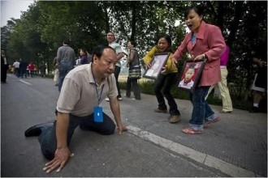](dc0119c9-3729-413c-8903-17174f933d22.jpg)

绵竹市委书记蒋国华向上访灾民下跪

前几天发生的一件事在灾区传得沸沸扬扬，绵竹市市委书记蒋国华，为拦住同样因教学楼质量问题导致五福中学整幢楼完全倒塌死伤无数的遇难家属集体上访，竟然“噗通”下了跪。蒋国华带着哭腔大喊着：不要去呀！你们这是在丢我们绵竹市的脸！一个遇难者家属腾地就是一脚，朝蒋国华踢了过去。

事件被媒体披露后，引起强烈的社会反响，地处绵竹市汉旺镇的灾民也怒气冲冲地声讨某些地方报纸，肆意篡改事实真相，替蒋国华辩护贴金。5月12日当天，中央接到一线消息，当晚命令各受灾县市上报伤亡情况以便展开救援，蒋国华汇报的资料说，绵竹市（包括所管辖的汉旺镇等几个场镇）伤亡数百，现在挖掘救援工作即将结束，医疗救援工作已经展开，请中央放心……这份文件上报的同时，受灾最严重的汉旺镇数万条生命还在废墟下生死未卜，数十万群众无家可归，没有外来援助人们自行组建救援队伍抢救废墟下的伤员，奈何只有铁锹木棍手等简单工具，如何撬动数百斤的楼板？据事后统计，5.12地震受损最严重的是映秀，然后是北川、汉旺，而伤亡人数最多的，是汉旺！这个镇虽不大，但因为聚集了大量工业区，人口众多，而映秀北川等地，虽然地处震中，但经济条件水平较低，人口颇为稀少。事情败露后，蒋国华不知道躲哪儿去了，几周后竟然假拍了一张光碟证明他5月12号地震刚发生就成立了救灾指挥部，始终战斗在抗震一线。可笑！

区区的一脚哪能解恨？不知道多少人恨不得杀了他！

 **⒏**

[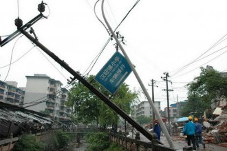](90600225-8aa0-4381-a0f5-958182280d09.jpg)

汉旺镇中心小学

我和我妈吵了架，她想让我继续去读书，我说我不想去就留家里复习得了，其实我连高考都不想参加了，不过我没说，我知道我妈的身体受不了更多的打击了。我径自找上海叔，他是煤矿救护队的，有救援车，我搭上车，跟他进了汉旺老镇，我趴在窗边，看着外面的层层废墟，一阵压抑。

途中我们经过几个路口，都有哨兵站岗，见有车经过，他们不约而同地抬起手臂朝我们敬礼。我怔了怔，心里产生一种莫名的感觉，我到现在都无法形容那种感觉。车开到炭市坝街停下，我和海叔告别，他嘱咐我小心点，我说我只是去看看，一会儿就回，不用等我。 

我深一脚浅一脚地穿过碎石堆，走进汉旺镇中心小学，操场上的尸体早已被运走了，只有乒乓台上还残存着几块曾经压过石棉瓦的砖块，当时被挖出来的尸体无处安放，只好摆乒乓桌上，四个角垫上砖块，盖上石棉瓦，再把上面四个角也压住。

教学楼倒塌了多半并倾斜的墙体还维持着原貌，校门口地上有一条被石头压着围成心形的红领巾，里面放有几张人民币和糖果，我站到它面前深深的鞠了个躬。绕过教学楼，我准备从后面抄小路再去东汽中学看看，这时才发现前面路口有两个士兵把守，其中一个问我是那儿的，我说我是本地人，来看看。士兵说里面已经被管控，不能进入，我只好反转回到乒乓台边，一屁股坐上这个曾经堆放着尸体的台子，在黄昏的夜色中抽了支烟便离开。

半路上我不时闻到浓烈焦臭味儿，是一些人不愿意亲人被葬进万人坑，寻死觅活地夺回尸体，但却无能力处理，只好自行在废墟上搭起简易的炉灶，眼睁睁地把尸体焚化了。离老镇越远，味道越淡，渐渐成了空气中熟悉的消毒水味儿。 [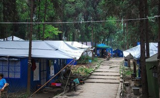](587e4b78-daf3-46b9-8f3c-c2675c68bd63.jpeg)

灾民安置点

庸庸碌碌地在灾民安置点的帐篷里呆了两天，杜思宇骑摩托搭着我一起去转盘路的简易临时澡堂洗澡，原先在汉旺广场的办公点都搬迁到这里，整个曾经的工业重镇的活动中心也自然转移到此了，澡堂是建板房用的轻铁板搭的，男女澡堂间就隔了一层，几个十五六岁的小混混在角落不起眼的地方钻了两个小洞，时不时搞点猥琐的偷窥勾当。

杜思宇是我爸一个工友的儿子，比我小，算起来是我弟，虽然没什么血缘，但关系很铁，就像我爸和他爸。在安置点里，我和杜思宇四处闲逛，期间也认识了两个人，刘邹舟和一个自以为是很牛逼但已被我忘了名字的人。刘邹舟读初二，另一个读高一。我们四个每天除了喝酒、抽烟便无事可做。

灾民安置点里流传着一则笑话，因为当时俄罗斯救援队赴汉旺搜救，有人便编出这样的事情：据说俄罗斯救援队费劲千辛万苦从汉旺镇天河街探测到有生命迹象，于是立马把人挖了出来，伤者是个老大爷，他一探头就看见几个俄罗斯人，不禁感叹道，妈哟，我日他鬼这个地震震得太凶咯，都把老子震到外国来了！

记得有天，我正在帐篷里睡觉，听见外面一阵嘈杂，有人说外面来了一群老外，都嚷着去看热闹。我对此没什么兴趣，中国人就好这口，见啥都稀奇，一副小市民模样。这时杜思宇过来，把我拖起来，死缠烂打把我架过去凑热闹。

安置点是来了几个外国人，没先前哪个傻逼说有一群那么多，我数了数，六个，两个小屁孩，一个年轻女孩，两个中年男子和一个中年女子。那个年轻女孩很漂亮，蓝色的眼睛，淡黄色的长发，她只是笑，不说话。跟着几个老外的是个中国人，橙色的短袖把肚子上的突起显露出来，他戴着一副眼镜，给凑热闹的人翻译老外的语言，像个伪知识分子，我嗤之以鼻。

身在新中国，长在红旗下，我是绝不和这些人搞到一块去的，估计又是乘人之危跑来传教的。我讨厌这些基督教徒，于是转身离开，任凭杜思宇怎么拉扯我也不过去了。

其实我离开的真正原因并非如此，因为那个年轻的外国女孩让我想起了江敏明，她长得很像混血儿，特别是眼眶，她们都一样白，不过江敏明的肤色还透着粉红，我现在不想回忆这些烦琐的东西。

[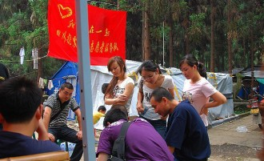](a5733a01-93ca-4250-80f2-16ac1aa7fca2.jpeg)

安置点里的人们

一如既往地过了两天，那几个外国人又来了，同来的中国人中多了一个中年妇女，身上穿着印有鞍山义工的白色短袖，他们身后跟着几个搬运工，扛着长条帆布，里面似乎包裹着什么，当时我正端着瓷碗去打饭，那个年轻女孩看见我，跟了过来，我紧张起来，妈的，哥我英语虽然好，但毕竟丢了半年了，突然给我搞个口语加听力测试恐怕还真过不了，所幸那女孩没走几步就被身后的中年男子召唤回去，她冲我笑了笑，我招招手，毕竟是国际友人，说了句：“Hello！”

下午，杜思宇又来到我家帐篷，我妈正在后面亭子里学电脑，培训点是几周前就建好的，是上面政府下派的工作人员，无偿辅导电脑入门，学的Office软件。我妈连手机短信都拼不清楚，学那个能学出什么名堂，但我妈说反正不交钱，多学点没坏处，我想也是便不再多嘴。杜思宇说，安置点办起了帐篷小学，正在招聘老师呢，让我和他一起去。我有点犹豫，老师？我自知没把握，被别人居高临下教习惯了，现在反而要站到台上去教别人，这种转换我怕是适应不过来，杜思宇说没事，就试试，反正闲得蛋疼。我骂道，别把我扯进去，你他妈才闲得蛋疼，虽然你看我表面上无所事事，实际上我在思考人生，探索社会主义发展的新道路。

我搞不懂杜思宇怎么好意思去，刚爬进高中殿堂的屁孩儿还想教书育人，别把人家祖国的花朵耽误了才是。禁不住他的软磨硬泡，我只好不情愿地跟着他穿过一个个帐篷，来到靠小溪边的空地上。

上午看到的中年女人和男人都在，几个老外不知道窜哪儿去了，杜思宇过去问，这是招老师的吗？那个女人点点头，杜思宇说我们俩是来当老师的，女人打量了我俩一会儿，然后从身后的透明袋子里掏出两件和她身上穿的一模一样的短袖递给我。“快穿上吧！”

操，这么简单？！我心里想。杜思宇把我拉到一边，听说要发工资噢，就是不知道发多少，我说你别这么势利，都是为人民服务怎么还好意思伸手要人民钱呢，杜思宇正要狡辩，一旁穿蓝色短袖的男人冲我们嚷着：“还站着干嘛？过来搭个帮手。”我和杜思宇相视一眼，走过去，原来先前抬的帆布是简易帐篷，中间包裹着钢管，顺着拉开把锁扣挂上就能用了，这种帐篷没有四面，只有顶，应该是当教室用的。我注意到还有几个穿蓝色短袖的男人，也在搭帐篷，不过那顶是绿色的，和这两顶红色的不一样，能完全封闭，两面有防水窗户，正前是门帘，看起来是军用帐篷。

忙完活儿，那个橙色衣服的男人把我和杜思宇叫到一起，刘邹舟竟然也来了，另外还有两个我不认识但杜思宇认识的女孩，长得都挺龌龊，大屁股，满脸疙瘩，那一瞬间我觉得自己像是坐在神州五号上观察月球表面，凹凸不平。

男人先是来了段自认为很精辟的自我介绍：我叫辛骁峰，辛勤劳动的辛，骁勇善战的骁，山峰的峰，意思就是只有通过辛勤劳动，再加上骁勇善战的气概，才能登上山峰最顶端，会当临绝顶，一览众山小。他说这话时脸不红心不跳，语气是铿锵有力振振有词。我差点没咬破嘴唇，笑意难忍。

辛骁峰注意到我，瞪了我一眼，然后继续讲述。

原来，他们是辽宁鞍山的义工，义工和志愿者意思差不多，只是地方不同叫法不同而已。这次来天池煤矿柏林公园灾民安置点的目的就是为这里的孩子提供学习的环境，以及对点内灾民的扶持帮助。辛骁峰是大连某领导力机构的总经理，同时也是中央新闻报社的记者，响应鞍山市号召来到四川地震灾区帮助人民重建家园，他毫不忌讳地告诉我们他还是个无比虔诚的佛教徒，但到这绝不传教，仅仅是为了帮助灾区人民。帐篷学校的负责人并非他，而是那个中年女人吕智，一个心理咨询师，她把毕生积蓄投入到购买急需物资中，加上另外一个义工郝智和那几个老外朋友集聚了部分资金，用来维持帐篷学校前期的正常运转。

最后，辛骁峰又给我们介绍了一个胖子，中国人，比我大一岁，叫徐楷泽，是美国华侨，居住在加利福利亚州，他从电视上得知汶川大地震后便休学到此，利用一个月学习时间和两个月假期，一个是尽自己全力帮助大家，二是给自己的人生经历添上一抹浓墨重彩。

我听辛骁峰说得起劲，便问：说说时间，啥时候上班啥时候下班？

辛骁峰略有不满地瞅了我一眼，继续对之前的话又画蛇添足地补充了几句，然后给我们几个所谓的老师交代了时间，上午6点30到校，中午12点放学，下午2点上课，5点30放学，说完大家正要作鸟兽散，辛骁峰又说:“你们谁愿意当组长？”

杜思宇自告奋勇首先举了手，辛骁峰想也没想便把这事儿定了，接着他又问你们中谁字写的可以？没人回答，他问，谁学历最高？其他几个相继回答，中专、初二、幼师、高一，最后只剩我没吭声，辛骁峰盯着我。

“高三。”我说。

“好，就你了，晚上把一周的课程安排一下，列个表出来，分出每个人教学的科目。”

我郁闷，晚上又没灯，难道用蜡烛？

回到自己家帐篷，我一脸无奈，找隔壁六年级小朋友借了笔和纸，幸亏电脑培训点灯亮着，我过去借光，稍稍思索了会儿，征求了其他几个老师的意见，把表列了出来。

我妈问我一整天飞哪儿去了，我说我当老师去，我妈脸色一变，“高考你不复习，成天弄些乱七八糟的像什么样子？不务正业！”

我一听这话也火了，我大声吼着：“不务正业怎么了？这是不务正业吗？我去当老师，干的不对？我没出去惹事都算好了！”

“哼，也不看看有没有人愿意到你们那破学校读书。”我妈冷冷地讽刺说。

我顿时哑然，我抓起桌子上的矿泉水，一口喝到底儿，钻进帐篷的被窝里。

半夜，尿急，我其实一直没睡着，脑袋里一片混乱，在外面小池塘里撒了尿，我摸出烟，最后一根了，再摸身上其他口袋，一分钱也没有。我握着手机，通讯录选项停在江敏明一页，迟疑了很久，始终没拨过去。

 **⒐**

[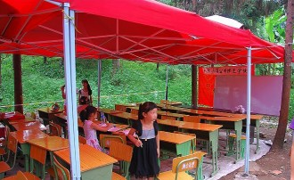](a5fd606e-cdde-416a-81c6-4654d452c32a.jpeg)

帐篷教室

我渐渐熟悉了半个月的老师生活，其实准确地说这应该是志愿者，我不喜欢义工这个词。那批搬运工人都是本地人，是义工群体中一部分。

辛骁峰看了我的课程表，连连称赞我字写得好，接着又自夸自己眼力好，一逮一个准。辛骁峰给我们每人发了两本册子，《弟子规》和《百家姓》，他说要求我们一周内把它背诵出来，我顿感头晕，我上初中开始就没背过课文了，语文考试里默写一项我基本留白，现在又要操起老行头，生疏得不行。辛骁峰见我们都眉头紧锁，接着说，你们按照我给的进度背，以后每天提前半个小时到校，我带领你们解析课文，理解地背诵来得比较快。我倏的感觉天昏地暗，他大爷的，6点30起床已经打破我记录了，还要提前！

教室是由两个红顶帐篷拼凑而成的，再后面就是存放物资的军用帐篷，学校设在一片我们开垦出的草地中，四周松树密布，教室里没有课桌，我们需要自带一个小板凳，教材就那两本小册子，《弟子规》我从没听说过，《百家姓》我看着都痛苦还要背诵，它们犹如两座大山直压得我喘不过气。辛骁峰的口才的确不错，经过他的一番生动解析，前几首一会儿就能背了，我至今还记着开头一首：弟子规，圣人训；首孝悌，次谨信；泛爱众，而亲仁；有余力，则学文。

我和辛骁峰第一次发生争吵是在做志愿者的第二天，那天我没带小板凳，也懒得回家取，就蹲在地上听课，辛骁峰不干，非要我把小板凳带着，我死活不从，看着他那张肥水外溢的猪脸我老恶心，最后我妥协了，取了板凳，辛骁峰得意洋洋地瞟了我一眼，继续讲课。

帐篷小学最早的名字是“辽宁鞍山义工帐篷小学”，一面红色的旗子，上面还有“我们在一起”及志愿者手型鸽标识。前期学校仅有不到四十人的小孩，而且年龄皆偏幼，估计是他们父母忙着挣钱找工作，把学校当成寄放点了，反正又不交学费，省得操心。

前期上课的只有辛骁峰和徐楷泽，辛骁峰讲弟子规，徐楷泽教英文。每天清晨，学校里书声琅琅，吸引了周边帐篷里的灾民，有人凑过来看热闹，被辛骁峰赶了出去，下午他搞到一卷警戒线，把学校周边围了起来。我和几个招来的志愿者反倒没事，就坐边上看着课堂纪律即可。

志愿者开创了我众多的第一次，就剩初夜没开了。当老师不到两天，辛骁峰就让我们几个老师围成一个圈，他要教一个小游戏，看他那架势倒像在诱拐未成年少女，满脸伪善的笑容。他唱了一支歌，幼儿园儿歌的调子。辛骁峰说这是志愿者之歌，他自创的，歌词我到现在还记得清楚：

让我们同在一起，在一起，在一起，让我们同在一起、起快乐无比，你对着我笑哈哈，我对着你笑嘻嘻，让我们同在一起，在一起，在一起，让我们同在一起、起快乐无比。

我觉得自己身上一定出现了返祖现象，一下子成了幼稚园小屁孩儿。教完歌，辛骁峰又结合歌曲节拍编了几个动作，无非是拍拍手，拉拉手，拍拍膝盖，反正我做着这套动作就特别扭。其他几个幼师的老师倒没觉得什么，毕竟她们天天都学，我涨红着脸跟着坐，连续进行了几遍，辛骁峰说让我再做遍示范，我一下子懵了，他叫我一声，我点头，但依旧不动，辛骁峰脸色骤变，对我吼着：你能不能干，不能干就回去！我此时对他简直是恨之入骨，但又不想放弃这份志愿者工作，我害怕看到我妈我爸一副你天生就不是这块料的轻蔑眼神。我咬了咬牙，鼓起勇气站进包围圈。

我傻逼似的做完这套动作，辛骁峰说你嘴巴得一块唱，跟着节拍做。我只好又做了一遍，辛骁峰乐不可支地告诉我，回去多练练，以后用着多呢！

第一次站上讲台是星期一上午，我神色紧张地站在用办公桌作讲桌前的中央，憋了半天才开口，竟然第一个字就结巴了，连续吐了四五次才把这个“我”字吐出来。下面的幼儿园小屁孩儿们哄堂大笑，辛骁峰瞪着我不说话，杜思宇几个烂人也捂着嘴巴笑。上高中时，我作为历史最高分却并非历史科代表站在讲台上给同志们解析题目时也没这么紧张过，这下脸丢大了。我涨红着脸，沉默了一会儿，终于鼓起勇气，给那些小屁孩们上了第一堂课。内容讲的便是弟子规，我记性好，相当于把辛骁峰之前单独给我们老师讲的复述了一遍，课堂纪律不是很好，坐第一排的两个小屁孩都在互掐，我本来想吼几声，但转念一想，这些孩子多是汉旺镇中心小学侥幸存活下来的，作为志愿者，一定要有爱心，要博爱，要温柔似水，想到这里，我顿时没了脾气。

辛骁峰有回给我们讲了义工、自愿者、志愿者三者的含义。他说，义工这个词是从台湾及东南沿海一带舶来的，而志愿者则是欧洲国家出现的，他习惯把自己当成志愿者，他说他是自愿来为人民服务的，而且把这件事情当作终身志愿。我们未经过任何仪式，辛骁峰给每个人胸前贴上志愿者徽章，我问他怎么不贴，他把脖子上挂的牌子递给我看，说这是团中央发的志愿者证，有印呢！我恍然大悟，原来真正的志愿者得有证件。

辛骁峰借了一台电视机和一套影音播放设备，把它们安置在库房（军用帐篷）的门帘后，从此这所帐篷学校又多了一项活动，就是晚饭过后可以来这边看电视，这也是整个灾民安置点唯一一台能收到50多个频道的电视。辛骁峰找了几盘讲真善美的光碟，并邀请安置点里的成年人来观看，他站在电视边作解说。有人问他是不是和尚，他愣了下，摇摇头，那个人又大声问他是不是俗家弟子，辛骁峰毫不隐瞒地点点头。这时人群中噪杂起来，又有人喊着，原来跑来是传教的，我就说这世上没那么多掉馅饼的事儿。辛骁峰一时无言以对，他只是竭力解释，说自己并未传教，但始终没人相信。我和几个志愿者站在一边，竟然不知道该怎么办。

后来回家，我妈和几个邻居正坐在帐篷外乘凉，我妈问我今天又上了几堂课，我没说话。第二天早上我揣着《弟子规》去学校时，我爸在身后笑着说：“传教去啦？！”

“我们没搞宗教！”转过头，我一字一句地说。

“我晓得，那不是宗教，是邪教，不就法轮功嘛！”我爸皮笑肉不笑地说。

我像是受到了极大的侮辱，大声吼起来：“传你妈个屁教，我告诉你，我干的是志愿者，不是传教徒，你他妈少胡七八糟瞎扯！”

我爸脸一黑，沉默了几秒，也冲我吼：“滚！”

我气急败坏地走出帐篷，点了一支烟，试图把暴怒的情绪平缓下来，忽然又觉得作为志愿者在大庭广众之下不能这么没谱，于是又把烟头掐灭揣进裤兜。

第二天，帐篷小学的学生竟然只来了一半不到，我们心里都清楚，肯定是有人传播谣言。但当下我们也想不出什么好的办法解决，只好照常上课。

这样的状态一直维持了一周多，眼看学生人数越来越少，我们却无能为力。辛骁峰很少来学校这边了，他和义工团队去了成都团委筹集赈灾物资，吕智在都江堰也开办了两所帐篷小学，她和郝智在那边给那边的小孩做心理辅导。现在我们志愿者的人数和学生的人数甚至快可以划等号。我、曾旭、胡赟、孔爽、许文娟、徐楷泽、王勇、刘邹舟、钟宾9个人。我在读绵竹中学高三；曾旭、胡赟和许文娟是孝泉师范学院的学生，许文娟比其他两个低一级，都学的幼师，其实挑明了说，那所学校听起来挺靠谱的，师范学院？哼，不过是出妓女和混混的三流学校而已，连汉旺镇职中都不如；刘邹舟在汉旺中学读初二；钟宾在南轩中学读高二，孔爽和王勇在南轩中学读高二，都是艺术特长生，一个学声乐，一个学绘画，他们两个的能力我都见识过，的确不错，这也是后来他们两个能留到最后的原因之一；徐楷泽我就不用多说了，管理他不在行，顶多教几首英文歌曲。杜思宇见志愿者没钱拿，除了辛骁峰给灾民发物资的时候给作为志愿者的他多发了一条蚊帐外，根本无利可图，他连招呼都没打便离开了。

徐楷泽没过几天也走了，他把钱包里的几张美元送给几个小屁孩作纪念。晚上我们几个志愿者买了一些吃的喝的，大家坐在柏林公园后的水库堤坝上玩了几个小时，大家一边唱歌一边感怀颠沛流离的生活。刘邹舟跑别人菜地里掰了几根玉米棒子，我们围在火堆边胡吹乱砍，摆起黄色笑话，我发现原来孔爽有这么骚情的一面，作为志愿者中相对较漂亮的女孩，她竟然掏出手机，给我看上面一段淫秽动画片，故事说的是白雪公主和七个小矮人，画面淫靡至极。我差点就把持不住，被孔爽拖出社会主义阵营，加入到腐朽糜烂的行列中。

有天中午在家吃饭，听隔壁周叔说过两天心连心艺术团要来汉旺演出，届时除了有抗震救灾的官兵参加，同时还邀请了海军援建的凌法村小学观看演出。周叔有个朋友是凌法村小学的老师，我问周叔能不能把我们帐篷小学也捎带上，周叔说晚上他那个朋友会来吃饭，到时候他会帮忙通融一下，我心中乐开了花，给周叔发了支这个月领取的个人救济款买的娇子烟，周叔说你娃抽得可以噢，是不是我不帮忙你肯定都舍不得，我连忙笑着说不是不是，您一直就是我心目中的偶像，社会主义建设的坚强柱石，我高攀还来不及呢！

当天晚上，我费劲口舌终于征得了周叔那个朋友的同意，于是连忙打电话把消息通知给辛骁峰，谁知道他居然不容我解释一口拒绝了，他说要去就光明正大地去，没必要打着别人学校的幌子跑去瞎咋呼。我说你的中心是学校还是那些小孩，我们志愿者的目的是为了让那些孩子们高兴，把他们从地震的阴霾中抽离出来，这不是真正的学校！我们做的只是过渡工作，总有一天他们原来就读的学校会复课，我们学校会解散！我们只需要在复课前把小屁孩们照看好，教会他们乐观，你他妈懂不懂！

辛骁峰愣住了，他没有说什么，把电话挂了。我想，完了，哥们儿的志愿者生涯才进行了一个月不到估计就要归位了，辛骁峰在帐篷学校的威望一直很高，连作为本地人的义工他都敢破口大骂，而且那个义工连狡辩都没有，他甚至可以凌驾于学校负责人之上，全凭自己意愿管理。我十分地不甘心，我害怕回家看到我妈质疑的眼神，我爸嘲讽的言语，我又抽了很多烟，刚买不久的娇子竟被我抽得一支不剩。

后来的一天，帐篷小学负责人吕智回来了，她看了一眼正在讲课的我，静静地坐在一边听课。下课后，她对我说让我跟她走一趟，我问去哪儿？她说进库房说去。原来，辛骁峰因为筹集物资不能回来，就通知了她和几个义工先回来照看。吕智话很少，她对我莞尔一笑，肯定了我的想法，然后让我下午上课时通知那些小屁孩，次日早晨动身去东汽运输站观看演出。

可能是因为有演出，那天居然破天荒来了50多个小孩，多数由家长带着，他们也想蹭个演出看看。我抱着一大袋子新的志愿者短袖，都是最小的，给小屁孩们每人发了一件，我分了组，每个志愿者看管五六个孩子，然后由我扛着有“鞍山义工帐篷学校”的大旗出发了。

和凌法村小学汇合后，我们朝运输站进发，走到站门口就看见有部队踏着整齐的步伐行入，我们尾随而至。场地负责人把我们安排在最前面坐下，两边和身后全是当兵的，一股浓烈的橡胶和汗水味充斥在空气中。站队列时，几个兵做着怪脸，把旁边的小屁孩逗得哈哈大笑。等部队拉完歌，演出便开始了，除了黄宏和蔡国庆我认识，别的都面生。

中途进行了一次捐赠，凌法村小学选出几个学生代表上台领书包和文具，被我抱在腿上坐着的梁茂杰抓着脑袋问我，杨老师，我可不可以也上去拿书包？我摇摇头。凭啥子喃？他又问。

面对这个4岁半的小屁孩，我实在不知道如何回答，我想了会儿，告诉梁茂杰，捐给我们的书包已经先领回去了，过几天就发。

过几天就发？我都不知道拿什么发！

然而，过几天书包并没有发，我却得到了辛骁峰即将离开的消息。

[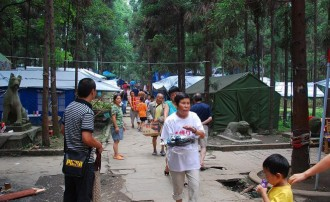](9c97d9cc-4cd3-41bf-bd0d-69b8b8ed8bb9.jpeg)

物资源源不断被运进灾民安置点

辛骁峰从成都带回大批赈灾物资，包括生活用品、水和食物。惟独没有关于学校的任何物资。辛骁峰给几个志愿者每人一支英雄钢笔，笔是他用自己的钱买的。晚上，辛骁峰买来板鸭和白酒，整了一大桌菜，和义工坐在大库房（另一个军用帐篷）外，喝得满脸通红。午夜12点，他带领几个义工照常在灾民安置点内巡逻，路上碰到一个天池煤矿职工家属，指着他骂，还好意思拿赈灾款吃喝，算人吗？辛骁峰一听就火了，大吼着，这是我自己的钱！是我的！赈灾款我没挪过一分一毫！

巡夜结束后，辛骁峰倒头便睡，这一睡就睡到第二天下午。几个义工凑钱买了些酒水，晚上又喝，不过这回辛骁峰没敢整太多，他多是坐在桌边沉默，不说一句话，没人敢多问原因。他把我们几个志愿者召唤过去，交代了一些事情，关于学校的具体事务，物资分配等，辛骁峰说他回大连后还会筹集更多的物资给我们运过来。

天色已经很黑了，辛骁峰接了个电话，应该是司机打来的。义工团队队长温波给我们发了一张卡片，我在卡片上只写了一句话：老辛，谢谢。我把卡片递给辛骁峰，他醉眼朦胧地看了看卡片上的内容，突然握住我的手说：你很幸运，你遇到了我。我一听就好笑，都这时候了还不忘自夸一番，辛骁峰接着说，我有你这么大的时候谁也没遇到！

其他志愿者也和辛骁峰依依分别了，他们一个个哭得稀里哗啦，我忍住没哭，辛骁峰坐上面包车，我跟在车后走了几步，车停下来，我也停下，辛骁峰从车窗露出脑袋，笑着朝我挥挥手，这是我第一次看见他死板的脸上对我露出笑，我也伸出手向他说再见。

昏黄的路灯下，我看见辛骁峰已经泪流满面。

 **⒑** 

我简单地在理论上把义工和老师分开，我称呼那些筹集物资的人义工，称呼老师为志愿者。其实两者都是一个团队，红旗上有名儿，“四川抗震救灾志愿者服务队”。义工多是本地人，他们中大多数我认识，有好几个都是混过社会的，但表面上也有个光鲜的职位，属于天池集团公司保卫科，其实是给矿主做打手的，一旦有矿工闹事他们就去解决，曾经还出过人命，我爸妈之所以强烈反对我来当志愿者也有这方面原因。义工头叫温波，副头叫陈小均。义工中最年轻的也20多，最老的甚至结了婚有已上小学的孩子。辛骁峰走后，那个意义上的学校负责人吕智也再没来过，听说她和郝智都回辽宁了，学校这摊子事被分给罗成，义工团队中的一员。

罗成以前和我家是邻居，他比我大十多岁，在西藏当过兵，他同父异母的弟弟罗浩曾是汉旺镇出了名的打手，上初二就把整个高中学校扛了，辍学进入社会后跟个富二代公子哥瞎混，我读小学时经常看见他披着黑色风衣，后面跟着十多个穿运动服袖子里装着裹片刀的报纸在街上横冲直撞。罗成一家老爸体弱，整天骑着自行车卖花生，老妈则在菜市场卖菜，经济上十分拮据，我妈曾经多次给予他家帮助，所以罗成和罗浩对我妈相当尊敬。我初中快毕业时，汉旺成了试点镇，上面派了领导前来整风，罗浩混不下去便跟随富二代去了遂宁重庆等地，罗成参了军。

我相信爱。我认为是这场大灾难把他们改变了。

罗成现在已婚，生了个胖小子，和她相处的女人姓吉，我叫她吉姐。

辛骁峰没走几天就来了一批物资，是六十套带椅子的课桌和一张新式黑板，山西海会寺捐赠的，同时还捐来一批类似《弟子规》修身养性的书籍。课桌没安装，那天中午我连饭都没来得及吃便和几个义工赶时把桌子安上螺丝敲定，下午上课前把它们都搬进教室。海会寺的主持送给我们志愿者一人一串佛珠，便到安置点出口宣扬佛法了。

教学设备的逐渐齐全并未吸引更多的学生，反而人数又减少了几个。晚上看电视时人倒挺多的，我们几个志愿者在帐篷周围点燃蚊香，用影碟机播放动画片，小屁孩们吃完饭就跑来了。

(采编：刘铮；配图：杨侑；责编：刘铮)

[我们在一起（二）](/archives/34527)——“”我妈最后那句‘你永远当志愿者吗？帐篷学校难道永远都存在吗？如果不存在了你怎么办？’，倒确实把我给问住了。怎么办？凉拌，我到现在对未来还迷茫着，总不至于还去复读个高三吧，即使去，也没那么多钱缴学费。

[我们在一起（三）](/archives/34615)——“志愿者生活是枯燥乏味的，别人看到的永远只是局部，媒体拍片子写稿件那都是挑着写，真实全面的我想没几个人能看到。”

[我们在一起（四）](/archives/34671)——“吉扬帆跑到我跟前，泪眼汪汪地问我：“侑哥，你是不是真的要开除刘兜兜？”我点点头。“我讨厌你！”吉扬帆捡起课桌上的一本《弟子规》朝我脸上砸过来，然后又冲向被低年级小屁孩围拢死活就是不让离开的刘邹舟那边."

[我们在一起（五）](/archives/34798)——“帐篷小学解散的日子终于要来了。 我不知道应该高兴还是悲伤，小屁孩儿们可以去更好的教室接受更好的教育。我们也应回到各自人生的轨道上继续暂停了两个多月的运行，或许以后还有交集，或许老死不相往来。"
