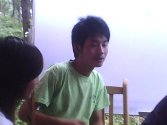
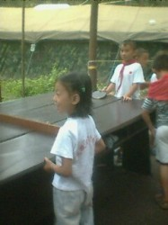
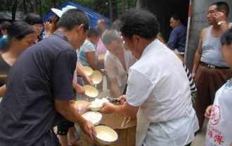
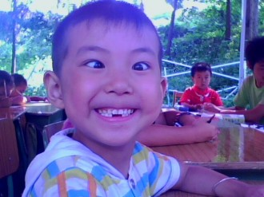
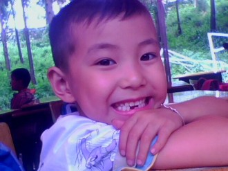
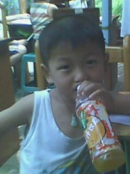

# 我们在一起（三）

⒈ 

我从杨成建衣服暗兜里搜出一盒黄鹤楼（香烟），抽出两支一起点燃，我咀了一口，把其中一支塞进他嘴里。杨成建无奈地啜了啜，给我讲起其他人的现状。那次散伙饭后，大多数人闲在家里享受假日时光，而张苗跟几个好友不知道哪儿弄了一大块布料，搞起了万人签名活动，甚至连王帅都被吸引过去了，还有他那个首都来的女朋友。杨成建赶在晚饭前回到安置点，他的高考成绩既不出色也不掉价，卡在三本和大专之间。不必多问，肯定读专科，三本不仅学费缴得比一本二本还多，毕业后也没几个事业单位要，而专科生至少有门技术，怎么个也能混口饭吃。在选择未来走向这方面，杨成建还是跟我看齐的，立志为无产阶级事业奋斗终生，当工人有什么不好，工人阶级是无产阶级先锋队，是社会主义建设坚强柱石，事实证明，杨成建和我相处的这段日子，经历了无数耳濡目染，在我的精神熏陶下，思想境界果然有了质的飞跃。

“等等。”我打断阿建的叙述，“你是说上次在东湖山喝酒时他带的那个北京来的志愿者？”

阿建点点头，接着说：“我也和你一样，想不到他会把北京妞儿给搞上，而且，我听说还是个处女。”

我没有说话，使劲抽了一口烟。

“当然，我也跑里面挂了个副团长。”阿建继续说。

“你意思是你不会呆在这里了？”我有点惊讶。

“不，不是，我要呆在这里。”

“为什么？”

“因为我觉得在这里可以学到更多东西。”杨成建瞥了我一眼，见我仍旧无动于衷，他接着说：“还有一点，最重要的是，正如你所说的那样，奉献，我至少可以更深刻地理解奉献是什么。”

“你觉得她干的事儿有实际意义吗？”我问。

“可能你会认为没有，但是我觉得是你和她的价值观不同。”

“我想起她曾经对我说的话。”

“打住！”阿建摆了摆手，“我知道你要说什么，你说她曾经对你说，‘有些事情有些人，换个角度去看就会看到他的好’，对不对，你已经对我说过无数次了。”

“是，我是说过很多很多次，但我至今也无法真正确定这句话到底对不对。”

“留给时间去证明吧！”阿建望了望已经昏暗的天空，“或许时间和逃避是同义词。”

“是近义词。”我补充说。

“我还听说张苗搞的那个活动被《中国教育报》采访了。”

“采访了又能怎么？”

“你心里不平衡了，你也想被关注。”阿建说。

“你他妈胡说八道！”

“杨得艺，别人不了解你但我了解你，我是这个世界上比你父母还了解你的人，这一点你要承认，你希望自己的帐篷学校也受到关注，因为你想证明自己，你想做给你爸妈看，我来帐篷学校这么多天，你和你爸妈吵翻了天，你希望自己能被认同，被你爸妈认同，你从小就缺乏认同，你以前喜欢张苗是因为只有她认同你，没有什么是比你被认同对你来说更重要的事情了，不管你努力做你喜欢的还是不喜欢的事情，你是抱怨还是欢喜，你做到最后都希望被认同！”

“算是吧！”我感到心里很闷，想喝酒。

“不是算是，这是事实。”杨成建把烟蒂揉碎，把海绵粉末撒开一地，“但是，我认为你的做法是对的，你至少学会了奉献，这是你自己琢磨出来的，虽然其中含有你的精神方面的自私。”

“也许我的奉献真是做给别人看的。”

“我相信以后会改变。”阿建拍了拍我的肩膀说，“另外，张苗和中国教育报记者过几天会来这里。”

杨成建说了些高中哥们儿的事情，我们谈到王珏。

“王珏这次同样没上本科，后来一回家打开门就跪下了，他爸在家里。他爸对他一直寄予很高的期望，当然，这期望跟你妈的期望差距太大，你妈可能好高骛远，总想让你上名牌大学，从小就给你高标准，买衣服都买名牌的，你一直强迫自己努力，从小到大走的全是名牌路线，哪所学校不是重点，幸亏你还有点自我意识，不然当初你就不会对大家跌破眼镜地表态说自己对重点班不屑一顾，甚至有可能我们也没机会当成兄弟。”

我掏出红河，给杨成建递了一支。

“王珏现在彻底完蛋了！”

“读那么好的学校有什么用？为了找个好工作？为了挣更多钱？”我自言自语地说。

“你梦想是什么？”

“现阶段我还没有梦想，我以前所有的梦想都是被他人强加的。”我说。

“帐篷学校解散后，你想干什么？”阿建又问。

“不知道。”我摇摇头，思索片刻后我说:“或许、可能部队是个好地方。”

“你听你妈的？考军大？”

“也不一定，你是知道的，我不喜欢被约束。”我说。

“总有一天你翅膀会硬的，那时候你就知道你想干什么了，你不会受任何人摆布。”

“可命运？可现实呢？我总有要面对现实的一天。”

“逃避不是办法。”

“但我现在想逃避，逃避周遭的生活，去一个没有人认识我的地方，跟钟跃民一样，我只适合理想化的生活。”我告诉阿建。

“比如共产主义？可是有几个人真信？我确定自己不信。”

“我也不信，所以我这辈子都不入党。”我说。

“等我们老了也许会后悔，可谁说得准呢？”

“后悔就是消极，我倒不希望自己的青春太消极，等人老了消极点也好，早死早超生，活着反而给后代增添累赘，要是世界上多点我们这样的人，人口就不是问题了。”我笑着说。

 ⒉ 

王珏是我高中生涯中比较重要的哥们儿，读高一时一起去打过架，后来上高二被分到一个班。不少认识他的女孩都希望自己能遇到这种男朋友，家庭条件好，老爸从政。王珏长得又跟有个偶像剧明道一样，在认识杜玉萍之前，王珏没有一个女友，我们只能说杜玉萍上辈子积厚德了，找到这样一个男友，不得不说这简直是奇迹。杜玉萍初中毕业于城南中学，高一和我都在12班，高二一起进了5班。王珏和杜玉萍腻上以后，便鲜少和我们几个兄弟来往了，经常约好一起去玩，当时答应得好好的，结果最后就差他没来，三天两头说突然遇到急事，自己脱不开身。要说杜玉萍长相，我是不敢恭维，1米5的身高，脸上长满蚊子屎（一种斑痕），其实心地倒还说得过去，可扯到男女关系上，那杜玉萍可以说从初一开始就交男友，失身是显然的，和王珏交往时甚至算得上残花败柳了。我们至今搞不明白，杜玉萍到底用了什么办法，居然把曾经的打手驯化得如同小狗般听话。记得有次两人吵嘴，杜玉萍连续两周没理王珏，后来王珏居然给跪了下去，我们几个哥们儿当时诧异得眼珠子都快掉出来。还有次是两人交往一周年纪念日，王珏下晚自习把我拖着，非得跟他去街道两侧摘树叶，王珏买了吸管，每根吸管的一头粘上两片树叶，制作成竹蜻蜓的样子，他一晚上不睡觉做了100个，第二天是周六，放学后，王珏让杜玉萍在楼下等着，他站在教学楼天台上，把自制的竹蜻蜓如烟花溃散般撒向正在下面抬头张望的杜玉萍。最后，他带着买的小礼物，和一张精心拼制的果盘，嘴里咬着一支玫瑰，半跪在杜玉萍面前，然后就是一连串肉麻的情话。

不管别人怎么劝说，王珏一句也没真正听进去。我们几个曾经的兄弟只好祝愿他幸福了。5.12地震时，杜玉萍先跑出教室，王珏在后面紧跟着，刚到楼道口，上面突然坠下一块挡板，王珏二话不说把杜玉萍扑倒在地，挡板砸到王珏背上，划出一道深可见骨的口子。

高考过后，杜玉萍上了二类本科录取线，王珏也选择了一所和她同地的大专院校，两人至今还保持着关系。听说双方都见了家长，不知道王珏这辈子是否真的就这样栽在杜玉萍手里了。

杨成建回来的第二天，陈小均给我介绍了一个都江堰的志愿者，听说因为背负伤员受过嘉奖，现在是都江堰灾区志愿者中的佼佼者。这个比我矮半个脑袋的志愿者叫陈强，和他一起来的还有一个漂亮女孩。陈强给我和阿建发了一支烟，12块的兰娇，看来上级领导跟我们基层干部着实存在经济上的差距。温波安排陈强当晚在219帐篷住宿。

重庆示范来的三个女大学生我只留了一个，就是那个长相老实巴交一副有利无害样子的眼镜女孩。我感觉她能胜任这个工作，当然，仅凭感觉肯定不靠谱，我这样决定是有事实依据的。除了她们上课我旁听之外，我最留意的还是下课后她们的表现。刚开始都一样，跟小屁孩们玩得热火朝天，过了半天时间，特别是天气炎热人心疲惫的时候，其中两个玩起了手机，要么就在旁边的办公椅子上坐着发愣，只有‘眼镜’一刻也不停歇地跟小屁孩们做着游戏。我认为，这是志愿者最起码的标准：耐心。别把灾区的小屁孩想象得跟乖娃娃一样，玩疯了照样吓死你，你还管得了？不少人选择离开也是很正常的，无所谓道德是否高尚，离开也是自己的权利，别人没有义务必须来帮助你。

眼镜儿叫唐敏，操着一口普通话，我跟她说四川话时，她还是用普通话，我便以为她是外省人，不会说四川话。后来某一天我突然听见她冒出一句四川方言，我问她哪儿人，她说她家在罗江。

叶琪、王廷随郑鹏一起来到帐篷学校，那天是星期六，小屁孩们放假，我们几个买了点凉拌菜啤酒，在柏林公园假山的石凳上坐着，对干了几瓶，我喝得二晕二晕，爬到假山后面撒了泡尿。

听说帐篷学校缺红领巾和国旗，郑鹏和叶琪王廷各自各自凑了近一百元交给我，叶琪说，早知道这样我就不买那么多凉拌菜了。我酒喝得有点多，几个小屁孩也爬上假山，罗岚凑到我跟前，撅起小鼻子一闻，有酒味儿，她揪起我一只耳朵冲我嚷着：“健哥（我小名杨健），我昨天是不是给你说过不准你喝酒？！”

“说过说过。”我连连点头。

“那你还喝！”罗岚生气地说。

“我没喝，我刚吃的是酒芯巧克力。”我狡辩着，然后指向郑鹏，“不信你问他们嘛。” 

“那个哥哥是谁？”

“圣象地板送帐篷那个，叫郑鹏。”虽然罗岚才上二年级，揪人的劲儿还挺大的。

“他叫帐篷？”罗岚问我，不等我回答她又问郑鹏：“你叫帐篷，是不是和你送的帐篷一样。”

“是郑鹏，不是帐篷。”郑鹏笑着纠正。

“郑鹏郑鹏！赠送帐篷！郑鹏郑鹏！赠送帐篷！”几个小屁孩摆着拉拉队的造型蹦蹦跳跳地喊起来。

“你还没有告诉我他喝没喝酒？”罗岚质问郑鹏。

“没喝。”郑鹏乐呵呵地说。

“你骗人！”罗岚一听就急了，“骗子！骗子！”

“算了，我承认还不行吗？”我把罗岚拉到怀里。“我喝了四瓶酒。”

“那你刚才还说没喝！”罗岚用小脑袋使劲撞了撞我额头。

“我被你撞晕了。”我说。

“就是要把你撞晕！就是要把你撞晕！”罗岚气鼓鼓地说。

罗岚是我妹妹，以前不是，连认识都说不上。记得上次开完家长会后，就她妈话最多，我小时候开家长会我妈找老师问学习情况都没她妈多。说到最后，她妈非得让我认罗岚当干妹妹，我则成了罗岚妈妈的干儿子。幸好来开家长会的不是罗岚爷爷，不然我还得当孙子。罗岚在学校是比较听话的，上课认真听讲，也从来不迟到，自从我成了她哥以后，野蛮的本性就显露出来了，再不拿我当杨老师看，成天骑我头上作威作福耀武扬威。

下午郑鹏和叶琪回绵竹，我跟着一块去，买了100多根红领巾和一面国旗。回安置点后又和陈小均去公园的竹林砍了一根拳头粗的竹子作旗杆。晚上开饭前我和阿建便把事情搞定，那天晚上起风，看着五星红旗在半空飘扬，我掏出手机，照了张相。

晚上，我们几个志愿者呆小库房里侃大天，我问他们现在学校还缺什么，赖航说缺张乒乓球桌，王勇说那不是问题，成铁局捐的办公桌反正也大，抬两张出来拼起，中间摆一排红砖当网子就行。孔爽问我，早上升国旗怎么升，旗子就绑在上面，又没滑轮。我说升不是升不重要，有个仪式走着即可。孔爽又问，那国歌喃？我一听，国歌怎么办？唱歌倒能大家一起唱，升旗用的义勇军进行曲得想办法搞出来。

第二天清晨，等小屁孩儿们背着书包到齐后，我把他们按班级集合到教室旁边的一块空地上，把有关升旗仪式的步骤说了一遍，然后从塑料袋里掏出一大捆红领巾，给读小学的每人一条。队列整理完毕后，我拿出手机，对准从义工团队借来的扩音喇叭，义勇军进行曲响起，小屁孩们敬着队礼望向五六米高的国旗，这时，我突然想起自己的小时候，读学前班，我还没有入队，每到星期一升旗仪式看到别的人戴着鲜艳的红领巾，抬着手臂敬礼，我心里说不出的羡慕。后来入了队，一到升旗就敬礼，仔细一琢磨，其实也没啥可羡慕的，手臂还酸疼酸疼的。我不知道这群小屁孩此时心里是什么想法，或许他们和我一样，又或者让他们回忆起什么。地震时，抱着旗杆滑下来而没死的小孩不多，我曾亲眼看到过汉旺镇小学地上那些摔死的孩子的惨状。而这些小屁孩们，是哪儿来的勇气使他们竟然敢从四楼跳向一米外的旗杆？

义勇军进行曲是我用手机登陆WAP网下载的，唐敏直佩服我脑子好使。

《中国教育报》到学校采访时已经放学，张苗和一个瘦骨小伙子。虽然先前阿建已经告诉过我，但我还是禁不住有点紧张。张苗脸色平常微笑着告诉我，只需要回答记者问题就行，时间不多，能快点尽量快点，说不定最后还可以发表些感想。

十多分钟的采访结束后，张苗和那个记者在学校志愿者旗帜边照了张相便离开了。唐敏问我她就是你以前喜欢的女孩啊？我点了点头，没说话。看起来挺不错！唐敏说。 

望着她远去的背影，我点燃一支烟。

 ⒊ 

唐敏的加入对我来说无疑是雪中送炭，我把写作技巧教得差不多，但要讲词语用法，诗歌朗诵什么我就完全不行了。唐敏代替了原本是我的五六年级的语文老师职务，我也乐得清闲，偶尔给请假的老师代代课，整理一下库房基本就没啥事儿了。这些天来，唐敏一吃完饭就坐到教室里看书，背英语词典，我和阿建也就不再每天中午跑去守帐篷，倒进屋子便呼呼大睡。

灾民安置点吃的是大锅饭，食堂设在公园后侧靠农田的地方。我爸在临时饭堂里做工，烧饭的时候铲几铲子煤渣丢进炉子里即可，但温度太高，再加上又是夏天最闷热的时候，所以干起活来并不轻松。唐敏加入帐篷小学志愿者团队后，给饭堂缴了几十块钱，但不久打饭师傅得知她是志愿者后硬是不收钱，说这钱收了心里反而不踏实。我们每天都要端着两只瓷碗去打饭，一只盛菜，一只盛饭。打饭师傅认识我，我去那儿打饭，他们会朝后面锅炉房大喊一声‘杨林，你娃来了！’。后来我成为帐篷小学负责人后，便很少打饭了，没时间吃，多数情况下我都揣着饼干和娃哈哈矿泉水坐学校课桌上解决伙食。偶尔去趟饭排队打饭，那个粗膀子串脸胡的师傅就会大声说，“前面的人先等一下，让帐篷小学的校长先来！”这么一说我倒不好意思了，虽然排队排在我前面的叔叔阿姨并不介意，但我总觉得这种特权放在自己身上很不合适，要是换成别人，管你是井长还是矿长，该排队还得排！

杨成建带的小帐篷暂时没派上用场，他还是睡在219帐篷里的大床上，我又睡回自己家帐篷，唐敏则和曾旭睡一个叫杨礼的义工家里，杨礼跟别的义工睡。 

有天晚上，我给江敏明打去电话，但没说几句就挂了，我和她以普通朋友的方式约好7月23号在德阳玩。我知道，这是机会，我争取了一个多月才争取到的挽救的机会。打完电话，我和阿建蹲在石阶上抽烟。

“真喜欢她？”

“嗯，你可能不会相信，但是却是事实。”我笑着说。

烟抽完，我问阿建：“刚才我给她打电话听到那边有男人的声音，你说是不是电话的回声？其实是我自己的声音？”

“我看她一定是跟别的男人边做爱边给你说话吧！”杨成建对我开玩笑从来不分轻重。

“你他妈少扯淡。”我又点燃一支烟，却沉默起来。

第二天早上，我破天荒起了个大早，天空万里无云，加上心情愉悦，我拆开一袋巧克力饼干，兑着纯牛奶边吃边准备去219喊阿建起床。我从枕头下摸出手机，发现有两个未接来电和一条未读短信，我猜可能是江敏明发的。

而事实上，电话是唐敏打的，时间是凌晨一点左右，我点开短信。仍然是唐敏的短信，而看到内容后的我，却傻了。

“杨侑，救我！”

我一时间竟然无法理清思路，我脑袋里只闪过一个念头，唐敏？女大学生？莫非…我不敢再想下去，我绝不能让志愿者在我的地盘上受到任何伤害，谁他妈要是敢动我的人一根汗毛，我他妈砍死他。我一个跟斗从床上翻起来，视线在帐篷内左右一扫，娘的，连根捣火棍都没有。此时离发短信时间已经过去快六个小时，容不得我多想，掀开帐篷门帘就朝学校冲去。

我跑下石阶，途中被苔藓滑倒摔了一跤，我爬起来接着跑，我冲到学校，发现教室里空无一人，我心急如麻，却连个人影都见不着，我掏出手机想打电话，这破手机居然这时候电量不足自动关机了，他妈的NOKIA不能配两块电池吗？我只好去219帐篷，想先把杨成建叫醒再一起去找。

我一把甩开219的门帘，阳光从门外照了进来。帐篷里，唐敏正抽泣着坐在沙发上，她抬头看了我一眼，又迅速低下头不停地抽搐着。而杨成建，此时却四平八稳地裹着被子，躺在大床上鼾声如雷。我心中无比震惊，难道杨成建把唐敏那…那个了？我心里暗骂：杨成建啊杨成建，亏你还是我兄弟，你这不是害我吗？你兽欲来了用手解决不行吗？就算不行你给我说嘛，也不至于饥不择食把才来几天的志愿者给他妈上了，你不就见王帅找了个北京妞儿眼红吗，我也可以给你找，但你得事先给我打声招呼看我同不同意啊，我要是同意还能帮你搭个下手，可你他妈却自个儿先干起来了，我即使没钱帮你找小姐我给你找个脉动瓶子也能凑合着用啊！你他妈不要脸可我还要脸……

我越想越气，我难以想象自己最好的哥们儿居然会干出如此禽兽不如的事情来，我扫了一眼周围，门帘角上有一箱玻璃饮料瓶，我正要抓起一个过去砸他脑袋，突然脑海里一闪，杨成建没长脑壳嗦？犯了强奸罪还敢不慌不忙地在这睡起？我觉得很有必要先从唐敏那里把事情的详细经过了解清楚再动手不迟，反正杨成建你娃娃跑不脱，老子追到浙江你老靶子（老爸）那儿都要把你干了！

我竭力克制住自己的情绪，努力让自己看起来象个处变不惊的样子，我坐到唐敏身边，见她抽泣声渐渐变小，我尽量心平气和地问她：“到底怎么了？发生了什么事？”

不问不要紧，这一问唐敏不仅没回答，眼泪跟决堤的洪水般‘哗哗’又流下来，我不禁郁闷起来，但仍然接着说：“有什么告诉我好不好？你放心，我一定能把这事儿给办了！”

我不再说话，我现在做的只有等了。其实我更想把她搂到怀里好好安慰一下，我知道在这种情况下她缺的就是值得信任的人给予的安全感，但我没有这样做，不是不好意思，是我想到了江敏明，虽然这事根本八杆子打不到一块儿去。

过了有十多分钟，唐敏渐渐止住了哭泣，哽咽着把事情的原委断断续续讲了出来。

原来，昨晚唐敏和曾旭很早就睡了，但唐敏睡眠不好，也就睡得不深，半夜12点过，从帐篷外进来一个瘦高个儿，唐敏知道，他就是这顶帐篷的主人杨礼。

杨礼晃晃悠悠地走到床边，停留了片刻就开始脱衣服，唐敏吓呆了，但却不敢出声。只见杨礼酒气熏天地爬上本就不宽的床，一下子压在曾旭身上，曾旭醒了，两人开始接吻，然后居然当着唐敏的面做爱。唐敏吓得大气不敢出，把脑袋裹进被子里装睡，也就是这个时候，她给我打去电话，我因为睡得死，手机又开的振动没感觉到，唐敏只好凭感觉编了一条短信，给我发过去，盼望着我能早点赶过来，但我却始终没有来，最后，唐敏找了个机会，悄悄从床上跳下去，跑到219帐篷。她把杨成建推醒，向他哭诉，但杨成建脑子里迷迷糊糊唐敏也光顾着哭说话也说不清楚，就让她在沙发上静一静，休息一会儿，等天亮了再说。再往后面发生的事我也见到了。

听完唐敏的讲述，我不由得心里一阵唏嘘，幸好不是我先前想的那样，这时再看看杨成建，他妈的还睡得跟死猪似的，我冲过去就想把被子掀开，奈何被子让他死死地裹在身上，看来哥们儿我只有拧他大腿了…

伴随着一阵惨烈的哀嚎，杨成建从床上爬起来，见下毒手的是我，嘴里不停地咒骂着。

待杨成建穿好衣服，我们让唐敏先休息，我把事情的经过详尽地向杨成建说了一遍，我问他，你看这事情咋个解决？

杨成建习惯性地点燃一支烟，想了想，说：“啧啧，不好解决，曾旭先不管，今天找个机会把杨礼叫出来问。”

“我说他妈的开家长会我要开除曾旭，杨礼居然跑过来说半天情，原来他俩早搞上了。”

“再怎么搞也不能当着别人面搞啊！”杨成建说。

我把瓷碗带走，让唐敏今天暂时不上课，先在帐篷里呆着，累了就躺床上休息，饭我帮她打，课我代她上，等事情处理个结果了再说。

上午的课结束后，我还没去找杨礼，他自己就来找我了。在学校的小库房，简易窗户关闭着，只透过几缕狭长的光线。杨礼递给我一支烟，我没接，他把香烟塞进我嘴里，又帮我点燃。我抽了一口，凭味道，我想这应该是黄鹤楼。

“我昨晚喝多了，忘了她还在帐篷里。”杨礼没给自己点烟，这让我多少有点不自在。

“你能看见曾旭躺床上就不能看见唐敏吗？”我把刚抽了一口的香烟掐灭。

“她后来跑了我才猛然想起床上还有别人。”杨礼说。

我没说话，他也不知道说什么，两个人就这样一直沉默着。

杨礼在义工服务队里算是话最少的一个，也是最年轻的一个，23岁。我听说他在地震前有个仅够填饱自己肚子的工作，又跟社会上一些不入流的痞子混在一起，后来当义工也是遇到事儿就干，怨言少，为人倒挺耿直，但是没人能搞清楚他心里在想什么。

“这种事情很正常，她经受不住我有什么办法？”杨礼说。

我独自走出小库房，把手里剩下的多半截烟点燃，去饭堂打饭。

 ⒋ 

唐敏告诉我，曾旭去找过她，还十分诚恳地道了歉。

“但是我还是不敢面对他们，我看都不想看到他们。”唐敏表情慌张地说。

我觉得有点好笑，杨成建也说过，这事儿说大不大说小不小，反正也没受到什么实质上的伤害，得过且过吧，何必死揪着不放呢？唐敏象只受惊的小兔子卷缩在沙发一角，我感觉她一点不像大学生，跟小屁孩儿似的。

我跟阿建把小帐篷搭在219里，进进出出就只有半米宽的过道。我告诉唐敏，有我和阿建两大护法在这，谁也别想进来。晚上，唐敏和阿建去小溪边刷牙，我呆219里用手机上WAP百度空间写博客。

两人回来后，阿建问我干嘛，我说写点东西，阿建又问我去不去刷牙，我说不刷，阿建说脚总得洗吧，我说跟你睡一块儿我就没洗脚的习惯。

“别吵，哥我忙着呢。”我点了一支烟，手指在键盘上不停地敲打着。

杨成建夺走我嘴边叼着的香烟，自己在帐篷外抽了个精光，然后窝进小帐篷睡了。我把博客写完，见床头的电筒还亮着，就过去把灯灭了，唐敏突然说：“别关！” 

“唐敏同志，你不觉得浪费可耻吗？煤是矿工挖出来的，电是煤烧出来的，社会主义的火炬是电点亮的，你这样大肆浪费电力资源，难道不是在阻碍历史前进的步伐吗？少用一度电，社会主义这台大机器就会多运作一秒，试想全国13亿人民，要是人人都少用一度电，这节省下来的数字是多么可观！四个现代化早就能实现了，你是大学生，但思想觉悟还有待提高啊！”

“不是，关了灯我睡不着，以前就是这样。”唐敏解释说。

“莫非你怕鬼？”我问。

“不是！杨侑！”

“反正我快睡着时就会关灯。”

“一晚上都睡不着呢？”

“我不想说了。”

“为什么不想说？”

“杨侑，你不要逼我。”唐敏面色凝重，我觉得她有事瞒着。

“我在引导你改邪归正。”

唐敏不说话，她捂住脸，我以为她哭了，凑近一看却不是。

“杨侑，我有心脏病。”唐敏说这句话的时候很平静，而我，却怎么也平静不下来。

“我不知道自己还能活多长时间，我觉得能过一天便珍惜一天，我读书一直很努力很努力，我考上了上海复旦大学，但因为查出有这个病就没能录取，我只好选择了重庆示范，我来当志愿者，也是想好好证明一下自己生命的价值，我从不觉得自己没用，所以我很好强，我希望生活很充实很快乐，所以我热爱生活，因为时间对我来说是不够用的，我羡慕别人，他们有健康的身体，但我不自卑，我觉得只要自己好好干，我能创造出比其他人更多的价值，我的生命未必就没别人精彩。”

唐敏和我聊了一个多小时，这一个多小时里，我无数次地想抽烟，但一根也没掏出来。杨成建又打起了呼噜，我让唐敏先休息，自己想出去逛一圈。

我买了瓶啤酒，独自走在寂静的安置点里，周围的帐篷传出如雷贯耳的呼噜声。月色惨白，茂密树林中风声窸窣，我点燃烟，坐在假山前的桥边，怔怔出神。我问过唐敏，经历了这件事她会不会离开，唐敏很坚定地摇摇头，她想干到最后。

帐篷学校解散的那天吧。

 ⒌ 

我把唐敏列为了重点保护对象，为此她付出的代价就是每天早上叫我和阿建起床。我说阿建你看我不起来你也不起来嗦，阿建说他还没有具备出淤泥而不染的品质，特别是遇到我这种滋生腐败的土壤，最容易把持不住底线近墨者黑。

过了些日子，唐敏渐渐恢复了往日的生气，我给罗成打了声招呼，去转盘路的集贤社区领救济金。

虽然救济金只有区区300块，但我一想，咱灾区这么多号人，个个都300，那算起来还确实是笔庞大的开支，看来志愿者当久了，被高尚的思想氛围感染多了，自己原先的立场都坚持不下去了。

天开始下雨，我撑起伞沿公路一侧往回走。来来往往跑过几个没带伞只好用手盖着脑袋的路人，我心里乐着，早他妈干什么去了？

转盘路离柏林公园安置点有些远，没走多久我就尿急，想在路边解决却唯恐被人看见，虽然我无数次在心里给自己壮胆，看见又怎么了？看得着又摸不着！但面对着身上这件贴着手型鸽徽章写着我们在一起的白色短袖，我只好加快步伐，肥水也不是自己想流就能流到外人田的。

眼看走到一半路程，远远就瞧见前方有个老奶奶颤颤巍巍地急步走着，我寻思着要不要过去帮一把，可当下尿意如同过江猛龙，防御工事已经抵挡不了多久，就这么一琢磨，我已经超过老人，走到她前面了。

每走一步我内心深处的思想斗争越激烈，此时正是发扬志愿者精神的关键，我突然想起自己小学时写的作文，讲我帮老人撑伞过马路，那篇作文还得过奖，内容不消说肯定是虚构的，因为我写到我带老人刚过完马路就怀着激动的心情高高兴兴上学了，全然不顾老人还要淋着雨走数条街才能到家。

现在，摆在我面前的两条路，一条是赶快回去解决内急，一条是撑伞送老人回家。

雨点开始变大，砸得伞面乒乓作响，人民考验我的时候到了，我再不多想，连忙跑到老人身边，把伞给她撑上，老人见我阵势浩大，吓了一跳，以为遇到财色通劫的匪徒了，面色惊慌地叫着：“你要干什么！”

“您回家吗？我送你一程。”我竭力使自己的面部表情友善亲切，尿憋着真够难受的。

“啊？噢。”老人仔细打量我一番，“谢了，小伙子。”

“没事儿，举手之劳嘛！”我的虚荣心得到满足，尿意居然没之前那么汹涌澎湃了。

老人的家就在公路边的村子上，送到门口我就离开了，我倒想进去喝口热茶什么的，但没办法，个人问题必须先得到解决。

最终肥水还是外流了，我在通往柏林公园后门的一条小路边的茂密酸枣树下撒了野。

以前就老听人说好人有好报，这句话在我身上失去了其可信度。第二天下午，学校来了几个自称是接到群众举报有人搞宗教活动的市委反邪教办的政府工作人员，长得人模狗样，西装笔挺。

“你是学校的负责人吧？”

“我点点头。”

“我们要搜查一下这所学校。”

“随便搜。”我知道一定是安置点某些人死性不改，非要揪出个别人的把柄才善罢甘休。

结果自然是什么也没搜到，一个工作人员拿出一本《弟子规》，问我是什么，我说它是宣扬真善美的，跟宗教毫无关系，那人翻了翻书，想从中找出些对他们来说有价值的东西，我说，如果你觉得这本书有问题的话，我建议你们把武都镇的海军援建八一小学都江堰的几个鞍山义工帐篷小学还有空军援建凌法村小学都封了吧，因为我们都用的有这本书。

那人愣了愣，说：“不好意思，打扰了。”

“等等。”我说，“我认为你们的到来在一定程度上给我们学校造成了负面影响，所以我需要你开据一张证明，证明我们学校并没有像传言中所说是在私搞宗教信仰！”

“就没那必要！”

“你们这么一声不吭走人，别人会怎么想，万一遇到几个想象力丰富的再胡编乱造一下，我们学校不是完了？我作为一个负责这所学校的志愿者，我请你必须留下一张证明，或者我借你个喇叭，你对着安置点大吼几声，口头证明一下也行！”

几个工作人员犹豫了会儿，最后只好老老实实把证明写了，我这时心里才稍感舒服了点儿，你大爷的，尽他妈瞎折腾，不留下点什么这学校就完了。

 ⒍ 

志愿者生活是枯燥乏味的，别人看到的永远只是局部，媒体拍片子写稿件那都是挑着写，真实全面的我想没几个人能看到。所以，志愿者虽然看起来外表光鲜，头顶光环，其实中间的苦闷只有自己身处其中才能体会得到。

作为帐篷小学的校长，我必须担负起不顾一切维护学校利益的责任，谁他妈来搞破坏我肯定第一个冲上去收拾。那些日子先先后后来过不少外地志愿者，少则呆上几十分钟多则呆个几天，很少有留下来的。我记得有次来过一个四川大学的大二学生，上了一天课，第二天便音讯全无。我跟学校的小屁孩儿们一样，最盼望的就是放假。一到周末我就去水库钓鱼，运气好能捞上一大桶，运气不好就只能捡上两三条白漂子送给小屁孩们玩。

来自黑龙江的志愿者许万财便是在一次我钓鱼的时候知晓的，那天天气晴朗，刚下过雨，鱼都要游上水面透气，我、赖航、王勇、刘邹舟四个人便趁此机会去了水库。走到半路，我接到杨成建电话，说陈小均找我，我没信，以为又是他找不到牌友了，想骗我回去斗地主。

我走下堤坝，刚把钩子甩出去，杨成建电话又来了，让我赶快回去，有急事，我问是不是哪个小屁孩出事了，他说没有，我挂断电话，操，老子还没开张呢！

我静静地蹲在水边，漂子一直没点反应，赖航过来问我，要不要先回去？我说不用，杨成建就喜欢夸大其词，别听他吹。

不知道是染了晦气还是判断失误，钓了半个多小时硬是没一条鱼上钩，我只好打起了退堂鼓。

回到安置点，我先找到陈小均，他和一个我不认识的中年男人呆在一起，见到我后，陈小均说：“耍安逸了？晓得过来了？”

我一听就明白，一定是有什么事情，就算跟他争自己也不站理，于是我给陈小均发了支烟，他没抽，我又给中年男人，他连连摆手说自己不会抽烟。

陈小均告诉我，这个中年男人叫许万财，陈大姐推荐过来的，这次是想让我们学校和北京志愿者办的帐篷学校搞个联谊活动，下午5点就动身。我以前见过陈大姐一面，学校的60张课桌就是她联系山西海会寺捐赠的。我看了看手机，现在已经3点半了，必须先把小屁孩儿们召集到学校。我找到蒲兰俊，让他这个小屁孩儿里最能捣蛋的去通知其他人。

柏林公园的安置点确实很大，帐篷几乎占尽了水泥地面，蒲兰俊喜欢跟几个捣蛋鬼到处逛，他们互相认识的人多，让他去能节省不少时间。

下午4点，小屁孩差不多到齐了，陈小均把我拉到一边，悄悄告诉我，这次不能去太多人，挑些会唱歌会跳舞的就行了，不然车子装不下。

我郁闷了，我向来讨厌被不公平对待，陈小均见我犹豫不决，催我快点，时间不多了。

我找了三十多个小屁孩，然后安慰其他人说，这次是去表演节目，带不了太多人。没机会去的小屁孩们开始抱怨，我连忙又说，以后一定想办法搞个大排场的演出，让大家都能在台下看舒服。

我扛上志愿者旗，带上一大帮子小屁孩，坐钟宾老爸的客车开往位于武都镇半山腰的吉祥寺（地名）。我和读六年级的邓佳梦挨一块儿，她是个比较听话的女孩，学习也认真，特别是数学，几乎每次下课后她都要找赖航问几个问题，平时爱找我聊天，觉得我说话特搞笑，有次她问我有没有女朋友，我听了差点从椅子上摔下来，我想了想说有，她问我长得漂不漂亮，我说我自己觉得挺漂亮。邓佳梦说，你觉得漂亮的那她一定很漂亮。

路上，不知道哪个小屁孩发起的，叫大伙儿都唱歌，还非得唱《天使》，让我起个头。

邓佳梦乐呵呵地对我说：“杨老师，我们都喜欢听你唱这首歌。”

“为什么？”我自认为五音不全。

“因为每次你唱的时候我们都能感受到一种熟悉的忧伤。”邓佳梦认真地说。

这次和吉祥寺帐篷小学的联谊活动，其实就是看他们学校的表演，估计让我们来是为了凑人数，我注意到台下有个外国记者。

活动一直进行到晚上8点左右，温雨绮上台跳了一支舞，是她自己编的，如果不是亲眼看见我很难想象一个读幼儿园大班的小女孩只要跟着有节奏的音乐便能搞出一套舞蹈动作来，温波说，她从小就爱跳舞，特别喜欢蔡依林的那首《恋爱百分百》作伴奏。

温雨绮是温波的女儿，是低年级小屁孩儿里最能折腾人的，连高年级的都不想惹她，她要是真急了，根本不管你是谁，捡起石头就朝你脑袋上扔，其他志愿者老师也不敢管她，上课时她想干嘛就干嘛，只要老师批评，她就摆出她是温波（志愿者服务队队长）的女儿，谁惹谁滚蛋。我就偏偏不吃她这套，温波也清楚他这个女儿撒起泼来的厉害，温波给我说只要她不听话我就打，打到听话为止。当然我不可能真打，温波说这句话的时候温雨绮正穿着一条小内裤从别处晃悠过来，同时也知道了这个学校只有我面对她即便托出她老爸这个大救星也没用还能拳脚相加，顿时没了底气。

活动结束后我们坐车抄小路返回，邓佳梦让我再给她唱一次《天使》，我说我手机里有，给她听就是了，邓佳梦说就我唱才能唱出那种感觉。迫于无奈，我只好给她轻哼了一段：

你静静坐在教室

等着老师来上课

嘴角挂着微笑

听说考试得了满分

你抬头看看窗外

这个世界很美丽

没有太在意

一切和往常一样平静

突然发生的一切

你根本来不及反应

世界黑了，灾难来了

你也乘着风飞走了

你去的地方很远

爱的呼唤已听不见

泪风干了，心破碎了

千万次呼喊你的名字

我想你已经化成天使，张开双翅

是哭着离开的

有太多的不舍，太多不舍

永久成遗憾了

我想你已经化成天使，张开双翅

是笑着离开的

这短暂的旅程，温暖缤纷

梦里有爸妈疼你的样子

……

 ⒎ 

我管理这些小屁孩的主要方式是：课堂上，都给我老老实实坐着，手该放哪里放哪里，轮到你说话你就说，没轮到你说话最好把嘴巴闭紧，为了避免这样影响课堂活跃，我补充说，一切看情况。这个一切看情况所包含的范围就大了，就这一句话，主导权就牢牢掌握在我手里。我有些朋友，甚至包括某些哥们儿，每逢遇到什么事儿，有什么饭局、活动之类要参加，要他帮什么忙，他们回答我的话亘古不变就是这句‘看情况’。真到那时候了，事先的承诺没能兑现，他也能理直气壮地告诉你，‘我不是说了看情况嘛，这次就是因为情况不好，所以给耽误了’。我讨厌这种可有可无忽明忽暗的许诺，有人说这叫会处事，反正这句话就特不受我待见，没想到我居然在学校管理上用起这句话，现在想起来，真他妈可笑。

至于下课后，我就是给你当孙子都愿意，前提是不出安全问题，必须在原则范围内。这帮小屁孩要真闹起来我可担待不起，猛虎还怕一群饿狼呢！

上次开的家长会在加强学校管理上起到了关键性作用，不少家长都把这当成正规学校对待，见面就喊我杨老师（校长），我起初还不好意思，但怎么说他们都咬定要这么称呼我了，我也没办法，后来也渐渐习惯了。有了家长们的支持，这些小屁孩一个个在我面前温顺得如同小绵羊。

记得有次我代杨成建上课，王小波居然趁我转身写黑板时跟几个三年级的小屁孩丢粉笔，我感觉到后面有动静却没立刻转身，假装咳嗽了一声，继续在小黑板写字，他们哪儿理会我的警告，动静越来越大，坐第一排的冯岚悄悄拉了下我衣角，我又咳嗽了一声，仍然不起作用。我忍无可忍，以迅雷不及掩耳之势回过头，把他和何启龙抓了个现行！、

“杨老师，你感冒啦？”在小库房里，我坐在床上，王小波站在我面前。

“没。”我不禁小小地感动了一下。

“我家有感冒冲剂，我去给你拿来。”王小波认定我是生病了。

“我说了，不用。”我说。

“杨老师，我要告他！”旁边的何启龙说。

“告什么？”

“他刚才骗你，他看别人都放学回家了，他也想回去。”何启龙歪着脑袋说得振振有词。

“噢。”我故意摆出一副恍然大悟的样子，接着问：“何启龙，你家有感冒冲剂没？”

何启龙想了想，然后下定决心般告诉我：“我家里多得很，我爸那天从大仓库要的，还要了好多箱方便面。”

我差点儿没憋住笑，何启龙啊何启龙，你就这么把你老爹给出卖了，怎么也是个管理干事，要是这事情让抗震救灾指挥部知道了，撤职倒不会，给你爸罚一大笔款是必须的。

“杨老师，你今天上课一直咳嗽，是不是病得有点严重？我家里还有白加黑，一吃就能好。”

“别再说你家的事了。”我摆了摆手，“我上课咳嗽是在提醒你们收敛一点，没想到两位大哥这么不给我面子，上次的账两位还在我这欠着，这次你们二位打算怎么还？”

“上次是他先打的我！”王小波指着何启龙对我说。

“我不管是谁先动手，现在，你们再打一架，谁输了上次就是谁动的手。”

两人面面相觑，互相看了看，又把视线停留在我身上，何启龙低下头，咧着嘴偷笑着。

“那这样，你们互相打对方的掌心，谁下手不狠谁就是先动手的。”我说。

两个小屁孩还是不动，何启龙笑得更厉害了，他用手把嘴巴捂着，想竭力克制住自己。

“看什么看，动手啊？”我催促着。

何启龙乐呵呵地看了我一眼，然后让王小波把掌心摊开，一巴掌就挥下去，军用帐篷里响起清脆的拍打声。

“现在换你打他了。”我对王小波说。

王小波犹豫了半晌，也一巴掌打下去，不过远远没有何启龙刚才那一掌重。

“继续。”我半躺在钢丝床上，看着两个小屁孩儿较着劲儿，“没力气吗？”

过了几分钟，王小波的手已经被打红了，而何启龙嬉皮笑脸地还想跃跃欲试，王小波突然一把抱住何启龙，我吓了一跳，以为两人要掐起来，连忙站起身。王小波却除了死死地把何启龙抱着，什么事也没有发生。

王小波带着哭腔说：“不要打了，我妈还在家等我回去，再不回去我就要挨骂了。”

“我爸爸还不是在等。”何启龙说。

“我爸也在等。”我说。

“杨老师，我可不可以回去？”王小波问我。

我没有回答，问何启龙：“听说你爸经常收拾你。”

“嗯，今天回去晚了可能还要打我。”何启龙脸上的笑容终于没了。

“如果我告诉他是因为你犯错误被留下呢？”我说。

“杨老师不要说！”何启龙脸色慌张地说。

“你呢？”我问王小波。

王小波不说话，看样子快哭了，

“刚才你打他的时候你手疼吗？”我问何启龙。

“疼。”

“那为什么还要下重手呢？”

“你说要使劲的。”

“我让你使劲你就使劲？我让你上课守纪律你咋不守纪律？你有没有想过，你打他手，他手疼，你手也疼，换句话说，你对他不好，他也对你不好，你对他好，他对你也好，力是相互的，人与人之间也是相互的，明白吗？”

何启龙点点头。

“你地也记住地？”我学着小日本鬼子的语气问王小波。

“嗯。”

“好。”我站起来，伸了个懒腰，接着说，“你把我刚才说的话再重复一次。”

王小波脸一红，低下头沉默不语。

“忘了？”我笑着问。

“没。”王小波说，“但我知道你说的话的意思。”

“我希望你们能记住。”我笑着说，“今天就到这儿，以后我不想再看到这种事发生，这有两个昨天成都车友论坛志愿者送来的西瓜，你们一人一个，回去就说我留你们在学校打扫卫生，西瓜是奖励。”

⒏ 

帐篷学校里有个幼儿园大班的小屁孩，叫梁茂杰，每天放学后就喜欢一个人顶着个小脑袋瓜子在安置点里到处晃悠。有次我刚从学校背后那个土坡上的帐篷租书回来，遇见梁茂杰正在空无一人的教室里发呆。我走过去问他：“干嘛呢，愣神？”

“杨老师，我想要个书包。”梁茂杰说。

“前天不是刚给你发过了吗？”我疑惑地问。

“那个书包给我奶奶给妹妹了，她在都江堰那边没有书包。”梁茂杰说，“我今天都是提着塑料袋子来上课的。”

“我给你拿一个新的。”我牵起他的小手，走进小库房。

摸黑找了一会儿，我从钢丝床背后翻出一箱学习用具，里面有个灰色小书包，我拣出来递给梁茂杰。

“杨老师，这个书包好看！”梁茂杰把书包背带挎在肩膀上。

“是那个叫郑鹏的哥哥送来的。”我说。

“噢。”梁茂杰挠挠脑袋，似乎没想起郑鹏是谁，“杨老师，你蹲下来，我给你个东西。”

“什么东西？”我蹲下身，笑着问他。

“过来，我告诉你。”梁茂杰示意我把头靠向他。

我感觉左脸颊传来一小片温热，梁茂杰亲了我一口。我咧开嘴笑了，轻轻摸了摸他的小脑袋瓜子。

梁茂杰是个特别有意思的小屁孩，有时候说话语气跟大人似的，经常问我类似‘杨老师，你好久结媳妇儿，到时候请我去吃酒噢，我给你当伴郎’的话。我问他这些话是谁给教的，梁茂杰说他自己想的。我问他为什么放学后还经常独自来学校，梁茂杰说其他的小屁孩都听不懂他说话，跟他们在一起玩特没劲，所以就来学校找我，他知道我只要没什么特别的事都会呆在这里。

梁茂杰一旦高兴起来就开始忘乎所以，他做着鬼脸朝我大喊着：“杨老师，我看我像不像梁朝伟？”

“一点也不像。”我说。

“我觉得也不像，他们都不知道，就杨老师知道，我怎么可能和梁朝伟长得像，我比他好看多了。”梁茂杰乐呵呵的说，“我奶奶都说我长得帅，长大了会有很多女娃娃喜欢。”

记得是一天下课，我把书收拾好从三班教室出来，坐到那顶供老师休息用的帐篷下乘凉，梁茂杰从一班跑出来，蹭到我腿上坐着。

“杨老师，我还会跳舞。”

“噢？”

“我比他们跳得都好，我以前在家我爸爸经常看跳舞的光碟，后来我也看。”

“那你给我跳一个。”我说。

梁茂杰从我腿上跳下地，他屁股颠颠地走到支帐篷的钢管前，冲我笑了笑，然后便抱着不足三指宽的钢管开始摆动小身躯，不时还朝我吐吐舌头。

郁闷，竟然是钢管舞，其他几个上完课的志愿者也在旁边，见到这一幕后都忍不住捧腹大笑。我把梁茂杰拉到身边，努力扼制住笑意说：“以后别跳这种舞了。”

旁边的小女孩也说：“杨老师说得对，那个舞是女娃娃跳的，你是男娃娃，不能跳。”

我再次郁闷，周围又是一阵哄笑，甚至好几个五六年级的凑过来喊着‘再来一个！’你大爷的，这群小屁孩怎么这样啊！他们父母怎么教的，我对那个小女孩说：“女娃娃也不能跳，那个舞谁跳谁难看。”

“那为什么我爸爸经常看，还边喝酒边看，有时候还跟几个叔叔一块儿看。”梁茂杰问我。

“那是给死人跳的，你爸估计是要去参加什么葬礼，所以提前预习一下。”我只好胡编乱造，不忘瞪了一眼还想起哄的五六年级几个小屁孩。

 ⒐ 

梁茂杰的父母在外地工作，跟奶奶呆在这边安置点的家里。他在学校玩到天黑就回去，有次回家没见到奶奶，就只好跑出来在安置点里转悠着找。那天我正和阿建吃完饭，正要去喊余琳商量事情，路上碰到梁茂杰一脸忧愁地东张西望。他看到我后，便晃晃悠悠走过来，让我抱，我抱起他。

“杨老师，我奶奶不见了。”梁茂杰把脑袋埋进我怀里，语气哀怨。

“她是不是出去散步了呢？”我说。

“可散步怎么现在都不回来？”梁茂杰抬起头，眼睛里蒙着一层薄薄的水雾。“她出门都要给我打招呼说一声的，不然我还不准她走。”

“今天你奶奶可能多走了一段路，想多逛逛。”我忍住笑，继续安慰，“要不多等会儿吧！”

梁茂杰嘟囔着嘴，点点头，然后钻进我怀里。我抱着梁茂杰在安置点里转了两圈，四处打听了下，依旧没有什么消息，有几个老大爷倒告诉我们他奶奶可能转到汉旺广场那边去了，要晚些才能回来。

我在烟摊儿上买了两支雪糕，给梁茂杰一支，他说不想吃，我拆开外包装，自己坐在课桌上吃，梁茂杰左右张望了会儿，然后转过头盯着我手里的雪糕。

我笑了，把手里那支还没拆的雪糕递给他。梁茂杰捣出雪糕，用舌头舔了舔，对我说：“杨老师，我喜欢吃这种巧克力味儿的。”

我摸了摸他小脑袋瓜子，“我也是。”

天色已经完全暗下来，我俩正吃着，忽然听见学校对面有个声音在喊梁茂杰，我拍了下他肩膀说：“你听，是不是有人在叫你。”

“我奶奶！杨老师，我奶奶回来了！”说着，他飞快地亲了我一口，然后向对面边答应着边跑过去。

摸了摸还粘有雪糕印儿的脸，我给杨成建打去电话，让他到学校小库房来喝酒，哥今天高兴。

 ⒑ 

许彬彬是比梁茂杰小一岁的幼儿园小屁孩，长得虎头虎脑，一下课就在学校周围跑来跑去，连前方有树挡着都不管，直接撞上去后再转弯，我都怀疑他是不是有多动症。每次他看到我，总会踮着步子跳起来，像踩到癞蛤蟆似的笑脸灿烂地大喊着：“杨老四（师）！”

记得有次我带几个小屁孩去转盘路简易澡堂洗澡，许彬彬一路上横冲直闯，把我吓得眼珠子都快掉出来了，死死把他拽着，公路上车来车往，出了事情谁也不好交代。

进了澡堂，我、阿建、赖航、王勇一人看管几个小屁孩，我和许彬彬在最里边的格子。

“杨老师，为什么我的小弟弟不长头发。”许彬彬突然问。

“什么头发？”我一时没反应过来。

“你看你小弟弟都长了的。”许彬彬指着我下身说。

我差点儿崩溃，竟然不知道该怎么回答，我甚至可以预料到他还会问为什么你的小弟弟比我的大，为什么你小弟弟上长的头发是卷的之类的问题。我小时候和我爸去洗澡也这样，什么都不懂，非要问个清楚才罢休。

“我每天都要吃早饭，所以营养跟了上去，就长头发了。”我想起许彬彬奶奶说过他不爱吃早饭。

“那我以后也每天吃早饭是不是也会长？”许彬彬歪着脑袋问。

“只有一天三顿饭都吃，营养跟上去了，你才能长高长大，头发自然也长出来了。”

许彬彬若有所思地点点头，冲我笑着说：“杨老师，我懂了！”

我大呼一口气，心想，如果再这么问下去就演变成色情讨论了，在这方面，我还尚在起步，要真用个什么合适的方式给这些小屁孩们解释自己还真不知道从什么地方下手。

采编：刘铮；配图：杨侑；责编：刘铮

[我们在一起（一）](/archives/34183) ——“尸体挺沉的，为了省劲儿，我把尸体的两只手环在我脖子上，我的手则托着尸体的屁股，延火车铁轨朝广场搬运。两只被雨水浸泡得惨白的手在我脸上有一搭没一搭的摆动着，我想，要不是自己运气好，没被预制板砸着，说不定现在我就是背上的尸体了。”

[我们在一起（二）](/archives/34527)——“”我妈最后那句‘你永远当志愿者吗？帐篷学校难道永远都存在吗？如果不存在了你怎么办？’，倒确实把我给问住了。怎么办？凉拌，我到现在对未来还迷茫着，总不至于还去复读个高三吧，即使去，也没那么多钱缴学费。

[我们在一起（四）](/archives/34671)——“吉扬帆跑到我跟前，泪眼汪汪地问我：“侑哥，你是不是真的要开除刘兜兜？”我点点头。“我讨厌你！”吉扬帆捡起课桌上的一本《弟子规》朝我脸上砸过来，然后又冲向被低年级小屁孩围拢死活就是不让离开的刘邹舟那边."

[我们在一起（五）](/archives/34798)——“帐篷小学解散的日子终于要来了。 我不知道应该高兴还是悲伤，小屁孩儿们可以去更好的教室接受更好的教育。我们也应回到各自人生的轨道上继续暂停了两个多月的运行，或许以后还有交集，或许老死不相往来。"
