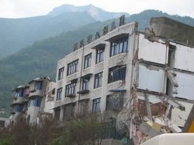
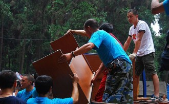
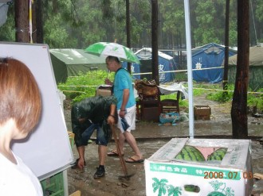
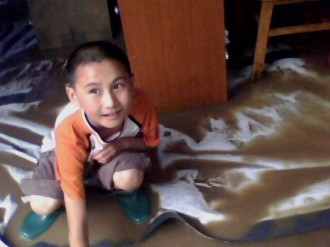
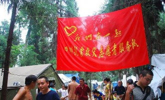
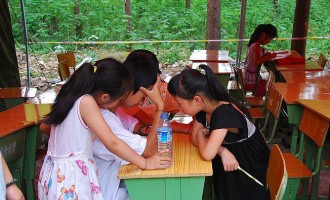

# 我们在一起（二）

帐篷学校迎来了鞍山义工走后的第一个外地志愿者，刘建锋，一米八五的个儿，长得白白净净，辽宁人。那时候学校已经更名，义工提议改的，他们找人写了几张毛笔字：“天池集团公司帐篷学校”，字用透明胶带粘在红旗上，把原先的名字遮住了。

刘建锋是大学生，但他的到来并未改变什么现状，反而成了众人生活上的累赘。吃饭他和义工一起吃，睡觉给他腾了个空帐篷，有床有沙发，但他还时常抱怨湿气太重，卫生条件不好等等。我心里想你他妈是来享受的？

我们带刘建锋去简易澡堂洗澡，他怕有人会偷窥他，我说他妈都带把的怕什么，他想了想，凑过来小声告诉我他从小就没跟那么多人一起洗过澡，我问他进没进过游泳池，他点点头，我说你就当是在游泳就行了，说着便不再理他顾自进了澡堂，刚洗了头，刘建锋赤裸着身子小心翼翼走进来，我招呼他过来一起洗，顺便给我搓搓背，他问我怎么搓，我说用手搓，刘建锋看了眼我背上地震留下的疤痕，开始给我搓背。

“你在给我按摩嗦？”我用四川话问他。

“你说什么？”刘建锋没听懂。

“我说你能不能使点劲！”我用普通话说。

感觉背上传来的劲儿大了些，我心中稍感安慰，可还没搓几下刘建锋就嘟囔着说他没力气了，他觉得也给我搓得差不多了，便开始洗头。待他洗完头，我让他趴下，我给他搓背，刘建锋说他自己能行，我说你能不能用脑壳走路，他说不能，我说那就对了，趴下！看我教你什么叫搓背！

刘建锋果然是温室里泡出来的，浑身细皮嫩肉，皮肤跟女孩似的，我卖力地搓了几下，疼得他哇哇大叫，我笑骂着你能不能不出声，大庭广众之下还不嫌丢脸吗？

洗完澡往回走，刘建锋从洗漱袋里摸出一瓶防晒霜，用指尖沾了点给脸脖子手臂上涂抹，他问我用不用，我说娘们儿才用，接着掏出那包五块钱的红河，给刘建锋一支，他没接，自己从裤兜里摸出一盒软玉溪，给我递来一支，好烟岂有不抽的道理，资产阶级本就是用来被掠夺的，我这个无产阶级的一分子抽几支也无妨，反正顺应历史潮流，我抱着被剥削阶级反剥削的态度伸手接过，他帮我点燃。

刘建锋在帐篷学校呆的那几天，陈小均曾带他去过汉旺广场，在5.12钟楼前照了张相片。陈小均问他进不进老镇废墟看看，刘建锋犹豫了下居然答应了，从矿部往天池煤矿家属区内走，几幢倾斜的危楼赫然耸立在面前，刘建锋不走了，陈小均说别怕，有他在呢，刘建锋还是执意不去，陈小均开始做思想工作，过了一个多小时，刘建锋终于鼓起勇气紧跟在陈小均屁股后面踩着地上的碎石进入家属区。期间发生了一次轻微的余震，差点儿没把刘建锋吓哭，四处张望着生怕有石头砸下来。天色渐渐黑了，陈小均带着刘建锋爬上铁路边的矿石堆，夜空繁星点点，刘建锋抽了支烟压惊，他说他以后再也不来这种地方了，陈小均只是笑笑没说什么。过了一会儿，俩人从石堆上下来，陈小均开玩笑说刚才那个堆上以前摆过很多尸体，刘建锋大叫起来，撒腿就朝尚有几丝光亮的广场方向冲，陈小均在后面紧跟着追去。

**⒉**

物资开始源源不断地涌入志愿者服务队，每天义工都要出几趟货车拉物资，其中不少是学习用具，分配到了罗成名下。罗成因管理学校很少出车，引起了其他义工的不满，再者有关学校管理方式的问题，他坚持原来的方式，而其他义工则打算彻底换一种，用正规学校的方式管理。在物资分配上，罗成只能拿到学习用具，但日常生活用品几乎没接过手，义工团队出现了内讧，分成了两派，最终事情无法解决，他们只好妥协折中找了个办法：重新选一个学校负责人出来。但选谁呢？选谁两边的人都不服气，于是有人提议说从志愿者老师中选。再后来，当时唯一的重点高中生我，理所当然地被他们内定为学校负责人，全权接手学校的管理和物资分配发放。

他说他适应不了这种生活，要回辽宁。我给他点燃一支烟，算下来两毛五一支的红河，他第一次抽这种劣烟，有点呛。

成铁局来的时候刘建锋还没走，记忆中那天下着雨，头天晚上开始下的，电闪雷鸣，天亮后雨小了很多，我撑着伞去学校，远远就看见一顶红帐篷倒了一半，我赶紧跑过去，地上的积水被我踩得四散飞溅。走近后才弄清楚，原来顶棚积了太多水，把它压垮了，支帐篷的空心钢管断了一半，怎么也撑不上去，我只好把一边供老师休息用的帐篷搬过来，这时其他志愿者也陆陆续续到了，我们纷纷找来布料当抹布使，把雨水浸湿的课桌椅子擦干。小屁孩们跑来上课，我招呼其他几个老师看着点，自己去找义工团队商量事情。

我打算再开垦一块地出来。

雨停了，我、刘建锋、王勇和几个没出车的义工，扛着铁锹铲子开始在学校旁边的一处杂草丛扫荡。柏林公园生长着一种带刺植物，我们当地人称它豁麻，茎叶毛茸茸的，但只要人稍微一碰，哪怕就挨了一根细毛，便会感觉像是蜂蛰了，疼痛难忍，如果接触得过多，皮肤会立即产生浮肿，浑身瘙痒，若不及时就医治疗，对人体会造成更大的伤害。我们几个戴着手套，用雨衣把裸露在外的皮肤遮住，用从灾民那借的镰刀先把齐腰深的豁麻割个干净，然后铁锹铲子并用把低矮的草丛清除掉，陈小均找了袋石灰薄薄地撒在翻腾出的新鲜土地上，我们又盖上一层土，并踩实了，我们把那顶半破的帐篷搬过来暂时放这才算告一段落。 ** **

雨又开始下起来，积水从高地流淌，有些顺着流进我们刚开垦出的空地里，我和刘建锋只好再次披上雨衣，提着铁锹在空地两侧挖排水沟。正干得火热，我听见不远处有些喧哗，转过头，原来是一队外地来的志愿者，他们风风火火地走过来，小屁孩们正在上课，见有生人进来便专不下心了，我停下活吼了一声，然后把进入警戒线内的志愿者请到另外一顶救灾帐篷。谈了会儿，我了解到，这些志愿者是成都铁路局的职工，自发组织起来上汉旺镇捐赠物资，经过柏林公园安置点时听说有个帐篷小学就进来了。

成铁局一共捐赠了十二套他们办公用的桌椅，两箱苹果和梨，六箱西瓜，四箱文具。小屁孩儿们下课后，他们一起合过影便匆匆离开了，我问他们是不是回成都，一个中年男人告诉我，他们还要去趟北川。刘建锋破开一个西瓜，我和他站在漏雨的破帐篷下吃了两块，刘建锋和我一样，衣服全湿透了，刘建锋从防水背包里掏出手机，让我给他照张相，镜头里，刘建锋额头上长长的刘海湿漉漉地粘在一起，手里捧着才啃了一半的西瓜，龇牙咧嘴地笑着。

我给阿建打去电话，他已从浙江回来，参加了高考，正闲在家里，我问他想不想来帐篷学校，他二话没说便答应了。杨成建在高中课程中惟独地理强大，平时的爱好之一就是看地图。我这人特没方位感，地理成绩自然不消说，只得靠背书勉强捡个七八十分。

我走马上任的第一件事就是发书包，现在库房已经累积了数百个，我放出消息，当晚便来了一大群小屁孩儿排队领取，第二天，我又开始发铅笔，这次来了更多人，甚至不少家长都过来凑合，明明自己儿子刚领完却说她儿子不在家她来代领，我没说什么，把两支铅笔给了这个女人。

第三天便不再发了，我从库房淘出几捆故事书，给来上课的小屁孩儿们一人几本，还附带两块橡皮擦。灾民安置点的人听说又发东西了，纷纷怂恿子女去领，但我却委婉地告诉他们，文具数量不多，只够给在校生用。事实证明，群众的眼睛是雪亮的，他们哪儿会不知道我话中的意思，第二天一大早便把熟睡中的儿子女子叫醒，去帐篷学校读书。那天居然来了七十多人，教室被占得满满的，我只好把成铁局捐的办公桌椅搬过来才搞定。

整整六十套课桌放着有点挤了，而且地势高低不平，桌子也东倒西歪，我把几个志愿者召集起来，计划利用次日周末放假把地推平，见大家表示同意，我便和阿建（杨成建）回到我家帐篷，吃过饭，我们抽了支烟，阿建说，杨侑，明天开同学会去不去？

“有哪些人？”我问。

“全班同学都在。”阿建回答。

“何玄和刘茂也在？”我紧接着问。

“锤子，两个烂帐去年就当兵了，你装傻嗦？”

“她也在么？”

阿建点点头，顿了会儿，阿建问我：“你娃心里头还挂着张苗嗦？”

我没回答，又点燃一支烟，抽了两口。阿建也不多问，静静地蹲在一旁。

“你明天不是要去学校推地吗？”阿建给我找了个可以不去的理由。

我把最后一截烟吸完，“我想跟曾经做个告别。”我扔掉烟头，淡淡地说。

**⒊**

高中毕业的散伙饭定在德阳市区的一家大型自助火锅城，我原以为会在饭馆之类的地方，但转念一琢磨，肯定班里的领导同志要划AA制，大伙儿凑钱吃饭，为了占尽中小资产阶级的便宜，他们才最终决定去吃自助。

我经过多番苦苦哀求才从我妈那里要了100元，看着钞票上的毛主席头像，我心中不禁感慨，毛主席啊，我追随您追了这么久，费我九牛二虎之力才拽到手中，不容易呀！看来您说得对，前进的道路是曲折的，但只要狠下心来，任何艰难险阻都是纸老虎。

从南门车站搭车，由于人太多，我们只好分成两拨，我在第一拨，张苗在第二拨。

我坐在靠车窗的位置，看着窗外道路边呼啸而过柏树，犹如我们的青春，还没摸透到底是什么样子便匆匆消逝了，此时，一股淡淡的伤感顿时涌上我的心头。我莫名其妙地掏出电话，给江敏明发去一条短信：今天吃散伙饭，我在德阳。

她不在，我在短信中写着，我们不同路，只是一起吃个饭。短信发出前，我又补充了一句：可我只喜欢你。

江敏明没有再回短信，每条一毛钱的信息费未能起到任何作用，我靠着后垫眯盹了会儿便到达德阳汽车站。我和几个哥们儿蹲在候车大厅，马脸买了袋薯片和几个女生共进（食），我、李小雨、杨成建、王帅几个哥子等第二拨人等得实在不耐烦，一人叼支烟，痞子似的站在入站口怀着对美好事物的无限向往观赏经过这里的漂亮女孩。

大概过了半个小时，第二拨人终于赶到。我们几个恋恋不舍地把含满审美艺术的视线从漂亮姑娘的身上移开，转而望向正从车上下来的黄脸婆们。负责这次散伙饭的同学有三个，张苗、王欢欢、曹婷，她们曾经担任的职务分别是班长、生活委员、文娱委员。王欢欢一下车就冲我跑过来，那满脸已经熟透的疙瘩仿佛随时都会爆破，着实把我吓得不轻，就差抱头鼠窜了。王欢欢来到我跟前，以迅雷不及掩耳的速度伸出爪子狠狠地拧了我胳膊一把，然后扯着刹车失灵的尖嗓子大声说：“杨得艺（高中时改成杨侑）！你居然也来了！”

我心惊胆颤地拍掉她的手说：“您…您歇着点。”

王欢欢突然凑到我耳边说：“张苗在那噢！”

我愣了愣神，不再说话。王欢欢接着说，为什么你总是一见着张苗就变老实了，一点也不像你，你很怕她吗？可我怎么也不觉得她哪儿可怕了，张苗简直就是你的克星，你就从不敢在她面前扯淡，只要她在，你总是一副好好学习天天向上的样子，那根本不是真正的你，你是为了在她面前保持好形象吗？还是你很喜欢很喜欢她，所以你一直克制自己的真实，你在她面前始终古井不波道貌岸然，你甚至舍不得哈哈大笑……

“以后不会了！”我打断王欢欢无休止的废话，摸出一支烟点燃，朝廖然走去，王欢欢在后面冲我喊着：“杨得艺，你没看见张苗就在那边吗？你居然还敢抽烟！”

廖然是我读高中关系挺好的朋友，以前没事儿我就调戏她，她样子长得倒挺标致身材简直是魔鬼可就是皮肤黑了点，为此她不惜把大把大把的钱扔在能改善肤色的化妆品上。我记得有次上早自习，廖然在我身后拍了我一下，我转过头，廖然说：你看我今天漂不漂亮。我当时定睛一看，魂都差点吓没了，只见一张惨白的脸上披散着丝丝缕缕的黑发，随着还未大亮的天空吹进来的风左右摇曳，我颤抖着说，你整我可以但不要吓我好不好，哥我脆弱的心灵港湾经不住你的轮番轰炸！

今天廖然打扮得挺漂亮，磨白的牛仔裤把本就细长的腿部曲线勾勒地玲珑有致，不知道是给谁看的。我拉了拉她挂耳朵上的银环说：“啧啧，可以当手镯使了，哥们我小时侯手腕上戴的银环也没你耳朵上这型号大。”

廖然嗔怒着说：“我就喜欢，怎么？”

我也喜欢。”我说，廖然一时还没反应过来我又紧接着说，“什么时候再挂个鼻环，我牵着更方便了。”

我们几个兄弟伙乘出租车先去了火锅城，张苗和大部队在后面等公交车。

**⒋**

坐在火锅城前台的沙发上，我抽了支烟，漫不经心地四下张望着。先前我刚买的鲜橙多，才喝了两口就被王帅抢走了。王帅是清平乡人，全家都做矿石生意，在清平山上，数王家坪的人最有钱，而王帅一家则是其中的翘楚。这次地震虽然对他家造成不小的冲击，但毕竟做了这么多年了，祖祖辈辈靠山吃山也攒了不少钱。王帅今天心情似乎很好，穿得也随意，顶着西瓜皮儿似的刘海跟林明超胡吹乱侃。

待人到齐后，我们浩浩荡荡涌进火锅城，前台的服务小姐脸上顿时笑开了花。这个大门面的火锅城自助餐的档次是同行内较高的，酒水食物一律随便吃，侧面靠墙的地方一顺溜的采餐点，几乎能找到你能想到的所有食品，地上飞的天上游的水里爬的甚至连蛋糕奶茶冰粉都一应俱全。

我们坐了四大桌，两桌女生两桌男生，这么安排座位是张苗的意思。因为没有喊班主任来，所以我们也不搞饭前讲话那一套，先吃了再说。

我在绵竹中学读高2008级5班，班主任是童斌，我们给她取的外号叫天山童姥。在绵竹中学，见着老师都不称呼老师，而是什么什么老，比如数学老师李双建，我们就叫他李老。我读高一时还在12班，文理分科后才进了文科班5班，早就听说这个班班主任的大名了，全校出了名的穷凶极恶。而当时文理整合后的5班，汇集了全年级绝大多数烂账，很多老师开学前就告诫童斌，这个班不好管噢！为了不影响几个哥们儿的声誉，我就拿自己举例吧！高一，我以全市89名全校54名的成绩进入绵竹中学，一个月后，我名次降到全校576名，之后我连记三次校告。第一次因和南轩中学打群架，但我妈后来跑了下关系，校告内容被改动成平时行为习惯不良，记严重警告。第二次是因为夜不归宿，翻墙在网吧通宵，被抓后我又逃到南轩中学，翻墙进了寝室找了个认识的哥们儿睡了一夜，而且这次离第一次校告仅一周，连一个月观察期都没到，记大过。第三次我差点被开除，我和足球队逃晚自习在外喝酒，结果喝疯了，第三节晚自习跑回来在教学楼下大呼小叫，被班主任发现，她把我拖到11班罚站，我又当众在讲台上调戏11班班花陈雪蕾，下晚自习后我回了寝室睡觉，第二天我妈被请进学校，在语文组办公室，面对班主任的辱骂我气急败坏地踢了她一脚，最后趁乱跑了。我妈找了很多关系才把我勉强留下，记了保留学籍，留校查看。理科跟不进，高二我选择了文科，在张苗的帮助下，我彻底断绝了社会上所有狐朋狗友的联系，把精力投入到学习中，仅高二一年，我从年级倒数上升到27名，班级第一名。

绵竹中学这所重点高中，我当时的名次意味着只要不出意外的话，一只脚已经迈进了一类本科的重点大学。

事实证明，童斌在班级管理上还是有一手的，其实跟她多厉害也并无太大关系，上高二后，大多数曾经的烂账已经觉得混日子没劲了，觉得有劲的也被开除了，所以，我们这个班反而成了整个年级最老实的班。

童斌在5.12地震后便没了踪影，后来有人听说她暂住在一家酒店，班里的干部去找她，希望能在她的带领下找地震中未受损的学校读书，童斌死活不愿意，反而不是班主任的政治老师始终在帮我们联系学校，东电中学便是她给找的。

毕业散伙饭本打算叫上政治老师和历史老师的，却由于她们忙不开便未能前来。李小雨推了一车啤酒过来说，哥几个先整一瓶！

我们男生这边吃菜的少，一直喝酒，泡火锅里的鸭肠都煮老了也没几个人夹，而女生那边，个个都饿狼扑食般，生怕这顿饭吃亏了，那每人30块得把老本吃够再说。后来，李小雨领头跑女生桌那边敬酒了，曹婷这个嘴子（爱出风头）一口把一整杯白酒拉干净，李小雨只好先把杯里的啤酒干了又满上白酒再干，怎么着也不能让女人瞧不起。

高中毕业前，李小雨和马旭玫分手了，谁也不知道为什么分的。那天李小雨一直敬酒，平均下来几乎每个人都被她敬过。我那天心情也不好，从头到尾坐着喝闷酒，有人来敬我就喝，后来廖然给我端了杯白酒，我一看就郁闷了，我不会喝白酒，别说一杯，一瓶盖我都晕，啤酒随便喝白酒我就不敢。但我还是喝了，高中结束，人人都会分道扬镳，在追寻自己的梦想前，谁也不想留下遗憾，也不好意思给别人留下遗憾。一杯白酒下肚后我果然开始晕头转向了，也不再闷坐那，跑女生桌敬了一圈。途中尿急，我上厕所，发现李小雨躺在厕所地上，我脑袋还没完全糊涂，于是把他扶起来，两个人晃晃悠悠往厕所外走，刚到门口，李小雨突然手臂一扫，把门口的两个盆栽打翻在地，碎了。操，资本家可不是好惹，指不定又要狮子大开口嚷嚷赔钱！我赶紧把李小雨拽出厕所，幸好没人看见。

我过来后又喝了十多杯啤酒，当时都处于半痴呆状态了，后面发生的很多事我都是听别人给我讲的，自己只是模糊地记得一些，其他则全忘了。我扶着李小雨出来，李小雨先倒了，我跟着躺下去，几个女生立马把我们俩拽起来，我脱下仅剩的短袖，李小雨也脱，我们赤裸着上身，李小雨还把衣服往天上甩。我记忆中自己又倒了，脑袋撞到桌子，然后清醒了些，在王欢欢的搀扶下爬起来。廖然喊着我的名字哭着把我抱住，我愣了下，口齿不清地对她说，哭可以，但不要在我身上抹泪水，怪粘的，我回去洗澡还得用洗洁精。我又和几个哥们儿搂搂抱抱了两下，方医生（方奕生）一把鼻涕一把泪在我身上四处乱蹭，我连忙把他推开说，哥外套兜里有纸，我老家养的猪就你这副模样，洗澡不用水，往稀泥里一滚就在树上蹭。我和曹婷、李雪芹等几个女生哭哭啼啼毫不忌讳地轮流抱过后，张苗从座位上站起来，穿上外套，似乎要出去。我把手里一直抓着的酒杯放下，脸色郑重，王欢欢说我当时表情跟国家领导人似的，就是形象有点龌龊。我一直目不转睛地盯着张苗，有人提醒她，张苗也转过头看我。我想了想，说能不能最后抱你一次，张苗不说话，其他同学开始在旁边起哄，我吼他们了一声，又把语气变平静，我重复了一遍刚才的话。张苗脸蛋红红的，不知道是羞红的还是喝酒喝红的，她犹豫了几秒轻微地点点头，我张开双臂正要搂她，张苗把我拦住，她让我先把衣服穿上，我只好又从椅子上抓起衣服套起，张苗这时候已经下了阶梯，我感觉自己被耍了，不顾周围的几百人朝她大声喊：“我穿上衣服了！但我还没抱你！”张苗愣了愣，站在原地。我走过去，她抬起头，主动伸出手，我把她死死地抱进怀里。我第一次抱住这个曾经深深爱过两年的女孩，过往的一幕幕犹如胶片电影一般在脑海里不断闪现。我在她耳边轻声说：“谢谢，我希望你以后能幸福。”张苗松开手，挣脱开我的怀抱，和几个女生离开了。我站在原地一动不动，又提起一瓶啤酒，仰头喝了个干净。

我被同学半推半抬去了一家KTV，在包间里我疲惫地倒上沙发，脑海里没了任何意识。

过了会儿，我从沙发上爬起来，站在闪光灯下的舞池中央，我左右摇摆，扭动着疲软无力的身躯，我不知道自己想要表达什么，我心里很乱，乱成一锅粥。音响里间歇不断地播放着强劲的DJ，我耳朵里却阵阵鸣响，仿佛世界都慢了下来，我倒了下去。

再次醒来的时候，我依旧躺在舞池中央，只是不知道什么时候脑袋下枕了只棉绒的垫背。人已经走得差不多了，我跑去厕所呕吐了一阵，再出来就遇到了廖然，我给阿建打去电话，他说他在打麻将，我问哪个地方，阿建把地址告诉我，我和廖然打车赶了过去。

廖然是个麻将迷，以前上学的时候每到周末她经常和林超王帅杨成建文勋几个找茶吧打麻将，输赢不大，打五毛，反正是娱乐。廖然的到来立刻把杨成建驱赶开了，我不会玩麻将，坐在一边，脑袋还晕着，不过意识已经恢复了许多。我掏出手机，拨了江敏明的号。

“我是杨侑。”我说。

“我知道是你，怎么了？”

“我想你，我无时不刻不在想你，你知道吗？”我不顾几个同学的哄笑继续说。

“你是不是刚喝过酒？”江敏明问。

“就是。”

“你一定是喝醉了。”

“我没醉，我现在比任何时候都清醒！”我吼了起来，“我现在脑海里最清醒的一件事情就是我不能失去你，我第一次见到你我就知道我这辈子就只喜欢你，我甚至可以放弃生命地保护你，我什么都可以按你的意思办，你怎么说我都听，我爱你你知不知道！”

“杨侑，你别说了，我们不可能，请你珍惜你的张苗。”

张苗？我追她追了两年，我为她和几个最好的哥们儿绝交了，我为她每天晚上一点睡觉五点起床拼死拼活把成绩搞上去，我为她不知道顶替了多少本来与我毫无关系的错误，可到头来呢？我什么也没有，她不喜欢我，我时时刻刻都能清晰地感受到她现在对我的冷漠，我死缠烂打了这么长时间，哥们儿都说我变了，变得不像个男人了，他妈的连烟都不敢当着她的面抽，他们说我简直是不可救药。我告诉你，不是！我一万分清楚的知道，我只对你无可救药，江敏明，我爱你！我爱你！我爱你！”

那边挂断了电话

下午5点，我从麻将馆里的昏睡中醒来，廖然和他们还在打麻将，杨成建递给我一瓶冰镇的矿泉水。我喝了两口，顿时感觉清醒了许多。我费力地从沙发上爬起来，和阿建走到麻将馆门外，夏日的阳光依旧火辣辣地灼烤着地面，我又喝了一口矿泉水，然后点燃杨成建给的香烟。

我把手机摸出来，发现里面竟然有七八条未读短信。我把它们一一打开。

“杨侑，你不要这样子好不好？你这样我真的很心痛你知不知道？”

“我都被你急哭了，我不想哭，你一直说一直说说个不停，我还是哭了。”

……

“你晓不晓得你发疯了！”杨成建蹲下身说。

“我没疯。”我还能依稀记起两个多小时前的那个通话。

“都那样了还没疯，我当时真想扇你两耳光。”杨成建说。

“你现在扇吧！”我说。

“你不能还手.”

“他妈的娘死了才还手！”我说。

杨成建最终没有动手，他给自己也点燃烟，抽了两口，然后对我说：“那个江敏明不值得你喜欢。”

“为什么？”

“感觉。”杨成建说。

“男人的感觉通常不靠谱。”我说。

“那你就当我是女人吧！”

“就你那操行。”我笑骂着说。

“你听我说话没有？”杨成建问。

“你觉得谁值得？”我问。

“江敏明和张苗都不值得，真正值得你去爱的女孩还没出现。”杨成建摆出一副老谋深算的样子。

“说的还不是屁话！”我扔掉烟头，锤了他背上一拳。

晚上，我和王帅阿建几个去了东湖山公园，点了两只烧鸡，一人干了一瓶二锅头，跟王帅一起的还有一个女孩，是北京来的志愿者，相貌很乖巧。

第二天上午，我和阿建从网吧出来，乘车回了汉旺。

**⒌**

在柏林公园下车，我从兜里掏出一张先前在网吧上通宵后擦过脸的湿巾，擤了擤因过敏性鼻炎而流淌不止的鼻涕。昨天晚上在德阳跟林明超敲了几杆半年多没摸过的台球，连输三局，我不信自己运气真就这么背，并把原因归结到身上穿的黑色薄外套上，我脱下外套，甩着膀子又敲了两局，还是输。当时凉风席席，我的过敏性鼻炎便犯了。

回汉旺这天是星期一，抵达灾民安置点已经是上午10点，我给留守的志愿者许文娟打去电话，问她这一天多时间学校咋样。

“侑哥！你终于回来了，你不在那些学生都闹翻天了，我喊都喊不住！”许文娟在电话里连声抱怨。

你先别说我回来了，一会儿过来。”我说。

“侑哥你在哪儿？”

“安置点门口。”

我和阿建回到帐篷，洗漱一番过后又吃了两袋我妈领的饼干，换上志愿者白色短袖，我对阿建说，呆会儿咱们绕过去，瞧瞧我离开时这群小屁孩儿到底野到什么程度了。

这个时候的我，早已不是当初站上讲台连话都抖不清楚的傻愣了。这所帐篷学校的小屁孩，很多都和我一样，矿工子弟，对这类阶层我比谁都了解，我小时侯虽然家教严格比较老实，但其他哥们儿可狠着呢，所谓君子动口不动手在咱们这不顶用，你要是来事儿那么咱们招呼的只有拳头钢管和自行车锁子链。水靠瓶装人靠武装，枪杆子下出政权的道理咱们这群矿工子弟比谁都懂。别瞧小屁孩儿们长的眉青目秀俏皮可爱，发起狠来没几个能安分守纪。

我和阿建从安置点门口爬上土坡，沿路往学校方向走，穿过一片松树林便来到一处土坡上的空地，我突然发现这块空地无缘无故冒出一顶帐篷，不是那种红十字会发的救灾帐篷，是人用树枝和彩条布搭建的。帐篷很结实，有门帘遮着。我敲了两下木头桩子，里面没人回应。我问阿建，这什么时候盖的？阿建摇摇头，表示他也不知道。我稍稍留下心，待以后再来探探明白。

顺着蜿蜒的坡道，我们绕到学校帐篷背阴面，教室里正在上课，胡赟正扯着嗓子喊安静，见没反应她又吼起来，除了前排几个没再说话，整个教室依旧鸟雀声响不绝于耳，甚至有几个特捣蛋的小屁孩握着文具盒当惊堂木拍课桌，朝正在破口大骂的胡赟叫着“大胆刁民，竟敢对本座如此无理，来人啦，把她给我拖出去，斩了！”

听到这里，我和杨成建忍不住笑了，啧啧，有意思。我不再捂着嘴，并强迫自己板起脸，然后一步一个脚印地从帐篷后面走出来，站在胡赟后面，顿时，教室里一片死寂，连动都没人动。胡赟脸都被气得发紫了，突然见小屁孩儿们乖乖地坐着不禁懵了半秒，我假装咳嗽一声，胡赟见到我在，正要说什么，我抢先说，你先休息一会儿，这堂课我来上。

“大胆刁民？嗯？蒲兰俊你现在还成衙门老爷了？怎么不接着拍你的惊堂木把我也斩了？是不是见我胡汉三又回来了你没底气了？嗯？”我扶着前排课桌，皮笑肉不笑。

蒲兰俊使劲憋着，生怕自己笑出来，连忙把头低下，一副诚恳认错的模样。

“今天我不跟你计较，咱哥俩先把账记着，过段时间慢慢算。”

这堂课小屁孩们上得是七上八下啊，我光看他们那庄严肃穆的表情就没兴趣讲课了，个个都把手平放在课桌上，两只眼睛直勾勾地盯着黑板。我把徐志摩《再别康桥》写在黑板上，下节课教他们朗诵，怕他们看不清楚，我特意把字写大了些。

“杨老师，那个字念啥子？”读二年级的吉扬帆举手问我。

“漾，荡漾，捡石子儿扔过水漂吧，那一圈圈波纹抖动扩散就是荡漾，understand？”

“No！”吉扬帆说。

“把你矿泉水瓶子拿出来。”我说。

吉扬帆从课桌底下的书包里掏出瓶子，水已经喝了一半，我示意他摇两下。

“看到里面水的晃动没？这也是荡漾，understand？”

“Yes！晓得咯！”

下课后，不少低年级学生还没抄完，我吩咐几个成绩较好的高年级孩子坐在一边讲解，然后把杨成建叫了过来。

“我发现一个问题。”我从兜里摸出烟，正要点燃，一想这是在学校，又把烟装回去。

“我也发现一个问题。”阿建喝了口水。

“你不觉得这些屁娃儿大的大小的小，学什么都一起学不合适吗？”

“是不合适。”他点点头。

“再这样下去恐怕不行，讲难了低年级的听不懂，讲简单了高年级的不想听，我打算分班。”我皱着眉头说。

“可教室装不下，咱们就两号这帐篷，还有个坏的。”

“你先说你的问题。”

“我想的正是这个装不下的问题，我们需要帐篷，人越来越多了。”阿健说。

中午，我找到义工团队，问帐篷的事，温波说现阶段还很难搞到这型号的，用来睡人的帐篷倒好找。我悻悻地回到家里，刨了两口饭，吃不下去。这时，我接到郑鹏的电话，约我去德阳游东湖山。大爷，又是德阳，我现在想着德阳就郁闷，我告诉郑鹏自己在当志愿者，抽不开身。郑鹏问我是不是在火车站搬物资，我说我在管帐篷学校。

“我能不能帮点什么忙？”郑鹏问。

“来给哥锤锤背揉揉肩捏捏腿，哥现在累着呢，都一百零几斤了。”

“我明天来看你，要不要买点文具什么的？”

“随你便，你能买个帐篷更好。”我说。

“什么帐篷？”

“操，你还真买啊？有钱么？”我说。

“我这就有帐篷，跟遮阳伞差不多，上面给我爸发的，但用不着，堆屋头都有一个月了。”

“老子现在想给你一泡精华液了，就…就要那种！”我激动得语无伦次。

“可以，没问题，全给你。”郑鹏笑着说。

“我下午就去绵竹找你拿。”

“不用，明天上午我喊我爸开车子给你运过来，反正我也想来看看。”郑鹏说。

**⒍**

郑鹏运来的三顶帐篷是商用帐篷，不过和我们的红顶帐篷一样，只是他还带了帐篷四周的围布，防止雨水飘进里面。郑鹏家是圣象地板在这一地区的经销商，他爸说就当是代表他们圣象地板来慰问了，郑鹏没说什么，中午，我、郑鹏、阿建几个买了点板鸭，在公园的假山上吃了一顿，没敢喝酒，下午还有课。郑鹏说，早晓得就不给老爸说这事了，自己开车运来得了，省得他见人就打广告，郑鹏几天前考了驾照，对自己的驾驶技术信心满满。

眼看快上课了，郑鹏说他还得去学电脑，于是留下四个新买的书包、几支钢笔、一打铅笔和一大堆作业本。作业本是他初中和高中六年积攒下来的，捆了6捆。

下午我没课，于是清点了两个小时库房，把有关学校的捐赠物资作了分类和数量统计。放学前，我给小屁孩儿们通知了一件事情：明天放假，后天星期天，下午有个家长会，家长会结束后会分发一批学习用具，小学教材和生活用品，希望同学们能把消息带到，帐篷相邻的也可以互相通知一下。

“我相信会来很多人，而且以后会更多。”小屁孩儿们尽数离开后，我和杨成建点燃烟，我笑着说。

**⒎**

周六，我们几个志愿者结伴去了公园后的柏林水库，听说那里鱼多，我找安置点里一个爱钓鱼的大伯那借了两根竿子便动身出发。

水库一侧的堤坝被地震震裂了，现在里面只躺着不到原来十分之一的水，听其他前来钓鱼的大老爷们说这水还深着呢，掉下去都捞不到人。

我们沿坡道慢慢移动，岸边躺满了臭气熏天的死鱼，我用脚尖顶开一条，死鱼先前贴着地的那面爬满了肉鼓鼓的蛆虫，我一阵恶心。

钓鱼是件靠耐心的事，最重要的两点是运气和手感，缺一不可，我今天受马克思照顾，漂子下水不到一分钟就有鱼咬钩了，手里的竹竿轻微晃动了两下，我也跟着晃两下，这时，鱼咬着沟往岸边游，我心里暗笑，你他妈的跟我斗智斗勇，也不掂量掂量自己的重量。就凭那咬钩的过程我就知道它不过是条白漂子而已，体型狭长，刺多，只能用来炖汤喝。为了图个开门红的彩头，见漂子往湖心漂去，我猛地回拉鱼竿，鱼上钩了。半空中，白漂子细小的鳞片在阳光下反射着耀眼白，阿建说，这么快就开张了，我笑着说，别，您这么一说我倒不好意思了，一种智商上的优越感油然而生呐。

中午我吃了两袋方便面，干吃，结果没吃完。我就没吃过这么难吃的方便面，按理说我这人不挑嘴，只要不是毒药能吃我就都吃，但这种方便面，吃着却跟啃橡皮筋似的，也不知道哪家企业捐的，估计把卖不出去的存货全倒腾过来了。

这次钓鱼收获不小，草鱼和武昌鱼各一条，白漂子整整塞满一桶。但愿明天的家长会，也能如今天钓鱼一样，来个满盆钵满。

周末，我洗了头，换了套新的志愿者短袖，撕了张手型鸽标识粘在胸前。阿建扯了扯我领口，你去相亲嗦？

“差不多吧！”我笑着说，“给这群小屁孩儿们相亲，他们家长要是觉得我这人靠谱，这门子喜事算是定了。”

整个上午被我用来列讲话提纲，毕竟第一次搞这个，得打好提前仗，以前在学校也没当过班长，虽然代历史老师上过课，但现在面对的是和我妈岁数相差不大的叔叔阿姨们，我还真不敢肯定能咬住他们。

我喝了四瓶矿泉水，吃了三袋饼干，倒腾了两罐子午餐肉，面前的草稿纸上终于艰难地摆出二十多个字，包括几个要点，其它的怎么也想不出来，我看只有靠自己临场发挥了。

我点燃一支烟，渐渐出神，革命能否成功就看哥我这拼死一搏了。

中午吃完饭，我和阿建躺床上休息了半个小时便去学校，阿建走之前带了一瓶水，我问拿水干嘛，他说给你喝的，我自嘲地笑了笑说没必要，可能不到5分钟会就开完了，我显得十分没底气。但后来的事实证明，阿建说准了！

1点30分，渐渐有小屁孩背着书包来了，有的跟着家长，有的跑过来给我说他爸爸一会儿就到。我心里想这个“一会儿”估计不来了，没戏。时间接近两点，教室里已经坐满了家长，虽然也在自己意料之中，但还是不由得一惊，看来这批学习用具是送定了。后来甚至不少家长都没地方做，我们几个志愿者又把成铁局捐的办公椅子全搬出来，在帐篷教室边供他们使用。

两点整，我七上八下地走到黑板前，面对着黑压压的人群，我心里更没底了，很多互相认识的家长闲聊着，对我不理不问。在尴尬地沉默半分钟后，我终于鼓起勇气，开始讲话（普通话）：

请带手机的叔叔阿姨如果没有要紧事先别用手机，当然我这不是强迫，我只是希望你们能抱着认真的态度开这个家长会，因为你们的子女一天中有三分之一的时间呆在这里，如果你连这个不用缴学费经常发尺子铅笔的学校一点都不了解，我想如果是我，我是不会放心把自己的儿子放到这里的。

我想很多在座的家长是认识我的，我爸也是天池煤矿的矿工，我妈是友谊桥摆烟摊卖米粉的，很多人可能去吃过。我爸叫杨林，我妈叫叶世蓉，我叫杨侑，现阶段是这所帐篷小学的负责人，如果方便理解地说，我就是校长。我毕业于绵竹中学，家属区里很多家长一定在两年前听说过我的不少事，我毕业于重点初中，高分考进重点高中，却成了一个吃喝嫖赌的社会人渣，具体经过你们私下可以互相交流，但我可以很负责任地告诉你们，我高中毕业时的成绩全班第一，年级27名，我的分数已经达到重点本科线，最重要的一点，我两年前就和社会上的狐朋狗友撇清了关系，虽然当下我的精神境界不至于上升到人民英模的程度，但我想，我至少和有良心的人没什么差距了。

说到这里，下面一阵哄笑，我顿了顿，继续说：

说到良心，我想在座每一位都有良心，但良心是否占据了你的生活的主要方面我就不得而知了。我可以明确地说，在帐篷小学这一块，我的良心从来没有丧失过。这一点你们可能会问‘你有没有丧失我咋个晓得’，我就拿志愿者来说，我对每一位新来的志愿者说的第一句话是，‘你来这是为了干什么？’我得到的答案中绝大多数人说是为了帮助孩子们走出阴影。我就纳闷了，于是问怎么走？对方便沉默了，有人也说他要带领孩子做游戏，唱歌，画画等等，我说那你会玩几种游戏会唱几首歌画了几幅画？对方基本上又沉默了，但是，还是有少量人回答上来了，我就再问‘请你给我解释一下奉献这两个字的意思。’这个字的意思小学就学过，不索取任何报酬地帮助别人，这就是奉献。最后我会让这个志愿者先呆上一天，上一天课，我就回家睡觉。结果，这个人第二天连招呼都不打一声就走了。为什么走了？因为这群孩子简直快把他肺气炸了，请各位家长想一想，你们夫妻两人带着一个孩子，有时候惹火了还动手动脚，惹毛了还拿皮带抽，但我们不敢，我们不是他们的监护人，没这个权力，要知道我们矿工子弟都是出了名的好动，真折腾起来可不是好管的。所以，这样没点耐心的志愿者，不要也罢，多他不多，少他不少。我想这种朝三暮四的人来管你们的子女你们也不愿意。

我越说越兴奋，杨成建把矿泉水递过来，我没接。

在座的家长我都是喊叔叔阿姨，我下面会说点很直白的话，招呼打在前头，希望你们能够理解。我知道，不少人是抱着我们帐篷小学天天有免费的笔、本子、文具盒发才送自己子女来的，如果是我，我也会这样做，有便宜的肯定不要贵的，有免费的肯定不要收钱的，还有一部分家长，因为地震后忙着找工作或者办理杂七杂八的事情，抽不出空管娃娃，这个安置点设在柏林公园，到处都是杂草树木，野兽还没有，但蛇是肯定不会少，豁麻到处长，最危险的就是后面的大水库，只要掉下去，你世界冠军都游不起来，这部分家长基于孩子安全的考虑，把我们这个学校当成寄放点，让子女呆着省得操心。另外一部分家长，自己闲，子女也闲，天天围着吵过去吵过来，干脆放我们这，娃娃多，有个伴儿。最后仅有很少一部分家长，是真正让孩子到这来是认真学点有用的东西的，我尊敬这样的家长，当然，话这么说，并非我就看不起别的家长了，我没有看不起人的权力，我和大家一样，都是俗人，没点利益谁愿意来这破地方。

有人会问，‘我看你们学校一天除了唱歌画画拿着本《弟子规》念就没点别的学习内容了吗？’，确实，以前的帐篷小学的确是这样，帐篷小学的建立者是鞍山义工，后来他们走了我才接的手。辛骁峰你们都认识，可能你们最不习惯的就是他的佛教徒身份，是，我也看不惯，但你看清了没有？都说骂人你连你要骂的人是谁，是搞啥子的都整不明白你骂啥子骂？又有人要跟我争了，‘我又没那么多时间去看你是啥子人，管你是吃干的还是拉稀的，我只要听着不对头就撤标’，那好，我现在告诉大家，我眼里的辛骁峰是怎样的人，他心高气傲，爱慕虚荣，成天摆着一副吃亏吃多了的脸，但是，他从来到最后离开，他筹集了价值70万的物资，包括生活用品和学习用品，在这里，他用什么，就拿自己的钱出去买，连牙膏都舍不得用外边捐赠来的，他本人投入了毕生积蓄的一大半到灾区，而我们呢，能拔根毛都算不错了，在他管理学校的那段时间，他从未讲过一个与佛教有关的事，他甚至不在我们志愿者面前微笑一下，却成天面对你们的子女脸都要笑烂了，有几个不懂事的小孩拿文具盒敲他脑袋，劲儿使大了，流了血，他吭都没吭声，他每天早上5点起床，晚上12点和4点巡夜，如果是你，你能熬过来，没一分钱工资？我觉得，在帐篷小学，一门心思地对这些孩子好，那就是最称职的志愿者了，难道辛骁峰还不够格？

坐在座位上的家长一片沉寂，他们一动不动，死死地盯着我。

现在的帐篷小学，有两个大学生，两个重点高中毕业生，一个幼师，两个普高。有人会问，那不是还差三个，我现在正式宣布，她们已被开除，她们不够格！为什么不够格？我和这三个志愿者关系一直很好，也是最早一批来当老师的，但是，我为什么要开除她们？第一，经常有社会上不三不四穿得吊儿郎当的混混跑学校来找她们，第二，一周上五天课，有两天都请假？例假来了？我想不是。第三，学历水平太差，留这教书就是误人子弟！写个简单的动物英文单词都连续写错三次的人我是不相信她在学习方面多有能力的。调转话头，两个大学生，赖航和余琳，西华大学和成都信息工程学院，我和杨成建，绵竹中学，孔爽和王勇，南轩中学，许文娟，孝泉示范，除开学历，我觉得最重要的是一种精神，我不谈歌功颂德，但我确实想在我们志愿者老师团队中强调一个词语：奉献。我想，如果把这个词语理解清楚就差不多了。所以，我本着对你们子女负责任的态度，把这三个与我关系融洽的志愿者开除了，今天她们三个不在，请假玩去了，我不是趁这个机会才说，当面我还要说，开家长会前我通知过她们，实在不来我也没办法。

我喝了一口矿泉水。

我还想说几点不好的现象。有的家长，不知道是穷心慌了还是怎么的，一样的东西，领了一次又一次，反复找理由，找邻居帮着领。我就问过一个学生，我说你来我们帐篷小学是干嘛的？她说:‘我妈妈喊我来领书包我就来了。’我问她有几个书包，她说有六个。这话一说出来把我都吓了一跳！我总共就发过两次书包，她就领了六个？！我问她要这么多书包干嘛？她说：‘我现在用一个，明年读二年级再用一个，还有三年级、四年级、五年级、六年级，我每年都要换！’

每年都要换？真够奢侈的！这么小的娃娃就学会计划经济开始算账了，我看如果再多几个这样的人，我们国家的共产主义事业都可以提前实现了。我只能为她感到可悲，更为她妈妈感到可悲。我们学校发学习用具，都是人人一样多，你多领了别人就没有，你为什么不能替别的孩子想想，他们也是七八岁的年级，也要上学，也要背书包，你让他们怎么办？我想不止有一个孩子这样，我刚举例说的那个小女孩的妈妈现在就在你们之中，我不指名点姓，我只在这里请求你，请求其他和这个母亲一样的人，把书包分给灾民安置点里更多的没有书包的孩子。

我今天本来不想说这些，但是我又不得不说，我是管理学校物资发放的，我自己也从不拿物资里的一分一毫，其他志愿者更不敢拿，我可以向你们保证，只要是捐来的物资，每一分都揣进了你们的子女兜里。

另外一点，有关课程安排的事情，从今天起，分班，一二年级和幼儿园一个班，三四年级一个班，五六年级一个班，分别是一班、二班、三班。对一班，我们只通过游戏与其他娱乐方式教些浅显的人生哲理，培养锻炼早期思维能力。对二班，我们会教一些与其教材相关的提高思考能力的知识，当然，其中有将近三分之一的时间用来寓教于乐。对三班，主要是以教材为主，五六年级是能否迈进重点初中的关键阶段，在不增加过分压力的情况下，有赖航、余琳和我负责语数外的教学，并极力扩展他们的知识面，我这辈子是考重点考过来的，赖航和余琳当年也是佼佼者，经验方面没问题。但我们整个帐篷小学，依旧以辅助性学习为主，毕竟不是正规学校，还有就是每天早上早读课一起，弟子规。关于教室分配，一班和二班在红帐篷这边，分成两拨，两块黑板。三班在那边新开的空地上，新帐篷我从同学那搞了几顶，四周有篷布围住，学习环境相对比较安静，在这里，我也希望那些处于小升初重要阶段的同学能珍惜这个免费补习辅导的机会，趁别人还玩得不知道怎么玩的时候，你们在原校复课前能甩他们一大截，把升学名额抢到自己手上！同时，我们几个志愿者，会尽一切力量争取所能争取到的活动，怎么说也得凑凑热闹，看看演出什么的。

之后，我又讲了不少关于课堂纪律和学校卫生区分配的事情，这个家长会整整开了两个小时，连我自己都没想到，全场竟没有丝毫杂音，最后家长会结束我说完谢谢时，掌声突然响起，红顶帐篷和边上太阳下和我一样站了两个多小时的家长，我们柏林公园安置点近乎二分之一的人，掌声会如此之长。

好不容易送走会后前来询问相关情况的家长，我们几个志愿者躲进小库房，我、阿建和赖航点燃烟，其他几个不抽烟的坐在钢丝床上，都长长地吁了一口气。

“杨侑，日你仙人板板你娃太会说了，我都跟着拍了半天巴巴掌。”赖航搭着我肩膀说。

“运气运气，临场发挥了下，走狗火了。”我笑着调侃说，“我想这次是真正取得他们的信任了，下一步，可能明天会来更多人报名，休息一会儿把帐篷安装了，桌子椅子搞定，晚上放完动画片就收工，咱们搞个迷你Party庆祝一下怎么样？”

“我看行！”杨成建说。

**⒏**

被我开除的三个志愿者老师分别是曾旭，胡赟，邓雪梅。她们和我都是早前一批来帐篷小学的，我想了近一周才做出这个决定，而选择在家长会上宣布这则消息是我昨天才想到的。我在接管帐篷学校后，给其他志愿者做过一次交流，我提前打好预防针告诉她们志愿者选用采取优胜劣汰，不合格的就走人。后来我有事没事就或偷听或旁听某某上课，看某某某带着小屁孩做游戏，面对几个爱捣蛋的孩子某某是如何处理的…最终得出结果，列出这个开除名单。我实在无法忍受她们在黑板上写着A（内容）嘴里念着B（内容），除了老鹰捉小鸡这个游戏我就没看出她们还会些什么，小屁孩们都玩得相当无趣了她们还在自娱自乐，遇到不听话的张嘴就是骂，我是学生的话我都受不了。

家长会前，我把这个事情告诉了义工服务队队长温波和副队长陈小均，得到他们的一致认同后，才宣布了这件事。而在会上提及它，我事先已经做好了深思熟虑。周末休息家长有空来开会是一个原因，更重要的是，我借此机会向所有小屁孩的父母表明，帐篷小学不是一群鱼龙混杂的烂人支撑起来的，在职的任何一个志愿者，都能给予他们子女尽可能最大的帮助。她们三个周末不来学校已经成了惯例，这么做也避免在大庭广众之下当面丢她们面子。

然而，我没有想到的是，曾旭留了下来。我更没有想到的是，她和义工团队里的杨礼发生了男女关系。

08年6月底，大学放假，我两个哥们儿从学校回来，我在安置点找到他们，这两个人便是曾明和赖航。曾明可以说是我的童年记忆中我妈鞭笞我向其学习奋斗的榜样，典型的书虫，求学途中一路重点，理所当然地在07年高考以全市第二总分699拿下国防科技大学。赖航我们也叫赖胖子，一身肥肉，鼻梁上架着无框眼镜，我给他找的志愿者短袖加特大号都只能勉强塞进去。赖航比我高一级，高中和我同校，成绩是从高二开始突飞猛进的，下半学期他以年级13的名次杀进理科重点班。赖航最大的兴趣爱好便是PSP游戏，下课放学不离手地玩，后来不知怎的迷上魔兽，翻墙跑出去上通宵日夜兼程磨一剑，两个月后，在一次你好网吧举行的比赛中捧得第一，挣了1000元奖金。赖航说，这点破钱，还不够他以前上通宵的总和，觉得赔本了。之前赖航因为夜不归宿被值班老师发现，记过一次，被踢出重点班。比赛结束后，赖航无丝毫留恋地告别魔兽，又花了一个月功夫，在高三上期期末考以校第9的成绩再次硬生生地挤进理科重点班，这件事在07届毕业生中耳熟能详，但令所有人大跌眼镜的是，赖航高考发挥失常，与向往中的四川大学生物系失之交臂，读了二类本科西华大学。

比赖航晚来一天的女孩叫余琳，以前也是我们矿工家属院的，不过我跟她不熟。赖航说余琳小时候肥得跟猪一样，我忍不住笑了，他妈的你都觉得像猪那不知道体型该有多硕大了。赖航还说，余琳读小学时那简直厉害，骂人的功夫她要是二流没人敢喊一流，私下里，赖航叫她熊家婆，喊顺口了就喊余熊，这个绰号被大院里当时还是小屁孩的我们一直喊到小学毕业，余琳去了外地读书，只后便鲜少见面了，只有当时被余琳欺负得最惨的赖航还有联系。

我第一次见到余琳，首先便是文静，余琳从不化妆，每天都扎着马尾辫，喜欢穿淡色系的休闲装，给人一种特清爽的感觉。现在已经大二的余琳，除了脸上的器官依稀可以辨认出小时候的影子，其他部位简直是被移植了似的。余琳比我高一点，估计一米七一，身材修长，不爱说话，我叫她琳姐。

**⒐**

帐篷小学顺理成章地按照我预想的轨迹开始运行，我教五六年级语文。家长会结束后，学校人数猛的翻了一番，最多时甚至接近150。柏林公园周边的村民听说后，也把自己家孩子送来读书，有天我给两个三年级小屁孩报名时，居然听说他们是附近板房小学的，旁边的家长告诉我，听大家都说这里好就来这了。

我也是正常人，虚荣心也是有的，看着自己一手操办的学校发展起来心里不偷着乐才怪。温波又从成都带回一批文具转交给学校仓库，其中有一箱卡片。我拆开封条，箱子里整整齐齐地堆满了数捆黄色小卡片，我从中抽出一张。

这是一张北京海淀区一个小屁孩写来的，我至今记得她在里面写得歪歪扭扭的字：

灾区的小朋友，你好，我叫周雨微，不知道你是谁，但我想你看到这张卡片一定很高兴，因为这是我一笔一划写出来的，有些字我不会我就让我妈妈在草稿纸上写出来，我再写上去。今天我看到电视上的敬礼娃娃了，我比他大，但他比我坚强多了，我想现在拿着卡片的你也是个和他一样坚强的人，我下午摔了猪宝宝，把里面的硬币和所有压岁钱都捐给医院（注：红十字会）了，我妈妈说我的钱可以买很多喜之郎果冻，我最喜欢吃这个，你也一定喜欢吃，∩_∩，好了，卡片写不下了，祝你快乐。

余琳上完英语课过来找我，我又抽了几张卡片出来给她看，我对余琳说：下午你没课，你把这些卡片给小屁孩们读一下，读完一张发一张。

余琳提起一捆卡片，掂量了两下，“杨侑，这少说也有五六百张，那还有十多捆呢。”

“咱们轮流来，今天从你开始，一天一百张。”我说。

“No problem！”余琳乐呵呵地说。

第二天，杨成建请假去了绵竹，高考成绩出来了，他打算把先前在德阳三中读书时买的小帐篷带过来，义工罗成家帐篷边有一顶供外地志愿者暂时休息用编号为219的帐篷，里面放着一架大床，一排沙发。阿建家不在汉旺，来当志愿者一直住我家，为此我和家里吵过多次架，后来禁不住他们的冷嘲热讽，我跟阿建决定搬出来住，但毕竟有可能会来别的志愿者，所以阿建打算在大帐篷里搭个小帐篷，这样也省地方。

柏林公园里有块墓地，听说是元朝的，墓碑有七八米高，我们志愿者服务队的大库房就安置在这块墓碑前，从墓碑正面下来，有一条二十多米长的小径，小径两侧分别排列着十二生肖石像，而那顶供外来志愿者休息的帐篷，就在生肖牛的后面。记得刘建锋住那时，晚上连厕所都不敢上，只好憋着，有回实在憋不住了，就从帐篷里出来，绕到后面的松树下解决，谁知道刚掏出小弟弟准备嘘嘘时，一只成人拳头大的蛤蟆突然从草丛中蹦出来，刘建锋吓得裤子一提连忙躲进帐篷给陈小均打电话，说看到蟒蛇了，最后整得一伙义工半夜出来搜了半天也没搜出个什么，直到临走前刘建锋喝醉酒了才把实情讲给了我。

杨成建走的那天下午，来了四个外地志愿者，三女一男，大学生，长春人。我安排他们在学校上了一下午课，除了第一节课我在场，后面我就去赖航家打扑克了，赖航家的帐篷离学校不远，顶多十米，快放学时，我从门帘后向那边望了望，只见那几个志愿者正坐在教室外面玩手机，几个小屁孩过来找他们玩也没怎么理会，我给赖航说，瞧，净他妈不靠谱的！

外地志愿者当天晚上就离开了，走之前留下了一箱学习用具和体育用品。

**⒑**

吃不愁穿不愁脱了裤子当枕头，又是一觉睡到凌晨6点。我习惯地把早上10点以前都称为凌晨，认为对我来说那是睡觉时间，但这段日子的志愿者生活，彻底搅乱了我长久以往的正常作息秩序。我懒洋洋地从帐篷里爬出来，用清水漱了下口，接着从兜里掏出一张湿巾，先擦脸再擤鼻涕，这灾民的生活啊！啧啧，我就想不通为什么那些捐助者不捐毛巾非捐上一大堆破湿巾干嘛？不是我奢侈，我到现在连张毛巾都没有，用了十多年的毛巾，地震一完穷得叮当响反而天天用湿巾洗脸，我真习惯不了。

赖航和余琳的加入分担了不少事情，我这个校长当得也累，教五六年级语文，哪个班老师有事请假出去了，我还得去代课，除开上次高中同学吃散伙饭，我就没请过一次假，中午我不回家，吃给灾民捐赠的饼干，家里领了好几箱，十天半个月我想是吃不完的。再者，我也不愿意看到爸妈那副嘴脸，不就没参加高考么？我不上大学不成？我就喜欢当志愿者，我喜欢这群小屁孩怎么了？不过，我妈最后那句‘你永远当志愿者吗？帐篷学校难道永远都存在吗？如果不存在了你怎么办？’，倒确实把我给问住了。怎么办？凉拌，我到现在对未来还迷茫着，总不至于还去复读个高三吧，即使去，也没那么多钱缴学费。

抛开一大堆苍蝇似的烦恼，我早早来到学校，教室里已经有十多个小屁孩了，有几个女孩手里拿着弟子规朗读，我在那站了一会儿，总觉得少了点什么，但一时又想不起具体少了什么。这时，一个七八十岁的老大爷背着箩筐手边牵着一个六七岁小男孩向我走过来。

一股空前绝后想帮助人的冲动从我心底油然而生，我犹如雷锋灵魂附体般连忙跑过去，边帮老大爷把箩筐摘下，边问他来干啥，老大爷说他是带孙子到帐篷小学报名的，我又问他们是哪儿人，老大爷说牛鼻子村。

牛鼻子村在汉旺镇至清平乡绝缘桥后的进山口，依山傍水，和老大爷交谈中我了解到，5月15号凌晨的造山运动，清平前山山体垮塌夺取了他们一家两条性命，也就是这个小男孩的父母。牛鼻子村的灾民安置点设在武都镇附近，离我们学校有三四公里，镇上也有帐篷小学，叫海军援建八一武都小学，因为人数已满老大爷只好把孙子带到我们这里念书。

“请问你们这里的校长是哪个？”

“我。”我说。

“你们学校还收不收学生啊？”老大爷问。

“收，来多少收多少。”我想了会儿，又说：“大爷，一会儿我给您孙子报完名，你就放心回去吧，我们学校有两个五年级的学生也住武都镇那边，以后每天放学我让他们带着你孙子回家，你看行不行？”

老大爷犹豫了半晌，点点头，我接着说：“如果您实在不放心，我找个志愿者每天负责您孙子的接送，反正我们这有摩托车。”

“谢了，我孙子不爱乱跑，也认识地儿，来回路上有其他同学照应就可以了。”

我给小男孩登记了姓名住址联系方式等一系列必不可少的信息后，便从库房翻出郑鹏上次送来的质量较好的书包，然后把本子、笔等学习用具塞进去，递给小男孩，让他先去座位上坐着，我又招呼上旁边几个小屁孩陪他说说话，熟悉一下环境。小男孩浑身破旧不堪，脖子上戴着揉得面条似的红领巾，我想起上回还剩了几套童装放大库房里，于是找陈小均把衣服搞出来，我和刘邹舟带着小男孩进了我和阿建住的帐篷，把新衣服换了，刘邹舟捡起地上的旧衣服打算扔，小男孩伸出手，把衣服上的红领巾扯下来，围在自己脖子上。

对，红领巾，我猛然醒悟过来，少就少了红领巾，还有，国旗。

下午，我接到杨成建电话，他说他晚上能到。

七月，正值汉旺夏天最炎热的时候，连河谷里吹出的风都跟烤箱里的微波一样，最他妈烦的是这股风依旧带着浓烈的消毒水味。5.12地震后，为避免产生疫情，上面是下足了功夫做防疫卫生工作，柏林公园有两个厕所，一个脏得不能用，另一个离帐篷学校不远，经过十二生肖再过一座拱桥便到了。在灾民安置点的那段日子，我基本上一天难得蹲一次坑，厕所倒不臭，但不知道谁一天在厕所地面上洒满石灰，混合着厕所里的原生态氨气，化学反应一来，那味儿简直呛人，上个厕所不得不把眼睛半眯着，尽量减慢呼吸频率。我每次上厕所都跟鬼子进村似的，小心翼翼，大气不敢喘。

我无精打采地走进三班教室，掏出备课，今天讲叙事作文的写作方法。课文是昨天晚上备好的，空气中的闷热往脑子里一侵袭，反应都慢了半拍。我喝了两口娃哈哈矿泉水，开始讲课。

课堂上没人捣乱，一个个安分守己，认真听讲，仔细做着笔记。我瞟了眼矿泉水瓶子上的王力宏，又喝了两口。

正当我把矿泉水当成百事可乐往嘴里灌时，从红顶帐篷教室过来三个大学生装扮的女孩，我以为是昨天那几个，没理会，继续上课。叙事作文是我较擅长的写作方式，但写作文和写文章不一样，作文就是造假，你要会编谎，编得越圆越好。当然，我口头上不这么说，我也不能这么早就向面前这些祖国的花朵灌输社会黑暗人心不古。我说，叙事作文，首先要抓住事，写事而不是写人，很多人就容易犯这种错误，明明让写春节联欢晚会热闹场面，结果你把巩汉林的肥头大耳写得跟满篇都是。写事，是为了突出人，因为人是做事的，没有人，也就没有事，写事说白了就是通过侧面来反映一个人的外形和思想。比如你写‘小白健步如飞地走过来’，人一看就知道是个体型壮实的人，写‘大白摇摇晃晃地走过来’，不消说，这人多半是个胖子，要么就是酒喝多了。如果你写一个胖子走路似身轻如燕，那傻子都知道你这作文纯粹扯淡，甭管胖子、瘦子还是傻子，只要你在生活中注意观察细节，认识了不同人的不同特点之处，通过这个人所干的有特点的事情很容易就能把他的形象间接地描绘出来，所以叙事也要讲究个技巧……

这堂语文课上了一个小时，我面前的水也喝光了，那几个大学生站在教室后面一直听着，这不禁使我对她们好感倍增。下课我晃过神来才发现，原来这三个女孩好像不是昨天那批人。

我简单了解了下她们的身份，都是重庆师范大学的学生，跑这来体验生活的，我便告诉她们，这里暂时不缺志愿者老师，但如果愿意呆几天我也不反对，我可以供两天时间由你们在学校任意安排课时上课。

我心里想的是，小屁孩儿们需要新鲜的事物，或许这些志愿者真能带来某些有趣的互动。三个女大学生就此呆了下来，眼镜叫唐敏，另外两个叫陈敏和邹夕鸿。

（采编：刘铮；配图：杨侑；责编：刘铮）

[我们在一起（一）](/archives/34183) ——“尸体挺沉的，为了省劲儿，我把尸体的两只手环在我脖子上，我的手则托着尸体的屁股，延火车铁轨朝广场搬运。两只被雨水浸泡得惨白的手在我脸上有一搭没一搭的摆动着，我想，要不是自己运气好，没被预制板砸着，说不定现在我就是背上的尸体了。”

[我们在一起（三）](/archives/34615)——“志愿者生活是枯燥乏味的，别人看到的永远只是局部，媒体拍片子写稿件那都是挑着写，真实全面的我想没几个人能看到。”

[我们在一起（四）](/archives/34671)——“吉扬帆跑到我跟前，泪眼汪汪地问我：“侑哥，你是不是真的要开除刘兜兜？”我点点头。“我讨厌你！”吉扬帆捡起课桌上的一本《弟子规》朝我脸上砸过来，然后又冲向被低年级小屁孩围拢死活就是不让离开的刘邹舟那边."

[我们在一起（五）](/archives/34798)——“帐篷小学解散的日子终于要来了。 我不知道应该高兴还是悲伤，小屁孩儿们可以去更好的教室接受更好的教育。我们也应回到各自人生的轨道上继续暂停了两个多月的运行，或许以后还有交集，或许老死不相往来。"
