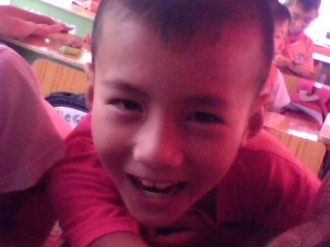
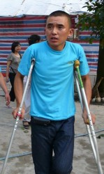
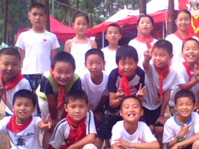
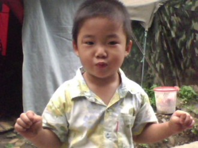
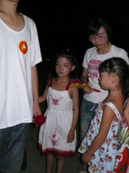
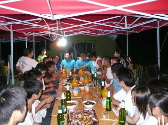
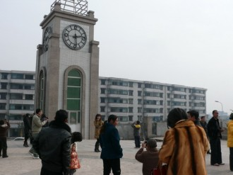

# 我们在一起（五）

⒈ 

帐篷小学最后一个正式加入的志愿者叫李苏洪，在职高读书。我没有给安排他任何课程，只是有什么活儿要干的时候把他一块儿叫上。李苏洪找我要了一个书包，他说他老家有个弟弟现在快升小学了。

李苏洪的表姐叫邱红，是我小学同学。那时候的女孩都喜欢成绩好的男生，我顺理成章地被她暗恋过一段时间，小学毕业后，邱红在汉旺中学读了一年书便去了广东，后来竟然干上了坐台小姐。

我从不在李苏洪面前提及他姐，他自己倒经常对我说他姐以前常说起我这个人怎么怎么好学习怎么怎么努力。

李苏洪为人比较坦诚，也很勤劳，这在职高读书的小痞子们中是相当罕见的，由此我对他十分信任。很多时候我忙不过来，阿建在算术上脑子不好使，我便让李苏洪帮着发放物资。

每次发学习用具，我都得尽量保证公平。因为在这里哪怕就是因为多发或者少发一支铅笔都会引起某些家长的闲言碎语。帐篷学校来过两批鞋子，一批是拖鞋，一批是运动鞋。唐敏和李苏洪招呼着小屁孩们排队领取，先给幼儿园的发，比对着尺码按年龄从小到大一个个发，但最后还是剩下不少，这些捐赠的鞋尺码偏小，五六年级的小屁孩大多穿不上，我本想把这些多余的鞋子接着发给低年级，可转念一想，如果那些五六年级的小屁孩有弟弟妹妹，或许还能穿，于是我们把剩下的所有鞋子又发给高年级。

驻守汉旺的南京特警在内部筹集了一些捐款，购买了几箱文具来帐篷学校。那天我两个高中同学恰好也来看望我和阿建。我带着俩女同学在安置点晃悠了一圈，路上差点儿被石阶上的青苔滑倒，阿建问我有事没，我说还好，但皮带坏了。我那天穿着比较肥大牛仔裤，如果不栓皮带裤子就会顺着脱下去。我问阿建有没有多余的，阿建说就腰上这一根。我只好把皮带当绳子一样捆在腰间，先凑合着用。

南京特警是下午到的，我事先只安排了一节课，他们到的时候课才上了一半。在警戒线外，我问他们是不是现在就开始，队长说没事儿，不急，先等小屁孩们上完课再说。

下课后，我们按照原计划把教室里的桌椅作了调整，留出八个第一排的座位，其他的课桌全并到后面，中间便空出一块不大的场地。

我拉着低年级的小屁孩们唱起志愿者之歌《我们在一起》，我当时已经不再象刚来时那么扭捏了，一切都很自然地进行着，做出我曾认为极其幼稚可笑的动作。后面的活动是小屁孩们毛遂自荐表演节目。帐篷学校的小屁孩和别人不一样，没那么矫情，只要自己觉得高兴，想上台表演什么就表演什么，无所谓好坏，我认为只要能站在台上，那就是成功的，即便你只是讲个小笑话，说个脑筋急转弯或者猜个谜语。

我独自在场中扮演着主持人的角色，其他志愿者都在外围看着，主持人也难当啊！温雨绮和吉扬帆争着要上台，我说一个一个来，温雨绮不干，我说好，那你先上。结果温雨绮一上台又跳起她那个自认为最拿手而广大人民群众已经看了无数遍的《恋爱百分百》伴奏舞蹈，我正吆喝着让大伙儿给她人工伴奏，温雨绮乐呵呵地对我说：“杨老师，我都跳完了。”

吉扬帆表演的仍旧是他的脑筋急转弯，“小明的妈妈生了三个孩子，老大是大毛，老二是二毛，请问老三是谁？”“三毛三毛。”温芮绮在下面叫着。几个记性好的喊起来：“吉扬帆下来！吉扬帆下来！这个你都讲过了，随便问哪个都晓得是小明。”

吉扬帆挠着脑袋想了想，把我以前考他的脑筋急转弯拿出来：“一堵墙跟另一堵墙说什么了？”

台下先是安静了会儿，王学文探出脑袋说这个太难了，换一个，吉扬帆不依不饶偏要考这个，刘光生跳起来大声说：“我晓得，他们说你好。”

吉扬帆乐了，他看看我，然后向那些小屁孩揭晓了答案：“一堵墙跟另一堵墙说‘墙角见’，呵呵！”

不知不觉就过去了快一个小时，我见时间也差不多，就请队长讲话，特警队的队长是东北人，长得人高马大，他话不多，简略地说了几句，我已记不清他具体说的什么，后来我们一起照了一张相。

刚照完相我就觉得下半身不对劲，不过幸好我反应快，双腿及时夹死，要不然裤子真得掉了。南京特警从身后抱出礼物，蒲兰俊率先凑了过去，也不管别人给不给，伸手就夺走一个文具盒，有这么一个反面教材当示范，后面的小屁孩蜂拥而上，我站在旁边也不敢动，两只手揣裤兜里死死地把裤子提住。

场面开始失去控制，当蒲兰俊拿走文具盒时我就想阻止，但有外人在我也不好发作，而此时此刻尽管我大声喊着，却没一个人肯停下手，甚至有校外的家长也跟着哄抢。我万般无奈地站在旁边，阿建和其他几个志愿者拖出来一个又凑过去一个，直到阿建挤进去把剩下的文具箱子全抱进库房人群才渐渐消散。

我从地上捡起一根残断的警戒线当裤腰带系着，杨成建把那些违禁闯入学校的人轰了出去后走过来，说我表情跟被强奸了似的。

小屁孩们这时也老老实实回到座位上，一双双眼睛望向我这边。

我记得那天我发了很大的火，连说话都有些语无伦次。我没收了所有被哄抢的文具，把以蒲兰俊为首的几个小屁孩留下来，狠狠地给教训了一顿，那是我第一次给他们体罚，几个小屁孩半蹲在小库房里两个小时，我陪着一起蹲。

第二天，蒲兰俊被开除了，他是唯一一个帐篷学校开除的学生，我到现在都在质疑自己这个决定是否正确。杨成建问我为什么要开除他，我说，这个学校是我负责，出了安全问题也是我负责，跟那群义工没有任何关系，这个责任我负得起吗？我负不起，昨天要是踩着人了怎么办？还好我让赖航先把里面几个幼儿园的小屁孩揪出来了，他们抢得过谁？几个家长都敢跑进来抢，他妈的把这当成什么了？蒲兰俊上课不听讲跟老师对骂我可以原谅，他下课捉弄低年级的学生我也可以原谅，他不写作业迟到我还是可以原谅，但只有两件事我不可原谅，一件是昨天的哄抢，一件是今天上午他捡石头砸人。我已经给过机会了，他妈的没那么多机会了！

蒲兰俊被开除后我竟然在课堂上哭了，我不知道为什么哭，究竟是两个月来的辛酸还是因为这件事的愤怒？我自己都搞不清楚，我脑海里不断闪现出地震第二天我在汉旺镇小学挖那些被掩埋在废墟下的小生命，我想起我弟，我想起我爸妈的不理解，我想起日复一日重复地干着枯燥乏味的志愿者工作，我想起那场大雨中给帐篷安脚钉江敏明发出的爽朗笑声，我想起即将上大学的几个哥们儿，我想起还是未知的未来...

蒲兰俊和蒲兰伟是堂兄弟，父母去了外省打工，两个小屁孩都由奶奶照料着。当这个佝偻的老人出现在课堂上时，我心里却异常平静，我不说话，听着老人的哭诉，我很想把心肠软那么一下，给他奶奶说我会把蒲兰俊留下来，可最终没能成功。

⒉ 

我在自己家帐篷睡觉的那几天，几乎彻夜地需要用耳机把耳朵塞着，那段时间比较喜欢听许嵩的《浅唱》，但奈何我爸打呼噜的声音实在是如雷贯耳，我只得把歌换成张震岳的。

我和我爸的紧张关系在5.12地震中得到缓和，而当志愿者后，我们却如同第一次国共合作失败，陷入了持久的内战对峙当中。

我爸在柏林安置点干的活儿是在饭堂烧火，每天凌晨五点多就起床了，穿着耐脏捡来的衣服和几个炒菜师傅一起去饭堂。饭堂是无偿为安置点所有群众提供饭菜的，但在饭堂干活的工人和我们志愿者不一样，我爸每月能领到三百左右的特殊补助。

我爸觉得我应该去汉旺新镇做工，怎么也得找个搬泡沫板（搭建板房用材料）的活儿干着，每月还能凑合几百块钱。我说要去你去，我没闲情。我爸说你当个志愿者能拿几个钱，我说拿不拿钱不重要，只要自己心里舒坦就行。我爸说那破学校里又不是只有你一个，再说还有几个大学生，就不缺你一个连高中都没毕业的小屁孩。

我和我爸的矛盾在一次又一次的争吵中升级，杨潇说他玩梦幻西游升级都没那么快，我想我和我爸暂时还未达到卖号的程度。

我妈经营的早点米粉店在地震后就停了下来。我是每天早晨吃米粉长大的，我妈说米粉里有明矾，对记忆力有损，让我少吃。我说记那么多事儿干嘛，好吃就就行。我妈卖的米粉，在整个汉旺镇都是比较出名的，特别是东方汽轮机厂的职工，只要提起友谊桥头的米粉无不啧啧称赞。我妈做的本分生意，做臊子用的肉明明白白那就是五花肉，从不掺和什么油精潮头（劣质肉）之类，我们家吃什么油，做臊子就用什么油。我家从我读四年级开始卖米粉，我妈筛粉条，我爸收钱，我就跟饭馆小二似的来回跑腿，端粉，收拾碗筷。做一大铁锅臊子能用上一周左右，每周周末，原本我可以看动画片的时间却耗在了翻腾臊子上，臊子需要用温火烧两个多小时，我那时长的矮，就搭个板凳站上面，乏味地握着铁铲把臊子来回翻腾。

地震夺取了我家赖以生存的活计。帐篷安置点的那些日子，我妈从家里那片废墟中挖出一些可以用的东西，有我18岁生日时买的黑色外套，一条破了洞被我当乞丐裤穿的磨布牛仔，两件T恤。其它所有关于我曾经的回忆，要么破损了，要么陷进了地下，要么没了。我爸倒从废墟下摸着位置找到了他以前偷偷藏在衣柜里的私房钱。

我做志愿者后便很少跟哥们几个瞎混了，偶尔他们来找我喝几瓶啤酒我也只是草草应付。每月三百的救济金，除去我抽烟和买酒的钱，其他全被投入到帐篷小学中。好几次遇到事儿需要去趟绵竹，我都要跟我妈使苦肉计，软磨硬泡斗智斗勇。

我：妈，给点钱。

妈：昨天不是刚领过钱（救济金）吗？

我：用了。

妈：你当家里是开银行的，想要就取。

我：郑鹏找我吃饭去，他生日。我兜里就剩四十了。

妈：四十还不够？

我：您看着给就行，不要太少。

妈：二十够不？

我：不至于这样吧。

妈：不要算了，六十块还不够你花。

我：得，就依您的。

我妈掏出钱夹（其实就是心心相印纸巾的包装袋），翻来覆去却只有几张整一百的。

妈：没零钱，我出去换点。

我：您就随便扔一张我就满足了。

妈：先等会儿，我找你刘阿姨换零。

我：不用了，麻烦，我这不是还有四十吗，你给我一百，我把这钱找给你。

妈：也行。

于是我便这样顺利地蒙混过关，揣着多要的四十块钱心满意足地去柏林公园大门外等车。

在重灾区，志愿者和部队官兵乘车是免收车票的，为此我每次外出都只好把白短袖脱了，换成别的衣服。很多朋友问我，我那个帐篷小学人数是最多的，条件是最差的，为什么得到的关注却是最少的呢？我摇摇头表示自己也不清楚，温波说关键在于我们安置点门口没有挂写有什么党政军民鱼水情深之类的横幅。我再看看别的帐篷学校，果然开得大张旗鼓，帐篷快跟标语搭的似的，结果人数还不到我们学校的三分之一。

周叔给我看了一本天池集团公司自办的画册，画册的第一张照片上是我，我扛着红旗，身后跟着一大群小屁孩正兴高采烈地在公路边往学校进发。

“你们不过也只是给这个贪腐频出的天煤装潢门面而已。”周叔的意思是我被利用了。

“但这并不是什么坏事儿。”我笑着说。

记得最后一次和我妈吵架时，我气急败坏地从脖子上扯断我妈在地震前她送我作为吉祥物的玛瑙，狠狠地在她面前摔掉在地上，我用尽自己最大的力气冲她和我爸吼着：“以后别他妈当我是你们儿子！”

我一边往219帐篷跑一边哭，我觉得自己从小无论做什么都要看他们脸色，当个志愿者都要被说三道四嘲讽挖苦，我在一次又一次的否定中得到成长，我得不到哪怕一丁点认同，只有在帐篷学校，这里的一百多个孩子，只有他们带给我最多，最真实触手可及的满足感，那便是快乐。

我不断地逃避着一切象牙塔外的现实，我想如果生活就是一场围城战役，那我甘愿给自己画地为牢。记得一部电影里的台词说，一个人如果遵循他的内心去活着，要么成为一个疯子，要么成为一个传奇。而我呢？我不知道，我甚至不知道自己现在做的正确与否。

在这场历经了数次的我和我爸妈之间围剿与反围剿斗争中，我取得了最后的胜利，我妈在一次帐篷学校放学时找到我，心平气和地说：“我和你爸不反对你当志愿者，但是，我们希望你以后有个出路。”

“当兵吧！”我坐在石阶上，在我妈面前点燃烟。

我妈看着我，递给我一张一百，然后站起身说：“以后回家吃饭行不行？”

“看情况。”

“这两个月你都瘦了，你在学校一天吃的什么？”我妈问我。

“饼干，喝矿泉水。”

“就早上吗？”

“每顿饭都这样。”

“为什么不回来吃？”

我埋下头，沉默了会儿说：“我得守在那儿。”

“其他志愿者不能守吗？”

“他们得回家。”

“你没有家吗？”

“我不知道。”我把才抽了一半的烟头掐灭。 3

7月17号，这个日子被我当成中国人民推翻三座大山当家做了主人一样在脑海里记忆犹新。陈小均告诉我，有个大型歌舞团要到我们帐篷小学慰问演出。

这个歌舞团的成员由山东阳谷县志愿者牵头，在全省范围内招募演出团队经筛选后组成。责任人叫老彭，祖国首都来的。陈小均在演出的前一天上午收到消息，然后通知了我。

我怀着无比激动的心情站在帐篷学校的国旗下对小屁孩们发表了这一重要讲话，并提出了几点要求：第一，坚持自力更生，抓紧时间搞几个自己的节目出来，免得互动的时候拿不出手；第二，坚持以我为中心的志愿者团体的绝对领导，别人演出时要守纪律听招呼，不到处乱跑，不龇牙咧嘴乱叫，大力发扬帐篷小学优秀革命传统，展现出我们学校努力贯彻上级方针和指示培养四有新人的良好精神风貌；第三，坚持爱清洁讲卫生懂礼貌，不随地吐痰，不四处大小便，见到叔叔要喊叔叔见到爷爷要喊爷爷，见到阿姨要喊阿姨见到奶奶也要喊阿姨。

经过我的一番精神洗礼，小屁孩们个个精神抖擞，表示坚决不辜负我的重托，努力完成我交给的帐篷学校使命性任务。

罗岚问我要来多少人，我告诉她，如果用动词讲叫摩肩擦踵，如果用形容词讲叫人山人海。罗岚问怎么没名词，我想了想说，群众。

因为歌舞团第二天就要来，我当下便让所有志愿者老师带领所有小屁孩划分场地各自排练节目，杨成建问我他可不可以不用表演，我说不行，咱不能打无准备之仗，跳舞和唱歌你任选一样。杨成建挠挠头说，我可不可以朗诵诗歌，我说就你那破嗓子除了能报晓就没别的用途，朗诵就免了，别打扰人家午睡。

“那你说我干什么？”

“你跑腿算了，有什么要搬的你只管埋头苦干。”我说。

“你怎么不去？”阿建问。

“我要没影儿了那些小屁孩不非得发动武装起义。”

双方接洽的事情由温波、陈小均和罗成负责，我则四处转悠着看看小屁孩们排练得怎么样了，许文娟带着一二年级的小屁孩唱合唱，我问是什么歌，许文娟说感恩的心，还带手语的。我说咱又不是不会说话，带手语干嘛，地震又不会把人震成哑巴（注：无歧视），许文娟说那唱爱的奉献吧，吉扬帆凑过来说想唱天使，我说天使就先别唱，毕竟我们走的是帐篷小学特色社会主义道路，不能跟群众路线背道而驰，就唱爱的奉献吧，吉扬帆说爱的奉献他不会唱，但天使大家都会唱。我说就是因为不会，所以才要学。

听说有个幼儿园的小女孩想来段独舞，我以为又是温雨绮，许文娟说不是，我被她拉过去看，跳舞的是个我见过但不知道名字的小女孩（点名是三个班分开点，我负责五六年级那边），许文娟说她叫黄玉柳青。我问她今年多大了，黄玉柳青说刚满4岁。

辛辛苦苦搞了一天，晚上有些没排练好的也加班加点争分夺秒赶完工程。我四平八稳地躺在帐篷里，杨成建则坐在旁边的沙发上。

“帐篷小学这回可能要引起关注了。”

“是坨屎那终究会发臭的，是金子那终究会发光的。”我总结说。

我们早早睡了觉，满心期待着第二天的演出。

半夜我隐隐约约听到帐篷外面有人说话，我想把阿建叫醒去看看，但一想自己还得早起，于是就用被子把脑袋一捂，继续做梦。

第二天早上，柏林公园安置点里雾气缭绕，我洗了个头，然后把阿建叫醒一起去找陈小均。

陈小均的帐篷离我们不远，里面传出阵阵呼噜声，我想今天这么重大的事他还有心思睡觉，于是掀开门帘走进去。

“均哥，起来了。”我推了陈小均一下。

“我补瞌睡呢。”

“晚上你又喝多了？”我闻到一股浓烈的酒气。

陈小均不说话，又开始打起呼噜。

“歌舞团今天好久来？”我决定自己去做接洽工作。

“不来了。”陈小均翻过身背对着我。

“均哥，你开玩笑嗦？”我有点惊讶，但还是不相信。

“是真不来了。”陈小均转过头对我说，“汉旺政府的人把他们赶走了。”

我终于意识到这不是玩笑，杨成建也愣住了。

“为啥子？”我问陈小均。

没有人回答，我又问：“为啥子要赶他们走？”

陈小均从床上坐起身，“你问我为啥子，我问谁？我哪里晓得为啥子？昨天晚上老彭就先到了，结果被政府的人像赶狗一样赶走了！”

我把烟摸出来，给陈小均和杨成建一人一支，我自己也点燃一支。

“均哥，你能不能说清楚点。”我抽了口烟，语气平静地问。

陈小均沉默了，他一口接一口地吸烟，抽完一支又找我要一支，我和杨成建坐在旁边，知道这时候必须哑起，该说的时候他会说的。

陈小均告诉我，昨天晚上12点过，老彭来了安置点，找到陈小均，告诉他歌舞团已经撤回了，陈小均当时也懵了也问为什么，老彭说他和几个山东的志愿者先来打头阵，本来是想直接到帐篷小学搭建舞台搞演出的，但毕竟来了汉旺，而且要搞出这么大的动静，所以他们几个就商量去政府给官员们说一声，谁知道汉旺镇的官员一口否决了他们这次活动，老彭急了，跟他们理论，结果被保安给轰了出去，老彭不服气，又去找绵竹市委，结果一样，虽然没有遭轰出去，但也是不允许他们来帐篷小学演出，老彭问为什么，一个负责宣传工作的官员告诉他，汉旺镇是江苏无锡对口支援，要慰问演出也得由无锡的歌舞团来，还轮不到他们山东的。

老彭是哭着来找陈小均的，最后越说越激动，竟然给陈小均跪了下去，老彭一直说对不起，他觉得自己无能，连个爱心活动都搞不起来，他觉得对不起帐篷小学的那些小屁孩，也对不起安置点灾民对他们这次演出的期待。

老彭离开前告诉陈小均，他要先去趟都江堰，给那边的几所帐篷学校通知一声，然后就动身回北京。

听完陈小均的讲述，我已经快无法控制住自己的愤怒了。阿建把烟给我点燃说，过去了就过去了，一会儿给小屁孩们说一声，这事儿就这么结束吧！

“我他妈不甘心！”我说。

“你再怎么不甘心也没用，你要知道，赶他们走的是政府。”

“那破三轮车师傅救他们干嘛，不如让他们一直埋着死了算了。”地震时汉旺镇政府楼整幢倒塌，正在开会的所有官员被埋。

“你再怎么想办法也没用的，去上课吧杨侑。”陈小均倒在床上说。

⒋ 

我让阿建代我把消息通知给其他志愿者老师，再由他们转达给小屁孩们。我整整一上午都没去学校，我不敢面对那么多双失望的眼睛。我躺在帐篷里一个人抽闷烟，阿建上完课回来后一掀开门帘就冲我嚷，你娃自焚嗦？

天上下起了小雨，阿建端着瓷碗去打午饭，问我吃不吃，我说不吃，阿建说那就是要吃，我问他怎么知道我要吃，阿建说我跟女人一样，爱说反话。

事实证明，古人那句‘饱暖思淫欲’的总结是很有现实意义的。我刨完两大碗米饭，肚子撑得小挺，虽然没淫欲，但思维却变得比先前更加豁然开朗起来。我把还粘着米粒儿的空碗交给阿建，让他帮我洗了，阿建问我为什么不自己洗，我说我正思考着呢，洗碗的话容易分神。

等阿建洗完碗回来，我给他发了一支烟，让也他坐到床上，“你晓不晓得抗震救灾举报中心的电话？”

“电视上公示过，但没记住。”阿建说。

“啥子频道？”我问。

“打114查嘛！”阿建一针见血地说。

我恍然大悟，连忙掏出手机按号码查询，把举报中心的电话搞到手后又拨打过去。

无人接听。

我问114怎么没人接，114说刚才提供的是绵竹市举报中心号码，我说能不能来个级别高点的，114通过语音念出一串数字，我让阿建在旁边记下来。

德阳市（绵竹属县级市，属德阳市管辖）抗震救灾举报中心的号码拨通了。

“请问是抗震救灾举报中心？”我问。

那边回答“是”。

“我是一所帐篷小学的负责人，我要举报一件事情。”阿建在一边静静地听着。

“你说。”

“今天本来我们灾民安置点有个活动，但是给我们演出的那个山东歌舞团被政府赶走了，我要举报的就是政府官员侵犯了我们群众的合法权利。”

“你是哪儿的？”

“绵竹市汉旺镇天池集团公司柏林公园灾民安置点。”

“这个问题具体我们也不清楚，你打绵竹市的举报中心吧！”

“我打过，没人接，现在是下午三点，上班时间，举报中心居然没人，很搞笑吧！”

“那这样，我给你一个人的手机号，你打过去，向他反映情况就行了。”电话那头的中年男人说。

我让阿建把号码记下，然后把电话挂断，我对阿建说，这是狗官的第一次转移。

我早就对政府官员失去了最基本的信任，绵竹市政府在本地从来不存在什么公信力，从小到大我就耳濡目染各种匪夷所思的内幕，我生活在矛盾最尖锐的矿业公司，矿主和矿工的纠纷对我们这些子弟来说早已司空见惯。

我拨打了中年男人给我提供的手机号码，他说那是绵竹市委宣传部的人。

电话在响了两声后接通。

“你好，我是汉旺镇柏林公园安置点帐篷学校的负责人。”我说。

“有事吗？”

“我想向您反映一个问题。”

“你说。”

“今天凌晨来了几个山东和北京的志愿者，他们准备在我们安置点搞一场大型慰问演出，但是被你们政府部门拒绝了，我想请问为什么？”

“这事儿我知道，他们不是江苏无锡来的，捐助上不对口，所以不能。”

“捐助还区分对口？”我说，“我知道，对口的捐助都是有利益产生的，但我说的这个山东来的演出团队不跟任何商业利益挂钩，是纯粹的个人组成集体来进行的无偿义务演出。”

“但他们终究不是无锡的。”

“如果你在绵竹大街上乞讨，一个山东人给你扔钱，莫非你还会把钱还给他，你说他不是无锡人，你只讨口无锡的钱？”

“你用的比喻很不恰当。”

“但我认为很形象。”我说，“我希望你现在就给我一个答复，我没有那么多时间跟你争论。”

“这个事情不属于我们管，你去找德阳的人。”

“我第一个电话打的就是德阳的，是他们让我找你。”我感到好笑。

“他们可能不了解情况，你去找绵竹市团委反映。”

“我怎么找？”我问。

“我给你一个号码。”

阿建第三次记下号码，我说，阿建，这个号拨过去再没用的话我们就向中央告，我他妈不信这么简单个事儿还不能整出个明白。

事实上，这个所谓的绵竹市团委的号码一直处在通话中，跟业务特繁忙似的，我甚至怀疑先前打绵竹举报中心电话没人接是因为那儿的人都跑团委这边帮忙来了。领导责任就是追着矛盾跑，不推诿，不耍滑，但在我眼里，这些狗屁领导其实就是这句话的反面教材令人可憎。我和阿建等了半个小时，依旧如此，我拨打114，问抗震救灾最高指挥中心的号码，114说必须通过省级的才能接到中央去，所以只好把四川省抗震救灾指挥中心的举报电话告知了我。 我对阿建说，如果这条路还行不通我们就不举报了，我找sina读书的编辑在sina网上整条新闻出来，或者让老刘（天涯论坛撰稿人）帮忙披露一下，把舆论掺合进去。

“喂，您好。”电话那边传来一个女性的声音。

“是抗震救灾举报中心？”

“是的。”

“我想举报一件事，也可以说是反映一个不好的情况。”

“您是？”

“我只是个志愿者，负责安置点里的一所帐篷小学。”

我把整件事情的来龙去脉尽可能详实地叙述出来，我还说我给绵竹市德阳市都打过电话，那些当官的从头到尾都在跟我打太极，把我这事儿推来推去，到头来不仅不能解决，连找谁解决都整迷糊了，那些人不去参加武术比赛真够可惜的。

“这事我们可以处理。”电话里说。

“我希望现在就能解决，歌舞团凌晨就在往回撤了，现在还有个负责人在都江堰，他可能也快离开了，我们没有时间等，必须现在就解决，大姐（我估计那边是个阿姨）你知道我们学校的那些小娃娃有多盼望这个演出吗？我们都排练好了，但现在却不能演出，这些娃娃都是汉旺镇小学出来的幸存，为什么别人一个义务的演出都得不到允许，还非得按什么对口支援，难道爱心还分对口吗...”我估计说了快十五分钟。

“10分钟，10分钟内会有相关人员给你回复，我们马上处理。”

“谢谢。”我说。

尽快有多快？稍后有多后？永远有多远？我怀着对承诺的三种疑问躺在沙发上对阿建说，我感觉这回肯定靠谱了，阿建点点头说，我觉得也是。

毛主席说过，世界上怕就怕认真二字，共产党最讲认真。我虽然连团都没入，但我也讲认真，我他妈就是要认真地跟腐败分子较劲儿。

我对着手机上的时间，5分14秒后，电话响起，我按下免提键。

“请问是杨侑先生？”

“别叫我先生，我还没您生得早，才18岁，叫小杨就行。”阿建在旁边捂着嘴笑。

“我是德阳市委的XX（名字我是真忘了），您的要求我一定满足，我们也会从上到下给予这个歌舞团最大的支持，有什么需要尽管找我们反映，一定及时给您解决。”

“别的没什么事，允许演出就行，我希望你们政府的人明白，别人山东的志愿者，自己带器材，自己搭舞台，自己演出，自己掏钱住宿吃饭，不需要你们任何虚情假意的帮助，谢谢。”我挂断电话。

我兴奋地从219帐篷冲出来，我找到陈小均，问他老彭的号码，陈小均问我啥事儿那么高兴，我说政府不阻拦咱们的演出了，陈小均把老彭的电话告诉我。

我颤抖着用手按下了这一串数字。

“老彭，我是帐篷小学的校长，你们回来吧，我都给说了，政府不敢再赶你们了！”我激动地说。

老彭“噢”了一声，完全没有我想象中那么高兴，他语气平静地问：“你是怎么做到的？”

“我找省抗震救灾指挥中心把那些个瓜批（意同傻逼）举报了！”我说。

“我们回不来了。”老彭淡淡地说，“歌舞团两个小时前就解散了。”

“不能再一起过来了？”我快忍不住了。

“不能了。”老彭说，“我现在在成都，我想先来趟你们帐篷小学，晚上再回北京。”

我和老彭在安置点那座元代古墓前见了面，他是个看起来很慈祥的中年人，我带着他在帐篷学校逛了两圈，临走前，老彭握着我的手，“能不能告诉我你叫什么名字？”

“杨侑。”

“我会记住你的。”厚重的镜片后面，老彭泪花闪闪，“如果有机会，我们还会来的。”

老彭走后的那几天，我变得一蹶不振，我开始痛恨现实，我不知道为什么这么惨痛的灾难都不能唤醒某些人的良知。

陈小均对我说，总有一天，我们会搞一场我们自己的演出，我们站在我们自己的舞台上唱我们自己的歌。

⒌ 

7月下旬，汉旺的空气变得异常闷热和潮湿，我从库房翻出志愿者白汗衫，给其他老师每人一件。

下午放学后，我、阿建、唐敏、余琳、赖航、王勇、许文娟、钟宾八个人带着十多个小屁孩一起到转盘路洗澡，走出柏林公园‘雄秀紫岩’的牌匾后，李小强让我去旁边的一个简易帐篷上看新贴的通知。

“杨老师，我们要复课了。”

我看了眼日期，汉旺镇小学按户籍分为两批，一批到武都镇新建板房小学，一批到海军援建天河小学，八月一号开始正式上课。

“今天几号？”我问阿建。

“28号。”余琳说。

“七月。”王勇说。

“还剩三天了。”唐敏叹了口气说。

洗完澡回来时，我收到辛骁峰的一条短信，说有一批物资（大量衣物）今天已经运抵成都，明天就能到帐篷小学，物资由温波和陈小均负责管理和发放。

晚上唐敏告诉我，她打算小屁孩们复课后就回罗江，在家休息几天便动身去重庆示范读书了。

⒍ 

帐篷小学解散的日子终于要来了。

我不知道自己应该是高兴还是悲伤，小屁孩儿们可以去条件更好的教室接受更好的教育了，而我们呢，我们按道理讲也应该回到各自人生的轨道上继续暂停了两个多月的运行，或许以后还有交集，或许老死不相往来。

我只能选择服从，虽然有太多的不舍，有太多的无奈。

我开始心不甘情不愿地筹划帐篷学校的物资分配，文具已经发得差不多了，现在剩下的只有几捆小人书和体育用品，但要分配给全校一百四十多个孩子显然不够。我想把这些书捐赠给板房小学，但后来跟余琳赖航讨论了半天，觉得捐出去不合适，不如就留下给小屁孩们。

那几捆小人书以平均每人六七本的数量发给幼儿园到四年级，体育用品（包括足球、篮球、乒乓球、羽毛球等）按抓阄的方式分发给五六年级的学生。帐篷学校的库房在当天下午便清空了。

我坐在库房内的钢丝床上，点燃烟，旁边堆着数箱未拆封的高级糖果，刚从大连运来。同时带来的，还有一张志愿者证，扉页贴着我的相片，相片是上个月照的，梳着刘海，证件上的志愿者服务记录仅此一条：在5.12抗震救灾中，杨得艺同志于2008年5月12日至2008年8月1日提供志愿服务，共计1905小时。

我们几个志愿者老师和义工凑到一块儿，最后决定在7月31号开场晚会。

剩下的三天时间几乎被用来排练节目了，有小屁孩自己本来就会的，有小屁孩是老师临时教的，也有的节目是我含辛茹苦争取来的。

罗岚发扬我不做内奸谁做内奸的革命斗争精神，向我供出冯岚会跳舞，而且跳得非常好。我找到冯岚，问她愿不愿意在晚会上跳个舞，冯岚摇摇头。

“你会跳什么舞？”

“藏族舞。”冯岚揪着我鼻子说，“谁告诉你的？”

“我自己猜的。”

“哼，肯定是罗岚给你说的。”冯岚不满地看着我说，“反正我不跳。”

“你是不是根本就不会跳？”我笑着说。

“谁说我不会跳！”

“罗岚说的。”

“她乱说。”冯岚一语中的。

“她是不是乱说我又不晓得，你先给我跳一段看看就晓得了。”我循循善诱。

“嘿嘿。”冯岚跳到我腿上坐着，把扎着两根羊角辫的小脑袋凑到我面前诡异地笑着，“你想骗我给你跳舞！没门儿！”

“谁说我骗你？”我也乐了，“看着你杨老师这双清澈透明的眼睛，你看到什么了？难道是欺骗吗？不是，我告诉你，是真诚，是渴望艺术的目光！”

“不跳不跳反正我就是不跳。”冯岚落到地上，冲我吐起舌头。

“为什么不跳？”

“我刚才看到你眼睛里有眼屎。”

“真的？”我用手蹭了下眼角，果然早上没洗脸眼屎还挂着，唉，一颗眼屎打坏一扇纯净的心灵窗口啊！

冯岚跑到五六年级帐篷边的草丛，想摘片豁麻叶子下来。我看得胆战心惊，她似乎一点也不怕豁麻那浑身的茎刺，从一株豁麻上小心翼翼地扯下一片。

“岚姐，你就赏我个面子，跳吧！”我保持着绝对安全的距离对冯岚说。

“我说了不跳。”冯岚晃了晃手中的豁麻，一脸微笑。

“组织考验你的关键时刻你怎么能拉稀喃？”我说。

“组织是什么？”冯岚眨着那双黑亮的大眼睛。

我想了想说：“组织就是以我和其他同学们为代表的广大人民群众。”

“我不想跳给他们看。”冯岚扭过头，又扯下一片豁麻叶子。

我跟在冯岚后面往帐篷学校旁的土坡上走，“噢，你不想跳给他们看是不是？”

冯岚疑神疑鬼地瞄了我一眼，然后点点头。

“那跳给我看吧！”我说，“我现在就跟他们划清界限。”

“给你跳？”冯岚走到我跟前，手里捏的豁麻指向我。

“姐，别靠我太近，你身上有危害我生命安全的东西。”我后退了几步。

冯岚塄了愣，接着举起那片叶子问我：“你怕这个？”

“不怕。”我紧接着说。

“不怕那我给你，你拿着嘛！”

“不拿。”

“那就是怕咯！”冯岚冲我笑嘻嘻的。

“岚姐，跳一个舞行不？哥求您！”我说。

“等我想一想。”冯岚把豁麻插在发丝间。

“还想什么？”

“我不在这跳，那边有人看见。”冯岚说。

“去坡下边，有个石桌那儿行不？”

冯岚睁大着眼睛，观察了下周围，然后顾自朝那张石桌蹦达过去，我也跟在后面。

冯岚爬上石桌，她弯着腰把粘在裙子上的松茸拍掉，然后问我可不可以跳了，我说可以。冯岚拉起裙摆，叉着双腿，在石桌上转圈踱步，倒确有藏族舞的那种大气浑然。冯岚跳舞的时候不爱笑，其实平常她也很少笑，我只见她跟罗岚在一块儿的时候笑得最多。杜思宇曾对我说起过这个古灵精怪的小女孩，并从实际出发，用科学发展的眼光向我表示，冯岚长大后肯定是个相当漂亮的女孩。我说你是不是把欧美小电影看多了，有萝莉控（恋童癖）倾向。

冯岚跳完舞让我抱她下来，我说这桌子又不高你自己不能跳啊，她说下面有松茸，挂身上麻烦摘。我只好过去把她搂着，从草丛密布中穿过。

晚上罗岚吃完饭找我玩，我说我要给你交代一个光荣而艰巨的任务，罗岚问是不是又想让她帮我买冰糕，“今天你送我一百根我也不去买。”

我摇着头说，你帮我把冯岚说服，让她在后天的晚会上跳舞。罗岚说不行，我问为什么，罗岚说冯岚妈妈都说不通她说也没用。我说，实践是检验真理的唯一标准，你不去试试怎么知道。

罗岚经不住我的软磨硬泡糖衣炮弹连番轰炸，最后不情愿地点点头。

晚会的前一天，我把五六年级的小屁孩叫到旗杆前照相，十多个人站在那面志愿者红旗前，我调了调手机说：“待会儿我数一、二、三，数到三我就照了，把握好各人的表情，你喜欢摆什么造型就摆什么造型，只要别跑我镜头外就行了。”

“侑哥你咋不和我们一起照喃？”钟一杨问。

“给你们照给你们照。”我胡乱应付着，然后对准焦距：“一、二、三，茄子！”

“花袜子！”王学文兴高采烈地喊着。

“瓜娃子！”王凯杰笑容满面地喊着。

我把跳跳龙（糖果）给低年级的发完，然后把剩下的几箱木糖醇抱到三班，给五六年级的小屁孩平均分，蒲兰伟多分了两袋，王学文问我为什么，我说那是给蒲兰俊的，王学文说怪不得每次发作业本蒲兰伟都比他们多。

唐敏似乎每天都挺高兴，这两天她不停地跟小屁孩们合影，我说敏姐咱俩也照一张，唐敏说好，然后站到我跟前让许文娟拿着手机。我告诉许文娟一定要贯彻好照我为主照她为辅的最高指示，许文娟笑着点点头，然后按下手机侧面的按纽，同时，我伸出舌头，弯向唐敏的左脸。

咔嚓！

唐敏看着手机上的照片抱怨我，“怎么老爱做怪动作！”

“这样才能反映出咱俩的关系亲密无间。”

唐敏不满地瞅了我一眼说，“重照！”

跟唐敏合了影，梁茂杰从土坡上跑下来，手里拿着不知道从哪儿搞的花，梁茂杰让我帮他把花插到他耳朵上，他自己插老掉下来。

梁茂杰戴着粉红的小花说：“杨老师，也给我照一张。”

“为什么？”

“我是梁朝伟呀！”梁茂杰做着鬼脸说。

⒎ 

有人说帐篷小学是偶像剧的绿光森林，我说你狗屁，别拿破片子跟我学校比，简直跌份儿。

我从未对别人说起过这所帐篷学校的援助方，也没人知道，连阿建都是一知半解。其实算起来，为这所学校作出过奉献的人真的太多太多，除了鞍山义工，还有上海、北京的志愿者，他们一直默默无闻地为我们捐赠物资，乃至为整个安置点筹集生活用品，马来西亚华人商会主席刘鸣凤便是其中之一。

2008年7月31号，我起了个大早，从自己家帐篷出来，阿建已经起床了，他请我吃米粉。

“还是你妈卖的米粉好吃。”阿建说。

“估计是没机会吃了，以后我妈开不开米粉店还不清楚。”我说。

“你怂恿几下就开了。”

“听说王帅把他女友甩了。”我问阿建。

“是那个女孩要回北京了，王帅不让回，俩人就吵架。”阿建说，“怎么，你也有兴趣？”

“没。”我夹起一筷子粉丝送进嘴里，“别人要过的我不要，你又不是不晓得。”

“多向我看齐点，管他妈啥样儿，能生儿子就行。”阿建开起了玩笑。

“就你那操行，还想要儿子，要只虱子都困难。”我说。

曾旭和杨礼已经公开了男女关系，自从上次被开除后，曾旭是唯一一个没有任何怨言的，她一直对唐敏心怀愧疚，想让我帮她说两句，看能不能得到原谅。后来，渐渐也没什么事儿了，除了上课期间，曾旭还经常找我们几个玩。曾旭这次找来她的朋友，搞民间艺术团的，叫大宝演出队。

准备晚会的那天下午，陈星满脸伤痕在舞台场地上来回折腾，我问他能不能先回家，演出开始的时候再叫你，陈星晃着脑袋不答应，我说星爷别捣乱行不？陈星点点头说，那你给我买碗豆花，甜味儿那种。

陈星脸上的伤疤是一周前自己给摔的，整天没事就到处转悠，那天他往坡下冲的时候被地上的石子儿给绊了，然后就成后来那幅样子，当时杜思宇正好去洗澡，看见陈星摔了，就跳下摩托把他抱起来，在安置点门口的小诊所消毒包扎了下，让陈星自己回去，陈星不干，泪眼花花地让抱，杜思宇说陈星当时无助的表情和可怜兮兮的语气瞬间就把他打败了，底线立刻崩溃，只好扔下摩托把他抱回家，路上还被陈星缠着买了袋薯片儿。

⒏ 

晚会下午六点开始的，阿建和唐敏是主持人。

前几个节目低年级小屁孩唱歌，后来大宝演出队的人上台，毕竟别人专业搞演出，来看晚会的人越来越多，现场渐渐开始拥挤起来。演出队有个侏儒（无讽刺）叫冷飞，唱歌特带劲儿，边唱还边跑到台下和比他高半个脑袋的前排一年级小朋友握手。

大宝演出队是收钱的民间艺术团，这次来义务演出有多半原因都是曾旭的关系，看着台下那一个个笑得上气不接下气的小屁孩们，我竟然后悔自己当初不该开除她。对于我来说，一个志愿者有没有爱心是很重要的事情，如果是抱着为自己档案上添字的目的来的，好，可以滚了。

我至今还记得的是王玉龙的小品《王婆婆家的三条狗》，五个三年级小屁孩自导自演，倒挺有意思，还有黄玉柳青的舞蹈《大长今》。当然，冯岚最终把她的藏族舞跳了，那天下午罗岚告诉我，她只说了几句就让冯岚点头了。冯岚跳的藏族舞很有高原风情，今天她硬拖着要上班的妈妈给她化了妆，把淡紫色的大裙子穿上，罗岚说冯岚好漂亮，我说你也是。

唐敏唱完一首《樱花草》后居然打起了防狼术，我在台下看着唐敏瘦弱的身躯晃来晃去就觉得好笑，阿建说他一把就能把使防狼术的唐敏撩倒，我说我根本不用动，因为我是狼王，虎躯一抖，王霸之气四溃，她立刻就被震住了。阿建说你还是去给别人洗脑吧，你要嘴巴一张，死人都要被你说活，蛊惑人心没谁能赶过你。

王勇就表演了一个节目，他喜欢王力宏，也喜欢唱王力宏的歌，脸型也和王力宏一样，都是张马脸。王勇的声音跟王力宏挺像，不过肤色跟非洲难民似的，听说即使这样也有不少小妹妹被他给迷住了。

那天晚上很闷热，我拿着一把蒲扇一直摇都大汗淋漓。我唱了一首《天使》，因为没音乐，所以是清唱。我才唱了两句，台下的所有小屁孩儿们就跟着唱起来，最后把我的声音都淹没了。罗岚妈妈抱着一捧花上来献给我，罗岚和冯岚手拉手在下边一个劲儿的唱着，还不忘冲我做鬼脸。

《天使》是帐篷学校的校歌，虽然没有明文规定，但小屁孩儿们都喜欢唱，他们自己把它当成了校歌。最后那句“梦里有爸妈疼你的样子”打动了所有小屁孩，陈昱说以后他还要让其他学校的孩子都唱《天使》。小屁孩们不懂什么叫爱的奉献，不懂什么是感恩的心，但他们心中都有天使，有他们的爸妈，有他们的同桌，有他们的老师，还有很多很多被地震夺去的生命，他们都是天使。

⒐ 

晚会结束后已经深夜十点了，送完所有小屁孩，我们全体志愿者（义工）在帐篷小学教室里用课桌拼成长条状，两边坐人，桌上摆满了我们自己凑钱买的鸡鸭鱼肉，还有好几箱啤酒和白酒。

那天我没有喝多，只喝了六瓶啤酒，至少两位数才能把我放翻。但白酒我就不行，两三个瓶盖下去估计就归位了。喝完酒吃了饭已经凌晨一两点，我跟阿建在安置点里逛了两圈。

我问阿建什么时候走，阿建想了想说看情况。

我想起晚会结束前的那一幕，一大群小屁孩跑到舞台上把唐敏搂着，几个年纪小的忍不住哭了，蒲兰俊窜到赖航身上摸他挺得老高肚子，我让梁茂杰奶奶把他带回家，然后把罗岚的手拉着。

“哥，唐敏老师去哪儿？”罗岚问我。

“回家。”我望了望那边哭得稀里哗啦的唐敏说。

⒑ 

当我第二天回到帐篷小学的教室时，四周一片狼籍，我和阿建坐在课桌上，我把烟掏出来点燃。

“散咯散咯，全他妈散咯！”我无奈地吼起来。

“你还让不让别人睡觉，这么早好多人还没起呢。”阿建冲骂着。

“坚持了两个多月早起，已经习惯了。”我苦笑着说。

7点一刻，我从课桌上跳下来，用手机放出《义勇军进行曲》，我仰望着树林最高处飘扬着的五星红旗。

我问阿建：“怎么处理？”

“留这儿呗！”

“嗯，三十元的国旗，叶琪的。”我点点头说。

“那两个圣象地板的帐篷，郑鹏的。”阿建说。

“我的是什么？”我问。

“啥也没有！”阿建傻笑着说。

陈小均死乞白赖地认唐敏当了干妹妹，我问唐敏想不想，她不自然地笑了笑，没说什么。

唐敏最后离开了，那天我们拉着一面写满名字的志愿者红旗在安置点里逛了一圈，陈小均对居民说，只要你们认同唐敏的工作，请在红旗上留下你们的名字。

这面红旗被我们送给了唐敏，作为外地志愿者，我很佩服她能坚持到现在，而且从来都是勤勤恳恳毫无怨言，我说唐敏我以后一直叫你敏姐行不行，唐敏笑着说行呀。

我、杨成建、陈小均一起送的唐敏，我们包了一辆面包车，从汉旺一直行驶到罗江，在唐敏家里，她从树上摘下梨子给我吃。那天唐敏家里没人，我们呆了不到半个小时便坐车走了。

面包车在唐敏家门前的歪歪斜斜的小径上驶出十多米，唐敏突然从后面追了过来，她一边追一边朝我们挥手，唐敏哭了，我在车上却听不见她喊着什么。

面包车始终没有停留，在这条农村小道中穿绕着渐行渐远。

尾声 

我把所有桌椅以帐篷学校的名义捐给了武都镇新建汉旺小学，从此便结束了两个多月的志愿者生活。我的梦想算是告一段落了，也许，我已经没有梦想了。我换下志愿者短袖，回了趟老家。

在堂弟的坟前，我扑通跪了下去。二叔说我弟的尸体没有火化，也没挖坑，用凉席裹着平放在爷爷的墓边，盖了点土，就现在这么高，不足半米。

我终于按捺不住大哭起来。

我是杨侑，出生在四川盆地西北边陲的小镇，镇上有个广场，临街的方向修建了一座钟楼，但现在是倾斜的，很多外地人大老远坐飞机、火车或汽车来到这里，以它为背景照相留念。咔嚓声响起的同时，那些人的笑容像绽放的花儿，灿烂无比。这只是普通得不能再普通的钟楼，唯一的差别就是它的指针始终停留在14时28分，2008年5月12日之后再也没走过。

那年8月，我们从帐篷搬进了过渡板房，每天有校车到板房区接送那些安置点的小屁孩儿们，有时候碰巧路过，蒲兰俊总是第一个从车窗里探出头来，朝我大声喊着“侑哥”，然后车上的其他小屁孩也争先恐后地往窗户这边挤。

一台电脑，一包廉价香烟，便构成了我当时的生活，一无是处，弥漫着懒惰与困顿。而那一年秋天，终于在自己浑身疲惫不堪，生活烦琐紊乱的时刻突然来临。

(采编：刘铮；配图：杨侑；责编：刘铮)

[我们在一起（一）](/archives/34183) ——“尸体挺沉的，为了省劲儿，我把尸体的两只手环在我脖子上，我的手则托着尸体的屁股，延火车铁轨朝广场搬运。两只被雨水浸泡得惨白的手在我脸上有一搭没一搭的摆动着，我想，要不是自己运气好，没被预制板砸着，说不定现在我就是背上的尸体了。”

[我们在一起（二）](/archives/34527)——“”我妈最后那句‘你永远当志愿者吗？帐篷学校难道永远都存在吗？如果不存在了你怎么办？’，倒确实把我给问住了。怎么办？凉拌，我到现在对未来还迷茫着，总不至于还去复读个高三吧，即使去，也没那么多钱缴学费。

[我们在一起（三）](/archives/34615)——“志愿者生活是枯燥乏味的，别人看到的永远只是局部，媒体拍片子写稿件那都是挑着写，真实全面的我想没几个人能看到。"

[我们在一起（四）](/archives/34671)——“吉扬帆跑到我跟前，泪眼汪汪地问我：“侑哥，你是不是真的要开除刘兜兜？”我点点头。“我讨厌你！”吉扬帆捡起课桌上的一本《弟子规》朝我脸上砸过来，然后又冲向被低年级小屁孩围拢死活就是不让离开的刘邹舟那边."
