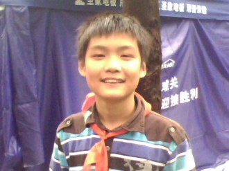
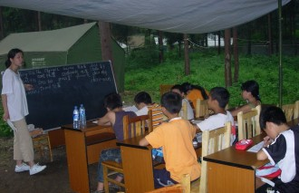
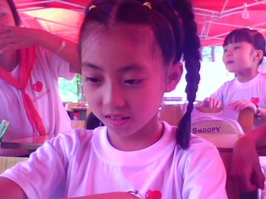
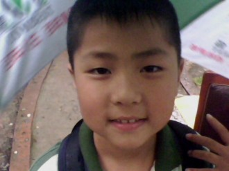
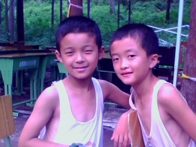
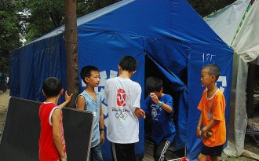
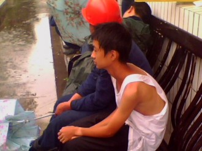

# 我们在一起（四）

⒈ 

钟一杨

我教的五六年级里，印象最深的便是钟一杨，脑子特好使。用我读小学时每次期末班主任在学籍册上的评语就是：杨得艺是个聪明可爱的孩子，上课踊跃发言，热爱劳动，团结同学。但是，只要改掉上课东张西望，说小话的毛病，一定能取得更加优异的成绩！

钟一杨读六年级，遇到讲得有趣的课倒挺认真，我这里就自夸一下，我上课不怎么刻板，所以尽量把复杂的事情说简单，即使多费几句口舌。但余琳就不一样了，估计是受传统教育毒害太深，听她的课乃至让我想起自己的小学班主任，虽然余琳比她漂亮多了。赖航问过我，为什么面对一个漂亮女孩，一起相处那么久怎么没绽放出爱情的火花，我回答说我还不是欲望之源，虽然漂亮女孩总是招人喜欢，但我还没发展到见一个爱一个的程度。

钟一杨上余琳的英语课，想干嘛干嘛，交头接耳都算轻了，还听说他经常跟余琳对骂，我曾经就亲眼见过一次。

那天是周一，我闷闷不乐地回到学校，还没过警戒线我就听到三班那边传出拍桌子的声音，然后就是钟一杨的吼声。

“我凭什么走？你为什么不走？”

“你上课唱歌，影响别的同学听讲了！”余琳嗓门也大，我倒是第一次见她这么嘹亮的声音，平时都斯斯文文的，要不是之前听赖航讲过一些她小时候的事我有心理准备恐怕此时已经惊得撞树了。

“我唱歌是我的事，你管不了！”

“你…你…反正你上课唱歌就是不对！”余琳已经口齿不清了。

“我就不爱听你的课，你一上课我就想瞌睡，如果不唱歌可能我都能打起呼噜。”

“我管不了你谁还能管你！”

“就算是杨老师来也管不了我。”钟一杨振振有词地说。

我在旁边听着，怎么不直接叫杨侑，喊余琳都直接喊的全名。我依旧没有掀开围着帐篷的蓝色篷布，继续聆听两人的争吵。

“他管不了你，好，我现在就打电话把杨侑喊过来。”

“杨老师说过你们老师上课不准用电话。”钟一杨钻空子倒挺厉害。

“这课我上不下去了！”余琳一愣，收拾起课本，一把掀开门帘，身后传来钟一杨胜利的欢呼声。

我站在原地一动不动，余琳眼眶红红地看了我一眼，绕过我便离开了，教室里顿时鸦雀无声。我扫了一眼教室里的二十多个小屁孩儿，把篷布掀到钢杆上挂着，然后走到和课桌一样高的用成铁局捐的办公桌作为的讲台前。

“钟、一、杨。”我一个字一个字的说。

钟一杨先前的欢喜一扫而空，他抬头看了我一眼，又埋下头。

“站起来。”我淡淡地说。

钟一杨犹豫了半晌，从座位上站起身。

“你真够行的，我和赖航对余琳都不敢大呼小叫，你倒帮我们开了个张呵。”我一脸装模作样的假笑。

钟一杨一声不吭，甚至还隐隐约约偷笑着。

“笑？接着笑！”我走到他跟前。

钟一杨看了我一眼，还是没忍住笑意，而我此时倒像个夜店里的舞女搔首弄姿。

“你还想不想呆这，不想呆趁早滚。”

“我愿意呆这，你管不着。”

“你校长还是我校长？”我原本极差的心情此刻如同一个火药桶，随时可能爆发。

“我不管你是谁？反正我今天就是不走。”钟一杨昂起头，竟然和我对视着。

我已经忍无可忍了，我抬起手，就要扇过去，旁边的薛淑函吓得闭上眼睛。悬在半空的手落了下来，我仔细看着这个和曾经少年的我极其相似的钟一杨，我知道这一耳光下去，就不仅是纯粹的个人泄愤了。我一把抓住钟一杨的衣领，把他提得脚只好微微踮在地面，他盯着我，我也面无表情地盯着他。

“你他妈给我老实点儿。”说出这句话时，我已经感觉自己不是志愿者了。

我甚至想一脚踹过去，但眼看着座位上的其他小屁孩，我没能下得了手，我想起我的过去，想起自己曾经和老师的一次次对峙，猛然间明白了些什么。我松开手，让钟一杨坐下。

“今天的事情就过去了，我不想看到下次。”我努力把心情平抑下来，“还有，我这几天心情很差，很差！”

我让他们先上自习，赖航在教室守着，我叫住正在上课的阿建，“陪我走走。”

杨成建把许文娟喊去代课，然后跟我出了学校。

“抽烟？”杨成建递过来一支兰娇。

“抽好烟！”我自嘲地笑了。

“栽跟头了吧，他和你以前一样，聪明，但不羁。”

“你觉得我该怎么办？”我问。

“如果你是他，面对这种情况心里会想什么？”

“我肯定希望老师私下跟我谈，本来都趾高气扬好一阵了不能突然就成软柿子，而且当着那么多人我面子上过不去。”

“这不就解决了。”阿建笑着说。

我把烟点燃，坐在石桥的阶梯上。我发现自己跟杨成建比起来，我简直就是个傻逼。阿建瞅了我一眼，问我：“你还有心事儿？”

“记不记得上次我给江敏明打电话？我把过程全写下来了。”

“你弄博客上去了？”杨成建说，“你是不是把我开玩笑说的那句她可能在做爱的话也写了？”

我点点头。

“你他妈脑子有病吗？”杨成建朝我吼着，“你喜欢她，你还把这些都写上去，最要命的是她还经常看你博客，我要是她早他妈扇死你了！”

“我倒想被她扇一巴掌。”我狠狠地抽了一口烟，“她说她那天在家里，他爸也在，所以看到我打电话来她就跑到门外接的电话，外面下着雨，她淋着大雨和什么都不知道的我聊了一大通，却在博客上看到我这样写，虽然我没明说，但她感觉我当时心里就是那么想的。”

“操你妹！”杨成建说，“我现在都想打你。”

“一切都完了！”我仰望着刺眼的阳光，闭上眼睛，“这是第二次了，第二次因为我的博客了！”

“你以后能不能不写？”

“我不知道。”我无奈地摇着头，泪水还是忍不住从眼角溢出来。

“你傻子吗？你还想写？”杨成建怒了，“你总有一天会后悔的。”

我站起身，沿着岸边走了几步，转过头问杨成建：“有钱不？”

他不说话，把最后一口烟洗完。

“想喝酒？”

“有钱不？”我重复问。

“你他妈忘了吗！你忘了你说过上课期间不能喝酒！”

我看着面部表情已经扭曲的杨成建，无力地蹲在地上，溪流对面的帐篷学校还在上课，阳光刺破上方茂密的树叶，撒下无数晃眼的斑点。

 ⒉ 

第二天，余琳请了假，说身体不舒服，我想也没想便答应了。

我和杨成建喝了一夜的酒，后来居然没去219，直接回了自己家帐篷，倒头就睡。早上是唐敏过来喊的，我揣了一袋饼干和两瓶矿泉水，我妈又塞给我一盒纯牛奶，让我中午回家吃饭。

我上午没课，下午有余琳的课，我代她上。

中午放学后，我给阿建打了声招呼，让他自己去打饭，我不吃了，然后夹着一本外地捐赠的初中历史教科书回到家。

午饭是和隔壁帐篷的周叔一家凑一块儿吃的，摆了一张大圆桌，我妈抬出四五张凳子，我见有点眼熟，我妈说那是她前些日子回天煤（天池煤矿）家属区从已成废墟的家里挖出来的。周叔抱来两箱啤酒，我爸又从床底下翻出两瓶丰谷（白酒），两家人围坐在圆桌旁。

周叔问我喝酒不喝，我说下午有课，不能喝。

记忆中，我爸那天喝了很多酒，喝多了话也多起来，周叔给我递来一支烟，我爸只看了看我，没说什么。

“杨建娃，你以后打算干什么？”周叔问我，其他人也都看过来。

“当兵吧!”我说。

“你以为当兵那么好当吗？”我发现我妈特爱反驳我。

“就是，现在哪个当兵不花钱，你又是城镇户口，带安置卡的，要想不花钱就去部队，难噢。”李阿姨在一边附和说。

“看情况吧！”我不想在这个问题上耗时间，随便刨了两口饭对他们说：“你们先吃，我有事，先走了。”

“再吃点。”周叔说。

“不想吃了。”我转身回了帐篷，我妈也跟了过来。

我把教科书里夹的两张卡片扔到床上，对我妈说：“这是成都红十字会和四川团委发的志愿者荣誉证书，可能对当兵有用，你收着吧！”

说完，我不等我妈还想说什么便头也不回地去了学校。

空荡荡的教室里，阿建和唐敏正在陪几个刚吃过饭的低年级小屁孩玩游戏，我走进小库房，阿建没过一会儿也进来了。

“又跟你妈两个吵架了？”杨成建很多时候扮演着我肚子里蛔虫的角色。

“算不上。”我有点烦躁。

“那是什么？”

“我就说了句我要去当兵，她就开始叽里呱啦冒一大堆长篇大论所谓道理的废话出来教导我了。”

“你想去哪儿当？”

“这不是我个人能决定的事情。”我摇摇头，“反正希望越远越好！”

“其实我觉得你再复读一年，考个名牌大学出来都有可能。”杨成建伸了伸胳膊，躺在钢丝床上。

“我对读书没兴趣。”我说，“我的人生已经被他们决定了三分之一，剩下的我想自己走。”

“可他们也是为你好。”

“可我不需要这种单方面强加给我的好。”我说，“我不想和别人一样，上完小学上初中，初中完了读高中，高中完了还要考大学，接着找工作、找老婆、结婚生孩子，再把小屁孩养大，然后等死，难道你不觉得这种重复过来重复过去循规蹈矩的生活很没劲吗？”

“他们是怕你走太多弯路。”

“弯路？”我把烟掏出来点燃，接着说：“那他们所说的直路是什么？尽头又是什么？他们理想中的那种成功？无非就是好工作，好儿媳，好孙子，买房带车之类，但我不需要这种成功，说不定我弯路走多了，看到了别人看不见的风景，最后还闯出一片新天地了呢？”

“你是个过于理想主义的人。”阿建操起他那套鸡巴理论帮我归纳总结。

“理想主义有什么不好。”我笑着说，“我有计划，有目标。”

 ⒊ 

余琳

晚上，帐篷小学照常放动画片，我和王勇把蚊香掰成几段，点燃后分别放在教室的四周。由于是《蜡笔小新》，来看的小屁孩特别多。

赖航在教室最后一排找了个座位坐下，掏出手机悠闲地玩着游戏，我让他注意着点小屁孩，然后跟许文娟进了小库房，我选择一个舒服的姿势躺下，许文娟也靠在旁边半躺着。

“余琳怎么没来上课？”她问我。

“请假。”我说。

“请例假吗？”许文娟调笑着说。

“你们女同胞的事我怎么知道。”

“那我教你算日期嘛，很简单的，只要你把它掌握了，周期一算就准。”许文娟现在说话既反动又黄色。

“我对那东西没兴趣。”

“侑哥，那你对我有没有兴趣喃？”许文娟翻转身子朝我凑过来。

“是性趣还是兴趣？”我也笑着问。

“你觉得呢？”

“我对你很有兴趣。”我也把脸凑近她。

“怎么个兴趣？”许文娟鼻息里吐出的气流煽在我脸上，有点儿痒。

“要我说真话还是假话？”

“什么都不用说了。”许文娟媚眼如丝地作势要亲吻过来。

“等等。”我说，“我必须要说出来心里才塌实。”

“那你说。”

“我觉得你的存在使人类起源又推前了几万年。”我不禁乐了，“哥我要是干考古的话，恨不得天天把你盯着！”

许文娟坐起身，想要用拳头招呼过来，这时，帐篷的门帘被掀开了，我和许文娟转过头，进来的是余琳。

“琳姐！”许文娟有点惊慌，现在我和她的体位，摆得也太暧昧了点。

“琳姐。”我依旧面不改色心不跳。

余琳皱着眉头，一副别人欠她十万八千块的样子。她看了我俩一眼，然后坐在我身边。

“我想给你说件事。”余琳对我说。

“你先出去一下。”我对许文娟说。

帐篷外电视里传出蜡笔小新的‘大象、大象’，我看了眼余琳，她略微低着脑袋，头发把眼睛遮住了多半。

“琳姐，你说。”我收住笑容，感觉有点不对劲。

余琳抬起头，看了我几秒，“我不是那个意思，我…我是说，反正我自己没那个意思，我也是无奈的。”

“什么意思？”我糊涂了。

“我…我是想说，我可能不会在这里了！”余琳把憋了半天的话说了出来。

我愣住了，“为什么？”

“我不是想走，但我又真的想走。”

我觉得自己在余琳面前活脱脱就是个小屁孩，她这个幼儿园阿姨则事无巨细耐心地考我脑筋急转弯。

“慢慢说，不急。”

“我真的不是因为钟一杨那个事才想走的，我是实在不能呆在这里了，我也想呆在这里，但是我家里不愿意，他们都说那几个人（义工）是社会上的混混，但我觉得只要跟他们少接触干好自己的事情就行了，但他们不能理解我，我刚来帐篷学校几天，跟你接触也觉得你这人不错，虽然经常和那些人混一块，但没把什么不好的东西带到学校里来，我至少感觉你对志愿者服务这件事是认真的，我跟大家也相处了这么久，我也舍不得，可能还因为我自己英语水平还不够高，他们上课都听不懂我讲的什么，你想想，一堂课我就讲五六个单词，还有那么多人搞不懂，我真的要疯了，那个钟一杨不仅不听，还扰乱课堂纪律，我真的没办法管他了，反正我想离开，也许我真的不适合这里，不适合当志愿者，我脾气不好，虽然我在学校已经尽量使自己做到最好了，但我是…我是…我不晓得怎么说…”余琳脸蛋急得微红。

生气的时候也挺漂亮，我心里想，余琳的英语口语我早就见识了，怎么说英语也是我曾经拉成绩的强项，但在余琳面前我的英语跟她一对比，我那是儿歌，她的倒像RAP似的，最重要是发音相当标准，带点美国本土味道。我以前有个哥们儿，小学毕业后我进重点他去了乡镇中学，后来他让我给他补习英语，当时听了他的发音我就栽了，‘girl’他念成‘搞了（láo）’，我问他是不是‘japan’还要念成‘鸡巴’？他点点头，说老师就这么教的，他们同学还想果然这个日本国如其名，光听名字就知道这个国家是干什么的了。

“琳姐，我想你留下来。”我说。

“我…”余琳又想说话，但没说出口。

“钟一杨的事我会处理好的。”我接着说。

“我不是那个意思，我妈硬是不让我来，我拗不过她。”

“我妈和你妈一样。”我毫不忌讳地在她面前点燃烟，抽一了口说：“我也想过放弃，但他们怎么办？”我指向帐篷外。

“这个学校不能没有你，但我不一样，多一个不多，少一个不少。”余琳自嘲地笑了。

“可我需要你！”我说。

余琳愣住了，白皙的脸上竟然泛起红晕。

“你别误会，我意思是我需要你留在这里继续教英语，那些小屁孩不懂，但我有办法能让他们懂。我英语也能凑合，但我纯粹是读了大量英语文章才练出来的语感，是学英语的偏方，你不一样，你学英语的方式才适合多数人，你也知道，外语这个东西，开头歪了，后面想要亡羊补牢是很难成功的，你的读音，你的理解方式等等就已定了下来，我希望这些小屁孩至少在这条起跑线上站对位置。”我解释说。

“可是…可我…”余琳还想说什么。

“余琳，我需要你，真的，我们这个志愿者队伍从第一步走到今天，已经很不容易了，我不想半途而废，我也不想你半途而废。”我把烟头掐灭。

余琳埋下脑袋，开始沉默，我坐在一边，静静地注视着。余琳只比我大一岁，除了脾气火爆点儿别的也没什么，如果她真要离开，我第一个不愿意。帐篷学校的志愿者不是搞选美的，只要你有爱心有能力，就留下，跟长啥模样没多大关系，只要别让人一看就吓得月经不调周期紊乱就行。

“杨侑，你能不能容我想一想。”余琳抬起头，对我轻声说。

“没问题。”我点点头，“等你想好了，如果要继续留在这里，你直接就来上课，如果不留，我希望你告诉我一声。”

“那我先回家了。”余琳站起身。

“琳姐！”

余琳把刚掀开的门帘放下，转过头。

“琳姐，我来做志愿者其实还有一个原因。”我点燃第二支烟。

“嗯？”

“因为我弟。”

“他哪儿的？”余琳问我。

“城北中学。”我说。

 ⒋ 

余琳最终没有离开，我听说她还和她妈吵了一架。我和阿建为庆祝这一阶段性的胜利，当即决定改善精神食粮的档次，由五块钱一包的红河换成十二块一包的兰娇。

钟一杨后来再也不敢跟余琳顶撞了，我找他聊过，那是我头一回看见这个已经13岁的男孩在我面前哭。

钟一杨有个同年出生的弟弟叫钟永成，大块头，比我矮不了多少，我以前经常在家属区见他跟一群六七岁的小屁孩追逐着玩。钟永成不比钟一杨闹腾，每次受到我表扬他就一副受宠若惊的样子，后来我才知道，他有先天的智力障碍，并不十分严重。钟永成上课不说一句话，偶尔听到精彩处就和大家一起乐呵，我也不知道他具体在乐呵什么，或许是看见别的小屁孩笑，他也受到感染，所以就跟着笑了。我读小学时有个叫黄治华同学得过小儿麻痹症，后来因为治疗不彻底，走路都连晃带跳，我在老师的嘱托下担负起接送他上学放学的任务，反正顺路。读五年级时我因为脚上起了个大水泡，这个任务就暂时落到薛松头上，那年儿童节，薛松领到一个新书包和一张奖状，说是鼓励他继续助人为乐。这件事对我个人造成十分沉重的打击，连黄治华都说奖状不该颁给薛松，因为薛松常常在放学路上嘲弄他。我小时候虚荣心强，受不了不公平对待，那个时刻标榜自己是人类灵魂工程师的老师也揣着明白装糊涂，从此我便对助人为乐这种吃力不讨好的事嗤之以鼻。

钟永成和王学文说话时都特丝儿，就是像咬着舌头说那种。王学文经常跟我一起去钓鱼，时间长了，混了个熟脸儿便跑我家找我，听说我住219帐篷，每天早上7点不到叫我起床便成了他一天中必不可少的功课。

“杨老斯（师）！起床了！”王学文掀开小帐篷的帘子大声喊。

我翻了个身，顺带着把旁边杨成建的被子裹到自己这边，嘴里嘀咕着：“阿建，叫你起床。”

“杨侑老斯，我在叫你起床！”王学文乐呵呵地喊着。

我不理他，继续装睡。王学文把书包扔到沙发上，鞋一脱就钻进帐篷.

“杨老斯，墨索里尼最后死没死？”王学文见扯不掉被我裹得紧紧的被子，一边推一边说。

“自己去翻，书在杨成建枕头下面。”我嘟囔着说。

“我就要听你讲！”王学文说，“书上我看不懂。”

我不说话，把脑袋缩进被窝里。王学文摇了会儿见我没反应，“起床起床起床，再不起床我踹你了！”

我确信王学文不敢，他读四年级，跟幼儿园不懂事的小屁孩不一样。

“我叫温雨绮他们来喊你！”王学文稀拉着我的拖鞋跑出219帐篷。

听着外面王学文骂街一样的叫喊，我想这下完了，像我这种社会主义四有新人就这么败在一群小屁孩手里了。没过几分钟，一连串熙熙攘攘的脚步声由远至近传来，看来这回还是大部队。杨成建不禁哀嚎一声穿好衣服要爬出去，在温雨绮和温芮绮牵头下，后面跟着蒲迁、杨家进、陈思娴、魏川川、王雅静等十多个低年级小屁孩一窝蜂地窜了进来。

“杨侑！起床！”温雨绮爬进小帐篷冲我大叫一声。

我晃了两晃身子，这场持久战的主动权已经落入敌人手里，我把被子裹得更紧了。

“杨侑，马上要升国旗了！”温芮绮喊着。

“还有半个小时。”我在被子里说。

“我不管我不管！反正你要起来！”温雨绮蹦到我背上，竟然用脚丫子使劲踩起来，“起床！起床！起床！”

正当我忍受着非人的煎熬时，梁茂杰不知道什么时候也过来了，他贼头贼脑地钻进帐篷，摆出一副狼牙山五壮士之一的英勇姿态，轰开比他大三岁的温雨绮，然后趴下身子，把小脑袋凑到我用来透气的缝隙边。

“杨老师，我是梁茂杰。”

“噢。”我应了一声。

“起床吧！”缝隙外的梁茂杰脸上笑颜如花。

“噢。”我继续装傻，其实这时候我的困意早被这群小屁孩惊天地泣鬼神地喊没了。

“你起来我就亲你一口。”梁茂杰乐呵呵地说。

我把裹在头上的被子挪开，探出脑袋，梁茂杰正睁大着眼睛，一脸假装的惊喜看着我。

“起床嘞！”我把短袖套上，梁茂杰亲了下我的脸，我笑着说：“还是你温柔啊。”

这时，吉扬帆也背着红色的小书包跑过来，一边喘气一边说：“杨老师，你起来了！”

“唉…睡个瞌睡不容易啊！”我长长的叹了口气，把笔和本子揣着，边走边唱：“最近比较烦比较烦吉扬帆比较烦…”

上午安排了四节课，第一节是语文，我坐在五六年级最后一排听了会儿，唐敏讲课虽然没啥趣味，但至少给人的感觉很亲和，也特别有耐心，知识点讲解得比较细致。我给每一个来这里的志愿者说过，讲完课必须再三问他们听没听懂，一般都会说听懂了，但这不是实际情况，有些是跟着别人不懂装懂，还有是明明不懂但看别人懂了就不要意思说不懂，所以，得亲自找几个小屁孩把之前讲的问题再讲一次，确认都真的听懂了再讲后面的内容。

我抄起那本初中历史教科书晃出学校，在溪边的一个石阶上坐下，准备温习一遍二战的内容。

三个班级的所有课程早已经列好，每个志愿者老师的任务都有安排，我这个所谓的学校负责人只是偶尔客串一下，帮忙代一两节课，多数时间是空闲的。为了让广大人民群众感受到我的真实存在，我找来一本历史书，把五六年级每天下午的最后一节课作为知识拓展，主要内容就是我讲历史。当然，我不会像自己读高中时帮历史老师代课时那样讲，毕竟我现在实际面对的是二三十个小屁孩，具体问题要具体分析，我抓住小屁孩们爱听故事特别是男孩子爱听战争故事的主要矛盾的主要方面，坚持在不违背史实的前提下，把一个个历史事件及其根本原因用通俗的语言诠释出来，期间还插带一些书本上没有介绍的主要历史人物事迹。

翻了几页，空气闷得心慌，我把书合上，盯着对面的石桌怔怔出神。

如果没有这次地震，我会是什么样？也许我还在小网吧里当个除了会开机关机其余啥都不懂的网管，每个月拿着几百块工资和新浪读书VIP章节的稿费，也许我耐不住我妈成天在耳边苦口婆心地重复我从小听到大的所谓的曰夫子理论然后回到学校复读一年再考大学，也许…事实上生活中没那么多也许，要不然地震时我没被预制板砸着早死了，人死了会是什么样？有没有灵魂，我还是不知道。几个哥们儿开玩笑说当时我爸就不该在半个多小时内就把我从废墟中挖出来，应该等个七八天再挖，到时候一定上中央电视台新闻头条，说又在废墟中找出一名突破生命极限的幸存者。我发现自己其实是个极易妥协的人，遇到拿不准的事总要犹豫再三，有时候想太多了并不好。我的性格多半是受我妈影响，特别能侃，一开口就是几个小时，我小时候没少被精神折磨过，周末要乘车去学校，从下午两点我找她要生活费一直要到快六点，期间不知道重复了多少内容，好几次黄韬（我朋友，同校）就为等我都等哭了。

我摸出一支烟，正要点燃，看见不远处陈星屁股颠颠地朝我跑过来。

>“星爷。”我把烟揣进兜里，笑着朝他招手。

“杨老师。”陈星拱着嘴唇，有点像蜡笔小新，“给我用一下你火机。”

“干嘛？”我问。

“抽烟噻！”陈星把手掌摊开，是一支皱巴巴的黄果树（香烟）。

我顺手把烟捡过来，扔进身后的小溪，陈星没料到我会这么做，居然扑到我身上用小拳头锤我脑袋。

“把烟还给我！”陈星嘟囔着说。

“谁让你抽烟的？”我有点生气。

“我爸爸给我的。”陈星两只小爪子不停地在我身上拍打着。

“以后不准抽烟了，如果你爸再给你拿烟你就交给我，我换糖给你吃。”我逮住他的手说。

“那…那我要吃奇多！”陈星说。

“呃，好，奇多就奇多！”我狠下心说。

‘奇多’一块五一包，我小时候也爱吃，因为贵，所以买不起，我妈很少给我拿零花钱，自己家也是摆小烟摊儿的，顶多我表现好了她高兴了就给我吃一袋五毛钱的牛板筋。长大了倒是有钱能买‘奇多’，可我已经对零食失去了童年时的渴望。我拉着陈星在安置点门口买了糖，便打发他该回去上课了。

我刚从德阳回汉旺时就听杜思宇提起过陈星，刚满四岁，家里人都在混社会，连他爷爷喝酒时都让陈星抱着酒杯尝尝鲜。我还没做志愿者时就撞见过一次，当时陈星醉醺醺地在我家帐篷旁边晃荡，手里拿着一支半截的烟头，杜思宇见了就递给他一个打火机，陈星把烟含在嘴里，用火机点燃，缩着腮帮子使劲抽了一口，然后又吐出来，红扑扑的小脸上露出只有我这种烟鬼才有的满足的笑容，我当场就被震住了，一把把烟头夺过来，用手指掐灭，陈星见状就哭了，想俯下身子去捡，我一脚把烟头踩住，陈星不依不饶抱着我的腿想咬我，我连忙挣脱，只好把兜里的仅剩的五块钱交给他让他买糖去才作罢。

陈星在帐篷学校读了两周书就再没来过，我每次见到他都要把他抱起来在安置点里逛上两圈，我问他糖好还是烟好，陈星说糖好，我又问那你为什么还抽烟呢？他说他想吃糖，烟抽起来是苦的，因为别人一见他抽烟就会给他钱买糖吃。

杜思宇说陈星既会抽烟又会喝酒，跟个小混混似的，所以人们都叫他星爷。

 ⒌ 

罗岚

汉旺夏天的雨水比其他地方都要多点，它处于绵远河的源头，由山川中的无数条溪流汇集而成，从山谷中缓缓流出。堰塞湖成功爆破后，这条河的水流量似乎比以前更大了。地震后的几个月总是下雨，安置点里一直充斥着阴冷潮湿的空气，我爸有风湿，经常疼得厉害。

下暴雨时帐篷学校是不上课的，小雨还能凑合，一旦打起雷，雨水瓢泼下来，帐篷学校就被淹没了。最深的时候能够漫过我小腿，为此我和几个志愿者经常借上几把铁锹镐子在学校四周挖排水沟。

罗岚自从认我当哥后，成天跟屁虫似的在我周围打转，只有她去上课我才能稍微清净些。学校因连下暴雨放假的那几天，我一般都是自个儿在小库房躺着瞌睡，甚至一睡就是一天，当时是7月中旬，我已经当了近两个月的志愿者，虽然感到身心疲惫不堪，但还没有到撑不下去的程度。我知道是自己变懒了，懒得连我自己都看不下去。

“侑哥，你还在睡？”罗岚和冯岚撑着伞溜进军用帐篷。

“嗯。”我翻了个身。

“我上午来你就在睡，马上都要吃晚饭了你还在睡，你哪儿来的那么多瞌睡！”罗岚抱怨着。

“你哥我累啊！”我含糊其词地说。

“起来吧，起来陪我和冯岚玩。”

“下雨天有什么好玩的。”我闭着眼睛说瞎话。

“起来嘛！”罗岚推攘着裹在我身上的被子。

“让我再睡半个小时。”

“不行！”

“不行拉倒。”

“那15分钟，就让你再睡15分钟。”罗岚说，“冯岚你用表把时间记着。”

10分钟后，罗岚又爬上床，“起床了，到时间了。”

“还有五分钟。”我勇敢地把谎言揭穿。

“好，那我再给你五分钟时间。”

“你刚才跟我说话的时间能不能不算到里头？”我问。

“不能！”罗岚斩钉截铁地说。

4分50秒后，罗岚和冯岚在我耳边大声数起倒计时。还没数完，罗岚就揪着我耳朵试图让我起床，我用手把耳朵护着。罗岚掰不动，让冯岚一块儿掰，冯岚说别搬了，她有办法。

冯岚

冯岚把头上长长的羊角辫松开，抽出几根发丝，悄悄凑到我跟前，然后把头发塞进我鼻孔里轻微搅动，我顿时痒得受不了，从床上爬起来。

“他不是起来了？”冯岚自豪地对罗岚说。

“可他又躺下去了。”罗岚指着用被子把脑袋裹的严严实实趴在床上一动不动的我说。

帐篷外响起了一声惊雷，罗岚爬到我背上把我抱住。“哥，打雷了！”

“冯岚都不怕你怕什么。”我在被子里闷声着说。

话还没说完，我感觉自己脑袋猛地被什么重物给砸着了，压得我差点儿喘不过气。

“别压了，我起来。”我掀开被子，向后挪到沙发上坐着。

“起来了！起来了！”罗岚和冯岚在床上边跳边欢呼。

“两位岚姐，别跳行不，再跳床就塌了。”

罗岚扑到我身上扯着我脸问：“懒虫懒虫！你瞌睡真多！”

雨渐渐停后，雷声还在轰轰作响，阿建来小库房找我，说假山那边发大水了。我一跟斗翻起身，我家帐篷就在那边，我问阿建我家有事没，他说应该没事，地势比河道高。

我一手拉一个小屁孩踩着泥泞的青石板砖赶到假山前的一座桥边，桥已经被上涨的洪水完全淹没了，桥附近的帐篷都被淹了半米多深，刘邹舟家离桥最近，此时他正挽着裤腿用红盆子从帐篷里向外舀水。

我问刘邹舟还有盆子没，我给帮忙，刘邹舟说不用，盆子就一个。我见那盆子有点眼熟，仔细一辨认才记起这是刘邹舟的尿盆，他胆子小，听说那边厕所闹鬼，所以晚上不敢一个人上厕所，只好找个盆子就地解决。

温波带领着一群义工跑到桥头，看了看水位，先挑了几个身强力壮的到河岸边把路砖挖了。我和阿建想去搭把手，温波不让，说太危险，一不小心脚一滑就会掉河里。我和阿建从假山绕道去了河对岸，自己家里没什么事，浸进帐篷的雨水已经被我妈扫干了，罗岚家帐篷因为地上铺有板砖，所以几乎没受什么影响。

晚上，雨已经停了，汉旺的河风吹得很大，地面干了多半。读三年级的杨家进把家里的《葫芦兄弟》拿出来给大家放，我和阿建在帐篷里守着。

“我记得上次成都车友会送的西瓜给他们（小屁孩们）发完后还剩了几个，我们志愿者一人一个，我的跑哪儿去了？”阿建问我。

“送人了。”我说。

“给谁了？”

“给他们当奖励发了。”我一脸谄媚。

 ⒍ 

我一般不喝酒，即使喝也顶多一两瓶，除非遇到特殊情况，而那些义工不一样，几乎是夜夜笙箫抱着瓶子吹到天亮，有几次在桥头不知道谁家开的烧烤摊撞见，周谊洪就把我拉过去跟着喝两杯。

周谊洪为人比较耿直，但成天晕乎乎的，不知道是不是酒喝多了。他只要一喝酒就夸我，如果不是我自认为没什么慧根估计都能被他夸上天了。

“杨侑！你娃可以噢，连大学生都能被你收服。”

“关系比较好而已，帮帮忙。”我以为他意思是我找赖航几个来当志愿者的事。

“昨天晚上来了一批物资，有学校的，还有几箱生活用品。”周谊洪说。

“学校的我明天上午来领。”我把第二杯啤酒喝完，拣起一根烤肉串吃。

“一会儿过去，我拆一箱子卫生巾，你抱个十多二十包给那两个女志愿者。”周谊洪很少关心学校内部事务，所以对一些志愿者的姓名不是很熟。

“你让她们自己来领不就行了。”我说。

“你娃豁鬼嗦，你跟那个余琳关系不一般噢！”罗成喝红了脸笑着说。

“别乱说！我和杨成建还跟唐敏在一个帐篷睡也没什么。”我说。

“我们不乱说，毕竟是你俩的隐私嘛，我喝完酒找你，把东西领了。”周谊洪晃着脑袋说。

余琳比我大一岁多，况且还是这里的志愿者，要我跟她好上，基本上属于空谈，我不喜欢比我大的女孩，而且还可能会成为监守自盗兔子饥不择食吃了窝边草的反面教材。第二天，我揣着两包卫生巾递给余琳，说这是仓库发的，她和唐敏都有，余琳冲我自然地一笑，说了声谢谢。

但亲手把卫生巾发给唐敏对我来说实在是个比较困难的事情。其实在帐篷小学，只有我能无所顾忌地没事跑大仓库转悠，要换成别人的话仓库管理员还不认。自从发生上次那件事之后，我总是尽量避免在唐敏面前抽烟，要抽都跟阿建躲得远远的，要么就窝帐篷里，把帘子拉上。唐敏是个特别单纯的女孩，以前我经常讲荤段子她都搞不清楚我在说什么，后来我在她面前说话基本不带脏字。我先给老杨（仓库管理员）打了个招呼然后给唐敏说仓库发东西，没事儿的话就去领，也不知道她最后到底去没去。

孔爽因为要参加一个集训只好提前离开了，许文娟没走，成天跟我和阿建混一块儿。晚上我放动画片她也跟着，我们几个坐在教室最后一排侃大天，唐敏通常早早地洗漱睡了，放完动画片也才九点多，我们几个闲得无聊，也不着急走，就呆在已经空无一人的教室里唱唱歌什么的，晚上的风有点凉，先前在帐篷四周点燃的蚊香还没熄灭，四周静悄悄的，不远处的元代坟墓闪烁着幽蓝的光亮。许文娟怕鬼，加上我又经常吓唬她，所以每次玩到深夜她不敢独自回去都是杨成建自告奋勇一路送到家的。

夜路走多了总有一天会遇到鬼的，杨成建和许文娟鬼倒是没见一个，居然在我的眼皮底下搞起了地下情。有次许文娟问我阿建这人咋样，我说还行，脾气好。结果这事儿说完没几天俩人就腻一块儿去了。我对志愿者之间谈恋爱的事抱着事不关己高高挂起的态度，只要别整出事情，不影响志愿者工作，你爱咋整咋整。

 ⒎ 

陈昱

帐篷学校里有些爱折腾的小屁孩反而很讨人喜欢，比如读三年级的陈昱。

陈昱特别喜欢听《天使》，只要见我有空就让我唱，后来他把歌词记下，几分钟就学会了。有次我代许文娟上低年级的课，小屁孩们非要我教他们唱《天使》，我把歌词写在黑板上，那几天嗓子不好，又找来扩音喇叭，一句一句地给小屁孩们教。陈昱虽然已经学会了，但还是双手搭着下巴趴在课桌上听我唱，我唱完了，他说没听够还想听，于是我又唱。我自己也非常喜欢这首歌，因为歌词很朴实，不像别的抗震救灾歌曲，从头到尾就只知道喊口号。

陈昱写了一首诗，下课给我看，诗的名字叫《震中的孩子》。

别怕，别怕它山崩地裂

别怕，别怕失去亲人的痛苦

你要坚强

失去了亲人还有我们

我们就是你的亲人

以大家庭的温暖照着你

你却不知道

你还在痛苦的世界里

叫着爸妈…

却没有一声应答

美丽的记忆破碎了

童年没有了

你还叫着爸妈…

脸上没有了笑容

泪水满面的你

此时已经没力了

但你还在挣扎

伤口突然更疼了

小雨沙沙地下了起来

此时你化悲痛为力量

站了起来，向远方走去

陈昱的诗在结尾有点突如其来，我看他写的诗时，陈昱神色凝重地注视着我的表情，我只好保持住淡定的姿态，我告诉陈昱写得挺好，让他继续努力。这首诗确实不错，在他这个年龄段我觉得能把诗写到细节上已经比不少报刊杂志上那些从头到尾歌功颂德虚情假意无病呻吟的狗屁诗歌强多了。我以前也写诗，不过后来觉得自己不能通过驾驭简短的诗句完全表达出我内心所想也就很少写了，什么‘半醉半癫狂，两情两难忘’现在于我来说那就是子虚乌有的扯淡。

陈昱写诗十有八九是几天前受我影响，我当时兴致高，在二班念过一首名为《汉旺，我为你哭泣》的现代诗。

汉旺，我为你哭泣

坐在五楼的暗夜

余震，如丝如缕地抽搐，

牵扯我每一根神经

汉旺，我为你哭泣

我的遥远的四号井

那个时节，漫山遍野浅蓝的矢车菊

山泉飞瀑，把我从午后的梦中叫醒

我的并不遥远的大天池

我曾经爬上你背后的土坡

飞舞的蒲公英降落在我清凉的夜里

船头寺温凉的夜风曾将我们的衣襟轻轻掀起

紫岩山雾雨的流岚曾将我们的轻笑渐渐传递

在大柏林，在云雾寺

汉旺，我们有18年的友谊

熟悉你的每一条街道犹如熟悉我的每一条掌纹

熟悉你的每一个角落犹如熟悉我身体的每一个部位

还记得吗？

天池煤矿的职工大院，我们粗粗糙糙的童年

还记得吗？

汽轮机厂的蜿蜒坡道，我们歪歪斜斜的青春

还记得吗？

胶厂那片低矮平房里，我们杀声震天的魂斗罗

粮机厂空旷草地上骑在父亲肩上看的露天电影

现在，你们都不见了，

连同中街那家老字号茶铺烤得焦香的锅盔

连同汉高段那一声声鸣响的汽笛

现在，你们都不见了

那是电光火石的十二秒

你来不及展开微微卷角的课本

你来不及启动渐渐老去的车床

汉旺啊，你甚至还没有除尽午后的慵懒

龙门山脚下的死神已狂飙突进

我看到你无助地坍塌

犹如仰望四号井上空的缆索，节节断裂

我听到你痛苦的呻吟

犹如听到清平磷矿被粉碎的巨石，痉挛莫名

汉旺，我为你哭泣

两天两夜没有粮食的你

抖着双肩已发不出啜泣的你

在废墟堆中刨得满手是血的你

满目疮痍、形容枯槁的你啊

我为你哭泣

我的父亲们

我的坐在高高矗立的废墟上的矿工父亲们

你们涕泗横流、沉默无语

汉旺，我为你哭泣

今天，你的名字一次又一次，被反复提起

而我，却多么想在龙山绵水中，你静静地永被忘记

陈昱上课总有说不完的话，好几次被我逮了个准，然后揪出来训一顿，但要不了几分钟就又开始交头接耳，我在课堂上告诉陈昱要去家访，陈昱本来还嬉皮笑脸一听我这么说马上哑火了。

我决定到陈昱家家访并非为了向他父母告状，我个人就特别反感家访，搞得跟地下党向组织汇报情报似的。记得我上初中时有次周五放学，陶猪脸（数学老师）让我跟她一起去汉旺，我问她干嘛？（陶猪脸住在绵竹市区），陶猪脸说想去我屋头家访，我本来还因为可以回家吃到我妈包的包子心里忒乐，但被这突如其来的噩耗吓得魂儿都飞了，我问她为什么，陶猪脸说我和曾矮子（同桌）每天上数学课都捣蛋，她想给我妈当面反应一下情况。听到这里，我把书包一挎就跑出教室，陶猪脸穿着高跟鞋居然以颠覆物理学力学理论的速度和稳定性‘噌’地窜到我跟前，一把把我胳膊逮住，我说陶老师，你不把皮包先放到办公室吗？陶猪脸露出狡黠的笑容说杨得艺，你是不是又想趁我不注意就跑路啦。我耷拉着脸说陶老师您应该相信您培育出来的祖国花朵，陶猪脸说是不是花朵现在还不好说，得先去原产地调查一下。

陶猪脸像新娘挽新郎一样把我胳膊拽着，我读初中时还没她高，不然熟人见了准以为我早恋。陶猪脸之所以叫陶猪脸是因为绵竹有家卖烟熏猪肉的老字号铺子，名字就叫‘陶猪脸’。其实当时我和曾矮子还给她取了个绰号，充分考虑到当前条件下她面部的地形地貌，综合同学们的意见和建议，最终确定了‘四眼田鸡钢牙暴’之别称。我后来读高中得知，陶猪脸在我们毕业后辞去了这所私立中学老师的工作去考研究生，她给校董会说觉得自己大学刚毕业不久，才疏学浅，还不能胜任为祖国社会主义建设培养四有新人。

我被陶猪脸拖拽着到车站，陶猪脸让我上车，我瞥了眼车上那位每周我乘车都会碰见的司机师傅，心中一狠，径直往前走去。陶猪脸只好跟着，她问我为什么不乘车，绵竹到汉旺有20公里呢，是不是没钱，没钱她借给我。我说我这人对体育锻炼情有独钟，每周都是跑步回家的。陶猪脸心里知道我是故意折腾她的，她穿着高跟鞋走路，踩在地上‘咯咯’作响，别说跑了，走快点都困难。

陶猪脸跟我一直走了有一半路程，路上我一直在思索对策，先是想通过跑来甩开她，但我书包被她提着，人倒能跑脱书包跑不脱，我妈曾经警告过我，每周回家必须背书包。我越想越气，我甚至开口直接叫她四眼田鸡钢牙暴，陶猪脸艰难地笑着说，杨得艺，我看你今天还有多少花招。

又走了几步，我发现路边的水沟里躺着一具狗尸，我问陶猪脸知不知道这狗是怎么死的，陶猪脸不说话，我告诉她狗是追人追不上最后给累死的，陶猪脸一听就明白我实际是在用死狗映射她，她脸色有点差，走得上气不接下气，高跟鞋的鞋跟被她为了方便追我就撬断了。我也累得喘气，但为了在陶猪脸面前打击她士气，我必须努力装出一副自己还气血充足精力旺盛的高姿态。

我们已经看到不远处的武都镇，陶猪脸渐渐有些吃不消了，大汗淋漓地跟在我后面，“杨得艺！站住！”

我转过头，陶猪脸接着说：“你把你家里电话号码告诉我。”我想了想，决定给她一个假号码，于是胡乱编了一个号，我说家里一般都没人，陶猪脸为了验证号码是否属实，用手机把号码拨通，果然无人接听。陶猪脸以为我没说谎，让我先回去，我一把抓上自己书包掉头就跑，在前边不远招到一辆客车。我坐在客车后坐乐不可支地冲正在路边问厕所在哪儿的陶猪脸大声喊，小陶，小心被人家关黑房子里头去咯！

青小蛟、青小辉

帐篷小学收到两封来自北京的信件，同时还附带了一条小女孩穿的裙子和一个装满各种文具的书包。来信者希望把信和物品捐赠给需要帮助的人，并强烈渴望与受赠家庭建立起帮扶对子，并通过书信方式进行交流。信只有两封，我们几个志愿者讨论了半天也没讨论出到底把它给哪两个小屁孩。钟宾觉得可以给青小蛟、青小辉，地震夺取了他们父母的生命，虽然不少外地有钱人希望领养兄弟俩却被一口拒绝，青小蛟读四年级，青小辉读三年级，挺逗人爱。而我，最后却把目光锁定到陈昱和李月身上。

信中说了很多想和灾区家庭建立联系的愿望，我们要是找几个没点文化水平连字都不会写一个的家长似乎有点违背那些好心人的意愿，我们讨论的最终结果是让陈昱和李月两个家庭接受联谊捐赠。作出这样的决定并不是对其他家庭困难的小屁孩不公平，阿建问我是不是偷偷把这事儿办了，我给他发了支烟说，一切对事实真相的隐瞒都是对人民的犯罪，对良知的践踏，我们必须要坚决杜绝，所以事情搞定后必须给其他小屁孩一个合理的交代。

我去陈昱家家访那天，恰好只有他妈在家。我和他妈聊天过程中，陈昱胆战心惊地站在一旁，我让他坐他不坐，后来我干脆把他抱到自己腿上呆着。陈昱妈是个很会持家的朴实妇女，身体有些佝偻，我给她讲了很多关于陈昱在学校的好表现，鼓励他继续努力，然后把那封信和书包递给陈昱妈，家访结束后，陈昱妈非要留我吃晚饭，我说不用，还有事儿呢。

 ⒏ 

李小强（左2）

我和李小强约好了一起去敲两把台球。

李小强小学刚毕业，也在帐篷学校读书，其实学的多是对知识的巩固，特别是赖航那种对数学题目解析的独特思维方式，和李小强同来的还有谢天、易科和姜华。

从陈昱家出来，李小强已经在外边等了很久了，他问我玩个几把？我说在天黑前打你个光棍。李小强不信，他对自己的斯诺克技术自信满满，其他几个初一小屁孩也说李小强厉害。

后来我还真输了，连玩了七局，我只赢了一局，不禁对这几个在学校成天只晓得捣乱的小屁孩刮目相看。帐篷学校每周有节课外体育课，原本安置点里是没有任何多余的空间可以开展球类运动的，能凑几张办公桌当乒乓球台使已经算不错了。之所以叫课外体育课是因为有次我和家里吵架一气之下离家出走，沿着铁路一直走，结果没走多远就走不动了，坐下休息时看见坡道下面是所学校的操场，我方位感不强，但还是判断出这里是汉旺职中，之后这里的空操场便成为我们帐篷小学高年级每周一次的驻外活动场地。

我、赖航和余琳带着三班的小屁孩去上体育课，我踢足球，赖航打篮球，余琳跟几个小女孩打乒乓球或羽毛球。这些器材都是外地志愿者捐赠的，前些日子看它们堆库房放着也没什么用，发出去的话数量又不够，所以就拿它们暂时作为公共物品。

带小屁孩们出安置点是件比较棘手的事情，最怕就是出安全问题，所以一路上赖航冲前锋，余琳走中卫，我殿后。我手头的电话通讯薄里存有南京特警某队队长的号码，当时他们负责汉旺一块片区的治安维稳工作，和周边几所帐篷学校都有联系。

有次上体育课回来，王帅带着他那个北京志愿者女友和几个同学来帐篷学校探监（我们形容现在的志愿者生活缺乏个人自由），一个多月不见，王帅本就瘦骨如柴的身板又香消玉殒了不少，阿建说他那是操劳过度，我不由得意味深长地笑了。马脸自从高中毕业便跟他老母一样粘上了炒股，每天起床的第一件事就是上网看股票涨没涨，马脸一脸苦笑唱着他从网上听来的仿《吉祥三宝》的“套牢三宝”： 爸爸！哎！中石油今天又跌了吗？是啊！咱家的钱到底哪去了？套了！我怎么割也割不了它？套得牢啊……

高中同学见面，难免会发出一些毕业后的感慨，高考前，路是黑的，只有前方亮着一盏灯，于是我们只能坚定地朝那个方向走；高考后，周围忽然亮了，很多条路在我们面前，我们反而不知该往哪儿走。

其实这就是成长的一部分。小时候，人在地上不断打滚，终于站起来了；长大后，人在社会上不断打滚，最后却倒下去了。现实就是这么可悲，要不然当初我们也不会迷恋上尹吾唱的那句歌词：走他妈再长的路，还不是通向坟墓！

我们还是志愿者时，杨成建就曾问过我有关梦想在步入虚伪的现实中还能否继续坚持，我想了想说，其实梦想的价值不在于它可不可以实现，而是去感知自己在努力，去为之奋斗的过程。我可以抛开现实中的一切去追逐自己的梦想，并且至少每天早上起床我就知道这一天要干什么，接着想它怎么去干，最后把事情干出来。

阿建其实是个性格比较随和的人，我和他相反，往往面对一件恼人的事会变得极为暴躁。我当志愿者，如果没有阿建的帮助，很多事情我会处理错误，阿建不喜欢思考，我虽然想得多但都是后知后觉，血一涌进脑门就容易发火。

开除刘邹舟便是我一时冲动做出的决定。

刘邹舟是我在安置点最早认识的几个人，他初二刚读完升初三。刘邹舟虽然在名义上是帐篷学校的志愿者老师，其实很多问题他自己都搞不懂，顶多就是带着一大帮小屁孩早上朗读课文。那些小屁孩也从不把刘邹舟当老师，见面就直呼其名，叫什么‘刘兜兜’之类的绰号。

刘邹舟在我们志愿者老师眼中只是个小屁孩，所以我也没安排他上什么正式的课，刘邹舟从来不迟到不早退，每天都是跟我一块儿出的学校，我和他关系不错，大仓库有什么救灾物资要发我也把他想着。

我向刘邹舟发火是因为一次险些酿成的安全事故。

帐篷学校旁边有一个以前供游人休息的仿古亭子，地震后上面的瓦片零零碎碎垮掉一部分，还有不少在顶梁上悬着。为了小屁孩的安全，我在亭子四周拉了警戒线，同时嘱咐全校师生严禁到亭子周围玩耍。

最大的隐患是看不到隐患，刘邹舟就是我心里的隐患，我对他说话他通常都是左边耳朵进右边耳朵出。

我记得那天是下小雨，学校放假。我和杨成建参加完一部反映5.12地震灾民自救和部队大救援的名为《七天七夜》的电影凑群众演员人数的拍摄回到学校，刘邹舟正和几个小屁孩捡着瓦片在亭子下面互相投掷，附近的灾民怎么提醒别靠近亭子他们也不听。

我连忙跑过去把刘邹舟的衣服扯住，然后把那几个小屁孩招呼过来。我说刘邹舟你都多大了还跟一群小屁孩见识，刘邹舟说是他们先招惹他的，我说你平时如果硬一点像个男人一点谁他妈敢惹你？

刘邹舟不说话。

“你这已经是第N次带着小屁孩到亭子边上疯闹了，我无法忍受你再继续下去，所以你明天可以不用来了，志愿者服务队里也不再有你名字，你可以滚了！”我愤怒地冲刘邹舟吼着。

刘邹舟求了一会儿情，说以后不会了，我说我听你说这句话已经听了无数遍了，我不想再听。刘邹舟说我们关系那么好为什么还要开除他，我说这跟关系好不好是两码事。刘邹舟愣了愣，双眼无神地盯着我，以为我会软下来，我转过头，一句话不说。刘邹舟自个儿在学校绕了一圈就离开了，我看向他正用光膀子抹泪水的身影，心里异常烦闷。

第二天晨读课是我上的，刘邹舟早早地来到学校，脸上虽然像往常那样笑却带着几许不自然。我想他可能把昨天的事给忘了，喊了他一声，刘邹舟没理会。

刘邹舟走到讲台前，和我并排，从裤兜里掏出已经被翻坏了的《弟子规》开始教小屁孩儿们朗读。我绕到一边看着，没有上前阻止。

刘邹舟刚读完第一小节就停了下来，他给小屁孩们说：“今天我就要走了，是侑哥决定的，这是我最后一次教大家读《弟子规》了，他说我不适合呆在这里当老师，其实我也这么觉得，我和你们一样，都还没有长大。虽然不能做你们的老师，但以后我们大家还是可以在一起玩，你们也可以到桥那头的帐篷找我。我很舍不得你们，但是我无能为力，谢谢你们带给我的快乐，还有太多太多美好的回忆，谢谢，再见。”刘邹舟笑着流出了泪。

刘邹舟走出教室，几个小屁孩从座位上跑出去把他拦住不让他走，刘邹舟哭着说你们快回去上课，我们又不是不见面了，下课后我还可以带你们去耍。

吉扬帆跑到我跟前，泪眼汪汪地问我：“侑哥，你是不是真的要开除刘兜兜？”

我点点头。

“我讨厌你！”吉扬帆捡起课桌上的一本《弟子规》朝我脸上砸过来，然后又冲向被低年级小屁孩围拢死活就是不让离开的刘邹舟那边。

那天晚上我独自一个人喝了很多酒，杨成建跑来安慰我，说小屁孩儿们不记仇，要不了几天就会忘了，我没说话，从他兜里搜出五块钱，又去烟摊儿买了两瓶......

我从床上爬起来时，脑袋胀得厉害。我走出帐篷，路上听灾民说学校边上那个亭子又塌了一大片。

教室里的小屁孩一个也没少，只是眼睛红红的，我让许文娟领早读，自己钻进小库房休息一会儿，结果一睡就是一天。

那件事过去没几天，帐篷学校便恢复了往常的模样，和阿建说的如出一辙，小屁孩们一点也不记仇，刘邹舟从那以后一直悲观，悲观的人看待事情通常正儿八经，受不得什么刺激，跟这种人说话必须注意力高度集中，说什么内容要提前酝酿，我都不敢再像以前那样跟他开玩笑，于是，共同话题少了，笑容也随之减少，关系也理直气壮地疏远了。此后，我对正儿八经的人便开始持悲观态度。

我开始频繁地一个人坐在学校背后的土坡上，看着这所被管理得秩序井然的帐篷学校，竟然很庆幸刘邹舟的离开，然而在我的心底深处，却时不时溢出一层挥之不去纠结袅绕的阴影，这个时候，我只会感到一阵莫名其妙的怅然若失。

 ⒐ 

刘邹舟在《七天七夜》拍摄现场

我和杨成建参加拍摄的电影《七天七夜》选景在汉旺镇小北极附近的一所敬老院内。工作人员用面包车把从安置点里免费请来的灾民拉到这里，然后让大家换上矿工穿的衣服。导演说这个镜头要表现在地震发生时，幸免于难的矿工冒着生命危险去救一位被困在面对余震濒临倒塌的屋檐下一个腿部受伤的女孩。

扮演伤员的那个女孩应该是专业演员，长得挺漂亮。我穿着比我爸曾经穿的不知道干净多少倍的矿工服问阿建：“如果这是真实的，你会不会去救？”阿建摇摇头，反问我会不会去，我调笑着说：“除非她给我使美人计。”

天上下着雨，我和阿建躲进敬老院一处角落的饭堂里，当时正值晌午，饭堂里的老人默默地或蹲或坐在地上吃饭，几个负责摄制组安全的民警坐在吃饭用的方桌上斗地主，空气中烟雾缭绕。我摸出手机想拍张照片，阿建把我按住，说没那必要。

电影开拍时，导演吩咐我和另一个扮演旷工的中年男人等楼顶有人扔瓦片下来时，就马上从旁边冲过去，把那个受伤的女孩从屋檐下抱出来。我问导演两个人怎么抱？导演想了想问我，你劲儿大不？我说还凑合，导演看了看我和中年男人，然后对我说，那你就一个人去抱。

我心里琢磨着，要是待会儿真把个漂亮女孩抱着，自己会不会太激动，以至于想一直抱着不松手了，但转念一想，周围这么多人民群众眼睛雪亮地看着，我也没胆量当众耍流氓啊。那个女孩跟余琳身材差不多，那万一我抱她的时候自己手的位置放错了，她会不会有反应？是骂我乘机揩油还是小鹿乱撞对我有了非分之想？

我正犹豫着，导演招呼我过去，说不用抱了，让那女孩坐椅子上，我和中年男人连人带椅子一块儿抬。

镜头拍完后，我累得上气不接下气，我问导演可不可以走了，导演说还得有个镜头，让我们十多个人去房子后面抬木料，搭建一个临时帐篷。我问要搭个多大的帐篷，导演说有工地上窝棚哪么大就行。我说你搭这么小的帐篷既不符合国情也不符合发展规律，怎么说也好几十人呢！导演摆摆手不耐烦地说，你到底抬不抬？我说当然抬。我心里想，要真不抬一会儿回去他不让我上面包车的话我还得跑好几公里路呢。

镜头拍完后已经接近晚饭饭点了，导演让司机把我们原路拉回去，每人发了一瓶矿泉水，我看了看生产日期，是2007年5月9日，保质期一年。

 ⒑ 

每当我发现自己做错一件事时，我并不会立刻承认错误，也许是怕别人的否定。在这种情况下，第一个跳进我脑海的便是大骗子林彪同志说过的一句话：充其量坏不到哪里去。

我第一次也是唯一一次见杨成建动手便发生在帐篷小学。

那天我舅从崇州回到汉旺，我妈中午给我打电话让我回家吃饭，我把杨成建也带上。我舅和我妈一样，只要话匣子一开，那跟长江决堤了似的，所以我很少主动找他聊天。我舅的儿子也就是我表弟叶杰特别赖我，读小学四年级，戴着一副树脂眼镜。

舅妈听说我在安置点负责一所帐篷学校，想把叶杰也放那儿看管些时间，我没多想也就答应了。叶杰有书包，不过没带，杨成建说给你弟弟发一个吧，反正还剩的有，我犹豫了会儿，没同意。

吃完午饭，我得去学校了，叶杰问我学校里有没有他认识的，我说倒有一个，周子豪在那儿。叶杰和周子豪打小就一起玩泥巴，怎么说也算是一个战壕里建立起的革命友谊。叶杰说他想和周子豪做同桌，我说你和谁都行，但就是不能和他一块儿。

>路上我叮嘱叶杰说，在学校，我就不是你哥，你也不是我弟，别人怎么叫你也得跟着叫，不能因为你是我弟弟跑来搞特殊化。叶杰点点头说好。他现在心思已经完全沉浸在待会儿怎么和幼年时期的战友再创新佳绩去了。

下午我在三班有课，叶杰被我安排在二班暂时和三四年级一起。一堂课下来后，叶杰还算老实，没让教美术的王勇透过现象看清他顽劣的本质。

帐篷小学课间活动有15分钟，许文娟带领一群幼儿园小屁孩去上厕所，我和阿建坐在供老师休息的破帐篷下面乘凉。罗岚一下课便凑过来问我下午我带来的那个男孩是谁，我说是我弟弟，罗岚说那我喃，我说你是我妹妹。罗岚问我是弟弟好还是妹妹好，我听了一阵无奈，没回答她，罗岚鼻子一皱说：“我就知道你跟他好！”我连忙说：“妹妹好！妹妹好！”

罗岚蹦蹦跳跳地跑回教室从课桌下面翻出一瓶果汁，拿过来让我喝，我说我不喝，罗岚说必须喝！阿建对我说：“不喝算了，给我喝。”我笑骂着：“便宜王八也不能便宜你！”罗岚也冲阿建嚷着：“你又不是我哥，凭什么给你喝！”

原以为一下午的时光就这么平平淡淡耗尽，谁知我刚喝了一口果汁，刘光生就跑过来告诉我：“杨老师，那边打架了！”

我和阿建站起身朝三班帐篷望了望，没见着人，刘光生说他们在帐篷后面打，我把果汁交给罗岚，和杨成建急忙赶了过去。

打架的俩人我都认识，一个是五年级的蒲兰伟，一个是李强。李强读初三，现在学校还没复课，所以整天都在安置点里游荡。

李强把蒲兰伟按在地上，正挥着拳头想再锤下去，叶杰和周子豪兴致勃勃地在旁边呐喊助威，我过去一把抓住李强的胳膊，“还没打够！”

“建哥。（杨建，我小名）”李强回过头。

杨成建把蒲兰伟拉起来，身上蹭了一大团泥水。杨成建掏出纸巾，递给正哭得厉害的蒲兰伟。

没等我这个名副其实的‘建哥’开口，杨成建就问：“你干嘛打他？”

“他先骂的我！”李强扯着大嗓门。

啪！

杨成建一巴掌打在李强脸上，“好，我现在也打你，你可以用骂我来偿还。”

李强不认识杨成建，他哭丧着脸看向我，我不知道说什么，李强家和我家关系还算不错，换句话说，杨成建这一巴掌下去跟拍在我脸上几乎没什么区别。

“你可以骂了！”杨成建冲李强吼着。

“不公平！”李强眼泪忍不住流了出来。

“你也晓得不公平，不公平你还打他？”杨成建质问着。

“你他妈的先回去。”我把阿建拉到一边，“这事情我来处理。”

杨成建还想说什么，我转过头朝他大声说：“你先回去！”

李强和蒲兰伟俩人眼泪纵横地站在我面前，我想了想，便问蒲兰伟，“你给我说说事情的经过。”

我其实没一点耐心听两人争辩谁先动的手，我只想把这件事情尽快摆平，我不能在王阿姨（李强妈）那儿站不住脚，也不能仅为了自己而破坏帐篷小学的每一个小屁孩的利益。

“李强锤了你几拳？”

“五拳。”蒲兰伟记性不是一般地好。

“你现在当着我的面还回去，他之前打你哪儿，打得有多重，你照着还回去。”我淡淡地说。

杨成建站一旁想说什么，我用眼神示意他别多嘴。

蒲兰伟捏着小拳头，看了李强一眼，始终没有下手。

“我保证他不敢还。”我对蒲兰伟说。

蒲兰伟似乎一直在给自己打气，换作是我，挨了打是肯定要还的。但我在赌，赌蒲兰伟不是钟一杨。

这个读四年级的小屁孩最终没有动手。

“你觉得你打他是应该的，对不对？”我问。

李强摇摇头，我又问蒲兰伟，他也摇摇头，说不该先骂李强李胖子。

“那你以后是不是不先骂，想后骂？这样你才有理？”我说。

蒲兰伟和李强忍不住笑了。

“我希望以后不要再出现今天这样的事情，蒲兰伟你骂人首先就不对，胖怎么了？赖航不胖吗？都快赶超200斤了，你怎么不叫他赖胖子？李强你打人更不对，胖怎么了，他骂你胖你就真的胖得受不了了？我个人倒觉得人还是胖点好，等过个几十年人老了那看起来才富态，哪像蒲兰伟，到那时肯定瘦得跟木乃伊似的。”

俩人又笑了。

“需不需要一个热烈的拥抱？”我笑着问。

俩人不说话，扭扭捏捏站在那儿。

“放心，没人会说你们是同性恋，即便是，那也是李强老牛啃嫩草。”我说，“那我不看，把眼睛捂着？”

蒲兰伟转过身，面对着李强。

我用手捂着脸，指缝间，我看见俩人抱在了一起。

采编：刘铮；配图：杨侑；责编：刘铮

[我们在一起（一）](/archives/34183) ——“尸体挺沉的，为了省劲儿，我把尸体的两只手环在我脖子上，我的手则托着尸体的屁股，延火车铁轨朝广场搬运。两只被雨水浸泡得惨白的手在我脸上有一搭没一搭的摆动着，我想，要不是自己运气好，没被预制板砸着，说不定现在我就是背上的尸体了。”

[我们在一起（二）](/archives/34527)——“”我妈最后那句‘你永远当志愿者吗？帐篷学校难道永远都存在吗？如果不存在了你怎么办？’，倒确实把我给问住了。怎么办？凉拌，我到现在对未来还迷茫着，总不至于还去复读个高三吧，即使去，也没那么多钱缴学费。

[我们在一起（三）](/archives/34615)——“志愿者生活是枯燥乏味的，别人看到的永远只是局部，媒体拍片子写稿件那都是挑着写，真实全面的我想没几个人能看到。"

[我们在一起（五）](/archives/34798)——“帐篷小学解散的日子终于要来了。 我不知道应该高兴还是悲伤，小屁孩儿们可以去更好的教室接受更好的教育。我们也应回到各自人生的轨道上继续暂停了两个多月的运行，或许以后还有交集，或许老死不相往来。"
