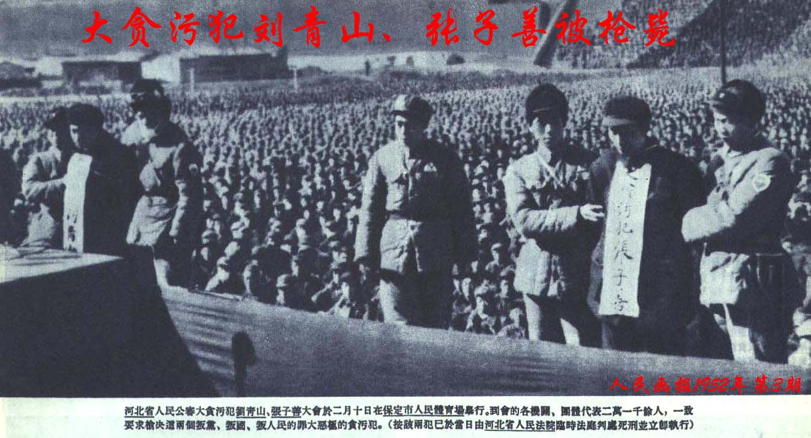
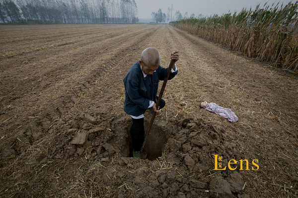
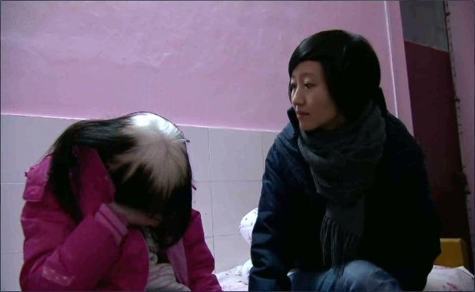
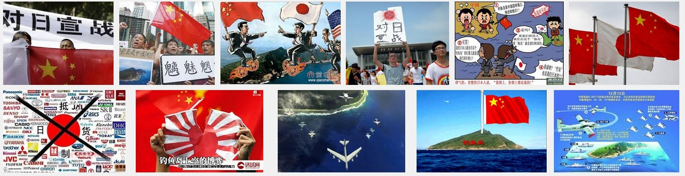
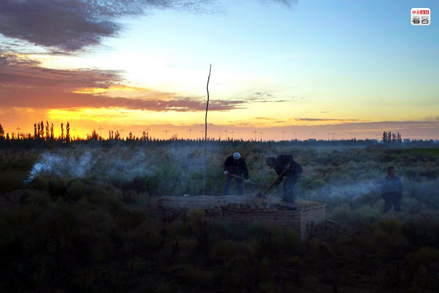
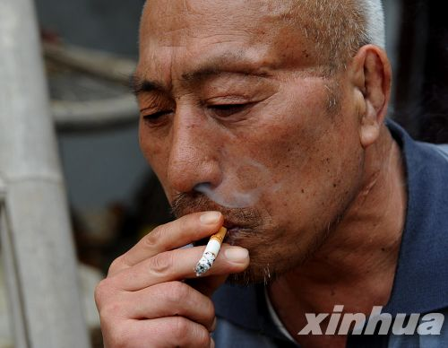
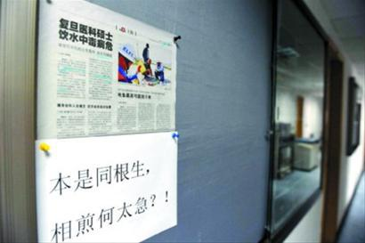

# 那些有关无关的改变·我们的2013（1-6月）

###编者按：

 

2014年已经过了3月有余，现在再去回顾2013会不会有些太晚？毕竟这个时代就像奔驰在铁轨上的列车一样，始终处在提速的状态，我们还没来得及回望，欲望，或美其名曰理想却将我们裹挟在时间的浪潮中，开始推进。与此相伴的是对于新闻遗忘的加速，袁厉害、张家叔侄、南京饿死女童、张家川、曾成杰、夏俊峰……这些在2013年曾被我们密切关注的人名或是地名现在提来却总是多了几分陌生感。

如果将这个国家比喻为一个人，在过去的几十年则是其野蛮生长的时期，2013年同样。可是那些渗透在社会的肌理中的“细胞”的变化却并非像外在形象的改变一样迅速。2013在日历上虽然被翻过去了，但2013真的消失了吗？

在我们看来，其实2013揭的幕才刚刚敞开，2013很多事件直到如今才开始慢慢发酵。2013是末日后元年，我们现在权且算是“后2013”时代。

 

我们的编辑精心梳理了2013年发生的一些重大新闻事件，并对这些事件中的问题做了一简单评析。可能当你随着这篇文章回望时，会发现很多当时给你很大震撼和触动的事情，现在却已遗忘了。不只是你，也许当时在社交网络上为这些事吵得昏天黑地的“公知”、看客们也早已将其抛进过去的时间轴。只有当今年类似的事情再发生时，有心人才会感叹，原来这些呼吁改变的事件真正得到改变的却是少有。既然如此，为什么我们在一开始就放过它们呢?

在我们以往的历史教育中， “铭记”是常被提到的词语。但铭记不仅仅是为了记忆，更是为了改变。

 

###“房家人”：运动中倒下的第一批

 

2013年年初，一家姓“房”的人得到公众关注。“房叔”、“房妹”、“房婶”，带着买不起房的无奈、带着调控楼市难以见效的焦虑，政府与民间的合力终于将这姓房的一家人统统“带走”。同月下旬，正当各省的“两会”召开之际，一位名叫黄玉彪的湖南邵阳籍民营企业家在网上发帖自曝“湖南邵阳人大选举存在大范围贿选”。此事件持续发酵，并波及到湖南其它地级市，最终结局竟是以13年12月以湖南另一地级市衡阳市512名人大代表辞职，5名省人大代表、3名市人大代表被终止代表资格、省政协原副主席童名谦被免而暂时告终——此事件因之成为年度最大“反腐”案件。

2013年的反腐成果并不止于此，从中纪委公布的年度反腐成果来看，2013年共处分违纪干部超过18万人，其中，省部级或以上高官达16人，也不乏薄熙来、李东生、蒋洁敏、李春城、刘铁男等省部级高官。因而2013年被冠上了“大规模反腐元年”的称号。

但在这个习惯以“运动”来处理问题的国家，大规模的运动是否能真正的将腐败问题根治仍待观察与反思——既然运动能解决问题，我们还要制度做什么？

同时，作为一届公民，更是要多问一句，如今民间反腐渠道真的足够宽敞吗？公民与政府在反腐上的互动应该如何操作？建立真正让官员不敢腐、不能腐、不愿腐的体系是在多远的将来呢?

 <small>1952年，共和国反腐第一案主犯被枪毙，自那年起，中共反腐已走了52年。</small>

 

###兰考大火：反思民间的力量
 

黑烟从一楼的窗户中冒了出来，即使隔着几百米远，燃烧的噼噼啪啪声音仍然听得清晰。五分钟后，火从二楼的窗户中窜了出来。直到约半小时后，9点4分，火终于被扑灭。

这是2013年1月4日的河南兰考，火灾发生在县城的一群小别墅和县人民医院家属楼包围的一个三角地，这里是袁厉害的“花园”。然而7个孩子的生命却最终留在了这个名字中透露着诗意的地方。

这场大火带走孩子生命的同时，也让“袁厉害”三字被推上全国各大报纸的头条，袁厉害的善举、袁厉害的财产、袁厉害的性格通通成了受众关注、质疑、讨论的东西。巧合的是，六天后，一条“广东揭阳市榕城区民政局工作人员‘借孤儿’应付上级检查”的新闻也被刊出，裹挟着兰考大火的愤怒，公众对政府救助孤儿不力的指责也愈发多了起来。

“政府应当保障每一名孤儿的生命与成长的顺利”，这早已是民众让渡权利、缴纳税负时与政府签订“契约”中的条例。然而政府应当做的事就一定要等政府来做？譬如你在冬夜路边发现了一名弃婴，你是先打110还是先把弃婴抱起？

当我们习惯性的依赖政府，让他主导经济、让他治理环境、让他救助孤儿时——我们往往忽视了自己的力量。譬如在救助孤儿这件事上， 各地大可自己成立NGO，公开募款，透明运行，规劝政府“购买服务”。也许，民众自己做的远比政府要好。

毕竟袁厉害抚养了孤儿，这比我们只会埋怨政府来得实际。

 <small>2011年，早在兰考大火两年前，摄影师卢广便到兰考拍摄了有关弃婴的作品，取名《命若垃圾》。</small>

 

###《看见》：这是一个怎样的时代?
 

柴静肯定没想到，她的新书《看见》会卖得这么好。这本书自柴静2001年初进中央电视台写起，将柴静自己在十数年中有意义的所见所思所感尽皆录入。2013年1月19号，西安签售，整整一个下午，五千多本的签售量，创下了图书签售的新纪录。豆瓣上，《看见》收获了8.8的高分；而在2013年一年，《看见》的销售量突破了300万册，成为2013年最为畅销的书。

在书卖得火爆的同时，公众对于柴静和她的书同样吵得不可开交，大家自愿选择，迅速站队，“砍柴派”与“挺柴派”的论战成为13年年初最热的文化事件之一。“砍柴派”诟病柴静只提供“心灵鸡汤”，却不直言核心问题。“挺柴派”则认为柴静的报道中始终充斥着人文关怀。 但无论“砍柴”还是“挺柴”，毋庸置疑的是，当人们对信息的需求越来越大、质量要求越来越高时时，提供信息的人身上的压力与责任也日益递增。

只是除去新闻专业主义的讨论，我们还奇怪为何一本书的发行能争论的这么激烈？是没有心灵根据地的人们很是热衷于“造神”与“倒神”的游戏？是因为这个时代的好书太少？还是因为这个时代好读书的人太少？

只能说，柴静遇上了最好的时代，也遇上了最坏的时代。

 <small>图片内容：柴静采访兰考大伙当事人袁厉害的女儿。 其实大多数人都忘了，柴静本身只是一个记者。</small>

 

###钓鱼岛：论持久战
 

2013年1月22日，日本公明党党首山口那津男访华，意图缓解过去一年中日钓鱼岛争端愈发激化的矛盾。这是进入13年后，中日钓鱼岛争端中出现的第一个标志性的事件。但那津男毕竟太天真，他期望的缓解不仅没有在他访问的1月得到缓解，甚至直到2014年1月，钓鱼岛上中日的较量仍不见分晓。

如果我们回顾13年的新闻，能从1月报道到12月的，也唯有中日钓鱼岛争端这一个。直到我们意图梳理这一年有关钓鱼岛的新闻时，也同样被其巨大的数量与高度同质化的内容所震惊，最终只得作罢。

这一年里， 公众对钓鱼岛事件早已没有了当初的激情，也是在对钓鱼岛争端逐渐麻木的过程中，大家才明白过来：哦~钓鱼岛争端原来并不是你死我活的较量，搞外交原来也要“打持久战”。总之黄小琥说对了：没那么简单。这时再回想12年9月在全国爆发的保钓游行，才发现玻璃质的民族自尊心，真是只能落得别人笑话而已。

爱国很好，但国家这时真的需要你的那份激情与“热心”吗？还是说，把自己的生活过好就是爱国？

 <small>2014年，在网络上搜索钓鱼岛争端，民族对抗主义的气味依然浓厚。</small>

 

###周口二次平坟：要钱还是要命？
 

“圆起来的坟必须再平，否则罚款1000元，强行掘出。”2013年2月，河南周口大大小小的乡村的广播中出现了这样的内容，与一年前大致相同。

周口的“平坟运动”发起于2012年初，以增加耕地面积、均衡城市建设用地面积为目的，数月间便平了200多万座坟墓，开辟出新耕地3万亩（这些“平坟”后利用的土地可建造约2800个足球场）。后因反对“平坟运动”被整治的河南政协委员赵克罗公开发表“忏悔书”，称因给领导添乱而道歉，“平坟运动”得到了更多媒体的关注。

在事件持续发酵的背景下，2013年年初，国务院下令全国不准强制平坟。数百万的坟头又因此迅速圆起。只是没想到短短一月后，“平坟运动”在中央命令禁止的情况下再度兴起。

周口市领导如此“大胆”也是因钱所逼：土地财政收入作为全国大多数县市地方政府最主要的财政收入来源，可以说是地方政府财政收入的“命脉”。河南作为农业大省，“18亿亩土地红线”更是成为财政收入发展最大的“掣肘”。在此背景下周口市“剑走偏锋”也就不足为奇了。

而这种政府因土地而与农民产生的博弈在全国哪个地区也不少见，土地制度改革更是各大媒体常年关注的问题。2013年11月十八届三中全会中“建立城乡统一的建设用地市场”的决定可视土地改革新的一步，未来是否能解决土地改革各大矛盾也尚待观察。唯一可确定的是，这一博弈在接下来的几年中仍会在全国各地上演。

影视剧中常见这一的场景：山野草林间，忽冲出一髯须蒙面大汉持刀大喊：要钱还是要命？！——既然人已入土，周口市政府当然要钱。

 <small>在国务院禁止平坟的命令下发后，一夜之间，周口数百万个坟头又被重新圆起。（图片来源：网易新闻）</small>

 

###微信4.5-5.0：战“马”奔腾
 　　

2013年2月5日，微信4.5发布。新增实时对讲，增加聊天群人数上限等多项功能。也许用户不会想到，以微信为首的移动端应用，在过去、现在、将来的移动端战场上早已杀红了眼。

2013年，O2O（office to online）成为各大网络公司最常提到的名词之一，在此背景下，网易推出“易聊”、阿里推出“来往”、雷军投资YY一同鏖战微信，除此之外，陌陌、QQ移动端等社交运用也在不断寻求突破以找到自己的立足之地；

在社交应用之外，百度收购的91手机助手、独立发展的豌豆荚、“背靠大树”的360手机助手的竞争也进入了白热化；“移动购物规模增165% 成网民首选方式”的背景下，淘宝、京东、当当等电商巨头也将更多的目光聚集在移动端战场。与此同时，生活实用类应用、新闻资讯类应用也是激战正酣。移动端代替PC端成为人们了解信息时新的首选媒介，就像广播击败报纸、电视取代广播那样，自然而然。

你有余额宝，我有理财通、你电商圈一家独大，我精选商品来分羹，在这一年的战场上，“二马之争”同样赚足了眼球。一家做社交运用、一家做电商，几年前的马云与马化腾看起来并不存在竞争，没想到在移动端却是狭路相逢。2014年是马年，不知两匹鏖战正酣的“战马”究竟谁输谁赢？而在他们两人的战场之外，硝烟仍在不断升腾。

 <small>从2013年开始的滴滴、快的之争在2014年2月爆发了最激烈的竞争，滴滴的背后是腾讯，而快的的主要支持者正是阿里……（图片来源：谷歌搜索）</small>

 

###冤假错案频现：法律究竟代表谁？
 　　　

2013年3月26日，张辉、张高平叔侄二人终于卸下了背了10年的“枷锁”。

十年前的5月19日，安徽籍17岁女孩王冬在杭州被人杀害，公安机关经侦查认定此案系张辉、张高平叔侄所为。第二年4月，杭州市中院以强奸罪判处张辉死刑、张高平无期徒刑，同年10月19日，浙江省高院终审改判张辉死缓、张高平有期徒刑15年。申诉十年后，叔侄二人终于得以洗去冤屈。

回顾此案，侦查、批捕、刑拘到审判皆有漏洞：本该互相监督、独立办案的公检法办案人员对疑点熟视无睹，“女神探”只往有罪方向推定，警至违法使用“牢头狱霸”和刑讯逼供，法官“留有余地”判死缓，为掩盖一个错误而制造更多更大的错误。

除了张辉、张高平叔侄二人，2013年中得以沉冤昭雪的还有陈建阳等五萧山青年、河南平顶山李怀亮、福建福清、陈科云及司机2人、安徽蚌埠的于英生等。而他们分别受冤坐牢16年、10年、9年、17年……

而这一年中沉冤昭雪的几人是否是这一法制悲剧的冰山一角？为何本该维护社会正义的法律却造成了如此多的冤案？“有罪推定思想还未根除”、“警方非法取得证据”、“法官受到外界多种压力”、“行政干预司法“皆可成为这个问题的解答。只是当我们着手进行每一个改革时，却发现其存在的根据错综复杂，更是难以下手。

这一年，法律界针对上述问题的反思不少。年末的三中全会也提出“健全司法权利运行机制，健全司法权利分工负责、互相配合、制约”的决定，只是我们不能再等，法律本该是公平、正义、良知的代名词，让法律成为社会真正的底线，我们一天也不能多等。

 <small>2010年的赵作海案是近几年最受关注的平凡冤案之一，据报道，因为赔偿款分割、亲人离去等原因，恢复自由后的赵作海生活并不幸福。（图片来源：新华网）</small>

 

###逝者：改革者
 

2013，这一年有很多人去世，留在他们身后的，有哀悼，有唏嘘，有怀念，也有惋惜。但有一个人却不用我们惋惜——他所创造的，皆被一一继承，并仍在创造新的历史。

他是吴仁宝。

2013年3月18日，华西村老书记吴仁宝去世。吴仁宝的葬礼延续了他一生受用的风格：按照事先布置，重要领导、外来领导、无锡市、江阴市领导、江阴机关干部共436人，依次占据主席台前方最中央的位置——这是他在政治上游刃有余风格的最终体现；得知老书记逝世当晚，百余村民就自发聚集到其家门口，等待分配任务。次日上午，打了几个弯的吊唁队伍充塞了村里的长廊，人们要排两个半小时的队才能来到老书记遗体前行礼——这也是吴仁宝作为乡里间的“道德楷模”、致富领导者的例证。

1983年，吴仁宝以55岁的“高龄”再出发，在他的个人历史中，开始了农民企业家的新时代。20年后，吴仁宝退休。卸下华西村党委书记的他，给华西村留下了当仁不让的“天下第一村”的美誉。而围绕在吴仁宝身旁的争论无论是在他的生前还是身后从未停歇：是否是搞家族制？没有节假日的规定是否损害了村民的自由？华西村的富裕是否是国家政策性投入的结果？

或许南方周末记者文平给吴仁宝的名号最为公道——江南士绅。

而一个多月后逝世的李经纬的葬礼则让人唏嘘，这位在当年可与吴仁宝并列的企业家的葬礼则要低调的多。李经纬的灵堂，设在三水市位于区政府对面一栋破旧的单元楼内，楼道口的铁门上则是锈迹斑斑。

这位孤儿在80、90年代以他少有的智慧与魄力创造了“东方魔水”的神话——将广东佛山一个发不起工资的酒水厂发展成为享誉全球的健力宝品牌。

“健力宝是中国传统关系孕育出来的现代产品，而李经纬则是导演这一成就的魔法师。”傅高义如此评价。

吊诡的是，李经纬作为改革开放后的著名企业家而闻名，却因“国家工作人员”身份而获贪污罪。2000年左右，为了筹备上市，饮料厂改制。为了赶在转制之前处理，李经纬与众高管决定以全体职工买保险的方式来处理账上一笔员工福利基金。2002年10月，李经纬被举报。直到2011年，佛山中院作出一审判决，李经纬以贪污罪被判处有期徒刑15年，并处没收个人财产人民币15万元。判决的理由是，“被告人李经纬为受国有单位委派到任职单位从事公务的国家工作人员，在从事公务期间，利用职务之便，伙同他人将本单位财物非法占为己有”。

74岁，他戴罪离世。

李经纬的悲剧来源于中国从计划经济向市场经济转轨中不可避免的矛盾：因为产权不清、身份不明，许多国有企业和国企高管身份暧昧，权责模糊。往往在遇到问题需要追究责任时，两方却皆有“站得住脚的理由”。

与李经纬经历相同的是褚时健，他51岁执掌玉溪卷烟厂后，一手将企业做成中国第一，世界第三，却在1995年被人举报，女儿在狱中自杀；1999年，褚时健因贪污被判无期徒刑，后减为17年有期徒刑。而后在2002年因糖尿病保外就医。出狱后的褚时健并没有“退隐”，却是选择在云南哀牢山上种橙子，2008年，他种下的褚橙热销；2012年，他的8000吨橙卖了近3000万纯利润。其中的200吨进入北京市场后，引发热议……

 

吴仁宝、李经纬、褚时健三人皆是中国发轫于70年代末至今的改革中的先锋，40年，我们从他们的经历中看到风云际会，波澜壮阔，也看到壮怀激烈，憾隐江湖——这就是历史。然改革未竟，2013年11月末，中共在十八界三中全会后发起又一轮的改革历程，只是我们在行步之前，需要记下这些改革者的名字与他们为改革所下的注脚。

“你无法想象在改革开放的那个年代，他曾经带给我们多少精神激励。就像一面旗帜。”李经纬的辩护律师王波在接受《南方周末》采访时如是说。

 <small>2002年1月15日，李经纬送别自己一手创办的健力宝。在当时的新闻发布会上，他含泪仰天，不发一语，令观者动容。 （新华社记者 刘大伟/图   图片来源：南方周末）</small>

 

###复旦寝室投毒案： 重弹大学生心理健康问题
 

2013年4月1日，复旦大学研究生黄洋出现身体不适，当晚入院治疗后病情加重，16天后在医院去世。当月11日，上海警方在黄洋的寝室饮水机残留水中检测出有毒物质。黄洋病发12天后，警方基本认定黄洋室友林某存在重大作案嫌疑。

2014年2月18日，上海市第二中级人民法院对"复旦投毒案"依法公开一审宣判，被告人林森浩犯故意杀人罪被判死刑，剥夺政治权利终身。

此案件的特殊使其很快成为舆论的焦点。名校光环与稀有毒药，与之相关的话题当即引爆社交网络。到16日，相关微博已经超过16.7万条。“因为琐事就引发舍友相弑”，嫌疑人这样的动机让人惊讶，另一方面，很多人回帖称“我也曾经想干掉我的室友”、“幸好我杯子随身携带不然早就没命了”。这些半真半假的跟帖背后，表现的是大学生对寝室人际关系的焦虑和担忧。

复旦投毒案因特殊引起关注，但案件背后的普遍性问题更值得重视：一出现校园恶性案件，大学生的心理问题就会成为关注热点。但在数据上看，一次次的关注没有显著改善大学生的心理健康。北京社会心理研究所和北京高校学生心理素质研究中心在2002年的一次大规模调查中的数据表明有16.51%的大学生存在中度以上的心理健康问题。而十年后，据《2010-2011年度中国大学生心理健康调查报告》显示：分别有27%、66%的大学生认为自己经常或偶尔有心理方面的问题。

大学生曾是社会公认的“天之骄子”，重点大学的学生更是众人捧出的精英，但其中一些人呈现出的心理和人格却是脆弱而病态：仅仅因为生活琐事，就对室友痛下杀手。

这已经不再是一个新鲜话题，有意思的是我们发现从十七年前的朱令案件，到马加爵事件，类似为公众所熟知的大案没有中断过。大学里的心里资讯室、教学楼下的心理健康自查仪、甚至5月25日确定为全国大学生心理健康日。无论是校方还是社会都在不断努力尝试，但是我们看到的收效却是甚微。

这时该去追问究竟是什么样的社会风气，什么样的环境制度，让精英残缺，出现了这种“高能力低品德”的局面？当精英残缺，谁又能保证普通人的健全？或者说，传统意义上的精英也许需要重新定义。

当社会不能给公众足够的安全感，个体的生活则会小心翼翼、如履薄冰。“特殊”案件的出现当是一种警告，更是不稳的信号。然而安全感从何而来？不仅仅来自人心，来自信任，更需要稳定的制度和更负责任的教育者。

 <small>（投毒事件后，复旦某教授在实验室门口贴上的十个大字 图片来源：《新闻晚报》 ）</small>

 

###保卫幼女：嫖宿幼女与强奸罪
 

2013年5月18日，海南万宁市第二小学原校长陈在鹏和万宁市住房保障与房产管理局工作人员冯小松带六名小学女生开房，很快，相关新闻引爆舆论。15天后，广州雷州又曝小学校长涉嫌强奸两女生案。此类事件在互联网上传播时包含了人们难以遏制的愤怒。与此同时，一场关于“嫖宿幼女罪”与“强奸罪”的讨论也由此展开。

我国刑法对与十四岁以下的女童发生性交易关系定义为“嫖宿幼女罪”。但同时，刑法又规定与十四岁以下女童发生性关系，不管幼女是否同意，皆为强奸罪。两者量刑大为不同：前者最高刑罚为15年，而强奸罪最高可判死刑。

近年来，学界不少专家一致在呼吁取消“嫖宿幼女罪”。将其并入强奸罪。除量刑外，该罪名的设立也是对幼女人格上的伤害：“嫖宿幼女罪”字面上有歧视之意，把幼女划分为“良家幼女”和“卖淫幼女”两类，甚至有学者把幼女称为“雏妓”。从这方面讲，不论是法律还是舆论，对于受害幼童而言都是二次伤害。被侵害的女孩受到加害者的胁迫和利诱，不知如何表达，反而多会转向内心的自责和羞耻。

全国妇联公布的数字显示，1997年以后，各地投诉的未成年人遭受性侵害个案呈急速增长趋势。而1997年，正是“嫖宿幼女罪”从《刑法》强奸罪里单拎出来的年份。

《新京报》曾在儿童节当天发表社论说：在给孩子们送上最美好祝福的同时，我们这些大人也应在这特殊的日子，对孩子说声“对不起”。

让孩子免予伤害，是每一个人的责任。性侵、伤害孩子的不法之徒，当然要依法惩处，然而，孩子的监护人、校方、行政部门乃至整个社会也要为没有保护好孩子而感到愧疚。但或是，行动更优于一万句对不起。

 <small>（图片来源：《Visita看天下》）</small>

 

###南京饿死女童：自以为称职的努力
 

2013年6月21日上午9点，南京某小区的一所房门被打开后，一股异味扑面而来。在没有窗户的卧室里，民警看到了李氏姐妹已经风干的、幼小的尸体。一岁的小女儿躺在床上，2岁多的大女儿则在卧室门口。她似乎想用尽力气打开门，但没有成功——门缝里被她们的母亲乐燕塞上了尿布。即便是成年人，也要费很大劲才能推开……

母亲毒瘾不断，父亲坐牢后两名女童基本处于自生自灭的境地。三个多月中，李氏小姐妹曾迸发出弱小但足够坚忍的求生本能：她们曾逃出家门，也在生命的最后时刻拍打门窗求助。虽然邻居、民警、社区和亲戚也都曾作出他们自认为称职的努力：警察将曾侥幸逃脱的姐姐交还给吸毒母亲；一位担心“惹麻烦”的邻居最终退还了李家的钥匙；社区以不符合政策拒绝将其送往孤儿院。拯救李氏姐妹的机会却被一次次地错过。

这起家庭悲剧上演，留下太多未竟之问：如果父母枉为人亲，孩子就该处在“孤岛”上，生如草芥？众人心里早有猜测，这样下去早晚会出事。然而猜测着，猜测着，迟迟不见行动，悲惨结局却已然酿成。

闾丘露薇在此事件后评论道：“正常情况下，目击者报警，警方介入后，将孩子送去福利机构，同时检控监护人，由法庭决定其是否还有抚养能力。如有，则社工持续跟进，没有，孩子在福利机构等待合法领养。”

只不过，所有假设，依赖一个凄凉前提———“正常情况下”。

据媒体最新报道，饿死女童母亲乐燕临盆在即，她的第三个孩子的去向未定。我们心里不禁闪过一些怀疑和苦涩，一是因为前车之鉴，我们已经难以信任乐燕能真正的担起一个母亲本有的责任。二是我们疑惑，如果社会的保护网没有建立，人人都只能做出自以为称职的努力，南京幼童死亡案就会是悲剧的终点么？

 <small>（2013年9月3日，刚出狱不久的女童父亲李文斌坐在家里  图/CFP）</small>

 

###湖北钟祥集体围攻监考人员：“高考强县”是如何养成的
 

2013年6月8日高考结束的铃声敲响的一刻，湖北省钟祥市的学生和家长一起涌向钟祥三中校内的考点办公室。他们的目的是为了报复那些“不通情理”的外地监考老师。愤怒的人群首先开始谩骂，随后拿起文具袋投掷老师。54名监考者抱着试卷躲进了考点的一间阶梯教室，但很快阶梯教室的玻璃被石块打破……

这是我国高考制度自1977年恢复以来首次出现监考老师被考生父母集体围攻。而事发地钟祥，则是闻名湖北省的高考强县。

在钟祥市，政府追求“政绩”，家长追求“成绩”，高升学率成了双方的共识。为了高考，政府点头默许，老师帮助作弊，家长购买答案，学生“武装”上场，这是一条全自动化生产线。生产出来的是贴上了合格标签的“假冒伪劣品”。

市长林长洲曾先后用“教育招牌”、“教育品牌”、“教育名牌”三个词总结钟祥中学教育的成果。但在笔者看来，这三块牌子其实仅是一块字里行间写着虚假、牟利和作弊的伪招牌。政府为了“高考强县”这块金灿灿的牌匾而弃所有学生而不顾。尊严、制度、公平、这些本该更加耀眼的词语却被蒙上灰尘。家长们看似什么都做到了，却唯独遗忘了青年的自我人格养成。

现在这场幻梦将要终结，且已经到了最后一分钟。只是那些学生们，当他们说出自己来自湖北钟祥，又如何面对他人疑惑的目光？

 <small>（曾经的高考励志语在湖北钟祥事件后似乎成为了一个笑话  图片来源：荆楚网）</small>

（感谢项栋梁、刘一舟对此文的贡献）

（欲看本专题其他稿件，请点击文章题目下的“2013年度新闻事件”按钮，与我们共同回望我们的2013。）

（撰稿：李卓 孙玉霞  编辑：李卓  责编：李卓）