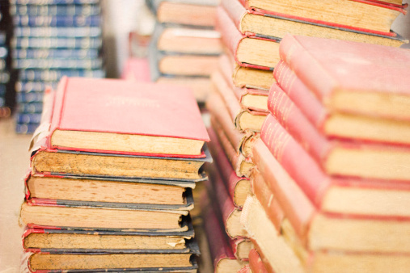
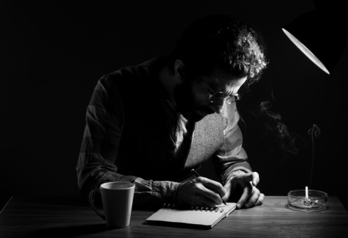

# 我们离文学太远，是因为我们从未走近历史

** **

#### （一）

文学到底离我们有多远？在莫言获得诺贝尔奖时，民族自豪感、调侃、热销断货还是我能看见的关键词。如果没有这次得奖，我还从未感觉到，文学离我们是如此的远。

莫言的书我一本也没看过，而村上春树的书却看了不少。村上讲述了青年人的困惑与迷茫。在这个快节奏的社会里，我们只有在听《挪威的森林》的音乐时，我们才可以逃离这个世界；我们只有在主人公说：“我是个没有私欲的人，有的只是好奇心，只是想在那广阔无边而险象环生的世界里一显身手罢了”时，才隐约觉察到自己内心隐秘的欲望。但我没看过莫言的作品，对他笔下那个神秘的山东高密知之甚少。我仅有的了解，就是电影《红高粱》里热到沸腾的太阳以及红高粱遮挡下神秘的原始欲望。

为什么，在我的阅读历史中，会本能地选择村上，而不是莫言？除了村上书里触目惊心的性描写之外，也因为村上描写的高节奏、混乱与无奈的世界离我们很近，甚至就是我们的生活。而莫言书里那些古老的乡村和土地，对我们来说感到越来越陌生。因为我们不了解历史，因为我们和历史之间，缺少了一个钩子，把我们钩住，哪怕是钩得血肉模糊，但是历史从此真实地站在你眼前，流着血裸露出骨头。只有了解历史，我们才能和文学产生亲近感。

#### （二）

多年前，我囫囵吞枣地看完《中国历代文学史》，但它并没有给我留下太多的思考。我能记得的就是那个有点没完没了的炎热夏天，知了在头顶上叽叽喳喳地叫个不停，整个夏天都分外漫长。还有当时半生不熟的古文，得多半靠着书上的译文才能看完。我第一次看古文时，拿着书跟我爸说：“这句子语法有错误。”可是我记住了“煮头三日，三夕，不烂。头踔出汤中，踬目大怒”，在当时看来，这就是一篇恐怖小说。可是，为什么我会把它看成是恐怖小说呢？

我第一次读《聊斋》，看的是白话译文版，对里面的《蛇人》印象最深。当时译文写二青出没，张开血盆大口，诸如此类的描写，让人紧张害怕。后来我再看原文，却只有一句“蛇暴出如风”而已。再后来我看《唐诗三百首》和《千家诗》，到现在还可以依稀记得“绿树阴浓夏日长，楼台倒影入池塘”这样的句子，完全是因为看那本诗集，刚好是一个炎炎夏日。我在学校上语文课，语文老师说鲁迅的文章是匕首投枪，恰好我家里有一套鲁迅杂文集，我回去火急火燎地看完了一整套，看来看去也没看出“投枪”和“匕首”在哪。可是，为什么我会找不到“投枪”和“匕首”？

后来我看《围城》，一度以一天到晚插科打诨、懦弱犹豫的方鸿渐为偶像。我刚看古龙，以为他笔下塑造的只是一个武侠世界，后来再看，才越发明白，那就是一个现实的世界。以前我看张爱玲，看到范柳原对白流苏的那句“这堵墙，不知为什么使我想起地老天荒那一类的话。如果有一天，我们的文明整个的毁掉了，什么都完了—烧完了，炸完了，坍完了，也许还剩下这堵墙”便沉浸在“地老天荒”的浪漫里，可是现在我再读上几遍，却感觉一些人的生活总被另一些人的欲望所摧毁。

可是，我为什么总是会有“我现在再读才明白”的感觉？为什么不能完全理解小说的真正意义，还原小说的真正面貌？为什么之前所有的阅读经验全部被过度解释成语文书上的中心思想？

#### （三）

前几天我看刘震云《我不是潘金莲》。这本书讲述了一个上访的故事。主人公几经周折，带点心酸无奈的经历，就像显微镜下一个微小的截片，精准地反映了我们这个社会隐秘的无奈和现实。《活着》讲述的苦难，你没有经历那个巨大的时代变迁，没有经历过真正的饥饿，是很难理解书里所写的光怪陆离的世界的。因为那一段历史离我们很远，我们没有机会走进它。所以，在我读苏童时，读到的是压抑和孤独，却不是人类自身对世界的恐惧。

后来我看野夫的《乡关何处》，看到“即使他们今生不再聚首，那他也要遥远地去分担她的孤独和折磨。现在看来，他爱上了爱情本身”这句几乎热泪盈眶。他讲述了一个你经验之外的世界，然后你可以看到那个世界的人在如何生活，在面对苦难时，是坚强，还是隐忍退缩。而这一切的背后，你可以在故事里找到最初的动机，从头到尾的因果。

所以，在《文武北洋》里，才会看见孙文说过“故欲治民国，非具新思想、旧经练、旧手段者不可，而袁总统适足当之”这样的话。才明白每一个选择背后，都有着血淋淋的真实。所以看卡佛时，我刚开始被波澜不惊的情节感染得几乎睡着，但是当看到结尾时，才感觉小人物的生活其实就是这样的。生活是琐碎的，洗衣做饭看孩子，你看的时候就感觉生活是一个乱糟糟的垃圾场，但是你总能从垃圾场里看见小时候爱不释手的玩具。

就像每一段历史，都应该有各种不同角度的解读和记录。就像《恶童日记》讲述两个兄弟在艰困的环境中成长，为了让自己变得坚强，两人每日以互相打骂对方、绝食等各种方式锻炼生存本领。行文中的冷酷让人第一次直面战争给人类带来的痛苦。好的文学总会让你不自觉地想到自己，反省自己。你会看见人人都具备的善与恶。你会从好的文学当中一一找到依据，从而在以后的生活里，看见善与恶，变得更加宽容与善于理解。而文学主题永远是记录每一个阶段人的精神状态，迷茫、困惑以及苦难和不公。

文学会丰富我们的直觉，这个直觉下面是历史。当我们对自己的历史足够自知，文学才会真正的走近我们。每年都会有诺贝尔新闻的报道，几乎是万众期待，中国的文学能求得别人认可。这是国民教育的成功，公民教育的失败。这个社会还需要让人们看到更多真实的东西，就像脚踩在泥土里，烙下一个脚印，怎么走过来的，一回头就能看见轨迹。得了解我们这个国家的细细碎碎的轨迹，去反思。看《延安日常生活中的历史》，看《红太阳是怎样升起的》与《张力与界限》，你就了解了一个多面的延安，一个多面的“革命”。一个二战有多少反思的书籍和电影，而我们的文革至今是隐晦的，成为诋毁政权的一段马赛克。我们就像《朗读者》里不识字的汉娜，需要依靠别人朗读了来获取真实的感受。

#### （四）

《前朝梦忆》的书名，有一种挂满“时光”的感觉。你拿起一本书，还得拂一下上面的灰尘，然后才能看见一个人的历史沸扬在灰尘里。原来张岱是这样一个人。看到张岱有“琅嬛福地”的描写，才恍然想起金庸写的那个武学书籍的福地来。我想起《黑夜飞行》的封面，杂乱的霓虹牌子，虽然天还没亮，但是靠着一点霓虹光亮，或许我们还可以飞行一段。别小看这段，也许，也许你就看到了一个单纯唱歌的夜总会，一个琅嬛福地。

我们常有一种非好即坏的判断。不一定毛姆写的就牛逼，也不是可能看不太懂的卡尔维诺或者昆德拉就一定是经典。关键是我们很少了解作品传达的意义，更不了解作者所处的时代，所处国家的历史。我们很少关心历史，关心生活，关心人类最基本的感知和直觉。就像当初看《圣诞忆旧集》一样，感觉时光荏苒，很多美好的场景一一呈现，但我却绝少看见我们记忆中的春节。我们的历史已经在一轮轮的急进里丧失，我们能记住的是楼价，是诺贝尔，是钓鱼岛，因为我们对我们自己关心太少，对自己历史了解太少。因为我们自己还没有太好，就着急想要一个更大的集体——比如国家或者民族变得更好。

 

（采编：黄梅林；责编：徐海星）

 
